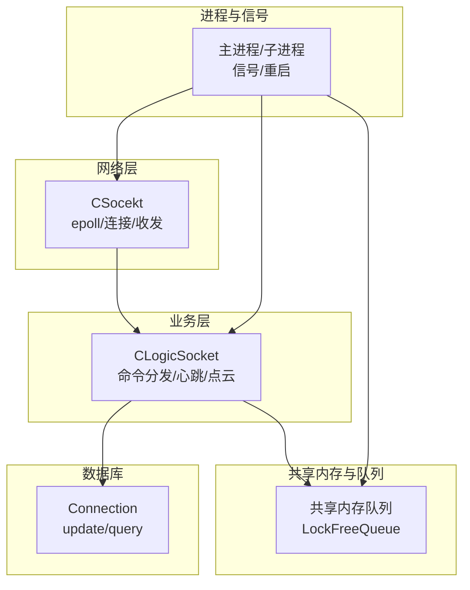
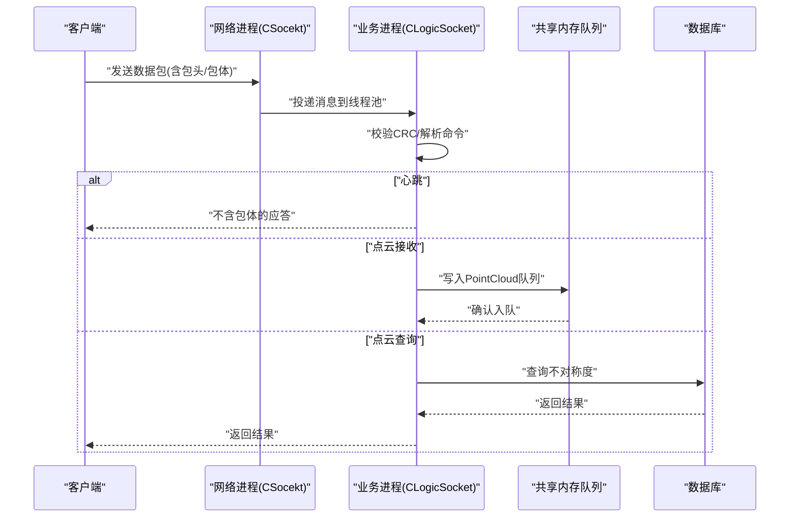
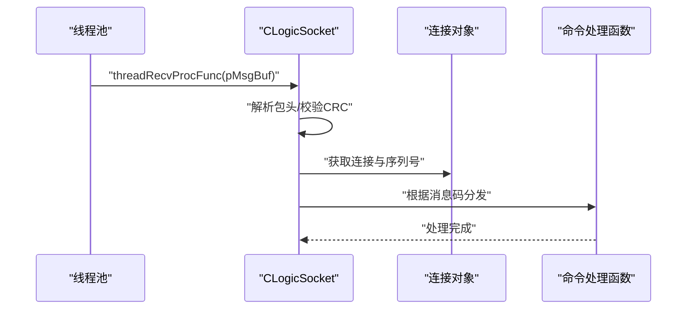
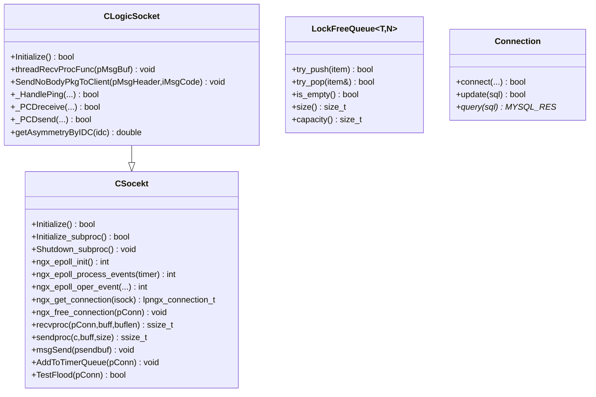
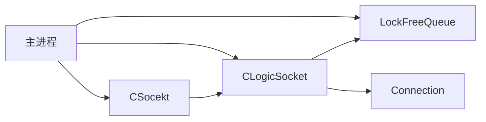

# API 参考文档

<cite>
**本文档引用的文件**
- [include/ngx_c_socket.h](file://include/ngx_c_socket.h)
- [net/ngx_c_socket.cxx](file://net/ngx_c_socket.cxx)
- [include/ngx_logiccomm.h](file://include/ngx_logiccomm.h)
- [include/ngx_comm.h](file://include/ngx_comm.h)
- [include/ngx_global.h](file://include/ngx_global.h)
- [include/ngx_shared_memory.h](file://include/ngx_shared_memory.h)
- [include/ngx_lockFreeQueue.h](file://include/ngx_lockFreeQueue.h)
- [include/ngx_c_slogic.h](file://include/ngx_c_slogic.h)
- [logic/ngx_c_slogic.cxx](file://logic/ngx_c_slogic.cxx)
- [include/ngx_mysql_connection.h](file://include/ngx_mysql_connection.h)
- [persist/ngx_mysql_connection.cxx](file://persist/ngx_mysql_connection.cxx)
- [include/ngx_func.h](file://include/ngx_func.h)
- [include/ngx_macro.h](file://include/ngx_macro.h)
- [include/ngx_c_conf.h](file://include/ngx_c_conf.h)
- [proc/ngx_process_cycle.cxx](file://proc/ngx_process_cycle.cxx)
</cite>

## 目录
1. [简介](#简介)
2. [项目结构](#项目结构)
3. [核心组件](#核心组件)
4. [架构总览](#架构总览)
5. [详细组件分析](#详细组件分析)
6. [依赖分析](#依赖分析)
7. [性能考量](#性能考量)
8. [故障排查指南](#故障排查指南)
9. [结论](#结论)
10. [附录](#附录)

## 简介
本文件为 PointServer 的全面 API 参考文档，覆盖网络通信、业务逻辑、共享内存与无锁队列、数据库操作、进程与信号管理等模块。重点说明公共接口的函数签名、参数定义、返回值、使用示例、错误处理与性能注意事项，并对关键数据结构（如 ngx_connection_t、PointCloud、COMM_PKG_HEADER、STRUC_MSG_HEADER 等）进行深入解析。同时提供版本兼容性、废弃功能迁移指南与最佳实践。

## 项目结构
项目采用多模块分层组织：
- include：公共头文件，定义数据结构、宏、类接口声明
- net：网络层实现（epoll、连接管理、收发）
- logic：业务逻辑（命令分发、心跳、点云收发）
- persist：数据库连接与连接池
- proc：主进程生命周期、子进程管理、信号处理
- misc：线程池、无锁队列、内存与 CRC 工具
- app：入口与配置辅助

图表来源
- [include/ngx_c_socket.h](file://include/ngx_c_socket.h#L103-L255)
- [include/ngx_c_slogic.h](file://include/ngx_c_slogic.h#L13-L37)
- [include/ngx_shared_memory.h](file://include/ngx_shared_memory.h#L65-L84)
- [include/ngx_mysql_connection.h](file://include/ngx_mysql_connection.h#L9-L35)
- [proc/ngx_process_cycle.cxx](file://proc/ngx_process_cycle.cxx#L103-L121)

章节来源
- [include/ngx_c_socket.h](file://include/ngx_c_socket.h#L1-L258)
- [include/ngx_c_slogic.h](file://include/ngx_c_slogic.h#L1-L40)
- [include/ngx_shared_memory.h](file://include/ngx_shared_memory.h#L1-L193)
- [include/ngx_mysql_connection.h](file://include/ngx_mysql_connection.h#L1-L35)
- [proc/ngx_process_cycle.cxx](file://proc/ngx_process_cycle.cxx#L1-L200)

## 核心组件
- 网络通信与连接管理：CSocekt 提供 epoll 初始化、事件处理、连接池、发送队列、心跳与安全策略
- 业务逻辑：CLogicSocket 继承自 CSocekt，实现命令分发表、心跳处理、点云收发、发送不含包体的应答包
- 共享内存与无锁队列：定义点云与结果数据结构，提供多生产者/消费者队列
- 数据库：Connection 提供连接、更新与查询接口
- 进程与信号：主进程管理子进程、信号处理、队列监控与负载均衡

章节来源
- [include/ngx_c_socket.h](file://include/ngx_c_socket.h#L103-L255)
- [include/ngx_c_slogic.h](file://include/ngx_c_slogic.h#L13-L37)
- [include/ngx_shared_memory.h](file://include/ngx_shared_memory.h#L24-L84)
- [include/ngx_mysql_connection.h](file://include/ngx_mysql_connection.h#L9-L35)
- [proc/ngx_process_cycle.cxx](file://proc/ngx_process_cycle.cxx#L103-L121)

## 架构总览
PointServer 采用“主进程 + 多子进程 + 无锁队列”的流水线架构：
- 主进程负责进程生命周期、信号、队列监控与负载均衡
- 网络进程负责连接接入、收发与心跳
- 镜像/ICP、结果计算、持久化分别由独立进程处理
- 通过共享内存队列解耦各模块，降低锁竞争

图表来源
- [net/ngx_c_socket.cxx](file://net/ngx_c_socket.cxx#L1-L200)
- [logic/ngx_c_slogic.cxx](file://logic/ngx_c_slogic.cxx#L76-L129)
- [include/ngx_shared_memory.h](file://include/ngx_shared_memory.h#L65-L84)
- [include/ngx_mysql_connection.h](file://include/ngx_mysql_connection.h#L16-L35)

## 详细组件分析

### 网络通信 API（CSocekt）
- 初始化与事件循环
  - 初始化监听端口与 epoll
  - epoll 等待与事件处理
  - 事件增删改操作
- 连接管理
  - 连接池初始化/回收
  - 获取/归还连接
  - 通用连接关闭
- 发送与接收
  - 接收数据专用函数
  - 发送数据专用函数
  - 发送队列与发送线程
- 心跳与安全
  - 心跳超时检测
  - 防洪攻击检测
  - 计时队列与定时清理

函数与成员变量概览（节选）
- 初始化与事件
  - Initialize(): bool
  - Initialize_subproc(): bool
  - Shutdown_subproc(): void
  - ngx_epoll_init(): int
  - ngx_epoll_process_events(timer: int): int
  - ngx_epoll_oper_event(fd, eventtype, flag, bcaction, pConn): int
- 连接管理
  - initconnection(): void
  - clearconnection(): void
  - ngx_get_connection(isock: int): lpngx_connection_t
  - ngx_free_connection(pConn: lpngx_connection_t): void
  - inRecyConnectQueue(pConn: lpngx_connection_t): void
  - ngx_close_connection(pConn: lpngx_connection_t): void
- 收发处理
  - recvproc(pConn, buff, buflen): ssize_t
  - sendproc(c, buff, size): ssize_t
  - msgSend(psendbuf: char*): void
  - ngx_wait_request_handler_proc_p1(pConn, isflood): void
  - ngx_wait_request_handler_proc_plast(pConn, isflood): void
- 心跳与安全
  - AddToTimerQueue(pConn: lpngx_connection_t): void
  - GetEarliestTime(): time_t
  - GetOverTimeTimer(cur_time: time_t): LPSTRUC_MSG_HEADER
  - DeleteFromTimerQueue(pConn: lpngx_connection_t): void
  - clearAllFromTimerQueue(): void
  - TestFlood(pConn: lpngx_connection_t): bool
- 线程
  - ServerSendQueueThread(threadData): void*
  - ServerRecyConnectionThread(threadData): void*
  - ServerMoveQueueThread(threadData): void*
  - ServerTimerQueueMonitorThread(threadData): void*

数据结构要点
- ngx_connection_t：连接对象，包含 fd、监听指针、读写处理器、epoll 事件、收发缓冲、心跳与安全计数、回收时间等
- STRUC_MSG_HEADER：消息头，记录连接指针与序列号，便于校验连接有效性
- COMM_PKG_HEADER：包头，包含包总长度、CRC32、消息类型代码

章节来源
- [include/ngx_c_socket.h](file://include/ngx_c_socket.h#L103-L255)
- [net/ngx_c_socket.cxx](file://net/ngx_c_socket.cxx#L1-L200)
- [include/ngx_comm.h](file://include/ngx_comm.h#L19-L25)
- [include/ngx_global.h](file://include/ngx_global.h#L38-L44)

### 业务逻辑 API（CLogicSocket）
- 命令分发
  - threadRecvProcFunc(pMsgBuf: char*): void
  - statusHandler[]：命令到成员函数指针的映射
- 心跳处理
  - _HandlePing(pConn, pMsgHeader, pPkgBody, iBodyLength): bool
  - SendNoBodyPkgToClient(pMsgHeader, iMsgCode): void
- 点云处理
  - _PCDreceive(pConn, pMsgHeader, pPkgBody, iBodyLength): bool
  - _PCDsend(pConn, pMsgHeader, pPkgBody, iBodyLength): bool
  - getAsymmetryByIDC(idc: string): double

调用流程（命令分发）

图表来源
- [logic/ngx_c_slogic.cxx](file://logic/ngx_c_slogic.cxx#L76-L129)
- [include/ngx_logiccomm.h](file://include/ngx_logiccomm.h#L6-L29)

章节来源
- [include/ngx_c_slogic.h](file://include/ngx_c_slogic.h#L13-L37)
- [logic/ngx_c_slogic.cxx](file://logic/ngx_c_slogic.cxx#L34-L76)

### 共享内存与无锁队列 API（LockFreeQueue 与数据结构）
- 数据结构
  - PointCloud：序列化点云数据、长度、ID、姓名、年龄、性别、fd
  - MirrorICPPointCloud：镜像/ICP处理后的点云及长度
  - ResPointCloud：结果点云（含不对称度）
  - ResToNetwork：返回网络的结果（含 fd）
- 队列类型别名
  - NetworkToMasterQueue、MasterToMirorProcessQueue、MirorProcessToMasterQueue、MasterToResProcessQueue、ResProcessToMasterQueue、MasterToPersistProcessQueue、AsymmProcessToMaterQueue、MasterToNetworkQueue
- 无锁队列 LockFreeQueue<T,N>
  - try_push(item: T&&): bool
  - try_pop(item: T&): bool
  - is_empty(): bool
  - size(): size_t
  - capacity(): size_t

共享内存队列初始化与销毁
- open_shm_queue<T>(shm_name: char*, size): T*
- destroy_shm_queue<T>(queue: T*, shm_name: const char*)

章节来源
- [include/ngx_shared_memory.h](file://include/ngx_shared_memory.h#L24-L181)
- [include/ngx_lockFreeQueue.h](file://include/ngx_lockFreeQueue.h#L4-L150)

### 数据库操作 API（Connection）
- 连接
  - connect(ip: string, port: unsigned short, user: string, password: string, dbname: string): bool
- 更新
  - update(sql: string): bool
- 查询
  - query(sql: string): MYSQL_RES*

章节来源
- [include/ngx_mysql_connection.h](file://include/ngx_mysql_connection.h#L9-L35)
- [persist/ngx_mysql_connection.cxx](file://persist/ngx_mysql_connection.cxx#L1-L56)

### 进程与信号 API（主进程）
- 子进程管理
  - ngx_start_worker_processes(): void
  - ngx_spawn_process(procNum, pprocName): int
  - ngx_network_process_cycle(inum, pprocName): void
  - ngx_mirror_process_cycle(inum, pprocName): void
  - ngx_result_process_cycle(inum, pprocName): void
  - ngx_persist_process_cycle(inum, pprocName): void
- 信号与生命周期
  - ngx_init_signals(): int
  - ngx_master_process_cycle(): void
  - ngx_register_signal_handlers(): void
  - ngx_signal_handler(signo): void
- 共享内存队列初始化
  - ngx_register_signal_handlers(): void
  - ngx_init_shared_memory_queues(...): void
  - ngx_monitor_queue_load(...): int
  - ngx_process_data_transfer(...): bool

章节来源
- [proc/ngx_process_cycle.cxx](file://proc/ngx_process_cycle.cxx#L103-L121)
- [proc/ngx_process_cycle.cxx](file://proc/ngx_process_cycle.cxx#L123-L200)

### 关键数据结构定义与复杂度
- ngx_connection_t
  - 字段：fd、listening、rhandler/wandler、events、curStat、dataHeadInfo、precvbuf/irecvlen/precvMemPointer、logicPorcMutex、iThrowsendCount/psendMemPointer/psendbuf/isendlen、inRecyTime、lastPingTime、FloodkickLastTime/FloodAttackCount/iSendCount、next
  - 复杂度：连接池原子计数与互斥保护，避免全局锁竞争
- COMM_PKG_HEADER
  - 字段：pkgLen、crc32、msgCode
  - 复杂度：定长结构，内存对齐为 1 字节，紧凑布局
- STRUC_MSG_HEADER
  - 字段：pConn、iCurrsequence
  - 复杂度：轻量结构，用于消息与连接绑定
- PointCloud/MirrorICPPointCloud/ResPointCloud/ResToNetwork
  - 字段：序列化数据、长度、ID、姓名、年龄、性别、fd
  - 复杂度：固定大小缓冲区，适合共享内存传输

图表来源
- [include/ngx_c_socket.h](file://include/ngx_c_socket.h#L103-L255)
- [include/ngx_c_slogic.h](file://include/ngx_c_slogic.h#L13-L37)
- [include/ngx_lockFreeQueue.h](file://include/ngx_lockFreeQueue.h#L4-L150)
- [include/ngx_mysql_connection.h](file://include/ngx_mysql_connection.h#L9-L35)

## 依赖分析
- CLogicSocket 继承 CSocekt，复用网络层能力
- 业务层通过共享内存队列与镜像/ICP、结果、持久化进程解耦
- 数据库通过 Connection 提供统一接口
- 主进程负责进程生命周期与队列监控

图表来源
- [include/ngx_c_socket.h](file://include/ngx_c_socket.h#L103-L255)
- [include/ngx_c_slogic.h](file://include/ngx_c_slogic.h#L13-L37)
- [include/ngx_shared_memory.h](file://include/ngx_shared_memory.h#L65-L84)
- [proc/ngx_process_cycle.cxx](file://proc/ngx_process_cycle.cxx#L103-L121)

章节来源
- [include/ngx_c_socket.h](file://include/ngx_c_socket.h#L103-L255)
- [include/ngx_c_slogic.h](file://include/ngx_c_slogic.h#L13-L37)
- [proc/ngx_process_cycle.cxx](file://proc/ngx_process_cycle.cxx#L103-L121)

## 性能考量
- 无锁队列
  - 使用 compare_exchange_weak 与缓存行对齐减少伪共享
  - acquire-release 内存序保证可见性与顺序约束
- 线程模型
  - 发送线程、回收线程、计时监控线程分离，避免阻塞
  - 线程池消息队列与信号量协调
- 网络层
  - epoll 边缘触发与事件复用，避免阻塞
  - 连接池与原子计数减少锁竞争
- 共享内存
  - 固定大小缓冲区与紧凑结构，降低序列化成本

章节来源
- [include/ngx_lockFreeQueue.h](file://include/ngx_lockFreeQueue.h#L4-L150)
- [net/ngx_c_socket.cxx](file://net/ngx_c_socket.cxx#L115-L159)
- [include/ngx_shared_memory.h](file://include/ngx_shared_memory.h#L24-L63)

## 故障排查指南
- 日志接口
  - ngx_log_stderr(level, fmt, ...): void
  - ngx_log_error_core(level, err, fmt, ...): void
- 常见问题定位
  - CRC 错误：检查包体与包头长度、网络序转换
  - 心跳超时：检查 lastPingTime 与计时队列
  - 队列满/空：检查 try_push/try_pop 返回与 size/capacity
  - 数据库失败：检查 connect/update/query 返回值与错误码

章节来源
- [include/ngx_func.h](file://include/ngx_func.h#L13-L20)
- [logic/ngx_c_slogic.cxx](file://logic/ngx_c_slogic.cxx#L99-L105)
- [include/ngx_lockFreeQueue.h](file://include/ngx_lockFreeQueue.h#L129-L149)
- [persist/ngx_mysql_connection.cxx](file://persist/ngx_mysql_connection.cxx#L34-L55)

## 结论
本参考文档系统梳理了 PointServer 的网络通信、业务逻辑、共享内存与无锁队列、数据库与进程管理等核心 API，提供了结构定义、调用流程、错误处理与性能建议。建议在生产环境中结合日志与监控指标持续验证队列负载、连接池利用率与数据库性能。

## 附录

### 版本兼容性与废弃迁移
- 共享内存队列命名与队列类型保持稳定，新增模块可通过新增队列名扩展
- 若未来调整数据结构（如 PointCloud），需同步更新序列化/反序列化与队列容量
- 命令码扩展通过 statusHandler 数组与消息码映射实现，无需破坏既有接口

章节来源
- [include/ngx_shared_memory.h](file://include/ngx_shared_memory.h#L12-L22)
- [logic/ngx_c_slogic.cxx](file://logic/ngx_c_slogic.cxx#L40-L51)

### 最佳实践与常见模式
- 模式
  - 流水线：网络 -> 镜像/ICP -> 结果 -> 持久化
  - 无锁队列：生产者/消费者解耦，避免全局锁
  - 心跳保活：定期更新 lastPingTime，超时踢出
- 反模式
  - 在业务线程中直接进行阻塞 IO
  - 忽略 CRC 校验与包体长度检查
  - 队列满时不退避重试

章节来源
- [proc/ngx_process_cycle.cxx](file://proc/ngx_process_cycle.cxx#L49-L67)
- [logic/ngx_c_slogic.cxx](file://logic/ngx_c_slogic.cxx#L176-L189)
- [include/ngx_lockFreeQueue.h](file://include/ngx_lockFreeQueue.h#L50-L99)