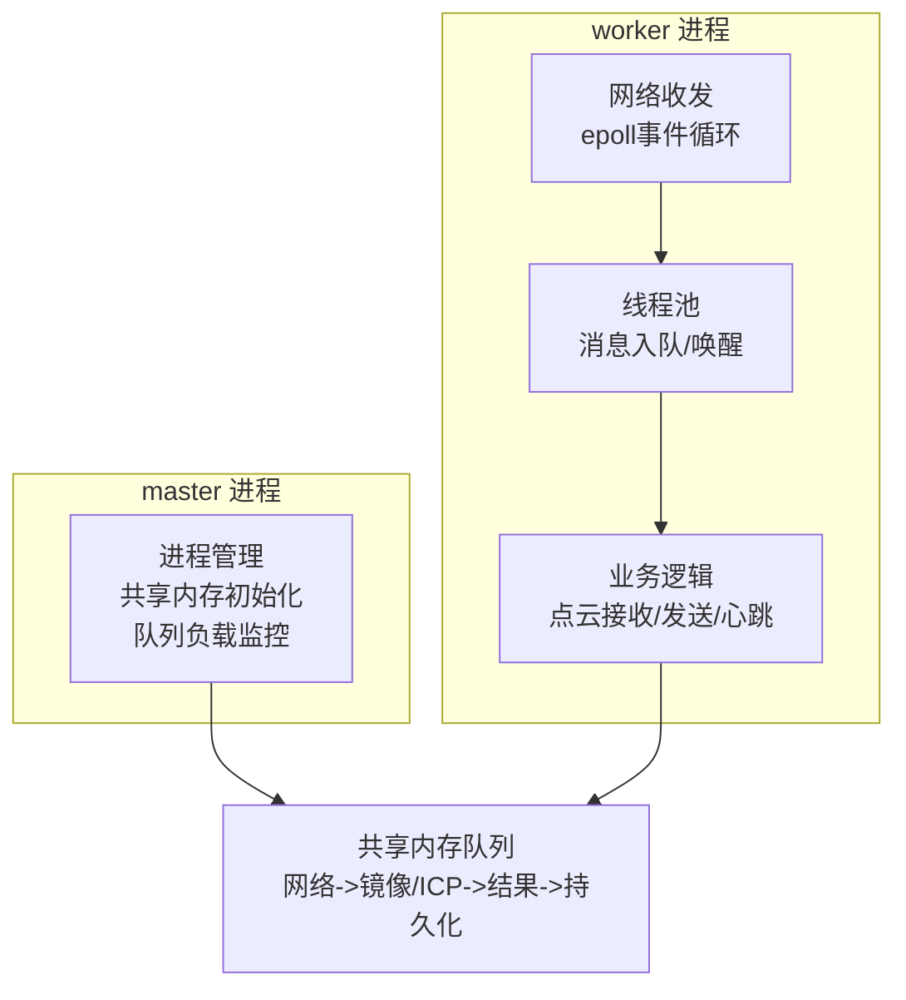
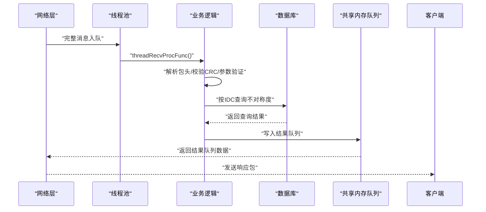
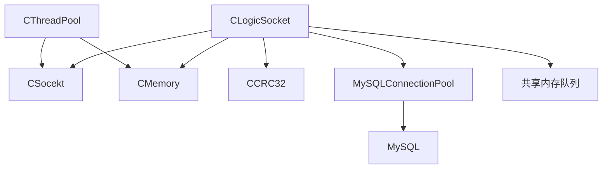

# 业务逻辑 API

<cite>
**本文档引用的文件**
- [ngx_c_slogic.h](file://include/ngx_c_slogic.h)
- [ngx_c_slogic.cxx](file://logic/ngx_c_slogic.cxx)
- [ngx_logiccomm.h](file://include/ngx_logiccomm.h)
- [ngx_c_threadpool.h](file://include/ngx_c_threadpool.h)
- [ngx_c_threadpool.cxx](file://misc/ngx_c_threadpool.cxx)
- [ngx_shared_memory.h](file://include/ngx_shared_memory.h)
- [ngx_lockFreeQueue.h](file://include/ngx_lockFreeQueue.h)
- [ngx_c_socket.h](file://include/ngx_c_socket.h)
- [ngx_comm.h](file://include/ngx_comm.h)
- [ngx_global.h](file://include/ngx_global.h)
- [ngx_process_cycle.cxx](file://proc/ngx_process_cycle.cxx)
- [mysql.ini](file://persist/mysql.ini)
</cite>

## 目录
1. [简介](#简介)
2. [项目结构](#项目结构)
3. [核心组件](#核心组件)
4. [架构总览](#架构总览)
5. [详细组件分析](#详细组件分析)
6. [依赖分析](#依赖分析)
7. [性能考量](#性能考量)
8. [故障排查指南](#故障排查指南)
9. [结论](#结论)
10. [附录](#附录)

## 简介
本文件为业务逻辑模块的 API 参考文档，聚焦点云数据处理相关的公共接口，涵盖数据接收与处理、点云算法调用、数据验证、网络层交互、线程池调度机制、共享内存访问等。文档面向开发者与集成人员，提供参数定义、返回值说明、错误码含义、数据格式转换与坐标变换、算法参数配置等完整说明，并给出常见使用模式与最佳实践。

## 项目结构
系统采用多进程 + 多线程 + 无锁队列的高性能架构：
- master 进程负责进程生命周期管理、共享内存队列初始化与跨进程数据转发。
- worker 进程负责网络收发、业务逻辑处理与线程池调度。
- 业务逻辑模块提供点云接收、点云发送、心跳处理与数据库查询等接口。
- 共享内存队列用于跨进程数据传递，避免昂贵的进程间通信成本。

**图表来源**
- [ngx_process_cycle.cxx](file://proc/ngx_process_cycle.cxx#L360-L399)
- [ngx_c_socket.h](file://include/ngx_c_socket.h#L103-L258)
- [ngx_c_threadpool.h](file://include/ngx_c_threadpool.h#L9-L66)
- [ngx_c_slogic.h](file://include/ngx_c_slogic.h#L13-L37)
- [ngx_shared_memory.h](file://include/ngx_shared_memory.h#L12-L85)

**章节来源**
- [ngx_process_cycle.cxx](file://proc/ngx_process_cycle.cxx#L360-L399)
- [ngx_c_socket.h](file://include/ngx_c_socket.h#L103-L258)
- [ngx_c_threadpool.h](file://include/ngx_c_threadpool.h#L9-L66)
- [ngx_c_slogic.h](file://include/ngx_c_slogic.h#L13-L37)
- [ngx_shared_memory.h](file://include/ngx_shared_memory.h#L12-L85)

## 核心组件
- 业务逻辑类：提供点云接收、点云发送、心跳处理、无包体数据包发送、按 IDC 查询不对称度等接口。
- 线程池：负责将完整消息入队并唤醒工作线程，执行业务逻辑处理。
- 网络层：负责 epoll 事件、连接管理、收发缓冲、心跳检测与超时踢人。
- 共享内存队列：提供无锁环形队列，支撑多进程间高效数据传递。
- 数据结构：定义点云序列化结构、镜像/ICP点云结构、结果返回结构及网络包头。

**章节来源**
- [ngx_c_slogic.h](file://include/ngx_c_slogic.h#L13-L37)
- [ngx_c_slogic.cxx](file://logic/ngx_c_slogic.cxx#L176-L340)
- [ngx_c_threadpool.h](file://include/ngx_c_threadpool.h#L9-L66)
- [ngx_c_threadpool.cxx](file://misc/ngx_c_threadpool.cxx#L268-L321)
- [ngx_c_socket.h](file://include/ngx_c_socket.h#L103-L258)
- [ngx_shared_memory.h](file://include/ngx_shared_memory.h#L24-L85)
- [ngx_lockFreeQueue.h](file://include/ngx_lockFreeQueue.h#L4-L150)
- [ngx_comm.h](file://include/ngx_comm.h#L19-L31)
- [ngx_logiccomm.h](file://include/ngx_logiccomm.h#L16-L29)

## 架构总览
业务逻辑 API 的调用链路如下：
- 网络层接收数据包，解析消息头与包头，校验 CRC，定位业务处理函数。
- 线程池将完整消息入队并唤醒工作线程，调用业务逻辑处理函数。
- 业务逻辑处理函数执行数据验证、格式转换、算法参数配置、数据库查询等。
- 处理结果通过共享内存队列传递到下游进程，最终返回给客户端。

**图表来源**
- [ngx_c_slogic.cxx](file://logic/ngx_c_slogic.cxx#L77-L129)
- [ngx_c_threadpool.cxx](file://misc/ngx_c_threadpool.cxx#L268-L321)
- [ngx_c_slogic.cxx](file://logic/ngx_c_slogic.cxx#L245-L274)
- [ngx_shared_memory.h](file://include/ngx_shared_memory.h#L65-L85)

**章节来源**
- [ngx_c_slogic.cxx](file://logic/ngx_c_slogic.cxx#L77-L129)
- [ngx_c_threadpool.cxx](file://misc/ngx_c_threadpool.cxx#L268-L321)
- [ngx_shared_memory.h](file://include/ngx_shared_memory.h#L65-L85)

## 详细组件分析

### 业务逻辑类 API
- 类名：CLogicSocket（继承自 CSocekt）
- 主要职责：处理心跳、点云接收、点云发送、无包体数据包发送、按 IDC 查询不对称度。

关键接口与说明
- 初始化
  - 名称：Initialize()
  - 作用：初始化业务逻辑相关资源（调用父类初始化）
  - 返回：bool，成功/失败
  - 适用场景：fork 子进程前的准备工作
  - 章节来源
    - [ngx_c_slogic.h](file://include/ngx_c_slogic.h#L18-L74)
    - [ngx_c_slogic.cxx](file://logic/ngx_c_slogic.cxx#L68-L74)

- 心跳处理
  - 名称：_HandlePing(pConn, pMsgHeader, pPkgBody, iBodyLength)
  - 参数：
    - pConn：连接对象指针
    - pMsgHeader：消息头指针
    - pPkgBody：包体指针（心跳包不应带包体）
    - iBodyLength：包体长度
  - 行为：校验包体长度，更新最近心跳时间，发送无包体心跳响应
  - 返回：bool，处理成功/失败
  - 章节来源
    - [ngx_c_slogic.h](file://include/ngx_c_slogic.h#L26-L189)
    - [ngx_c_slogic.cxx](file://logic/ngx_c_slogic.cxx#L176-L189)

- 点云接收
  - 名称：_PCDreceive(pConn, pMsgHeader, pPkgBody, iBodyLength)
  - 参数：
    - pConn：连接对象指针
    - pPkgBody：点云序列化数据指针
    - iBodyLength：包体长度
  - 行为：
    - 校验包体非空与长度
    - 反序列化 PointCloud（含 dataLen、serializedData、ID、name、age、gender、fd）
    - 校验 dataLen 不超过 1MB
    - 入队到 g_net_to_master_queue（无锁队列）
    - 记录 fd->连接映射
  - 返回：bool，处理成功/失败
  - 章节来源
    - [ngx_c_slogic.h](file://include/ngx_c_slogic.h#L27-L243)
    - [ngx_c_slogic.cxx](file://logic/ngx_c_slogic.cxx#L190-L243)
    - [ngx_shared_memory.h](file://include/ngx_shared_memory.h#L24-L33)

- 点云发送（查询并返回）
  - 名称：_PCDsend(pConn, pMsgHeader, pPkgBody, iBodyLength)
  - 参数：
    - pPkgBody：STRUCT_ID（含7字节ID）
    - iBodyLength：包体长度（需等于 STRUCT_ID 大小）
  - 行为：
    - 校验包体长度
    - 互斥访问连接资源
    - 从数据库查询用户信息与不对称度
    - 组装 ResToNetwork（含ID、name、age、gender、asymmetry、fd）
    - 计算 CRC32，发送响应包
  - 返回：bool，处理成功/失败
  - 章节来源
    - [ngx_c_slogic.h](file://include/ngx_c_slogic.h#L28-L340)
    - [ngx_c_slogic.cxx](file://logic/ngx_c_slogic.cxx#L275-L340)
    - [ngx_logiccomm.h](file://include/ngx_logiccomm.h#L16-L29)

- 无包体数据包发送
  - 名称：SendNoBodyPkgToClient(pMsgHeader, iMsgCode)
  - 作用：构造仅含消息头与包头（无包体）的响应包并发送
  - 章节来源
    - [ngx_c_slogic.h](file://include/ngx_c_slogic.h#L23-L175)
    - [ngx_c_slogic.cxx](file://logic/ngx_c_slogic.cxx#L158-L175)

- 按 IDC 查询不对称度
  - 名称：getAsymmetryByIDC(idcValue)
  - 参数：std::string idcValue
  - 行为：从数据库连接池获取连接，执行查询，返回不对称度
  - 返回：double，查询结果或错误值
  - 章节来源
    - [ngx_c_slogic.h](file://include/ngx_c_slogic.h#L29-L274)
    - [ngx_c_slogic.cxx](file://logic/ngx_c_slogic.cxx#L245-L274)

- 心跳超时检测
  - 名称：procPingTimeOutChecking(tmpmsg, cur_time)
  - 作用：检测心跳超时并按策略处理（可选踢人）
  - 章节来源
    - [ngx_c_slogic.h](file://include/ngx_c_slogic.h#L33-L156)
    - [ngx_c_slogic.cxx](file://logic/ngx_c_slogic.cxx#L131-L156)

- 线程接收处理入口
  - 名称：threadRecvProcFunc(pMsgBuf)
  - 作用：解析消息头/包头，校验 CRC，定位业务处理函数并调用
  - 章节来源
    - [ngx_c_slogic.h](file://include/ngx_c_slogic.h#L36-L129)
    - [ngx_c_slogic.cxx](file://logic/ngx_c_slogic.cxx#L77-L129)

数据结构与格式
- 点云结构（接收/发送）
  - PointCloud：包含 serializedData、dataLen、ID、name、age、gender、fd
  - 章节来源
    - [ngx_shared_memory.h](file://include/ngx_shared_memory.h#L24-L33)

- 镜像/ICP点云结构
  - MirrorICPPointCloud：包含两份序列化数据与长度
  - 章节来源
    - [ngx_shared_memory.h](file://include/ngx_shared_memory.h#L34-L44)

- 结果返回结构
  - ResPointCloud：包含序列化点云、不对称度、用户信息
  - ResToNetwork：包含不对称度、用户信息与fd
  - 章节来源
    - [ngx_shared_memory.h](file://include/ngx_shared_memory.h#L45-L62)

- 网络包头
  - COMM_PKG_HEADER：pkgLen、crc32、msgCode
  - 章节来源
    - [ngx_comm.h](file://include/ngx_comm.h#L19-L25)

- 命令码
  - _CMD_PING、_CMD_REGISTER、_CMD_LOGIN 等
  - 章节来源
    - [ngx_logiccomm.h](file://include/ngx_logiccomm.h#L6-L12)

**章节来源**
- [ngx_c_slogic.h](file://include/ngx_c_slogic.h#L13-L37)
- [ngx_c_slogic.cxx](file://logic/ngx_c_slogic.cxx#L68-L340)
- [ngx_shared_memory.h](file://include/ngx_shared_memory.h#L24-L62)
- [ngx_comm.h](file://include/ngx_comm.h#L19-L25)
- [ngx_logiccomm.h](file://include/ngx_logiccomm.h#L6-L29)

### 线程池 API
- 类名：CThreadPool
- 主要职责：创建线程、消息入队、唤醒线程、清理队列、优雅停止

关键接口与说明
- 创建线程池
  - 名称：Create(threadNum)
  - 参数：int threadNum
  - 返回：bool，成功/失败
  - 章节来源
    - [ngx_c_threadpool.h](file://include/ngx_c_threadpool.h#L19-L121)
    - [ngx_c_threadpool.cxx](file://misc/ngx_c_threadpool.cxx#L67-L121)

- 停止线程池
  - 名称：StopAll()
  - 作用：广播唤醒、等待线程结束、销毁互斥量与条件变量、清理队列
  - 章节来源
    - [ngx_c_threadpool.h](file://include/ngx_c_threadpool.h#L20-L265)
    - [ngx_c_threadpool.cxx](file://misc/ngx_c_threadpool.cxx#L189-L265)

- 入队并唤醒
  - 名称：inMsgRecvQueueAndSignal(buf)
  - 作用：入队消息、更新队列计数、唤醒一个线程
  - 章节来源
    - [ngx_c_threadpool.h](file://include/ngx_c_threadpool.h#L22-L291)
    - [ngx_c_threadpool.cxx](file://misc/ngx_c_threadpool.cxx#L268-L291)

- 唤醒单个线程
  - 名称：Call()
  - 作用：条件变量唤醒一个等待线程，记录线程不足告警
  - 章节来源
    - [ngx_c_threadpool.h](file://include/ngx_c_threadpool.h#L23-L319)
    - [ngx_c_threadpool.cxx](file://misc/ngx_c_threadpool.cxx#L293-L319)

- 线程回调
  - 名称：ThreadFunc(threadData)
  - 作用：从队列取出消息，调用 g_socket.threadRecvProcFunc 处理，释放内存
  - 章节来源
    - [ngx_c_threadpool.cxx](file://misc/ngx_c_threadpool.cxx#L124-L187)

- 接收消息队列大小
  - 名称：getRecvMsgQueueCount()
  - 返回：int，队列大小
  - 章节来源
    - [ngx_c_threadpool.h](file://include/ngx_c_threadpool.h#L24)

**章节来源**
- [ngx_c_threadpool.h](file://include/ngx_c_threadpool.h#L9-L66)
- [ngx_c_threadpool.cxx](file://misc/ngx_c_threadpool.cxx#L1-L321)

### 共享内存与无锁队列 API
- 共享内存队列类型
  - NetworkToMasterQueue、MasterToMirorProcessQueue、MirorProcessToMasterQueue、MasterToResProcessQueue、ResProcessToMasterQueue、MasterToPersistProcessQueue、AsymmProcessToMaterQueue、MasterToNetworkQueue
  - 章节来源
    - [ngx_shared_memory.h](file://include/ngx_shared_memory.h#L65-L85)

- 无锁队列 LockFreeQueue
  - 模板类：LockFreeQueue<T, N>
  - 方法：
    - try_push(T&& item)：入队，返回 bool
    - try_pop(T& item)：出队，返回 bool
    - is_empty()：判空
    - size()：当前大小
    - capacity()：可用容量
  - 章节来源
    - [ngx_lockFreeQueue.h](file://include/ngx_lockFreeQueue.h#L4-L150)

- 共享内存队列初始化
  - open_shm_queue<T>(char* shm_name, size)
  - destroy_shm_queue<T>(T* queue, const char* shm_name)
  - 章节来源
    - [ngx_shared_memory.h](file://include/ngx_shared_memory.h#L87-L179)

- master 进程队列初始化与数据转发
  - 初始化：ngx_init_shared_memory_queues(...)
  - 负载监控：ngx_monitor_queue_load(...)
  - 数据转发：ngx_process_data_transfer(...)
  - 章节来源
    - [ngx_process_cycle.cxx](file://proc/ngx_process_cycle.cxx#L332-L358)
    - [ngx_process_cycle.cxx](file://proc/ngx_process_cycle.cxx#L401-L464)
    - [ngx_process_cycle.cxx](file://proc/ngx_process_cycle.cxx#L716-L800)

**章节来源**
- [ngx_shared_memory.h](file://include/ngx_shared_memory.h#L12-L179)
- [ngx_lockFreeQueue.h](file://include/ngx_lockFreeQueue.h#L4-L150)
- [ngx_process_cycle.cxx](file://proc/ngx_process_cycle.cxx#L332-L358)

### 网络层与心跳 API
- 类名：CSocekt
- 主要职责：epoll 初始化、事件处理、连接管理、发送队列、心跳检测、线程管理

关键接口与说明
- epoll 事件处理
  - ngx_epoll_init()、ngx_epoll_process_events(timer)
  - 章节来源
    - [ngx_c_socket.h](file://include/ngx_c_socket.h#L119-L125)

- 连接管理
  - ngx_get_connection()、ngx_free_connection()、AddToTimerQueue()、GetOverTimeTimer()
  - 章节来源
    - [ngx_c_socket.h](file://include/ngx_c_socket.h#L159-L169)

- 心跳检测线程
  - ServerTimerQueueMonitorThread：定时检查心跳超时
  - 章节来源
    - [ngx_c_socket.h](file://include/ngx_c_socket.h#L179)

- 心跳超时处理
  - procPingTimeOutChecking(tmpmsg, cur_time)：在业务逻辑类中重写以实现具体策略
  - 章节来源
    - [ngx_c_slogic.h](file://include/ngx_c_slogic.h#L33-L156)
    - [ngx_c_slogic.cxx](file://logic/ngx_c_slogic.cxx#L131-L156)

**章节来源**
- [ngx_c_socket.h](file://include/ngx_c_socket.h#L103-L258)
- [ngx_c_slogic.cxx](file://logic/ngx_c_slogic.cxx#L131-L156)

### 数据验证与错误处理
- 包体长度校验
  - 点云接收：iBodyLength >= sizeof(PointCloud)
  - 点云发送：iBodyLength == sizeof(STRUCT_ID)
  - 章节来源
    - [ngx_c_slogic.cxx](file://logic/ngx_c_slogic.cxx#L190-L243)
    - [ngx_c_slogic.cxx](file://logic/ngx_c_slogic.cxx#L275-L287)

- CRC32 校验
  - 接收侧：计算包体 CRC32 与包头 crc32 比较
  - 发送侧：计算响应包 CRC32 并写入包头
  - 章节来源
    - [ngx_c_slogic.cxx](file://logic/ngx_c_slogic.cxx#L99-L105)
    - [ngx_c_slogic.cxx](file://logic/ngx_c_slogic.cxx#L336-L338)

- 字节序转换
  - dataLen、fd、asymmetry 等网络序与主机序转换
  - 章节来源
    - [ngx_c_slogic.cxx](file://logic/ngx_c_slogic.cxx#L202-L230)
    - [ngx_c_slogic.cxx](file://logic/ngx_c_slogic.cxx#L333-L335)

- 错误码与返回值
  - 返回 bool：处理成功/失败
  - 返回 double：getAsymmetryByIDC 查询结果或错误值
  - 章节来源
    - [ngx_c_slogic.cxx](file://logic/ngx_c_slogic.cxx#L176-L189)
    - [ngx_c_slogic.cxx](file://logic/ngx_c_slogic.cxx#L245-L274)

**章节来源**
- [ngx_c_slogic.cxx](file://logic/ngx_c_slogic.cxx#L99-L105)
- [ngx_c_slogic.cxx](file://logic/ngx_c_slogic.cxx#L176-L189)
- [ngx_c_slogic.cxx](file://logic/ngx_c_slogic.cxx#L245-L274)

### 数据格式转换与算法参数配置
- 点云序列化
  - serializedData：按固定大小缓冲区存储序列化点云数据
  - dataLen：实际长度，限制不超过 1MB
  - 章节来源
    - [ngx_shared_memory.h](file://include/ngx_shared_memory.h#L24-L33)

- 坐标变换与算法参数
  - 本仓库未提供具体坐标变换与算法参数配置接口，建议在业务逻辑处理函数中扩展相应算法调用与参数注入逻辑
  - 章节来源
    - [ngx_c_slogic.cxx](file://logic/ngx_c_slogic.cxx#L190-L243)

- 数据库查询与参数
  - 按 IDC 查询用户信息与不对称度
  - 章节来源
    - [ngx_c_slogic.cxx](file://logic/ngx_c_slogic.cxx#L245-L274)

**章节来源**
- [ngx_shared_memory.h](file://include/ngx_shared_memory.h#L24-L33)
- [ngx_c_slogic.cxx](file://logic/ngx_c_slogic.cxx#L190-L243)
- [ngx_c_slogic.cxx](file://logic/ngx_c_slogic.cxx#L245-L274)

### 网络层交互与线程池调度机制
- 线程池调度
  - inMsgRecvQueueAndSignal(buf)：入队并唤醒线程
  - ThreadFunc：从队列取出消息，调用业务逻辑处理
  - 章节来源
    - [ngx_c_threadpool.cxx](file://misc/ngx_c_threadpool.cxx#L268-L321)
    - [ngx_c_threadpool.cxx](file://misc/ngx_c_threadpool.cxx#L124-L187)

- 业务逻辑处理流程
  - threadRecvProcFunc：解析消息头/包头，校验 CRC，定位处理函数
  - _PCDreceive/_PCDsend/_HandlePing：具体业务处理
  - 章节来源
    - [ngx_c_slogic.cxx](file://logic/ngx_c_slogic.cxx#L77-L129)
    - [ngx_c_slogic.cxx](file://logic/ngx_c_slogic.cxx#L176-L340)

**章节来源**
- [ngx_c_threadpool.cxx](file://misc/ngx_c_threadpool.cxx#L124-L187)
- [ngx_c_slogic.cxx](file://logic/ngx_c_slogic.cxx#L77-L129)

### 共享内存访问与跨进程数据流
- 共享内存队列命名与容量
  - 定义：NETWORK_TO_MASTER_SHM、MASTER_TO_MIRROR_PROCESS_SHM、...、RETURN_TO_NETWORK_SHM
  - 容量：QUEUE_SIZE（2的幂次）
  - 章节来源
    - [ngx_shared_memory.h](file://include/ngx_shared_memory.h#L12-L22)
    - [ngx_shared_memory.h](file://include/ngx_shared_memory.h#L22)

- master 进程队列初始化与数据转发
  - 初始化：open_shm_queue(...)
  - 负载监控：基于队列长度的动态模式切换
  - 数据转发：支持批量处理与指数退避
  - 章节来源
    - [ngx_process_cycle.cxx](file://proc/ngx_process_cycle.cxx#L332-L358)
    - [ngx_process_cycle.cxx](file://proc/ngx_process_cycle.cxx#L401-L464)
    - [ngx_process_cycle.cxx](file://proc/ngx_process_cycle.cxx#L716-L800)

**章节来源**
- [ngx_shared_memory.h](file://include/ngx_shared_memory.h#L12-L22)
- [ngx_process_cycle.cxx](file://proc/ngx_process_cycle.cxx#L332-L358)

## 依赖分析
- 组件耦合关系
  - CLogicSocket 依赖 CSocekt（继承）、CMemory、CCRC32、MySQLConnectionPool、共享内存队列
  - CThreadPool 依赖 CMemory、CSocekt（通过 g_socket 调用）
  - master 进程依赖共享内存队列与子进程管理
- 外部依赖
  - 数据库：MySQL 连接池配置文件
  - 系统：epoll、pthread、共享内存 mmap

**图表来源**
- [ngx_c_slogic.h](file://include/ngx_c_slogic.h#L13-L37)
- [ngx_c_threadpool.h](file://include/ngx_c_threadpool.h#L9-L66)
- [ngx_shared_memory.h](file://include/ngx_shared_memory.h#L65-L85)
- [mysql.ini](file://persist/mysql.ini#L1-L13)

**章节来源**
- [ngx_c_slogic.h](file://include/ngx_c_slogic.h#L13-L37)
- [ngx_c_threadpool.h](file://include/ngx_c_threadpool.h#L9-L66)
- [ngx_shared_memory.h](file://include/ngx_shared_memory.h#L65-L85)
- [mysql.ini](file://persist/mysql.ini#L1-L13)

## 性能考量
- 无锁队列
  - 使用 compare_exchange_weak 与内存序 release/acquire，避免阻塞与上下文切换
  - 缓存行对齐避免伪共享，提升多核并发性能
  - 章节来源
    - [ngx_lockFreeQueue.h](file://include/ngx_lockFreeQueue.h#L4-L150)

- 线程池
  - 条件变量唤醒单个线程，降低惊群效应
  - 线程不足告警与动态扩容提示
  - 章节来源
    - [ngx_c_threadpool.cxx](file://misc/ngx_c_threadpool.cxx#L293-L319)

- master 进程负载均衡
  - 基于队列长度的动态模式切换（正常/高负载/低负载）
  - 批量处理与指数退避策略，平衡吞吐与延迟
  - 章节来源
    - [ngx_process_cycle.cxx](file://proc/ngx_process_cycle.cxx#L401-L464)
    - [ngx_process_cycle.cxx](file://proc/ngx_process_cycle.cxx#L716-L800)

## 故障排查指南
- 心跳超时
  - 现象：长时间无心跳被踢出
  - 排查：检查 lastPingTime 更新、procPingTimeOutChecking 策略
  - 章节来源
    - [ngx_c_slogic.cxx](file://logic/ngx_c_slogic.cxx#L131-L156)

- CRC 校验失败
  - 现象：日志记录 CRC 错误并丢弃数据
  - 排查：确认包体长度与 CRC32 计算一致性
  - 章节来源
    - [ngx_c_slogic.cxx](file://logic/ngx_c_slogic.cxx#L99-L105)

- 线程池不足
  - 现象：日志提示线程池空闲线程为0
  - 排查：评估负载，考虑扩容线程池
  - 章节来源
    - [ngx_c_threadpool.cxx](file://misc/ngx_c_threadpool.cxx#L307-L316)

- 共享内存队列满
  - 现象：try_push 返回 false
  - 排查：检查下游进程处理能力，调整批量大小与退避策略
  - 章节来源
    - [ngx_process_cycle.cxx](file://proc/ngx_process_cycle.cxx#L766-L775)

**章节来源**
- [ngx_c_slogic.cxx](file://logic/ngx_c_slogic.cxx#L99-L105)
- [ngx_c_threadpool.cxx](file://misc/ngx_c_threadpool.cxx#L307-L316)
- [ngx_process_cycle.cxx](file://proc/ngx_process_cycle.cxx#L766-L775)

## 结论
本业务逻辑 API 通过线程池与无锁队列实现高并发数据处理，结合共享内存实现跨进程高效通信。点云接收、发送与心跳处理接口清晰，数据验证与错误处理完备。建议在现有基础上扩展坐标变换与算法参数配置接口，并结合 master 进程的负载均衡策略实现弹性扩缩容。

## 附录

### 常见使用模式与最佳实践
- 点云接收
  - 校验包体长度与 CRC32
  - 反序列化 PointCloud 并限制 dataLen
  - 入队到 g_net_to_master_queue
  - 章节来源
    - [ngx_c_slogic.cxx](file://logic/ngx_c_slogic.cxx#L190-L243)
    - [ngx_shared_memory.h](file://include/ngx_shared_memory.h#L24-L33)

- 点云发送
  - 校验包体长度
  - 互斥访问连接资源
  - 数据库查询并组装响应包
  - 章节来源
    - [ngx_c_slogic.cxx](file://logic/ngx_c_slogic.cxx#L275-L340)

- 心跳处理
  - 更新 lastPingTime
  - 发送无包体心跳响应
  - 章节来源
    - [ngx_c_slogic.cxx](file://logic/ngx_c_slogic.cxx#L176-L189)

- 数据库配置
  - 修改 mysql.ini 中连接参数
  - 章节来源
    - [mysql.ini](file://persist/mysql.ini#L1-L13)