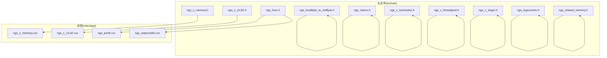
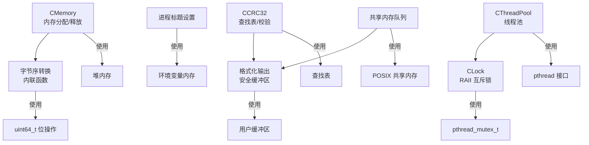
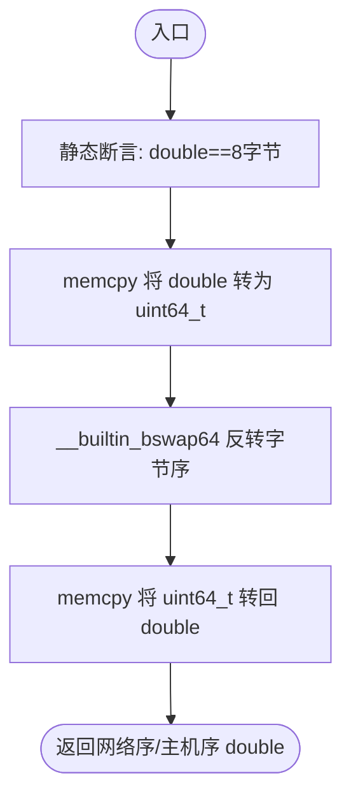
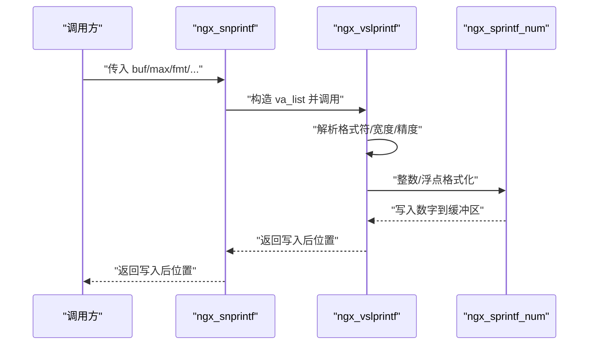
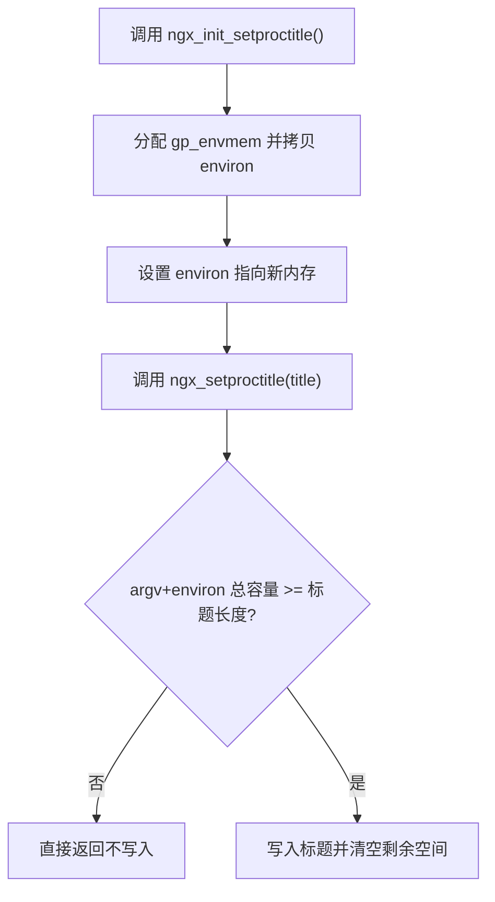
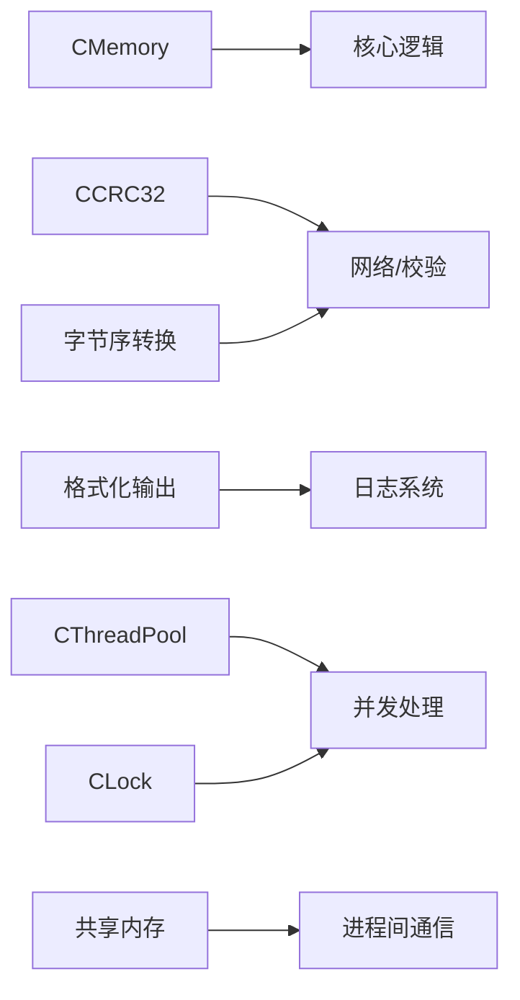

# 工具函数 API

<cite>
**本文引用的文件**
- [include/ngx_c_memory.h](file://include/ngx_c_memory.h)
- [misc/ngx_c_memory.cxx](file://misc/ngx_c_memory.cxx)
- [include/ngx_c_crc32.h](file://include/ngx_c_crc32.h)
- [misc/ngx_c_crc32.cxx](file://misc/ngx_c_crc32.cxx)
- [include/ngx_hostByte_to_netByte.h](file://include/ngx_hostByte_to_netByte.h)
- [include/ngx_macro.h](file://include/ngx_macro.h)
- [include/ngx_func.h](file://include/ngx_func.h)
- [app/ngx_printf.cxx](file://app/ngx_printf.cxx)
- [app/ngx_setproctitle.cxx](file://app/ngx_setproctitle.cxx)
- [include/ngx_c_lockmutex.h](file://include/ngx_c_lockmutex.h)
- [include/ngx_c_threadpool.h](file://include/ngx_c_threadpool.h)
- [include/ngx_c_slogic.h](file://include/ngx_c_slogic.h)
- [include/ngx_logiccomm.h](file://include/ngx_logiccomm.h)
- [include/ngx_shared_memory.h](file://include/ngx_shared_memory.h)
</cite>

## 目录
1. [简介](#简介)
2. [项目结构](#项目结构)
3. [核心组件](#核心组件)
4. [架构概览](#架构概览)
5. [详细组件分析](#详细组件分析)
6. [依赖分析](#依赖分析)
7. [性能考虑](#性能考虑)
8. [故障排查指南](#故障排查指南)
9. [结论](#结论)
10. [附录](#附录)

## 简介
本文件为工具函数模块的 API 参考文档，覆盖内存管理、CRC32 校验、字节序转换、日志与格式化输出、进程标题设置、线程池与互斥锁、宏定义与常量等辅助能力。文档面向不同技术背景的读者，既提供高层概览，也给出代码级的调用与注意事项，帮助在项目中正确、安全、高效地使用这些工具。

## 项目结构
工具函数相关代码主要分布在以下区域：
- include：对外公开的头文件，定义类、函数原型、宏与常量
- misc：轻量工具实现（内存、CRC32）
- app：日志与格式化输出、进程标题设置
- 其他模块：线程池、锁、共享内存、业务逻辑等与工具函数协同使用



图表来源
- [include/ngx_c_memory.h](file://include/ngx_c_memory.h#L1-L52)
- [misc/ngx_c_memory.cxx](file://misc/ngx_c_memory.cxx#L1-L30)
- [include/ngx_c_crc32.h](file://include/ngx_c_crc32.h#L1-L64)
- [misc/ngx_c_crc32.cxx](file://misc/ngx_c_crc32.cxx#L1-L89)
- [include/ngx_hostByte_to_netByte.h](file://include/ngx_hostByte_to_netByte.h#L1-L19)
- [include/ngx_macro.h](file://include/ngx_macro.h#L1-L40)
- [include/ngx_func.h](file://include/ngx_func.h#L1-L28)
- [app/ngx_printf.cxx](file://app/ngx_printf.cxx#L1-L363)
- [app/ngx_setproctitle.cxx](file://app/ngx_setproctitle.cxx#L1-L48)
- [include/ngx_c_lockmutex.h](file://include/ngx_c_lockmutex.h#L1-L24)
- [include/ngx_c_threadpool.h](file://include/ngx_c_threadpool.h#L1-L66)
- [include/ngx_c_slogic.h](file://include/ngx_c_slogic.h#L1-L40)
- [include/ngx_logiccomm.h](file://include/ngx_logiccomm.h#L1-L30)
- [include/ngx_shared_memory.h](file://include/ngx_shared_memory.h#L1-L193)

章节来源
- [include/ngx_c_memory.h](file://include/ngx_c_memory.h#L1-L52)
- [include/ngx_c_crc32.h](file://include/ngx_c_crc32.h#L1-L64)
- [include/ngx_hostByte_to_netByte.h](file://include/ngx_hostByte_to_netByte.h#L1-L19)
- [include/ngx_macro.h](file://include/ngx_macro.h#L1-L40)
- [include/ngx_func.h](file://include/ngx_func.h#L1-L28)
- [app/ngx_printf.cxx](file://app/ngx_printf.cxx#L1-L363)
- [app/ngx_setproctitle.cxx](file://app/ngx_setproctitle.cxx#L1-L48)
- [include/ngx_c_lockmutex.h](file://include/ngx_c_lockmutex.h#L1-L24)
- [include/ngx_c_threadpool.h](file://include/ngx_c_threadpool.h#L1-L66)
- [include/ngx_c_slogic.h](file://include/ngx_c_slogic.h#L1-L40)
- [include/ngx_logiccomm.h](file://include/ngx_logiccomm.h#L1-L30)
- [include/ngx_shared_memory.h](file://include/ngx_shared_memory.h#L1-L193)

## 核心组件
- 内存管理：CMemory 单例类，提供分配与释放接口，支持按需清零
- CRC32 校验：CCRC32 单例类，提供查找表初始化与校验值计算
- 字节序转换：内联函数 htond/ntohd，支持 double 类型主机序与网络序互转
- 日志与格式化：安全的格式化输出函数族，支持多种占位符与宽度/精度控制
- 宏与常量：常用宏、日志级别、进程类型等
- 进程标题：初始化与设置可执行程序标题，避免环境变量越界
- 线程池与锁：线程池封装与 RAII 互斥锁封装
- 共享内存：基于 POSIX 共享内存的队列封装与生命周期管理

章节来源
- [include/ngx_c_memory.h](file://include/ngx_c_memory.h#L1-L52)
- [misc/ngx_c_memory.cxx](file://misc/ngx_c_memory.cxx#L1-L30)
- [include/ngx_c_crc32.h](file://include/ngx_c_crc32.h#L1-L64)
- [misc/ngx_c_crc32.cxx](file://misc/ngx_c_crc32.cxx#L1-L89)
- [include/ngx_hostByte_to_netByte.h](file://include/ngx_hostByte_to_netByte.h#L1-L19)
- [include/ngx_func.h](file://include/ngx_func.h#L1-L28)
- [app/ngx_printf.cxx](file://app/ngx_printf.cxx#L1-L363)
- [include/ngx_macro.h](file://include/ngx_macro.h#L1-L40)
- [app/ngx_setproctitle.cxx](file://app/ngx_setproctitle.cxx#L1-L48)
- [include/ngx_c_lockmutex.h](file://include/ngx_c_lockmutex.h#L1-L24)
- [include/ngx_c_threadpool.h](file://include/ngx_c_threadpool.h#L1-L66)
- [include/ngx_shared_memory.h](file://include/ngx_shared_memory.h#L1-L193)

## 架构概览
工具函数模块围绕“稳定、可复用、线程安全（必要时）”设计，采用单例模式提供全局可用的资源（内存、CRC 表），并通过内联函数与宏减少运行时开销。日志与格式化输出模块提供安全的缓冲区边界检查，进程标题设置模块确保在修改 argv/environ 时不越界。



图表来源
- [include/ngx_c_memory.h](file://include/ngx_c_memory.h#L45-L49)
- [misc/ngx_c_memory.cxx](file://misc/ngx_c_memory.cxx#L13-L28)
- [include/ngx_c_crc32.h](file://include/ngx_c_crc32.h#L44-L52)
- [misc/ngx_c_crc32.cxx](file://misc/ngx_c_crc32.cxx#L37-L87)
- [app/ngx_printf.cxx](file://app/ngx_printf.cxx#L14-L276)
- [app/ngx_setproctitle.cxx](file://app/ngx_setproctitle.cxx#L9-L48)
- [include/ngx_c_threadpool.h](file://include/ngx_c_threadpool.h#L9-L63)
- [include/ngx_c_lockmutex.h](file://include/ngx_c_lockmutex.h#L6-L21)
- [include/ngx_shared_memory.h](file://include/ngx_shared_memory.h#L87-L179)
- [include/ngx_hostByte_to_netByte.h](file://include/ngx_hostByte_to_netByte.h#L5-L19)

## 详细组件分析

### 内存管理 API（CMemory）
- 单例获取
  - GetInstance()：首次使用时创建实例，线程安全（注释中体现加锁逻辑）
- 分配接口
  - AllocMemory(memCount, ifmemset)：分配 memCount 字节；若 ifmemset 为真则初始化为 0
- 释放接口
  - FreeMemory(point)：释放由 AllocMemory 分配的内存，内部以 char* 形式删除
- 注意事项
  - 分配失败时直接返回，不抛异常；建议调用方自行判断返回值
  - 释放时必须与分配时的类型一致（char* 数组），避免未定义行为
  - 若需对齐分配，建议使用平台特定的对齐分配接口或包装一层

```mermaid
classDiagram
class CMemory {
-m_instance : CMemory*
+GetInstance() CMemory*
+AllocMemory(memCount : int, ifmemset : bool) void*
+FreeMemory(point : void*)
class CGarhuishou {
+~CGarhuishou()
}
}
```

图表来源
- [include/ngx_c_memory.h](file://include/ngx_c_memory.h#L5-L49)
- [misc/ngx_c_memory.cxx](file://misc/ngx_c_memory.cxx#L8-L28)

章节来源
- [include/ngx_c_memory.h](file://include/ngx_c_memory.h#L17-L49)
- [misc/ngx_c_memory.cxx](file://misc/ngx_c_memory.cxx#L13-L28)

### CRC32 校验 API（CCRC32）
- 单例获取
  - GetInstance()：延迟初始化查找表
- 初始化
  - Init_CRC32_Table()：生成 256 项查找表（基于标准多项式）
  - Reflect(ref, ch)：位反射辅助函数
- 计算
  - Get_CRC(buffer, dwSize)：计算输入缓冲区的 CRC32 值
- 使用建议
  - 首次使用前无需手动初始化，GetInstance 会自动完成
  - 输入应为原始字节流，输出为 32 位无符号整数
  - 适合校验网络包、配置文件、序列化数据的完整性

```mermaid
classDiagram
class CCRC32 {
-m_instance : CCRC32*
+GetInstance() CCRC32*
+Init_CRC32_Table() void
+Reflect(ref : uint, ch : char) uint
+Get_CRC(buffer : uchar*, dwSize : uint) int
-crc32_table : uint[256]
class CGarhuishou {
+~CGarhuishou()
}
}
```

图表来源
- [include/ngx_c_crc32.h](file://include/ngx_c_crc32.h#L6-L52)
- [misc/ngx_c_crc32.cxx](file://misc/ngx_c_crc32.cxx#L9-L87)

章节来源
- [include/ngx_c_crc32.h](file://include/ngx_c_crc32.h#L16-L52)
- [misc/ngx_c_crc32.cxx](file://misc/ngx_c_crc32.cxx#L21-L87)

### 字节序转换 API（主机序↔网络序）
- 函数
  - htond(host_value)：double 的主机序转网络序（内联，GCC/Clang 内置字节序反转）
  - ntohd(net_value)：网络序转主机序（复用 htond）
- 实现要点
  - 使用静态断言确保 double 为 8 字节
  - 通过 memcpy 与 __builtin_bswap64 完成位转换
- 使用场景
  - 网络协议中发送/接收 double 类型字段
  - 跨平台数据交换（不同字节序）



图表来源
- [include/ngx_hostByte_to_netByte.h](file://include/ngx_hostByte_to_netByte.h#L5-L19)

章节来源
- [include/ngx_hostByte_to_netByte.h](file://include/ngx_hostByte_to_netByte.h#L1-L19)

### 日志与格式化输出 API（安全缓冲区）
- 函数族
  - ngx_slprintf(buf, last, fmt, ...)：可变参数格式化，返回写入后位置
  - ngx_snprintf(buf, max, fmt, ...)：带最大长度的安全版本
  - ngx_vslprintf(buf, last, fmt, va_list)：内部实现，支持多种占位符
- 支持的格式
  - 整数：d/i/L、u、X/x、p（指针）
  - 浮点：f（可指定小数位）
  - 字符串：s
  - 特殊：%（转义）
- 辅助宏
  - ngx_cpymem(dst, src, n)：类似 memcpy，但返回拷贝后终点位置，便于拼接
  - ngx_min(a, b)：取较小值
- 使用建议
  - 始终传入 last 或 max 以限制写入范围
  - 浮点格式化支持小数位数，注意缩放与四舍五入
  - 多段拼接时利用 ngx_cpymem 提升可读性



图表来源
- [app/ngx_printf.cxx](file://app/ngx_printf.cxx#L14-L276)
- [app/ngx_printf.cxx](file://app/ngx_printf.cxx#L288-L361)
- [include/ngx_macro.h](file://include/ngx_macro.h#L10-L11)

章节来源
- [include/ngx_func.h](file://include/ngx_func.h#L13-L20)
- [app/ngx_printf.cxx](file://app/ngx_printf.cxx#L14-L276)
- [include/ngx_macro.h](file://include/ngx_macro.h#L10-L11)

### 宏定义与常量（日志级别、进程类型、数值范围）
- 常量
  - NGX_MAX_ERROR_STR：错误信息最大长度
  - NGX_MAX_UINT32_VALUE：最大 32 位无符号数
  - NGX_INT64_LEN：int64 字符串长度上限
- 日志级别（0 最高，8 最低）
  - STDERR、EMERG、ALERT、CRIT、ERR、WARN、NOTICE、INFO、DEBUG
- 进程类型
  - NGX_PROCESS_MASTER、NGX_PROCESS_WORKER
- 其他
  - NGX_ERROR_LOG_PATH：默认日志文件名
- 使用建议
  - 日志级别用于分级过滤与输出
  - 进程类型用于区分 master/worker 的行为分支

章节来源
- [include/ngx_macro.h](file://include/ngx_macro.h#L6-L36)

### 进程标题设置 API
- 初始化
  - ngx_init_setproctitle()：为环境变量分配新内存并迁移
- 设置标题
  - ngx_setproctitle(title)：将可执行程序标题写入 argv 区域，确保不超过 argv+environ 总容量
- 注意事项
  - 必须先调用初始化，再设置标题
  - 标题长度不能超过 argv+environ 的总容量，否则直接返回



图表来源
- [app/ngx_setproctitle.cxx](file://app/ngx_setproctitle.cxx#L9-L48)

章节来源
- [app/ngx_setproctitle.cxx](file://app/ngx_setproctitle.cxx#L9-L48)

### 线程池与互斥锁 API
- 线程池（CThreadPool）
  - Create(threadNum)：创建指定数量的工作线程
  - StopAll()：优雅停止所有线程
  - inMsgRecvQueueAndSignal(buf)：入队消息并唤醒线程处理
  - Call()：调度一个线程处理任务
  - getRecvMsgQueueCount()：获取接收队列大小
  - 内部结构：ThreadItem、静态互斥锁与条件变量、原子计数
- 互斥锁（CLock）
  - RAII 包装：构造时加锁，析构时解锁
  - 适用于作用域内的临界区保护

```mermaid
classDiagram
class CThreadPool {
-m_iThreadNum : int
-m_iRunningThreadNum : atomic<int>
-m_MsgRecvQueue : list<char*>
-m_iRecvMsgQueueCount : int
+Create(threadNum : int) bool
+StopAll() void
+inMsgRecvQueueAndSignal(buf : char*) void
+Call() void
+getRecvMsgQueueCount() int
class ThreadItem {
+_Handle : pthread_t
+_pThis : CThreadPool*
+ifrunning : bool
}
}
class CLock {
-m_pMutex : pthread_mutex_t*
+CLock(pMutex : pthread_mutex_t*)
+~CLock()
}
```

图表来源
- [include/ngx_c_threadpool.h](file://include/ngx_c_threadpool.h#L9-L63)
- [include/ngx_c_lockmutex.h](file://include/ngx_c_lockmutex.h#L6-L21)

章节来源
- [include/ngx_c_threadpool.h](file://include/ngx_c_threadpool.h#L19-L30)
- [include/ngx_c_lockmutex.h](file://include/ngx_c_lockmutex.h#L9-L17)

### 共享内存与队列 API
- 常量
  - 多个共享内存队列名称常量（如 NETWORK_TO_MASTER_SHM 等）
- 数据结构
  - PointCloud、MirrorICPPointCloud、ResPointCloud、ResToNetwork 等
- 模板函数
  - open_shm_queue<T>(name, size)：创建/打开共享内存并映射，使用 placement new 初始化
  - destroy_shm_queue<T>(queue, name)：显式析构、解除映射、删除共享内存对象
- 使用建议
  - 队列大小建议为 2 的幂次，提升无锁队列性能
  - 打开与销毁需成对使用，避免泄漏

章节来源
- [include/ngx_shared_memory.h](file://include/ngx_shared_memory.h#L12-L179)
- [include/ngx_shared_memory.h](file://include/ngx_shared_memory.h#L24-L63)

### 业务逻辑与命令宏（补充）
- 命令宏
  - _CMD_START、_CMD_PING、_CMD_REGISTER、_CMD_LOGIN 等
- 结构体
  - STRUCT_ID、STRUCT_ASY 等，按 1 字节对齐
- 用途
  - 业务消息的命令标识与数据结构定义

章节来源
- [include/ngx_logiccomm.h](file://include/ngx_logiccomm.h#L6-L27)
- [include/ngx_logiccomm.h](file://include/ngx_logiccomm.h#L14-L27)

## 依赖分析
- 组件耦合
  - CMemory/CCRC32 通过单例提供全局资源，被各模块间接依赖
  - 日志与格式化输出模块被广泛使用于错误处理与调试
  - 线程池与锁用于并发场景下的任务调度与临界区保护
  - 共享内存模块依赖 POSIX 接口，提供跨进程通信基础
- 外部依赖
  - pthread（线程池、锁）
  - POSIX 共享内存（open/shm_unlink/mmap）
  - C/C++ 标准库（内存、字符串、变参）



图表来源
- [include/ngx_c_memory.h](file://include/ngx_c_memory.h#L17-L49)
- [include/ngx_c_crc32.h](file://include/ngx_c_crc32.h#L16-L52)
- [include/ngx_c_threadpool.h](file://include/ngx_c_threadpool.h#L9-L63)
- [include/ngx_c_lockmutex.h](file://include/ngx_c_lockmutex.h#L6-L21)
- [include/ngx_shared_memory.h](file://include/ngx_shared_memory.h#L87-L179)
- [include/ngx_hostByte_to_netByte.h](file://include/ngx_hostByte_to_netByte.h#L5-L19)

## 性能考虑
- 内联与宏
  - 字节序转换使用内联与编译器内置函数，降低函数调用开销
  - ngx_cpymem 与 ngx_min 使用宏，减少函数调用与分支判断
- 缓冲区安全
  - 格式化输出严格检查 last/max，避免缓冲区溢出
- 查找表
  - CRC32 查找表一次性初始化，后续查表 O(n) 计算，适合高频校验
- 线程池
  - 原子计数与条件变量减少不必要的锁竞争
- 共享内存
  - 使用 mmap 直接映射，避免额外拷贝；队列大小为 2 的幂次，利于无锁实现

[本节为通用性能建议，不直接分析具体文件]

## 故障排查指南
- 内存相关
  - 分配失败：CMemory 默认不抛异常，需在调用方判断返回值
  - 释放错误：必须与分配类型一致（char* 数组），避免未定义行为
- CRC32
  - 未初始化：GetInstance 会自动初始化查找表，无需手动调用 Init_CRC32_Table
  - 结果不一致：确认输入缓冲区与长度一致，避免重复计算或截断
- 字节序
  - double 非 8 字节：静态断言会失败，需检查平台与类型定义
- 日志与格式化
  - 输出截断：检查 last/max 是否足够，或调整格式宽度/精度
  - 浮点误差：注意小数位缩放与四舍五入规则
- 进程标题
  - 标题未生效：确认已调用初始化并满足 argv+environ 总容量
- 线程池
  - 死锁：确保在 CLock 作用域内不进行阻塞操作
  - 线程泄漏：确保调用 StopAll 并等待线程退出
- 共享内存
  - 打开失败：检查权限与名称，确认 shm_open/ftruncate/mmap 成功
  - 泄漏：确保 destroy_shm_queue 被调用

章节来源
- [misc/ngx_c_memory.cxx](file://misc/ngx_c_memory.cxx#L13-L28)
- [misc/ngx_c_crc32.cxx](file://misc/ngx_c_crc32.cxx#L37-L87)
- [include/ngx_hostByte_to_netByte.h](file://include/ngx_hostByte_to_netByte.h#L5-L19)
- [app/ngx_printf.cxx](file://app/ngx_printf.cxx#L14-L276)
- [app/ngx_setproctitle.cxx](file://app/ngx_setproctitle.cxx#L27-L48)
- [include/ngx_c_lockmutex.h](file://include/ngx_c_lockmutex.h#L9-L17)
- [include/ngx_c_threadpool.h](file://include/ngx_c_threadpool.h#L19-L30)
- [include/ngx_shared_memory.h](file://include/ngx_shared_memory.h#L87-L179)

## 结论
工具函数模块提供了稳定、高效的基础设施：安全的内存管理、快速的 CRC32 校验、便捷的日志与格式化输出、可靠的字节序转换、线程池与锁、以及基于 POSIX 的共享内存队列。遵循本文的使用规范与注意事项，可在保证性能的同时提升系统的可维护性与安全性。

[本节为总结性内容，不直接分析具体文件]

## 附录
- 常用宏速览
  - ngx_cpymem：多段拼接时返回终点位置
  - ngx_min：取较小值
  - 日志级别：STDERR 到 DEBUG（0-8）
  - 进程类型：MASTER/WORKER
- 建议实践
  - 在关键路径使用内联与宏，减少函数调用
  - 对所有输出缓冲区提供边界检查
  - 对共享内存与线程池的生命周期进行显式管理
  - 在网络通信中统一使用字节序转换函数

[本节为补充说明，不直接分析具体文件]