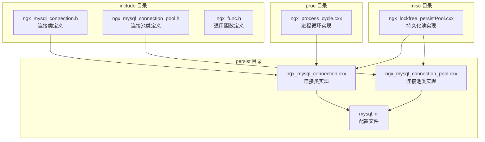
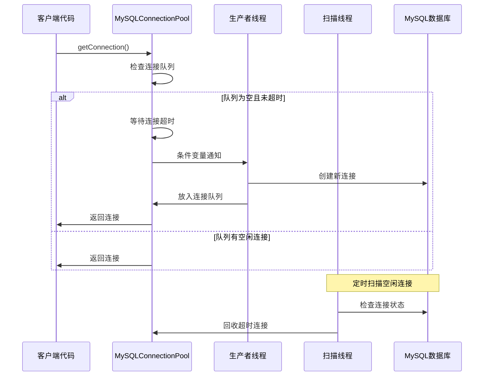
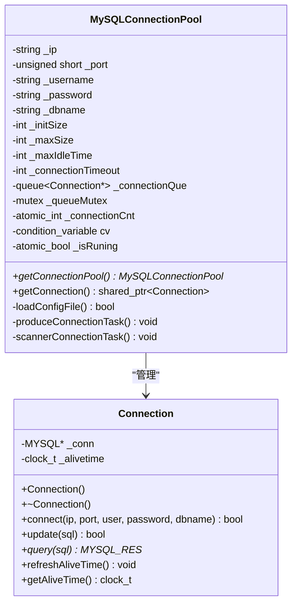
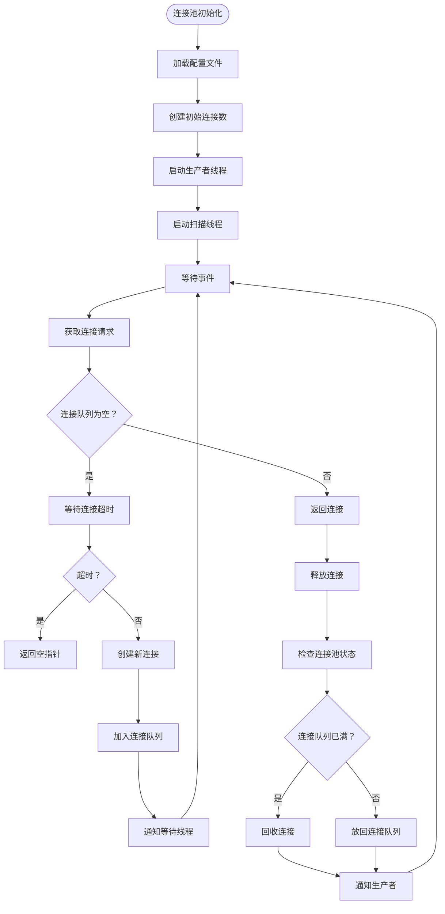
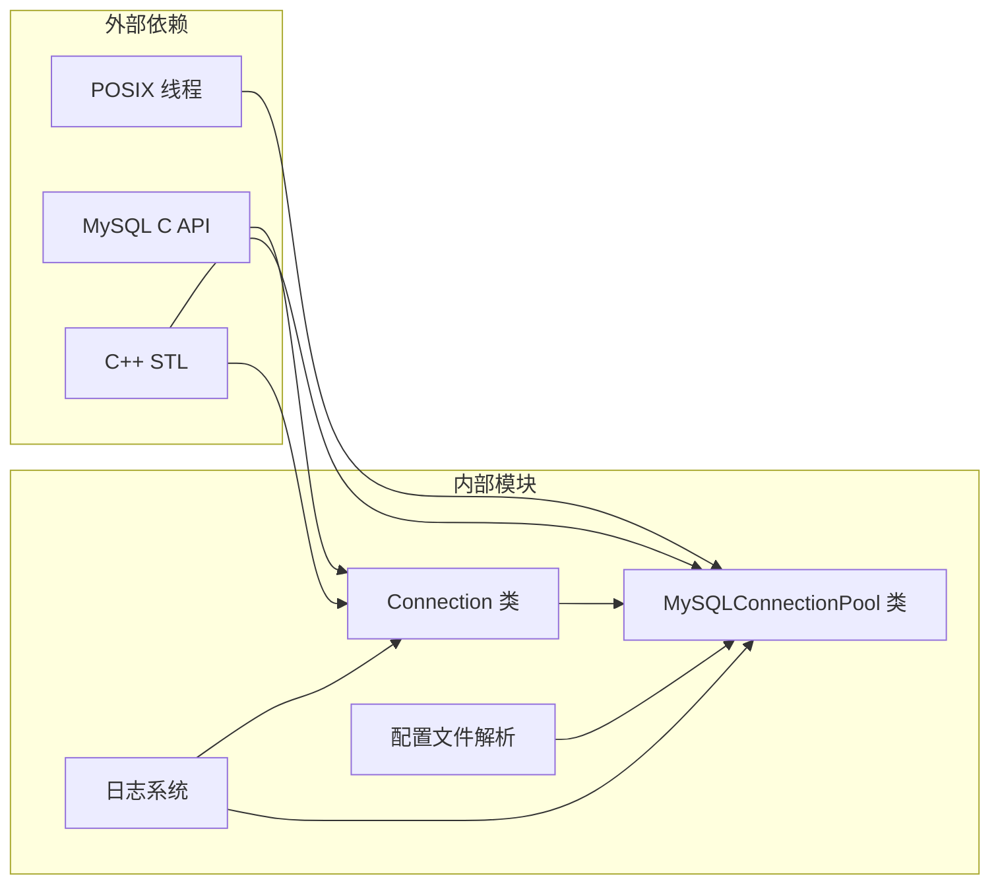

# 数据库操作 API

<cite>
**本文档引用的文件**
- [ngx_mysql_connection.h](file://include/ngx_mysql_connection.h)
- [ngx_mysql_connection_pool.h](file://include/ngx_mysql_connection_pool.h)
- [ngx_mysql_connection.cxx](file://persist/ngx_mysql_connection.cxx)
- [ngx_mysql_connection_pool.cxx](file://persist/ngx_mysql_connection_pool.cxx)
- [mysql.ini](file://persist/mysql.ini)
- [ngx_func.h](file://include/ngx_func.h)
- [ngx_lockfree_persistPool.cxx](file://misc/ngx_lockfree_persistPool.cxx)
- [ngx_process_cycle.cxx](file://proc/ngx_process_cycle.cxx)
</cite>

## 目录
1. [简介](#简介)
2. [项目结构](#项目结构)
3. [核心组件](#核心组件)
4. [架构概览](#架构概览)
5. [详细组件分析](#详细组件分析)
6. [依赖关系分析](#依赖关系分析)
7. [性能考虑](#性能考虑)
8. [故障排除指南](#故障排除指南)
9. [最佳实践](#最佳实践)
10. [结论](#结论)

## 简介

本文件为数据库模块的详细 API 参考文档，涵盖 MySQL 连接池和数据库操作的所有公共接口。该模块实现了高性能的数据库连接池管理，支持连接创建、查询执行、事务管理等功能。文档详细解释了 `Connection` 类和 `MySQLConnectionPool` 类的使用方法，提供了数据库连接获取、释放、重连机制的完整 API 说明，以及 SQL 查询执行、结果集处理、错误处理等核心接口。

## 项目结构

数据库模块位于项目的 `include` 和 `persist` 目录中，采用分层设计：

**图表来源**
- [ngx_mysql_connection.h](file://include/ngx_mysql_connection.h#L1-L35)
- [ngx_mysql_connection_pool.h](file://include/ngx_mysql_connection_pool.h#L1-L55)
- [ngx_mysql_connection.cxx](file://persist/ngx_mysql_connection.cxx#L1-L56)
- [ngx_mysql_connection_pool.cxx](file://persist/ngx_mysql_connection_pool.cxx#L1-L349)

**章节来源**
- [ngx_mysql_connection.h](file://include/ngx_mysql_connection.h#L1-L35)
- [ngx_mysql_connection_pool.h](file://include/ngx_mysql_connection_pool.h#L1-L55)

## 核心组件

数据库模块由两个核心类组成：`Connection` 类和 `MySQLConnectionPool` 类。

### Connection 类

`Connection` 类封装了单个 MySQL 数据库连接的所有操作，提供了简洁的接口来执行数据库操作。

### MySQLConnectionPool 类

`MySQLConnectionPool` 类实现了线程安全的连接池管理，支持动态连接创建、空闲连接回收、连接超时处理等高级功能。

**章节来源**
- [ngx_mysql_connection.h](file://include/ngx_mysql_connection.h#L9-L35)
- [ngx_mysql_connection_pool.h](file://include/ngx_mysql_connection_pool.h#L14-L55)

## 架构概览

数据库模块采用生产者-消费者模式的连接池架构，结合单例模式确保全局唯一性：

**图表来源**
- [ngx_mysql_connection_pool.cxx](file://persist/ngx_mysql_connection_pool.cxx#L207-L255)
- [ngx_mysql_connection_pool.cxx](file://persist/ngx_mysql_connection_pool.cxx#L173-L203)
- [ngx_mysql_connection_pool.cxx](file://persist/ngx_mysql_connection_pool.cxx#L280-L311)

## 详细组件分析

### Connection 类详细分析

`Connection` 类提供了数据库连接的基本操作接口：

#### 公共接口

| 方法 | 参数 | 返回值 | 功能描述 |
|------|------|--------|----------|
| `Connection()` | 无 | 无 | 构造函数，初始化 MySQL 连接 |
| `~Connection()` | 无 | 无 | 析构函数，释放数据库连接资源 |
| `connect(ip, port, user, password, dbname)` | 字符串, 短整型, 字符串, 字符串, 字符串 | 布尔值 | 建立数据库连接 |
| `update(sql)` | 字符串 | 布尔值 | 执行 INSERT、DELETE、UPDATE 操作 |
| `query(sql)` | 字符串 | MYSQL_RES* | 执行 SELECT 查询操作 |
| `refreshAliveTime()` | 无 | 无 | 刷新连接的空闲时间戳 |
| `getAliveTime()` | 无 | clock_t | 获取连接的存活时间 |

#### 类关系图

**图表来源**
- [ngx_mysql_connection.h](file://include/ngx_mysql_connection.h#L9-L35)
- [ngx_mysql_connection_pool.h](file://include/ngx_mysql_connection_pool.h#L14-L55)

**章节来源**
- [ngx_mysql_connection.h](file://include/ngx_mysql_connection.h#L9-L35)
- [ngx_mysql_connection.cxx](file://persist/ngx_mysql_connection.cxx#L6-L56)

### MySQLConnectionPool 类详细分析

`MySQLConnectionPool` 类实现了完整的连接池管理功能：

#### 配置参数

| 参数名称 | 类型 | 默认值 | 描述 |
|----------|------|--------|------|
| `ip` | string | 127.0.0.1 | MySQL 服务器 IP 地址 |
| `port` | unsigned short | 3306 | MySQL 服务器端口号 |
| `username` | string | root | 数据库用户名 |
| `password` | string | - | 数据库密码 |
| `dbname` | string | - | 连接的数据库名称 |
| `initSize` | int | 10 | 连接池初始连接数 |
| `maxSize` | int | 1024 | 连接池最大连接数 |
| `maxIdleTime` | int | 60 | 最大空闲时间（秒） |
| `connectionTimeout` | int | 100 | 连接获取超时时间（毫秒） |

#### 公共接口

| 方法 | 参数 | 返回值 | 功能描述 |
|------|------|--------|----------|
| `getConnectionPool()` | 无 | MySQLConnectionPool* | 获取连接池单例实例 |
| `getConnection()` | 无 | shared_ptr~Connection~ | 从连接池获取可用连接 |
| `loadConfigFile()` | 无 | 布尔值 | 从配置文件加载配置项 |
| `produceConnectionTask()` | 无 | 无 | 生产新连接的任务函数 |
| `scannerConnectionTask()` | 无 | 无 | 扫描并回收空闲连接的任务函数 |

#### 连接池工作流程

**图表来源**
- [ngx_mysql_connection_pool.cxx](file://persist/ngx_mysql_connection_pool.cxx#L77-L162)
- [ngx_mysql_connection_pool.cxx](file://persist/ngx_mysql_connection_pool.cxx#L207-L255)
- [ngx_mysql_connection_pool.cxx](file://persist/ngx_mysql_connection_pool.cxx#L280-L311)

**章节来源**
- [ngx_mysql_connection_pool.h](file://include/ngx_mysql_connection_pool.h#L14-L55)
- [ngx_mysql_connection_pool.cxx](file://persist/ngx_mysql_connection_pool.cxx#L77-L349)

### 数据库操作接口

#### 连接创建接口

连接创建通过 `Connection::connect()` 方法实现，支持 IPv4 地址、端口、用户名、密码和数据库名的配置。

#### SQL 查询执行接口

数据库支持三种主要的 SQL 操作：

1. **更新操作** (`update`): 支持 INSERT、DELETE、UPDATE 语句
2. **查询操作** (`query`): 支持 SELECT 语句，返回结果集指针
3. **事务操作**: 通过执行 SQL 语句实现事务控制

#### 结果集处理

查询操作返回 `MYSQL_RES*` 指针，需要调用者负责正确处理和释放结果集资源。

**章节来源**
- [ngx_mysql_connection.cxx](file://persist/ngx_mysql_connection.cxx#L34-L55)

### 错误处理机制

数据库模块采用统一的日志记录机制，所有错误都会通过 `ngx_log_stderr()` 函数输出到标准错误流。

#### 错误类型

| 错误类型 | 触发条件 | 处理方式 |
|----------|----------|----------|
| 连接失败 | `mysql_real_connect()` 返回空指针 | 返回 false 并记录错误日志 |
| 查询失败 | `mysql_query()` 返回非零值 | 返回 nullptr 并记录错误日志 |
| 超时错误 | 获取连接超时 | 返回空指针并记录超时日志 |
| 配置文件缺失 | 配置文件不存在 | 记录错误并返回 false |

**章节来源**
- [ngx_mysql_connection.cxx](file://persist/ngx_mysql_connection.cxx#L22-L31)
- [ngx_mysql_connection.cxx](file://persist/ngx_mysql_connection.cxx#L49-L54)
- [ngx_mysql_connection_pool.cxx](file://persist/ngx_mysql_connection_pool.cxx#L17-L19)

## 依赖关系分析

数据库模块的依赖关系清晰明确，遵循单一职责原则：

**图表来源**
- [ngx_mysql_connection.h](file://include/ngx_mysql_connection.h#L2-L4)
- [ngx_mysql_connection_pool.h](file://include/ngx_mysql_connection_pool.h#L2-L11)

### 外部依赖

- **MySQL C API**: 提供底层数据库连接和查询功能
- **C++ STL**: 提供容器、智能指针、线程同步等标准库功能
- **POSIX 线程**: 提供多线程支持和同步原语

### 内部依赖

- **Connection 类** 依赖 MySQL C API 和日志系统
- **MySQLConnectionPool 类** 依赖 Connection 类、配置文件解析器和日志系统
- **配置文件解析** 依赖文件 I/O 和字符串处理

**章节来源**
- [ngx_mysql_connection.h](file://include/ngx_mysql_connection.h#L2-L4)
- [ngx_mysql_connection_pool.h](file://include/ngx_mysql_connection_pool.h#L2-L11)

## 性能考虑

### 连接池性能优化

1. **预创建连接**: 在连接池初始化时创建初始连接数，减少首次请求延迟
2. **动态扩展**: 当连接队列为空时自动创建新连接，避免阻塞
3. **空闲回收**: 定期扫描并回收超时的空闲连接，控制内存使用
4. **线程安全**: 使用互斥锁和条件变量确保多线程环境下的安全性

### 内存管理

- 使用 `std::shared_ptr` 自动管理连接生命周期
- 连接释放时自动放回连接池或销毁
- 析构函数确保资源正确释放

### 线程同步

- 条件变量用于生产者-消费者模式的线程协调
- 原子变量确保连接计数的线程安全
- RAII 机制确保锁的正确获取和释放

## 故障排除指南

### 常见问题及解决方案

#### 连接池初始化失败

**症状**: 程序启动时报错，连接池无法正常工作

**可能原因**:
1. 配置文件 `mysql.ini` 不存在或格式错误
2. MySQL 服务器不可达
3. 数据库凭据错误

**解决方案**:
1. 检查配置文件是否存在且格式正确
2. 验证 MySQL 服务器状态和网络连通性
3. 确认用户名、密码和数据库名正确

#### 连接获取超时

**症状**: `getConnection()` 返回空指针，日志显示获取连接超时

**可能原因**:
1. 连接池中没有可用连接
2. 连接池达到最大连接数限制
3. 连接超时时间设置过短

**解决方案**:
1. 增加 `maxSize` 配置值
2. 适当增加 `connectionTimeout` 配置值
3. 检查是否有连接泄漏

#### 空闲连接回收问题

**症状**: 连接池中的连接被意外回收

**可能原因**:
1. `maxIdleTime` 设置过短
2. 连接使用后未正确释放
3. 系统时钟异常

**解决方案**:
1. 调整 `maxIdleTime` 配置值
2. 确保连接使用后正确释放
3. 检查系统时钟设置

**章节来源**
- [ngx_mysql_connection_pool.cxx](file://persist/ngx_mysql_connection_pool.cxx#L17-L74)
- [ngx_mysql_connection_pool.cxx](file://persist/ngx_mysql_connection_pool.cxx#L214-L223)

## 最佳实践

### 连接池配置建议

1. **初始连接数**: 根据应用程序的并发需求设置，一般建议设置为 CPU 核心数的 2-4 倍
2. **最大连接数**: 建议设置为 1024 或更高，以应对峰值流量
3. **空闲超时时间**: 根据业务特点设置，一般建议 30-120 秒
4. **连接超时时间**: 建议设置为 100-500 毫秒，平衡响应时间和资源利用率

### 代码使用建议

1. **使用智能指针**: 通过 `std::shared_ptr` 自动管理连接生命周期
2. **及时释放连接**: 使用完成后及时释放连接，避免连接泄漏
3. **错误处理**: 始终检查返回值，妥善处理错误情况
4. **事务管理**: 对于需要原子性的操作，使用事务确保数据一致性

### 性能优化建议

1. **批量操作**: 对于大量相似操作，考虑使用批量处理减少往返次数
2. **连接复用**: 尽量复用连接，避免频繁创建和销毁连接
3. **索引优化**: 确保数据库表有适当的索引，提高查询性能
4. **监控指标**: 定期监控连接池使用情况，及时调整配置参数

### 安全注意事项

1. **凭据保护**: 数据库凭据应存储在安全的位置，避免硬编码
2. **SQL 注入防护**: 使用参数化查询或预编译语句防止 SQL 注入攻击
3. **权限控制**: 为应用程序使用最小权限原则的数据库账户
4. **连接加密**: 在生产环境中启用 SSL/TLS 连接加密

## 结论

数据库模块提供了完整而高效的 MySQL 连接池解决方案，具有以下特点：

1. **高性能**: 采用生产者-消费者模式，支持动态连接扩展和空闲连接回收
2. **线程安全**: 完善的线程同步机制，支持多线程环境下的安全使用
3. **易用性**: 简洁的 API 设计，通过智能指针自动管理资源生命周期
4. **可配置性**: 丰富的配置选项，可根据不同应用场景进行优化调整

该模块适合在高并发、高性能的 Web 应用程序中使用，能够有效提升数据库访问性能和资源利用率。通过合理的配置和最佳实践，可以进一步优化系统的整体性能表现。