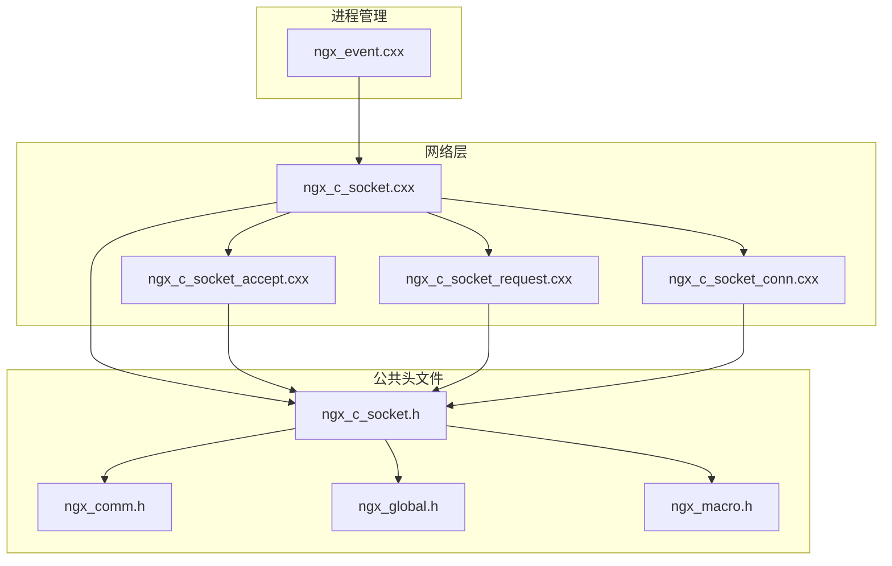
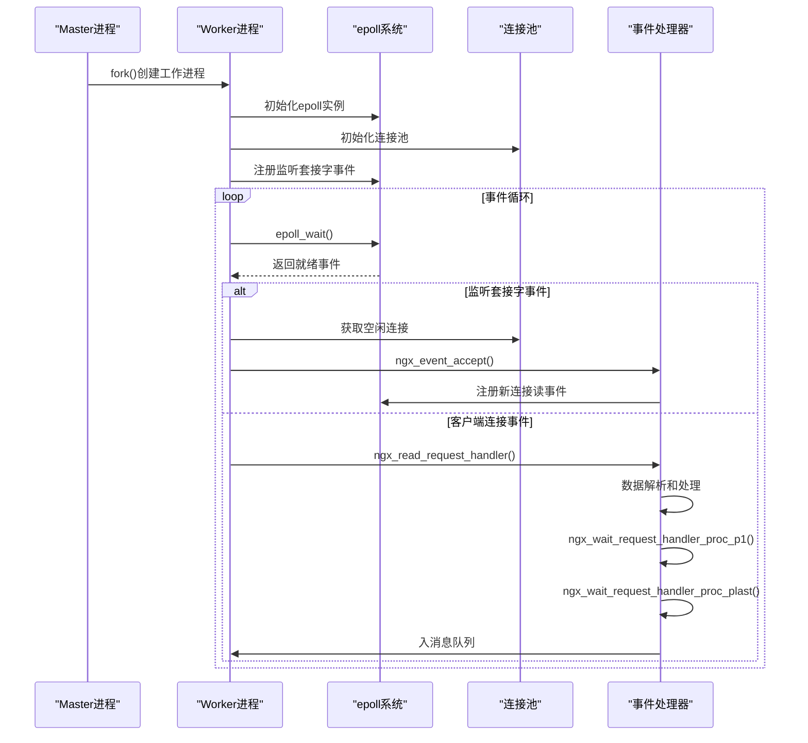
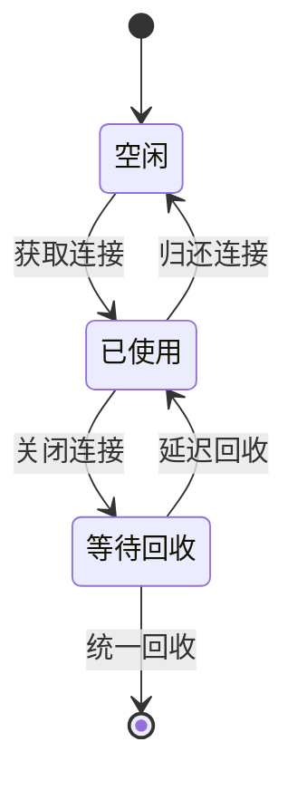
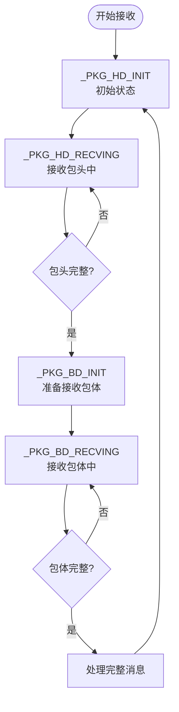
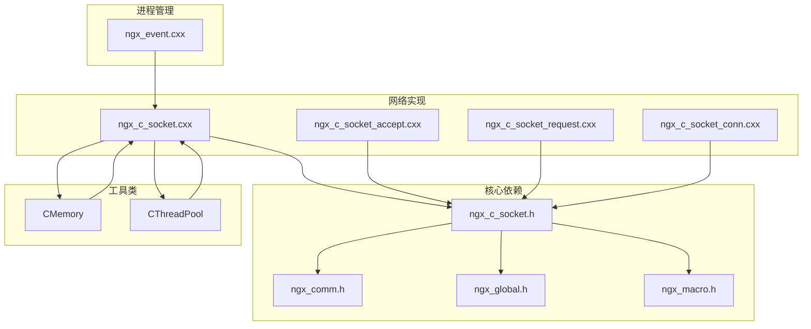

# Socket 连接结构

<cite>
**本文档引用的文件**
- [ngx_c_socket.h](file://include/ngx_c_socket.h)
- [ngx_c_socket.cxx](file://net/ngx_c_socket.cxx)
- [ngx_c_socket_conn.cxx](file://net/ngx_c_socket_conn.cxx)
- [ngx_c_socket_accept.cxx](file://net/ngx_c_socket_accept.cxx)
- [ngx_c_socket_request.cxx](file://net/ngx_c_socket_request.cxx)
- [ngx_event.cxx](file://proc/ngx_event.cxx)
- [ngx_comm.h](file://include/ngx_comm.h)
- [ngx_global.h](file://include/ngx_global.h)
- [ngx_macro.h](file://include/ngx_macro.h)
</cite>

## 目录
1. [简介](#简介)
2. [项目结构](#项目结构)
3. [核心组件](#核心组件)
4. [架构概览](#架构概览)
5. [详细组件分析](#详细组件分析)
6. [依赖关系分析](#依赖关系分析)
7. [性能考量](#性能考量)
8. [故障排除指南](#故障排除指南)
9. [结论](#结论)

## 简介
本文档深入解析 Socket 连接结构，重点阐述 ngx_connection_t 结构体的完整定义，包括连接状态管理、文件描述符、缓冲区指针、事件处理等核心字段。详细说明连接对象的生命周期管理，涵盖连接建立、数据传输、连接关闭的各个阶段。深入描述连接池的设计原理和连接复用机制，解释连接结构与 epoll 事件系统的集成方式，包括事件注册、回调处理和错误处理。提供连接对象的初始化、使用和销毁的完整代码示例，说明如何正确管理网络连接资源。

## 项目结构
该项目采用模块化设计，主要分为以下层次：
- **网络层**：负责底层网络通信，包括 Socket 操作、epoll 事件处理
- **逻辑层**：处理业务逻辑和消息队列
- **进程管理**：管理 worker 进程和事件循环
- **工具层**：提供内存管理、日志、配置等基础设施

**图表来源**
- [ngx_c_socket.cxx](file://net/ngx_c_socket.cxx#L1-L100)
- [ngx_c_socket.h](file://include/ngx_c_socket.h#L1-L50)

**章节来源**
- [ngx_c_socket.cxx](file://net/ngx_c_socket.cxx#L1-L100)
- [ngx_c_socket.h](file://include/ngx_c_socket.h#L1-L50)

## 核心组件

### ngx_connection_t 结构体详解

ngx_connection_t 是整个网络通信系统的核心数据结构，代表一个 TCP 连接的完整生命周期。

#### 基础字段
- **fd**: 套接字文件描述符，标识底层网络连接
- **listening**: 指向监听套接字的连接对象，用于区分监听连接和已建立连接
- **s_sockaddr**: 存储对端地址信息的 sockaddr 结构

#### 状态管理字段
- **curStat**: 当前收包状态，使用状态机管理数据接收过程
- **iCurrsequence**: 连接序列号，用于检测连接有效性
- **lastPingTime**: 上次心跳时间，用于连接保活检测

#### 事件处理字段
- **rhandler/wandler**: 读写事件处理器函数指针
- **events**: 当前注册的 epoll 事件标志

#### 缓冲区管理字段
- **dataHeadInfo**: 固定大小的包头缓冲区（20字节）
- **precvbuf/irecvlen**: 接收缓冲区指针和剩余接收长度
- **precvMemPointer**: 动态分配的完整包缓冲区指针
- **psendbuf/isendlen**: 发送缓冲区指针和剩余发送长度
- **psendMemPointer**: 发送完成后的内存指针

#### 同步和安全字段
- **logicPorcMutex**: 逻辑处理互斥量
- **iThrowsendCount**: 原子计数器，跟踪发送队列中的数据条目数
- **iSendCount**: 原子计数器，防止恶意客户端消耗服务器资源

#### 回收和网络安全部分
- **inRecyTime**: 入回收站时间戳
- **FloodkickLastTime/FloodAttackCount**: 防洪攻击检测相关字段

**章节来源**
- [ngx_c_socket.h](file://include/ngx_c_socket.h#L38-L91)
- [ngx_c_socket_conn.cxx](file://net/ngx_c_socket_conn.cxx#L27-L74)

### 连接池设计原理

连接池采用双列表设计，提供高效的连接复用机制：

#### 数据结构
- **m_connectionList**: 所有连接的完整列表
- **m_freeconnectionList**: 空闲连接列表，支持 O(1) 获取和归还
- **m_recyconnectionList**: 待回收连接队列，支持延迟回收

#### 关键特性
- **延迟回收**: 连接关闭后不立即释放，等待指定时间后统一回收
- **动态扩展**: 当空闲连接不足时自动创建新连接
- **线程安全**: 使用互斥量保护连接池操作
- **原子计数**: 使用 atomic 类型跟踪连接状态

**章节来源**
- [ngx_c_socket.h](file://include/ngx_c_socket.h#L209-L218)
- [ngx_c_socket_conn.cxx](file://net/ngx_c_socket_conn.cxx#L77-L156)

## 架构概览

系统采用事件驱动的异步网络架构，核心组件协同工作：

**图表来源**
- [ngx_c_socket.cxx](file://net/ngx_c_socket.cxx#L541-L587)
- [ngx_c_socket_accept.cxx](file://net/ngx_c_socket_accept.cxx#L22-L180)
- [ngx_event.cxx](file://proc/ngx_event.cxx#L14-L22)

## 详细组件分析

### 连接生命周期管理

#### 连接建立阶段
1. **监听套接字初始化**: 创建监听套接字并设置非阻塞模式
2. **连接池初始化**: 预分配固定数量的连接对象
3. **事件注册**: 将监听套接字注册到 epoll 中监听连接事件

#### 数据传输阶段
1. **连接接受**: 通过 accept4() 接受新连接
2. **连接配置**: 设置非阻塞模式，注册读事件
3. **数据接收**: 使用状态机处理包头和包体
4. **消息处理**: 将完整消息放入业务处理队列

#### 连接关闭阶段
1. **主动关闭**: 主动调用关闭连接函数
2. **被动关闭**: 对端关闭连接或发生错误
3. **延迟回收**: 连接进入回收队列等待统一回收

**图表来源**
- [ngx_c_socket_conn.cxx](file://net/ngx_c_socket_conn.cxx#L112-L156)

**章节来源**
- [ngx_c_socket_accept.cxx](file://net/ngx_c_socket_accept.cxx#L22-L180)
- [ngx_c_socket_conn.cxx](file://net/ngx_c_socket_conn.cxx#L112-L156)

### epoll 事件系统集成

#### 事件注册机制
- **EPOLL_CTL_ADD**: 添加新连接到 epoll 红黑树
- **EPOLL_CTL_MOD**: 修改现有连接的事件标志
- **事件标志**: EPOLLIN（可读）、EPOLLOUT（可写）、EPOLLRDHUP（连接关闭）

#### 回调处理流程
1. **事件获取**: epoll_wait() 返回就绪事件
2. **事件分发**: 根据事件类型调用相应的处理器
3. **处理器执行**: 调用连接对象的 rhandler 或 whandler

#### 错误处理策略
- **EINTR**: 信号中断，记录日志后继续
- **EMFILE/ENFILE**: 文件描述符耗尽，采取保护措施
- **ECONNABORTED**: 连接异常中止，记录错误后处理

**章节来源**
- [ngx_c_socket.cxx](file://net/ngx_c_socket.cxx#L679-L735)
- [ngx_c_socket.cxx](file://net/ngx_c_socket.cxx#L757-L808)

### 数据包处理状态机

系统实现了一个四状态的数据包接收状态机：

**图表来源**
- [ngx_comm.h](file://include/ngx_comm.h#L5-L12)
- [ngx_c_socket_request.cxx](file://net/ngx_c_socket_request.cxx#L25-L114)

**章节来源**
- [ngx_comm.h](file://include/ngx_comm.h#L5-L12)
- [ngx_c_socket_request.cxx](file://net/ngx_c_socket_request.cxx#L25-L114)

### 网络安全机制

#### 防洪攻击检测
- **时间间隔检测**: 通过 FloodkickLastTime 和 FloodAttackCount 字段检测
- **阈值控制**: 可配置的攻击检测开关和踢出阈值
- **实时响应**: 发现攻击行为立即关闭连接

#### 连接资源保护
- **发送队列限制**: 防止恶意客户端消耗服务器内存
- **连接池监控**: 检测异常的连接创建和销毁模式
- **超时踢出**: 基于时间队列的连接超时检测

**章节来源**
- [ngx_c_socket.h](file://include/ngx_c_socket.h#L84-L86)
- [ngx_c_socket.cxx](file://net/ngx_c_socket.cxx#L480-L509)

## 依赖关系分析

系统采用清晰的模块化依赖关系：

**图表来源**
- [ngx_c_socket.h](file://include/ngx_c_socket.h#L14-L16)
- [ngx_c_socket.cxx](file://net/ngx_c_socket.cxx#L14-L23)

**章节来源**
- [ngx_c_socket.h](file://include/ngx_c_socket.h#L14-L16)
- [ngx_c_socket.cxx](file://net/ngx_c_socket.cxx#L14-L23)

## 性能考量

### 连接池优化
- **预分配策略**: 启动时预分配固定数量的连接对象
- **延迟回收**: 减少频繁的内存分配和释放操作
- **原子操作**: 使用 atomic 类型避免锁竞争

### epoll 性能优化
- **非阻塞 I/O**: 所有 socket 都设置为非阻塞模式
- **事件批量处理**: epoll_wait() 返回多个事件一次性处理
- **状态机优化**: 减少不必要的内存拷贝和系统调用

### 内存管理
- **内存池**: 使用集中式的内存分配和回收
- **零拷贝**: 在可能的情况下避免数据拷贝
- **缓存友好**: 连接对象在内存中连续存储

## 故障排除指南

### 常见问题诊断

#### 连接建立失败
- **检查监听套接字**: 确认端口绑定和权限设置
- **验证非阻塞模式**: 确保 socket 正确设置为非阻塞
- **检查连接池状态**: 确认连接池有足够的空闲连接

#### 数据接收异常
- **状态机检查**: 验证 curStat 字段的正确转换
- **缓冲区管理**: 确认 precvbuf 和 irecvlen 的正确设置
- **内存分配**: 检查动态内存分配是否成功

#### epoll 事件处理问题
- **事件标志**: 验证注册的事件标志是否正确
- **处理器调用**: 确认 rhandler 和 whandler 的正确设置
- **错误码处理**: 检查 errno 的值和处理逻辑

**章节来源**
- [ngx_c_socket.cxx](file://net/ngx_c_socket.cxx#L757-L808)
- [ngx_c_socket_request.cxx](file://net/ngx_c_socket_request.cxx#L116-L154)

## 结论

该 Socket 连接结构设计体现了现代高性能网络服务器的核心理念：

1. **模块化设计**: 清晰的模块划分和接口定义
2. **事件驱动**: 基于 epoll 的高效事件处理机制
3. **连接池优化**: 提供高效的连接复用和资源管理
4. **状态机处理**: 规范化的数据包处理流程
5. **安全性考虑**: 内置的防洪攻击和资源保护机制

通过深入理解 ngx_connection_t 结构体的设计思想和实现细节，开发者可以更好地扩展和优化网络通信功能，构建稳定可靠的高性能网络应用。