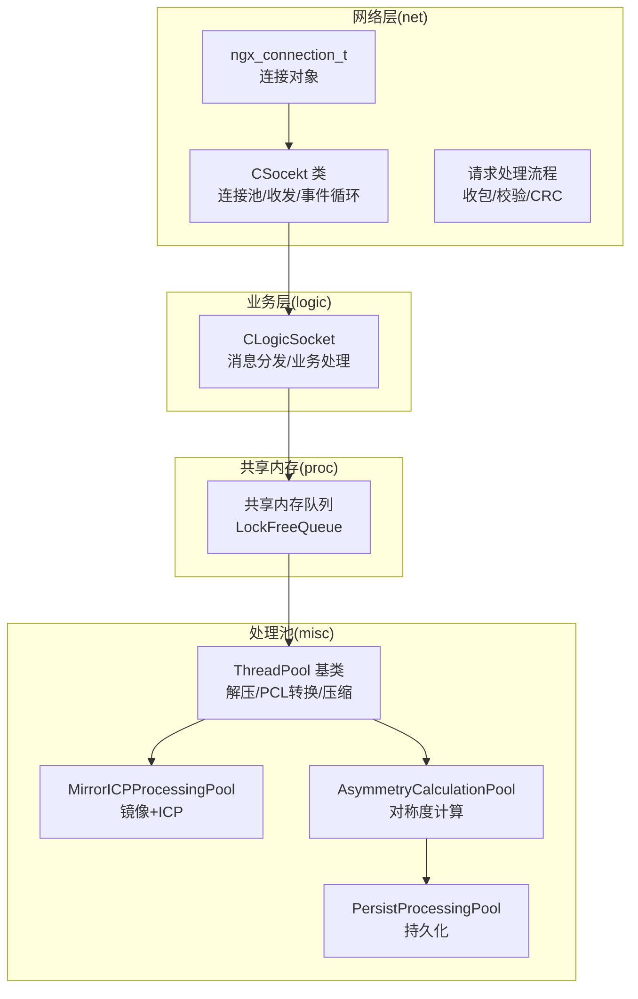
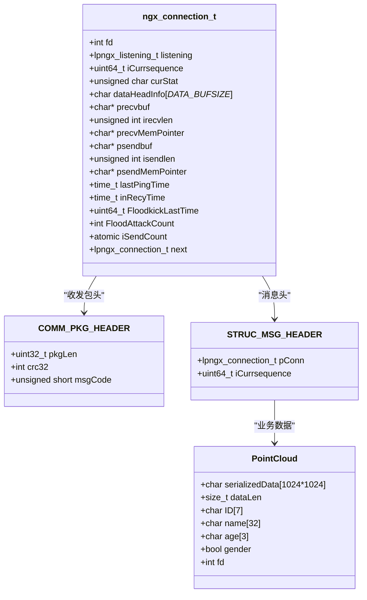
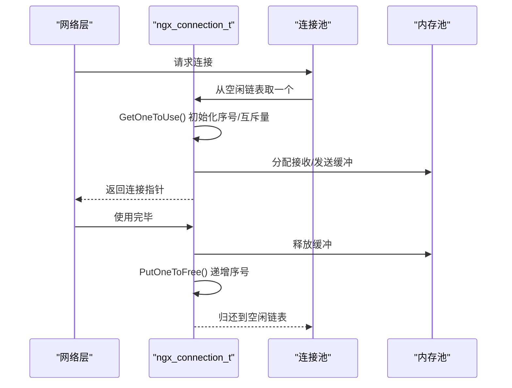
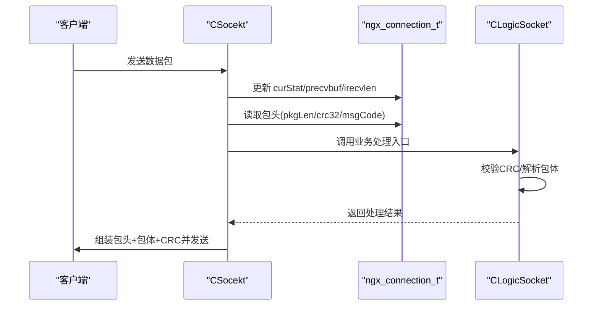
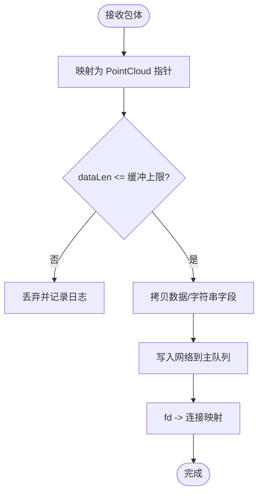
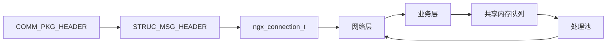

# 核心数据结构

<cite>
**本文引用的文件**
- [include/ngx_comm.h](file://include/ngx_comm.h)
- [include/ngx_c_socket.h](file://include/ngx_c_socket.h)
- [include/ngx_shared_memory.h](file://include/ngx_shared_memory.h)
- [net/ngx_c_socket_conn.cxx](file://net/ngx_c_socket_conn.cxx)
- [logic/ngx_c_slogic.cxx](file://logic/ngx_c_slogic.cxx)
- [net/ngx_c_socket.cxx](file://net/ngx_c_socket.cxx)
- [net/ngx_c_socket_request.cxx](file://net/ngx_c_socket_request.cxx)
- [misc/ngx_lockfree_threadPool.cxx](file://misc/ngx_lockfree_threadPool.cxx)
- [misc/ngx_lockfree_mirrorICP_threadPool.cxx](file://misc/ngx_lockfree_mirrorICP_threadPool.cxx)
- [misc/ngx_lockfree_asymCal_threadPool.cxx](file://misc/ngx_lockfree_asymCal_threadPool.cxx)
- [misc/ngx_lockfree_persistPool.cxx](file://misc/ngx_lockfree_persistPool.cxx)
- [proc/ngx_process_cycle.cxx](file://proc/ngx_process_cycle.cxx)
- [include/ngx_c_memory.h](file://include/ngx_c_memory.h)
</cite>

## 目录
1. [简介](#简介)
2. [项目结构](#项目结构)
3. [核心组件](#核心组件)
4. [架构总览](#架构总览)
5. [详细组件分析](#详细组件分析)
6. [依赖分析](#依赖分析)
7. [性能考量](#性能考量)
8. [故障排查指南](#故障排查指南)
9. [结论](#结论)
10. [附录](#附录)

## 简介
本文件面向点云服务器项目，提供核心数据结构的完整 API 参考与使用说明。重点覆盖以下结构体：
- ngx_connection_t：网络连接对象，承载 TCP 连接状态、收发缓冲、epoll 事件、心跳与安全计数等
- COMM_PKG_HEADER：网络通信包头，包含包总长、CRC32 校验、消息类型码
- STRUC_MSG_HEADER：消息头，记录连接指针与序号，便于连接有效性校验
- PointCloud：点云数据载体，包含压缩后的点云字节流、元数据与 socket 文件描述符

文档将从字段定义、取值范围、约束条件、业务含义、内存布局、生命周期、初始化与序列化/反序列化 API、设计原则与性能注意事项等方面进行系统阐述，并给出关键流程的时序图与类图。

## 项目结构
该项目采用“按职责分层 + 按模块划分”的组织方式：
- include：公共头文件，定义网络协议、全局类型、宏与接口声明
- net：网络层实现，负责连接池、收发、epoll 事件循环与请求处理
- logic：业务逻辑层，解析包头、校验 CRC、路由消息、触发后续处理
- misc：多线程处理池，包含点云解压、PCL 转换、镜像+ICP、对称度计算、持久化等
- proc：进程与线程调度、共享内存队列、跨模块编排
- persist：数据库连接池与持久化流程

**图表来源**
- [include/ngx_c_socket.h](file://include/ngx_c_socket.h#L38-L91)
- [include/ngx_shared_memory.h](file://include/ngx_shared_memory.h#L24-L63)
- [misc/ngx_lockfree_threadPool.cxx](file://misc/ngx_lockfree_threadPool.cxx#L1-L67)
- [misc/ngx_lockfree_mirrorICP_threadPool.cxx](file://misc/ngx_lockfree_mirrorICP_threadPool.cxx#L35-L58)
- [misc/ngx_lockfree_asymCal_threadPool.cxx](file://misc/ngx_lockfree_asymCal_threadPool.cxx#L61-L95)
- [misc/ngx_lockfree_persistPool.cxx](file://misc/ngx_lockfree_persistPool.cxx#L52-L78)

**章节来源**
- [include/ngx_c_socket.h](file://include/ngx_c_socket.h#L1-L258)
- [include/ngx_shared_memory.h](file://include/ngx_shared_memory.h#L1-L193)

## 核心组件
本节对四个关键结构体逐一进行定义、字段说明、使用场景与 API 概览。

### ngx_connection_t
- 定义位置：[include/ngx_c_socket.h](file://include/ngx_c_socket.h#L38-L91)
- 角色：表示一个 TCP 连接，承载 socket 句柄、地址信息、收发缓冲、epoll 事件、心跳与安全计数、发送队列计数、回收时间等
- 关键字段与约束
  - fd：int，socket 句柄，连接标识
  - listening：lpngx_listening_t，若连接被分配给监听套接字，指向监听对象
  - iCurrsequence：uint64_t，连接分配序号，用于检测过期/失效连接
  - s_sockaddr：sockaddr，远端地址信息
  - rhandler/wandler：事件处理函数指针，分别处理读/写事件
  - events：uint32_t，epoll 事件标志
  - curStat：unsigned char，收包状态机（初始/接收包头/接收包体等）
  - dataHeadInfo[_DATA_BUFSIZE_]：char，固定大小缓冲，用于先收包头
  - precvbuf/irecvlen/precvMemPointer：接收缓冲指针、期望接收长度、动态分配的接收内存首地址
  - iThrowsendCount/psendMemPointer/psendbuf/isendlen：发送相关，发送队列计数、发送缓冲头指针、发送缓冲指针、发送长度
  - inRecyTime：time_t，进入回收队列的时间
  - lastPingTime：time_t，最近一次心跳时间
  - FloodkickLastTime/FloodAttackCount/iSendCount：防洪攻击检测与踢人相关
  - next：lpngx_connection_t，连接池空闲链表指针
- 生命周期与初始化
  - 构造/析构：[net/ngx_c_socket_conn.cxx](file://net/ngx_c_socket_conn.cxx#L27-L35)
  - 分配使用：GetOneToUse()，初始化序号与互斥量，设置 fd，减少空闲计数
  - 归还回收：PutOneToFree()，递增序号，释放接收/发送缓冲，清零发送计数
  - 连接池获取/归还：[net/ngx_c_socket_conn.cxx](file://net/ngx_c_socket_conn.cxx#L115-L145)
- 使用场景
  - 事件循环中作为读/写回调参数
  - 收包阶段用于暂存包头、动态分配包体缓冲
  - 发送阶段用于拼接消息头+包头+包体，计算 CRC 并入发送队列
- 相关 API
  - 初始化连接池：[net/ngx_c_socket_conn.cxx](file://net/ngx_c_socket_conn.cxx#L77-L114)
  - 获取连接：ngx_get_connection()
  - 归还连接：ngx_free_connection()
  - 发送队列入队：msgSend()

**章节来源**
- [include/ngx_c_socket.h](file://include/ngx_c_socket.h#L38-L91)
- [net/ngx_c_socket_conn.cxx](file://net/ngx_c_socket_conn.cxx#L27-L35)
- [net/ngx_c_socket_conn.cxx](file://net/ngx_c_socket_conn.cxx#L115-L145)

### COMM_PKG_HEADER
- 定义位置：[include/ngx_comm.h](file://include/ngx_comm.h#L19-L25)
- 角色：网络通信包头，统一承载包总长度、CRC32 校验与消息类型码
- 字段与约束
  - pkgLen：uint32_t，包总长度（包头+包体），网络序传输，需用 htonl/ntohl 转换
  - crc32：int，CRC32 校验值，网络序传输，需用 htonl/ntohl 转换
  - msgCode：unsigned short，消息类型码，网络序传输，需用 htons/ntohs 转换
- 设计原则
  - 1 字节对齐，紧凑布局，避免跨平台字节序差异导致的解析错误
  - 包体长度与 CRC32 用于完整性校验，消息类型码用于路由业务处理
- 使用场景
  - 接收阶段：解析 pkgLen 判断包体长度，分配动态缓冲，校验 CRC
  - 发送阶段：填充 pkgLen/msgCode/crc32，计算并写入包头
- 相关 API
  - 接收流程：[net/ngx_c_socket_request.cxx](file://net/ngx_c_socket_request.cxx#L166-L185)
  - 发送流程：[net/ngx_c_socket.cxx](file://net/ngx_c_socket.cxx#L899-L927)

**章节来源**
- [include/ngx_comm.h](file://include/ngx_comm.h#L19-L25)
- [net/ngx_c_socket_request.cxx](file://net/ngx_c_socket_request.cxx#L166-L185)
- [net/ngx_c_socket.cxx](file://net/ngx_c_socket.cxx#L899-L927)

### STRUC_MSG_HEADER
- 定义位置：[include/ngx_c_socket.h](file://include/ngx_c_socket.h#L94-L99)
- 角色：消息头，记录连接指针与连接序号，便于在业务层校验连接有效性
- 字段与约束
  - pConn：lpngx_connection_t，指向对应连接对象
  - iCurrsequence：uint64_t，连接分配时的序号，用于检测连接是否已失效
- 使用场景
  - 接收线程中，将消息头与包头拼接，作为业务处理入口参数
  - 业务处理中，通过 iCurrsequence 与连接对象的当前序号对比，判断连接是否仍有效
- 相关 API
  - 消息头拼接与发送：[net/ngx_c_socket.cxx](file://net/ngx_c_socket.cxx#L899-L927)
  - 业务处理入口：[logic/ngx_c_slogic.cxx](file://logic/ngx_c_slogic.cxx#L77-L101)

**章节来源**
- [include/ngx_c_socket.h](file://include/ngx_c_socket.h#L94-L99)
- [net/ngx_c_socket.cxx](file://net/ngx_c_socket.cxx#L899-L927)
- [logic/ngx_c_slogic.cxx](file://logic/ngx_c_slogic.cxx#L77-L101)

### PointCloud
- 定义位置：[include/ngx_shared_memory.h](file://include/ngx_shared_memory.h#L24-L33)
- 角色：点云数据载体，承载压缩后的点云字节流、元数据与 socket 文件描述符，用于跨模块传递
- 字段与约束
  - serializedData：char[1024*1024]，压缩后的点云字节流缓冲
  - dataLen：size_t，serializedData 实际长度，受缓冲上限约束
  - ID/name/age/gender：标识与人口学信息，用于结果关联与持久化
  - fd：int，socket 文件描述符，用于将结果回传给客户端
- 设计原则
  - 缓冲上限 1MB，避免单条消息过大导致内存压力
  - 通过 fd 建立“请求-响应”映射，确保结果回传目标明确
- 使用场景
  - 接收阶段：从包体反序列化为 PointCloud，写入网络到主队列
  - 处理阶段：解压、PCL 转换、镜像+ICP、对称度计算、持久化
  - 发送阶段：将结果封装为 ResToNetwork，计算 CRC 后发送
- 相关 API
  - 接收与反序列化：[logic/ngx_c_slogic.cxx](file://logic/ngx_c_slogic.cxx#L190-L243)
  - 解压与转换：[misc/ngx_lockfree_threadPool.cxx](file://misc/ngx_lockfree_threadPool.cxx#L3-L41)
  - 镜像+ICP：[misc/ngx_lockfree_mirrorICP_threadPool.cxx](file://misc/ngx_lockfree_mirrorICP_threadPool.cxx#L35-L58)
  - 对称度计算与入队：[misc/ngx_lockfree_asymCal_threadPool.cxx](file://misc/ngx_lockfree_asymCal_threadPool.cxx#L61-L95)
  - 持久化写文件：[misc/ngx_lockfree_persistPool.cxx](file://misc/ngx_lockfree_persistPool.cxx#L52-L78)

**章节来源**
- [include/ngx_shared_memory.h](file://include/ngx_shared_memory.h#L24-L33)
- [logic/ngx_c_slogic.cxx](file://logic/ngx_c_slogic.cxx#L190-L243)
- [misc/ngx_lockfree_threadPool.cxx](file://misc/ngx_lockfree_threadPool.cxx#L3-L41)
- [misc/ngx_lockfree_mirrorICP_threadPool.cxx](file://misc/ngx_lockfree_mirrorICP_threadPool.cxx#L35-L58)
- [misc/ngx_lockfree_asymCal_threadPool.cxx](file://misc/ngx_lockfree_asymCal_threadPool.cxx#L61-L95)
- [misc/ngx_lockfree_persistPool.cxx](file://misc/ngx_lockfree_persistPool.cxx#L52-L78)

## 架构总览
下图展示核心数据结构在系统中的交互关系与流转路径：

**图表来源**
- [include/ngx_c_socket.h](file://include/ngx_c_socket.h#L38-L99)
- [include/ngx_comm.h](file://include/ngx_comm.h#L19-L25)
- [include/ngx_shared_memory.h](file://include/ngx_shared_memory.h#L24-L33)

## 详细组件分析

### 网络连接对象 ngx_connection_t
- 内存布局与对齐
  - 字段紧凑排列，配合 1 字节对齐策略，确保跨平台传输一致性
- 生命周期管理
  - 连接池：预先创建固定数量连接，空闲链表管理，按需分配/回收
  - 动态内存：接收/发送缓冲通过内存池分配，连接回收时统一释放
- 关键 API
  - 初始化连接池：[net/ngx_c_socket_conn.cxx](file://net/ngx_c_socket_conn.cxx#L77-L114)
  - 获取连接：ngx_get_connection()
  - 归还连接：ngx_free_connection()
  - 事件处理：读/写事件处理器在 CSocekt 中注册

**图表来源**
- [net/ngx_c_socket_conn.cxx](file://net/ngx_c_socket_conn.cxx#L115-L145)
- [include/ngx_c_memory.h](file://include/ngx_c_memory.h#L46-L47)

**章节来源**
- [include/ngx_c_socket.h](file://include/ngx_c_socket.h#L38-L91)
- [net/ngx_c_socket_conn.cxx](file://net/ngx_c_socket_conn.cxx#L77-L145)
- [include/ngx_c_memory.h](file://include/ngx_c_memory.h#L46-L47)

### 包头结构 COMM_PKG_HEADER
- 字段语义
  - pkgLen：包总长度，含包头与包体，网络序传输
  - crc32：包体 CRC32 校验，网络序传输
  - msgCode：消息类型码，网络序传输
- 收发流程
  - 接收：解析 pkgLen，分配动态缓冲，读取包体，计算 CRC 与包头中 crc32 比较
  - 发送：填充 pkgLen/msgCode/crc32，计算并写入包头，入发送队列

**图表来源**
- [net/ngx_c_socket_request.cxx](file://net/ngx_c_socket_request.cxx#L166-L185)
- [logic/ngx_c_slogic.cxx](file://logic/ngx_c_slogic.cxx#L77-L101)
- [net/ngx_c_socket.cxx](file://net/ngx_c_socket.cxx#L899-L927)

**章节来源**
- [include/ngx_comm.h](file://include/ngx_comm.h#L19-L25)
- [net/ngx_c_socket_request.cxx](file://net/ngx_c_socket_request.cxx#L166-L185)
- [logic/ngx_c_slogic.cxx](file://logic/ngx_c_slogic.cxx#L77-L101)
- [net/ngx_c_socket.cxx](file://net/ngx_c_socket.cxx#L899-L927)

### 消息头 STRUC_MSG_HEADER
- 字段语义
  - pConn：记录对应连接指针，便于业务层直接访问连接上下文
  - iCurrsequence：记录连接分配时的序号，用于连接有效性校验
- 使用要点
  - 发送前填充 pConn 与 iCurrsequence
  - 业务处理中通过 iCurrsequence 与连接对象当前序号对比，判断连接是否仍有效

**章节来源**
- [include/ngx_c_socket.h](file://include/ngx_c_socket.h#L94-L99)
- [net/ngx_c_socket.cxx](file://net/ngx_c_socket.cxx#L899-L927)

### 点云结构 PointCloud
- 字段语义
  - serializedData/dataLen：压缩后的点云字节流与长度
  - ID/name/age/gender：用户标识与人口学信息
  - fd：socket 文件描述符，用于结果回传
- 反序列化流程
  - 从包体映射为 PointCloud 指针，处理 dataLen 网络序->主机序，拷贝数据并写入共享队列
- 处理链路
  - 解压 -> PCL 转换 -> 镜像+ICP -> 压缩 -> 对称度计算 -> 持久化 -> 回传

**图表来源**
- [logic/ngx_c_slogic.cxx](file://logic/ngx_c_slogic.cxx#L190-L243)

**章节来源**
- [include/ngx_shared_memory.h](file://include/ngx_shared_memory.h#L24-L33)
- [logic/ngx_c_slogic.cxx](file://logic/ngx_c_slogic.cxx#L190-L243)

## 依赖分析
- 结构体依赖
  - ngx_connection_t 依赖内存池进行缓冲分配与释放
  - STRUC_MSG_HEADER 依赖 ngx_connection_t 提供连接上下文
  - PointCloud 依赖共享内存队列在各处理池间传递
- 模块耦合
  - 网络层与业务层通过消息头与包头解耦
  - 处理池通过共享内存队列解耦，支持异步与并发

**图表来源**
- [include/ngx_comm.h](file://include/ngx_comm.h#L19-L25)
- [include/ngx_c_socket.h](file://include/ngx_c_socket.h#L94-L99)
- [include/ngx_shared_memory.h](file://include/ngx_shared_memory.h#L65-L84)

**章节来源**
- [include/ngx_shared_memory.h](file://include/ngx_shared_memory.h#L65-L84)

## 性能考量
- 字节对齐与紧凑布局
  - 通过 #pragma pack(1) 确保跨平台传输一致性，降低解析开销
- 内存管理
  - 连接池预分配，避免频繁 new/delete；缓冲统一由内存池管理，减少碎片
- 队列与并发
  - 共享内存队列基于无锁队列，降低锁竞争；处理池并行化提升吞吐
- 网络序转换
  - 所有网络字段均进行网络序与主机序转换，避免跨平台数据不一致
- 队列拥塞控制
  - 处理池在队列过载时采用动态退避策略，避免忙等与资源浪费

[本节为通用性能建议，无需特定文件来源]

## 故障排查指南
- 收包异常
  - 检查 pkgLen 是否小于包头长度，确认 curStat 是否回到初始状态
  - 核对 CRC32 校验是否通过，必要时打印包体长度与校验值
- 连接失效
  - 比较 STRUC_MSG_HEADER 中的 iCurrsequence 与连接对象当前序号，确认连接是否已被回收
- 队列积压
  - 监控各共享内存队列 size，必要时增大线程数或启用动态退避策略
- 内存泄漏
  - 确认连接回收时 precvMemPointer/psendMemPointer 已释放，内存池未重复释放

**章节来源**
- [net/ngx_c_socket_request.cxx](file://net/ngx_c_socket_request.cxx#L166-L185)
- [logic/ngx_c_slogic.cxx](file://logic/ngx_c_slogic.cxx#L77-L101)
- [proc/ngx_process_cycle.cxx](file://proc/ngx_process_cycle.cxx#L759-L789)

## 结论
本文系统梳理了点云服务器项目中的核心数据结构：ngx_connection_t、COMM_PKG_HEADER、STRUC_MSG_HEADER、PointCloud。通过对字段定义、内存布局、生命周期、初始化与序列化/反序列化 API 的深入分析，结合收发流程、处理链路与共享内存队列的使用，帮助读者准确理解各结构的业务含义与最佳实践。建议在实际开发中严格遵循网络序转换、紧凑布局与连接池管理规范，以获得稳定与高性能的系统表现。

[本节为总结性内容，无需特定文件来源]

## 附录
- 关键流程参考路径
  - 接收与反序列化：[logic/ngx_c_slogic.cxx](file://logic/ngx_c_slogic.cxx#L190-L243)
  - 发送与 CRC 计算：[net/ngx_c_socket.cxx](file://net/ngx_c_socket.cxx#L899-L927)
  - 镜像+ICP 处理：[misc/ngx_lockfree_mirrorICP_threadPool.cxx](file://misc/ngx_lockfree_mirrorICP_threadPool.cxx#L35-L58)
  - 对称度计算与入队：[misc/ngx_lockfree_asymCal_threadPool.cxx](file://misc/ngx_lockfree_asymCal_threadPool.cxx#L61-L95)
  - 持久化写文件：[misc/ngx_lockfree_persistPool.cxx](file://misc/ngx_lockfree_persistPool.cxx#L52-L78)
  - 动态退避策略：[proc/ngx_process_cycle.cxx](file://proc/ngx_process_cycle.cxx#L759-L789)

[本节为补充说明，无需特定文件来源]