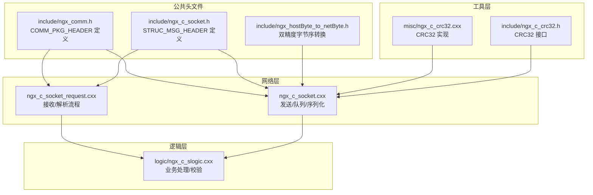
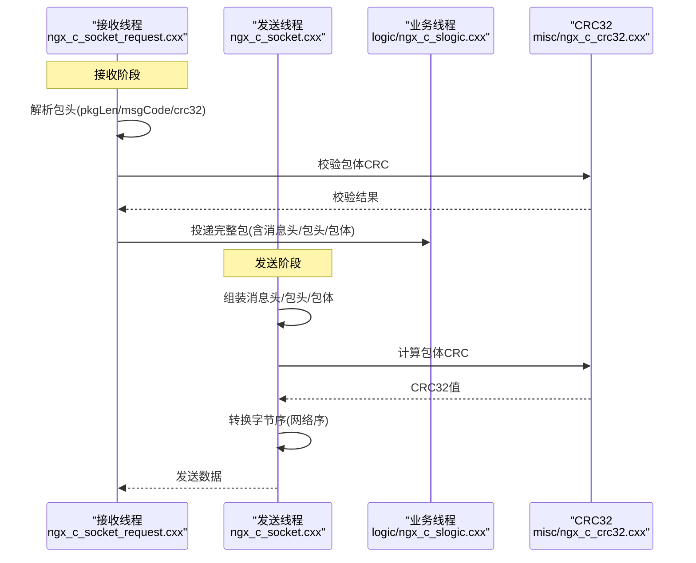
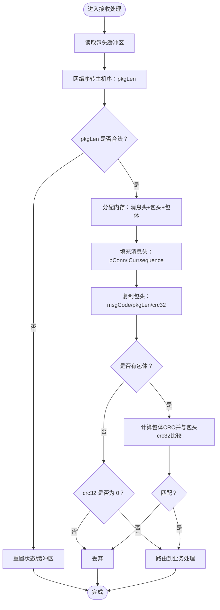
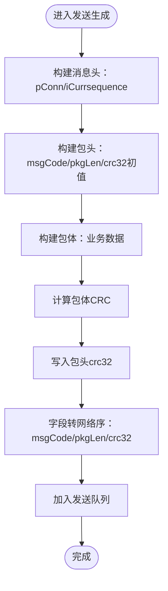
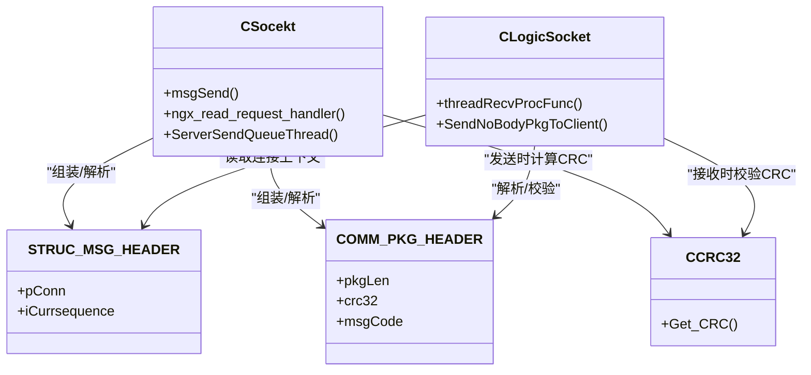

# 消息头结构

<cite>
**本文引用的文件**
- [include/ngx_comm.h](file://include/ngx_comm.h)
- [include/ngx_c_socket.h](file://include/ngx_c_socket.h)
- [include/ngx_hostByte_to_netByte.h](file://include/ngx_hostByte_to_netByte.h)
- [net/ngx_c_socket_request.cxx](file://net/ngx_c_socket_request.cxx)
- [net/ngx_c_socket.cxx](file://net/ngx_c_socket.cxx)
- [logic/ngx_c_slogic.cxx](file://logic/ngx_c_slogic.cxx)
- [misc/ngx_c_crc32.cxx](file://misc/ngx_c_crc32.cxx)
- [include/ngx_c_crc32.h](file://include/ngx_c_crc32.h)
</cite>

## 目录
1. [简介](#简介)
2. [项目结构](#项目结构)
3. [核心组件](#核心组件)
4. [架构总览](#架构总览)
5. [详细组件分析](#详细组件分析)
6. [依赖分析](#依赖分析)
7. [性能考量](#性能考量)
8. [故障排查指南](#故障排查指南)
9. [结论](#结论)

## 简介
本文围绕消息头结构展开，系统性梳理 STRUC_MSG_HEADER 与 COMM_PKG_HEADER 的完整定义、字段语义、序列化与网络传输规范、与业务逻辑的对应关系、安全与完整性校验、以及解析/验证/生成流程与性能优化实践。文档严格基于仓库源码进行分析，避免臆测。

## 项目结构
本项目采用分层与模块化组织，网络层负责收发与协议编解码，逻辑层负责业务处理，工具层提供 CRC32 校验与内存管理等支撑能力。消息头结构位于网络层与逻辑层的边界处，既承载连接上下文，又参与协议解析与安全校验。

图表来源
- [include/ngx_comm.h](file://include/ngx_comm.h#L15-L28)
- [include/ngx_c_socket.h](file://include/ngx_c_socket.h#L93-L99)
- [include/ngx_hostByte_to_netByte.h](file://include/ngx_hostByte_to_netByte.h#L1-L19)
- [net/ngx_c_socket_request.cxx](file://net/ngx_c_socket_request.cxx#L158-L200)
- [net/ngx_c_socket.cxx](file://net/ngx_c_socket.cxx#L890-L927)
- [logic/ngx_c_slogic.cxx](file://logic/ngx_c_slogic.cxx#L76-L129)
- [misc/ngx_c_crc32.cxx](file://misc/ngx_c_crc32.cxx#L1-L88)
- [include/ngx_c_crc32.h](file://include/ngx_c_crc32.h#L1-L63)

章节来源
- [include/ngx_comm.h](file://include/ngx_comm.h#L1-L32)
- [include/ngx_c_socket.h](file://include/ngx_c_socket.h#L1-L258)

## 核心组件
- STRUC_MSG_HEADER：消息头，用于在完整包到达后携带连接上下文（连接指针与序号），便于后续业务处理与安全校验。
- COMM_PKG_HEADER：包头，包含三要素：消息类型标识、包总长度、CRC32 校验值，用于协议解析与完整性校验。

章节来源
- [include/ngx_c_socket.h](file://include/ngx_c_socket.h#L93-L99)
- [include/ngx_comm.h](file://include/ngx_comm.h#L19-L25)

## 架构总览
消息在接收侧按“包头 → 包体”的顺序解析，发送侧按“消息头 + 包头 + 包体”顺序组装。字节序转换与 CRC32 校验贯穿两端，确保跨平台一致性与数据完整性。

图表来源
- [net/ngx_c_socket_request.cxx](file://net/ngx_c_socket_request.cxx#L158-L200)
- [logic/ngx_c_slogic.cxx](file://logic/ngx_c_slogic.cxx#L76-L129)
- [net/ngx_c_socket.cxx](file://net/ngx_c_socket.cxx#L890-L927)
- [misc/ngx_c_crc32.cxx](file://misc/ngx_c_crc32.cxx#L69-L87)

## 详细组件分析

### STRUC_MSG_HEADER 结构
- 字段
  - pConn：指向底层连接对象，便于业务层直接访问连接属性（如 fd、心跳时间、统计计数等）。
  - iCurrsequence：收到包时记录连接的序号，用于后续丢弃过期/失效包。
- 作用
  - 在完整包到达后，作为“消息上下文”附着在内存块前部，供业务线程直接读取。
  - 与发送队列中的“连接失效校验”配合，避免对已断开连接的过期包进行处理。
- 对齐与大小
  - 仅包含两个指针/整型字段，大小由编译器决定，但结构体本身不涉及结构体内对齐控制，其大小由字段决定。

章节来源
- [include/ngx_c_socket.h](file://include/ngx_c_socket.h#L93-L99)
- [net/ngx_c_socket.cxx](file://net/ngx_c_socket.cxx#L978-L988)

### COMM_PKG_HEADER 结构
- 字段
  - pkgLen：包总长度（包头 + 包体）。网络传输前需转换为网络序。
  - crc32：CRC32 校验值。网络传输前需转换为网络序。
  - msgCode：消息类型标识（命令码）。网络传输前需转换为网络序。
- 对齐与大小
  - 使用 1 字节对齐，确保结构体紧凑排列，避免填充字节影响序列化。
  - 结构体大小固定，便于收包时按固定偏移解析。
- 字节序处理
  - 发送：msgCode/pkgLen/crc32 均需转换为网络序后再写入。
  - 接收：pkgLen/msgCode/crc32 均需从网络序转换为主机序后使用。
- 安全与完整性
  - 仅包头时，crc32 应为 0。
  - 有包体时，crc32 为包体的 CRC32 值，接收端需重新计算并与包头中的值对比。

章节来源
- [include/ngx_comm.h](file://include/ngx_comm.h#L15-L28)
- [include/ngx_comm.h](file://include/ngx_comm.h#L19-L25)
- [net/ngx_c_socket_request.cxx](file://net/ngx_c_socket_request.cxx#L167-L177)
- [logic/ngx_c_slogic.cxx](file://logic/ngx_c_slogic.cxx#L84-L104)
- [net/ngx_c_socket.cxx](file://net/ngx_c_socket.cxx#L903-L916)

### 协议版本兼容性与演进策略
- 当前仓库未定义独立的“协议版本号”字段，消息头结构固定。
- 兼容策略建议（基于现有实现的合理推断）：
  - 新增字段时，应保持 pkgLen 与 msgCode 的相对位置不变，避免破坏现有解析。
  - 新增字段可通过“包体扩展”实现，消息类型标识 msgCode 可区分旧/新格式。
  - 通过 msgCode 的取值范围与业务约定，区分不同版本的包体结构。
- 注意：以上为兼容性建议，非仓库现有实现。

### 序列化格式与网络传输规范
- 序列化布局（发送侧）
  - 内存布局：消息头（STRUC_MSG_HEADER） | 包头（COMM_PKG_HEADER） | 包体（业务数据）
  - 字段顺序：msgCode → pkgLen → crc32（均为网络序）
- 字节序
  - 所有整型字段在网络传输前均转换为网络序（htons/htonl/htonll/自定义 htond）。
  - 接收侧统一转换为主机序（ntohs/ntohl/ntohll/自定义 ntohd）。
- 对齐要求
  - 包头结构使用 1 字节对齐，避免填充字节影响跨平台序列化。
- 时间戳
  - 消息头结构未包含时间戳字段；如需时间戳，建议通过包体扩展字段实现。

章节来源
- [include/ngx_comm.h](file://include/ngx_comm.h#L15-L28)
- [include/ngx_hostByte_to_netByte.h](file://include/ngx_hostByte_to_netByte.h#L1-L19)
- [net/ngx_c_socket.cxx](file://net/ngx_c_socket.cxx#L903-L916)
- [net/ngx_c_socket_request.cxx](file://net/ngx_c_socket_request.cxx#L167-L177)

### 与业务逻辑的对应关系
- 消息路由
  - 通过 msgCode 将包路由至对应处理函数（状态表映射）。
- 处理优先级
  - 心跳包（ping）在业务处理前更新连接最近心跳时间，保障连接存活。
- 错误分类
  - 非法包体长度、未知消息码、CRC 错误、连接失效等均导致丢弃并记录日志。

章节来源
- [logic/ngx_c_slogic.cxx](file://logic/ngx_c_slogic.cxx#L107-L127)
- [logic/ngx_c_slogic.cxx](file://logic/ngx_c_slogic.cxx#L176-L189)

### 解析、验证与生成流程

#### 接收解析与验证（接收线程）

图表来源
- [net/ngx_c_socket_request.cxx](file://net/ngx_c_socket_request.cxx#L158-L200)
- [logic/ngx_c_slogic.cxx](file://logic/ngx_c_slogic.cxx#L76-L104)

#### 发送生成与校验（发送线程）

图表来源
- [net/ngx_c_socket.cxx](file://net/ngx_c_socket.cxx#L890-L927)
- [misc/ngx_c_crc32.cxx](file://misc/ngx_c_crc32.cxx#L69-L87)

### 完整代码示例路径（不展示具体代码）
- 接收解析与校验
  - [接收阶段入口与状态机](file://net/ngx_c_socket_request.cxx#L25-L114)
  - [包头解析与长度校验](file://net/ngx_c_socket_request.cxx#L158-L200)
  - [业务线程解析与CRC校验](file://logic/ngx_c_slogic.cxx#L76-L104)
- 发送生成与校验
  - [发送队列线程与消息头/包头组装](file://net/ngx_c_socket.cxx#L890-L927)
  - [CRC32 计算接口](file://include/ngx_c_crc32.h#L45-L48)
  - [CRC32 表初始化与计算](file://misc/ngx_c_crc32.cxx#L37-L87)
- 字节序转换
  - [双精度字节序转换（主机↔网络）](file://include/ngx_hostByte_to_netByte.h#L1-L19)

章节来源
- [net/ngx_c_socket_request.cxx](file://net/ngx_c_socket_request.cxx#L25-L114)
- [net/ngx_c_socket_request.cxx](file://net/ngx_c_socket_request.cxx#L158-L200)
- [logic/ngx_c_slogic.cxx](file://logic/ngx_c_slogic.cxx#L76-L104)
- [net/ngx_c_socket.cxx](file://net/ngx_c_socket.cxx#L890-L927)
- [include/ngx_c_crc32.h](file://include/ngx_c_crc32.h#L45-L48)
- [misc/ngx_c_crc32.cxx](file://misc/ngx_c_crc32.cxx#L37-L87)
- [include/ngx_hostByte_to_netByte.h](file://include/ngx_hostByte_to_netByte.h#L1-L19)

## 依赖分析
- STRUC_MSG_HEADER 依赖连接对象（ngx_connection_t）与发送队列机制，用于连接失效校验与发送调度。
- COMM_PKG_HEADER 依赖字节序转换与 CRC32 校验，确保跨平台一致性与数据完整性。
- 业务层通过 msgCode 路由到具体处理函数，形成松耦合的消息分发。

图表来源
- [include/ngx_c_socket.h](file://include/ngx_c_socket.h#L93-L99)
- [include/ngx_comm.h](file://include/ngx_comm.h#L19-L25)
- [net/ngx_c_socket.cxx](file://net/ngx_c_socket.cxx#L890-L927)
- [logic/ngx_c_slogic.cxx](file://logic/ngx_c_slogic.cxx#L76-L129)
- [include/ngx_c_crc32.h](file://include/ngx_c_crc32.h#L16-L29)

章节来源
- [include/ngx_c_socket.h](file://include/ngx_c_socket.h#L93-L99)
- [include/ngx_comm.h](file://include/ngx_comm.h#L19-L25)
- [net/ngx_c_socket.cxx](file://net/ngx_c_socket.cxx#L890-L927)
- [logic/ngx_c_slogic.cxx](file://logic/ngx_c_slogic.cxx#L76-L129)
- [include/ngx_c_crc32.h](file://include/ngx_c_crc32.h#L16-L29)

## 性能考量
- 结构体紧凑：包头使用 1 字节对齐，避免填充字节，降低序列化/反序列化开销。
- 字节序转换：仅在发送/接收时进行一次转换，避免重复转换带来的额外成本。
- CRC32：仅在有包体时计算，且在发送端一次性计算，接收端一次性校验，复杂度 O(n)。
- 发送队列：通过原子计数与互斥保护，避免频繁加锁；发送缓冲区满时通过 epoll 事件驱动，减少忙轮询。
- 连接失效校验：在发送队列与业务线程中均进行连接序号校验，避免对已断开连接的无效处理。

章节来源
- [include/ngx_comm.h](file://include/ngx_comm.h#L15-L28)
- [net/ngx_c_socket.cxx](file://net/ngx_c_socket.cxx#L978-L988)
- [logic/ngx_c_slogic.cxx](file://logic/ngx_c_slogic.cxx#L107-L127)

## 故障排查指南
- 常见错误与定位
  - 包长度非法：接收端检测到 pkgLen 小于包头长度，会重置状态并继续接收。
  - CRC 错误：业务线程计算包体 CRC 与包头中值不一致，直接丢弃。
  - 消息码非法：超出业务定义范围或未注册处理函数，记录日志并丢弃。
  - 连接失效：发送队列中连接序号与当前连接不一致，丢弃并释放内存。
- 关键日志与断点
  - 接收阶段：长度校验、Flood 攻击检测、包体长度与内容合法性。
  - 发送阶段：消息头/包头字段写入、CRC 计算、网络序转换、入队日志。
- 建议排查步骤
  - 检查 msgCode 是否在业务映射表中。
  - 核对 pkgLen 与包体长度是否一致。
  - 核对 CRC32 计算与转换逻辑是否正确。
  - 检查连接序号与发送队列状态，确认连接未断开。

章节来源
- [net/ngx_c_socket_request.cxx](file://net/ngx_c_socket_request.cxx#L171-L177)
- [logic/ngx_c_slogic.cxx](file://logic/ngx_c_slogic.cxx#L100-L104)
- [logic/ngx_c_slogic.cxx](file://logic/ngx_c_slogic.cxx#L115-L125)
- [net/ngx_c_socket.cxx](file://net/ngx_c_socket.cxx#L978-L988)

## 结论
本项目的消息头结构设计简洁高效：STRUC_MSG_HEADER 提供连接上下文，COMM_PKG_HEADER 提供协议元数据与完整性校验。通过严格的字节序转换与 CRC32 校验，结合状态机化的收发流程与连接失效校验，实现了跨平台、可维护、可扩展的网络通信基础。未来如需协议演进，建议通过消息类型标识与包体扩展实现向后兼容。