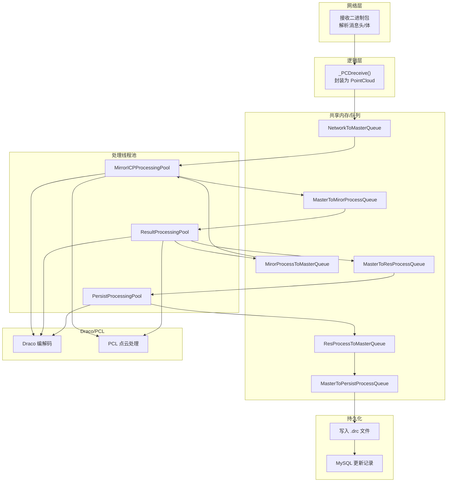
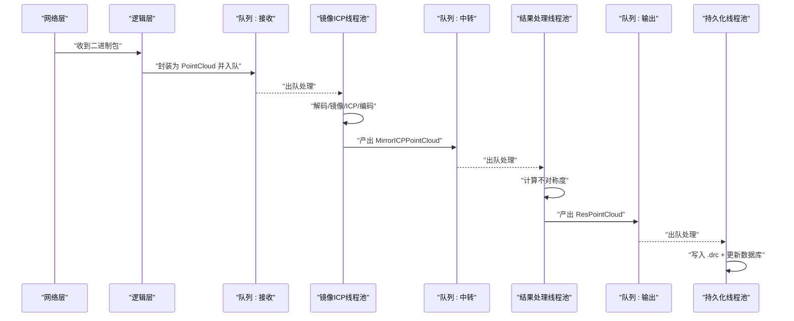
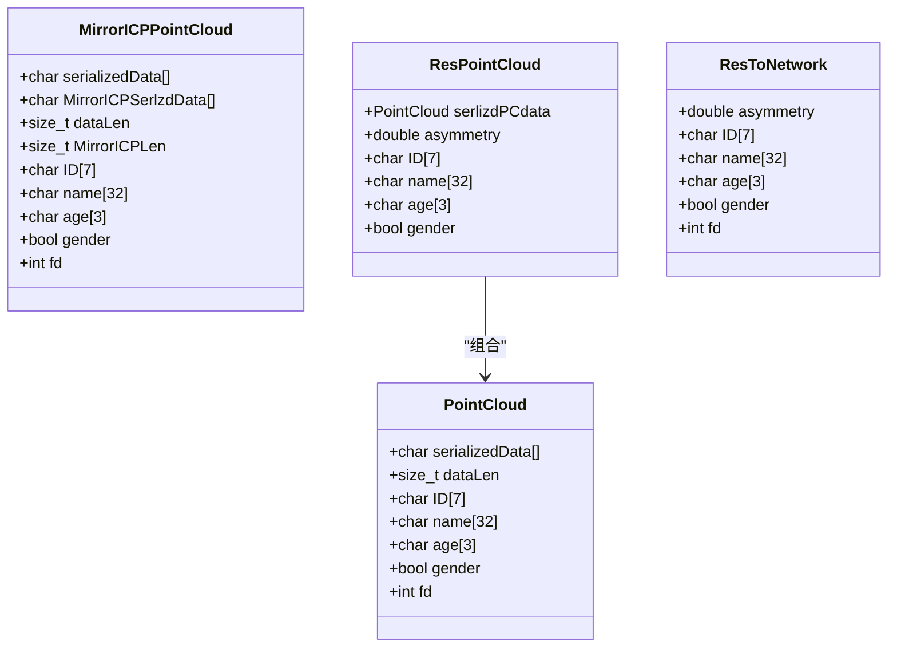
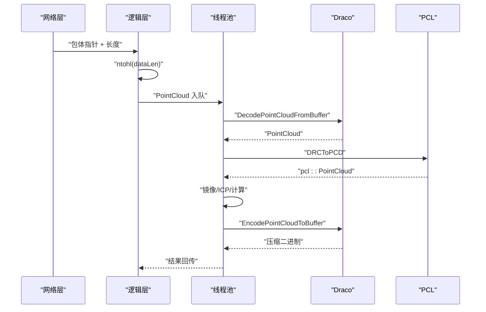
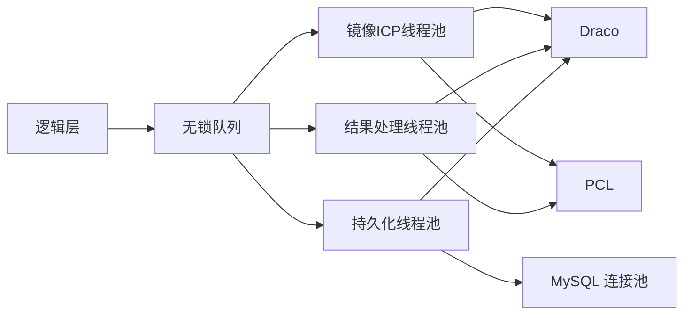

# 点云数据结构

<cite>
**本文引用的文件**
- [include/ngx_shared_memory.h](file://include/ngx_shared_memory.h)
- [include/ngx_lockfree_threadPool.h](file://include/ngx_lockfree_threadPool.h)
- [misc/ngx_lockfree_threadPool.cxx](file://misc/ngx_lockfree_threadPool.cxx)
- [misc/ngx_lockfree_mirrorICP_threadPool.cxx](file://misc/ngx_lockfree_mirrorICP_threadPool.cxx)
- [misc/ngx_lockfree_asymCal_threadPool.cxx](file://misc/ngx_lockfree_asymCal_threadPool.cxx)
- [misc/ngx_lockfree_persistPool.cxx](file://misc/ngx_lockfree_persistPool.cxx)
- [include/ngx_lockFreeQueue.h](file://include/ngx_lockFreeQueue.h)
- [include/ngx_c_memory.h](file://include/ngx_c_memory.h)
- [misc/ngx_c_memory.cxx](file://misc/ngx_c_memory.cxx)
- [logic/ngx_c_slogic.cxx](file://logic/ngx_c_slogic.cxx)
- [include/ngx_func.h](file://include/ngx_func.h)
</cite>

## 目录
1. [简介](#简介)
2. [项目结构](#项目结构)
3. [核心组件](#核心组件)
4. [架构总览](#架构总览)
5. [详细组件分析](#详细组件分析)
6. [依赖分析](#依赖分析)
7. [性能考量](#性能考量)
8. [故障排查指南](#故障排查指南)
9. [结论](#结论)
10. [附录](#附录)

## 简介
本文件围绕点云数据结构与处理流程，系统梳理项目中的点云数据定义、内存布局、序列化/反序列化机制、压缩与传输优化、内存组织方式（连续存储与无锁队列）、以及读取/修改/写入的完整处理链路。重点覆盖以下方面：
- PointCloud/MirrorICPPointCloud/ResPointCloud 等数据结构的字段含义与内存布局
- 不同点云格式（Draco drc 与 PCL 点云）的差异与转换
- 二进制序列化与网络字节序处理
- 压缩算法（Draco）与编码参数
- 内存管理与无锁队列的并发组织
- 读取、修改、写入的完整示例路径
- 数据验证、边界检查与错误处理最佳实践

## 项目结构
该项目采用分层设计：网络层负责接收/发送二进制包；逻辑层解析包体并封装为内部结构；处理线程池负责解码、镜像/ICP、不对称度计算、持久化；共享内存与无锁队列贯穿各模块。

图表来源
- [logic/ngx_c_slogic.cxx](file://logic/ngx_c_slogic.cxx#L190-L243)
- [include/ngx_shared_memory.h](file://include/ngx_shared_memory.h#L24-L81)
- [include/ngx_lockfree_threadPool.h](file://include/ngx_lockfree_threadPool.h#L79-L136)
- [misc/ngx_lockfree_threadPool.cxx](file://misc/ngx_lockfree_threadPool.cxx#L3-L78)
- [misc/ngx_lockfree_mirrorICP_threadPool.cxx](file://misc/ngx_lockfree_mirrorICP_threadPool.cxx#L35-L94)
- [misc/ngx_lockfree_asymCal_threadPool.cxx](file://misc/ngx_lockfree_asymCal_threadPool.cxx#L47-L87)
- [misc/ngx_lockfree_persistPool.cxx](file://misc/ngx_lockfree_persistPool.cxx#L52-L146)

章节来源
- [include/ngx_shared_memory.h](file://include/ngx_shared_memory.h#L1-L193)
- [include/ngx_lockfree_threadPool.h](file://include/ngx_lockfree_threadPool.h#L1-L144)
- [logic/ngx_c_slogic.cxx](file://logic/ngx_c_slogic.cxx#L190-L341)

## 核心组件
- 点云数据结构
  - PointCloud：承载二进制序列化后的点云数据、元数据（ID、姓名、年龄、性别、fd）及数据长度
  - MirrorICPPointCloud：在原始点云基础上，附加镜像+ICP处理后的二进制结果
  - ResPointCloud：封装最终结果（包含原始序列化数据与不对称度指标）
  - ResToNetwork：用于网络返回的结构
- 线程池与处理模块
  - MirrorICPProcessingPool：解码 -> 镜像 -> ICP -> 重新编码
  - ResultProcessingPool：计算不对称度，产出 ResPointCloud
  - PersistProcessingPool：落盘 .drc 文件并更新数据库
- 编解码与转换
  - 使用 Draco 进行压缩/解压，PCL 进行几何处理（镜像、ICP、法向估计）

章节来源
- [include/ngx_shared_memory.h](file://include/ngx_shared_memory.h#L24-L63)
- [include/ngx_lockfree_threadPool.h](file://include/ngx_lockfree_threadPool.h#L17-L136)
- [misc/ngx_lockfree_threadPool.cxx](file://misc/ngx_lockfree_threadPool.cxx#L3-L78)

## 架构总览
点云处理链路从网络接收二进制包开始，经过逻辑层封装、无锁队列传递、多级线程池处理，最终完成压缩、计算与持久化。

图表来源
- [logic/ngx_c_slogic.cxx](file://logic/ngx_c_slogic.cxx#L190-L243)
- [misc/ngx_lockfree_mirrorICP_threadPool.cxx](file://misc/ngx_lockfree_mirrorICP_threadPool.cxx#L14-L33)
- [misc/ngx_lockfree_asymCal_threadPool.cxx](file://misc/ngx_lockfree_asymCal_threadPool.cxx#L22-L40)
- [misc/ngx_lockfree_persistPool.cxx](file://misc/ngx_lockfree_persistPool.cxx#L17-L31)

## 详细组件分析

### 点云数据结构定义与内存布局
- PointCloud
  - serializedData：二进制序列化缓冲区，最大 1MB
  - dataLen：二进制长度（网络字节序 -> 主机字节序）
  - ID/name/age/gender/fd：元数据，用于标识与回传
- MirrorICPPointCloud
  - serializedData：原始点云二进制
  - MirrorICPSerlzdData：镜像+ICP处理后的二进制
  - dataLen/MirrorICPLen：对应长度
  - 元数据字段与 PointCloud 一致
- ResPointCloud
  - serlizdPCdata：原始序列化数据
  - asymmetry：不对称度指标
  - 元数据字段
- ResToNetwork
  - 用于网络返回的结构，包含 ID/name/age/gender/asymmetry/fd

图表来源
- [include/ngx_shared_memory.h](file://include/ngx_shared_memory.h#L24-L63)

章节来源
- [include/ngx_shared_memory.h](file://include/ngx_shared_memory.h#L24-L63)

### 序列化与反序列化机制
- 网络接收侧
  - _PCDreceive：校验包体长度、将 dataLen 从网络字节序转换为主机字节序、拷贝二进制数据、写入队列
- 线程池处理侧
  - decompressPointCloud：使用 Draco DecoderBuffer/Decoder 解码二进制为 draco::PointCloud
  - DRCToPCD：从 draco::PointCloud 提取 POSITION 属性，填充 PCL 点云
  - PCDToDRC：将 PCL 点云写回 draco::PointCloud 的 POSITION 属性
  - CompressPCDToDraco：使用 Encoder 将 draco::PointCloud 编码为压缩二进制

图表来源
- [logic/ngx_c_slogic.cxx](file://logic/ngx_c_slogic.cxx#L190-L243)
- [misc/ngx_lockfree_threadPool.cxx](file://misc/ngx_lockfree_threadPool.cxx#L3-L78)
- [misc/ngx_lockfree_mirrorICP_threadPool.cxx](file://misc/ngx_lockfree_mirrorICP_threadPool.cxx#L35-L58)
- [misc/ngx_lockfree_asymCal_threadPool.cxx](file://misc/ngx_lockfree_asymCal_threadPool.cxx#L47-L87)

章节来源
- [logic/ngx_c_slogic.cxx](file://logic/ngx_c_slogic.cxx#L190-L243)
- [misc/ngx_lockfree_threadPool.cxx](file://misc/ngx_lockfree_threadPool.cxx#L3-L78)

### 压缩算法与传输优化
- 压缩格式：Draco drc（二进制）
- 编码参数：设置速度选项（encoder_speed, encoder_speed），控制压缩比与速度
- 传输优化：
  - 使用固定大小缓冲区（1MB）限制单包大小
  - 使用无锁队列避免锁竞争
  - 使用内存映射共享内存队列，降低跨进程/线程拷贝成本

章节来源
- [misc/ngx_lockfree_threadPool.cxx](file://misc/ngx_lockfree_threadPool.cxx#L62-L78)
- [include/ngx_shared_memory.h](file://include/ngx_shared_memory.h#L87-L160)

### 内存组织方式与访问模式
- 连续存储
  - serializedData 为连续字节数组，按 float32(x,y,z) 存储
  - 通过 POSITION 属性读取坐标
- 索引结构
  - draco::PointCloud 内部维护属性索引与映射
  - PCL 点云以 vector 存储点，支持随机访问
- 访问模式
  - 顺序遍历 POSITION 属性，逐点提取坐标
  - ICP/法向估计使用 KNN 搜索与 KDTree

章节来源
- [misc/ngx_lockfree_threadPool.cxx](file://misc/ngx_lockfree_threadPool.cxx#L16-L41)
- [misc/ngx_lockfree_asymCal_threadPool.cxx](file://misc/ngx_lockfree_asymCal_threadPool.cxx#L89-L105)

### 读取、修改、写入的完整示例路径
- 读取
  - 网络接收：_PCDreceive
  - 解码：decompressPointCloud + DRCToPCD
- 修改
  - 镜像：pointCloudMirror（对 X 坐标取负）
  - ICP：ICPTransform（迭代最近点）
  - 计算不对称度：Asym（法向估计 + 最小距离）
- 写入
  - 编码：CompressPCDToDraco
  - 持久化：PersistProcessingPool（写 .drc + 更新数据库）

章节来源
- [logic/ngx_c_slogic.cxx](file://logic/ngx_c_slogic.cxx#L190-L243)
- [misc/ngx_lockfree_mirrorICP_threadPool.cxx](file://misc/ngx_lockfree_mirrorICP_threadPool.cxx#L59-L94)
- [misc/ngx_lockfree_asymCal_threadPool.cxx](file://misc/ngx_lockfree_asymCal_threadPool.cxx#L147-L204)
- [misc/ngx_lockfree_persistPool.cxx](file://misc/ngx_lockfree_persistPool.cxx#L52-L146)

### 数据验证、边界检查与错误处理最佳实践
- 边界检查
  - 校验包体长度与结构体大小
  - 校验 dataLen 不超过 1MB
  - 校验队列容量与满/空状态
- 错误处理
  - 解码失败/编码失败返回空指针/布尔失败
  - 数据库事务失败回滚并清理临时文件
  - 日志输出错误码与错误信息
- 并发安全
  - 使用无锁队列与原子操作
  - 使用内存屏障与缓存行对齐避免伪共享

章节来源
- [logic/ngx_c_slogic.cxx](file://logic/ngx_c_slogic.cxx#L190-L243)
- [include/ngx_lockFreeQueue.h](file://include/ngx_lockFreeQueue.h#L48-L150)
- [misc/ngx_lockfree_persistPool.cxx](file://misc/ngx_lockfree_persistPool.cxx#L75-L146)

## 依赖分析
- 外部库
  - Draco：点云压缩/解压
  - PCL：几何处理（镜像、ICP、法向估计）
  - MySQL 连接池：持久化写入
- 内部模块
  - 逻辑层：网络包解析与结构封装
  - 线程池：镜像/ICP、结果处理、持久化
  - 共享内存/队列：跨模块数据通道

图表来源
- [include/ngx_lockfree_threadPool.h](file://include/ngx_lockfree_threadPool.h#L9-L15)
- [include/ngx_shared_memory.h](file://include/ngx_shared_memory.h#L65-L84)

章节来源
- [include/ngx_lockfree_threadPool.h](file://include/ngx_lockfree_threadPool.h#L1-L144)
- [include/ngx_shared_memory.h](file://include/ngx_shared_memory.h#L1-L193)

## 性能考量
- 无锁队列
  - 使用缓存行对齐与 compare_exchange_weak 实现高性能并发
  - 通过内存序（release/acquire）保证可见性
- 批处理与并行
  - 法向估计使用 OpenMP 并行加速
  - ICP 使用 KDTree 加速最近邻搜索
- I/O 优化
  - 二进制序列化减少解析开销
  - 临时文件 + 原子重命名 + 事务保证一致性

章节来源
- [include/ngx_lockFreeQueue.h](file://include/ngx_lockFreeQueue.h#L48-L150)
- [misc/ngx_lockfree_asymCal_threadPool.cxx](file://misc/ngx_lockfree_asymCal_threadPool.cxx#L90-L105)
- [misc/ngx_lockfree_persistPool.cxx](file://misc/ngx_lockfree_persistPool.cxx#L60-L146)

## 故障排查指南
- 常见问题
  - 解压失败：检查二进制完整性与长度
  - 编码失败：检查 draco::PointCloud 初始化与属性设置
  - 队列满：观察高水位阈值与退避策略
  - 数据库失败：确认事务、重命名与回滚逻辑
- 日志定位
  - 使用日志接口输出错误码与上下文
  - 关注网络字节序转换与内存拷贝边界

章节来源
- [misc/ngx_lockfree_threadPool.cxx](file://misc/ngx_lockfree_threadPool.cxx#L3-L15)
- [misc/ngx_lockfree_persistPool.cxx](file://misc/ngx_lockfree_persistPool.cxx#L75-L146)
- [include/ngx_func.h](file://include/ngx_func.h#L12-L20)

## 结论
本项目以 PointCloud 为核心数据载体，结合 Draco 压缩与 PCL 几何处理，构建了从网络接收、多级线程池处理到持久化的完整链路。通过无锁队列与内存映射实现高并发与低延迟，配合严格的边界检查与事务保障，确保点云数据在内存与磁盘上的可靠流转。

## 附录
- 内存管理
  - 单例内存分配器，支持清零初始化
- 网络字节序
  - 使用 ntohl/htonl/htond 进行跨平台字节序转换

章节来源
- [include/ngx_c_memory.h](file://include/ngx_c_memory.h#L5-L52)
- [misc/ngx_c_memory.cxx](file://misc/ngx_c_memory.cxx#L10-L28)
- [logic/ngx_c_slogic.cxx](file://logic/ngx_c_slogic.cxx#L202-L230)