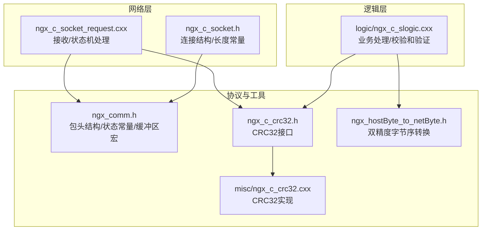
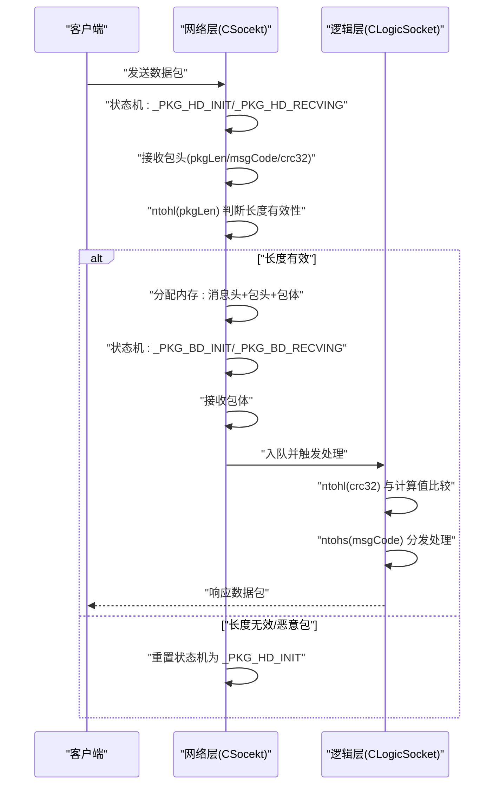
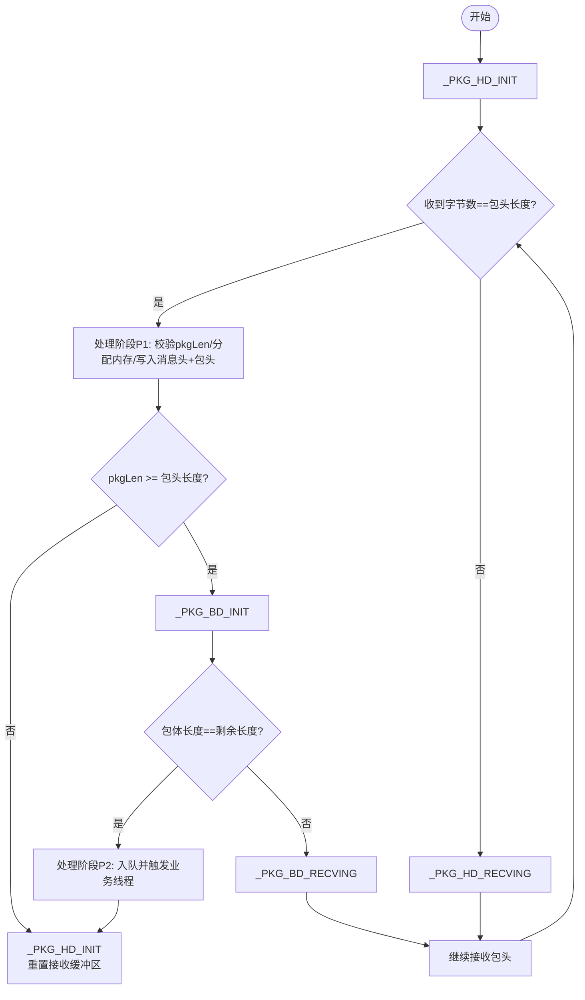
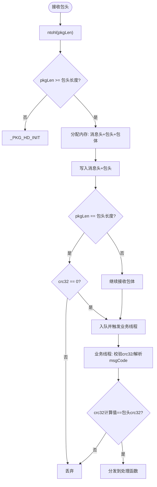
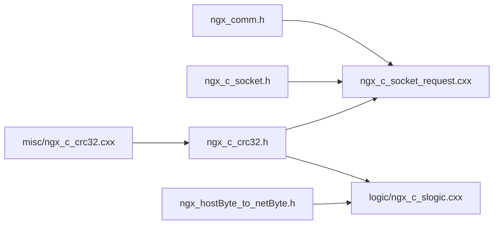

# 通信协议结构

<cite>
**本文档引用的文件**
- [include/ngx_comm.h](file://include/ngx_comm.h)
- [include/ngx_c_socket.h](file://include/ngx_c_socket.h)
- [net/ngx_c_socket_request.cxx](file://net/ngx_c_socket_request.cxx)
- [logic/ngx_c_slogic.cxx](file://logic/ngx_c_slogic.cxx)
- [include/ngx_c_crc32.h](file://include/ngx_c_crc32.h)
- [misc/ngx_c_crc32.cxx](file://misc/ngx_c_crc32.cxx)
- [include/ngx_hostByte_to_netByte.h](file://include/ngx_hostByte_to_netByte.h)
</cite>

## 目录
1. [简介](#简介)
2. [项目结构](#项目结构)
3. [核心组件](#核心组件)
4. [架构总览](#架构总览)
5. [详细组件分析](#详细组件分析)
6. [依赖关系分析](#依赖关系分析)
7. [性能考量](#性能考量)
8. [故障排查指南](#故障排查指南)
9. [结论](#结论)

## 简介
本文件聚焦于通信协议中的包头结构与状态机设计，系统性阐述 COMM_PKG_HEADER 的字段定义、内存布局、序列化规则、网络传输格式，以及消息状态枚举常量的使用场景与状态转换逻辑。同时给出数据缓冲区配置的设计考量、限制与最佳实践，并提供包头解析与校验和验证的流程图与参考路径，帮助读者正确处理网络数据包的接收与解析。

## 项目结构
该项目采用分层组织，网络层负责连接管理、收发与状态机，逻辑层负责业务处理与校验和验证，公共头文件定义协议结构与宏常量，CRC32 实现提供校验能力，字节序转换工具提供双精度浮点在网络序与主机序之间的转换。

图表来源
- [include/ngx_comm.h](file://include/ngx_comm.h#L5-L28)
- [include/ngx_c_socket.h](file://include/ngx_c_socket.h#L94-L99)
- [net/ngx_c_socket_request.cxx](file://net/ngx_c_socket_request.cxx#L25-L114)
- [logic/ngx_c_slogic.cxx](file://logic/ngx_c_slogic.cxx#L77-L129)
- [include/ngx_c_crc32.h](file://include/ngx_c_crc32.h#L6-L52)
- [misc/ngx_c_crc32.cxx](file://misc/ngx_c_crc32.cxx#L37-L87)
- [include/ngx_hostByte_to_netByte.h](file://include/ngx_hostByte_to_netByte.h#L5-L19)

章节来源
- [include/ngx_comm.h](file://include/ngx_comm.h#L1-L32)
- [include/ngx_c_socket.h](file://include/ngx_c_socket.h#L1-L200)

## 核心组件
- 包头结构 COMM_PKG_HEADER：定义 pkgLen、crc32、msgCode 三个字段，采用 1 字节对齐，确保网络传输时紧凑布局。
- 消息状态枚举常量：_PKG_HD_INIT、_PKG_HD_RECVING、_PKG_BD_INIT、_PKG_BD_RECVING，用于收包状态机。
- 数据缓冲区宏 _DATA_BUFSIZE_：限定固定大小的头部接收缓冲区，确保能容纳完整包头。
- 校验和 CCRC32：提供 CRC32 表初始化与计算接口，用于包体完整性校验。
- 字节序转换：提供 htons/htonl/ntohs/ntohl 以及 htond/ntohd 双精度转换，保证跨平台一致性。

章节来源
- [include/ngx_comm.h](file://include/ngx_comm.h#L5-L28)
- [include/ngx_c_crc32.h](file://include/ngx_c_crc32.h#L6-L52)
- [include/ngx_hostByte_to_netByte.h](file://include/ngx_hostByte_to_netByte.h#L5-L19)

## 架构总览
网络层通过 epoll 事件驱动，按状态机顺序接收包头与包体；逻辑层在业务线程中进行校验和验证与消息分发。包头字段在网络传输前进行字节序转换，接收后进行主机序还原与校验。

图表来源
- [net/ngx_c_socket_request.cxx](file://net/ngx_c_socket_request.cxx#L25-L114)
- [net/ngx_c_socket_request.cxx](file://net/ngx_c_socket_request.cxx#L160-L211)
- [logic/ngx_c_slogic.cxx](file://logic/ngx_c_slogic.cxx#L77-L129)

## 详细组件分析

### 包头结构 COMM_PKG_HEADER
- 字段定义与数据类型
  - pkgLen: 32 位无符号整型，记录“包头+包体”的总长度。
  - crc32: 32 位有符号整型，记录包体的 CRC32 校验值。
  - msgCode: 16 位无符号整型，标识消息类型。
- 字节对齐与内存布局
  - 使用 1 字节对齐，确保结构体成员紧密排列，避免填充字节影响网络传输。
  - 结构体在内存中的布局严格遵循字段声明顺序，便于序列化与反序列化。
- 序列化与网络传输格式
  - 发送前：msgCode、pkgLen、crc32 均需转换为网络序（如 htons/htonl/htonld）。
  - 接收后：pkgLen、crc32 需转换为主机序（如 ntohl/ntohs/ntohd），msgCode 同样转换为主机序。
- 业务含义
  - pkgLen：用于判断包的完整性与决定后续接收策略。
  - crc32：用于包体完整性校验，防止传输错误或篡改。
  - msgCode：用于路由到相应的业务处理函数。

章节来源
- [include/ngx_comm.h](file://include/ngx_comm.h#L19-L25)
- [include/ngx_hostByte_to_netByte.h](file://include/ngx_hostByte_to_netByte.h#L5-L19)
- [net/ngx_c_socket.cxx](file://net/ngx_c_socket.cxx#L899-L922)
- [logic/ngx_c_slogic.cxx](file://logic/ngx_c_slogic.cxx#L96-L107)

### 消息状态枚举常量与状态机
- 常量定义
  - _PKG_HD_INIT：初始状态，准备接收包头。
  - _PKG_HD_RECVING：接收包头中，包头不完整，继续接收中。
  - _PKG_BD_INIT：包头刚好收完，准备接收包体。
  - _PKG_BD_RECVING：接收包体中，包体不完整，继续接收中，处理后直接回到 _PKG_HD_INIT。
- 状态转换逻辑
  - 初始：curStat = _PKG_HD_INIT。
  - 接收包头：
    - 若收到完整包头：进入处理阶段 P1，校验 pkgLen 并决定是否继续接收包体。
    - 若包头不完整：切换至 _PKG_HD_RECVING，移动 precvbuf 与减少 irecvlen，继续接收。
  - 接收包体：
    - 若包体完整：进入处理阶段 P2，入队并触发业务线程处理。
    - 若包体不完整：切换至 _PKG_BD_RECVING，移动 precvbuf 与减少 irecvlen，继续接收。
  - 处理完成：curStat 回到 _PKG_HD_INIT，重置 precvbuf 与 irecvlen，准备下一包。

图表来源
- [net/ngx_c_socket_request.cxx](file://net/ngx_c_socket_request.cxx#L37-L114)
- [net/ngx_c_socket_request.cxx](file://net/ngx_c_socket_request.cxx#L160-L211)
- [net/ngx_c_socket_request.cxx](file://net/ngx_c_socket_request.cxx#L214-L233)

章节来源
- [include/ngx_comm.h](file://include/ngx_comm.h#L6-L9)
- [net/ngx_c_socket_request.cxx](file://net/ngx_c_socket_request.cxx#L25-L114)
- [net/ngx_c_socket_request.cxx](file://net/ngx_c_socket_request.cxx#L160-L233)

### 数据缓冲区配置 _DATA_BUFSIZE_
- 设计考量
  - 专用于接收包头的固定大小数组，确保首次接收包头时有足够空间。
  - 要求大于 sizeof(COMM_PKG_HEADER)，以避免截断包头。
  - 当 COMM_PKG_HEADER 结构体尺寸变化时，需同步调整该宏以满足约束。
- 限制与注意事项
  - 若包头长度增大，必须相应增大 _DATA_BUFSIZE_。
  - 仅用于包头接收，包体接收通过动态内存分配，避免固定缓冲区溢出。

章节来源
- [include/ngx_comm.h](file://include/ngx_comm.h#L11-L12)
- [include/ngx_c_socket.h](file://include/ngx_c_socket.h#L64-L66)

### 包头解析与校验和验证流程
- 接收与解析
  - 在状态机中，当包头完整时调用处理阶段 P1，读取 pkgLen 并进行有效性判断。
  - 若长度有效，分配内存并写入消息头与包头，随后根据 pkgLen 是否等于包头长度决定是否继续接收包体。
- 校验和验证
  - 业务线程中，对包体进行 CRC32 计算并与包头中的 crc32 字段比较，不匹配则丢弃。
  - 对 msgCode 进行边界检查与处理函数映射，确保消息类型合法且存在处理函数。
- 字节序转换
  - 发送前：msgCode、pkgLen、crc32 均转换为网络序。
  - 接收后：pkgLen、crc32 转换为主机序，msgCode 同样转换为主机序。

图表来源
- [net/ngx_c_socket_request.cxx](file://net/ngx_c_socket_request.cxx#L160-L211)
- [logic/ngx_c_slogic.cxx](file://logic/ngx_c_slogic.cxx#L77-L129)

章节来源
- [net/ngx_c_socket_request.cxx](file://net/ngx_c_socket_request.cxx#L160-L211)
- [logic/ngx_c_slogic.cxx](file://logic/ngx_c_slogic.cxx#L77-L129)

### 校验和实现与使用
- CCRC32 类
  - 提供单例获取、CRC32 表初始化与 CRC 计算接口。
  - 初始化时构建查找表，计算时使用查表法提升性能。
- 使用场景
  - 发送：对包体进行 CRC32 计算，写入包头 crc32 字段，并转换为网络序。
  - 接收：业务线程对包体重新计算 CRC32，与包头中的 crc32 比较，不一致则丢弃。

章节来源
- [include/ngx_c_crc32.h](file://include/ngx_c_crc32.h#L6-L52)
- [misc/ngx_c_crc32.cxx](file://misc/ngx_c_crc32.cxx#L37-L87)
- [net/ngx_c_socket.cxx](file://net/ngx_c_socket.cxx#L915-L916)
- [logic/ngx_c_slogic.cxx](file://logic/ngx_c_slogic.cxx#L99-L104)

### 字节序转换工具
- 单精度与双精度转换
  - 提供 htond/ntohd 用于双精度浮点在网络序与主机序之间的转换。
  - 使用位交换与内存拷贝实现，保证跨平台一致性。
- 使用建议
  - 发送前对双精度字段进行 htond 转换，接收后进行 ntohd 转换。
  - 与 htons/htonl/ntohs/ntohl 组合使用，确保整型与浮点均正确转换。

章节来源
- [include/ngx_hostByte_to_netByte.h](file://include/ngx_hostByte_to_netByte.h#L5-L19)
- [net/ngx_c_socket.cxx](file://net/ngx_c_socket.cxx#L907-L916)
- [logic/ngx_c_slogic.cxx](file://logic/ngx_c_slogic.cxx#L303-L337)

## 依赖关系分析
- 网络层依赖
  - 依赖 ngx_comm.h 定义包头结构与状态常量。
  - 依赖 ngx_c_crc32.h 进行校验和计算。
  - 依赖 ngx_hostByte_to_netByte.h 进行双精度字节序转换。
- 逻辑层依赖
  - 依赖 ngx_c_crc32.h 进行校验和验证。
  - 依赖 ngx_hostByte_to_netByte.h 进行双精度字节序转换。
- 工具实现
  - CCRC32 的实现位于 misc/ngx_c_crc32.cxx，提供查表法计算。

图表来源
- [include/ngx_comm.h](file://include/ngx_comm.h#L1-L32)
- [include/ngx_c_socket.h](file://include/ngx_c_socket.h#L1-L200)
- [net/ngx_c_socket_request.cxx](file://net/ngx_c_socket_request.cxx#L1-L341)
- [logic/ngx_c_slogic.cxx](file://logic/ngx_c_slogic.cxx#L1-L341)
- [include/ngx_c_crc32.h](file://include/ngx_c_crc32.h#L1-L64)
- [misc/ngx_c_crc32.cxx](file://misc/ngx_c_crc32.cxx#L1-L89)
- [include/ngx_hostByte_to_netByte.h](file://include/ngx_hostByte_to_netByte.h#L1-L19)

章节来源
- [include/ngx_comm.h](file://include/ngx_comm.h#L1-L32)
- [include/ngx_c_socket.h](file://include/ngx_c_socket.h#L1-L200)
- [net/ngx_c_socket_request.cxx](file://net/ngx_c_socket_request.cxx#L1-L341)
- [logic/ngx_c_slogic.cxx](file://logic/ngx_c_slogic.cxx#L1-L341)
- [include/ngx_c_crc32.h](file://include/ngx_c_crc32.h#L1-L64)
- [misc/ngx_c_crc32.cxx](file://misc/ngx_c_crc32.cxx#L1-L89)
- [include/ngx_hostByte_to_netByte.h](file://include/ngx_hostByte_to_netByte.h#L1-L19)

## 性能考量
- 结构体对齐
  - 采用 1 字节对齐，避免填充字节带来的额外开销，有利于网络传输与内存拷贝。
- 查表法 CRC32
  - 预先构建查找表，计算时仅需 O(n) 次查表与异或操作，显著降低 CPU 开销。
- 状态机与零拷贝
  - 通过状态机与缓冲区指针移动，尽量减少不必要的内存拷贝与分配。
- 字节序转换
  - 使用内联函数与位运算，减少函数调用开销，提高吞吐量。

## 故障排查指南
- 包头长度异常
  - 现象：pkgLen 小于包头长度，状态机重置为 _PKG_HD_INIT。
  - 排查：确认发送端 pkgLen 计算是否包含包头与包体，检查网络序转换是否正确。
- 包体校验失败
  - 现象：业务线程中 CRC32 不匹配，丢弃数据。
  - 排查：确认发送端 CRC32 计算范围是否仅包含包体，接收端计算是否一致。
- 消息类型非法
  - 现象：msgCode 越界或未注册处理函数，丢弃数据。
  - 排查：确认 msgCode 映射表与处理函数注册是否正确。
- 字节序问题
  - 现象：整型或双精度字段在不同平台表现不一致。
  - 排查：确认发送端使用 htons/htonl/htonld，接收端使用 ntohs/ntohl/ntohd。

章节来源
- [net/ngx_c_socket_request.cxx](file://net/ngx_c_socket_request.cxx#L172-L177)
- [logic/ngx_c_slogic.cxx](file://logic/ngx_c_slogic.cxx#L99-L127)
- [include/ngx_hostByte_to_netByte.h](file://include/ngx_hostByte_to_netByte.h#L5-L19)

## 结论
本文档系统梳理了 COMM_PKG_HEADER 的字段定义、内存布局、序列化规则与网络传输格式，明确了消息状态枚举常量的使用场景与状态转换逻辑，并给出了数据缓冲区配置的设计考量与限制。结合 CCRC32 与字节序转换工具，提供了包头解析与校验和验证的完整流程。遵循本文档的规范与最佳实践，可有效提升网络通信的稳定性与性能。