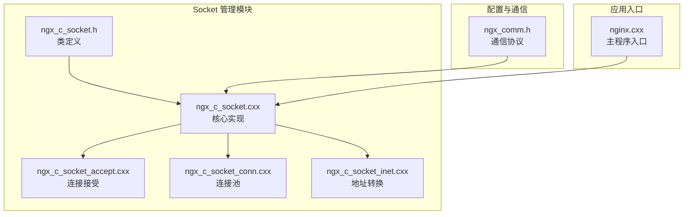
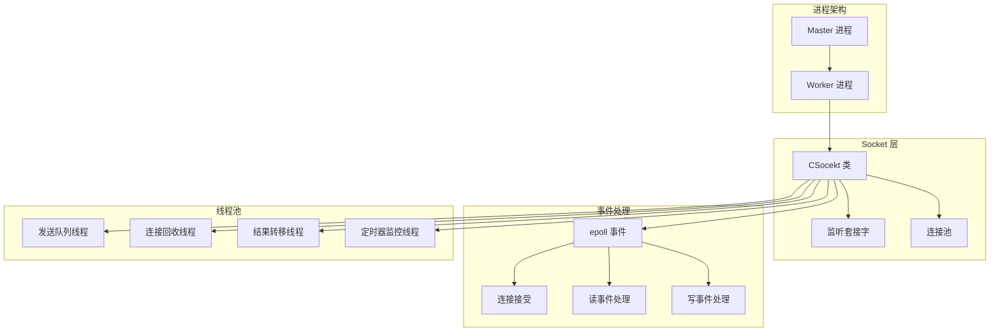
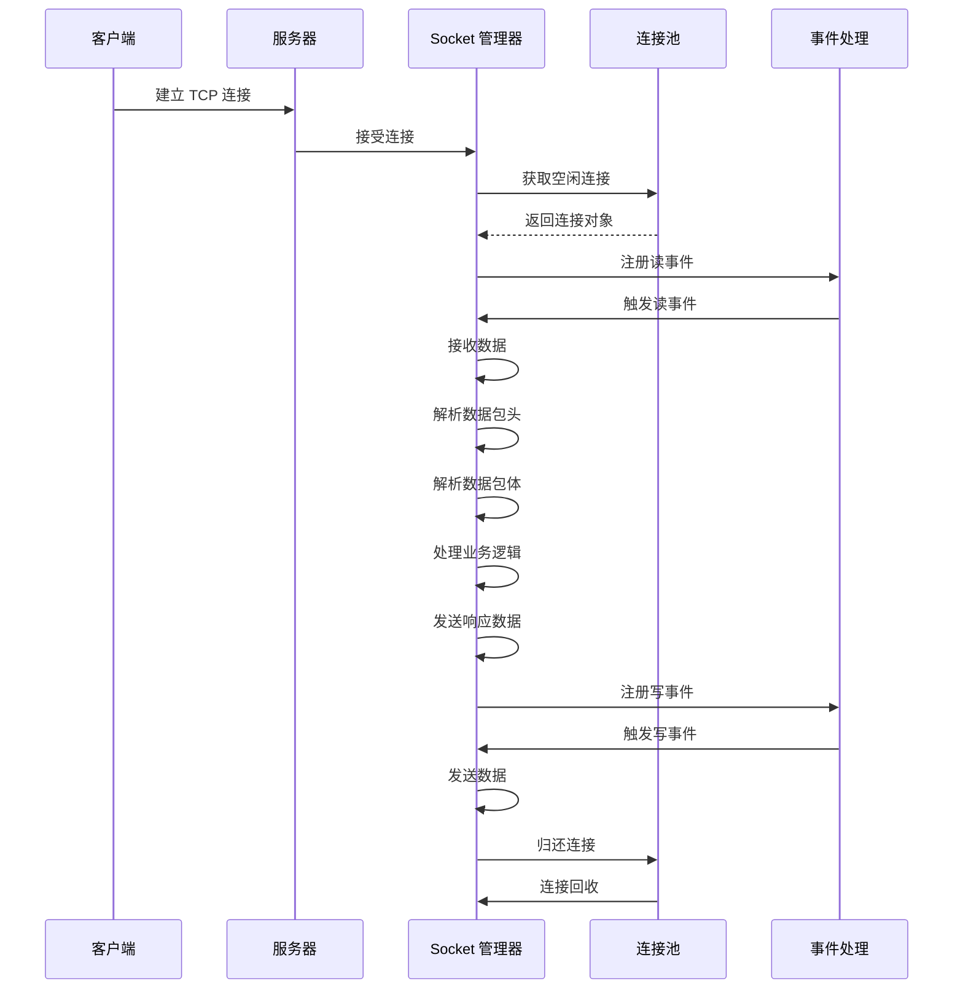
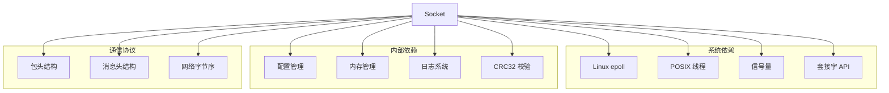

# Socket 管理 API

<cite>
**本文档引用的文件**
- [ngx_c_socket.h](file://include/ngx_c_socket.h)
- [ngx_c_socket.cxx](file://net/ngx_c_socket.cxx)
- [ngx_c_socket_accept.cxx](file://net/ngx_c_socket_accept.cxx)
- [ngx_c_socket_conn.cxx](file://net/ngx_c_socket_conn.cxx)
- [ngx_c_socket_inet.cxx](file://net/ngx_c_socket_inet.cxx)
- [ngx_comm.h](file://include/ngx_comm.h)
- [nginx.cxx](file://app/nginx.cxx)
</cite>

## 目录
1. [简介](#简介)
2. [项目结构](#项目结构)
3. [核心组件](#核心组件)
4. [架构概览](#架构概览)
5. [详细组件分析](#详细组件分析)
6. [依赖关系分析](#依赖关系分析)
7. [性能考量](#性能考量)
8. [故障排除指南](#故障排除指南)
9. [结论](#结论)

## 简介
本文档为 Socket 管理模块提供详细的 API 参考文档，重点介绍 CSocekt 类的核心接口，包括 socket 初始化函数 Initialize()、Initialize_subproc()、Shutdown_subproc() 的使用方法和参数说明。详细解释 socket 设置非阻塞模式的 setnonblocking() 函数，以及监听套接字的 ngx_open_listening_sockets() 和 ngx_close_listening_sockets() 方法。提供具体的代码示例展示如何正确初始化和管理 socket 连接，包括错误处理和资源清理的最佳实践。

## 项目结构
Socket 管理模块位于 net 目录下，包含以下关键文件：
- ngx_c_socket.h: Socket 管理类的头文件定义
- ngx_c_socket.cxx: Socket 管理类的主要实现
- ngx_c_socket_accept.cxx: 连接接受处理
- ngx_c_socket_conn.cxx: 连接池管理
- ngx_c_socket_inet.cxx: 网络地址转换

**图表来源**
- [ngx_c_socket.h](file://include/ngx_c_socket.h#L103-L255)
- [ngx_c_socket.cxx](file://net/ngx_c_socket.cxx#L1-L100)
- [ngx_comm.h](file://include/ngx_comm.h#L1-L32)

**章节来源**
- [ngx_c_socket.h](file://include/ngx_c_socket.h#L1-L258)
- [ngx_c_socket.cxx](file://net/ngx_c_socket.cxx#L1-L100)

## 核心组件
CSocekt 类是 Socket 管理模块的核心，提供了完整的网络通信功能。该类采用面向对象的设计模式，封装了 socket 管理、连接池、事件处理等核心功能。

### 主要功能模块
1. **初始化管理**: 父进程和子进程的初始化分离
2. **连接池管理**: 动态连接池，支持连接复用
3. **事件驱动**: 基于 epoll 的异步事件处理
4. **线程管理**: 多线程架构，支持并发处理
5. **资源管理**: 完善的资源分配和回收机制

**章节来源**
- [ngx_c_socket.h](file://include/ngx_c_socket.h#L103-L255)
- [ngx_c_socket.cxx](file://net/ngx_c_socket.cxx#L26-L54)

## 架构概览
Socket 管理模块采用多进程架构，结合 epoll 事件驱动机制，实现高性能的网络通信服务。

**图表来源**
- [ngx_c_socket.cxx](file://net/ngx_c_socket.cxx#L56-L64)
- [ngx_c_socket.cxx](file://net/ngx_c_socket.cxx#L67-L159)
- [ngx_c_socket.cxx](file://net/ngx_c_socket.cxx#L541-L587)

## 详细组件分析

### CSocekt 类核心接口

#### 初始化相关接口

##### Initialize() - 父进程初始化
父进程在 fork 子进程之前执行此函数，负责基本的 socket 初始化工作。

**函数签名**: `virtual bool Initialize()`

**功能说明**:
- 读取配置文件中的 socket 相关配置
- 打开监听端口
- 设置监听套接字的基本属性

**参数**: 无

**返回值**: 
- `true`: 初始化成功
- `false`: 初始化失败

**错误处理**:
- socket 创建失败: 记录错误日志并返回 false
- 绑定失败: 记录错误日志并返回 false
- 监听失败: 记录错误日志并返回 false

**使用示例路径**: 
- [父进程初始化调用](file://app/nginx.cxx#L72-L74)
- [Initialize() 实现](file://net/ngx_c_socket.cxx#L58-L64)

**章节来源**
- [ngx_c_socket.cxx](file://net/ngx_c_socket.cxx#L58-L64)
- [nginx.cxx](file://app/nginx.cxx#L72-L74)

##### Initialize_subproc() - 子进程初始化
子进程专用的初始化函数，负责创建线程和初始化同步机制。

**函数签名**: `virtual bool Initialize_subproc()`

**功能说明**:
- 初始化发送消息互斥量
- 初始化连接相关互斥量
- 初始化连接回收队列互斥量
- 初始化时间处理队列互斥量
- 初始化发送消息相关信号量
- 创建多个专用线程

**参数**: 无

**返回值**: 
- `true`: 初始化成功
- `false`: 初始化失败

**线程创建**:
1. 发送队列线程 (`ServerSendQueueThread`)
2. 结果转移线程 (`ServerMoveQueueThread`)
3. 连接回收线程 (`ServerRecyConnectionThread`)
4. 定时器监控线程 (`ServerTimerQueueMonitorThread`)

**错误处理**:
- 互斥量初始化失败: 记录错误日志并返回 false
- 信号量初始化失败: 记录错误日志并返回 false
- 线程创建失败: 记录错误日志并返回 false

**使用示例路径**: 
- [子进程初始化实现](file://net/ngx_c_socket.cxx#L67-L159)

**章节来源**
- [ngx_c_socket.cxx](file://net/ngx_c_socket.cxx#L67-L159)

##### Shutdown_subproc() - 子进程关闭
子进程关闭时的清理函数，负责优雅关闭所有线程和资源。

**函数签名**: `virtual void Shutdown_subproc()`

**功能说明**:
- 通过信号量唤醒发送队列线程
- 等待所有线程终止
- 释放线程池内存
- 清理发送消息队列
- 清理连接池
- 清理时间队列
- 销毁互斥量和信号量

**参数**: 无

**返回值**: 无

**资源清理顺序**:
1. 唤醒发送队列线程
2. 等待线程终止
3. 释放线程对象
4. 清理消息队列
5. 清理连接池
6. 清理时间队列
7. 销毁同步原语

**使用示例路径**: 
- [子进程关闭实现](file://net/ngx_c_socket.cxx#L177-L210)

**章节来源**
- [ngx_c_socket.cxx](file://net/ngx_c_socket.cxx#L177-L210)

#### Socket 设置接口

##### setnonblocking() - 设置非阻塞模式
将 socket 设置为非阻塞模式，这是 epoll 事件驱动的基础。

**函数签名**: `bool setnonblocking(int sockfd)`

**功能说明**:
- 使用 ioctl 系统调用设置 socket 为非阻塞模式
- 非阻塞模式是 epoll LT 模式的推荐配置
- 避免阻塞导致的性能问题

**参数**:
- `sockfd`: 要设置的 socket 描述符

**返回值**:
- `true`: 设置成功
- `false`: 设置失败

**实现原理**:
- 使用 `FIONBIO` 命令设置非阻塞标志
- 0 表示清除，1 表示设置

**使用示例路径**: 
- [非阻塞设置实现](file://net/ngx_c_socket.cxx#L391-L400)
- [监听套接字设置](file://net/ngx_c_socket.cxx#L290-L296)

**章节来源**
- [ngx_c_socket.cxx](file://net/ngx_c_socket.cxx#L391-L400)

#### 监听套接字管理

##### ngx_open_listening_sockets() - 打开监听套接字
创建并配置监听套接字，支持多端口监听。

**函数签名**: `bool ngx_open_listening_sockets()`

**功能说明**:
- 支持多个端口的监听
- 设置地址复用和端口复用
- 设置非阻塞模式
- 绑定地址和端口
- 开始监听连接

**参数**: 无

**返回值**:
- `true`: 监听套接字创建成功
- `false`: 创建失败

**配置支持**:
- 通过配置文件读取监听端口数量
- 支持动态端口配置
- 默认端口配置

**关键步骤**:
1. 创建 socket
2. 设置 SO_REUSEADDR
3. 设置 SO_REUSEPORT (可选)
4. 设置非阻塞模式
5. 绑定地址和端口
6. 开始监听

**使用示例路径**: 
- [监听套接字创建实现](file://net/ngx_c_socket.cxx#L247-L331)

**章节来源**
- [ngx_c_socket.cxx](file://net/ngx_c_socket.cxx#L247-L331)

##### ngx_close_listening_sockets() - 关闭监听套接字
优雅关闭所有监听套接字。

**函数签名**: `void ngx_close_listening_sockets()`

**功能说明**:
- 关闭所有监听套接字
- 释放监听套接字资源
- 记录关闭日志

**参数**: 无

**返回值**: 无

**使用示例路径**: 
- [监听套接字关闭实现](file://net/ngx_c_socket.cxx#L403-L412)

**章节来源**
- [ngx_c_socket.cxx](file://net/ngx_c_socket.cxx#L403-L412)

#### 连接池管理

##### 连接池初始化
连接池采用动态分配策略，支持连接的复用和回收。

**关键函数**:
- `initconnection()`: 初始化连接池
- `ngx_get_connection()`: 获取空闲连接
- `ngx_free_connection()`: 归还连接到池中

**连接池特性**:
- 动态增长: 当连接不足时自动创建新连接
- 空闲复用: 连接使用完毕后放回空闲列表
- 延迟回收: 连接断开后延迟一段时间再回收

**使用示例路径**: 
- [连接池初始化](file://net/ngx_c_socket_conn.cxx#L77-L94)
- [获取连接](file://net/ngx_c_socket_conn.cxx#L112-L138)
- [归还连接](file://net/ngx_c_socket_conn.cxx#L141-L156)

**章节来源**
- [ngx_c_socket_conn.cxx](file://net/ngx_c_socket_conn.cxx#L77-L156)

#### 事件处理接口

##### epoll 初始化
基于 epoll 的事件驱动架构，支持高效的并发连接处理。

**关键函数**:
- `ngx_epoll_init()`: epoll 初始化
- `ngx_epoll_process_events()`: 事件处理
- `ngx_epoll_oper_event()`: 事件操作

**epoll 特性**:
- 支持大量并发连接
- 事件驱动，避免轮询
- 支持多种事件类型

**使用示例路径**: 
- [epoll 初始化](file://net/ngx_c_socket.cxx#L541-L587)
- [事件处理](file://net/ngx_c_socket.cxx#L757-L821)
- [事件操作](file://net/ngx_c_socket.cxx#L679-L735)

**章节来源**
- [ngx_c_socket.cxx](file://net/ngx_c_socket.cxx#L541-L821)

### 数据包处理流程

**图表来源**
- [ngx_c_socket_accept.cxx](file://net/ngx_c_socket_accept.cxx#L22-L180)
- [ngx_c_socket.cxx](file://net/ngx_c_socket.cxx#L757-L821)

## 依赖关系分析

### 外部依赖
Socket 管理模块依赖以下外部组件：

**图表来源**
- [ngx_c_socket.h](file://include/ngx_c_socket.h#L1-L258)
- [ngx_comm.h](file://include/ngx_comm.h#L1-L32)

### 内部模块依赖
模块间的依赖关系如下：

**章节来源**
- [ngx_c_socket.h](file://include/ngx_c_socket.h#L1-L258)
- [ngx_c_socket.cxx](file://net/ngx_c_socket.cxx#L1-L30)

## 性能考量

### epoll 事件驱动
- **事件驱动**: 避免轮询，提高 CPU 利用率
- **水平触发**: 简化编程，减少错误处理复杂度
- **非阻塞 I/O**: 避免阻塞导致的性能问题

### 连接池优化
- **动态增长**: 根据负载自动调整连接数量
- **空闲复用**: 减少连接创建销毁开销
- **延迟回收**: 平滑资源管理

### 线程池设计
- **专用线程**: 每个线程负责特定任务
- **信号量同步**: 简化线程间通信
- **原子操作**: 减少锁竞争

## 故障排除指南

### 常见错误类型

#### Socket 创建失败
**错误代码**: `EADDRINUSE`
**原因**: 端口已被占用
**解决方案**: 
- 检查端口占用情况
- 修改配置文件中的端口号
- 使用 `SO_REUSEADDR` 选项

#### 连接接受失败
**错误代码**: `EMFILE` 或 `ENFILE`
**原因**: 文件描述符达到系统限制
**解决方案**:
- 增加系统文件描述符限制
- 优化连接池大小
- 实施连接数限制

#### epoll 操作失败
**错误代码**: `EINTR`
**原因**: 系统调用被信号中断
**解决方案**:
- 检查信号处理机制
- 重新调用系统调用
- 实现适当的错误恢复

### 调试技巧
1. **日志记录**: 使用 `ngx_log_stderr()` 记录详细错误信息
2. **状态监控**: 定期调用 `printTDInfo()` 查看系统状态
3. **资源检查**: 监控连接池和队列大小
4. **性能分析**: 使用系统工具分析 CPU 和内存使用

**章节来源**
- [ngx_c_socket.cxx](file://net/ngx_c_socket.cxx#L757-L821)
- [ngx_c_socket.cxx](file://net/ngx_c_socket.cxx#L512-L537)

## 结论
Socket 管理模块提供了完整的网络通信基础设施，采用多进程架构和 epoll 事件驱动机制，实现了高性能的并发连接处理。通过合理的初始化流程、完善的资源管理和健壮的错误处理机制，该模块能够稳定地支持大规模的网络应用。

关键优势包括：
- **高性能**: 基于 epoll 的事件驱动架构
- **可扩展**: 动态连接池和线程池设计
- **稳定性**: 完善的错误处理和资源管理
- **易维护**: 清晰的模块划分和接口设计

建议在生产环境中重点关注连接池大小配置、线程数量调优和监控指标设置，以确保系统在高负载下的稳定运行。