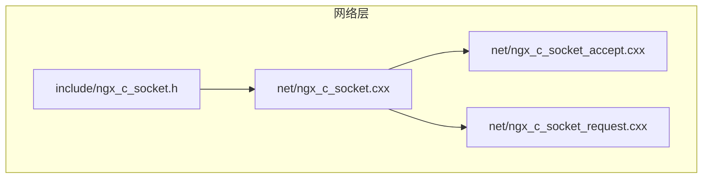
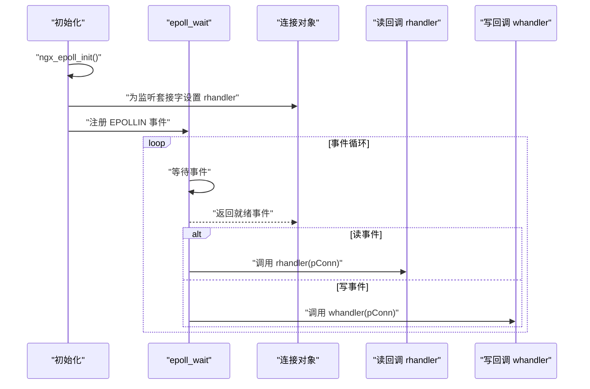
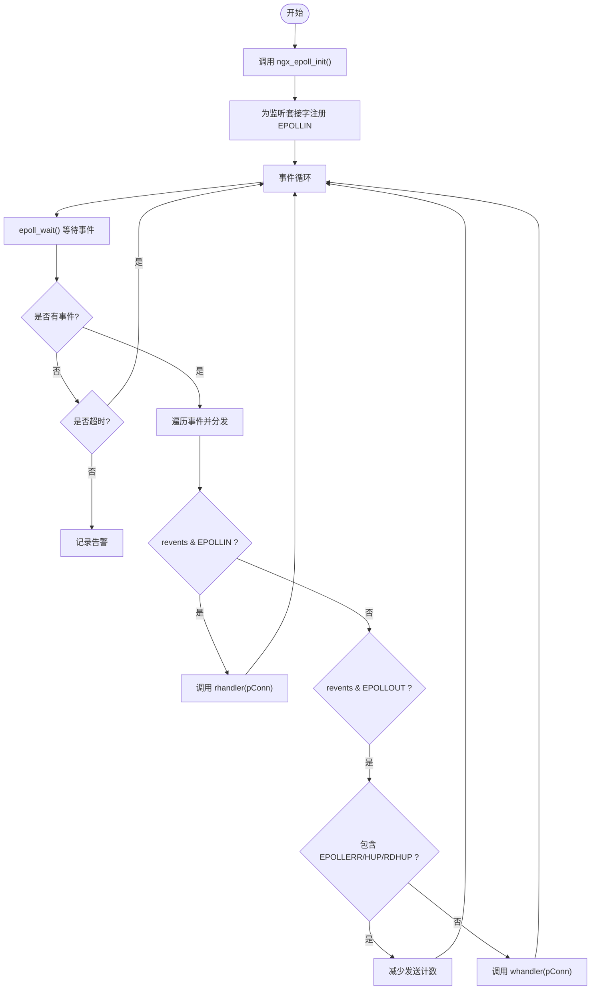
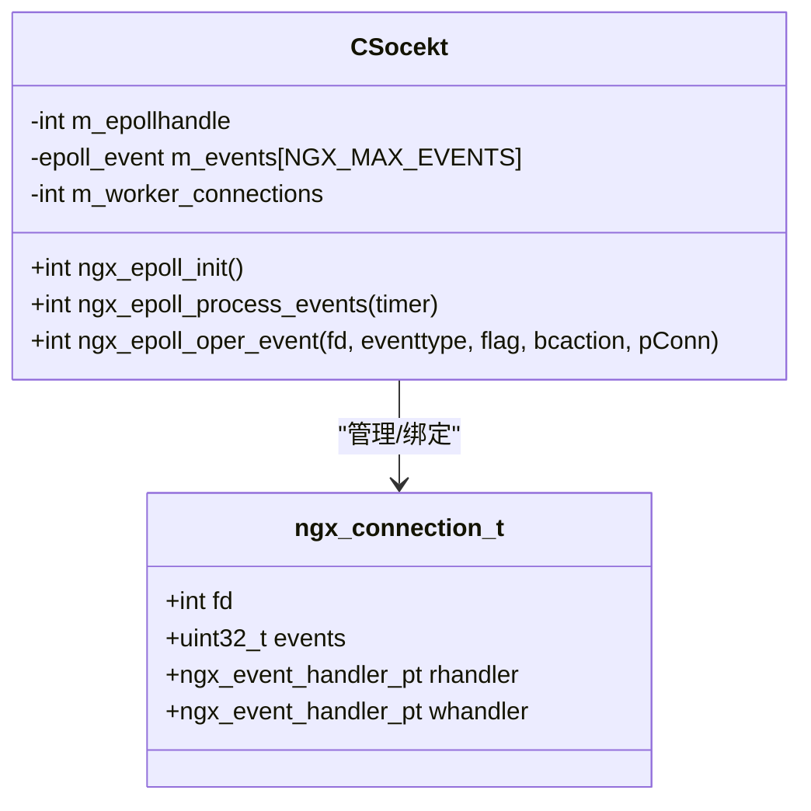

# epoll 事件处理 API

<cite>
**本文档引用的文件**
- [ngx_c_socket.h](file://include/ngx_c_socket.h)
- [ngx_c_socket.cxx](file://net/ngx_c_socket.cxx)
- [ngx_c_socket_accept.cxx](file://net/ngx_c_socket_accept.cxx)
- [ngx_c_socket_request.cxx](file://net/ngx_c_socket_request.cxx)
</cite>

## 目录
1. [简介](#简介)
2. [项目结构](#项目结构)
3. [核心组件](#核心组件)
4. [架构概览](#架构概览)
5. [详细组件分析](#详细组件分析)
6. [依赖关系分析](#依赖关系分析)
7. [性能考量](#性能考量)
8. [故障排查指南](#故障排查指南)
9. [结论](#结论)

## 简介
本文件为 epoll 事件处理模块的详细 API 参考文档，聚焦以下三个核心函数：
- epoll 功能初始化函数：ngx_epoll_init()
- 事件处理函数：ngx_epoll_process_events()
- epoll 事件操作函数：ngx_epoll_oper_event()

文档将深入解释各函数的参数配置、使用场景、事件类型与标志位、回调函数设置，以及如何通过这些 API 构建高效的事件驱动网络处理。同时提供性能优化建议与错误处理策略。

## 项目结构
epoll 事件处理位于网络层模块中，核心接口定义在头文件中，具体实现位于 C++ 源文件中，并与连接池、发送队列、线程池等组件协同工作。

图表来源
- [ngx_c_socket.h](file://include/ngx_c_socket.h#L103-L125)
- [ngx_c_socket.cxx](file://net/ngx_c_socket.cxx#L540-L821)
- [ngx_c_socket_accept.cxx](file://net/ngx_c_socket_accept.cxx#L22-L180)
- [ngx_c_socket_request.cxx](file://net/ngx_c_socket_request.cxx#L25-L332)

章节来源
- [ngx_c_socket.h](file://include/ngx_c_socket.h#L1-L258)
- [ngx_c_socket.cxx](file://net/ngx_c_socket.cxx#L540-L821)

## 核心组件
- CSocekt 类：封装 epoll 初始化、事件处理与事件操作，维护连接池、监听套接字列表、epoll 实例句柄与事件数组。
- 连接对象 ngx_connection_t：每个连接持有读/写回调函数指针 rhandler/whandler，以及与 epoll 事件相关的 events 标志位。
- epoll 相关成员：
  - m_epollhandle：epoll_create 返回的实例句柄
  - m_events[NGX_MAX_EVENTS]：epoll_wait 返回事件数组
  - m_worker_connections：最大连接数，用于 epoll_create 参数

章节来源
- [ngx_c_socket.h](file://include/ngx_c_socket.h#L103-L125)
- [ngx_c_socket.h](file://include/ngx_c_socket.h#L205-L227)

## 架构概览
epoll 事件处理的整体流程：
- 初始化阶段：创建 epoll 实例，初始化连接池，为监听套接字注册读事件，绑定连接对象与回调函数。
- 事件循环：epoll_wait 阻塞等待事件，根据 revents 调用连接对象的 rhandler 或 whandler。
- 事件操作：根据业务需要对连接的 epoll 事件进行增加、修改或删除，动态调整监听的事件类型。

图表来源
- [ngx_c_socket.cxx](file://net/ngx_c_socket.cxx#L540-L587)
- [ngx_c_socket.cxx](file://net/ngx_c_socket.cxx#L756-L821)

## 详细组件分析

### 函数：ngx_epoll_init()
- 功能：创建 epoll 实例，初始化连接池，为监听套接字注册读事件，绑定连接对象与回调函数。
- 关键步骤：
  - 调用 epoll_create(m_worker_connections) 创建 epoll 实例
  - 初始化连接池 initconnection()
  - 遍历监听套接字列表，为每个监听套接字：
    - 从连接池获取连接对象并建立关联
    - 设置连接对象的 rhandler 为 ngx_event_accept
    - 调用 ngx_epoll_oper_event(fd, EPOLL_CTL_ADD, EPOLLIN|EPOLLRDHUP, 0, pConn) 注册读事件
- 返回值：成功返回 1，失败直接退出进程（致命错误）

参数说明
- m_worker_connections：epoll_create 的参数，必须大于 0
- 监听套接字 fd：来自监听套接字列表
- 事件标志：EPOLLIN 表示可读，EPOLLRDHUP 表示对端关闭或半关闭

章节来源
- [ngx_c_socket.cxx](file://net/ngx_c_socket.cxx#L540-L587)
- [ngx_c_socket.h](file://include/ngx_c_socket.h#L118-L121)

### 函数：ngx_epoll_process_events(int timer)
- 功能：等待并处理 epoll 事件，根据事件类型调用连接对象的回调函数。
- 关键步骤：
  - 调用 epoll_wait(m_epollhandle, m_events, NGX_MAX_EVENTS, timer)
  - 错误处理：EINTR 视为正常，其他错误记录告警
  - 超时处理：timer != -1 时表示阻塞到时间返回；无限等待却无事件返回记录告警
  - 遍历返回事件数组 m_events：
    - 从 ev.data.ptr 取回连接对象指针 pConn
    - 若 revents & EPOLLIN：调用 pConn->rhandler(pConn)
    - 若 revents & EPOLLOUT：若包含 EPOLLERR/EPOLLHUP/EPOLLRDHUP 则减少发送计数；否则调用 pConn->whandler(pConn)
- 返回值：1 表示正常返回，0 表示存在问题但仍应继续运行

参数说明
- timer：epoll_wait 的超时时间（毫秒），-1 表示阻塞等待，0 表示立即返回，>0 表示等待指定时间

章节来源
- [ngx_c_socket.cxx](file://net/ngx_c_socket.cxx#L756-L821)
- [ngx_c_socket.h](file://include/ngx_c_socket.h#L121-L121)

### 函数：ngx_epoll_oper_event(int fd, uint32_t eventtype, uint32_t flag, int bcaction, lpngx_connection_t pConn)
- 功能：对 epoll 红黑树进行增删改操作，维护连接对象的事件标志位。
- 支持的操作类型：
  - EPOLL_CTL_ADD：新增事件，设置 ev.events = flag，同时 pConn->events = flag
  - EPOLL_CTL_MOD：修改事件，根据 bcaction 决定：
    - 0：增加标志（ev.events |= flag）
    - 1：去掉标志（ev.events &= ~flag）
    - 2：完全覆盖（ev.events = flag）
  - EPOLL_CTL_DEL：当前未使用，socket 关闭时会自动从红黑树移除
- 关键点：
  - 无论 ADD 还是 MOD，都会设置 ev.data.ptr = (void*)pConn，以保证 epoll_wait 返回时能取回连接对象
  - 修改事件时，同步更新 pConn->events，确保下次 MOD 时能正确恢复旧标志
- 返回值：成功返回 1，失败返回 -1

参数说明
- fd：目标套接字文件描述符
- eventtype：操作类型（EPOLL_CTL_ADD/MOD/DEL）
- flag：事件标志位（如 EPOLLIN、EPOLLOUT、EPOLLRDHUP 等）
- bcaction：当 eventtype 为 MOD 时使用，决定如何处理 flag（0 增加、1 去掉、2 覆盖）
- pConn：连接对象指针，用于事件与数据的绑定

章节来源
- [ngx_c_socket.cxx](file://net/ngx_c_socket.cxx#L678-L735)
- [ngx_c_socket.h](file://include/ngx_c_socket.h#L123-L125)

### 事件类型与标志位
- EPOLLIN：可读事件
- EPOLLOUT：可写事件
- EPOLLRDHUP：对端关闭或半关闭
- EPOLLERR：套接字错误
- EPOLLHUP：套接字挂起
- EPOLLET：边缘触发（在注释中提及，可用于 ET 模式）

章节来源
- [ngx_c_socket.cxx](file://net/ngx_c_socket.cxx#L737-L751)
- [ngx_c_socket.cxx](file://net/ngx_c_socket.cxx#L803-L818)

### 回调函数设置
- 连接对象持有 rhandler 与 whandler 两个成员函数指针，分别用于读事件与写事件的处理。
- 监听套接字：rhandler 设置为 ngx_event_accept
- 新连接：rhandler 设置为 ngx_read_request_handler，whandler 设置为 ngx_write_request_handler
- 发送队列线程：当发送缓冲区满时，通过 ngx_epoll_oper_event 将 EPOLLOUT 加入 epoll，等待可写事件后调用 ngx_write_request_handler

章节来源
- [ngx_c_socket.h](file://include/ngx_c_socket.h#L56-L57)
- [ngx_c_socket_accept.cxx](file://net/ngx_c_socket_accept.cxx#L154-L155)
- [ngx_c_socket_request.cxx](file://net/ngx_c_socket_request.cxx#L281-L332)

### 事件注册、监听与分发的完整流程
- 监听套接字注册读事件：在 ngx_epoll_init() 中完成
- 新连接注册读事件：在 ngx_event_accept() 中完成
- 发送缓冲区满时注册写事件：在 ServerSendQueueThread() 中通过 ngx_epoll_oper_event(EPOLL_CTL_MOD, EPOLLOUT, ...) 完成
- 事件分发：在 ngx_epoll_process_events() 中根据 revents 调用 rhandler 或 whandler

图表来源
- [ngx_c_socket.cxx](file://net/ngx_c_socket.cxx#L540-L587)
- [ngx_c_socket.cxx](file://net/ngx_c_socket.cxx#L756-L821)

## 依赖关系分析
- CSocekt 类依赖：
  - epoll 接口：epoll_create、epoll_wait、epoll_ctl
  - 连接池：连接对象的获取与回收
  - 线程池：发送队列线程、回收连接线程等
  - 日志系统：错误与告警输出
- 事件与回调的耦合：
  - 连接对象通过 rhandler/whandler 与业务逻辑解耦
  - epoll_wait 返回的事件通过 ev.data.ptr 与连接对象绑定，实现事件与数据的解耦

图表来源
- [ngx_c_socket.h](file://include/ngx_c_socket.h#L103-L125)
- [ngx_c_socket.h](file://include/ngx_c_socket.h#L38-L91)

章节来源
- [ngx_c_socket.h](file://include/ngx_c_socket.h#L103-L125)
- [ngx_c_socket.h](file://include/ngx_c_socket.h#L38-L91)

## 性能考量
- epoll_wait 的超时设置：合理设置 timer 可避免忙轮询，同时保证及时处理到期任务。
- LT vs ET 模式：注释中提到 ET 模式的优点与要求，ET 模式下需使用非阻塞 I/O 并循环读取直到 EAGAIN，可减少系统调用次数，提高性能。
- 事件标志位的最小化：仅注册必要的事件（如仅在发送缓冲区满时注册 EPOLLOUT），避免 LT 模式下频繁写通知。
- 连接池与事件绑定：通过 ev.data.ptr 将连接对象与事件绑定，减少查找成本，提升事件分发效率。

章节来源
- [ngx_c_socket.cxx](file://net/ngx_c_socket.cxx#L632-L646)
- [ngx_c_socket.cxx](file://net/ngx_c_socket.cxx#L1099-L1105)

## 故障排查指南
- epoll_create 失败：直接退出进程，检查系统资源限制与权限。
- epoll_wait 返回 EINTR：视为正常，记录日志；其他错误记录告警并返回非正常状态。
- epoll_wait 无限等待无事件：记录告警，检查监听套接字是否正确注册读事件。
- epoll_ctl 失败：记录错误日志，检查 fd 是否有效、eventtype 是否正确、flag 是否合法。
- 发送缓冲区满：通过 EPOLLOUT 事件驱动继续发送，避免频繁轮询。
- 对端关闭连接：EPOLLIN 或 EPOLLRDHUP 触发，应在回调中正确处理资源回收。

章节来源
- [ngx_c_socket.cxx](file://net/ngx_c_socket.cxx#L548-L552)
- [ngx_c_socket.cxx](file://net/ngx_c_socket.cxx#L761-L777)
- [ngx_c_socket.cxx](file://net/ngx_c_socket.cxx#L787-L790)
- [ngx_c_socket.cxx](file://net/ngx_c_socket.cxx#L729-L733)
- [ngx_c_socket_request.cxx](file://net/ngx_c_socket_request.cxx#L281-L332)

## 结论
epoll 事件处理模块通过三个核心函数实现了高效的事件驱动网络处理：
- ngx_epoll_init() 完成 epoll 实例创建与监听套接字的事件注册
- ngx_epoll_process_events() 提供事件等待与分发
- ngx_epoll_oper_event() 提供事件的动态增删改

配合连接池、回调函数与线程池，该模块能够稳定、高效地处理大量并发连接。在 ET 模式下，结合非阻塞 I/O 与最小化事件标志位，可进一步提升性能。遇到问题时，应重点关注 epoll_wait 的返回状态与 epoll_ctl 的错误日志，并确保回调函数正确处理对端关闭与资源回收。