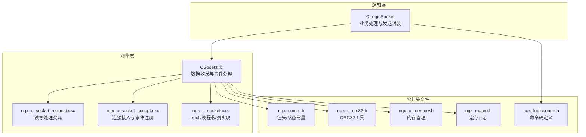
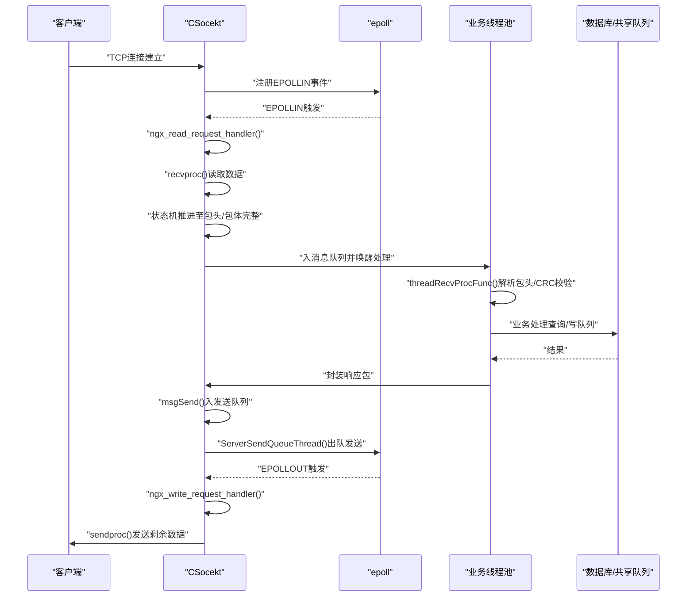
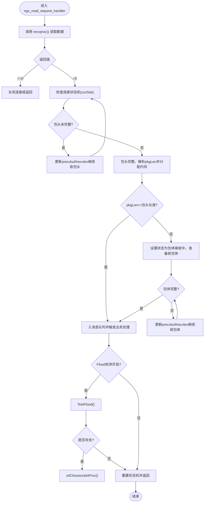
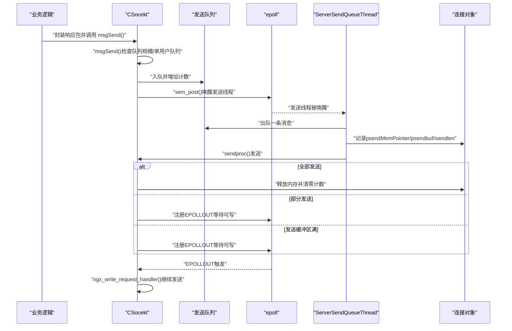
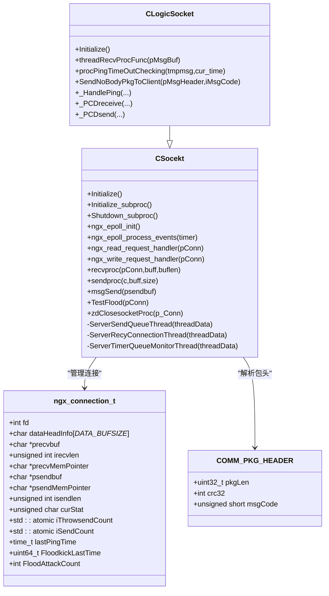

# 数据收发 API

<cite>
**本文档引用的文件**
- [ngx_c_socket.h](file://include/ngx_c_socket.h)
- [ngx_c_socket.cxx](file://net/ngx_c_socket.cxx)
- [ngx_c_socket_request.cxx](file://net/ngx_c_socket_request.cxx)
- [ngx_c_socket_accept.cxx](file://net/ngx_c_socket_accept.cxx)
- [ngx_comm.h](file://include/ngx_comm.h)
- [ngx_logiccomm.h](file://include/ngx_logiccomm.h)
- [ngx_c_crc32.h](file://include/ngx_c_crc32.h)
- [ngx_c_memory.h](file://include/ngx_c_memory.h)
- [ngx_macro.h](file://include/ngx_macro.h)
- [ngx_c_slogic.cxx](file://logic/ngx_c_slogic.cxx)
</cite>

## 目录
1. [简介](#简介)
2. [项目结构](#项目结构)
3. [核心组件](#核心组件)
4. [架构总览](#架构总览)
5. [详细组件分析](#详细组件分析)
6. [依赖关系分析](#依赖关系分析)
7. [性能考量](#性能考量)
8. [故障排查指南](#故障排查指南)
9. [结论](#结论)
10. [附录](#附录)

## 简介
本文件面向数据收发模块，提供 recvproc()、ngx_read_request_handler()、sendproc()、msgSend() 的完整 API 参考与实现解析。内容涵盖数据包处理流程、缓冲区管理、发送队列控制、数据完整性校验、错误处理与流量控制策略，并给出可操作的使用示例与优化建议，帮助开发者在保证可靠性的同时获得良好性能。

## 项目结构
数据收发模块主要位于 net/ 与 include/ 目录，核心类为 CSocekt，配合逻辑层 CLogicSocket 实现业务处理与数据收发的衔接。

图表来源
- [ngx_c_socket.h](file://include/ngx_c_socket.h#L103-L255)
- [ngx_c_socket_request.cxx](file://net/ngx_c_socket_request.cxx#L25-L341)
- [ngx_c_socket_accept.cxx](file://net/ngx_c_socket_accept.cxx#L150-L208)
- [ngx_c_socket.cxx](file://net/ngx_c_socket.cxx#L56-L210)
- [ngx_comm.h](file://include/ngx_comm.h#L5-L32)
- [ngx_logiccomm.h](file://include/ngx_logiccomm.h#L4-L29)
- [ngx_c_crc32.h](file://include/ngx_c_crc32.h#L6-L64)
- [ngx_c_memory.h](file://include/ngx_c_memory.h#L4-L52)
- [ngx_macro.h](file://include/ngx_macro.h#L1-L40)
- [ngx_c_slogic.cxx](file://logic/ngx_c_slogic.cxx#L56-L129)

章节来源
- [ngx_c_socket.h](file://include/ngx_c_socket.h#L1-L258)
- [ngx_c_socket.cxx](file://net/ngx_c_socket.cxx#L56-L210)
- [ngx_c_socket_request.cxx](file://net/ngx_c_socket_request.cxx#L25-L341)
- [ngx_c_socket_accept.cxx](file://net/ngx_c_socket_accept.cxx#L150-L208)
- [ngx_comm.h](file://include/ngx_comm.h#L5-L32)
- [ngx_logiccomm.h](file://include/ngx_logiccomm.h#L4-L29)
- [ngx_c_crc32.h](file://include/ngx_c_crc32.h#L6-L64)
- [ngx_c_memory.h](file://include/ngx_c_memory.h#L4-L52)
- [ngx_macro.h](file://include/ngx_macro.h#L1-L40)
- [ngx_c_slogic.cxx](file://logic/ngx_c_slogic.cxx#L56-L129)

## 核心组件
- CSocekt：网络收发核心类，提供 epoll 初始化、事件处理、数据收发、发送队列、Flood 攻击检测、心跳超时处理等能力。
- ngx_connection_t：连接上下文，维护收发缓冲、状态机、发送队列计数、心跳时间等。
- COMM_PKG_HEADER：网络包头，包含包总长度、CRC32 校验、消息类型代码。
- CLogicSocket：业务逻辑层，继承自 CSocekt，实现命令处理与封装发送。

章节来源
- [ngx_c_socket.h](file://include/ngx_c_socket.h#L38-L91)
- [ngx_comm.h](file://include/ngx_comm.h#L19-L25)
- [ngx_c_slogic.cxx](file://logic/ngx_c_slogic.cxx#L56-L129)

## 架构总览
数据收发采用 epoll + 多线程模型：
- 接入阶段：accept 后注册读事件，设置读/写处理函数。
- 接收阶段：recvproc() 循环读取，状态机推进至包头完整后解析长度，再收包体，最后入消息队列交由业务线程处理。
- 发送阶段：msgSend() 入发送队列，ServerSendQueueThread() 出队发送；sendproc() 发送，未完成时注册 EPOLLOUT，待写事件回调 ngx_write_request_handler() 继续发送。
- 安全与控制：Flood 攻击检测、发送队列上限与单用户队列上限、心跳超时踢人、连接回收线程。

图表来源
- [ngx_c_socket_request.cxx](file://net/ngx_c_socket_request.cxx#L25-L114)
- [ngx_c_socket_request.cxx](file://net/ngx_c_socket_request.cxx#L116-L154)
- [ngx_c_socket_request.cxx](file://net/ngx_c_socket_request.cxx#L235-L277)
- [ngx_c_socket_request.cxx](file://net/ngx_c_socket_request.cxx#L281-L332)
- [ngx_c_socket.cxx](file://net/ngx_c_socket.cxx#L415-L456)
- [ngx_c_socket.cxx](file://net/ngx_c_socket.cxx#L876-L1097)
- [ngx_c_slogic.cxx](file://logic/ngx_c_slogic.cxx#L158-L175)
- [ngx_c_slogic.cxx](file://logic/ngx_c_slogic.cxx#L275-L340)

## 详细组件分析

### 数据接收处理 API：recvproc() 与 ngx_read_request_handler()
- recvproc()：封装 recv()，处理 EAGAIN/EWOULDBLOCK/EINTR 等返回，区分对端关闭与异常错误，统一通过 zdClosesocketProc() 关闭连接并回收。
- ngx_read_request_handler()：根据连接状态机（包头/包体）循环调用 recvproc()，推进状态，包头完整后解析 pkgLen，分配内存收包体，完整后入消息队列交由业务线程处理；支持 Flood 攻击检测。

图表来源
- [ngx_c_socket_request.cxx](file://net/ngx_c_socket_request.cxx#L25-L114)
- [ngx_c_socket_request.cxx](file://net/ngx_c_socket_request.cxx#L116-L154)
- [ngx_c_socket_request.cxx](file://net/ngx_c_socket_request.cxx#L159-L233)
- [ngx_c_socket.cxx](file://net/ngx_c_socket.cxx#L480-L509)

章节来源
- [ngx_c_socket_request.cxx](file://net/ngx_c_socket_request.cxx#L25-L114)
- [ngx_c_socket_request.cxx](file://net/ngx_c_socket_request.cxx#L116-L154)
- [ngx_c_socket_request.cxx](file://net/ngx_c_socket_request.cxx#L159-L233)
- [ngx_c_socket.cxx](file://net/ngx_c_socket.cxx#L480-L509)

### 数据发送 API：sendproc() 与 msgSend()
- sendproc()：封装 send()，返回 >0（部分/全部发送）、=0（对端断开）、-1（发送缓冲区满，EAGAIN）、-2（其他错误）。用于在写事件回调中继续发送。
- msgSend()：将“消息头+包头+包体”入发送队列，进行队列规模与单用户队列上限检查，必要时丢弃并关闭连接；通过信号量唤醒发送线程。

图表来源
- [ngx_c_socket.cxx](file://net/ngx_c_socket.cxx#L415-L456)
- [ngx_c_socket.cxx](file://net/ngx_c_socket.cxx#L876-L1097)
- [ngx_c_socket_request.cxx](file://net/ngx_c_socket_request.cxx#L235-L277)
- [ngx_c_socket_request.cxx](file://net/ngx_c_socket_request.cxx#L281-L332)

章节来源
- [ngx_c_socket.cxx](file://net/ngx_c_socket.cxx#L415-L456)
- [ngx_c_socket.cxx](file://net/ngx_c_socket.cxx#L876-L1097)
- [ngx_c_socket_request.cxx](file://net/ngx_c_socket_request.cxx#L235-L277)
- [ngx_c_socket_request.cxx](file://net/ngx_c_socket_request.cxx#L281-L332)

### 数据包处理流程与状态机
- 状态机：包头初始(_PKG_HD_INIT)、包头接收中(_PKG_HD_RECVING)、包体初始(_PKG_BD_INIT)、包体接收中(_PKG_BD_RECVING)。
- 包头解析：读取 pkgLen，校验长度合法性，分配内存，填充消息头与包头。
- 包体解析：根据 pkgLen - 包头长度确定包体长度，循环接收直至完整。
- 完整包处理：入消息队列，触发业务线程处理；可选 Flood 攻击检测。

章节来源
- [ngx_comm.h](file://include/ngx_comm.h#L5-L12)
- [ngx_c_socket_request.cxx](file://net/ngx_c_socket_request.cxx#L159-L233)

### 缓冲区管理
- 接收缓冲：ngx_connection_t.dataHeadInfo 用于暂存包头；包头完整后分配内存收包体，使用 precvbuf/irecvlen 指向当前接收位置与剩余长度。
- 发送缓冲：psendbuf/psendMemPointer 记录发送起点与完整内存指针；sendproc() 返回后更新剩余长度与指针。
- 内存管理：CMemory 提供单例分配/释放，避免频繁 malloc/free。

章节来源
- [ngx_c_socket.h](file://include/ngx_c_socket.h#L64-L76)
- [ngx_c_socket_request.cxx](file://net/ngx_c_socket_request.cxx#L116-L154)
- [ngx_c_socket_request.cxx](file://net/ngx_c_socket_request.cxx#L235-L277)
- [ngx_c_memory.h](file://include/ngx_c_memory.h#L4-L52)

### 发送队列控制
- 队列：std::list<char*> m_MsgSendQueue；原子计数 m_iSendMsgQueueCount；互斥量 m_sendMessageQueueMutex。
- 控制策略：
  - 总队列阈值：超过上限丢弃并统计丢弃计数。
  - 单用户阈值：单连接 iSendCount 超过阈值则关闭连接，防止恶意/慢消费者拖垮服务。
  - 信号量：sem_post() 唤醒发送线程，避免忙等。
- 写事件回调：ngx_write_request_handler() 在 EPOLLOUT 触发时继续发送，发送完毕注销写事件并释放内存。

章节来源
- [ngx_c_socket.cxx](file://net/ngx_c_socket.cxx#L415-L456)
- [ngx_c_socket.cxx](file://net/ngx_c_socket.cxx#L876-L1097)
- [ngx_c_socket_request.cxx](file://net/ngx_c_socket_request.cxx#L281-L332)

### 数据完整性检查与错误处理
- CRC32 校验：业务线程 threadRecvProcFunc() 对包体计算 CRC32，与包头中 crc32 比较，不一致则丢弃。
- 序列号校验：消息头 iCurrsequence 与连接对象 iCurrsequence 比较，断开连接的包丢弃。
- 错误处理：
  - recvproc()：EAGAIN/EWOULDBLOCK 不视为错误；EINTR 记录日志；其他错误关闭连接。
  - sendproc()：EAGAIN 表示发送缓冲区满；EINTR 记录日志；其他错误返回 -2。
  - Flood 攻击：TestFlood() 统计频率，超过阈值直接关闭连接。
  - 心跳超时：定时线程检测 lastPingTime，超时则关闭连接。

章节来源
- [ngx_c_slogic.cxx](file://logic/ngx_c_slogic.cxx#L77-L129)
- [ngx_c_socket.cxx](file://net/ngx_c_socket.cxx#L415-L456)
- [ngx_c_socket.cxx](file://net/ngx_c_socket.cxx#L480-L509)
- [ngx_c_socket.cxx](file://net/ngx_c_socket.cxx#L136-L179)

### 流量控制与安全策略
- Flood 攻击检测：基于时间间隔与累计次数，超过阈值踢人。
- 发送队列上限：总队列与单用户队列双重保护，防止内存膨胀与单用户拖垮。
- 心跳超时：可配置踢人开关与超时阈值，超时自动关闭连接。
- 连接回收：延迟回收队列，避免频繁创建/销毁带来的抖动。

章节来源
- [ngx_c_socket.cxx](file://net/ngx_c_socket.cxx#L227-L244)
- [ngx_c_socket.cxx](file://net/ngx_c_socket.cxx#L480-L509)
- [ngx_c_socket.cxx](file://net/ngx_c_socket.cxx#L136-L179)

## 依赖关系分析

图表来源
- [ngx_c_socket.h](file://include/ngx_c_socket.h#L103-L255)
- [ngx_c_socket_request.cxx](file://net/ngx_c_socket_request.cxx#L25-L341)
- [ngx_c_slogic.cxx](file://logic/ngx_c_slogic.cxx#L56-L129)
- [ngx_comm.h](file://include/ngx_comm.h#L19-L25)

章节来源
- [ngx_c_socket.h](file://include/ngx_c_socket.h#L103-L255)
- [ngx_c_socket_request.cxx](file://net/ngx_c_socket_request.cxx#L25-L341)
- [ngx_c_slogic.cxx](file://logic/ngx_c_slogic.cxx#L56-L129)
- [ngx_comm.h](file://include/ngx_comm.h#L19-L25)

## 性能考量
- epoll 模式：采用 LT 模式，保证事件可重复触发，简化编程；发送缓冲区满时注册 EPOLLOUT，避免频繁通知。
- 非阻塞 I/O：所有 socket 设置为非阻塞，结合 epoll 提升并发能力。
- 内存池：CMemory 单例分配/释放，降低碎片与系统调用开销。
- 队列与信号量：发送队列与信号量配合，避免忙等，提升吞吐。
- 线程分工：接收/发送/回收/定时线程分离，避免互相阻塞。
- 业务处理：包头 CRC 校验与命令码校验在业务线程进行，保证可靠性。

[本节为通用性能指导，不直接分析具体文件]

## 故障排查指南
- 接收异常：
  - EAGAIN/EWOULDBLOCK：LT 模式下不应出现，记录日志并返回。
  - EINTR：信号导致，记录日志并返回。
  - 其他错误：关闭连接并回收。
- 发送异常：
  - EAGAIN：发送缓冲区满，注册 EPOLLOUT 等待可写。
  - EINTR：记录日志，稍后重试。
  - 其他错误：返回 -2，等待统一处理。
- Flood 攻击：
  - 检查 m_floodTimeInterval 与 m_floodKickCount 配置，确认是否开启。
  - 观察 FloodAttackCount 与 FloodkickLastTime 变化。
- 心跳超时：
  - 检查 m_ifTimeOutKick 与 m_iWaitTime 配置，确认是否启用踢人。
  - 查看 lastPingTime 与当前时间差。
- 发送队列堆积：
  - 检查 m_iSendMsgQueueCount 与单用户 iSendCount，必要时限速或扩容处理线程。

章节来源
- [ngx_c_socket_request.cxx](file://net/ngx_c_socket_request.cxx#L116-L154)
- [ngx_c_socket_request.cxx](file://net/ngx_c_socket_request.cxx#L235-L277)
- [ngx_c_socket.cxx](file://net/ngx_c_socket.cxx#L227-L244)
- [ngx_c_socket.cxx](file://net/ngx_c_socket.cxx#L480-L509)

## 结论
数据收发模块通过明确的状态机、完善的错误处理与安全策略、高效的队列与线程模型，提供了可靠的 TCP 数据传输能力。开发者可基于 msgSend() 与 sendproc() 构建稳定的发送路径，结合 recvproc() 与状态机实现健壮的接收流程，并通过 CRC 校验与心跳/Flood 策略保障数据完整性与服务稳定性。

[本节为总结性内容，不直接分析具体文件]

## 附录

### API 一览与使用要点
- 接收处理
  - recvproc(pConn, buff, buflen)：底层读取，返回 >0 成功字节，<=0 时由函数处理连接回收。
  - ngx_read_request_handler(pConn)：事件回调入口，推进状态机并入队完整包。
- 发送处理
  - sendproc(c, buff, size)：底层发送，返回 >0 部分/全部发送，-1 缓冲区满，-2 其他错误。
  - msgSend(psendbuf)：入发送队列，进行队列与单用户上限检查，必要时丢弃并关闭连接。
  - ngx_write_request_handler(pConn)：写事件回调，继续发送剩余数据，发送完毕注销 EPOLLOUT 并释放内存。
- 业务封装
  - CLogicSocket::SendNoBodyPkgToClient(pMsgHeader, iMsgCode)：发送仅有包头的响应包。
  - threadRecvProcFunc(pMsgBuf)：业务线程入口，解析包头/CRC 校验，路由到具体命令处理函数。

章节来源
- [ngx_c_socket_request.cxx](file://net/ngx_c_socket_request.cxx#L25-L114)
- [ngx_c_socket_request.cxx](file://net/ngx_c_socket_request.cxx#L116-L154)
- [ngx_c_socket_request.cxx](file://net/ngx_c_socket_request.cxx#L235-L277)
- [ngx_c_socket_request.cxx](file://net/ngx_c_socket_request.cxx#L281-L332)
- [ngx_c_socket.cxx](file://net/ngx_c_socket.cxx#L415-L456)
- [ngx_c_slogic.cxx](file://logic/ngx_c_slogic.cxx#L158-L175)
- [ngx_c_slogic.cxx](file://logic/ngx_c_slogic.cxx#L77-L129)