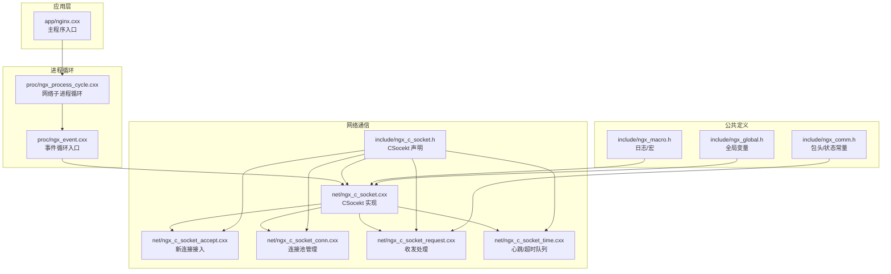
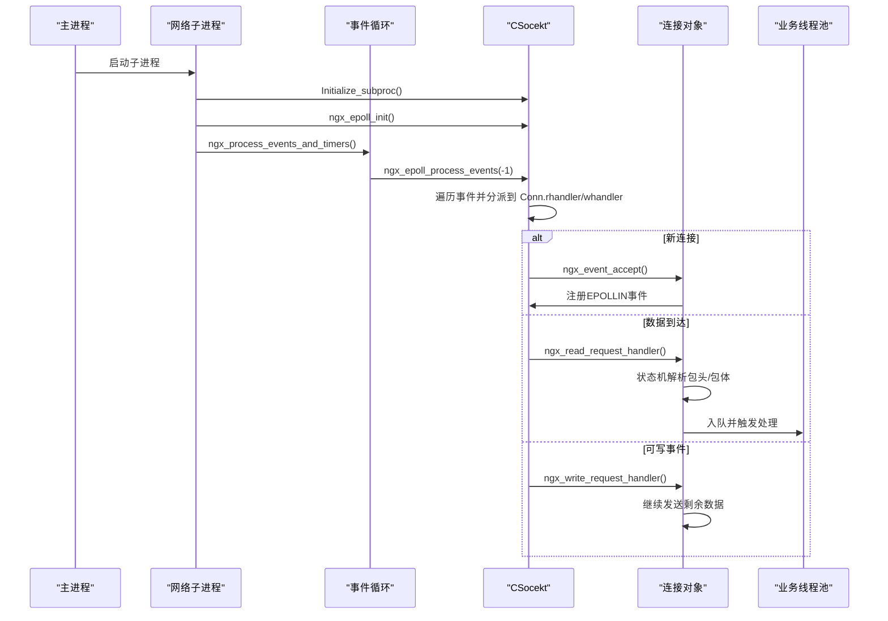
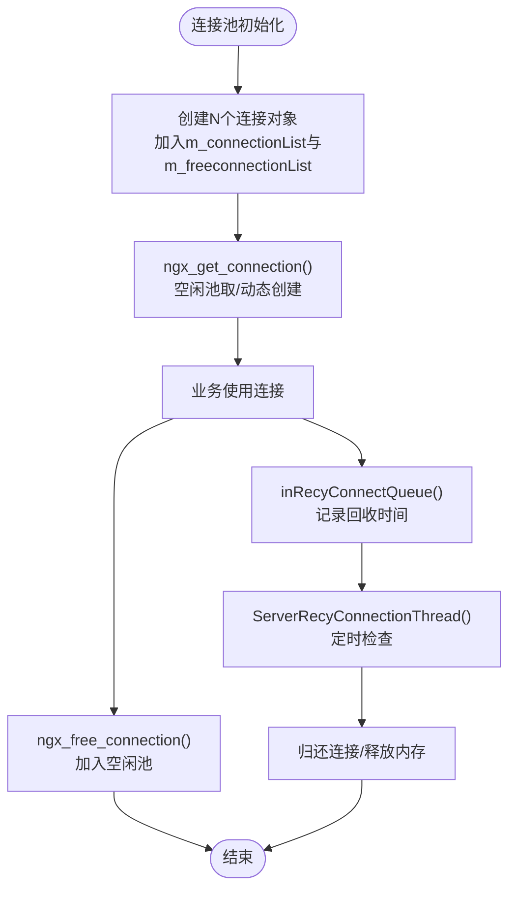
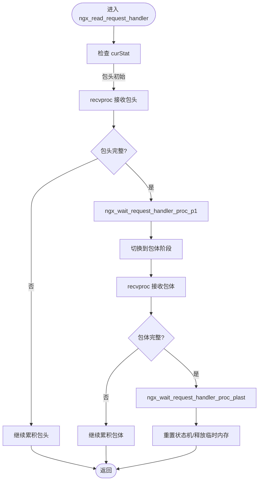
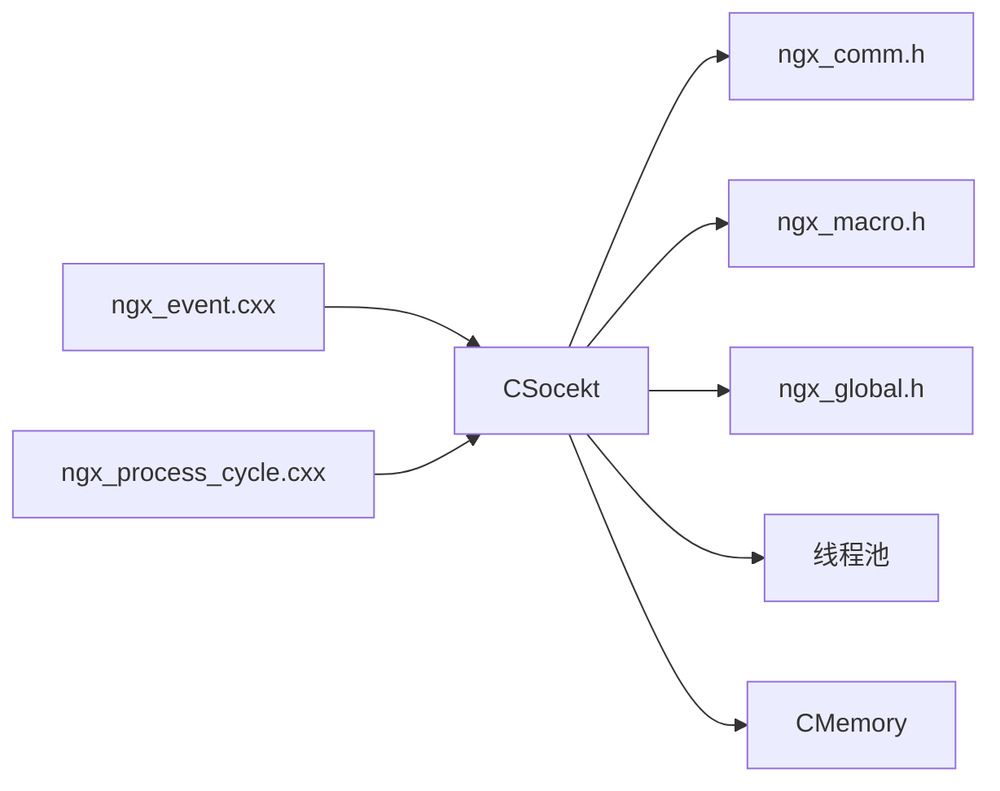

# 网络通信 API

<cite>
**本文引用的文件**
- [include/ngx_c_socket.h](file://include/ngx_c_socket.h)
- [net/ngx_c_socket.cxx](file://net/ngx_c_socket.cxx)
- [net/ngx_c_socket_accept.cxx](file://net/ngx_c_socket_accept.cxx)
- [net/ngx_c_socket_conn.cxx](file://net/ngx_c_socket_conn.cxx)
- [net/ngx_c_socket_request.cxx](file://net/ngx_c_socket_request.cxx)
- [net/ngx_c_socket_time.cxx](file://net/ngx_c_socket_time.cxx)
- [proc/ngx_event.cxx](file://proc/ngx_event.cxx)
- [proc/ngx_process_cycle.cxx](file://proc/ngx_process_cycle.cxx)
- [include/ngx_comm.h](file://include/ngx_comm.h)
- [include/ngx_macro.h](file://include/ngx_macro.h)
- [include/ngx_global.h](file://include/ngx_global.h)
- [app/nginx.cxx](file://app/nginx.cxx)
</cite>

## 目录
1. [简介](#简介)
2. [项目结构](#项目结构)
3. [核心组件](#核心组件)
4. [架构总览](#架构总览)
5. [详细组件分析](#详细组件分析)
6. [依赖关系分析](#依赖关系分析)
7. [性能考量](#性能考量)
8. [故障排查指南](#故障排查指南)
9. [结论](#结论)
10. [附录](#附录)

## 简介
本文件为网络通信模块的详细 API 参考文档，聚焦于 CSocekt 类的公共接口与内部协作机制，涵盖 socket 初始化、epoll 事件处理、连接管理、数据收发、发送队列与连接回收、心跳与安全防护等。文档同时给出关键流程的时序图与类图，帮助开发者快速理解并正确使用这些 API 进行网络通信开发。

## 项目结构
网络通信模块位于 net/ 与 include/ 目录，配合 proc/ 事件循环与 app/ 主程序入口协同工作。核心文件与职责如下：
- include/ngx_c_socket.h：CSocekt 类声明、ngx_connection_s/ngx_listening_s 结构体、公共 API 声明
- net/ngx_c_socket.cxx：CSocekt 的实现，含 epoll 初始化、事件处理、发送/接收、线程管理等
- net/ngx_c_socket_accept.cxx：新连接接入与监听套接字事件处理
- net/ngx_c_socket_conn.cxx：连接池初始化、获取/归还、延迟回收
- net/ngx_c_socket_request.cxx：数据接收状态机、包头/包体解析、发送处理
- net/ngx_c_socket_time.cxx：心跳/超时队列、定时监控线程
- proc/ngx_event.cxx：事件循环入口，调用 CSocekt::ngx_epoll_process_events
- proc/ngx_process_cycle.cxx：网络子进程生命周期与初始化
- include/ngx_comm.h：包头结构与收包状态常量
- include/ngx_macro.h：日志级别、宏工具
- include/ngx_global.h：全局变量与外部声明
- app/nginx.cxx：主程序入口与全局对象初始化

图表来源
- [include/ngx_c_socket.h](file://include/ngx_c_socket.h#L103-L255)
- [net/ngx_c_socket.cxx](file://net/ngx_c_socket.cxx#L56-L159)
- [net/ngx_c_socket_accept.cxx](file://net/ngx_c_socket_accept.cxx#L22-L180)
- [net/ngx_c_socket_conn.cxx](file://net/ngx_c_socket_conn.cxx#L77-L190)
- [net/ngx_c_socket_request.cxx](file://net/ngx_c_socket_request.cxx#L25-L114)
- [net/ngx_c_socket_time.cxx](file://net/ngx_c_socket_time.cxx#L24-L101)
- [proc/ngx_event.cxx](file://proc/ngx_event.cxx#L14-L22)
- [proc/ngx_process_cycle.cxx](file://proc/ngx_process_cycle.cxx#L901-L963)
- [include/ngx_comm.h](file://include/ngx_comm.h#L5-L31)
- [include/ngx_macro.h](file://include/ngx_macro.h#L18-L27)
- [include/ngx_global.h](file://include/ngx_global.h#L27-L46)

章节来源
- [include/ngx_c_socket.h](file://include/ngx_c_socket.h#L1-L258)
- [net/ngx_c_socket.cxx](file://net/ngx_c_socket.cxx#L1-L1106)
- [proc/ngx_process_cycle.cxx](file://proc/ngx_process_cycle.cxx#L900-L963)

## 核心组件
- CSocekt：网络通信核心类，封装 epoll 初始化、事件处理、连接池、发送队列、心跳/超时、Flood 攻击检测、多线程发送/回收/监控等
- ngx_connection_s：连接对象，承载 socket、读写事件处理器、收发缓冲、心跳/安全计数、回收时间等
- ngx_listening_s：监听端口对象，绑定监听 socket 与连接池中的连接
- STRUC_MSG_HEADER：消息头，携带连接指针与序列号，便于跨线程/队列追踪
- 包头结构 COMM_PKG_HEADER：定义包总长度、CRC32 校验、消息类型代码

章节来源
- [include/ngx_c_socket.h](file://include/ngx_c_socket.h#L22-L99)
- [include/ngx_comm.h](file://include/ngx_comm.h#L19-L25)

## 架构总览
网络事件处理采用“事件驱动 + 多线程”的模式：
- 子进程启动后初始化 epoll、连接池与线程池
- 主循环调用事件处理函数，epoll_wait 返回后逐个分派到对应连接的读/写事件处理器
- 数据接收通过状态机解析包头/包体，合法包入业务线程池队列
- 发送通过发送队列与发送线程协调，写事件触发继续发送
- 心跳/超时队列与监控线程定期检查并处理超时用户
- 连接回收采用延迟回收策略，避免频繁分配/释放

图表来源
- [proc/ngx_process_cycle.cxx](file://proc/ngx_process_cycle.cxx#L901-L963)
- [proc/ngx_event.cxx](file://proc/ngx_event.cxx#L14-L22)
- [net/ngx_c_socket.cxx](file://net/ngx_c_socket.cxx#L757-L800)
- [net/ngx_c_socket_accept.cxx](file://net/ngx_c_socket_accept.cxx#L22-L180)
- [net/ngx_c_socket_request.cxx](file://net/ngx_c_socket_request.cxx#L25-L114)

## 详细组件分析

### CSocekt 类 API 详解
- 初始化与生命周期
  - Initialize()：父进程阶段打开监听端口
  - Initialize_subproc()：子进程阶段初始化互斥量/信号量、创建发送/回收/监控线程、初始化发送队列
  - Shutdown_subproc()：停止线程、清理发送队列、连接池、时间队列、销毁互斥量与信号量
  - printTDInfo()：周期性打印统计信息（在线人数、连接池、时间队列、发送队列、丢弃包数）

- epoll 事件处理
  - ngx_epoll_init()：创建 epoll、初始化连接池、为监听 socket 注册读事件并设置 rhandler
  - ngx_epoll_process_events(timer)：epoll_wait 等待事件，遍历事件并调用连接对象的 rhandler/whandler
  - ngx_epoll_oper_event(fd, eventtype, flag, bcaction, pConn)：增删改 epoll 事件，维护连接 events 字段

- 连接管理
  - initconnection()：创建固定数量连接对象，加入连接池与空闲池
  - ngx_get_connection(isock)：从空闲池取连接，必要时动态创建
  - ngx_free_connection(pConn)：归还连接至空闲池
  - inRecyConnectQueue(pConn)：延迟回收连接，记录回收时间
  - ngx_close_connection(pConn)：立即关闭并归还连接
  - clearconnection()：销毁连接池

- 数据收发
  - ngx_event_accept(oldc)：新连接接入，设置 rhandler/whandler，注册 EPOLLIN
  - ngx_read_request_handler(pConn)：接收数据，状态机解析包头/包体，合法包入业务队列
  - recvproc(pConn, buff, buflen)：recv 封装，处理 EAGAIN/EINTR 等
  - ngx_wait_request_handler_proc_p1(pConn, isflood)：包头解析与内存分配
  - ngx_wait_request_handler_proc_plast(pConn, isflood)：包体完整后入队或丢弃
  - sendproc(c, buff, size)：send 封装，区分缓冲区满与错误
  - ngx_write_request_handler(pConn)：可写事件处理，继续发送剩余数据，必要时移除 EPOLLOUT

- 发送队列与线程
  - msgSend(psendbuf)：入发送队列，原子计数与丢弃策略，sem_post 唤醒发送线程
  - ServerSendQueueThread(threadData)：发送线程，从队列取包，调用 sendproc 发送
  - ServerMoveQueueThread(threadData)：将共享缓冲区结果移入发送队列
  - clearMsgSendQueue()：清理发送队列

- 心跳/超时与安全
  - AddToTimerQueue(pConn)：加入心跳/超时队列
  - GetEarliestTime()/RemoveFirstTimer()/GetOverTimeTimer(cur_time)：时间队列操作
  - DeleteFromTimerQueue(pConn)/clearAllFromTimerQueue()：清理队列
  - ServerTimerQueueMonitorThread(threadData)：监控线程，周期检查超时并调用 procPingTimeOutChecking
  - TestFlood(pConn)：Flood 攻击检测
  - zdClosesocketProc(pConn)：主动关闭连接并回收

- 辅助函数
  - ngx_sock_ntop(sa, port, text, len)：地址端口字符串转换
  - setnonblocking(sockfd)：设置非阻塞

章节来源
- [include/ngx_c_socket.h](file://include/ngx_c_socket.h#L103-L255)
- [net/ngx_c_socket.cxx](file://net/ngx_c_socket.cxx#L56-L244)
- [net/ngx_c_socket_accept.cxx](file://net/ngx_c_socket_accept.cxx#L22-L180)
- [net/ngx_c_socket_conn.cxx](file://net/ngx_c_socket_conn.cxx#L77-L290)
- [net/ngx_c_socket_request.cxx](file://net/ngx_c_socket_request.cxx#L25-L341)
- [net/ngx_c_socket_time.cxx](file://net/ngx_c_socket_time.cxx#L24-L203)

### ngx_connection_s 结构体字段与使用
- fd：连接 socket 描述符
- listening：所属监听对象指针
- iCurrsequence：连接序列号，用于检测连接是否作废
- s_sockaddr：对端地址信息
- rhandler/whandler：读/写事件处理器函数指针
- events：epoll 事件掩码
- curStat：收包状态机（包头/包体解析阶段）
- dataHeadInfo/_DATA_BUFSIZE_：收包头缓冲
- precvbuf/irecvlen/precvMemPointer：接收缓冲指针、剩余长度、动态内存指针
- logicPorcMutex：逻辑处理互斥量
- iThrowsendCount：发送缓冲区满时的待继续发送计数
- psendMemPointer/psendbuf/isendlen：发送缓冲指针、剩余长度
- inRecyTime：入回收队列时间
- lastPingTime：上次心跳时间
- FloodkickLastTime/FloodAttackCount/iSendCount：Flood 攻击检测与发送队列计数
- next：连接池空闲链表指针

章节来源
- [include/ngx_c_socket.h](file://include/ngx_c_socket.h#L38-L91)
- [net/ngx_c_socket_conn.cxx](file://net/ngx_c_socket_conn.cxx#L27-L73)

### 连接池管理机制
- 初始化：按 worker_connections 创建连接对象，分别加入 m_connectionList 与 m_freeconnectionList
- 获取：优先从空闲池取，空闲池为空则动态创建并加入总表
- 归还：调用 PutOneToFree() 清理内存指针与计数，加入空闲池
- 延迟回收：inRecyConnectQueue() 记录回收时间，ServerRecyConnectionThread() 定期检查并归还
- 线程安全：连接池与回收队列均使用互斥量保护

图表来源
- [net/ngx_c_socket_conn.cxx](file://net/ngx_c_socket_conn.cxx#L77-L190)
- [net/ngx_c_socket_conn.cxx](file://net/ngx_c_socket_conn.cxx#L193-L278)

章节来源
- [net/ngx_c_socket_conn.cxx](file://net/ngx_c_socket_conn.cxx#L77-L290)

### 网络事件处理函数 API
- ngx_epoll_init()
  - 功能：创建 epoll、初始化连接池、为监听 socket 设置 rhandler 并注册 EPOLLIN
  - 返回：成功返回 1，失败致命错误
  - 关键点：监听 socket 非阻塞、SO_REUSEADDR/SO_REUSEPORT、EPOLLIN|EPOLLRDHUP

- ngx_epoll_process_events(timer)
  - 功能：epoll_wait 等待事件，遍历事件并调用连接对象的 rhandler/whandler
  - 返回：正常/异常返回值，EINTR 视为正常
  - 关键点：事件分派、错误处理、超时处理

- ngx_epoll_oper_event(fd, eventtype, flag, bcaction, pConn)
  - 功能：增删改 epoll 事件，维护连接 events 字段
  - 返回：成功返回 1，失败返回 -1

章节来源
- [net/ngx_c_socket.cxx](file://net/ngx_c_socket.cxx#L541-L735)
- [net/ngx_c_socket.cxx](file://net/ngx_c_socket.cxx#L757-L800)

### 数据接收处理流程
- 状态机：_PKG_HD_INIT/_PKG_HD_RECVING/_PKG_BD_INIT/_PKG_BD_RECVING
- 步骤：
  1) recvproc() 接收数据，处理 EAGAIN/EINTR/对端关闭
  2) 若 curStat 为包头阶段：若收到完整包头则进入 p1 处理；否则继续累积
  3) p1 处理：分配内存、拷贝包头、计算包体长度、切换到包体阶段
  4) 包体阶段：累计收到长度，完整后进入 pL 处理
  5) pL 处理：入业务队列或丢弃（Flood 攻击），重置状态机

图表来源
- [net/ngx_c_socket_request.cxx](file://net/ngx_c_socket_request.cxx#L25-L114)
- [net/ngx_c_socket_request.cxx](file://net/ngx_c_socket_request.cxx#L116-L233)

章节来源
- [net/ngx_c_socket_request.cxx](file://net/ngx_c_socket_request.cxx#L25-L233)

### 发送队列管理与发送线程
- msgSend(psendbuf)
  - 行为：检查队列大小与单用户积压，必要时丢弃并关闭连接
  - 作用：入队、原子计数、sem_post 唤醒发送线程
- ServerSendQueueThread(threadData)
  - 行为：循环从队列取包，调用 sendproc 发送，处理缓冲区满与错误
  - 优化：写事件完成后移除 EPOLLOUT，释放内存，原子计数递减
- clearMsgSendQueue()
  - 行为：销毁发送队列中所有消息

章节来源
- [net/ngx_c_socket.cxx](file://net/ngx_c_socket.cxx#L415-L456)
- [net/ngx_c_socket_request.cxx](file://net/ngx_c_socket_request.cxx#L235-L332)
- [net/ngx_c_socket.cxx](file://net/ngx_c_socket.cxx#L213-L224)

### 连接回收机制
- inRecyConnectQueue(pConn)：记录回收时间，加入待回收队列
- ServerRecyConnectionThread(threadData)：周期检查，到达回收时间则归还连接
- ngx_close_connection(pConn)：立即关闭并归还

章节来源
- [net/ngx_c_socket_conn.cxx](file://net/ngx_c_socket_conn.cxx#L159-L290)

### 心跳与超时处理
- AddToTimerQueue(pConn)：加入心跳/超时队列
- GetOverTimeTimer(cur_time)：取出到期节点，必要时重新插入
- ServerTimerQueueMonitorThread(threadData)：周期扫描，调用 procPingTimeOutChecking
- procPingTimeOutChecking(tmpmsg, cur_time)：默认释放消息头，子类可覆写实现具体超时逻辑

章节来源
- [net/ngx_c_socket_time.cxx](file://net/ngx_c_socket_time.cxx#L24-L203)

### 网络安全与 Flood 攻击检测
- TestFlood(pConn)：基于时间间隔与计数阈值判断攻击
- ngx_wait_request_handler_proc_p1/plast：在包头/包体阶段调用，必要时丢弃并关闭连接

章节来源
- [net/ngx_c_socket.cxx](file://net/ngx_c_socket.cxx#L480-L509)
- [net/ngx_c_socket_request.cxx](file://net/ngx_c_socket_request.cxx#L160-L233)

## 依赖关系分析
- CSocekt 依赖：
  - include/ngx_comm.h：包头结构与状态常量
  - include/ngx_macro.h：日志级别与宏
  - include/ngx_global.h：全局变量与外部声明
  - 线程池：业务线程池用于消息处理
  - 内存池：CMemory 用于分配/释放缓冲区
- 事件循环：
  - proc/ngx_event.cxx 调用 CSocekt::ngx_epoll_process_events
  - proc/ngx_process_cycle.cxx 管理子进程生命周期与初始化

图表来源
- [include/ngx_c_socket.h](file://include/ngx_c_socket.h#L14-L16)
- [proc/ngx_event.cxx](file://proc/ngx_event.cxx#L14-L22)
- [proc/ngx_process_cycle.cxx](file://proc/ngx_process_cycle.cxx#L930-L963)

章节来源
- [include/ngx_c_socket.h](file://include/ngx_c_socket.h#L14-L16)
- [proc/ngx_event.cxx](file://proc/ngx_event.cxx#L14-L22)
- [proc/ngx_process_cycle.cxx](file://proc/ngx_process_cycle.cxx#L930-L963)

## 性能考量
- epoll 模式：采用 LT 模式，简化编程，避免丢失事件；如需更高吞吐可评估 ET 模式（需配合非阻塞与循环读取）
- 非阻塞 I/O：监听与新连接 socket 均设置非阻塞，避免阻塞 epoll_wait
- 连接池：固定大小连接池 + 动态创建，降低频繁分配/释放开销；延迟回收减少抖动
- 发送队列：原子计数与丢弃策略，防止队列膨胀导致服务器不稳定
- 线程分离：发送/回收/监控线程与事件循环解耦，提升并发处理能力
- 心跳/超时：基于 multimap 的有序队列，O(log n) 插入/删除，周期扫描避免阻塞

[本节为通用指导，无需列出具体文件来源]

## 故障排查指南
- epoll_wait 返回 EINTR：常见于信号中断，视为正常；检查信号处理与线程中断
- recv 返回 EAGAIN/EWOULDBLOCK：LT 模式下不应出现，记录日志并检查事件模式
- send 返回 EAGAIN：发送缓冲区满，等待 EPOLLOUT 后继续发送
- 连接池耗尽：检查 m_freeconnectionList 与 m_connectionList 大小，确认延迟回收线程运行
- 发送队列积压：检查 msgSend 队列大小与单用户 iSendCount，必要时调整阈值
- 心跳超时：确认 m_ifkickTimeCount/m_iWaitTime 配置，检查 ServerTimerQueueMonitorThread 运行状态

章节来源
- [net/ngx_c_socket.cxx](file://net/ngx_c_socket.cxx#L761-L790)
- [net/ngx_c_socket_request.cxx](file://net/ngx_c_socket_request.cxx#L116-L154)
- [net/ngx_c_socket_request.cxx](file://net/ngx_c_socket_request.cxx#L240-L277)
- [net/ngx_c_socket_conn.cxx](file://net/ngx_c_socket_conn.cxx#L193-L278)

## 结论
本网络通信模块以 CSocekt 为核心，结合 epoll 事件驱动与多线程架构，提供了完善的连接管理、数据收发、发送队列、心跳/超时与安全防护能力。通过连接池与延迟回收机制，兼顾性能与稳定性；通过发送队列与发送线程，实现高吞吐的异步发送。建议在生产环境中关注 ET 模式的切换、队列阈值与心跳配置，并结合日志与监控持续优化。

[本节为总结性内容，无需列出具体文件来源]

## 附录

### API 使用示例（步骤说明）
以下为使用 CSocekt 进行网络通信开发的典型步骤，不包含具体代码片段，请按路径查看实现细节：
- 初始化
  - 在子进程初始化阶段调用：Initialize_subproc()，随后调用 ngx_epoll_init()
  - 参考路径：[net/ngx_c_socket.cxx](file://net/ngx_c_socket.cxx#L67-L159)、[net/ngx_c_socket.cxx](file://net/ngx_c_socket.cxx#L541-L587)
- 处理新连接
  - 在事件循环中调用 ngx_epoll_process_events()，新连接由 ngx_event_accept() 处理
  - 参考路径：[net/ngx_c_socket_accept.cxx](file://net/ngx_c_socket_accept.cxx#L22-L180)
- 数据接收
  - 读事件触发 ngx_read_request_handler()，内部状态机解析包头/包体
  - 参考路径：[net/ngx_c_socket_request.cxx](file://net/ngx_c_socket_request.cxx#L25-L114)
- 数据发送
  - 通过 msgSend() 入队，发送线程 ServerSendQueueThread() 负责发送
  - 参考路径：[net/ngx_c_socket.cxx](file://net/ngx_c_socket.cxx#L415-L456)、[net/ngx_c_socket_request.cxx](file://net/ngx_c_socket_request.cxx#L235-L332)
- 连接回收
  - 主动关闭连接调用 zdClosesocketProc()，或被动断开由 recvproc() 触发
  - 参考路径：[net/ngx_c_socket.cxx](file://net/ngx_c_socket.cxx#L460-L477)、[net/ngx_c_socket_request.cxx](file://net/ngx_c_socket_request.cxx#L116-L154)
- 心跳/超时
  - 新连接加入时间队列，监控线程周期检查并处理
  - 参考路径：[net/ngx_c_socket_time.cxx](file://net/ngx_c_socket_time.cxx#L24-L101)、[net/ngx_c_socket_time.cxx](file://net/ngx_c_socket_time.cxx#L149-L193)

### 错误处理与性能优化建议
- 错误处理
  - 对 recv/send 的 EAGAIN/EINTR 做区分处理，避免误判
  - 发送队列过大时及时丢弃并关闭恶意连接
  - 监控线程与发送线程的互斥量使用，避免死锁
- 性能优化
  - 考虑 ET 模式与非阻塞循环读取，减少系统调用次数
  - 合理设置 worker_connections 与发送队列阈值
  - 心跳/超时队列采用 multimap，避免 O(n) 扫描

[本节为通用指导，无需列出具体文件来源]