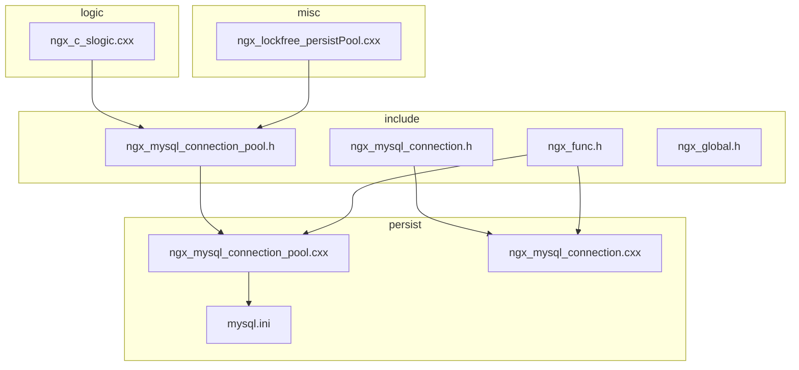
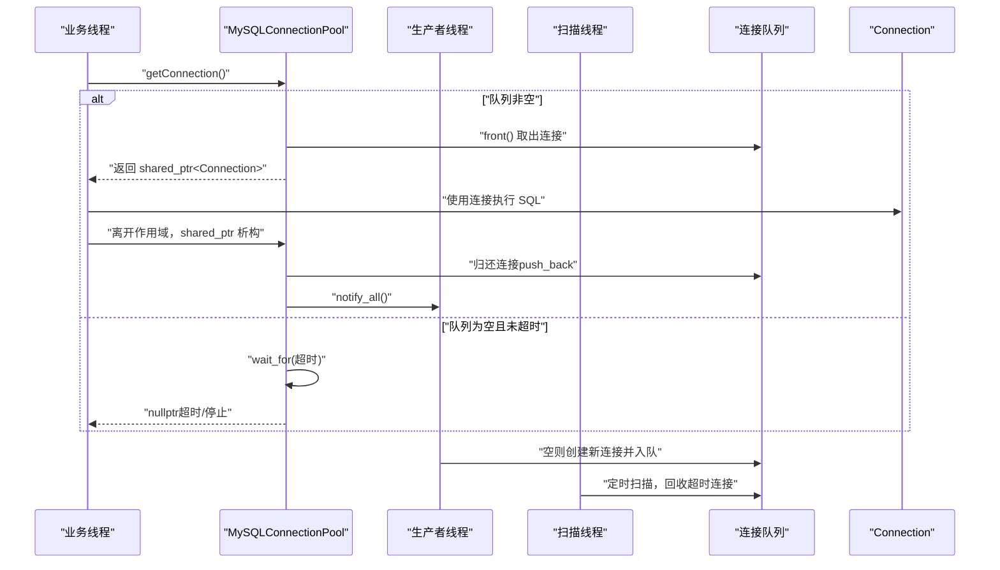
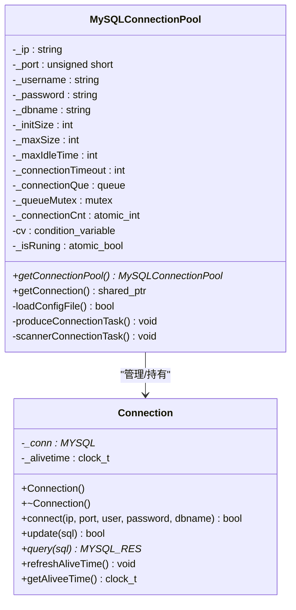
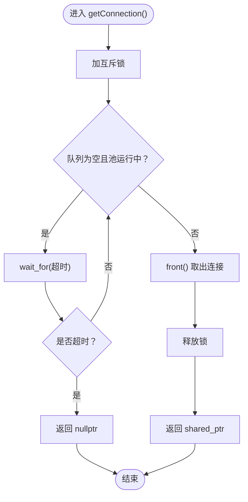
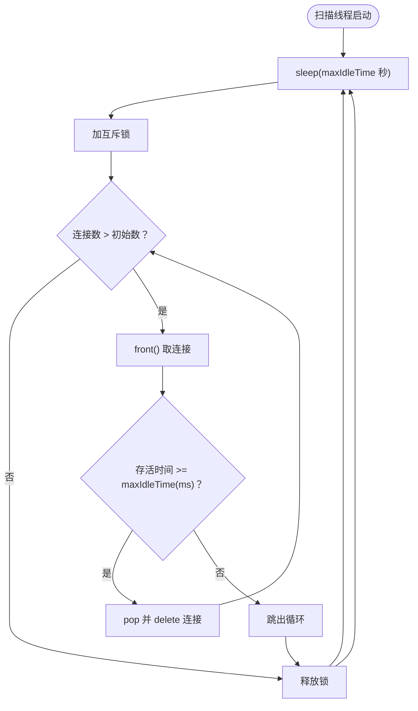
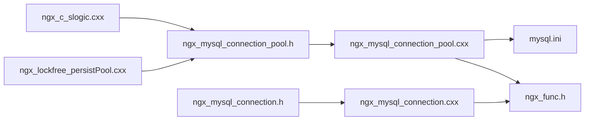

# 连接池管理 API

<cite>
**本文引用的文件列表**
- [include/ngx_mysql_connection_pool.h](file://include/ngx_mysql_connection_pool.h)
- [persist/ngx_mysql_connection_pool.cxx](file://persist/ngx_mysql_connection_pool.cxx)
- [include/ngx_mysql_connection.h](file://include/ngx_mysql_connection.h)
- [persist/ngx_mysql_connection.cxx](file://persist/ngx_mysql_connection.cxx)
- [persist/mysql.ini](file://persist/mysql.ini)
- [logic/ngx_c_slogic.cxx](file://logic/ngx_c_slogic.cxx)
- [misc/ngx_lockfree_persistPool.cxx](file://misc/ngx_lockfree_persistPool.cxx)
- [include/ngx_func.h](file://include/ngx_func.h)
- [include/ngx_global.h](file://include/ngx_global.h)
</cite>

## 目录
1. [简介](#简介)
2. [项目结构](#项目结构)
3. [核心组件](#核心组件)
4. [架构总览](#架构总览)
5. [详细组件分析](#详细组件分析)
6. [依赖关系分析](#依赖关系分析)
7. [性能考量](#性能考量)
8. [故障排查指南](#故障排查指南)
9. [结论](#结论)
10. [附录](#附录)

## 简介
本文件为连接池管理模块的详细 API 参考文档，覆盖以下关键能力：
- 连接池初始化与单例获取
- 连接获取与归还（自动复用）
- 连接回收与清理
- 连接状态管理、超时处理与并发控制
- 连接池配置参数、性能调优与内存管理最佳实践
- 使用示例与常见问题排查

本连接池采用 C++11 标准线程与条件变量实现，支持动态扩容、定时回收空闲连接、超时等待与 RAII 归还。

## 项目结构
连接池相关代码位于 include 与 persist 目录中，配合逻辑层与持久化模块使用。

图表来源
- [include/ngx_mysql_connection_pool.h](file://include/ngx_mysql_connection_pool.h#L1-L55)
- [persist/ngx_mysql_connection_pool.cxx](file://persist/ngx_mysql_connection_pool.cxx#L1-L349)
- [include/ngx_mysql_connection.h](file://include/ngx_mysql_connection.h#L1-L35)
- [persist/ngx_mysql_connection.cxx](file://persist/ngx_mysql_connection.cxx#L1-L56)
- [persist/mysql.ini](file://persist/mysql.ini#L1-L13)
- [logic/ngx_c_slogic.cxx](file://logic/ngx_c_slogic.cxx#L245-L274)
- [misc/ngx_lockfree_persistPool.cxx](file://misc/ngx_lockfree_persistPool.cxx#L52-L146)

章节来源
- [include/ngx_mysql_connection_pool.h](file://include/ngx_mysql_connection_pool.h#L1-L55)
- [persist/ngx_mysql_connection_pool.cxx](file://persist/ngx_mysql_connection_pool.cxx#L1-L349)
- [include/ngx_mysql_connection.h](file://include/ngx_mysql_connection.h#L1-L35)
- [persist/ngx_mysql_connection.cxx](file://persist/ngx_mysql_connection.cxx#L1-L56)
- [persist/mysql.ini](file://persist/mysql.ini#L1-L13)
- [logic/ngx_c_slogic.cxx](file://logic/ngx_c_slogic.cxx#L245-L274)
- [misc/ngx_lockfree_persistPool.cxx](file://misc/ngx_lockfree_persistPool.cxx#L52-L146)

## 核心组件
- MySQLConnectionPool：连接池核心类，提供单例获取、连接获取、生产与回收线程、配置加载等能力。
- Connection：单个数据库连接的封装，提供 connect、update、query、alive 时间刷新与查询等能力。

章节来源
- [include/ngx_mysql_connection_pool.h](file://include/ngx_mysql_connection_pool.h#L14-L55)
- [include/ngx_mysql_connection.h](file://include/ngx_mysql_connection.h#L9-L35)

## 架构总览
连接池采用“生产者-消费者”模型：
- 生产者线程：在队列空或连接数未达上限时创建新连接并入队。
- 消费者线程：从队列取连接；连接使用完毕后自动归还至队尾。
- 定时扫描线程：周期性回收超过最大空闲时间的连接，维持连接池规模。

图表来源
- [persist/ngx_mysql_connection_pool.cxx](file://persist/ngx_mysql_connection_pool.cxx#L172-L203)
- [persist/ngx_mysql_connection_pool.cxx](file://persist/ngx_mysql_connection_pool.cxx#L207-L255)
- [persist/ngx_mysql_connection_pool.cxx](file://persist/ngx_mysql_connection_pool.cxx#L280-L311)

## 详细组件分析

### 类关系图

图表来源
- [include/ngx_mysql_connection_pool.h](file://include/ngx_mysql_connection_pool.h#L14-L55)
- [include/ngx_mysql_connection.h](file://include/ngx_mysql_connection.h#L9-L35)

章节来源
- [include/ngx_mysql_connection_pool.h](file://include/ngx_mysql_connection_pool.h#L14-L55)
- [include/ngx_mysql_connection.h](file://include/ngx_mysql_connection.h#L9-L35)

### API 一览与使用说明

- 单例获取
  - 接口：静态方法获取连接池实例
  - 用途：全局唯一入口，避免重复初始化
  - 示例路径：[获取单例与使用连接池](file://logic/ngx_c_slogic.cxx#L245-L247)

- 获取连接
  - 接口：返回智能指针，自动归还
  - 行为：若队列为空则等待，支持超时；超时或停止状态下返回空指针
  - 示例路径：[查询场景使用连接池](file://logic/ngx_c_slogic.cxx#L245-L274)、[持久化场景使用连接池](file://misc/ngx_lockfree_persistPool.cxx#L52-L146)

- 归还连接
  - 行为：shared_ptr 析构时自动归还；若池停止则销毁连接
  - 关键点：归还时刷新空闲存活时间，便于回收扫描

- 连接回收
  - 触发：定时扫描线程按最大空闲时间回收多余连接
  - 条件：连接存活时间超过阈值且当前连接数大于初始大小
  - 退出清理：析构时清空队列并释放连接

- 连接清理
  - 行为：析构时关闭底层 MySQL 连接
  - 注意：连接池停止或退出时，归还逻辑会触发销毁

章节来源
- [persist/ngx_mysql_connection_pool.cxx](file://persist/ngx_mysql_connection_pool.cxx#L5-L9)
- [persist/ngx_mysql_connection_pool.cxx](file://persist/ngx_mysql_connection_pool.cxx#L207-L255)
- [persist/ngx_mysql_connection_pool.cxx](file://persist/ngx_mysql_connection_pool.cxx#L280-L311)
- [persist/ngx_mysql_connection.cxx](file://persist/ngx_mysql_connection.cxx#L12-L17)

### 关键流程详解

#### 获取连接流程（超时等待）

图表来源
- [persist/ngx_mysql_connection_pool.cxx](file://persist/ngx_mysql_connection_pool.cxx#L207-L255)

章节来源
- [persist/ngx_mysql_connection_pool.cxx](file://persist/ngx_mysql_connection_pool.cxx#L207-L255)

#### 连接回收流程（定时扫描）

图表来源
- [persist/ngx_mysql_connection_pool.cxx](file://persist/ngx_mysql_connection_pool.cxx#L280-L311)

章节来源
- [persist/ngx_mysql_connection_pool.cxx](file://persist/ngx_mysql_connection_pool.cxx#L280-L311)

### 配置参数与含义
- ip：数据库主机地址
- port：数据库端口
- username/password：认证凭据
- dbname：目标数据库名
- initSize：初始连接数
- maxSize：最大连接数
- maxIdleTime：最大空闲时间（秒），用于回收
- connectionTimeOut：获取连接超时时间（毫秒）

章节来源
- [persist/mysql.ini](file://persist/mysql.ini#L1-L13)
- [persist/ngx_mysql_connection_pool.cxx](file://persist/ngx_mysql_connection_pool.cxx#L12-L74)

### 使用示例（路径）
- 查询场景：[获取连接并执行查询](file://logic/ngx_c_slogic.cxx#L245-L274)
- 持久化场景：[事务+连接池](file://misc/ngx_lockfree_persistPool.cxx#L52-L146)

章节来源
- [logic/ngx_c_slogic.cxx](file://logic/ngx_c_slogic.cxx#L245-L274)
- [misc/ngx_lockfree_persistPool.cxx](file://misc/ngx_lockfree_persistPool.cxx#L52-L146)

## 依赖关系分析
- include/ngx_mysql_connection_pool.h 依赖 include/ngx_mysql_connection.h
- persist/ngx_mysql_connection_pool.cxx 依赖 include/ngx_mysql_connection_pool.h 与 include/ngx_func.h
- persist/ngx_mysql_connection.cxx 依赖 include/ngx_mysql_connection.h 与 include/ngx_func.h
- 业务模块（logic、misc）通过 include/ngx_mysql_connection_pool.h 使用连接池

图表来源
- [include/ngx_mysql_connection_pool.h](file://include/ngx_mysql_connection_pool.h#L1-L11)
- [persist/ngx_mysql_connection_pool.cxx](file://persist/ngx_mysql_connection_pool.cxx#L1-L2)
- [include/ngx_mysql_connection.h](file://include/ngx_mysql_connection.h#L1-L10)
- [persist/ngx_mysql_connection.cxx](file://persist/ngx_mysql_connection.cxx#L1-L2)
- [persist/mysql.ini](file://persist/mysql.ini#L1-L13)
- [logic/ngx_c_slogic.cxx](file://logic/ngx_c_slogic.cxx#L245-L247)
- [misc/ngx_lockfree_persistPool.cxx](file://misc/ngx_lockfree_persistPool.cxx#L52-L54)
- [include/ngx_func.h](file://include/ngx_func.h#L1-L28)

章节来源
- [include/ngx_mysql_connection_pool.h](file://include/ngx_mysql_connection_pool.h#L1-L11)
- [persist/ngx_mysql_connection_pool.cxx](file://persist/ngx_mysql_connection_pool.cxx#L1-L2)
- [include/ngx_mysql_connection.h](file://include/ngx_mysql_connection.h#L1-L10)
- [persist/ngx_mysql_connection.cxx](file://persist/ngx_mysql_connection.cxx#L1-L2)
- [persist/mysql.ini](file://persist/mysql.ini#L1-L13)
- [logic/ngx_c_slogic.cxx](file://logic/ngx_c_slogic.cxx#L245-L247)
- [misc/ngx_lockfree_persistPool.cxx](file://misc/ngx_lockfree_persistPool.cxx#L52-L54)
- [include/ngx_func.h](file://include/ngx_func.h#L1-L28)

## 性能考量
- 初始连接数（initSize）：建议根据冷启动阶段并发峰值设置，避免频繁创建连接导致抖动。
- 最大连接数（maxSize）：应结合数据库最大连接限制与业务负载评估，防止过度占用资源。
- 获取超时（connectionTimeOut）：过短可能误判为超时，过长会放大等待时间；建议按业务 SLA 与队列长度综合权衡。
- 最大空闲时间（maxIdleTime）：过短会导致连接频繁重建，过长会占用资源；建议与业务空闲周期匹配。
- 线程模型：生产者与扫描线程分离，减少主线程阻塞；注意在池停止时的优雅退出与资源回收。
- 日志与错误：获取连接失败会记录错误，便于定位超时与配置问题。

[本节为通用指导，不直接分析具体文件]

## 故障排查指南
- 获取连接超时
  - 现象：getConnection() 返回空指针并记录错误日志
  - 可能原因：队列长时间为空、超时时间过短、池已停止
  - 排查要点：检查配置文件、确认池运行状态、评估业务并发与 initSize
  - 参考路径：[超时处理与日志](file://persist/ngx_mysql_connection_pool.cxx#L214-L223)

- 连接池停止导致连接销毁
  - 现象：shared_ptr 析构时直接 delete 连接
  - 说明：池停止时不再复用，而是销毁以释放资源
  - 参考路径：[停止时的归还行为](file://persist/ngx_mysql_connection_pool.cxx#L242-L251)

- 配置文件缺失或格式错误
  - 现象：无法加载配置，连接池初始化失败
  - 排查要点：确认 mysql.ini 文件存在且键值正确
  - 参考路径：[配置加载](file://persist/ngx_mysql_connection_pool.cxx#L12-L74)、[配置样例](file://persist/mysql.ini#L1-L13)

- 数据库连接失败
  - 现象：底层连接失败，返回空结果
  - 排查要点：核对 ip/port/用户名/密码/dbname，确认数据库可达
  - 参考路径：[连接与查询](file://persist/ngx_mysql_connection.cxx#L19-L55)

章节来源
- [persist/ngx_mysql_connection_pool.cxx](file://persist/ngx_mysql_connection_pool.cxx#L214-L223)
- [persist/ngx_mysql_connection_pool.cxx](file://persist/ngx_mysql_connection_pool.cxx#L242-L251)
- [persist/ngx_mysql_connection_pool.cxx](file://persist/ngx_mysql_connection_pool.cxx#L12-L74)
- [persist/mysql.ini](file://persist/mysql.ini#L1-L13)
- [persist/ngx_mysql_connection.cxx](file://persist/ngx_mysql_connection.cxx#L19-L55)

## 结论
该连接池模块提供了简洁可靠的数据库连接管理能力：通过单例获取、智能指针归还、条件变量等待与定时回收，实现了高并发下的稳定与高效。合理配置参数并遵循最佳实践，可在保证性能的同时降低资源占用与风险。

[本节为总结性内容，不直接分析具体文件]

## 附录

### API 速查表
- 单例获取
  - 名称：getConnectionPool()
  - 返回：连接池实例指针
  - 位置：[接口声明](file://include/ngx_mysql_connection_pool.h#L18-L19)

- 获取连接
  - 名称：getConnection()
  - 返回：shared_ptr<Connection>
  - 位置：[接口声明](file://include/ngx_mysql_connection_pool.h#L21-L22)、[实现](file://persist/ngx_mysql_connection_pool.cxx#L207-L255)

- 连接回收
  - 名称：scannerConnectionTask()
  - 触发：定时扫描
  - 位置：[实现](file://persist/ngx_mysql_connection_pool.cxx#L280-L311)

- 连接清理
  - 名称：Connection 析构
  - 行为：关闭底层连接
  - 位置：[实现](file://persist/ngx_mysql_connection.cxx#L12-L17)

### 配置项对照表
- 键名：ip、port、username、password、dbname、initSize、maxSize、maxIdleTime、connectionTimeOut
- 类型：字符串/整数
- 默认值：参考配置文件
- 位置：[配置样例](file://persist/mysql.ini#L1-L13)

章节来源
- [include/ngx_mysql_connection_pool.h](file://include/ngx_mysql_connection_pool.h#L18-L22)
- [persist/ngx_mysql_connection_pool.cxx](file://persist/ngx_mysql_connection_pool.cxx#L207-L255)
- [persist/ngx_mysql_connection_pool.cxx](file://persist/ngx_mysql_connection_pool.cxx#L280-L311)
- [persist/ngx_mysql_connection.cxx](file://persist/ngx_mysql_connection.cxx#L12-L17)
- [persist/mysql.ini](file://persist/mysql.ini#L1-L13)