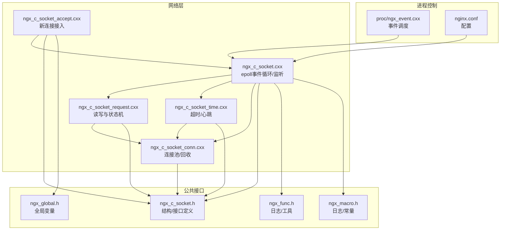
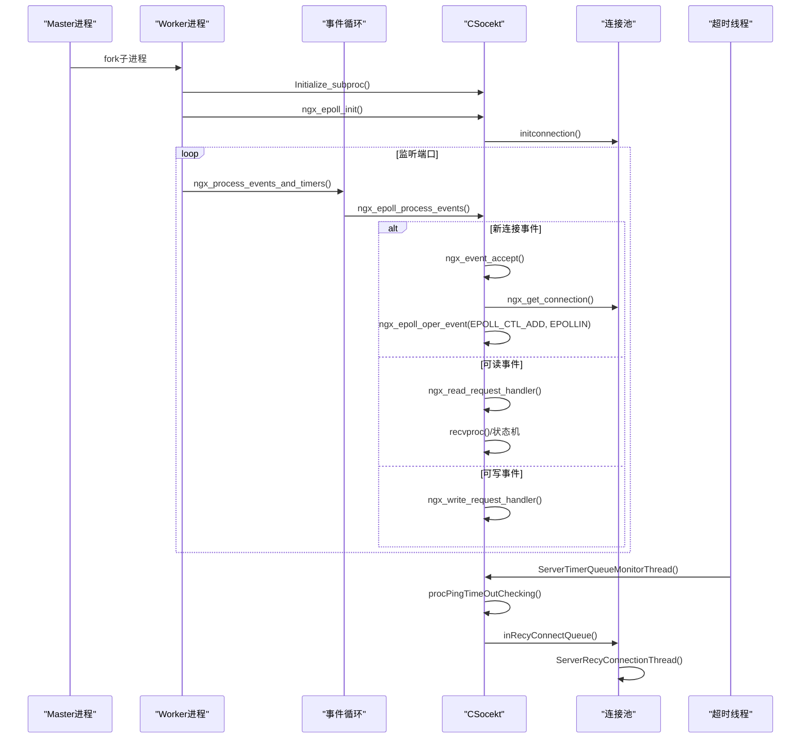
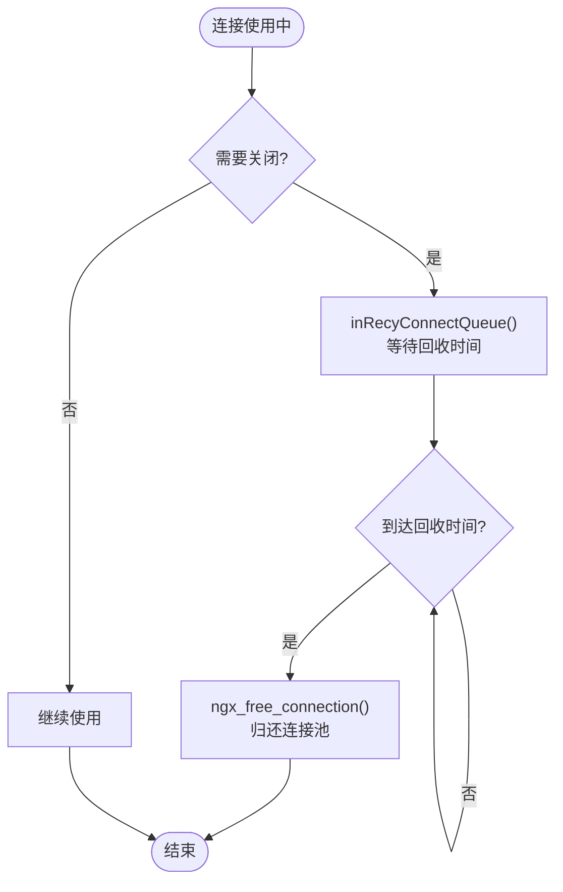
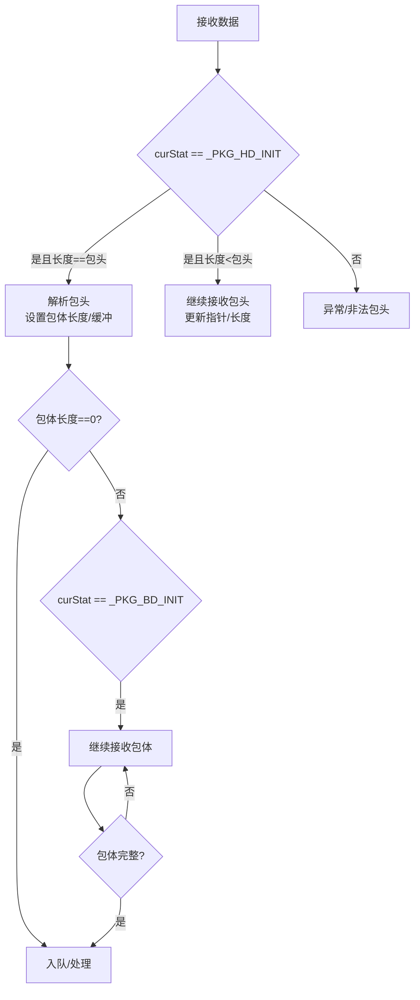
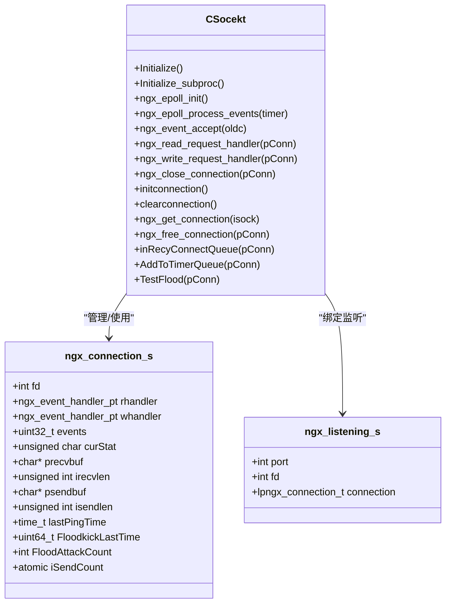
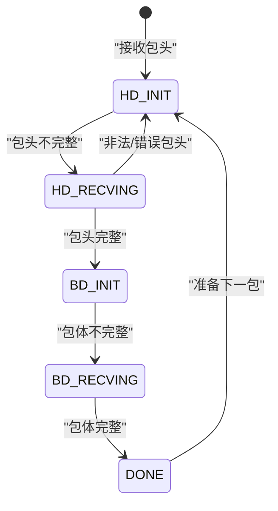

# 连接生命周期 API

<cite>
**本文引用的文件**
- [ngx_c_socket_accept.cxx](file://net/ngx_c_socket_accept.cxx)
- [ngx_c_socket_conn.cxx](file://net/ngx_c_socket_conn.cxx)
- [ngx_c_socket.cxx](file://net/ngx_c_socket.cxx)
- [ngx_c_socket_request.cxx](file://net/ngx_c_socket_request.cxx)
- [ngx_c_socket_time.cxx](file://net/ngx_c_socket_time.cxx)
- [ngx_c_socket.h](file://include/ngx_c_socket.h)
- [ngx_func.h](file://include/ngx_func.h)
- [ngx_global.h](file://include/ngx_global.h)
- [ngx_macro.h](file://include/ngx_macro.h)
- [ngx_event.cxx](file://proc/ngx_event.cxx)
- [nginx.conf](file://nginx.conf)
</cite>

## 目录
1. [简介](#简介)
2. [项目结构](#项目结构)
3. [核心组件](#核心组件)
4. [架构总览](#架构总览)
5. [详细组件分析](#详细组件分析)
6. [依赖关系分析](#依赖关系分析)
7. [性能考量](#性能考量)
8. [故障排查指南](#故障排查指南)
9. [结论](#结论)
10. [附录](#附录)

## 简介
本文件面向连接生命周期管理模块，提供新连接建立函数 ngx_event_accept()、连接关闭函数 ngx_close_connection() 的使用方法与 API 说明，涵盖连接状态管理、连接回收、连接清理的完整流程，以及连接超时检测、心跳包处理、网络安全防护的实现细节。文档还阐述连接池与连接生命周期的关系、连接状态转换图、异常处理机制，并给出连接泄漏预防与性能监控的最佳实践与示例路径。

## 项目结构
本项目采用模块化组织，网络层主要由以下文件组成：
- 接收新连接与事件循环：net/ngx_c_socket_accept.cxx、net/ngx_c_socket.cxx、proc/ngx_event.cxx
- 连接池与连接对象：include/ngx_c_socket.h、net/ngx_c_socket_conn.cxx
- 数据读写与状态机：net/ngx_c_socket_request.cxx
- 超时与心跳：net/ngx_c_socket_time.cxx
- 全局与宏定义：include/ngx_global.h、include/ngx_macro.h、include/ngx_func.h
- 配置：nginx.conf

图表来源
- [ngx_c_socket_accept.cxx](file://net/ngx_c_socket_accept.cxx#L21-L180)
- [ngx_c_socket.cxx](file://net/ngx_c_socket.cxx#L541-L587)
- [ngx_c_socket_request.cxx](file://net/ngx_c_socket_request.cxx#L24-L114)
- [ngx_c_socket_time.cxx](file://net/ngx_c_socket_time.cxx#L23-L39)
- [ngx_c_socket_conn.cxx](file://net/ngx_c_socket_conn.cxx#L76-L138)
- [ngx_c_socket.h](file://include/ngx_c_socket.h#L102-L255)
- [ngx_func.h](file://include/ngx_func.h#L1-L28)
- [ngx_global.h](file://include/ngx_global.h#L1-L47)
- [ngx_macro.h](file://include/ngx_macro.h#L1-L40)
- [proc/ngx_event.cxx](file://proc/ngx_event.cxx#L13-L22)
- [nginx.conf](file://nginx.conf#L40-L62)

章节来源
- [ngx_c_socket.h](file://include/ngx_c_socket.h#L102-L255)
- [ngx_c_socket.cxx](file://net/ngx_c_socket.cxx#L541-L587)
- [proc/ngx_event.cxx](file://proc/ngx_event.cxx#L13-L22)

## 核心组件
- 连接对象 ngx_connection_s：封装 socket、读写处理器、epoll 事件、收发缓冲、状态机、心跳与安全计数等。
- 监听对象 ngx_listening_s：封装监听端口与监听 socket。
- CSocekt 类：提供 epoll 初始化、事件循环、新连接接入、读写处理、连接池管理、超时与心跳、网络安全检测、线程管理等。
- 连接池：固定容量初始化，空闲列表与总列表分离，延迟回收队列配合独立回收线程。
- 事件循环：ngx_process_events_and_timers -> ngx_epoll_process_events -> 事件回调（读/写/新连接）。

章节来源
- [ngx_c_socket.h](file://include/ngx_c_socket.h#L37-L91)
- [ngx_c_socket.cxx](file://net/ngx_c_socket.cxx#L541-L587)
- [ngx_c_socket_conn.cxx](file://net/ngx_c_socket_conn.cxx#L76-L138)

## 架构总览
连接生命周期贯穿“监听 -> 接入 -> 加入 epoll -> 读写处理 -> 超时/心跳 -> 回收”的闭环。事件循环负责调度，连接池负责对象复用，超时线程负责心跳检测，回收线程负责延迟回收。

图表来源
- [proc/ngx_event.cxx](file://proc/ngx_event.cxx#L13-L22)
- [ngx_c_socket.cxx](file://net/ngx_c_socket.cxx#L541-L587)
- [ngx_c_socket_accept.cxx](file://net/ngx_c_socket_accept.cxx#L21-L180)
- [ngx_c_socket_request.cxx](file://net/ngx_c_socket_request.cxx#L24-L114)
- [ngx_c_socket_time.cxx](file://net/ngx_c_socket_time.cxx#L148-L193)
- [ngx_c_socket_conn.cxx](file://net/ngx_c_socket_conn.cxx#L161-L278)

## 详细组件分析

### 新连接建立：ngx_event_accept()
- 触发时机：监听 socket 上的 EPOLLIN 事件，由事件循环回调触发。
- 关键步骤：
  - 使用 accept4 或 fallback accept 获取新连接 fd。
  - 检查连接数阈值与连接池规模，必要时拒绝新连接以保护系统。
  - 从连接池获取连接对象，设置地址、读写处理器、加入 epoll 监听可读事件。
  - 若启用心跳，将连接加入时间队列。
  - 原子计数 m_onlineUserCount 增加。
- 错误处理：对 EAGAIN、ECONNABORTED、EMFILE/ENFILE 等错误分别处理；失败时关闭 fd 并回收连接对象。

章节来源
- [ngx_c_socket_accept.cxx](file://net/ngx_c_socket_accept.cxx#L21-L180)
- [ngx_c_socket.cxx](file://net/ngx_c_socket.cxx#L541-L587)

### 连接关闭：ngx_close_connection()
- 行为：将连接对象归还到连接池，若 fd 有效则关闭 fd。
- 与延迟回收的关系：通常通过 zdClosesocketProc 触发 inRecyConnectQueue，交由回收线程延迟回收，避免立即释放导致竞态。

章节来源
- [ngx_c_socket_conn.cxx](file://net/ngx_c_socket_conn.cxx#L280-L289)
- [ngx_c_socket.cxx](file://net/ngx_c_socket.cxx#L458-L477)

### 连接池与连接生命周期
- 初始化：固定容量创建连接对象，加入 m_connectionList 与 m_freeconnectionList。
- 获取：优先从空闲列表取，否则动态创建并加入总表。
- 归还：PutOneToFree 清理收发缓冲，ngx_free_connection 放回空闲列表。
- 延迟回收：inRecyConnectQueue 将连接放入待回收队列，ServerRecyConnectionThread 定期检查等待时间后真正释放。
- 线程安全：连接池与回收队列均使用互斥量保护。

图表来源
- [ngx_c_socket_conn.cxx](file://net/ngx_c_socket_conn.cxx#L161-L278)

章节来源
- [ngx_c_socket_conn.cxx](file://net/ngx_c_socket_conn.cxx#L76-L138)
- [ngx_c_socket_conn.cxx](file://net/ngx_c_socket_conn.cxx#L161-L278)

### 连接状态管理与状态机
- 状态字段：curStat 表示当前收包状态，支持包头初始化、包头接收中、包体初始化、包体接收中。
- 处理流程：
  - 读取数据 -> 根据状态推进 -> 包头完整则解析长度 -> 分配内存接收包体 -> 包体完整后入消息队列或按策略处理。
- 读写处理：
  - 读：recvproc 统一处理 EAGAIN/EINTR 等，异常路径统一走关闭流程。
  - 写：sendproc 循环发送，缓冲区满返回 -1，由 epoll 可写事件继续；发送完毕后移除 EPOLLOUT 事件并释放内存。

图表来源
- [ngx_c_socket_request.cxx](file://net/ngx_c_socket_request.cxx#L24-L114)
- [ngx_c_socket_request.cxx](file://net/ngx_c_socket_request.cxx#L159-L211)

章节来源
- [ngx_c_socket_request.cxx](file://net/ngx_c_socket_request.cxx#L24-L114)
- [ngx_c_socket_request.cxx](file://net/ngx_c_socket_request.cxx#L159-L211)

### 连接超时检测与心跳包处理
- 启用方式：配置 Sock_WaitTimeEnable/Sock_MaxWaitTime/Sock_TimeOutKick 控制。
- 时间队列：AddToTimerQueue 将连接加入 multimap，按到期时间排序；ServerTimerQueueMonitorThread 定期扫描到期项。
- 处理逻辑：GetOverTimeTimer 提取到期项，若未启用“超时即踢”，则重排下次到期时间；否则触发业务回调（子类可覆写）。
- 心跳更新：连接对象 lastPingTime 记录最近心跳时间，用于业务侧判定。

章节来源
- [ngx_c_socket_time.cxx](file://net/ngx_c_socket_time.cxx#L23-L101)
- [ngx_c_socket_time.cxx](file://net/ngx_c_socket_time.cxx#L148-L193)
- [ngx_c_socket.h](file://include/ngx_c_socket.h#L80-L81)
- [nginx.conf](file://nginx.conf#L45-L50)

### 网络安全防护
- Flood 攻击检测：TestFlood 基于时间间隔与计数阈值判断，触发则关闭连接。
- 发送队列保护：msgSend 对发送队列过大与单用户积压进行保护，必要时丢弃并关闭连接。
- 连接数限制：ngx_event_accept 在连接池规模异常时拒绝新连接，防止资源耗尽。

章节来源
- [ngx_c_socket.cxx](file://net/ngx_c_socket.cxx#L414-L456)
- [ngx_c_socket.cxx](file://net/ngx_c_socket.cxx#L479-L509)
- [ngx_c_socket_accept.cxx](file://net/ngx_c_socket_accept.cxx#L104-L122)
- [nginx.conf](file://nginx.conf#L52-L61)

### 事件循环与调度
- ngx_process_events_and_timers：调用 epoll 事件循环并打印统计信息。
- ngx_epoll_process_events：遍历事件，根据连接对象回调读/写/新连接处理函数。
- epoll 操作：ngx_epoll_oper_event 支持 ADD/MOD，事件标志与连接对象 events 字段同步。

章节来源
- [proc/ngx_event.cxx](file://proc/ngx_event.cxx#L13-L22)
- [ngx_c_socket.cxx](file://net/ngx_c_socket.cxx#L757-L800)
- [ngx_c_socket.cxx](file://net/ngx_c_socket.cxx#L677-L735)

## 依赖关系分析

图表来源
- [ngx_c_socket.h](file://include/ngx_c_socket.h#L102-L255)

章节来源
- [ngx_c_socket.h](file://include/ngx_c_socket.h#L102-L255)

## 性能考量
- 非阻塞 I/O：监听与连接 socket 均设置为非阻塞，结合 epoll LT/ET 模式提升吞吐。
- 连接池：固定容量初始化，避免频繁分配；延迟回收降低频繁创建销毁带来的抖动。
- 发送队列保护：对单用户积压与整体队列过大进行保护，防止拥塞放大。
- 线程分工：发送线程、回收线程、超时监控线程各司其职，减少主线程压力。
- 配置调优：worker_connections、Sock_RecyConnectionWaitTime、Sock_MaxWaitTime 等影响性能与稳定性。

章节来源
- [ngx_c_socket.cxx](file://net/ngx_c_socket.cxx#L541-L587)
- [ngx_c_socket.cxx](file://net/ngx_c_socket.cxx#L414-L456)
- [nginx.conf](file://nginx.conf#L40-L62)

## 故障排查指南
- epoll_wait 返回错误：常见 EINTR（信号打断），记录日志后继续；其他错误需关注。
- accept 失败：EAGAIN 表示无连接可取；EMFILE/ENFILE 表示 fd 用尽，需调整系统限制。
- 接收异常：recvproc 对 EAGAIN/EINTR 不视为错误，其他错误统一关闭连接。
- 发送异常：sendproc 对 EAGAIN 表示缓冲区满，等待可写事件；其他错误记录日志。
- 心跳超时：检查 Sock_WaitTimeEnable/Sock_MaxWaitTime 配置，确认超时线程运行。
- Flood 攻击：开启 Sock_FloodAttackKickEnable，调整 Sock_FloodTimeInterval 与 Sock_FloodKickCounter。

章节来源
- [ngx_c_socket.cxx](file://net/ngx_c_socket.cxx#L757-L790)
- [ngx_c_socket_accept.cxx](file://net/ngx_c_socket_accept.cxx#L61-L101)
- [ngx_c_socket_request.cxx](file://net/ngx_c_socket_request.cxx#L116-L154)
- [ngx_c_socket.cxx](file://net/ngx_c_socket.cxx#L227-L244)
- [nginx.conf](file://nginx.conf#L45-L61)

## 结论
本模块通过连接池、事件循环、延迟回收与超时/心跳机制，构建了稳定的连接生命周期管理体系。新连接接入、读写处理、安全防护与资源回收均有清晰的 API 与流程约束。建议在生产环境中结合配置参数与监控指标，持续优化连接池容量与回收策略，确保高并发下的稳定性与性能。

## 附录

### API 参考清单
- 新连接接入
  - 函数：ngx_event_accept(lpngx_connection_t oldc)
  - 作用：处理监听 socket 上的新连接，获取连接对象、设置事件、加入 epoll。
  - 示例路径：[ngx_c_socket_accept.cxx](file://net/ngx_c_socket_accept.cxx#L21-L180)
- 连接关闭
  - 函数：ngx_close_connection(lpngx_connection_t pConn)
  - 作用：关闭 fd 并归还连接对象至连接池。
  - 示例路径：[ngx_c_socket_conn.cxx](file://net/ngx_c_socket_conn.cxx#L280-L289)
- 连接池管理
  - 初始化：initconnection()
  - 获取：ngx_get_connection(int isock)
  - 归还：ngx_free_connection(lpngx_connection_t pConn)
  - 延迟回收：inRecyConnectQueue(lpngx_connection_t pConn)
  - 示例路径：[ngx_c_socket_conn.cxx](file://net/ngx_c_socket_conn.cxx#L76-L138), [ngx_c_socket_conn.cxx](file://net/ngx_c_socket_conn.cxx#L161-L278)
- 事件循环
  - 函数：ngx_process_events_and_timers(), ngx_epoll_process_events(int timer)
  - 作用：事件等待与回调分发。
  - 示例路径：[proc/ngx_event.cxx](file://proc/ngx_event.cxx#L13-L22), [ngx_c_socket.cxx](file://net/ngx_c_socket.cxx#L757-L800)
- 读写处理
  - 函数：ngx_read_request_handler(lpngx_connection_t pConn), ngx_write_request_handler(lpngx_connection_t pConn)
  - 作用：读取数据推进状态机，发送数据处理缓冲区满与完成事件。
  - 示例路径：[ngx_c_socket_request.cxx](file://net/ngx_c_socket_request.cxx#L24-L114), [ngx_c_socket_request.cxx](file://net/ngx_c_socket_request.cxx#L280-L332)
- 超时与心跳
  - 函数：AddToTimerQueue(lpngx_connection_t pConn), ServerTimerQueueMonitorThread(void*)
  - 作用：按配置周期检查心跳超时并触发业务回调。
  - 示例路径：[ngx_c_socket_time.cxx](file://net/ngx_c_socket_time.cxx#L23-L101), [ngx_c_socket_time.cxx](file://net/ngx_c_socket_time.cxx#L148-L193)
- 网络安全
  - 函数：TestFlood(lpngx_connection_t pConn), msgSend(char*)
  - 作用：Flood 攻击检测与发送队列保护。
  - 示例路径：[ngx_c_socket.cxx](file://net/ngx_c_socket.cxx#L479-L509), [ngx_c_socket.cxx](file://net/ngx_c_socket.cxx#L414-L456)

### 连接状态转换图（代码级）

图表来源
- [ngx_c_socket_request.cxx](file://net/ngx_c_socket_request.cxx#L36-L104)

### 最佳实践与示例路径
- 正确管理连接生命周期
  - 接入：使用 ngx_event_accept() 完成接入与 epoll 注册。
  - 读写：使用 ngx_read_request_handler()/ngx_write_request_handler()。
  - 关闭：统一使用 ngx_close_connection() 或 zdClosesocketProc()。
  - 示例路径：[ngx_c_socket_accept.cxx](file://net/ngx_c_socket_accept.cxx#L21-L180), [ngx_c_socket_request.cxx](file://net/ngx_c_socket_request.cxx#L24-L114), [ngx_c_socket_conn.cxx](file://net/ngx_c_socket_conn.cxx#L280-L289)
- 连接泄漏预防
  - 确保每次获取连接后必有归还或关闭路径。
  - 使用延迟回收线程，避免立即释放导致竞态。
  - 示例路径：[ngx_c_socket_conn.cxx](file://net/ngx_c_socket_conn.cxx#L161-L278)
- 性能监控
  - 定期打印统计信息，关注在线用户数、连接池空闲数、待回收连接数、发送队列长度。
  - 示例路径：[ngx_c_socket.cxx](file://net/ngx_c_socket.cxx#L511-L537)
- 配置建议
  - worker_connections：根据并发量设置。
  - Sock_RecyConnectionWaitTime：避免立即回收导致抖动。
  - Sock_WaitTimeEnable/Sock_MaxWaitTime：启用心跳超时保护。
  - Sock_FloodAttackKickEnable：开启 Flood 攻击检测。
  - 示例路径：[nginx.conf](file://nginx.conf#L40-L62)