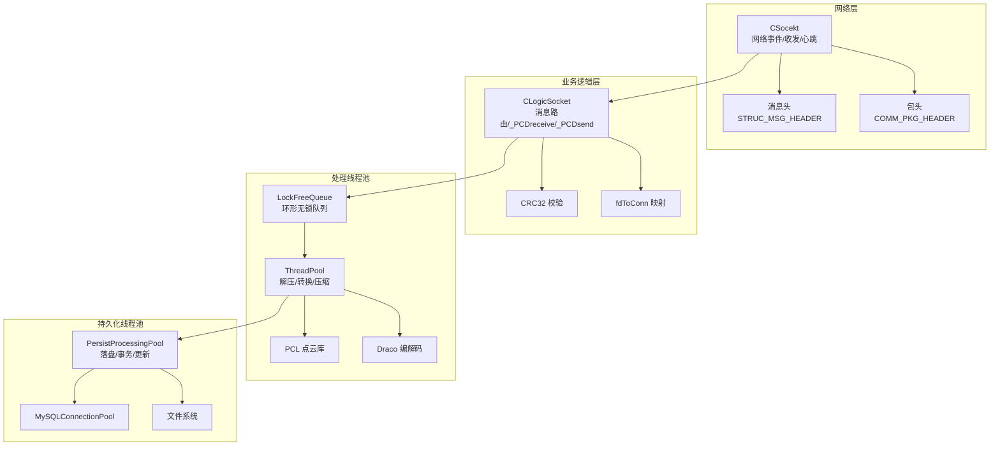
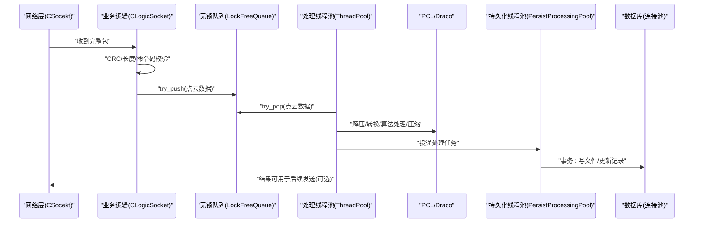
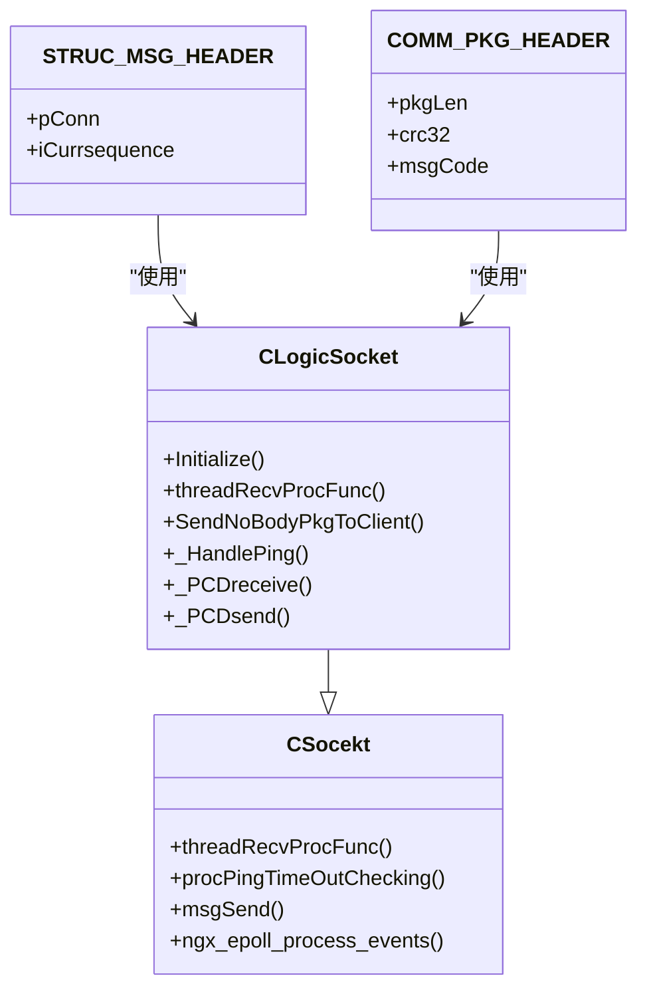
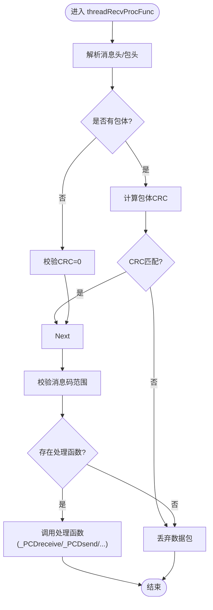
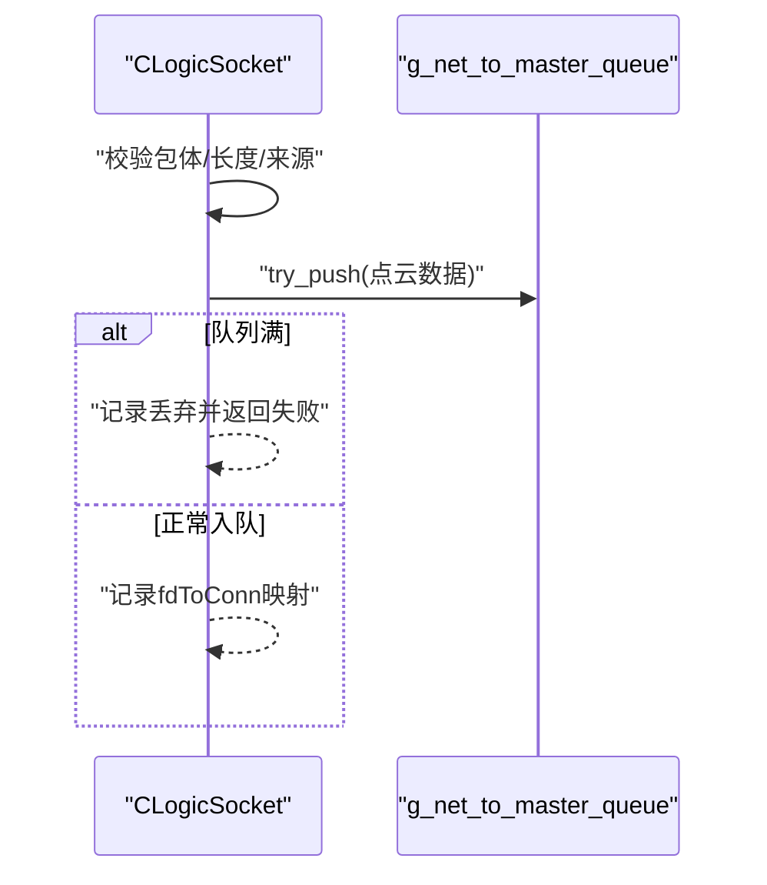
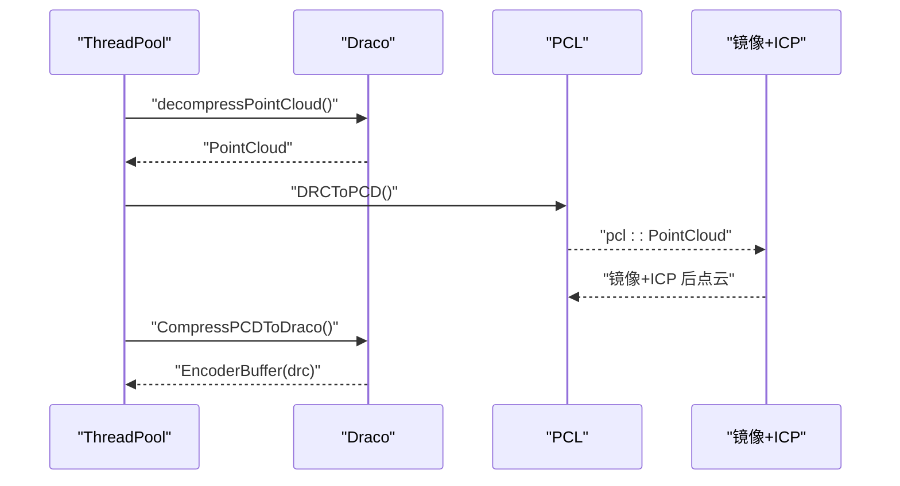
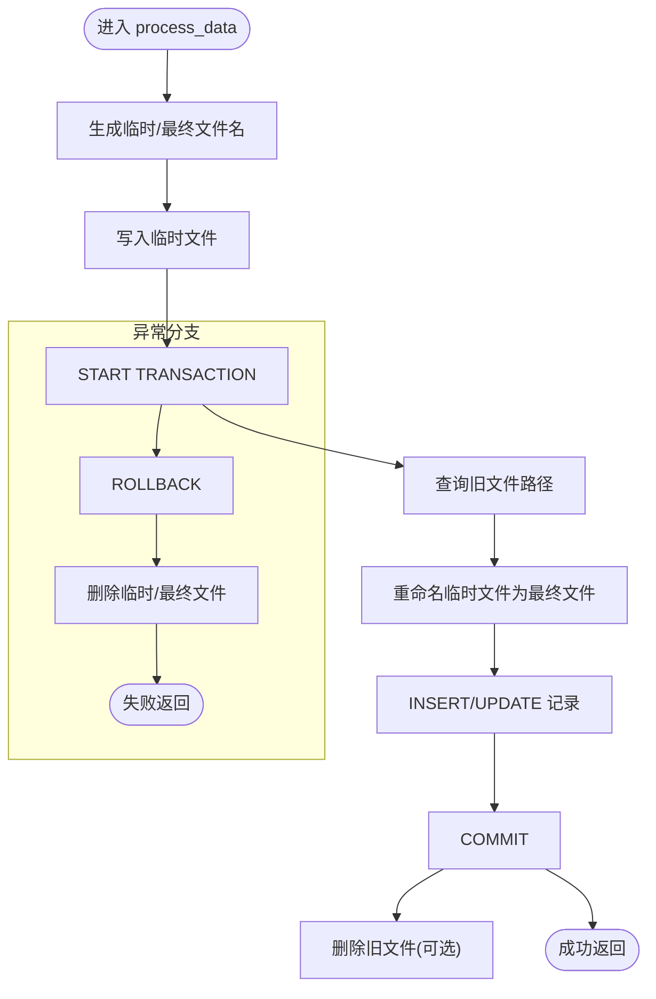
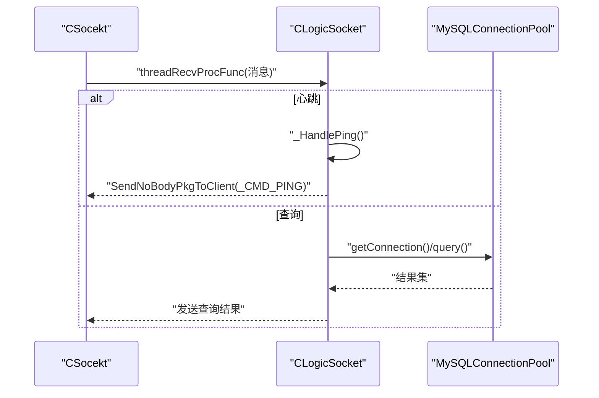
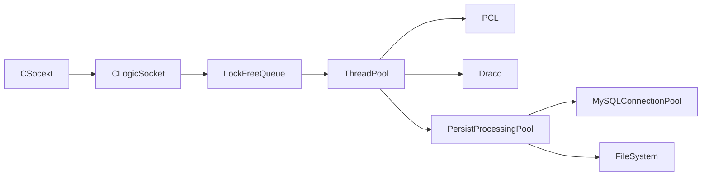

# 业务逻辑模块

<cite>
**本文引用的文件**
- [ngx_c_slogic.h](file://include/ngx_c_slogic.h)
- [ngx_c_slogic.cxx](file://logic/ngx_c_slogic.cxx)
- [ngx_c_socket.h](file://include/ngx_c_socket.h)
- [ngx_comm.h](file://include/ngx_comm.h)
- [ngx_logiccomm.h](file://include/ngx_logiccomm.h)
- [ngx_global.h](file://include/ngx_global.h)
- [ngx_lockFreeQueue.h](file://include/ngx_lockFreeQueue.h)
- [ngx_c_threadpool.h](file://include/ngx_c_threadpool.h)
- [ngx_lockfree_threadPool.cxx](file://misc/ngx_lockfree_threadPool.cxx)
- [ngx_lockfree_mirrorICP_threadPool.cxx](file://misc/ngx_lockfree_mirrorICP_threadPool.cxx)
- [ngx_lockfree_persistPool.cxx](file://misc/ngx_lockfree_persistPool.cxx)
- [ngx_mysql_connection_pool.h](file://include/ngx_mysql_connection_pool.h)
- [mysql.ini](file://persist/mysql.ini)
- [ngx_hostByte_to_netByte.h](file://include/ngx_hostByte_to_netByte.h)
- [ngx_c_conf.h](file://include/ngx_c_conf.h)
</cite>

## 目录
1. [简介](#简介)
2. [项目结构](#项目结构)
3. [核心组件](#核心组件)
4. [架构总览](#架构总览)
5. [详细组件分析](#详细组件分析)
6. [依赖关系分析](#依赖关系分析)
7. [性能考量](#性能考量)
8. [故障排查指南](#故障排查指南)
9. [结论](#结论)
10. [附录](#附录)

## 简介
本文件面向业务逻辑模块，系统性阐述点云数据处理的协议实现、数据验证机制、与 PCL/Draco 的集成方式，以及完整的数据接收、处理与输出流程。文档覆盖数据格式转换、算法调用序列、结果存储机制、与网络模块和数据持久化模块的接口设计、配置参数、性能优化技巧与调试方法，并给出错误处理与异常策略。

## 项目结构
业务逻辑模块主要由以下层次组成：
- 网络与协议层：负责收包、解包、CRC 校验、心跳检测、消息路由。
- 业务逻辑层：解析点云包体、校验长度与来源、入队供后续处理。
- 处理线程池层：异步解压 Draco、转换为 PCL 点云、执行镜像+ICP 等算法。
- 持久化线程池层：落盘点云文件、事务更新数据库、清理旧文件。
- 数据库连接池：提供线程安全的数据库连接获取与回收。
- 共享队列：无锁环形队列，支撑跨线程数据流转。

图表来源
- [ngx_c_socket.h](file://include/ngx_c_socket.h#L103-L255)
- [ngx_c_slogic.cxx](file://logic/ngx_c_slogic.cxx#L77-L129)
- [ngx_lockFreeQueue.h](file://include/ngx_lockFreeQueue.h#L4-L150)
- [ngx_lockfree_threadPool.cxx](file://misc/ngx_lockfree_threadPool.cxx#L3-L78)
- [ngx_lockfree_persistPool.cxx](file://misc/ngx_lockfree_persistPool.cxx#L12-L158)
- [ngx_mysql_connection_pool.h](file://include/ngx_mysql_connection_pool.h#L14-L55)

章节来源
- [ngx_c_socket.h](file://include/ngx_c_socket.h#L103-L255)
- [ngx_c_slogic.cxx](file://logic/ngx_c_slogic.cxx#L77-L129)
- [ngx_lockFreeQueue.h](file://include/ngx_lockFreeQueue.h#L4-L150)
- [ngx_lockfree_threadPool.cxx](file://misc/ngx_lockfree_threadPool.cxx#L3-L78)
- [ngx_lockfree_persistPool.cxx](file://misc/ngx_lockfree_persistPool.cxx#L12-L158)
- [ngx_mysql_connection_pool.h](file://include/ngx_mysql_connection_pool.h#L14-L55)

## 核心组件
- CLogicSocket：业务逻辑入口，负责消息路由、心跳处理、点云接收与查询响应。
- CSocekt：网络事件与收发基类，提供 epoll、连接池、发送队列、心跳监控等能力。
- LockFreeQueue：高性能无锁环形队列，支撑跨线程数据流转。
- ThreadPool：通用线程池封装，配合具体算法任务（解压、转换、压缩）。
- PersistProcessingPool：持久化处理线程池，负责落盘、事务与数据库更新。
- MySQLConnectionPool：数据库连接池，提供线程安全的连接获取与回收。
- 协议与结构：消息头、包头、命令码、点云结构体等。

章节来源
- [ngx_c_slogic.h](file://include/ngx_c_slogic.h#L13-L37)
- [ngx_c_slogic.cxx](file://logic/ngx_c_slogic.cxx#L40-L51)
- [ngx_c_socket.h](file://include/ngx_c_socket.h#L103-L255)
- [ngx_lockFreeQueue.h](file://include/ngx_lockFreeQueue.h#L4-L150)
- [ngx_c_threadpool.h](file://include/ngx_c_threadpool.h#L9-L66)
- [ngx_lockfree_threadPool.cxx](file://misc/ngx_lockfree_threadPool.cxx#L3-L78)
- [ngx_lockfree_persistPool.cxx](file://misc/ngx_lockfree_persistPool.cxx#L12-L158)
- [ngx_mysql_connection_pool.h](file://include/ngx_mysql_connection_pool.h#L14-L55)

## 架构总览
业务逻辑模块采用“网络事件驱动 + 无锁队列 + 多线程处理 + 数据库事务”的架构：
- 网络层接收完整包后，交由业务逻辑层进行协议解析与校验。
- 通过无锁队列将点云原始数据投递到处理线程池。
- 处理线程池完成解压、转换、算法处理（镜像+ICP）、再压缩。
- 持久化线程池负责落盘、事务更新数据库、清理旧文件。
- 与网络层的心跳与超时检测协同，保障连接健康。

图表来源
- [ngx_c_slogic.cxx](file://logic/ngx_c_slogic.cxx#L190-L243)
- [ngx_lockFreeQueue.h](file://include/ngx_lockFreeQueue.h#L50-L127)
- [ngx_lockfree_threadPool.cxx](file://misc/ngx_lockfree_threadPool.cxx#L3-L78)
- [ngx_lockfree_persistPool.cxx](file://misc/ngx_lockfree_persistPool.cxx#L17-L31)

章节来源
- [ngx_c_slogic.cxx](file://logic/ngx_c_slogic.cxx#L190-L243)
- [ngx_lockFreeQueue.h](file://include/ngx_lockFreeQueue.h#L50-L127)
- [ngx_lockfree_threadPool.cxx](file://misc/ngx_lockfree_threadPool.cxx#L3-L78)
- [ngx_lockfree_persistPool.cxx](file://misc/ngx_lockfree_persistPool.cxx#L17-L31)

## 详细组件分析

### 协议与数据结构
- 消息头与包头：消息头携带连接指针与序列号，包头包含长度、CRC32、消息码。
- 命令码：心跳、点云接收、点云查询等命令码定义。
- 点云结构体：包含数据长度、序列化数据缓冲、ID/name/age/gender 等元信息。

图表来源
- [ngx_c_socket.h](file://include/ngx_c_socket.h#L94-L100)
- [ngx_comm.h](file://include/ngx_comm.h#L19-L25)
- [ngx_c_slogic.h](file://include/ngx_c_slogic.h#L13-L37)

章节来源
- [ngx_comm.h](file://include/ngx_comm.h#L19-L25)
- [ngx_logiccomm.h](file://include/ngx_logiccomm.h#L16-L24)
- [ngx_c_slogic.h](file://include/ngx_c_slogic.h#L13-L37)
- [ngx_c_socket.h](file://include/ngx_c_socket.h#L94-L100)

### 数据接收与验证流程
- 接收完整包后，解析包头，校验 CRC32 与包体长度。
- 校验消息码是否在有效范围内且存在处理函数。
- 校验连接序列号，避免过期或断开连接的数据包。
- 将点云数据映射到结构体，进行长度与来源校验，写入无锁队列。

图表来源
- [ngx_c_slogic.cxx](file://logic/ngx_c_slogic.cxx#L77-L129)

章节来源
- [ngx_c_slogic.cxx](file://logic/ngx_c_slogic.cxx#L77-L129)

### 点云接收与入队
- 解析包体为点云结构体，处理网络序字段为主机序。
- 校验数据长度不超过缓冲上限，避免溢出。
- 将点云数据入队，记录 fd 到连接的映射，便于后续发送或追踪。

图表来源
- [ngx_c_slogic.cxx](file://logic/ngx_c_slogic.cxx#L190-L243)
- [ngx_global.h](file://include/ngx_global.h#L44-L44)

章节来源
- [ngx_c_slogic.cxx](file://logic/ngx_c_slogic.cxx#L190-L243)
- [ngx_global.h](file://include/ngx_global.h#L44-L44)

### 算法处理与 PCL/Draco 集成
- 解压：使用 Draco 解码器将压缩点云解码为内部点云对象。
- 转换：将 Draco 点云转换为 PCL 的 pcl::PointXYZ 点云。
- 算法：镜像+ICP 示例（镜像后与原点云进行配准变换）。
- 压缩：将处理后的 PCL 点云压缩回 Draco 编码格式。

图表来源
- [ngx_lockfree_threadPool.cxx](file://misc/ngx_lockfree_threadPool.cxx#L3-L78)
- [ngx_lockfree_mirrorICP_threadPool.cxx](file://misc/ngx_lockfree_mirrorICP_threadPool.cxx#L35-L55)

章节来源
- [ngx_lockfree_threadPool.cxx](file://misc/ngx_lockfree_threadPool.cxx#L3-L78)
- [ngx_lockfree_mirrorICP_threadPool.cxx](file://misc/ngx_lockfree_mirrorICP_threadPool.cxx#L35-L55)

### 数据持久化与数据库事务
- 生成临时文件名与最终文件名，写入二进制点云数据。
- 开启数据库事务，查询旧文件路径，重命名临时文件为最终文件。
- 更新数据库记录（INSERT ... ON DUPLICATE KEY UPDATE），提交事务。
- 成功后删除旧文件，异常时回滚并清理临时文件。

图表来源
- [ngx_lockfree_persistPool.cxx](file://misc/ngx_lockfree_persistPool.cxx#L52-L146)

章节来源
- [ngx_lockfree_persistPool.cxx](file://misc/ngx_lockfree_persistPool.cxx#L52-L146)

### 与网络模块的接口设计
- 业务逻辑通过 CSocekt 的消息回调机制接入网络事件。
- 心跳处理：更新最近心跳时间，按配置决定是否断开超时连接。
- 发送：无包体命令通过 SendNoBodyPkgToClient 快速返回。
- 查询：从数据库查询不对称度并回传给客户端。

图表来源
- [ngx_c_slogic.cxx](file://logic/ngx_c_slogic.cxx#L176-L189)
- [ngx_c_slogic.cxx](file://logic/ngx_c_slogic.cxx#L275-L340)
- [ngx_c_socket.h](file://include/ngx_c_socket.h#L114-L116)

章节来源
- [ngx_c_slogic.cxx](file://logic/ngx_c_slogic.cxx#L176-L189)
- [ngx_c_slogic.cxx](file://logic/ngx_c_slogic.cxx#L275-L340)
- [ngx_c_socket.h](file://include/ngx_c_socket.h#L114-L116)

### 与数据持久化模块的接口设计
- 处理线程池将结果投递给持久化线程池。
- 持久化线程池负责落盘、事务、数据库更新与旧文件清理。
- 通过无锁队列实现解耦，避免阻塞处理线程。

章节来源
- [ngx_lockfree_threadPool.cxx](file://misc/ngx_lockfree_threadPool.cxx#L3-L78)
- [ngx_lockfree_persistPool.cxx](file://misc/ngx_lockfree_persistPool.cxx#L17-L31)

## 依赖关系分析
- CLogicSocket 继承自 CSocekt，复用网络事件与连接管理。
- 业务逻辑依赖无锁队列进行跨线程数据传递。
- 处理线程池依赖 PCL/Draco 完成点云编解码与算法。
- 持久化线程池依赖数据库连接池与文件系统。
- 点云结构体与命令码定义来自公共头文件，确保协议一致性。

图表来源
- [ngx_c_socket.h](file://include/ngx_c_socket.h#L103-L255)
- [ngx_c_slogic.h](file://include/ngx_c_slogic.h#L13-L37)
- [ngx_lockFreeQueue.h](file://include/ngx_lockFreeQueue.h#L4-L150)
- [ngx_lockfree_threadPool.cxx](file://misc/ngx_lockfree_threadPool.cxx#L3-L78)
- [ngx_lockfree_persistPool.cxx](file://misc/ngx_lockfree_persistPool.cxx#L12-L158)
- [ngx_mysql_connection_pool.h](file://include/ngx_mysql_connection_pool.h#L14-L55)

章节来源
- [ngx_c_socket.h](file://include/ngx_c_socket.h#L103-L255)
- [ngx_c_slogic.h](file://include/ngx_c_slogic.h#L13-L37)
- [ngx_lockFreeQueue.h](file://include/ngx_lockFreeQueue.h#L4-L150)
- [ngx_lockfree_threadPool.cxx](file://misc/ngx_lockfree_threadPool.cxx#L3-L78)
- [ngx_lockfree_persistPool.cxx](file://misc/ngx_lockfree_persistPool.cxx#L12-L158)
- [ngx_mysql_connection_pool.h](file://include/ngx_mysql_connection_pool.h#L14-L55)

## 性能考量
- 无锁队列：使用缓存行对齐与 compare_exchange_weak 实现低竞争、高吞吐。
- 线程池：分离处理与发送，避免阻塞；处理线程池按任务动态调度。
- 字节序优化：提供双精度主机/网络序转换工具，减少浮点传输误差。
- I/O 优化：落盘采用临时文件+重命名，降低部分原子性风险；数据库事务批量提交。
- 超时与限流：心跳超时检测、Flood 攻击检测、发送队列长度阈值控制。

章节来源
- [ngx_lockFreeQueue.h](file://include/ngx_lockFreeQueue.h#L4-L150)
- [ngx_c_threadpool.h](file://include/ngx_c_threadpool.h#L9-L66)
- [ngx_hostByte_to_netByte.h](file://include/ngx_hostByte_to_netByte.h#L4-L19)
- [ngx_lockfree_persistPool.cxx](file://misc/ngx_lockfree_persistPool.cxx#L100-L133)
- [ngx_c_socket.h](file://include/ngx_c_socket.h#L172-L173)

## 故障排查指南
- CRC 错误：检查包体长度与 CRC 计算一致性，确认网络序转换正确。
- 消息码无效：确认命令码定义与处理函数映射表一致。
- 队列满：观察无锁队列容量与生产/消费速率，必要时扩容或降载。
- 数据库连接失败：检查连接池配置与超时设置，查看事务回滚日志。
- 文件落盘失败：确认临时目录与最终目录权限，关注重命名与删除异常。
- 心跳超时：检查网络质量与服务端心跳检测阈值，确认连接序列号一致性。

章节来源
- [ngx_c_slogic.cxx](file://logic/ngx_c_slogic.cxx#L100-L104)
- [ngx_c_slogic.cxx](file://logic/ngx_c_slogic.cxx#L115-L125)
- [ngx_lockfree_persistPool.cxx](file://misc/ngx_lockfree_persistPool.cxx#L55-L58)
- [ngx_c_socket.h](file://include/ngx_c_socket.h#L139-L173)

## 结论
业务逻辑模块通过清晰的协议与数据结构、严谨的校验与异常处理、高效的无锁队列与线程池、以及可靠的数据库事务，构建了从网络接收、算法处理到持久化的完整链路。模块具备良好的扩展性与性能表现，适合在高并发场景下稳定运行。

## 附录

### 配置参数与说明
- 数据库连接池配置项（来自配置文件）：
  - ip、port、username、password、dbname：数据库连接信息
  - initSize、maxSize：连接池初始与最大连接数
  - maxIdleTime：空闲连接最大空闲时间（秒）
  - connectionTimeOut：获取连接超时时间（毫秒）

章节来源
- [mysql.ini](file://persist/mysql.ini#L1-L13)
- [ngx_mysql_connection_pool.h](file://include/ngx_mysql_connection_pool.h#L39-L47)

### 算法调用序列示例（路径）
- 点云接收与入队：[ngx_c_slogic.cxx](file://logic/ngx_c_slogic.cxx#L190-L243)
- 无锁队列入队/出队：[ngx_lockFreeQueue.h](file://include/ngx_lockFreeQueue.h#L50-L127)
- 解压/转换/压缩（Draco/PCL）：[ngx_lockfree_threadPool.cxx](file://misc/ngx_lockfree_threadPool.cxx#L3-L78)
- 镜像+ICP 示例：[ngx_lockfree_mirrorICP_threadPool.cxx](file://misc/ngx_lockfree_mirrorICP_threadPool.cxx#L35-L55)
- 持久化落盘与事务：[ngx_lockfree_persistPool.cxx](file://misc/ngx_lockfree_persistPool.cxx#L52-L146)
- 心跳与超时检测：[ngx_c_slogic.cxx](file://logic/ngx_c_slogic.cxx#L131-L156)