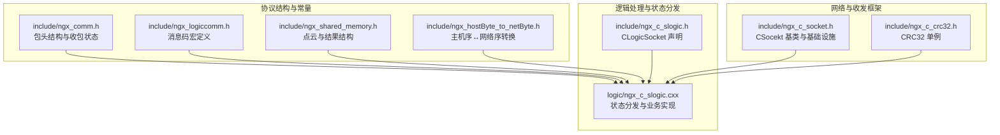
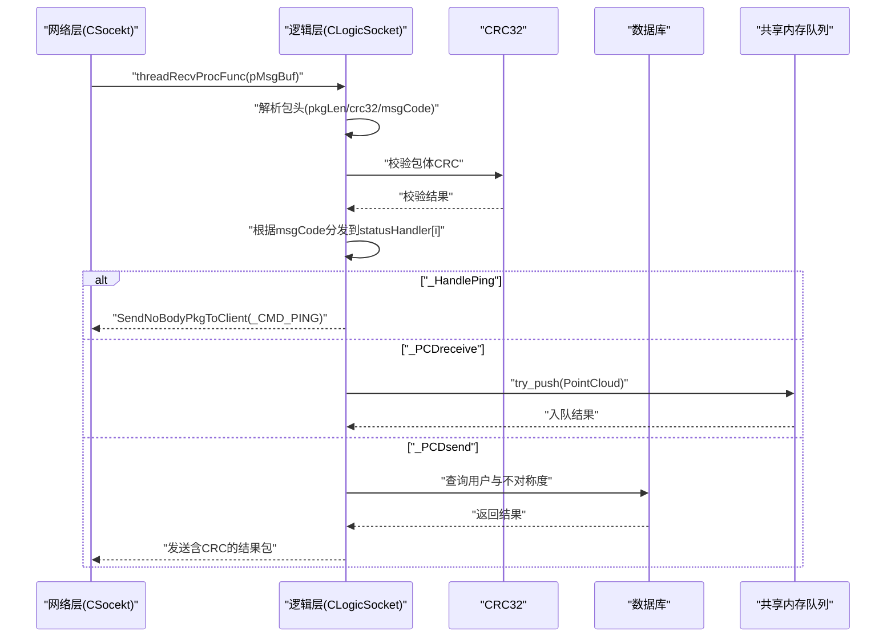
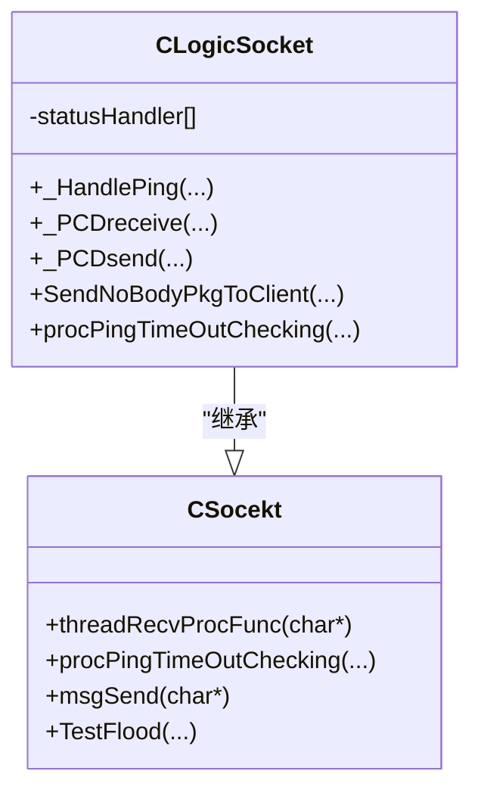
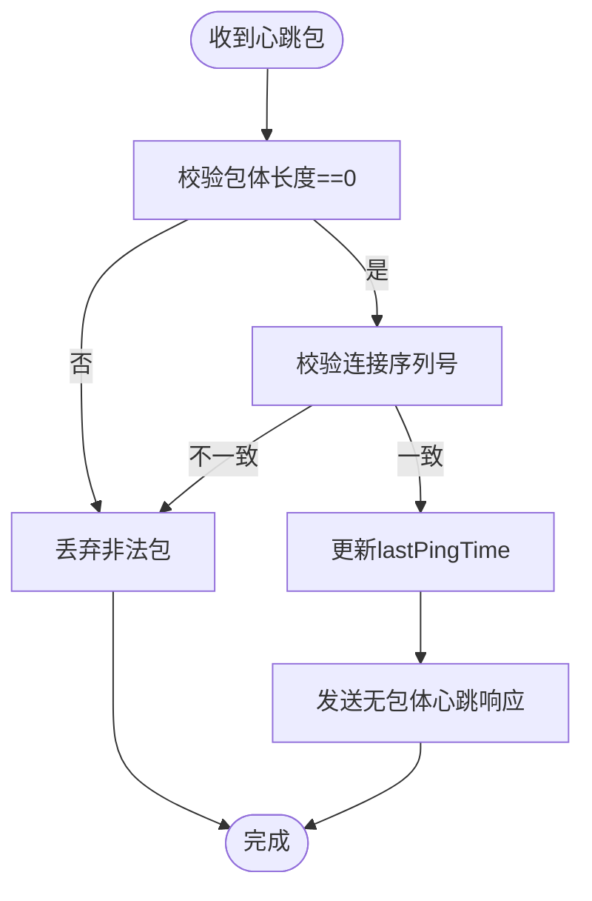
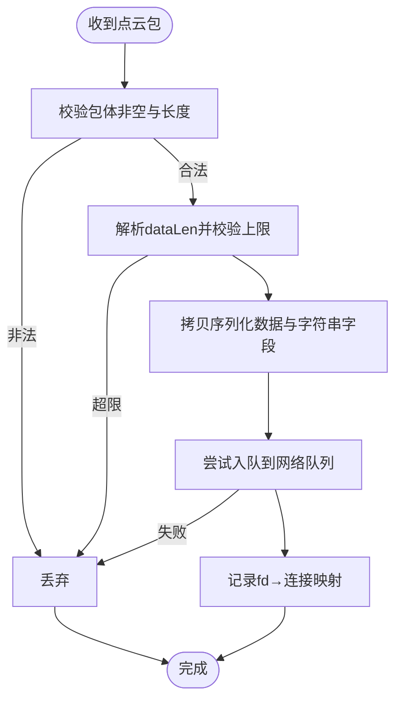
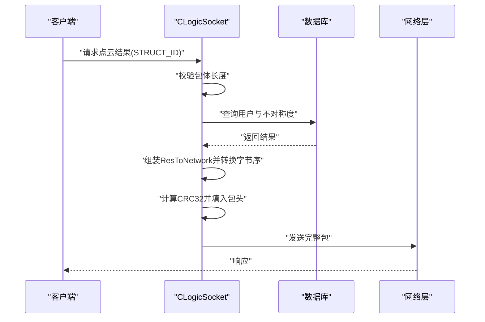
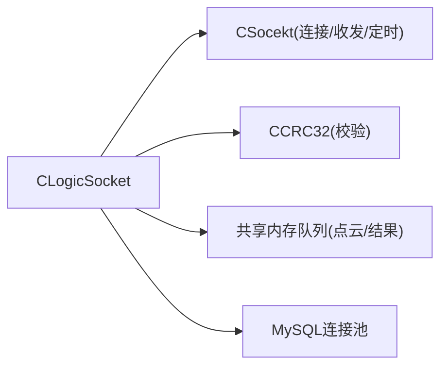

# 协议实现

<cite>
**本文引用的文件**
- [ngx_comm.h](file://include/ngx_comm.h)
- [ngx_logiccomm.h](file://include/ngx_logiccomm.h)
- [ngx_c_slogic.h](file://include/ngx_c_slogic.h)
- [ngx_c_slogic.cxx](file://logic/ngx_c_slogic.cxx)
- [ngx_c_socket.h](file://include/ngx_c_socket.h)
- [ngx_c_crc32.h](file://include/ngx_c_crc32.h)
- [ngx_shared_memory.h](file://include/ngx_shared_memory.h)
- [ngx_hostByte_to_netByte.h](file://include/ngx_hostByte_to_netByte.h)
</cite>

## 目录
1. [简介](#简介)
2. [项目结构](#项目结构)
3. [核心组件](#核心组件)
4. [架构总览](#架构总览)
5. [详细组件分析](#详细组件分析)
6. [依赖关系分析](#依赖关系分析)
7. [性能考量](#性能考量)
8. [故障排查指南](#故障排查指南)
9. [结论](#结论)
10. [附录](#附录)

## 简介
本文件面向协议实现模块，系统性阐述消息码（msgCode）的定义与使用、状态处理器（statusHandler）的设计模式、消息头与包头结构、CRC32 校验流程、心跳包与点云收发命令的实现机制，以及协议扩展与安全防护的最佳实践。文档兼顾工程细节与可读性，帮助读者快速掌握协议层的关键实现与运维要点。

## 项目结构
协议实现主要分布在以下层次：
- 协议结构与常量定义：位于 include 层，定义包头、消息码、点云数据结构等
- 逻辑处理与状态分发：位于 logic 层，实现消息码到处理函数的映射与具体业务逻辑
- 网络与收发框架：位于 include 层，提供连接、收包状态机、发送队列、心跳与安全策略等基础设施
- 工具与辅助：CRC32 单例、主机序与网络序转换、共享内存队列等

图表来源
- [ngx_comm.h](file://include/ngx_comm.h#L14-L31)
- [ngx_logiccomm.h](file://include/ngx_logiccomm.h#L4-L29)
- [ngx_shared_memory.h](file://include/ngx_shared_memory.h#L24-L63)
- [ngx_hostByte_to_netByte.h](file://include/ngx_hostByte_to_netByte.h#L1-L19)
- [ngx_c_slogic.h](file://include/ngx_c_slogic.h#L13-L37)
- [ngx_c_slogic.cxx](file://logic/ngx_c_slogic.cxx#L33-L51)
- [ngx_c_socket.h](file://include/ngx_c_socket.h#L103-L255)
- [ngx_c_crc32.h](file://include/ngx_c_crc32.h#L6-L52)

章节来源
- [ngx_comm.h](file://include/ngx_comm.h#L14-L31)
- [ngx_logiccomm.h](file://include/ngx_logiccomm.h#L4-L29)
- [ngx_shared_memory.h](file://include/ngx_shared_memory.h#L24-L63)
- [ngx_c_slogic.h](file://include/ngx_c_slogic.h#L13-L37)
- [ngx_c_slogic.cxx](file://logic/ngx_c_slogic.cxx#L33-L51)
- [ngx_c_socket.h](file://include/ngx_c_socket.h#L103-L255)
- [ngx_c_crc32.h](file://include/ngx_c_crc32.h#L6-L52)

## 核心组件
- 消息码与命令集：通过宏定义集中管理，便于扩展与维护
- 包头结构：包含 pkgLen、crc32、msgCode 三要素，确保长度、完整性与类型识别
- 状态处理器数组：以 msgCode 为索引的成员函数指针数组，实现高效分发
- 业务处理函数：心跳包、点云接收、点云发送等命令的具体实现
- 收包状态机：基于状态常量的半包/粘包处理流程
- 安全与防护：心跳超时踢人、Flood 攻击检测、CRC32 校验、包体长度限制

章节来源
- [ngx_logiccomm.h](file://include/ngx_logiccomm.h#L4-L29)
- [ngx_comm.h](file://include/ngx_comm.h#L18-L25)
- [ngx_c_slogic.cxx](file://logic/ngx_c_slogic.cxx#L39-L51)
- [ngx_c_socket.h](file://include/ngx_c_socket.h#L6-L12)

## 架构总览
协议层采用“状态分发 + 结构化包头 + 校验”的设计，结合网络层的连接池、收发队列与定时器，形成完整的收发闭环。

图表来源
- [ngx_c_slogic.cxx](file://logic/ngx_c_slogic.cxx#L77-L129)
- [ngx_c_slogic.cxx](file://logic/ngx_c_slogic.cxx#L159-L175)
- [ngx_c_slogic.cxx](file://logic/ngx_c_slogic.cxx#L176-L189)
- [ngx_c_slogic.cxx](file://logic/ngx_c_slogic.cxx#L190-L243)
- [ngx_c_slogic.cxx](file://logic/ngx_c_slogic.cxx#L275-L340)
- [ngx_c_crc32.h](file://include/ngx_c_crc32.h#L45-L48)

## 详细组件分析

### 消息码与命令集
- 定义范围：消息码从起始值递增，包含心跳包、注册、登录等命令
- 扩展建议：新增命令时，按顺序递增 msgCode，并在状态处理器数组中预留位置或扩展数组容量

章节来源
- [ngx_logiccomm.h](file://include/ngx_logiccomm.h#L6-L10)

### 包头与消息头结构
- 包头字段
  - pkgLen：包总长度（包头+包体），网络序存储
  - crc32：包体 CRC32 校验值，网络序存储
  - msgCode：消息类型代码，网络序存储
- 消息头字段
  - pConn：连接指针，用于回溯连接上下文
  - iCurrsequence：连接序列号，用于连接有效性校验

章节来源
- [ngx_comm.h](file://include/ngx_comm.h#L18-L25)
- [ngx_c_socket.h](file://include/ngx_c_socket.h#L94-L99)

### 状态处理器与消息码分发
- 设计模式
  - 成员函数指针数组：以 msgCode 为索引，直接定位处理函数，避免分支判断
  - 编译期统计：通过数组长度计算命令总数，保证边界安全
- 动态调用
  - 通过 this->*statusHandler[imsgCode] 实现成员函数动态调用
  - 对应命令需在类中实现相应成员函数

图表来源
- [ngx_c_slogic.h](file://include/ngx_c_slogic.h#L13-L37)
- [ngx_c_socket.h](file://include/ngx_c_socket.h#L103-L179)

章节来源
- [ngx_c_slogic.cxx](file://logic/ngx_c_slogic.cxx#L33-L51)
- [ngx_c_slogic.cxx](file://logic/ngx_c_slogic.cxx#L77-L129)

### 心跳包（_CMD_PING）
- 接收与校验
  - 仅允许无包体的心跳包；校验连接序列号一致性
- 处理流程
  - 更新最近心跳时间
  - 发送仅含包头的响应包（无包体）

图表来源
- [ngx_c_slogic.cxx](file://logic/ngx_c_slogic.cxx#L176-L189)
- [ngx_c_slogic.cxx](file://logic/ngx_c_slogic.cxx#L159-L175)

章节来源
- [ngx_c_slogic.cxx](file://logic/ngx_c_slogic.cxx#L176-L189)
- [ngx_c_slogic.cxx](file://logic/ngx_c_slogic.cxx#L159-L175)

### 点云接收（_PCDreceive）
- 输入校验
  - 包体非空且长度至少为 PointCloud 结构大小
  - dataLen 不得超过序列化缓冲上限（1MB）
- 数据处理
  - 网络序到主机序转换（dataLen）
  - 拷贝序列化数据、复制字符串字段、复制年龄与性别
  - 将点云对象放入网络到主进程队列
- 并发与安全
  - 使用连接级互斥锁，避免并发命令竞争
  - 记录 fd 到连接映射，便于后续处理

图表来源
- [ngx_c_slogic.cxx](file://logic/ngx_c_slogic.cxx#L190-L243)
- [ngx_shared_memory.h](file://include/ngx_shared_memory.h#L24-L33)

章节来源
- [ngx_c_slogic.cxx](file://logic/ngx_c_slogic.cxx#L190-L243)
- [ngx_shared_memory.h](file://include/ngx_shared_memory.h#L24-L33)

### 点云发送（_PCDsend）
- 输入校验
  - 包体非空且长度等于 STRUCT_ID
- 查询与封装
  - 从数据库查询用户信息与不对称度
  - 组装 ResToNetwork 结构，网络序转换 double/整型字段
- 发送与校验
  - 计算包体 CRC32，填入包头
  - 发送含包头与包体的完整包

图表来源
- [ngx_c_slogic.cxx](file://logic/ngx_c_slogic.cxx#L275-L340)
- [ngx_shared_memory.h](file://include/ngx_shared_memory.h#L54-L62)
- [ngx_hostByte_to_netByte.h](file://include/ngx_hostByte_to_netByte.h#L4-L19)

章节来源
- [ngx_c_slogic.cxx](file://logic/ngx_c_slogic.cxx#L275-L340)
- [ngx_shared_memory.h](file://include/ngx_shared_memory.h#L54-L62)
- [ngx_hostByte_to_netByte.h](file://include/ngx_hostByte_to_netByte.h#L4-L19)

### 收包状态机与半包/粘包处理
- 状态常量
  - 初始化、接收包头中、包头收完准备包体、接收包体中
- 处理流程
  - 先收包头，再根据 pkgLen 判断是否含包体
  - 若含包体，进行 CRC32 校验
  - 校验通过后，按 msgCode 分发至状态处理器

章节来源
- [ngx_comm.h](file://include/ngx_comm.h#L5-L12)
- [ngx_c_slogic.cxx](file://logic/ngx_c_slogic.cxx#L77-L129)

### CRC32 校验与字节序转换
- CRC32
  - 单例模式，提供查找表与 CRC 计算接口
  - 仅对包体进行校验，包头 CRC32 置零
- 字节序
  - 网络序与主机序转换工具，支持 double 类型

章节来源
- [ngx_c_crc32.h](file://include/ngx_c_crc32.h#L6-L52)
- [ngx_c_slogic.cxx](file://logic/ngx_c_slogic.cxx#L99-L104)
- [ngx_hostByte_to_netByte.h](file://include/ngx_hostByte_to_netByte.h#L4-L19)

## 依赖关系分析
- 逻辑层依赖网络层提供的连接上下文、消息头、发送队列与定时器
- 逻辑层依赖 CRC32 单例进行完整性校验
- 逻辑层依赖共享内存队列进行跨模块数据传递
- 逻辑层依赖数据库连接池进行查询

图表来源
- [ngx_c_slogic.cxx](file://logic/ngx_c_slogic.cxx#L16-L31)
- [ngx_c_socket.h](file://include/ngx_c_socket.h#L103-L255)
- [ngx_shared_memory.h](file://include/ngx_shared_memory.h#L65-L84)

章节来源
- [ngx_c_slogic.cxx](file://logic/ngx_c_slogic.cxx#L16-L31)
- [ngx_c_socket.h](file://include/ngx_c_socket.h#L103-L255)
- [ngx_shared_memory.h](file://include/ngx_shared_memory.h#L65-L84)

## 性能考量
- 状态分发数组
  - 以 msgCode 为索引的 O(1) 查找，避免分支判断带来的分支预测开销
- 半包/粘包处理
  - 固定大小包头缓冲与状态机，减少内存拷贝与碎片
- 队列与共享内存
  - 使用无锁队列与共享内存，降低跨模块同步成本
- 字节序转换
  - 仅在必要字段上进行转换，减少不必要的 CPU 指令

[本节为通用性能讨论，无需特定文件来源]

## 故障排查指南
- CRC 错误
  - 现象：日志提示 CRC 错误并丢弃数据
  - 排查：确认包体长度与 CRC 计算范围、网络序转换是否正确
- 心跳超时
  - 现象：定时器触发后关闭连接
  - 排查：检查 lastPingTime 更新逻辑、定时器周期配置
- 包体长度异常
  - 现象：点云接收丢弃或点云发送长度校验失败
  - 排查：确认 STRUCT_ID/PointCloud 结构大小与网络序转换
- 队列满导致丢弃
  - 现象：日志提示队列已满
  - 排查：提升队列容量或优化下游处理吞吐

章节来源
- [ngx_c_slogic.cxx](file://logic/ngx_c_slogic.cxx#L102-L104)
- [ngx_c_slogic.cxx](file://logic/ngx_c_slogic.cxx#L143-L147)
- [ngx_c_slogic.cxx](file://logic/ngx_c_slogic.cxx#L204-L207)
- [ngx_c_slogic.cxx](file://logic/ngx_c_slogic.cxx#L234-L235)

## 结论
协议实现模块以简洁高效的“状态分发数组 + 结构化包头 + 校验”为核心，配合网络层的连接池、定时器与队列，构建了稳定可靠的点云协议栈。通过明确的消息码管理、严格的包体校验与必要的安全策略，系统在保证性能的同时具备良好的可扩展性与可维护性。

[本节为总结性内容，无需特定文件来源]

## 附录

### 协议扩展方法与最佳实践
- 新增命令步骤
  - 在消息码头文件中定义新命令宏
  - 在状态处理器数组中预留或扩展位置
  - 在类中实现对应成员函数
  - 在分发入口中按 msgCode 调用
- 修改既有协议
  - 保持 msgCode 向后兼容，避免破坏客户端
  - 如需变更包体结构，确保版本协商或双端兼容
  - 严格校验包体长度与字段边界
- 安全加固
  - 强制 CRC32 校验，禁止空包体命令携带包体
  - 限制包体大小，防止内存滥用
  - 启用心跳超时与 Flood 攻击检测
  - 对敏感字段进行字节序转换与范围校验

章节来源
- [ngx_logiccomm.h](file://include/ngx_logiccomm.h#L6-L10)
- [ngx_c_slogic.cxx](file://logic/ngx_c_slogic.cxx#L39-L51)
- [ngx_c_slogic.cxx](file://logic/ngx_c_slogic.cxx#L115-L125)
- [ngx_c_socket.h](file://include/ngx_c_socket.h#L83-L87)
- [ngx_c_socket.h](file://include/ngx_c_socket.h#L246-L249)