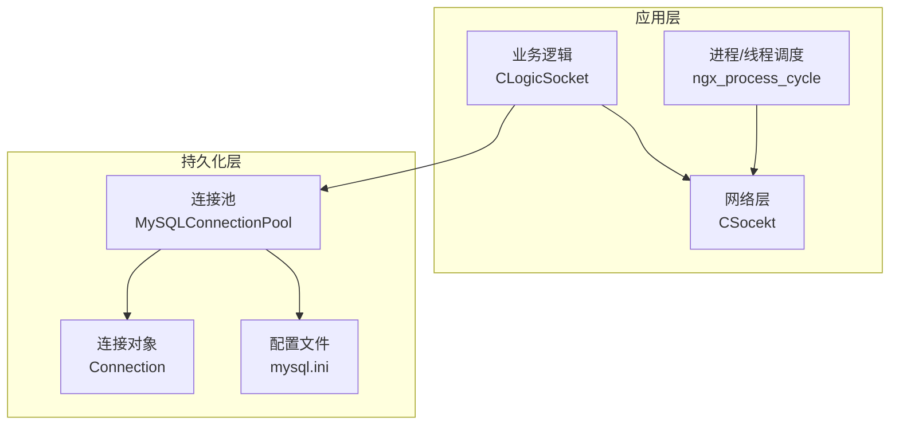
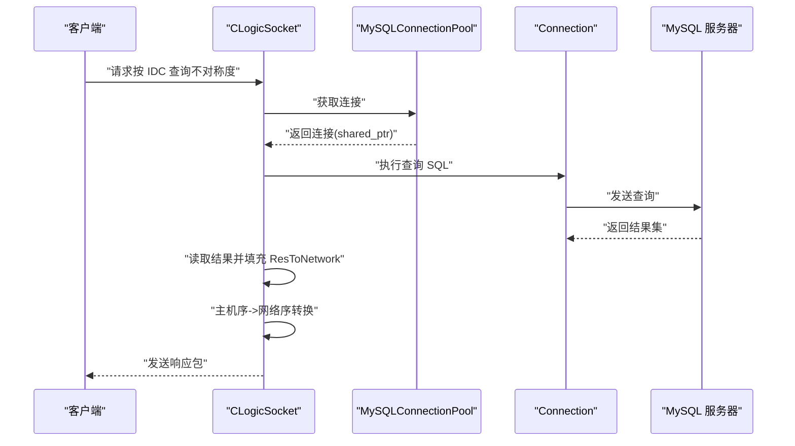
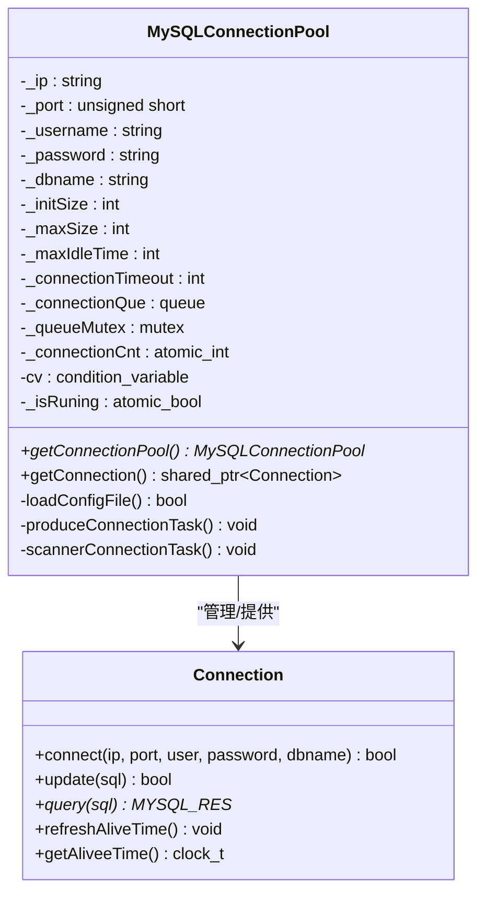
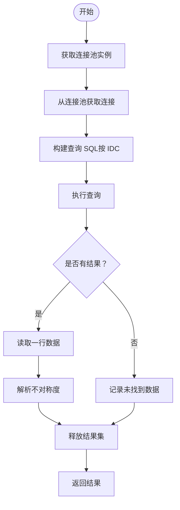
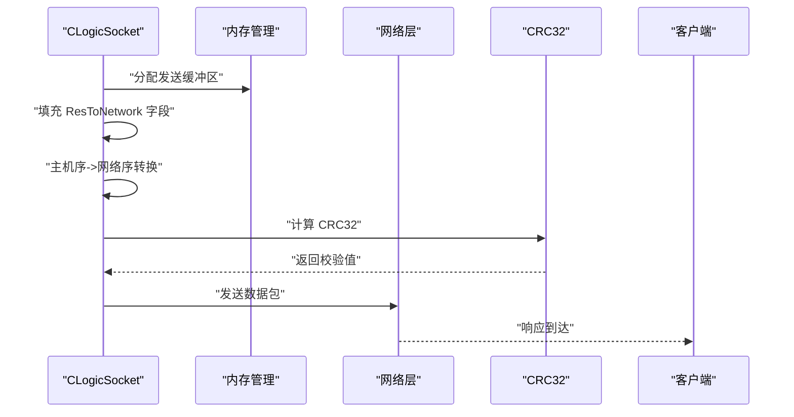
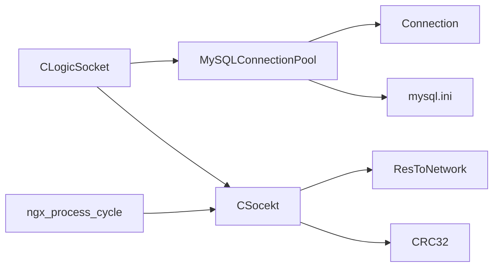

# 数据库集成

<cite>
**本文引用的文件**
- [include/ngx_mysql_connection.h](file://include/ngx_mysql_connection.h)
- [persist/ngx_mysql_connection.cxx](file://persist/ngx_mysql_connection.cxx)
- [include/ngx_mysql_connection_pool.h](file://include/ngx_mysql_connection_pool.h)
- [persist/ngx_mysql_connection_pool.cxx](file://persist/ngx_mysql_connection_pool.cxx)
- [persist/mysql.ini](file://persist/mysql.ini)
- [include/ngx_c_slogic.h](file://include/ngx_c_slogic.h)
- [logic/ngx_c_slogic.cxx](file://logic/ngx_c_slogic.cxx)
- [include/ngx_hostByte_to_netByte.h](file://include/ngx_hostByte_to_netByte.h)
- [net/ngx_c_socket.cxx](file://net/ngx_c_socket.cxx)
- [proc/ngx_process_cycle.cxx](file://proc/ngx_process_cycle.cxx)
</cite>

## 目录
1. [简介](#简介)
2. [项目结构](#项目结构)
3. [核心组件](#核心组件)
4. [架构总览](#架构总览)
5. [详细组件分析](#详细组件分析)
6. [依赖关系分析](#依赖关系分析)
7. [性能考量](#性能考量)
8. [故障排查指南](#故障排查指南)
9. [结论](#结论)
10. [附录](#附录)

## 简介
本技术文档围绕数据库集成展开，重点阐述 MySQL 连接池在业务逻辑中的使用方式，覆盖连接获取、查询执行、结果处理与连接释放的完整流程；深入解析点云数据查询实现，包括按 IDC 查询不对称度（asymmetry）的 SQL 设计、数据类型转换与结果集处理；说明 ResToNetwork 结构体的设计与使用，涵盖查询结果封装、网络传输格式转换及客户端响应生成；最后给出数据库操作的安全性建议（SQL 注入防护、连接超时与异常处理）并提供可定位到源码路径的示例流程。

## 项目结构
该项目采用分层与模块化组织方式：
- include：公共头文件，包含数据库连接与连接池接口、主机序与网络序转换工具、逻辑与网络层接口声明。
- persist：数据库连接与连接池的具体实现，以及配置文件。
- logic：业务逻辑层，包含与数据库交互的查询方法与网络包处理。
- net：网络层，负责消息打包、序列化与发送。
- proc：进程与线程调度、队列流转与结果投递。
- 其他目录：工具与信号处理等支撑模块。

图表来源
- [include/ngx_mysql_connection_pool.h](file://include/ngx_mysql_connection_pool.h#L14-L55)
- [persist/ngx_mysql_connection_pool.cxx](file://persist/ngx_mysql_connection_pool.cxx#L1-L349)
- [persist/ngx_mysql_connection.cxx](file://persist/ngx_mysql_connection.cxx#L1-L56)
- [persist/mysql.ini](file://persist/mysql.ini#L1-L13)
- [include/ngx_c_slogic.h](file://include/ngx_c_slogic.h#L13-L39)
- [logic/ngx_c_slogic.cxx](file://logic/ngx_c_slogic.cxx#L1-L341)
- [net/ngx_c_socket.cxx](file://net/ngx_c_socket.cxx#L899-L946)
- [proc/ngx_process_cycle.cxx](file://proc/ngx_process_cycle.cxx#L820-L862)

章节来源
- [include/ngx_mysql_connection_pool.h](file://include/ngx_mysql_connection_pool.h#L1-L55)
- [persist/ngx_mysql_connection_pool.cxx](file://persist/ngx_mysql_connection_pool.cxx#L1-L349)
- [persist/ngx_mysql_connection.cxx](file://persist/ngx_mysql_connection.cxx#L1-L56)
- [persist/mysql.ini](file://persist/mysql.ini#L1-L13)
- [include/ngx_c_slogic.h](file://include/ngx_c_slogic.h#L13-L39)
- [logic/ngx_c_slogic.cxx](file://logic/ngx_c_slogic.cxx#L1-L341)
- [net/ngx_c_socket.cxx](file://net/ngx_c_socket.cxx#L899-L946)
- [proc/ngx_process_cycle.cxx](file://proc/ngx_process_cycle.cxx#L820-L862)

## 核心组件
- Connection：封装单条 MySQL 连接，提供 connect、update、query 等能力，并记录空闲存活时间。
- MySQLConnectionPool：连接池实现，负责配置加载、连接生产与回收、消费者获取连接、超时控制与线程安全。
- CLogicSocket：业务逻辑入口，包含按 IDC 查询不对称度的方法与网络包处理。
- ResToNetwork：网络传输结果结构体，承载查询结果字段并在发送前进行主机序/网络序转换。
- 主机序与网络序转换工具：提供双精度浮点的网络序转换函数。

章节来源
- [include/ngx_mysql_connection.h](file://include/ngx_mysql_connection.h#L9-L35)
- [persist/ngx_mysql_connection.cxx](file://persist/ngx_mysql_connection.cxx#L6-L56)
- [include/ngx_mysql_connection_pool.h](file://include/ngx_mysql_connection_pool.h#L14-L55)
- [persist/ngx_mysql_connection_pool.cxx](file://persist/ngx_mysql_connection_pool.cxx#L5-L349)
- [include/ngx_c_slogic.h](file://include/ngx_c_slogic.h#L29-L29)
- [logic/ngx_c_slogic.cxx](file://logic/ngx_c_slogic.cxx#L245-L274)
- [include/ngx_hostByte_to_netByte.h](file://include/ngx_hostByte_to_netByte.h#L4-L19)

## 架构总览
数据库集成在业务逻辑层通过连接池获取连接，执行查询并将结果封装进 ResToNetwork，随后在网络层进行序列化与发送。连接池采用生产者/消费者模型与条件变量协调，支持动态扩容与空闲回收。

图表来源
- [logic/ngx_c_slogic.cxx](file://logic/ngx_c_slogic.cxx#L245-L274)
- [persist/ngx_mysql_connection_pool.cxx](file://persist/ngx_mysql_connection_pool.cxx#L208-L255)
- [persist/ngx_mysql_connection.cxx](file://persist/ngx_mysql_connection.cxx#L46-L55)
- [net/ngx_c_socket.cxx](file://net/ngx_c_socket.cxx#L899-L946)

## 详细组件分析

### MySQL 连接池与连接对象
- Connection 提供连接初始化、真实连接、更新与查询接口，并维护空闲存活时间。
- MySQLConnectionPool 单例模式，从配置文件加载参数，启动生产与扫描线程，提供连接获取与释放的 RAII 包装，支持超时等待与空闲回收。

图表来源
- [include/ngx_mysql_connection.h](file://include/ngx_mysql_connection.h#L9-L35)
- [include/ngx_mysql_connection_pool.h](file://include/ngx_mysql_connection_pool.h#L14-L55)
- [persist/ngx_mysql_connection_pool.cxx](file://persist/ngx_mysql_connection_pool.cxx#L12-L349)

章节来源
- [include/ngx_mysql_connection.h](file://include/ngx_mysql_connection.h#L9-L35)
- [persist/ngx_mysql_connection.cxx](file://persist/ngx_mysql_connection.cxx#L6-L56)
- [include/ngx_mysql_connection_pool.h](file://include/ngx_mysql_connection_pool.h#L14-L55)
- [persist/ngx_mysql_connection_pool.cxx](file://persist/ngx_mysql_connection_pool.cxx#L12-L349)
- [persist/mysql.ini](file://persist/mysql.ini#L1-L13)

### 点云数据查询与不对称度获取
- 业务逻辑入口提供按 IDC 查询不对称度的方法，内部通过连接池获取连接，拼接 SQL 并执行查询，读取第一行的不对称度字段，最终返回给调用方。
- 查询 SQL 使用字符串拼接，未使用参数化，存在 SQL 注入风险，建议改为预处理语句。

图表来源
- [logic/ngx_c_slogic.cxx](file://logic/ngx_c_slogic.cxx#L245-L274)
- [persist/ngx_mysql_connection.cxx](file://persist/ngx_mysql_connection.cxx#L46-L55)

章节来源
- [include/ngx_c_slogic.h](file://include/ngx_c_slogic.h#L29-L29)
- [logic/ngx_c_slogic.cxx](file://logic/ngx_c_slogic.cxx#L245-L274)
- [persist/ngx_mysql_connection.cxx](file://persist/ngx_mysql_connection.cxx#L46-L55)

### ResToNetwork 结构体与网络响应生成
- ResToNetwork 作为网络传输载体，封装 ID、姓名、年龄、性别、不对称度与 fd 等字段。
- 在网络层将结构体内容拷贝到发送缓冲区，进行主机序到网络序的转换（含双精度浮点），计算 CRC32 并发送。

图表来源
- [logic/ngx_c_slogic.cxx](file://logic/ngx_c_slogic.cxx#L296-L340)
- [net/ngx_c_socket.cxx](file://net/ngx_c_socket.cxx#L899-L946)
- [include/ngx_hostByte_to_netByte.h](file://include/ngx_hostByte_to_netByte.h#L4-L19)

章节来源
- [logic/ngx_c_slogic.cxx](file://logic/ngx_c_slogic.cxx#L296-L340)
- [net/ngx_c_socket.cxx](file://net/ngx_c_socket.cxx#L899-L946)
- [include/ngx_hostByte_to_netByte.h](file://include/ngx_hostByte_to_netByte.h#L4-L19)

### 完整数据库查询与响应流程（示例路径）
以下示例展示从网络请求到数据库查询再到响应发送的关键步骤，便于定位源码：

- 网络请求处理与查询发起
  - [CLogicSocket::_PCDsend 中的查询与封装](file://logic/ngx_c_slogic.cxx#L275-L340)
  - [CLogicSocket::getAsymmetryByIDC 的查询实现](file://logic/ngx_c_slogic.cxx#L245-L274)

- 连接池获取与释放
  - [MySQLConnectionPool::getConnection 的获取与 RAII 回收](file://persist/ngx_mysql_connection_pool.cxx#L208-L255)

- 网络发送与序列化
  - [网络层填充 ResToNetwork 并发送](file://net/ngx_c_socket.cxx#L899-L946)

- 主机序/网络序转换
  - [双精度主机序->网络序转换工具](file://include/ngx_hostByte_to_netByte.h#L4-L19)

章节来源
- [logic/ngx_c_slogic.cxx](file://logic/ngx_c_slogic.cxx#L245-L340)
- [persist/ngx_mysql_connection_pool.cxx](file://persist/ngx_mysql_connection_pool.cxx#L208-L255)
- [net/ngx_c_socket.cxx](file://net/ngx_c_socket.cxx#L899-L946)
- [include/ngx_hostByte_to_netByte.h](file://include/ngx_hostByte_to_netByte.h#L4-L19)

## 依赖关系分析
- 业务逻辑层依赖连接池与连接对象，负责 SQL 构造与结果读取。
- 网络层依赖 ResToNetwork 结构体与 CRC32 工具，负责序列化与发送。
- 连接池依赖配置文件，负责运行期参数与生命周期管理。
- 进程/线程调度模块负责在不同阶段之间传递 ResToNetwork 结果。

图表来源
- [include/ngx_c_slogic.h](file://include/ngx_c_slogic.h#L13-L39)
- [include/ngx_mysql_connection_pool.h](file://include/ngx_mysql_connection_pool.h#L14-L55)
- [persist/ngx_mysql_connection_pool.cxx](file://persist/ngx_mysql_connection_pool.cxx#L12-L349)
- [persist/mysql.ini](file://persist/mysql.ini#L1-L13)
- [net/ngx_c_socket.cxx](file://net/ngx_c_socket.cxx#L899-L946)
- [proc/ngx_process_cycle.cxx](file://proc/ngx_process_cycle.cxx#L820-L862)

章节来源
- [include/ngx_c_slogic.h](file://include/ngx_c_slogic.h#L13-L39)
- [include/ngx_mysql_connection_pool.h](file://include/ngx_mysql_connection_pool.h#L14-L55)
- [persist/ngx_mysql_connection_pool.cxx](file://persist/ngx_mysql_connection_pool.cxx#L12-L349)
- [persist/mysql.ini](file://persist/mysql.ini#L1-L13)
- [net/ngx_c_socket.cxx](file://net/ngx_c_socket.cxx#L899-L946)
- [proc/ngx_process_cycle.cxx](file://proc/ngx_process_cycle.cxx#L820-L862)

## 性能考量
- 连接池并发：生产者/消费者模型与条件变量协调，避免频繁创建销毁连接；合理设置 initSize 与 maxSize，平衡内存与吞吐。
- 空闲回收：扫描线程按 maxIdleTime 定期回收空闲连接，降低资源占用。
- 查询性能：批量处理与批内分片（参考点云计算中的批处理策略）可减少网络往返与上下文切换。
- 序列化开销：ResToNetwork 为固定大小结构体，网络层直接拷贝，减少序列化成本。

[本节为通用性能讨论，不直接分析具体文件]

## 故障排查指南
- 连接池配置缺失
  - 现象：启动时报配置文件不存在或加载失败。
  - 排查：确认配置文件路径与键值正确，检查权限与格式。
  - 参考：[配置文件加载与解析](file://persist/ngx_mysql_connection_pool.cxx#L12-L74)

- 获取连接超时
  - 现象：getConnection 返回空指针，日志提示“获取空闲连接超时”。
  - 排查：检查 connectionTimeOut、initSize 与并发峰值；观察生产线程是否正常运行。
  - 参考：[连接获取与超时处理](file://persist/ngx_mysql_connection_pool.cxx#L208-L255)

- 查询失败
  - 现象：query 返回空指针，日志提示“查询失败”。
  - 排查：检查 SQL 拼接与表结构；确认连接状态；查看数据库日志。
  - 参考：[查询执行与错误处理](file://persist/ngx_mysql_connection.cxx#L46-L55)

- 结果集未释放
  - 现象：内存泄漏或句柄耗尽。
  - 排查：确保每次查询后调用 mysql_free_result；检查业务逻辑分支。
  - 参考：[结果集释放](file://logic/ngx_c_slogic.cxx#L272-L272)

- 网络序转换问题
  - 现象：客户端收到的数值异常。
  - 排查：确认双精度转换工具使用正确；检查 htond/ntohd 的调用时机。
  - 参考：[主机序/网络序转换](file://include/ngx_hostByte_to_netByte.h#L4-L19)

章节来源
- [persist/ngx_mysql_connection_pool.cxx](file://persist/ngx_mysql_connection_pool.cxx#L12-L74)
- [persist/ngx_mysql_connection_pool.cxx](file://persist/ngx_mysql_connection_pool.cxx#L208-L255)
- [persist/ngx_mysql_connection.cxx](file://persist/ngx_mysql_connection.cxx#L46-L55)
- [logic/ngx_c_slogic.cxx](file://logic/ngx_c_slogic.cxx#L272-L272)
- [include/ngx_hostByte_to_netByte.h](file://include/ngx_hostByte_to_netByte.h#L4-L19)

## 结论
本项目通过连接池与连接对象实现了稳定的数据库访问，业务逻辑层提供了按 IDC 查询不对称度的能力，并以 ResToNetwork 为载体完成网络响应。建议在现有基础上引入参数化查询以提升安全性，完善异常链路与监控告警，持续优化连接池参数与查询批处理策略，以获得更高的稳定性与性能。

[本节为总结性内容，不直接分析具体文件]

## 附录

### 安全性最佳实践
- SQL 注入防护
  - 当前实现使用字符串拼接构造 SQL，存在注入风险。建议改用预处理语句绑定参数，严格校验输入类型与长度。
  - 参考：[按 IDC 查询的 SQL 拼接位置](file://logic/ngx_c_slogic.cxx#L255-L255)

- 连接超时与异常处理
  - getConnection 支持超时等待，查询失败与无结果均有日志输出，建议补充重试与熔断策略。
  - 参考：[连接获取与查询失败处理](file://persist/ngx_mysql_connection_pool.cxx#L208-L255), [查询失败处理](file://persist/ngx_mysql_connection.cxx#L46-L55)

- 数据类型与边界
  - ResToNetwork 字段需与数据库表结构一致；网络序转换仅对数值型字段生效，字符字段注意长度与空字符处理。
  - 参考：[ResToNetwork 填充与转换](file://logic/ngx_c_slogic.cxx#L304-L340), [主机序/网络序转换](file://include/ngx_hostByte_to_netByte.h#L4-L19)

章节来源
- [logic/ngx_c_slogic.cxx](file://logic/ngx_c_slogic.cxx#L255-L255)
- [persist/ngx_mysql_connection_pool.cxx](file://persist/ngx_mysql_connection_pool.cxx#L208-L255)
- [persist/ngx_mysql_connection.cxx](file://persist/ngx_mysql_connection.cxx#L46-L55)
- [logic/ngx_c_slogic.cxx](file://logic/ngx_c_slogic.cxx#L304-L340)
- [include/ngx_hostByte_to_netByte.h](file://include/ngx_hostByte_to_netByte.h#L4-L19)