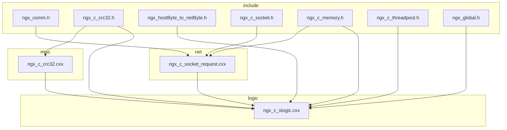
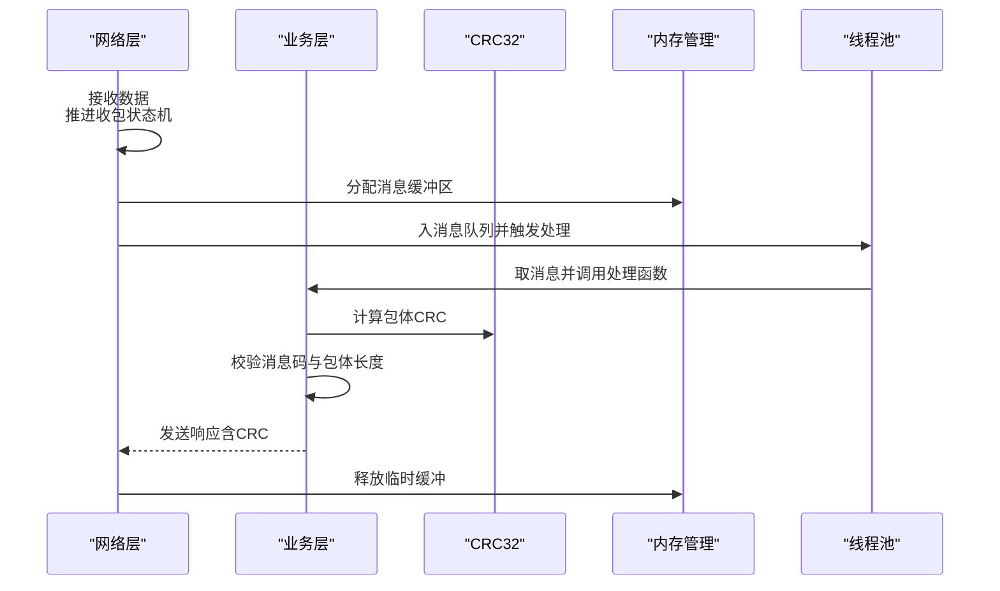
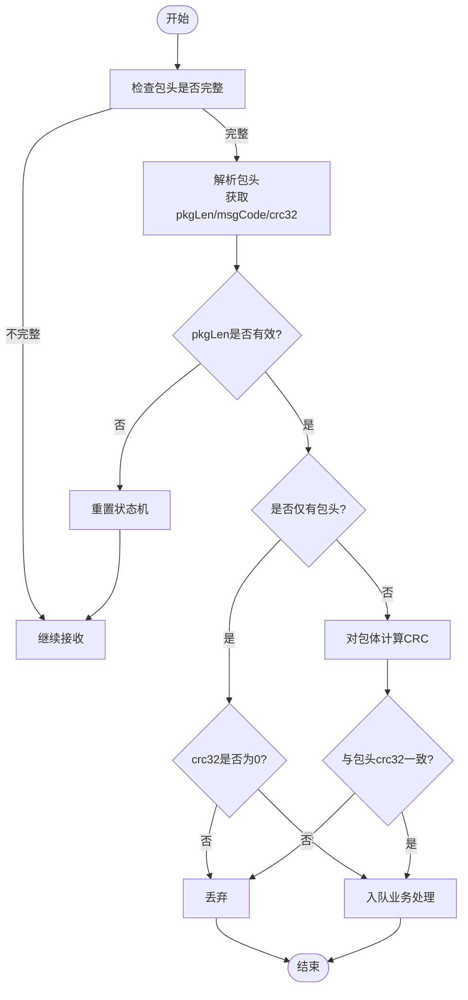
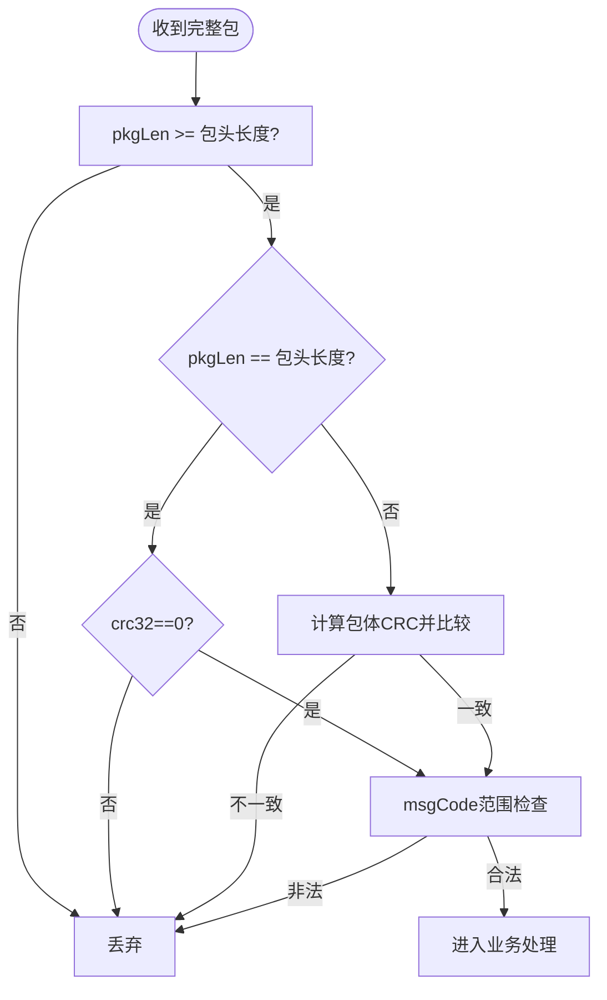
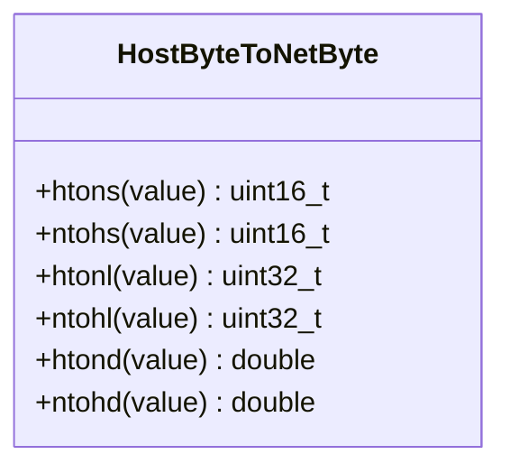
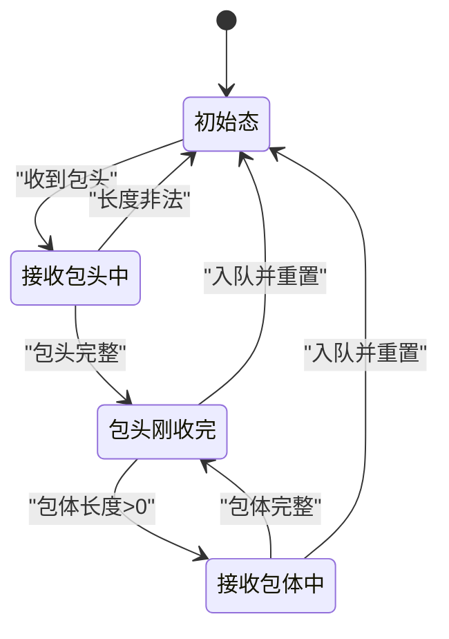
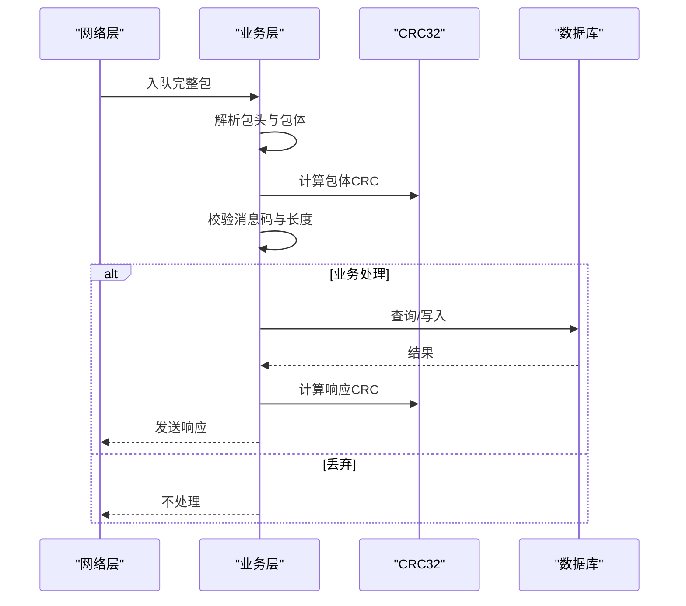
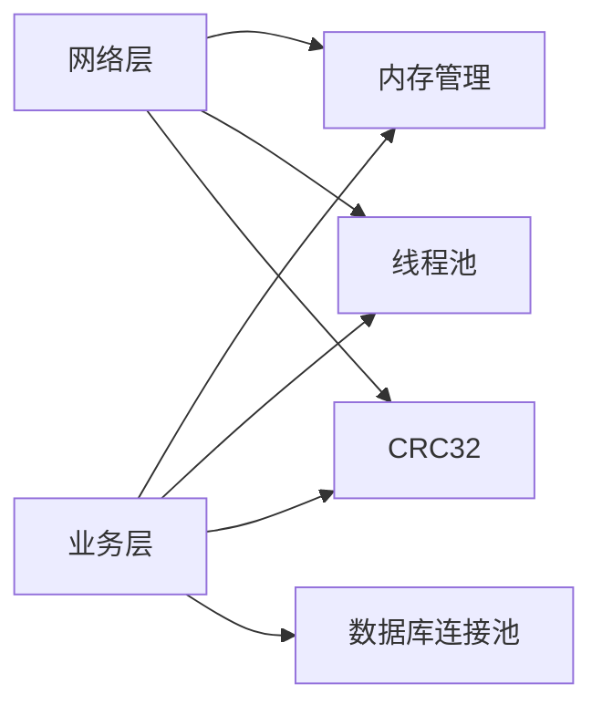

# 数据验证机制

<cite>
**本文引用的文件**
- [ngx_c_crc32.h](file://include/ngx_c_crc32.h)
- [ngx_c_crc32.cxx](file://misc/ngx_c_crc32.cxx)
- [ngx_hostByte_to_netByte.h](file://include/ngx_hostByte_to_netByte.h)
- [ngx_comm.h](file://include/ngx_comm.h)
- [ngx_c_socket.h](file://include/ngx_c_socket.h)
- [ngx_c_socket_request.cxx](file://net/ngx_c_socket_request.cxx)
- [ngx_c_slogic.cxx](file://logic/ngx_c_slogic.cxx)
- [ngx_c_memory.h](file://include/ngx_c_memory.h)
- [ngx_c_threadpool.h](file://include/ngx_c_threadpool.h)
- [ngx_global.h](file://include/ngx_global.h)
</cite>

## 目录
1. [简介](#简介)
2. [项目结构](#项目结构)
3. [核心组件](#核心组件)
4. [架构总览](#架构总览)
5. [详细组件分析](#详细组件分析)
6. [依赖分析](#依赖分析)
7. [性能考量](#性能考量)
8. [故障排查指南](#故障排查指南)
9. [结论](#结论)
10. [附录](#附录)

## 简介
本文件围绕数据验证机制展开，重点解释以下方面：
- CRC32 校验的实现原理与使用方法：包括包体数据的 CRC 计算、客户端传入 CRC 值的验证、以及校验失败时的处理策略。
- 数据完整性检查机制：包长度验证、包体存在性检查、数据格式的合法性验证。
- 网络字节序转换的安全性考虑：ntohl、htons、ntohd、htond 等函数的使用与潜在风险。
- 最佳实践：边界检查、缓冲区溢出防护、恶意数据包识别与处理。
- 具体实现示例的代码片段路径，便于读者定位源码。

## 项目结构
该项目采用分层与按功能域划分的组织方式：
- include：公共头文件，定义协议结构、工具函数与接口声明（如通信协议、CRC32、字节序转换、内存管理、线程池等）。
- net：网络层实现，负责收包状态机、接收/发送流程、字节序转换与基础错误处理。
- logic：业务层实现，负责解析包头、执行 CRC 校验、消息码合法性检查、业务处理与响应发送。
- misc：通用工具实现，如 CRC32 表初始化与查表计算。
- 其他目录：进程管理、信号处理、持久化等支撑模块。

图表来源
- [ngx_comm.h](file://include/ngx_comm.h#L18-L31)
- [ngx_c_crc32.h](file://include/ngx_c_crc32.h#L6-L52)
- [ngx_hostByte_to_netByte.h](file://include/ngx_hostByte_to_netByte.h#L1-L19)
- [ngx_c_socket.h](file://include/ngx_c_socket.h#L103-L258)
- [ngx_c_socket_request.cxx](file://net/ngx_c_socket_request.cxx#L25-L341)
- [ngx_c_slogic.cxx](file://logic/ngx_c_slogic.cxx#L77-L129)
- [ngx_c_crc32.cxx](file://misc/ngx_c_crc32.cxx#L37-L87)

章节来源
- [ngx_comm.h](file://include/ngx_comm.h#L18-L31)
- [ngx_c_socket.h](file://include/ngx_c_socket.h#L103-L258)
- [ngx_c_socket_request.cxx](file://net/ngx_c_socket_request.cxx#L25-L341)
- [ngx_c_slogic.cxx](file://logic/ngx_c_slogic.cxx#L77-L129)
- [ngx_c_crc32.cxx](file://misc/ngx_c_crc32.cxx#L37-L87)

## 核心组件
- 协议结构与常量
  - 包头结构包含 pkgLen（总长度）、crc32（校验值）、msgCode（消息码）。该结构以紧凑对齐方式定义，确保跨平台传输一致性。
  - 收包状态常量定义了收包状态机的四个阶段，用于处理半包、粘包与重包场景。
- CRC32 实现
  - 提供查表法的 CRC32 初始化与计算，支持无符号整型输入，避免负值引入高位误判。
- 字节序转换
  - 提供双精度浮点的主机序/网络序转换函数，基于位交换与内存拷贝实现，保证跨平台数值一致性。
- 网络层收包与状态机
  - 基于 epoll 的事件驱动模型，实现包头与包体的分阶段接收，结合状态机推进与内存分配策略。
- 业务层验证与处理
  - 在业务线程中完成 CRC 校验、消息码合法性检查、包体存在性与长度检查，并进行业务处理与响应发送。

章节来源
- [ngx_comm.h](file://include/ngx_comm.h#L18-L31)
- [ngx_c_crc32.h](file://include/ngx_c_crc32.h#L6-L52)
- [ngx_hostByte_to_netByte.h](file://include/ngx_hostByte_to_netByte.h#L1-L19)
- [ngx_c_socket.h](file://include/ngx_c_socket.h#L103-L258)
- [ngx_c_socket_request.cxx](file://net/ngx_c_socket_request.cxx#L25-L341)
- [ngx_c_slogic.cxx](file://logic/ngx_c_slogic.cxx#L77-L129)

## 架构总览
整体架构分为三层：
- 网络层：负责底层收发、状态机推进与内存管理。
- 业务层：负责协议解析、数据验证与业务处理。
- 工具层：提供 CRC32、字节序转换、内存与线程池等基础设施。

图表来源
- [ngx_c_socket_request.cxx](file://net/ngx_c_socket_request.cxx#L25-L114)
- [ngx_c_slogic.cxx](file://logic/ngx_c_slogic.cxx#L77-L129)
- [ngx_c_crc32.cxx](file://misc/ngx_c_crc32.cxx#L71-L87)
- [ngx_c_memory.h](file://include/ngx_c_memory.h#L4-L52)
- [ngx_c_threadpool.h](file://include/ngx_c_threadpool.h#L19-L30)

## 详细组件分析

### CRC32 校验实现与使用
- 查表初始化
  - 通过多项式 0x04C11DB7 生成 256 项查表，支持按字节查表加速计算。
- CRC 计算
  - 使用无符号整型，逐字节查表累加，最终与 0xFFFFFFFF 异或得到结果。
- 客户端传入 CRC 值的验证
  - 业务层在收到完整包后，对包体进行 CRC 计算并与包头中的 crc32 字段比较，不一致则丢弃。
- 校验失败处理策略
  - 记录日志并直接返回，不进入业务处理流程，避免错误数据污染后续逻辑。

图表来源
- [ngx_c_socket_request.cxx](file://net/ngx_c_socket_request.cxx#L160-L211)
- [ngx_c_slogic.cxx](file://logic/ngx_c_slogic.cxx#L77-L105)
- [ngx_c_crc32.cxx](file://misc/ngx_c_crc32.cxx#L37-L87)

章节来源
- [ngx_c_crc32.h](file://include/ngx_c_crc32.h#L6-L52)
- [ngx_c_crc32.cxx](file://misc/ngx_c_crc32.cxx#L37-L87)
- [ngx_c_slogic.cxx](file://logic/ngx_c_slogic.cxx#L77-L105)

### 数据完整性检查机制
- 包长度验证
  - 收包阶段对 pkgLen 进行最小值检查，避免小于包头长度的非法包。
- 包体存在性检查
  - 若 pkgLen 等于包头长度，则视为仅有包头，crc32 应为 0；否则对包体进行 CRC 校验。
- 数据格式合法性验证
  - 对消息码进行范围检查与处理函数映射有效性检查，拒绝未知或未实现的消息码。
  - 对包体长度进行最小值检查，避免空包体或长度不足的非法包。

图表来源
- [ngx_c_socket_request.cxx](file://net/ngx_c_socket_request.cxx#L160-L211)
- [ngx_c_slogic.cxx](file://logic/ngx_c_slogic.cxx#L84-L125)

章节来源
- [ngx_c_socket_request.cxx](file://net/ngx_c_socket_request.cxx#L160-L211)
- [ngx_c_slogic.cxx](file://logic/ngx_c_slogic.cxx#L84-L125)

### 网络字节序转换的安全性考虑
- 函数族
  - 主机序与网络序转换：htons/ntohs（16位）、htonl/ntohl（32位）、htond/ntohd（64位双精度）。
  - 64位双精度转换通过位交换与内存拷贝实现，静态断言确保双精度大小为 8 字节。
- 安全性要点
  - 跨平台一致性：网络传输统一使用网络序，接收端必须转换为主机序后再使用。
  - 类型匹配：确保转换函数与数据类型一致，避免类型不匹配导致的错误。
  - 浮点转换：双精度转换逻辑相同，但需关注 IEEE 754 格式的二进制表示。
  - 性能与可移植性：使用编译器内置位交换指令提升性能，同时保持可移植性。

图表来源
- [ngx_hostByte_to_netByte.h](file://include/ngx_hostByte_to_netByte.h#L1-L19)

章节来源
- [ngx_hostByte_to_netByte.h](file://include/ngx_hostByte_to_netByte.h#L1-L19)
- [ngx_c_slogic.cxx](file://logic/ngx_c_slogic.cxx#L190-L243)

### 网络层收包状态机与内存管理
- 状态机
  - 初始态、接收包头中、包头刚收完、接收包体中四个状态，分别处理半包与粘包场景。
- 内存管理
  - 使用内存池分配消息缓冲区，包含消息头、包头与包体三部分，避免碎片化与频繁分配。
- 错误处理
  - 对 recv/recv 返回值进行分类处理，区分正常数据、EAGAIN/EWOULDBLOCK、EINTR 与异常错误。

图表来源
- [ngx_c_socket_request.cxx](file://net/ngx_c_socket_request.cxx#L37-L114)
- [ngx_c_socket.h](file://include/ngx_c_socket.h#L38-L91)

章节来源
- [ngx_c_socket_request.cxx](file://net/ngx_c_socket_request.cxx#L25-L114)
- [ngx_c_socket.h](file://include/ngx_c_socket.h#L38-L91)
- [ngx_c_memory.h](file://include/ngx_c_memory.h#L4-L52)

### 业务层验证与处理流程
- 收到完整包后，业务线程进行：
  - 包体 CRC 校验（仅包体，不含包头）。
  - 消息码合法性检查与处理函数映射。
  - 包体长度与格式检查。
  - 执行相应业务逻辑并发送响应，响应包头同样包含 CRC32。
- 发送响应时，业务层对响应数据进行 CRC 计算并写入包头，随后转换为网络序发送。

图表来源
- [ngx_c_slogic.cxx](file://logic/ngx_c_slogic.cxx#L77-L129)
- [ngx_c_slogic.cxx](file://logic/ngx_c_slogic.cxx#L275-L340)
- [ngx_c_crc32.cxx](file://misc/ngx_c_crc32.cxx#L71-L87)

章节来源
- [ngx_c_slogic.cxx](file://logic/ngx_c_slogic.cxx#L77-L129)
- [ngx_c_slogic.cxx](file://logic/ngx_c_slogic.cxx#L275-L340)

## 依赖分析
- 组件耦合
  - 网络层依赖内存管理与线程池，负责状态机推进与消息入队。
  - 业务层依赖 CRC32、内存管理与线程池，负责协议解析与业务处理。
  - 工具层（CRC32、字节序转换）被网络层与业务层共同使用。
- 外部依赖
  - 系统调用：recv/send、epoll、信号量与互斥量。
  - 第三方：MySQL 连接池（业务层使用）。

图表来源
- [ngx_c_socket.h](file://include/ngx_c_socket.h#L103-L258)
- [ngx_c_slogic.cxx](file://logic/ngx_c_slogic.cxx#L28-L30)
- [ngx_c_memory.h](file://include/ngx_c_memory.h#L4-L52)
- [ngx_c_threadpool.h](file://include/ngx_c_threadpool.h#L19-L30)

章节来源
- [ngx_c_socket.h](file://include/ngx_c_socket.h#L103-L258)
- [ngx_c_slogic.cxx](file://logic/ngx_c_slogic.cxx#L28-L30)

## 性能考量
- CRC32 查表法显著降低计算复杂度，适合高频数据包校验。
- 状态机与事件驱动模型减少阻塞等待，提高吞吐量。
- 内存池与原子操作减少锁竞争，提升并发性能。
- 建议
  - 控制包体大小，避免超大包导致 CPU 与内存压力。
  - 合理设置线程池规模与队列容量，避免过载。
  - 对热点路径（CRC、字节序转换）进行缓存与内联优化。

## 故障排查指南
- CRC 校验失败
  - 现象：日志记录“服务器/客户端 CRC 不一致”。
  - 排查：确认包体内容与长度是否一致；检查发送端 CRC 计算与网络序转换是否正确。
  - 参考路径：[ngx_c_slogic.cxx](file://logic/ngx_c_slogic.cxx#L100-L104)
- 包头长度非法
  - 现象：包头长度小于包头结构大小，直接重置状态机。
  - 排查：检查客户端发送顺序与协议实现。
  - 参考路径：[ngx_c_socket_request.cxx](file://net/ngx_c_socket_request.cxx#L172-L177)
- 消息码非法
  - 现象：消息码越界或未实现，直接丢弃。
  - 排查：确认消息码定义与处理函数映射。
  - 参考路径：[ngx_c_slogic.cxx](file://logic/ngx_c_slogic.cxx#L115-L125)
- 字节序问题
  - 现象：数值异常或解析错误。
  - 排查：确认使用正确的转换函数（ntohl/ntohs/ntohd）。
  - 参考路径：[ngx_hostByte_to_netByte.h](file://include/ngx_hostByte_to_netByte.h#L1-L19)

章节来源
- [ngx_c_slogic.cxx](file://logic/ngx_c_slogic.cxx#L100-L125)
- [ngx_c_socket_request.cxx](file://net/ngx_c_socket_request.cxx#L172-L177)
- [ngx_hostByte_to_netByte.h](file://include/ngx_hostByte_to_netByte.h#L1-L19)

## 结论
本项目通过严谨的协议设计、状态机收包、CRC32 校验与字节序转换，构建了可靠的数据验证体系。业务层在收到完整包后进行多维度验证（长度、CRC、消息码、包体格式），并在校验失败时及时丢弃，确保系统稳定性与安全性。建议在生产环境中持续监控日志、优化线程池与内存池配置，并对热点路径进行进一步性能调优。

## 附录
- 关键实现路径索引
  - CRC32 初始化与计算：[ngx_c_crc32.cxx](file://misc/ngx_c_crc32.cxx#L37-L87)
  - 包头结构定义：[ngx_comm.h](file://include/ngx_comm.h#L18-L31)
  - 收包状态机推进：[ngx_c_socket_request.cxx](file://net/ngx_c_socket_request.cxx#L25-L114)
  - 业务层 CRC 校验与消息码检查：[ngx_c_slogic.cxx](file://logic/ngx_c_slogic.cxx#L77-L129)
  - 字节序转换（双精度）：[ngx_hostByte_to_netByte.h](file://include/ngx_hostByte_to_netByte.h#L1-L19)
  - 内存管理与线程池：[ngx_c_memory.h](file://include/ngx_c_memory.h#L4-L52)、[ngx_c_threadpool.h](file://include/ngx_c_threadpool.h#L19-L30)