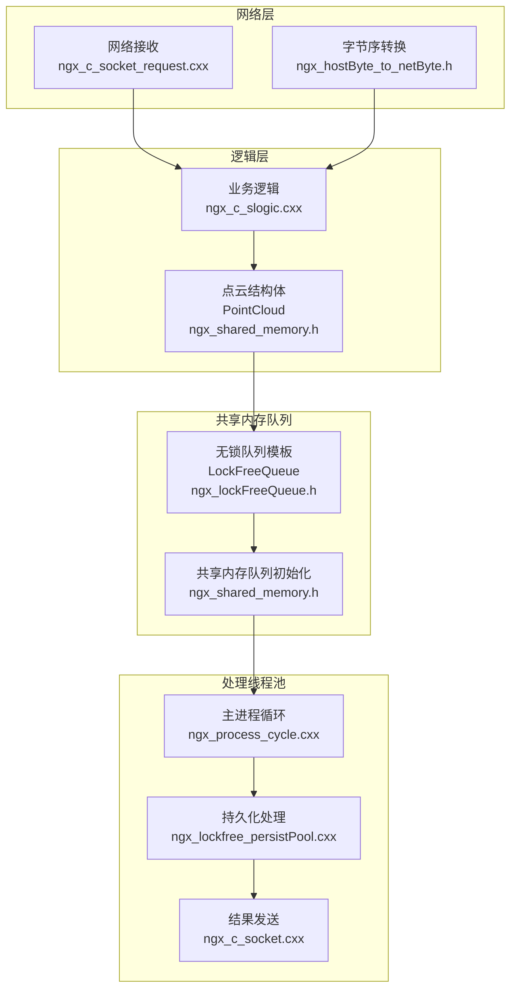
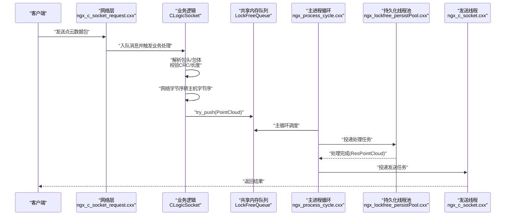
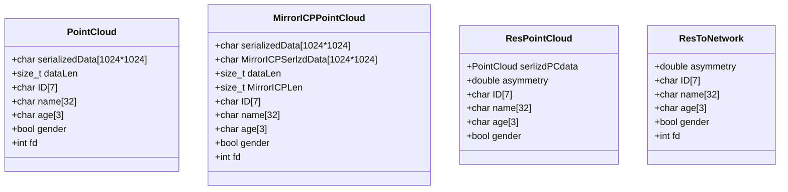
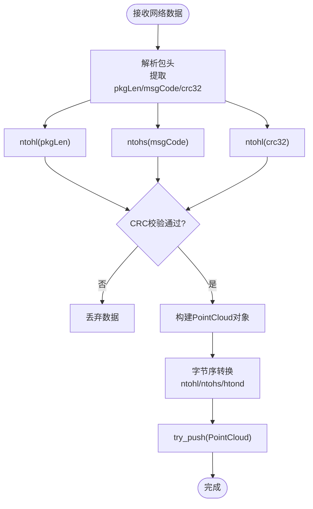
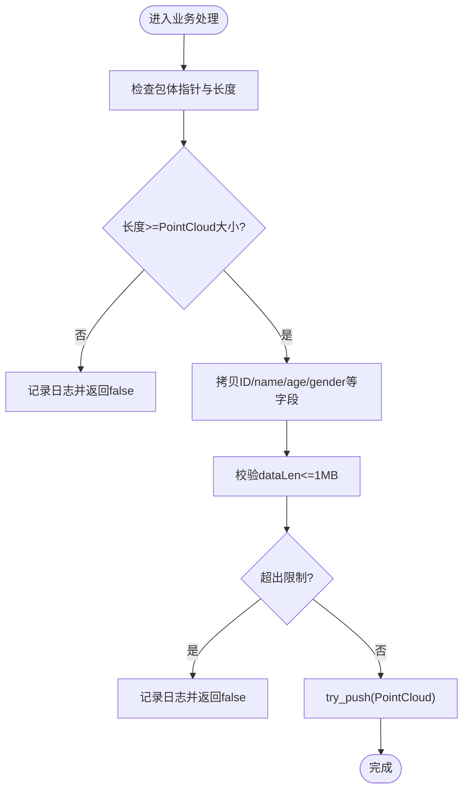
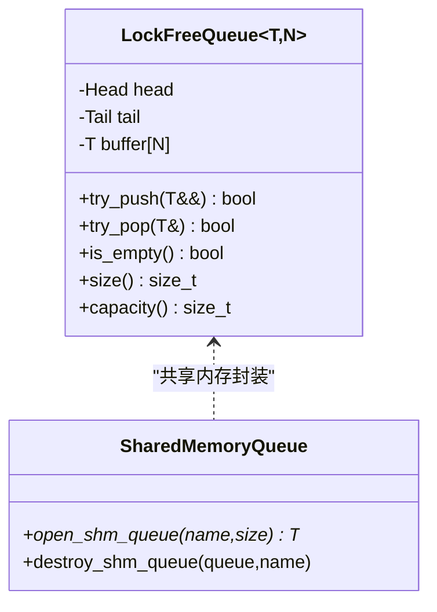
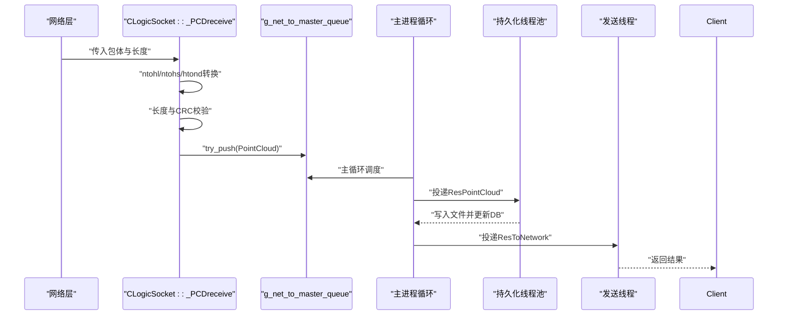
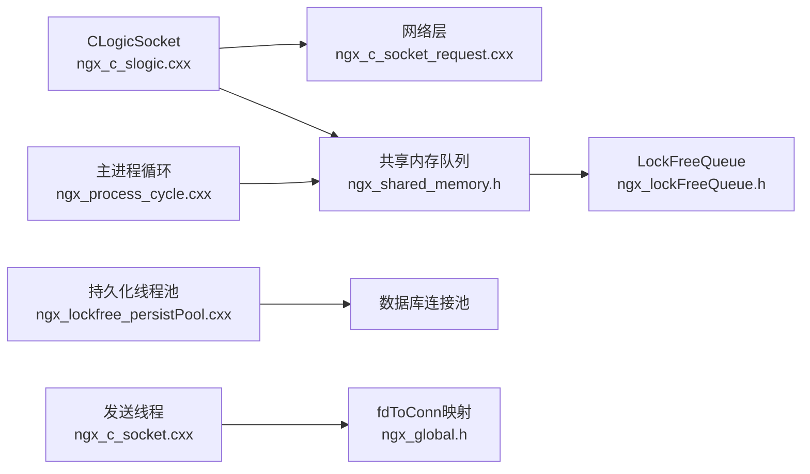

# 点云数据处理

<cite>
**本文档引用的文件**
- [ngx_c_slogic.h](file://include/ngx_c_slogic.h)
- [ngx_c_slogic.cxx](file://logic/ngx_c_slogic.cxx)
- [ngx_lockFreeQueue.h](file://include/ngx_lockFreeQueue.h)
- [ngx_hostByte_to_netByte.h](file://include/ngx_hostByte_to_netByte.h)
- [ngx_c_socket_request.cxx](file://net/ngx_c_socket_request.cxx)
- [ngx_shared_memory.h](file://include/ngx_shared_memory.h)
- [ngx_global.h](file://include/ngx_global.h)
- [ngx_lockfree_persistPool.cxx](file://misc/ngx_lockfree_persistPool.cxx)
- [ngx_process_cycle.cxx](file://proc/ngx_process_cycle.cxx)
- [ngx_c_socket.cxx](file://net/ngx_c_socket.cxx)
</cite>

## 目录
1. [简介](#简介)
2. [项目结构](#项目结构)
3. [核心组件](#核心组件)
4. [架构总览](#架构总览)
5. [详细组件分析](#详细组件分析)
6. [依赖关系分析](#依赖关系分析)
7. [性能考量](#性能考量)
8. [故障排查指南](#故障排查指南)
9. [结论](#结论)

## 简介
本文件面向点云数据处理功能，系统性阐述从网络接收、解析、校验、到队列投递与后续处理的完整流程。重点涵盖：
- 点云数据格式与结构体设计（PointCloud）
- 网络字节序与主机字节序转换机制
- 数据长度验证与安全检查
- 线程安全队列（LockFreeQueue）的使用与满队列策略
- 错误处理与异常情况处置
- 端到端处理流程图与关键代码路径

## 项目结构
该项目采用分层架构，围绕网络层、逻辑层、线程池与共享内存队列展开，形成“网络接收 → 业务逻辑 → 多级无锁队列 → 处理线程池 → 持久化/返回”的流水线。

图表来源
- [ngx_c_socket_request.cxx](file://net/ngx_c_socket_request.cxx#L25-L114)
- [ngx_c_slogic.cxx](file://logic/ngx_c_slogic.cxx#L190-L243)
- [ngx_shared_memory.h](file://include/ngx_shared_memory.h#L24-L63)
- [ngx_lockFreeQueue.h](file://include/ngx_lockFreeQueue.h#L4-L150)
- [ngx_process_cycle.cxx](file://proc/ngx_process_cycle.cxx#L38-L860)
- [ngx_c_socket.cxx](file://net/ngx_c_socket.cxx#L876-L898)

章节来源
- [ngx_c_socket_request.cxx](file://net/ngx_c_socket_request.cxx#L25-L114)
- [ngx_c_slogic.cxx](file://logic/ngx_c_slogic.cxx#L190-L243)
- [ngx_shared_memory.h](file://include/ngx_shared_memory.h#L24-L63)
- [ngx_lockFreeQueue.h](file://include/ngx_lockFreeQueue.h#L4-L150)
- [ngx_process_cycle.cxx](file://proc/ngx_process_cycle.cxx#L38-L860)
- [ngx_c_socket.cxx](file://net/ngx_c_socket.cxx#L876-L898)

## 核心组件
- 点云结构体PointCloud：承载序列化点云数据、元信息与连接标识，用于跨进程/线程传递。
- 无锁队列LockFreeQueue：基于环形缓冲区与CAS的高性能无锁队列，支持多生产者/多消费者。
- 业务逻辑类CLogicSocket：负责网络数据包解析、校验、字节序转换与队列投递。
- 共享内存队列初始化：通过共享内存创建多条无锁队列，实现进程间高效通信。
- 处理线程池与主循环：主进程循环调度各阶段队列，处理线程池执行具体算法与持久化。

章节来源
- [ngx_shared_memory.h](file://include/ngx_shared_memory.h#L24-L63)
- [ngx_lockFreeQueue.h](file://include/ngx_lockFreeQueue.h#L4-L150)
- [ngx_c_slogic.cxx](file://logic/ngx_c_slogic.cxx#L190-L243)
- [ngx_process_cycle.cxx](file://proc/ngx_process_cycle.cxx#L38-L860)

## 架构总览
点云数据处理采用“网络接收 → 业务逻辑解析 → 无锁队列投递 → 多阶段处理 → 结果返回”的流水线架构。网络层负责收包与状态机推进，逻辑层完成包体解析与安全校验，随后将PointCloud对象投递到共享内存队列，由主进程循环调度到各处理线程池，最终将结果返回给客户端。

图表来源
- [ngx_c_socket_request.cxx](file://net/ngx_c_socket_request.cxx#L214-L233)
- [ngx_c_slogic.cxx](file://logic/ngx_c_slogic.cxx#L190-L243)
- [ngx_lockFreeQueue.h](file://include/ngx_lockFreeQueue.h#L50-L99)
- [ngx_process_cycle.cxx](file://proc/ngx_process_cycle.cxx#L467-L860)
- [ngx_lockfree_persistPool.cxx](file://misc/ngx_lockfree_persistPool.cxx#L12-L31)
- [ngx_c_socket.cxx](file://net/ngx_c_socket.cxx#L876-L898)

## 详细组件分析

### 点云结构体PointCloud设计与使用
PointCloud用于在网络与处理线程之间传递点云数据，包含：
- serializedData：序列化后的点云数据缓冲区（最大1MB）
- dataLen：实际数据长度
- ID/name/age/gender：用户标识与基础信息
- fd：连接标识，便于结果返回

图表来源
- [ngx_shared_memory.h](file://include/ngx_shared_memory.h#L24-L63)

章节来源
- [ngx_shared_memory.h](file://include/ngx_shared_memory.h#L24-L63)

### 网络字节序与主机字节序转换机制
- 网络序转主机序：使用ntohl/ntohs/ntohd等函数处理包头中的长度、消息码与双精度数值。
- 主机序转网络序：使用htons/htonl/自定义htond处理发送侧数据。
- 自定义双精度转换：提供htond/ntohd内联函数，通过位操作实现字节序翻转。

图表来源
- [ngx_c_slogic.cxx](file://logic/ngx_c_slogic.cxx#L77-L129)
- [ngx_c_slogic.cxx](file://logic/ngx_c_slogic.cxx#L190-L243)
- [ngx_hostByte_to_netByte.h](file://include/ngx_hostByte_to_netByte.h#L4-L19)

章节来源
- [ngx_c_slogic.cxx](file://logic/ngx_c_slogic.cxx#L77-L129)
- [ngx_c_slogic.cxx](file://logic/ngx_c_slogic.cxx#L190-L243)
- [ngx_hostByte_to_netByte.h](file://include/ngx_hostByte_to_netByte.h#L4-L19)

### 数据长度验证与安全检查
- 包体长度校验：确保包体长度不小于PointCloud最小结构体大小。
- dataLen边界检查：限制最大1MB，防止内存溢出。
- CRC校验：计算包体CRC并与包头CRC对比，不一致则丢弃。
- 连接有效性：校验连接序列号，断开连接的包直接丢弃。
- 消息码合法性：消息码越界或无处理函数则丢弃。

图表来源
- [ngx_c_slogic.cxx](file://logic/ngx_c_slogic.cxx#L190-L243)

章节来源
- [ngx_c_slogic.cxx](file://logic/ngx_c_slogic.cxx#L190-L243)

### 线程安全队列的使用与满队列策略
- LockFreeQueue实现：环形缓冲区 + 原子指针 + compare_exchange_weak重试 + 缓存行对齐。
- try_push返回值：满队列返回false，调用方应丢弃数据或重试。
- 主进程循环：主循环在各阶段队列间调度，遇到目标队列高负载时回退或限速重试。
- 共享内存队列：通过open_shm_queue创建多条队列，实现进程间通信。

图表来源
- [ngx_lockFreeQueue.h](file://include/ngx_lockFreeQueue.h#L4-L150)
- [ngx_shared_memory.h](file://include/ngx_shared_memory.h#L87-L160)

章节来源
- [ngx_lockFreeQueue.h](file://include/ngx_lockFreeQueue.h#L4-L150)
- [ngx_shared_memory.h](file://include/ngx_shared_memory.h#L87-L160)
- [ngx_process_cycle.cxx](file://proc/ngx_process_cycle.cxx#L401-L464)

### 点云数据处理完整流程（从接收到底层存储）
1. 网络层接收数据包，推进状态机，组装消息头+包头+包体。
2. 业务逻辑线程调用threadRecvProcFunc，解析包头并校验CRC。
3. CLogicSocket::_PCDreceive解析PointCloud，进行字节序转换与长度校验。
4. 将PointCloud对象try_push到g_net_to_master_queue。
5. 主进程循环调度到后续处理线程池（镜像ICP/不对称度计算/持久化）。
6. 持久化线程池将点云数据写入文件并更新数据库记录。
7. 发送线程从结果队列取出数据，通过fdToConn映射回客户端连接并返回结果。

图表来源
- [ngx_c_slogic.cxx](file://logic/ngx_c_slogic.cxx#L190-L243)
- [ngx_process_cycle.cxx](file://proc/ngx_process_cycle.cxx#L467-L860)
- [ngx_lockfree_persistPool.cxx](file://misc/ngx_lockfree_persistPool.cxx#L52-L146)
- [ngx_c_socket.cxx](file://net/ngx_c_socket.cxx#L876-L898)

章节来源
- [ngx_c_slogic.cxx](file://logic/ngx_c_slogic.cxx#L190-L243)
- [ngx_process_cycle.cxx](file://proc/ngx_process_cycle.cxx#L467-L860)
- [ngx_lockfree_persistPool.cxx](file://misc/ngx_lockfree_persistPool.cxx#L52-L146)
- [ngx_c_socket.cxx](file://net/ngx_c_socket.cxx#L876-L898)

## 依赖关系分析
- CLogicSocket依赖网络层的包解析与内存管理，依赖共享内存队列进行跨进程通信。
- 无锁队列模板依赖原子操作与内存序语义，确保多线程安全。
- 主进程循环依赖多条共享内存队列，实现负载监控与动态调度。
- 持久化线程池依赖数据库连接池与文件系统，实现数据落盘与索引更新。

图表来源
- [ngx_c_slogic.cxx](file://logic/ngx_c_slogic.cxx#L190-L243)
- [ngx_c_socket_request.cxx](file://net/ngx_c_socket_request.cxx#L214-L233)
- [ngx_shared_memory.h](file://include/ngx_shared_memory.h#L87-L160)
- [ngx_lockFreeQueue.h](file://include/ngx_lockFreeQueue.h#L4-L150)
- [ngx_process_cycle.cxx](file://proc/ngx_process_cycle.cxx#L38-L860)
- [ngx_lockfree_persistPool.cxx](file://misc/ngx_lockfree_persistPool.cxx#L52-L146)
- [ngx_c_socket.cxx](file://net/ngx_c_socket.cxx#L876-L898)
- [ngx_global.h](file://include/ngx_global.h#L44)

章节来源
- [ngx_c_slogic.cxx](file://logic/ngx_c_slogic.cxx#L190-L243)
- [ngx_c_socket_request.cxx](file://net/ngx_c_socket_request.cxx#L214-L233)
- [ngx_shared_memory.h](file://include/ngx_shared_memory.h#L87-L160)
- [ngx_lockFreeQueue.h](file://include/ngx_lockFreeQueue.h#L4-L150)
- [ngx_process_cycle.cxx](file://proc/ngx_process_cycle.cxx#L38-L860)
- [ngx_lockfree_persistPool.cxx](file://misc/ngx_lockfree_persistPool.cxx#L52-L146)
- [ngx_c_socket.cxx](file://net/ngx_c_socket.cxx#L876-L898)
- [ngx_global.h](file://include/ngx_global.h#L44)

## 性能考量
- 无锁队列：通过compare_exchange_weak与内存序（release/acquire）实现高并发下的低争用，避免线程阻塞与上下文切换开销。
- 缓存行对齐：Head/Tail结构体按64字节对齐，降低伪共享带来的性能损耗。
- 负载监控与限流：主进程循环周期性监控队列负载，遇到高负载时回退或指数退避重试，保障系统稳定性。
- 字节序转换：使用内联函数与位操作，减少函数调用开销，提高处理速度。

[本节为通用性能讨论，不直接分析具体文件]

## 故障排查指南
- 接收端丢弃数据
  - CRC错误：检查包体CRC计算与网络传输完整性。
  - 长度不足：确认客户端发送的包体长度不小于PointCloud最小结构体大小。
  - dataLen超限：确认点云数据未超过1MB限制。
  - 消息码非法：检查消息码是否在有效范围内且存在对应处理函数。
- 队列满导致丢弃
  - try_push返回false：检查主进程循环调度频率与下游处理能力，必要时扩容线程池或增大队列容量。
  - 高负载模式：关注主进程循环的负载监控日志，评估系统瓶颈。
- 发送失败
  - fd无效：检查fdToConn映射是否正确，确保连接未断开。
  - 发送缓冲区满：等待EPOLLOUT事件后重试，避免阻塞。
- 持久化失败
  - 文件写入失败：检查磁盘空间与权限，确认临时文件与最终文件路径。
  - 数据库事务失败：查看回滚日志，定位SQL执行错误并修正。

章节来源
- [ngx_c_slogic.cxx](file://logic/ngx_c_slogic.cxx#L190-L243)
- [ngx_process_cycle.cxx](file://proc/ngx_process_cycle.cxx#L401-L464)
- [ngx_c_socket.cxx](file://net/ngx_c_socket.cxx#L876-L898)
- [ngx_lockfree_persistPool.cxx](file://misc/ngx_lockfree_persistPool.cxx#L52-L146)

## 结论
本系统通过严谨的结构体设计、完善的字节序转换与安全校验、以及高效的无锁队列与主进程调度，实现了高吞吐、低延迟的点云数据处理流水线。在面对高并发与大数据量时，建议结合负载监控与限流策略，持续优化队列容量与线程池规模，确保系统稳定运行。