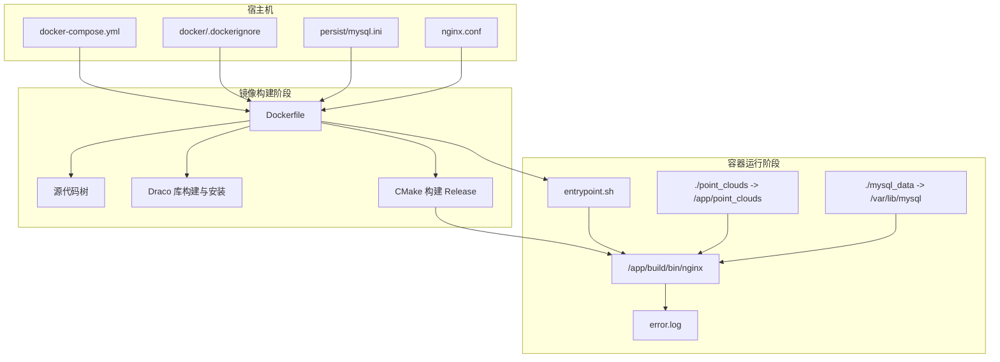
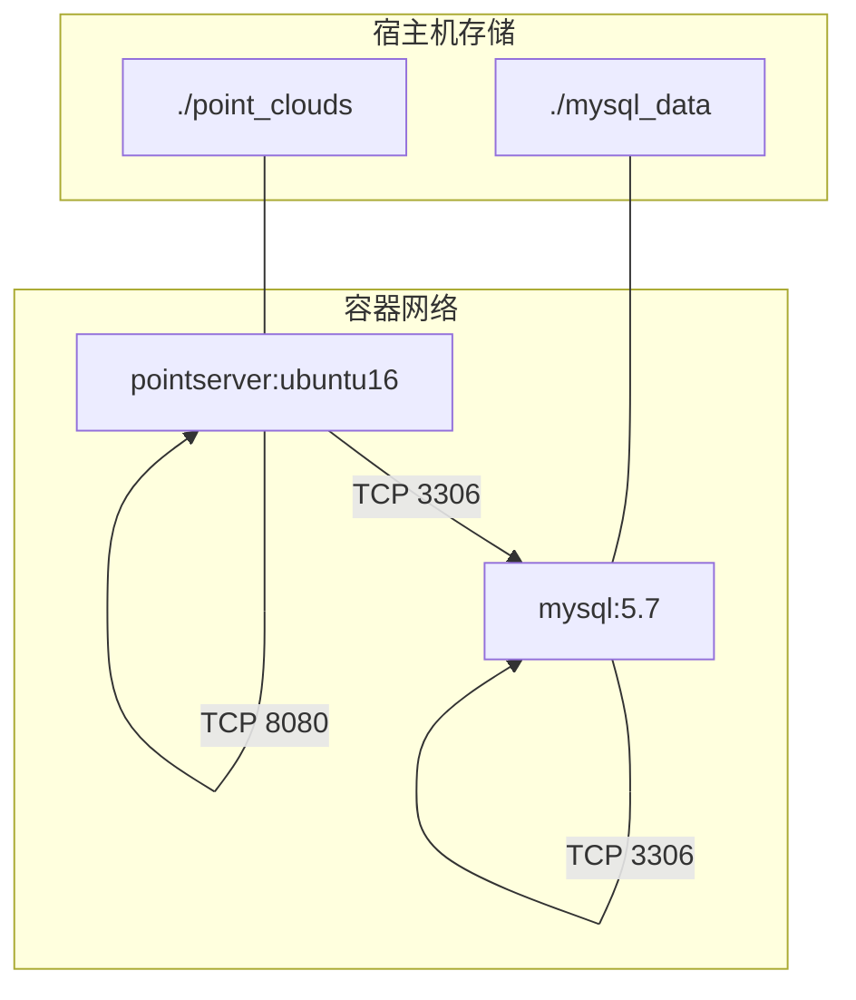
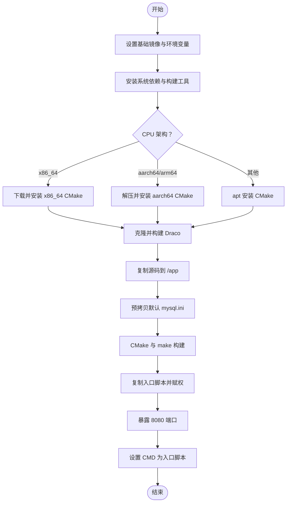
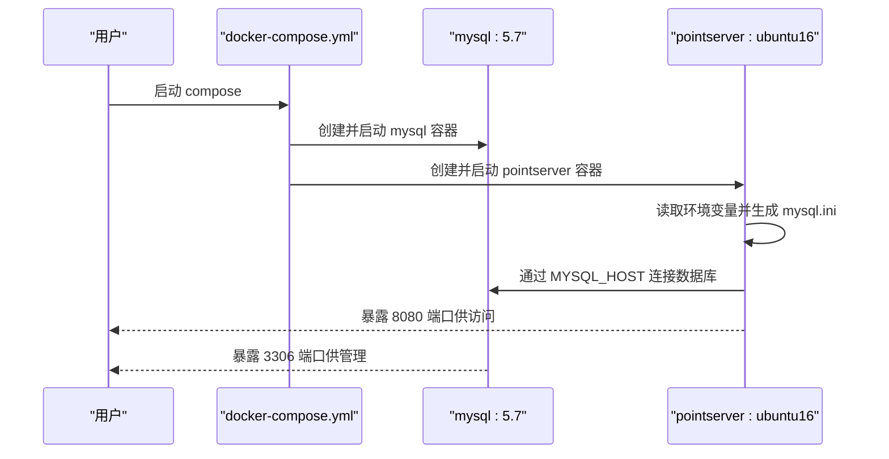
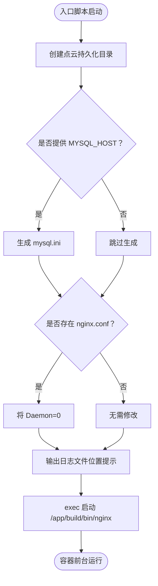
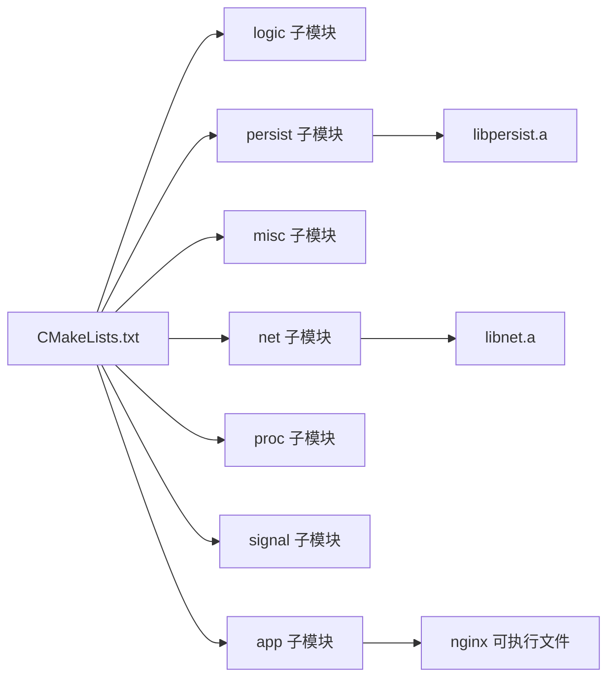
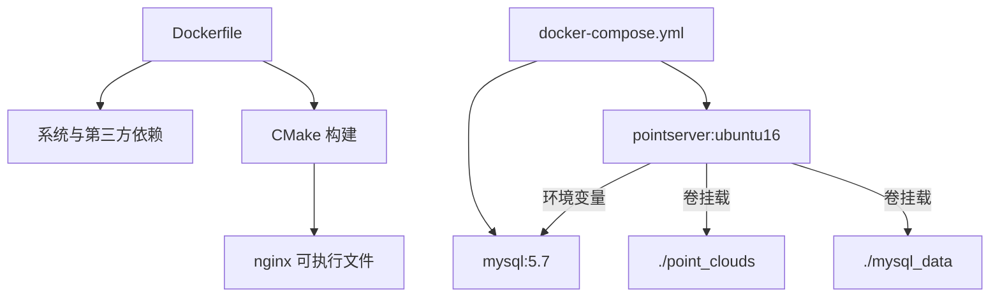

# 容器化部署

<cite>
**本文引用的文件**
- [Dockerfile](file://Dockerfile)
- [docker-compose.yml](file://docker-compose.yml)
- [.dockerignore](file://.dockerignore)
- [docker/entrypoint.sh](file://docker/entrypoint.sh)
- [persist/mysql.ini](file://persist/mysql.ini)
- [CMakeLists.txt](file://CMakeLists.txt)
- [app/CMakeLists.txt](file://app/CMakeLists.txt)
- [persist/CMakeLists.txt](file://persist/CMakeLists.txt)
- [net/CMakeLists.txt](file://net/CMakeLists.txt)
- [nginx.conf](file://nginx.conf)
</cite>

## 目录
1. [简介](#简介)
2. [项目结构](#项目结构)
3. [核心组件](#核心组件)
4. [架构总览](#架构总览)
5. [详细组件分析](#详细组件分析)
6. [依赖分析](#依赖分析)
7. [性能考虑](#性能考虑)
8. [故障排查指南](#故障排查指南)
9. [结论](#结论)
10. [附录](#附录)

## 简介
本文件面向容器化部署场景，围绕该工程的 Docker 镜像构建、docker-compose 编排、环境配置与运行时行为进行全面说明。重点覆盖以下方面：
- Docker 镜像构建流程与参数控制（如并行编译线程数、CMake 版本选择、第三方库安装与构建）
- docker-compose 服务编排（服务定义、网络与卷挂载、服务间依赖）
- 运行时环境变量注入与配置生成（入口脚本如何根据环境变量生成配置文件）
- 不同环境下的部署示例（开发、测试、生产）
- 容器化优势与注意事项（资源限制、健康检查、日志收集）
- 镜像优化、安全配置与生产最佳实践
- 故障排查与运维监控方法

## 项目结构
该项目是一个基于 CMake 的 C++ 工程，目标产物为名为 nginx 的可执行文件，同时包含 MySQL 连接池与网络模块等子模块。容器化部署通过 Dockerfile 和 docker-compose.yml 实现，入口脚本负责在容器启动时生成运行所需配置并以前台模式启动主程序。

图表来源
- [Dockerfile](file://Dockerfile#L1-L65)
- [docker-compose.yml](file://docker-compose.yml#L1-L36)
- [.dockerignore](file://.dockerignore#L1-L21)
- [persist/mysql.ini](file://persist/mysql.ini#L1-L13)
- [nginx.conf](file://nginx.conf#L1-L63)
- [docker/entrypoint.sh](file://docker/entrypoint.sh#L1-L45)

章节来源
- [Dockerfile](file://Dockerfile#L1-L65)
- [docker-compose.yml](file://docker-compose.yml#L1-L36)
- [.dockerignore](file://.dockerignore#L1-L21)
- [persist/mysql.ini](file://persist/mysql.ini#L1-L13)
- [nginx.conf](file://nginx.conf#L1-L63)
- [docker/entrypoint.sh](file://docker/entrypoint.sh#L1-L45)

## 核心组件
- Dockerfile：定义基础镜像、依赖安装、CMake 版本安装、Draco 库构建、源码复制与构建、暴露端口与入口命令。
- docker-compose.yml：定义 mysql 与 pointserver 两个服务，设置环境变量、端口映射、卷挂载与服务依赖。
- .dockerignore：排除构建无关文件，减少上下文大小与构建时间。
- docker/entrypoint.sh：容器启动时生成 mysql.ini、修正 nginx.conf 的守护进程配置、以前台模式启动主程序。
- persist/mysql.ini：默认数据库连接池配置模板，可在容器启动时被入口脚本覆盖。
- nginx.conf：应用配置文件，包含日志、进程、网络、安全等参数。
- CMake 构建系统：顶层 CMakeLists.txt 组织子模块，app/CMakeLists.txt 生成可执行文件，persist/net 等子模块提供静态库。

章节来源
- [Dockerfile](file://Dockerfile#L1-L65)
- [docker-compose.yml](file://docker-compose.yml#L1-L36)
- [.dockerignore](file://.dockerignore#L1-L21)
- [docker/entrypoint.sh](file://docker/entrypoint.sh#L1-L45)
- [persist/mysql.ini](file://persist/mysql.ini#L1-L13)
- [nginx.conf](file://nginx.conf#L1-L63)
- [CMakeLists.txt](file://CMakeLists.txt#L1-L68)
- [app/CMakeLists.txt](file://app/CMakeLists.txt#L1-L29)
- [persist/CMakeLists.txt](file://persist/CMakeLists.txt#L1-L20)
- [net/CMakeLists.txt](file://net/CMakeLists.txt#L1-L14)

## 架构总览
下图展示了容器化部署的整体架构：docker-compose 启动 mysql 与 pointserver 两个容器，pointserver 通过环境变量连接 mysql，并将点云数据与 MySQL 数据持久化到宿主机目录。

图表来源
- [docker-compose.yml](file://docker-compose.yml#L1-L36)

章节来源
- [docker-compose.yml](file://docker-compose.yml#L1-L36)

## 详细组件分析

### Dockerfile 分析
- 基础镜像与环境变量
  - 使用 Ubuntu 16.04 作为基础镜像，设置非交互式安装以避免安装过程中的交互。
  - 通过 ARG 控制并行编译线程数，避免在低内存环境下触发 OOM。
- 依赖安装
  - 安装构建工具链、MySQL 开发头文件、PCL、Eigen、Boost、FLANN、VTK 等依赖。
  - 按 CPU 架构选择合适的 CMake 安装方式（x86_64 或 aarch64），否则回退到 apt 安装。
- 第三方库安装
  - 克隆并构建 Draco，启用位置无关代码与共享库，安装至系统并更新动态链接缓存。
- 构建流程
  - 复制源码至 /app，预拷贝默认 mysql.ini 到工作目录，进入 /app/build 执行 CMake 与 make。
- 运行时
  - 复制入口脚本并赋予执行权限，暴露 8080 端口，CMD 指向入口脚本。

图表来源
- [Dockerfile](file://Dockerfile#L1-L65)

章节来源
- [Dockerfile](file://Dockerfile#L1-L65)

### docker-compose 编排分析
- 服务定义
  - mysql：使用官方 mysql:5.7 镜像，设置根密码与数据库名称，挂载 ./mysql_data 至 /var/lib/mysql，映射 3306 端口。
  - pointserver：基于当前目录构建镜像，设置容器名与环境变量，依赖 mysql，映射 8080 端口，挂载 ./point_clouds 至 /app/point_clouds。
- 环境变量
  - MYSQL_HOST/MYSQL_PORT/MYSQL_USER/MYSQL_PASSWORD/MYSQL_DBNAME/MYSQL_INIT_SIZE/MYSQL_MAX_SIZE 等用于驱动入口脚本生成 mysql.ini。
- 卷挂载
  - 点云数据目录与 MySQL 数据目录持久化到宿主机，便于重启与备份。
- 可选配置挂载
  - 注释掉的示例展示了如何挂载自定义 nginx.conf 与 mysql.ini 到容器内只读。

图表来源
- [docker-compose.yml](file://docker-compose.yml#L1-L36)
- [docker/entrypoint.sh](file://docker/entrypoint.sh#L1-L45)

章节来源
- [docker-compose.yml](file://docker-compose.yml#L1-L36)
- [docker/entrypoint.sh](file://docker/entrypoint.sh#L1-L45)

### 入口脚本（entrypoint.sh）分析
- 目录准备
  - 确保 /app/point_clouds 与临时目录存在。
- 配置生成
  - 若提供 MYSQL_HOST 等环境变量，入口脚本会生成 mysql.ini，包含数据库地址、端口、账号、密码、初始连接数、最大连接数、最大空闲时间、连接超时等。
- 容器前台运行
  - 若存在 /app/nginx.conf，强制将 Daemon 设为 0，确保容器以前台模式运行，便于日志采集与进程管理。
- 日志提示
  - 提示日志文件位于 error.log（相对于 /app）。
- 启动主程序
  - exec 启动 /app/build/bin/nginx，使容器生命周期与主程序绑定。

图表来源
- [docker/entrypoint.sh](file://docker/entrypoint.sh#L1-L45)
- [persist/mysql.ini](file://persist/mysql.ini#L1-L13)
- [nginx.conf](file://nginx.conf#L1-L63)

章节来源
- [docker/entrypoint.sh](file://docker/entrypoint.sh#L1-L45)
- [persist/mysql.ini](file://persist/mysql.ini#L1-L13)
- [nginx.conf](file://nginx.conf#L1-L63)

### 配置文件与构建系统
- persist/mysql.ini
  - 默认数据库连接池配置，包含 IP、端口、用户名、密码、数据库名、初始连接数、最大连接数、最大空闲时间、连接超时等字段。
- nginx.conf
  - 应用配置文件，包含日志、进程、网络、安全等参数，例如日志文件名、日志等级、工作进程数、守护进程开关、监听端口、连接数、心跳与超时、防刷机制等。
- CMake 构建系统
  - 顶层 CMakeLists.txt 设置 C++11 标准、查找 MySQL、PCL、Draco 等依赖，组织子模块顺序，最终链接生成 nginx 可执行文件。
  - app/CMakeLists.txt 生成 nginx 可执行文件并设置输出目录。
  - persist/CMakeLists.txt 生成静态库 persist 并链接 MySQL 与 Draco。
  - net/CMakeLists.txt 生成静态库 net。

图表来源
- [CMakeLists.txt](file://CMakeLists.txt#L1-L68)
- [app/CMakeLists.txt](file://app/CMakeLists.txt#L1-L29)
- [persist/CMakeLists.txt](file://persist/CMakeLists.txt#L1-L20)
- [net/CMakeLists.txt](file://net/CMakeLists.txt#L1-L14)

章节来源
- [persist/mysql.ini](file://persist/mysql.ini#L1-L13)
- [nginx.conf](file://nginx.conf#L1-L63)
- [CMakeLists.txt](file://CMakeLists.txt#L1-L68)
- [app/CMakeLists.txt](file://app/CMakeLists.txt#L1-L29)
- [persist/CMakeLists.txt](file://persist/CMakeLists.txt#L1-L20)
- [net/CMakeLists.txt](file://net/CMakeLists.txt#L1-L14)

## 依赖分析
- 镜像构建期依赖
  - Ubuntu 16.04 基础镜像、构建工具链、MySQL 开发头文件、PCL/Eigen/Boost/FLANN/VTK、CMake、Draco。
- 运行期依赖
  - MySQL 服务器（通过环境变量连接）、点云持久化目录、日志文件输出。
- 服务间依赖
  - pointserver 依赖 mysql 容器先启动并就绪，compose 中通过 depends_on 实现顺序启动。
- 配置依赖
  - 入口脚本根据环境变量生成 mysql.ini；若宿主机挂载了自定义 nginx.conf，则入口脚本会将其改为前台运行。

图表来源
- [Dockerfile](file://Dockerfile#L1-L65)
- [docker-compose.yml](file://docker-compose.yml#L1-L36)

章节来源
- [Dockerfile](file://Dockerfile#L1-L65)
- [docker-compose.yml](file://docker-compose.yml#L1-L36)

## 性能考虑
- 并行编译控制
  - 通过 MAKE_JOBS 参数限制并行编译线程数，避免在低内存容器或 CI 环境中触发 OOM。
- CMake 版本选择
  - 针对不同 CPU 架构选择合适 CMake 安装方式，保证构建稳定性与性能。
- 第三方库构建
  - 采用 Release 构建类型与位置无关代码，提升运行时兼容性与加载效率。
- 端口与网络
  - nginx.conf 中的 worker_connections、ListenPort0 等参数影响并发连接能力，应结合业务负载调整。
- 资源限制建议
  - 在 docker-compose 中为 pointserver 设置内存与 CPU 限制，防止突发流量导致 OOM。
- 日志轮转
  - 将日志输出到 stdout/stderr 并配合外部日志收集系统，避免容器内日志文件过大。

章节来源
- [Dockerfile](file://Dockerfile#L3-L5)
- [Dockerfile](file://Dockerfile#L19-L35)
- [Dockerfile](file://Dockerfile#L53-L57)
- [nginx.conf](file://nginx.conf#L36-L40)
- [docker-compose.yml](file://docker-compose.yml#L15-L36)

## 故障排查指南
- 启动失败（容器退出）
  - 检查入口脚本是否正确生成 mysql.ini，确认环境变量是否完整。
  - 确认 nginx.conf 是否被修改为前台运行（Daemon=0）。
  - 查看 error.log 输出位置与权限。
- 数据库连接问题
  - 确认 MYSQL_HOST 指向正确的服务名（compose 中为 mysql），端口、账号、密码与数据库名一致。
  - 检查 MySQL 容器是否已初始化完成且数据卷已挂载。
- 端口占用
  - 确认宿主机 8080 与 3306 未被占用，或在 compose 中调整映射端口。
- 权限与路径
  - 确认 /app/point_clouds 与 /app/mysql.ini 的写入权限，必要时在宿主机上创建目录并赋权。
- 日志收集
  - 将日志输出到 stdout/stderr，或通过卷挂载到宿主机统一收集。
- 健康检查
  - 在 compose 中添加 healthcheck，探测 8080 端口与内部健康接口，实现自动重启与监控告警。

章节来源
- [docker/entrypoint.sh](file://docker/entrypoint.sh#L1-L45)
- [persist/mysql.ini](file://persist/mysql.ini#L1-L13)
- [docker-compose.yml](file://docker-compose.yml#L1-L36)
- [nginx.conf](file://nginx.conf#L1-L63)

## 结论
该容器化方案通过 Dockerfile 明确构建流程与依赖安装，通过 docker-compose 实现服务编排与持久化配置，入口脚本在运行时根据环境变量生成配置并以前台模式启动主程序，满足开发、测试与生产的多样化需求。建议在生产环境中增加资源限制、健康检查与日志轮转策略，确保系统的稳定性与可观测性。

## 附录

### 部署示例（不同环境）
- 开发环境
  - 使用 docker-compose 启动，默认挂载 ./point_clouds 与 ./mysql_data，便于本地调试。
  - 如需自定义配置，取消注释卷挂载示例，将宿主机的 nginx.conf 与 mysql.ini 挂载到容器内只读。
- 测试环境
  - 在 compose 中设置更严格的资源限制（CPU/内存），并开启健康检查。
  - 使用独立的网络与数据卷，避免与其他服务冲突。
- 生产环境
  - 使用只读文件系统与最小权限原则，将敏感配置通过密钥管理服务注入。
  - 配置日志轮转与集中化日志收集，设置告警阈值与自动扩缩容策略。

### 容器化优势与注意事项
- 优势
  - 环境一致性、快速部署、易于扩展与回滚。
- 注意事项
  - 资源限制与健康检查不可省略。
  - 配置注入与密钥管理必须安全可靠。
  - 日志与监控必须前置规划。

### 镜像优化与安全配置
- 镜像优化
  - 使用 .dockerignore 排除构建无关文件，减小镜像体积。
  - 多阶段构建（可选）分离构建与运行时镜像，进一步瘦身。
- 安全配置
  - 使用非 root 用户运行（需确保日志与卷权限），启用只读根文件系统。
  - 限制网络访问与端口暴露，仅开放必要端口。
  - 使用只读配置卷与密钥注入，避免明文配置写入镜像。

### 生产最佳实践
- 健康检查
  - 在 compose 中添加 healthcheck，探测应用内部健康接口或端口连通性。
- 资源限制
  - 为 pointserver 设置 memory limit 与 cpu quota，防止资源争抢。
- 日志与监控
  - 将日志输出到 stdout/stderr，接入集中式日志系统。
  - 配置指标采集与告警，关注连接数、错误率、响应时间等关键指标。
- 配置管理
  - 使用环境变量与配置中心注入敏感信息，避免硬编码。
  - 支持热更新的配置文件挂载，减少停机时间。