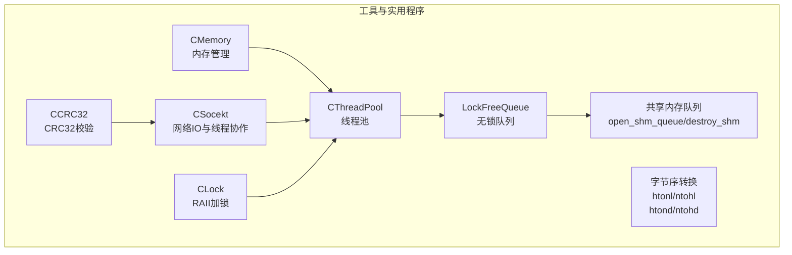
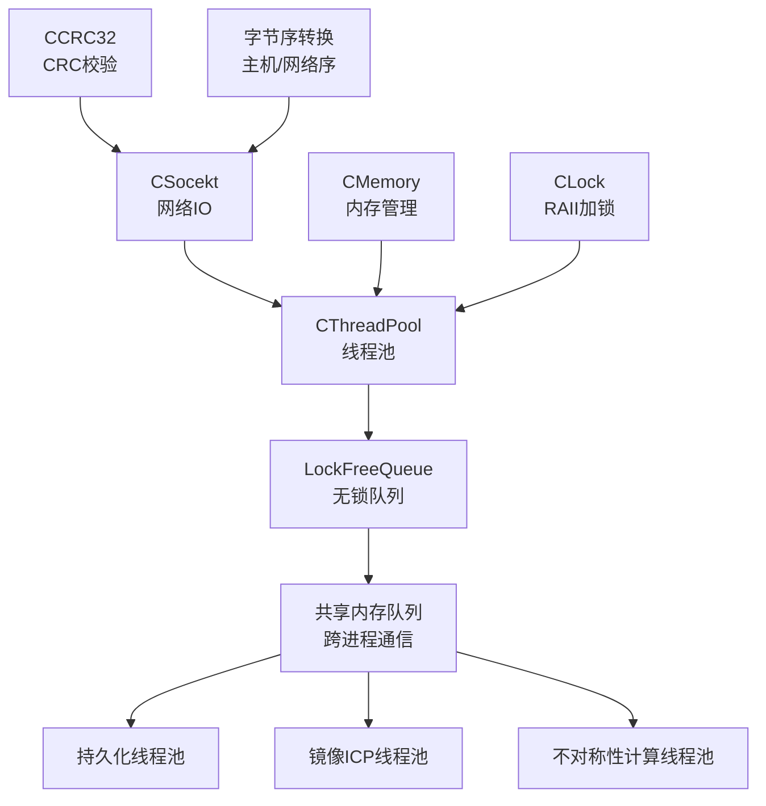
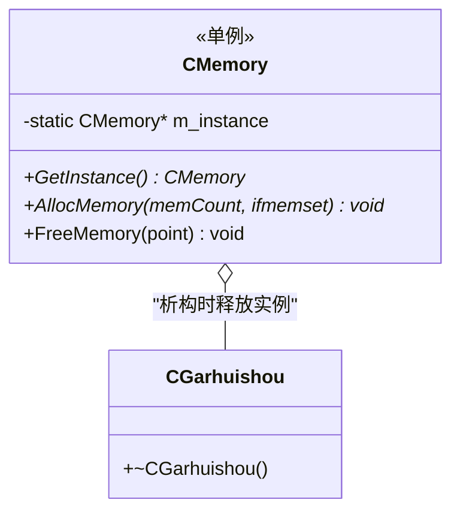
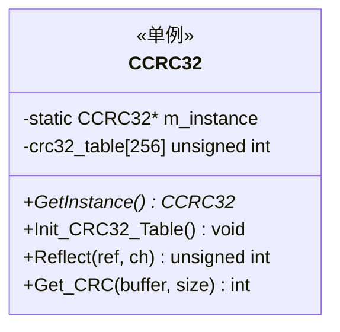
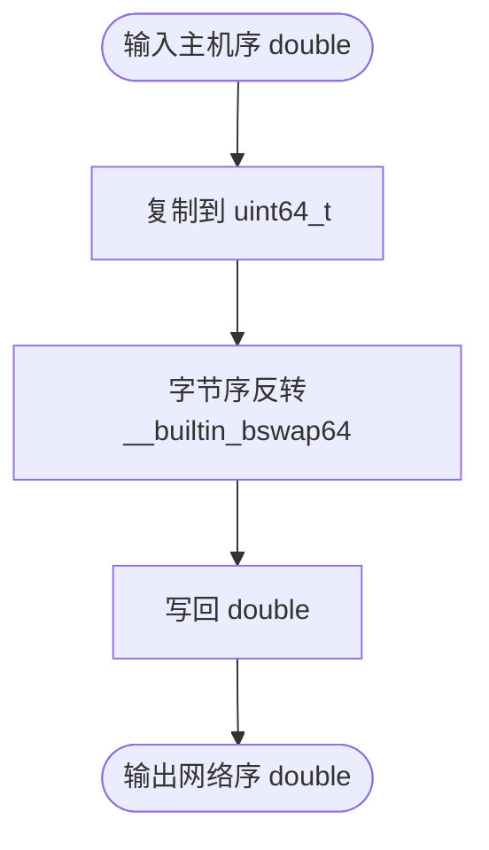
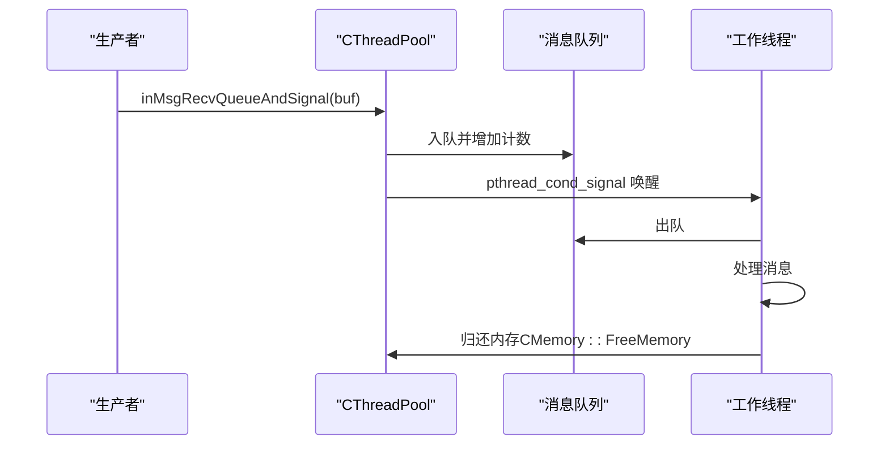
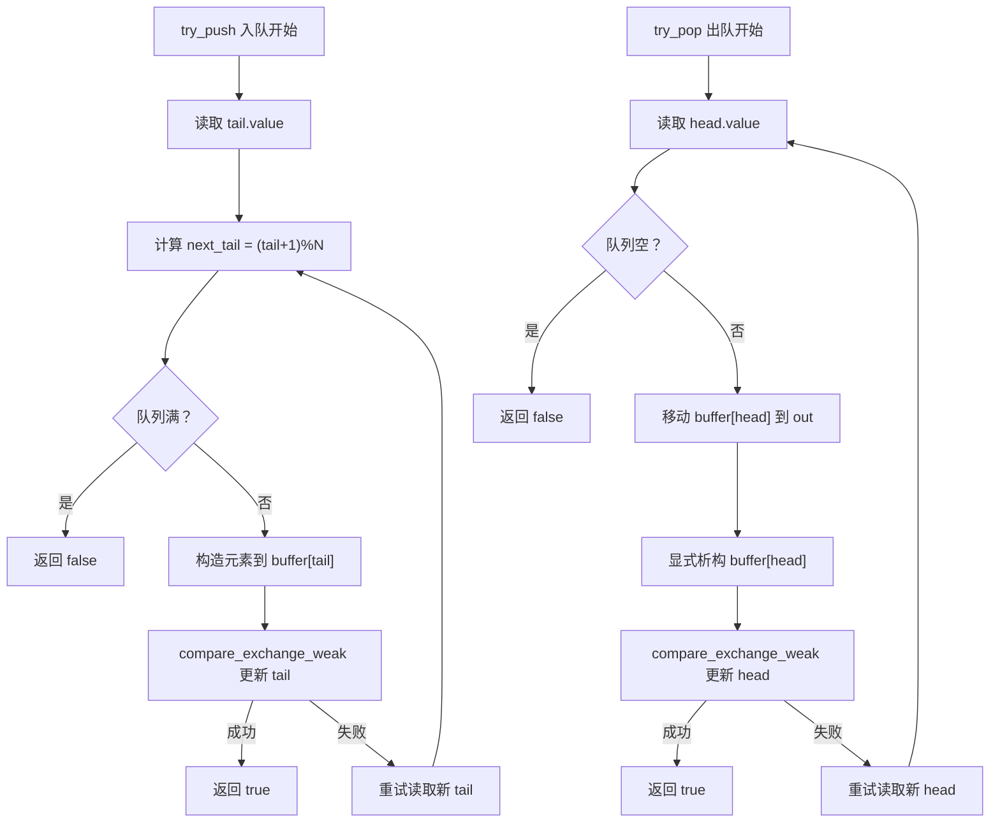
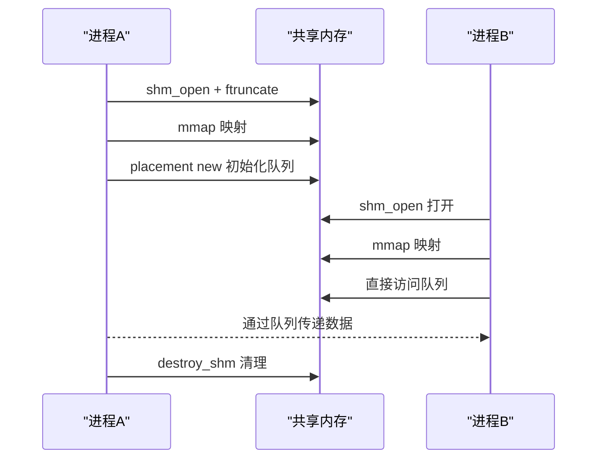
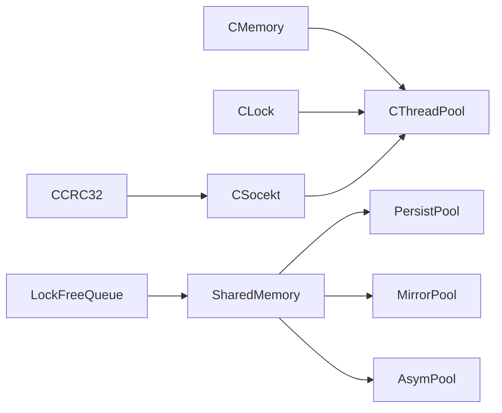

# 工具和实用程序

<cite>
**本文档引用的文件**
- [include/ngx_c_memory.h](file://include/ngx_c_memory.h)
- [misc/ngx_c_memory.cxx](file://misc/ngx_c_memory.cxx)
- [include/ngx_c_crc32.h](file://include/ngx_c_crc32.h)
- [misc/ngx_c_crc32.cxx](file://misc/ngx_c_crc32.cxx)
- [include/ngx_hostByte_to_netByte.h](file://include/ngx_hostByte_to_netByte.h)
- [include/ngx_c_threadpool.h](file://include/ngx_c_threadpool.h)
- [misc/ngx_c_threadpool.cxx](file://misc/ngx_c_threadpool.cxx)
- [include/ngx_lockFreeQueue.h](file://include/ngx_lockFreeQueue.h)
- [include/ngx_shared_memory.h](file://include/ngx_shared_memory.h)
- [include/ngx_c_lockmutex.h](file://include/ngx_c_lockmutex.h)
- [include/ngx_c_socket.h](file://include/ngx_c_socket.h)
- [misc/ngx_lockfree_threadPool.cxx](file://misc/ngx_lockfree_threadPool.cxx)
- [misc/ngx_lockfree_mirrorICP_threadPool.cxx](file://misc/ngx_lockfree_mirrorICP_threadPool.cxx)
- [misc/ngx_lockfree_asymCal_threadPool.cxx](file://misc/ngx_lockfree_asymCal_threadPool.cxx)
- [misc/ngx_lockfree_persistPool.cxx](file://misc/ngx_lockfree_persistPool.cxx)
</cite>

## 目录
1. [简介](#简介)
2. [项目结构](#项目结构)
3. [核心组件](#核心组件)
4. [架构总览](#架构总览)
5. [详细组件分析](#详细组件分析)
6. [依赖分析](#依赖分析)
7. [性能考量](#性能考量)
8. [故障排查指南](#故障排查指南)
9. [结论](#结论)
10. [附录](#附录)

## 简介
本文件聚焦于项目中的工具与实用程序模块，涵盖内存管理、CRC32 校验、字节序转换、线程池、无锁队列、共享内存队列以及锁工具等。文档从架构、数据流、处理逻辑、集成点、错误处理与性能特性等方面进行系统化梳理，并提供扩展与自定义建议，帮助开发者高效、安全地使用这些工具，提升整体代码质量与系统性能。

## 项目结构
工具与实用程序主要分布在以下目录与文件中：
- include 目录：提供接口与模板类声明（如内存、CRC32、线程池、无锁队列、共享内存、锁工具、网络套接字等）
- misc 目录：提供工具类的具体实现（如内存分配、CRC32 表构建与计算、线程池任务调度、点云处理线程池等）

**图表来源**
- [include/ngx_c_memory.h](file://include/ngx_c_memory.h#L1-L52)
- [misc/ngx_c_memory.cxx](file://misc/ngx_c_memory.cxx#L1-L30)
- [include/ngx_c_crc32.h](file://include/ngx_c_crc32.h#L1-L64)
- [misc/ngx_c_crc32.cxx](file://misc/ngx_c_crc32.cxx#L1-L89)
- [include/ngx_hostByte_to_netByte.h](file://include/ngx_hostByte_to_netByte.h#L1-L19)
- [include/ngx_c_lockmutex.h](file://include/ngx_c_lockmutex.h#L1-L24)
- [include/ngx_c_threadpool.h](file://include/ngx_c_threadpool.h#L1-L66)
- [misc/ngx_c_threadpool.cxx](file://misc/ngx_c_threadpool.cxx#L1-L321)
- [include/ngx_lockFreeQueue.h](file://include/ngx_lockFreeQueue.h#L1-L430)
- [include/ngx_shared_memory.h](file://include/ngx_shared_memory.h#L1-L193)
- [include/ngx_c_socket.h](file://include/ngx_c_socket.h#L1-L258)

**章节来源**
- [include/ngx_c_memory.h](file://include/ngx_c_memory.h#L1-L52)
- [misc/ngx_c_memory.cxx](file://misc/ngx_c_memory.cxx#L1-L30)
- [include/ngx_c_crc32.h](file://include/ngx_c_crc32.h#L1-L64)
- [misc/ngx_c_crc32.cxx](file://misc/ngx_c_crc32.cxx#L1-L89)
- [include/ngx_hostByte_to_netByte.h](file://include/ngx_hostByte_to_netByte.h#L1-L19)
- [include/ngx_c_lockmutex.h](file://include/ngx_c_lockmutex.h#L1-L24)
- [include/ngx_c_threadpool.h](file://include/ngx_c_threadpool.h#L1-L66)
- [misc/ngx_c_threadpool.cxx](file://misc/ngx_c_threadpool.cxx#L1-L321)
- [include/ngx_lockFreeQueue.h](file://include/ngx_lockFreeQueue.h#L1-L430)
- [include/ngx_shared_memory.h](file://include/ngx_shared_memory.h#L1-L193)
- [include/ngx_c_socket.h](file://include/ngx_c_socket.h#L1-L258)

## 核心组件
- 内存管理工具（CMemory）
  - 单例模式，提供统一的内存分配与释放接口，支持按需清零初始化
  - 适用于高频小块内存分配场景，降低 new/delete 的碎片化风险
- CRC32 校验工具（CCRC32）
  - 单例类，内置查找表，支持反射与多项式迭代生成表
  - 适合网络帧校验、数据完整性验证
- 字节序转换工具（htonl/ntohl、htond/ntohd）
  - 针对 int32_t 与 double 的主机序与网络序互转
  - 使用内建字节序反转指令，保证跨平台兼容与高性能
- 线程池（CThreadPool）
  - 基于 pthread 的工作线程池，支持消息队列入队与唤醒
  - 原子计数记录运行中线程数，具备线程不足告警能力
- 无锁队列（LockFreeQueue<T,N>）
  - 基于环形缓冲区与 compare-and-swap 的无锁队列
  - 缓存行对齐避免伪共享，提供 try_push/try_pop、size/capacity 查询
- 共享内存队列（open_shm_queue/destroy_shm）
  - 基于 POSIX 共享内存与 mmap 的跨进程无锁队列
  - 提供多类点云数据结构的队列别名，便于进程间通信
- 锁工具（CLock）
  - RAII 包装 pthread_mutex_t，自动加锁/解锁，降低遗漏风险
- 网络套接字（CSocekt）
  - 集成 epoll、连接池、发送队列、定时器队列与多线程回收
  - 与线程池协同处理网络消息，支持心跳与防洪检测

**章节来源**
- [include/ngx_c_memory.h](file://include/ngx_c_memory.h#L1-L52)
- [misc/ngx_c_memory.cxx](file://misc/ngx_c_memory.cxx#L1-L30)
- [include/ngx_c_crc32.h](file://include/ngx_c_crc32.h#L1-L64)
- [misc/ngx_c_crc32.cxx](file://misc/ngx_c_crc32.cxx#L1-L89)
- [include/ngx_hostByte_to_netByte.h](file://include/ngx_hostByte_to_netByte.h#L1-L19)
- [include/ngx_c_lockmutex.h](file://include/ngx_c_lockmutex.h#L1-L24)
- [include/ngx_c_threadpool.h](file://include/ngx_c_threadpool.h#L1-L66)
- [misc/ngx_c_threadpool.cxx](file://misc/ngx_c_threadpool.cxx#L1-L321)
- [include/ngx_lockFreeQueue.h](file://include/ngx_lockFreeQueue.h#L1-L430)
- [include/ngx_shared_memory.h](file://include/ngx_shared_memory.h#L1-L193)
- [include/ngx_c_socket.h](file://include/ngx_c_socket.h#L1-L258)

## 架构总览
工具与实用程序在系统中的角色：
- CMemory 与 CLock 为底层基础设施，保障内存与同步安全
- CCRC32 与字节序转换为网络与数据层提供基础校验与序列化能力
- CThreadPool 与 LockFreeQueue 为高并发处理提供任务调度与无锁通信
- Shared Memory Queue 为多进程间提供高性能数据通道
- CSocekt 将上述工具整合到网络 IO 流程中，形成完整的收发与处理闭环

**图表来源**
- [include/ngx_c_socket.h](file://include/ngx_c_socket.h#L1-L258)
- [include/ngx_c_threadpool.h](file://include/ngx_c_threadpool.h#L1-L66)
- [include/ngx_lockFreeQueue.h](file://include/ngx_lockFreeQueue.h#L1-L430)
- [include/ngx_shared_memory.h](file://include/ngx_shared_memory.h#L1-L193)
- [include/ngx_c_memory.h](file://include/ngx_c_memory.h#L1-L52)
- [include/ngx_c_lockmutex.h](file://include/ngx_c_lockmutex.h#L1-L24)
- [include/ngx_c_crc32.h](file://include/ngx_c_crc32.h#L1-L64)
- [include/ngx_hostByte_to_netByte.h](file://include/ngx_hostByte_to_netByte.h#L1-L19)

## 详细组件分析

### 内存管理工具（CMemory）
- 设计要点
  - 单例模式，首次使用时惰性创建，线程安全的双重检查
  - 提供 AllocMemory(memCount, ifmemset) 与 FreeMemory(point)
  - 内部嵌套 CGarbageCollector（CGarhuishou）在进程结束时自动释放单例
- 使用方法
  - 通过 GetInstance() 获取全局实例
  - 分配内存时可选择是否清零
  - 释放时使用 FreeMemory，避免 delete void* 的未定义行为
- 适用场景
  - 高频小块内存分配与回收
  - 需要集中管理内存生命周期的模块
- 性能与内存特性
  - 避免频繁 new/delete 引发的碎片化
  - 若 ifmemset=true，会带来额外的内存清零开销
- 最佳实践
  - 仅在必要时清零，减少 memset 带来的 CPU 开销
  - 与 CLock 组合使用，确保多线程下的安全访问
- 扩展与自定义
  - 可增加内存池策略（如固定大小块、对齐分配）
  - 可加入统计与诊断接口（分配次数、峰值内存）

**图表来源**
- [include/ngx_c_memory.h](file://include/ngx_c_memory.h#L1-L52)
- [misc/ngx_c_memory.cxx](file://misc/ngx_c_memory.cxx#L1-L30)

**章节来源**
- [include/ngx_c_memory.h](file://include/ngx_c_memory.h#L1-L52)
- [misc/ngx_c_memory.cxx](file://misc/ngx_c_memory.cxx#L1-L30)

### CRC32 校验工具（CCRC32）
- 设计要点
  - 单例类，构造时初始化 CRC32 查找表
  - Reflect() 实现位反射，Init_CRC32_Table() 生成查找表
  - Get_CRC(buffer, size) 使用查找表进行高效计算
- 使用方法
  - 通过 GetInstance() 获取实例
  - 调用 Get_CRC 计算数据块的 CRC32 值
- 适用场景
  - 网络帧校验、文件完整性校验、数据传输可靠性保障
- 性能与内存特性
  - 查找表一次性构建，后续计算 O(n) 线性复杂度
  - 查找表占用 256×4 字节（32 位整型）
- 最佳实践
  - 预热查找表，避免在热路径重复初始化
  - 对大块数据分片计算，结合滑动窗口减少重复计算
- 扩展与自定义
  - 支持自定义多项式与初始值
  - 可扩展为多线程安全版本（加锁或 TLS）

**图表来源**
- [include/ngx_c_crc32.h](file://include/ngx_c_crc32.h#L1-L64)
- [misc/ngx_c_crc32.cxx](file://misc/ngx_c_crc32.cxx#L1-L89)

**章节来源**
- [include/ngx_c_crc32.h](file://include/ngx_c_crc32.h#L1-L64)
- [misc/ngx_c_crc32.cxx](file://misc/ngx_c_crc32.cxx#L1-L89)

### 字节序转换工具（主机序↔网络序）
- 设计要点
  - 针对 double 的 htond/ntohd 使用 __builtin_bswap64 实现高效字节序反转
  - 使用静态断言确保 double 为 8 字节
- 使用方法
  - 直接调用 htond/ntohd 对 double 进行转换
  - 对 int32_t 使用标准库 htonl/ntohl
- 适用场景
  - 网络协议中数值字段的序列化与反序列化
- 性能与内存特性
  - 内建指令实现，避免显式循环，性能优异
- 最佳实践
  - 在协议层统一使用网络序存储与传输
  - 对齐与打包策略需与协议定义一致

**图表来源**
- [include/ngx_hostByte_to_netByte.h](file://include/ngx_hostByte_to_netByte.h#L1-L19)

**章节来源**
- [include/ngx_hostByte_to_netByte.h](file://include/ngx_hostByte_to_netByte.h#L1-L19)

### 线程池（CThreadPool）
- 设计要点
  - 静态互斥锁与条件变量，线程安全的消息队列
  - 原子计数跟踪运行中线程数，避免上下文切换开销
  - 支持线程不足告警与优雅停机
- 使用方法
  - Create(threadNum) 创建线程
  - inMsgRecvQueueAndSignal(buf) 入队并唤醒线程
  - StopAll() 优雅关闭，等待所有线程退出
- 适用场景
  - 高并发网络消息处理、任务分发与批处理
- 性能与内存特性
  - 避免阻塞锁竞争，原子计数与条件变量配合实现高效唤醒
  - 队列大小受消息长度与线程数影响
- 最佳实践
  - 合理设置线程数，避免过度竞争
  - 使用 CLock 包裹临界区，减少锁粒度
- 扩展与自定义
  - 可替换为无锁队列以进一步降低锁竞争
  - 支持动态扩容与优先级队列

**图表来源**
- [include/ngx_c_threadpool.h](file://include/ngx_c_threadpool.h#L1-L66)
- [misc/ngx_c_threadpool.cxx](file://misc/ngx_c_threadpool.cxx#L1-L321)
- [include/ngx_c_memory.h](file://include/ngx_c_memory.h#L1-L52)

**章节来源**
- [include/ngx_c_threadpool.h](file://include/ngx_c_threadpool.h#L1-L66)
- [misc/ngx_c_threadpool.cxx](file://misc/ngx_c_threadpool.cxx#L1-L321)
- [include/ngx_c_memory.h](file://include/ngx_c_memory.h#L1-L52)

### 无锁队列（LockFreeQueue<T,N>）
- 设计要点
  - 环形缓冲区 + compare_exchange_weak 实现无锁入队/出队
  - 缓存行对齐避免伪共享，提供 size/capacity 查询
  - acquire-release 内存序保证可见性与顺序约束
- 使用方法
  - try_push/try_pop 支持非阻塞操作
  - capacity 返回可用容量（N-1）
- 适用场景
  - 生产者-消费者解耦、跨线程/跨进程数据通道
- 性能与内存特性
  - 高并发下吞吐量显著优于锁队列
  - 需注意 ABA 问题与内存序正确性
- 最佳实践
  - 队列容量应为 2 的幂，便于环形索引
  - 控制元素大小，避免频繁大块内存移动
- 扩展与自定义
  - 可引入版本戳或带删除标记的节点以规避 ABA
  - 支持批量入队/出队以提升吞吐

**图表来源**
- [include/ngx_lockFreeQueue.h](file://include/ngx_lockFreeQueue.h#L1-L430)

**章节来源**
- [include/ngx_lockFreeQueue.h](file://include/ngx_lockFreeQueue.h#L1-L430)

### 共享内存队列（open_shm_queue/destroy_shm）
- 设计要点
  - 基于 POSIX 共享内存与 mmap，提供跨进程无锁队列
  - 使用 placement new 初始化队列对象
  - 提供多类点云数据结构的队列别名
- 使用方法
  - open_shm_queue 打开/创建共享内存并映射
  - destroy_shm 清理映射、析构对象并删除共享内存
- 适用场景
  - 多进程间高性能数据交换（网络进程 ↔ 处理进程）
- 性能与内存特性
  - 零拷贝数据传输，避免进程间复制
  - 需注意进程退出时的资源清理
- 最佳实践
  - 统一命名规范，避免冲突
  - 队列大小与数据结构对齐，避免碎片
- 扩展与自定义
  - 可扩展为多生产者/多消费者队列
  - 支持动态调整队列大小

**图表来源**
- [include/ngx_shared_memory.h](file://include/ngx_shared_memory.h#L1-L193)

**章节来源**
- [include/ngx_shared_memory.h](file://include/ngx_shared_memory.h#L1-L193)

### 锁工具（CLock）
- 设计要点
  - RAII 包装 pthread_mutex_t，在构造时加锁，在析构时解锁
- 使用方法
  - 在作用域内创建 CLock 对象，自动管理加锁/解锁
- 适用场景
  - 任何需要互斥保护的临界区
- 最佳实践
  - 避免在锁内执行耗时操作
  - 保持锁粒度最小化

**章节来源**
- [include/ngx_c_lockmutex.h](file://include/ngx_c_lockmutex.h#L1-L24)

### 网络套接字（CSocekt）
- 设计要点
  - 集成 epoll、连接池、发送队列、定时器队列与多线程回收
  - 与线程池协同处理网络消息，支持心跳与防洪检测
- 使用方法
  - Initialize/Initialize_subproc/Shutdown_subproc 生命周期管理
  - threadRecvProcFunc 处理消息，虚函数可被子类覆盖
- 适用场景
  - 高并发网络服务端，支持多端口监听与连接管理
- 最佳实践
  - 合理配置 epoll 事件与连接池大小
  - 使用 CLock 与原子变量减少锁竞争

**章节来源**
- [include/ngx_c_socket.h](file://include/ngx_c_socket.h#L1-L258)

## 依赖分析
- 组件耦合关系
  - CThreadPool 依赖 CMemory 进行消息内存管理
  - CSocekt 依赖 CCRC32 进行数据校验、CMemory 进行内存管理
  - 无锁队列与共享内存队列为多进程/多线程提供通信通道
  - CLock 为线程池与网络模块提供统一的加锁接口
- 外部依赖
  - pthread、epoll、mmap、shm_open 等系统调用
  - 第三方库（如 draco、PCL、Eigen、MySQL 连接池）用于点云处理与持久化

**图表来源**
- [include/ngx_c_memory.h](file://include/ngx_c_memory.h#L1-L52)
- [include/ngx_c_lockmutex.h](file://include/ngx_c_lockmutex.h#L1-L24)
- [include/ngx_c_crc32.h](file://include/ngx_c_crc32.h#L1-L64)
- [include/ngx_c_socket.h](file://include/ngx_c_socket.h#L1-L258)
- [include/ngx_lockFreeQueue.h](file://include/ngx_lockFreeQueue.h#L1-L430)
- [include/ngx_shared_memory.h](file://include/ngx_shared_memory.h#L1-L193)

**章节来源**
- [include/ngx_c_memory.h](file://include/ngx_c_memory.h#L1-L52)
- [include/ngx_c_lockmutex.h](file://include/ngx_c_lockmutex.h#L1-L24)
- [include/ngx_c_crc32.h](file://include/ngx_c_crc32.h#L1-L64)
- [include/ngx_c_socket.h](file://include/ngx_c_socket.h#L1-L258)
- [include/ngx_lockFreeQueue.h](file://include/ngx_lockFreeQueue.h#L1-L430)
- [include/ngx_shared_memory.h](file://include/ngx_shared_memory.h#L1-L193)

## 性能考量
- 内存管理
  - CMemory 通过单例与集中释放降低碎片化，适合高频小块分配
  - 建议避免在热路径频繁清零，必要时使用零拷贝或延迟初始化
- CRC32
  - 查找表一次性构建，后续计算 O(n)，适合大批量数据校验
  - 可考虑 SIMD 扩展以进一步加速
- 字节序转换
  - 使用内建指令，性能优异，注意数据对齐
- 线程池
  - 原子计数与条件变量减少锁竞争，适合高并发消息处理
  - 建议根据 CPU 核心数与 I/O 特性调整线程数
- 无锁队列
  - 高并发吞吐量显著，需正确使用内存序与避免 ABA
  - 队列容量与元素大小需与业务匹配
- 共享内存队列
  - 零拷贝传输，适合跨进程大数据交换
  - 注意进程退出时的资源清理与命名冲突

## 故障排查指南
- 线程池告警
  - 当空闲线程数为 0 且持续时间超过阈值，记录“线程池中当前空闲线程数量为 0”的告警
  - 建议扩容线程数或优化任务处理耗时
- 共享内存初始化失败
  - shm_open/ftruncate/mmap 失败时记录错误并返回空指针
  - 检查权限、路径与系统限制
- 网络消息处理异常
  - CSocekt 中的日志接口可用于定位消息处理阶段与超时检测问题
- 内存泄漏
  - 确保所有通过 CMemory 分配的内存均通过 FreeMemory 释放
  - 使用 CLock 包裹临界区，避免死锁与资源争用

**章节来源**
- [misc/ngx_c_threadpool.cxx](file://misc/ngx_c_threadpool.cxx#L307-L319)
- [include/ngx_shared_memory.h](file://include/ngx_shared_memory.h#L88-L160)
- [include/ngx_c_socket.h](file://include/ngx_c_socket.h#L1-L258)
- [misc/ngx_c_memory.cxx](file://misc/ngx_c_memory.cxx#L23-L28)

## 结论
本项目的工具与实用程序模块围绕“高性能、低耦合、易扩展”设计，覆盖内存管理、数据校验、字节序转换、线程池、无锁队列与共享内存通信等关键领域。通过合理的内存与同步策略、无锁数据结构与跨进程通信方案，系统在高并发与多进程场景下具备良好的可伸缩性与稳定性。建议在实际工程中结合业务特征进一步优化线程数、队列容量与内存分配策略，并持续完善监控与诊断能力。

## 附录
- 代码示例路径（不展示具体代码内容）
  - 内存分配与释放：[misc/ngx_c_memory.cxx](file://misc/ngx_c_memory.cxx#L13-L28)
  - CRC32 初始化与计算：[misc/ngx_c_crc32.cxx](file://misc/ngx_c_crc32.cxx#L37-L87)
  - 字节序转换（double）：[include/ngx_hostByte_to_netByte.h](file://include/ngx_hostByte_to_netByte.h#L5-L19)
  - 线程池创建与唤醒：[misc/ngx_c_threadpool.cxx](file://misc/ngx_c_threadpool.cxx#L67-L121)
  - 无锁队列入队/出队流程：[include/ngx_lockFreeQueue.h](file://include/ngx_lockFreeQueue.h#L50-L127)
  - 共享内存队列初始化与销毁：[include/ngx_shared_memory.h](file://include/ngx_shared_memory.h#L87-L179)
  - 网络消息处理入口：[include/ngx_c_socket.h](file://include/ngx_c_socket.h#L115-L116)