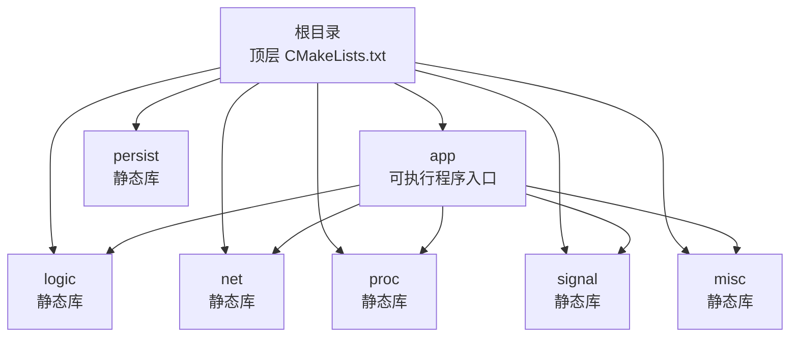
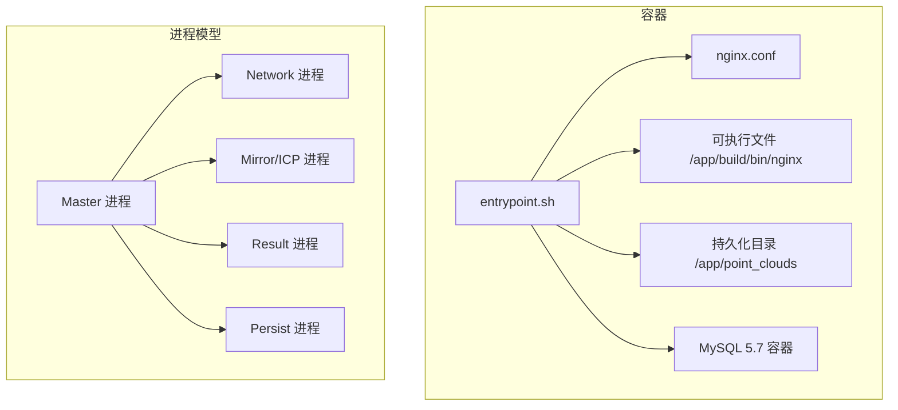
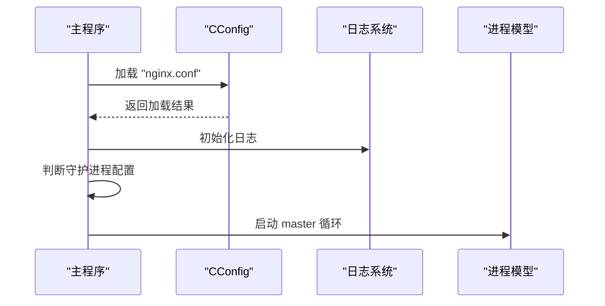
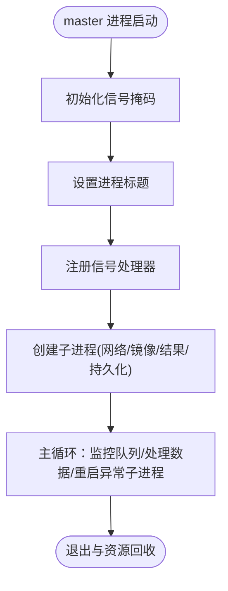
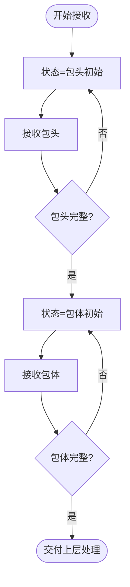
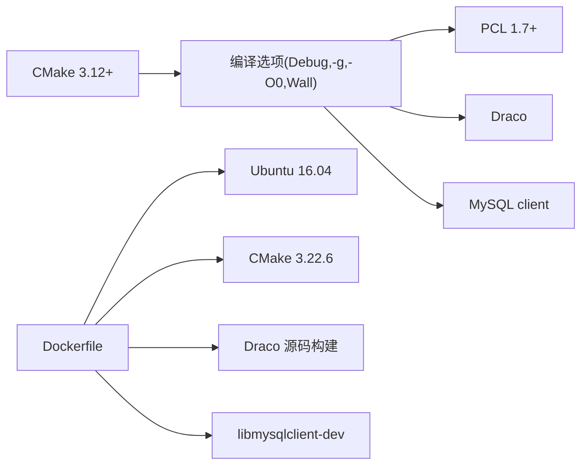

# 开发指南

<cite>
**本文引用的文件**
- [CMakeLists.txt](file://CMakeLists.txt)
- [Dockerfile](file://Dockerfile)
- [docker-compose.yml](file://docker-compose.yml)
- [nginx.conf](file://nginx.conf)
- [app/CMakeLists.txt](file://app/CMakeLists.txt)
- [logic/CMakeLists.txt](file://logic/CMakeLists.txt)
- [net/CMakeLists.txt](file://net/CMakeLists.txt)
- [include/ngx_global.h](file://include/ngx_global.h)
- [include/ngx_macro.h](file://include/ngx_macro.h)
- [include/ngx_comm.h](file://include/ngx_comm.h)
- [app/nginx.cxx](file://app/nginx.cxx)
- [app/ngx_c_conf.cxx](file://app/ngx_c_conf.cxx)
- [proc/ngx_process_cycle.cxx](file://proc/ngx_process_cycle.cxx)
- [persist/mysql.ini](file://persist/mysql.ini)
- [docker/entrypoint.sh](file://docker/entrypoint.sh)
</cite>

## 目录
1. [简介](#简介)
2. [项目结构](#项目结构)
3. [核心组件](#核心组件)
4. [架构总览](#架构总览)
5. [详细组件分析](#详细组件分析)
6. [依赖分析](#依赖分析)
7. [性能考虑](#性能考虑)
8. [故障排查指南](#故障排查指南)
9. [结论](#结论)
10. [附录](#附录)

## 简介
本开发指南面向希望参与 pointServer 项目的开发者，涵盖开发环境搭建、编译与依赖安装、代码结构与组织方式、开发与测试实践、调试与性能分析、代码审查与发布流程，以及贡献流程。项目采用 CMake 构建，包含多进程架构与模块化设计，支持容器化部署，并提供基于配置文件的运行参数管理。

## 项目结构
项目采用模块化目录组织，顶层 CMakeLists 统一管理子模块构建顺序与全局依赖，各模块独立编译为静态库或可执行文件，最终由 app 模块整合为可执行程序。

图表来源
- [CMakeLists.txt](file://CMakeLists.txt#L61-L68)
- [app/CMakeLists.txt](file://app/CMakeLists.txt#L14-L21)

章节来源
- [CMakeLists.txt](file://CMakeLists.txt#L1-L68)
- [app/CMakeLists.txt](file://app/CMakeLists.txt#L1-L29)
- [logic/CMakeLists.txt](file://logic/CMakeLists.txt#L1-L23)
- [net/CMakeLists.txt](file://net/CMakeLists.txt#L1-L14)

## 核心组件
- 可执行程序入口与主流程：位于 app 模块，负责初始化配置、日志、守护进程、进程模型启动与资源释放。
- 配置系统：解析 nginx.conf，提供键值读取与默认值接口。
- 多进程模型：master-worker 架构，master 管理子进程生命周期，子进程分别承担网络、镜像/ICP、结果处理、持久化等职责。
- 网络与通信：网络模块负责连接接受、请求处理与时间管理；通信协议定义在公共头文件中。
- 全局与宏常量：集中定义日志级别、进程类型、通信包头格式等。
- 数据库连接池：持久化模块提供连接池配置与连接管理。

章节来源
- [app/nginx.cxx](file://app/nginx.cxx#L44-L122)
- [app/ngx_c_conf.cxx](file://app/ngx_c_conf.cxx#L29-L110)
- [proc/ngx_process_cycle.cxx](file://proc/ngx_process_cycle.cxx#L122-L200)
- [include/ngx_macro.h](file://include/ngx_macro.h#L17-L36)
- [include/ngx_comm.h](file://include/ngx_comm.h#L18-L25)
- [include/ngx_global.h](file://include/ngx_global.h#L11-L46)

## 架构总览
系统采用 master-worker 多进程模型，配合共享内存队列实现模块间解耦的数据流转。容器化部署通过 Dockerfile 与 docker-compose.yml 提供一键拉起 MySQL 与服务容器。

图表来源
- [docker-compose.yml](file://docker-compose.yml#L15-L36)
- [Dockerfile](file://Dockerfile#L59-L65)
- [docker/entrypoint.sh](file://docker/entrypoint.sh#L1-L45)
- [nginx.conf](file://nginx.conf#L1-L63)
- [proc/ngx_process_cycle.cxx](file://proc/ngx_process_cycle.cxx#L103-L109)

## 详细组件分析

### 配置系统与运行参数
- 配置文件格式：键值对形式，支持注释与分组行；运行时通过 CConfig 单例加载并提供字符串与整型读取接口。
- 关键参数示例：日志、进程数、守护进程开关、网络监听端口、连接数限制、心跳与防刷策略等。
- 启动流程：主程序加载配置、初始化日志、按需进入守护进程模式、启动 master 循环。

图表来源
- [app/nginx.cxx](file://app/nginx.cxx#L74-L116)
- [app/ngx_c_conf.cxx](file://app/ngx_c_conf.cxx#L29-L87)
- [nginx.conf](file://nginx.conf#L12-L61)

章节来源
- [app/ngx_c_conf.cxx](file://app/ngx_c_conf.cxx#L29-L110)
- [nginx.conf](file://nginx.conf#L1-L63)
- [app/nginx.cxx](file://app/nginx.cxx#L74-L116)

### 多进程模型与模块职责
- master 进程：初始化信号掩码、设置进程标题、注册信号处理器、管理子进程生命周期与队列监控。
- 子进程类型：网络、镜像/ICP、结果处理、持久化，各自独立进程，通过共享内存队列进行数据交换。
- 信号处理：统一由 sigaction 注册，处理子进程退出、优雅关闭等事件。

图表来源
- [proc/ngx_process_cycle.cxx](file://proc/ngx_process_cycle.cxx#L124-L198)
- [proc/ngx_process_cycle.cxx](file://proc/ngx_process_cycle.cxx#L103-L109)

章节来源
- [proc/ngx_process_cycle.cxx](file://proc/ngx_process_cycle.cxx#L122-L200)
- [proc/ngx_process_cycle.cxx](file://proc/ngx_process_cycle.cxx#L103-L109)

### 网络与通信协议
- 通信包头：固定长度结构，包含包总长度、CRC32 校验、消息类型代码，保证收发一致性。
- 接收状态机：区分包头接收、包体接收等状态，逐步累积直至完整报文。
- 网络模块：负责连接接受、请求处理、地址解析、时间管理等。

图表来源
- [include/ngx_comm.h](file://include/ngx_comm.h#L5-L12)
- [include/ngx_comm.h](file://include/ngx_comm.h#L18-L25)

章节来源
- [include/ngx_comm.h](file://include/ngx_comm.h#L5-L31)
- [net/CMakeLists.txt](file://net/CMakeLists.txt#L1-L14)

### 全局常量与日志体系
- 日志级别：从最高级别到最低级别划分，便于分级输出与过滤。
- 进程类型：master/worker 等标识，便于日志与行为区分。
- 全局变量：进程 ID、父进程 ID、日志句柄、线程池、fd 映射表等。

章节来源
- [include/ngx_macro.h](file://include/ngx_macro.h#L17-L36)
- [include/ngx_global.h](file://include/ngx_global.h#L18-L46)

### 数据库连接池与持久化
- 配置文件：提供 IP、端口、用户名、密码、库名、初始/最大连接数、最大空闲时间、连接超时等。
- 容器启动：entrypoint.sh 可根据环境变量生成 mysql.ini，确保容器内配置正确。
- 运行时：持久化进程从连接池获取连接，执行点云数据的落库与文件系统持久化。

章节来源
- [persist/mysql.ini](file://persist/mysql.ini#L1-L13)
- [docker/entrypoint.sh](file://docker/entrypoint.sh#L10-L33)
- [proc/ngx_process_cycle.cxx](file://proc/ngx_process_cycle.cxx#L17-L17)

## 依赖分析
- 构建系统：CMake 3.12+，C++11 标准，Debug 默认构建，基础编译选项包含调试符号与告警。
- 第三方库：PCL 1.7+（common/kdtree/search/registration/io/features）、Draco（点云压缩）、MySQL client。
- 平台与容器：Ubuntu 16.04 基础镜像，CMake 3.22.6 安装，Draco 源码构建安装，MySQL 5.7 容器。

图表来源
- [CMakeLists.txt](file://CMakeLists.txt#L1-L68)
- [Dockerfile](file://Dockerfile#L10-L43)

章节来源
- [CMakeLists.txt](file://CMakeLists.txt#L1-L68)
- [Dockerfile](file://Dockerfile#L1-L65)

## 性能考虑
- 多进程模型优势：进程级隔离、故障隔离、资源独立扩展、计算与 I/O 并行互补。
- 线程池与队列：各进程内使用线程池处理任务，共享内存队列降低模块间耦合。
- 调试与分析：建议在本地使用 GDB 断点调试，结合日志定位问题；必要时使用性能分析工具评估 CPU 与 I/O 瓶颈。
- 容器资源：通过 docker-compose 限制端口映射与卷挂载，确保容器内配置与持久化目录可用。

章节来源
- [app/nginx.cxx](file://app/nginx.cxx#L139-L172)
- [proc/ngx_process_cycle.cxx](file://proc/ngx_process_cycle.cxx#L122-L200)
- [docker-compose.yml](file://docker-compose.yml#L15-L36)

## 故障排查指南
- 配置文件加载失败：检查 nginx.conf 路径与权限，确认键值格式正确。
- 守护进程模式：容器内强制将 Daemon 设为 0，确保前台运行以便查看日志。
- 日志定位：依据日志级别与输出路径定位问题；关注 master/worker 进程日志差异。
- 数据库连接：核对 mysql.ini 中的主机、端口、账号、密码与库名；确认容器网络可达。
- 容器启动：entrypoint.sh 自动创建持久化目录与生成 mysql.ini；如需自定义配置可挂载文件。

章节来源
- [app/nginx.cxx](file://app/nginx.cxx#L74-L82)
- [docker/entrypoint.sh](file://docker/entrypoint.sh#L35-L39)
- [persist/mysql.ini](file://persist/mysql.ini#L1-L13)
- [docker-compose.yml](file://docker-compose.yml#L31-L36)

## 结论
本项目通过模块化与多进程架构实现了高内聚、低耦合的服务设计，配合容器化部署与配置驱动的运行参数，具备良好的可维护性与可扩展性。建议在开发过程中遵循统一的编码规范与提交流程，配合日志与断点调试快速定位问题，并在 CI/CD 流程中完善自动化测试与发布。

## 附录

### 开发环境搭建
- 工具链
  - CMake 3.12+
  - GCC/Clang（支持 C++11）
  - Git
- 依赖库
  - PCL 1.7+（common、kdtree、search、registration、io、features）
  - Draco（点云压缩）
  - MySQL client（libmysqlclient-dev）
- 容器化（可选）
  - Docker 与 docker-compose
  - 使用 docker-compose.yml 一键拉起 MySQL 与服务容器

章节来源
- [CMakeLists.txt](file://CMakeLists.txt#L10-L51)
- [Dockerfile](file://Dockerfile#L10-L17)
- [docker-compose.yml](file://docker-compose.yml#L1-L36)

### 代码结构与组织方式
- 目录布局
  - app：可执行程序入口与基础工具
  - logic：业务逻辑静态库
  - persist：持久化与数据库连接池
  - misc：通用工具与线程池
  - net：网络相关模块
  - proc：进程与事件循环
  - signal：信号处理
  - include：公共头文件
- 命名约定
  - 模块以 ngx_ 前缀区分，如 ngx_c_conf、ngx_c_socket、ngx_c_slogic 等
  - 类型与结构体使用带前缀的命名风格
- 编码规范
  - 使用 C++11 标准
  - 统一的头文件保护与 include 顺序
  - 静态库优先，模块间通过显式链接关系组织

章节来源
- [CMakeLists.txt](file://CMakeLists.txt#L61-L68)
- [app/CMakeLists.txt](file://app/CMakeLists.txt#L1-L29)
- [logic/CMakeLists.txt](file://logic/CMakeLists.txt#L1-L23)
- [net/CMakeLists.txt](file://net/CMakeLists.txt#L1-L14)

### 开发示例与实践
- 添加新功能模块
  - 在相应目录新增源文件与 CMakeLists.txt 条目
  - 在顶层 CMakeLists 中添加 add_subdirectory
  - 在 app 模块 target_link_libraries 中显式链接新模块
- 修改现有代码
  - 通过 CConfig 读取配置项，避免硬编码
  - 使用 include/ngx_macro.h 与 include/ngx_comm.h 中的常量与结构
- 单元测试
  - 建议针对独立模块编写测试用例，结合日志与断言验证行为
  - 对网络与通信模块可模拟收包状态机进行边界测试

章节来源
- [CMakeLists.txt](file://CMakeLists.txt#L61-L68)
- [app/CMakeLists.txt](file://app/CMakeLists.txt#L14-L21)
- [include/ngx_macro.h](file://include/ngx_macro.h#L17-L36)
- [include/ngx_comm.h](file://include/ngx_comm.h#L18-L25)

### 调试与测试方法
- 断点调试
  - 使用 GDB 在主程序入口与关键模块函数设置断点
  - 结合守护进程模式与容器前台运行定位问题
- 日志调试
  - 使用 include/ngx_macro.h 中的日志级别进行分级输出
  - 关注 master/worker 进程日志差异
- 性能分析
  - 使用性能分析工具评估 CPU 与 I/O 瓶颈
  - 结合线程池与队列负载监控优化吞吐

章节来源
- [app/nginx.cxx](file://app/nginx.cxx#L174-L197)
- [include/ngx_macro.h](file://include/ngx_macro.h#L17-L36)
- [docker/entrypoint.sh](file://docker/entrypoint.sh#L35-L39)

### 代码审查与发布
- 代码审查标准
  - 通过 C++11 规范与模块化设计进行审查
  - 关注配置驱动与容器化部署的兼容性
  - 确保日志与错误处理完备
- 持续集成
  - 基于 Dockerfile 与 docker-compose.yml 的构建流程
  - 在 CI 中执行构建与基础连通性测试
- 发布流程
  - 通过 Dockerfile 构建镜像，使用 docker-compose.yml 进行编排
  - 通过环境变量注入数据库配置，entrypoint.sh 自动生成 mysql.ini

章节来源
- [Dockerfile](file://Dockerfile#L53-L65)
- [docker-compose.yml](file://docker-compose.yml#L15-L36)
- [docker/entrypoint.sh](file://docker/entrypoint.sh#L10-L33)

### 贡献流程
- 分支策略
  - 基于主分支创建功能分支，提交 PR 进行审查
- 提交流程
  - 更新 CMakeLists 与模块链接关系（如有新增模块）
  - 补充或更新配置项与文档
  - 在 CI 中验证构建与容器化部署

章节来源
- [CMakeLists.txt](file://CMakeLists.txt#L61-L68)
- [Dockerfile](file://Dockerfile#L53-L65)
- [docker-compose.yml](file://docker-compose.yml#L15-L36)