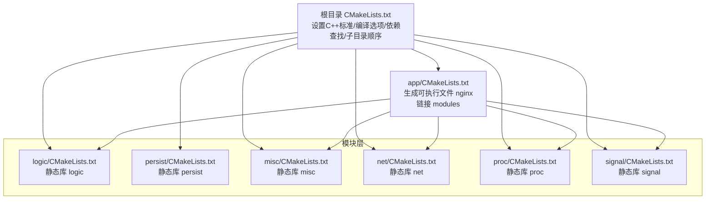
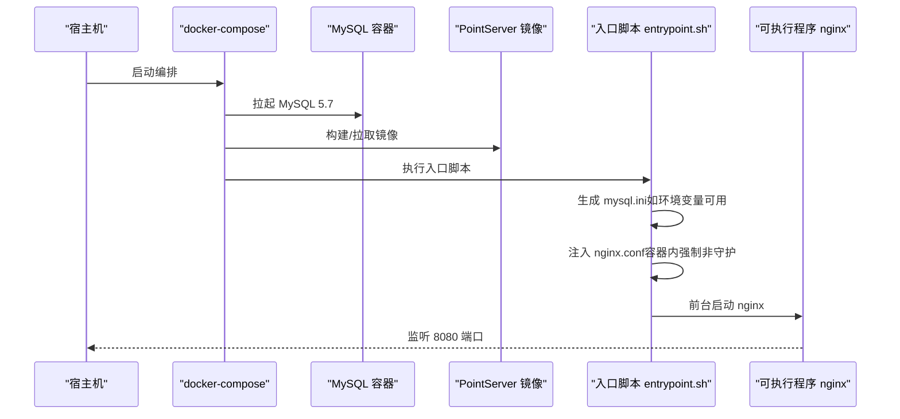
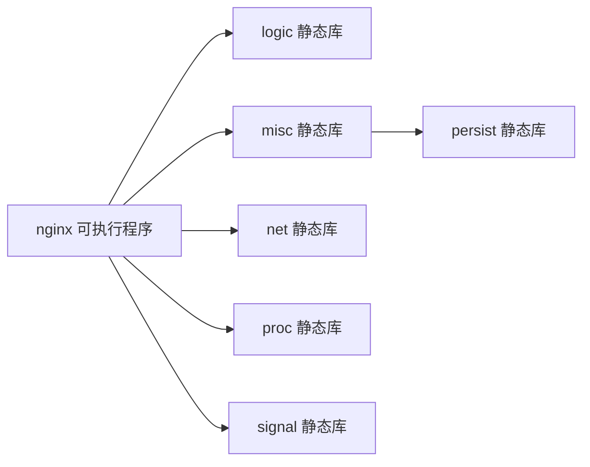

# 快速开始

<cite>
**本文引用的文件**
- [CMakeLists.txt](file://CMakeLists.txt)
- [Dockerfile](file://Dockerfile)
- [docker-compose.yml](file://docker-compose.yml)
- [nginx.conf](file://nginx.conf)
- [.dockerignore](file://.dockerignore)
- [persist/mysql.ini](file://persist/mysql.ini)
- [docker/entrypoint.sh](file://docker/entrypoint.sh)
- [app/CMakeLists.txt](file://app/CMakeLists.txt)
- [logic/CMakeLists.txt](file://logic/CMakeLists.txt)
- [net/CMakeLists.txt](file://net/CMakeLists.txt)
- [persist/CMakeLists.txt](file://persist/CMakeLists.txt)
- [misc/CMakeLists.txt](file://misc/CMakeLists.txt)
- [proc/CMakeLists.txt](file://proc/CMakeLists.txt)
- [signal/CMakeLists.txt](file://signal/CMakeLists.txt)
</cite>

## 目录
1. [简介](#简介)
2. [项目结构](#项目结构)
3. [核心组件](#核心组件)
4. [架构总览](#架构总览)
5. [详细组件分析](#详细组件分析)
6. [依赖分析](#依赖分析)
7. [性能考虑](#性能考虑)
8. [故障排除指南](#故障排除指南)
9. [结论](#结论)
10. [附录](#附录)

## 简介
本指南面向首次接触 PointServer 的用户，帮助你在最短时间内完成安装、配置与启动。内容覆盖：
- 系统依赖与编译环境准备
- 本地编译与构建（CMake）
- Docker 容器化部署
- docker-compose 编排部署
- 基本配置文件示例与启动流程
- 常见问题与故障排除

## 项目结构
项目采用模块化的 CMake 子目录组织，主工程顶层控制全局编译选项与依赖查找，各功能模块以静态库形式提供能力，最终由应用层模块链接组装成可执行程序。

图表来源
- [CMakeLists.txt](file://CMakeLists.txt#L61-L68)
- [app/CMakeLists.txt](file://app/CMakeLists.txt#L14-L21)
- [logic/CMakeLists.txt](file://logic/CMakeLists.txt#L6-L20)
- [persist/CMakeLists.txt](file://persist/CMakeLists.txt#L6-L17)
- [misc/CMakeLists.txt](file://misc/CMakeLists.txt#L11-L26)
- [net/CMakeLists.txt](file://net/CMakeLists.txt#L11)
- [proc/CMakeLists.txt](file://proc/CMakeLists.txt#L7-L21)
- [signal/CMakeLists.txt](file://signal/CMakeLists.txt#L6)

章节来源
- [CMakeLists.txt](file://CMakeLists.txt#L1-L68)
- [app/CMakeLists.txt](file://app/CMakeLists.txt#L1-L29)
- [logic/CMakeLists.txt](file://logic/CMakeLists.txt#L1-L23)
- [persist/CMakeLists.txt](file://persist/CMakeLists.txt#L1-L20)
- [misc/CMakeLists.txt](file://misc/CMakeLists.txt#L1-L29)
- [net/CMakeLists.txt](file://net/CMakeLists.txt#L1-L14)
- [proc/CMakeLists.txt](file://proc/CMakeLists.txt#L1-L24)
- [signal/CMakeLists.txt](file://signal/CMakeLists.txt#L1-L9)

## 核心组件
- 应用层（app）：负责装配与启动，生成可执行文件 nginx，并链接各功能模块。
- 逻辑层（logic）：提供业务逻辑基础能力，依赖 PCL 与 draco。
- 持久化层（persist）：提供 MySQL 连接池与连接封装，依赖 MySQL 客户端库。
- 杂项层（misc）：提供通用工具、线程池与各类算法线程池，依赖 PCL、draco、rt、persist。
- 网络层（net）：提供 socket 接受、连接、请求、时间等网络能力。
- 进程层（proc）：提供守护进程、事件循环与进程周期控制，依赖 PCL、draco、rt。
- 信号层（signal）：提供信号处理能力。

章节来源
- [app/CMakeLists.txt](file://app/CMakeLists.txt#L14-L21)
- [logic/CMakeLists.txt](file://logic/CMakeLists.txt#L15-L20)
- [persist/CMakeLists.txt](file://persist/CMakeLists.txt#L13-L17)
- [misc/CMakeLists.txt](file://misc/CMakeLists.txt#L19-L26)
- [net/CMakeLists.txt](file://net/CMakeLists.txt#L1-L14)
- [proc/CMakeLists.txt](file://proc/CMakeLists.txt#L16-L21)
- [signal/CMakeLists.txt](file://signal/CMakeLists.txt#L1-L9)

## 架构总览
下图展示从容器入口到服务启动的关键流程，以及配置注入与前台运行策略。

图表来源
- [docker-compose.yml](file://docker-compose.yml#L15-L36)
- [Dockerfile](file://Dockerfile#L53-L65)
- [docker/entrypoint.sh](file://docker/entrypoint.sh#L10-L39)
- [nginx.conf](file://nginx.conf#L25-L26)

章节来源
- [docker-compose.yml](file://docker-compose.yml#L1-L36)
- [Dockerfile](file://Dockerfile#L1-L65)
- [docker/entrypoint.sh](file://docker/entrypoint.sh#L1-L45)
- [nginx.conf](file://nginx.conf#L1-L63)

## 详细组件分析

### 本地编译与构建（CMake）
- C++ 标准与构建类型
  - 使用 C++11 标准，未设置时默认 Debug 模式，启用调试符号与告警。
- 依赖查找与包含路径
  - MySQL：通过增强的查找逻辑定位头文件与库，并加入全局包含与链接。
  - PCL：要求 common、kdtree、search、registration、io、features 组件。
  - draco：要求 draco 包。
- 全局链接库
  - 将 PCL、draco、MySQL、pthread 统一设置为全局链接库，供后续模块使用。
- 子目录顺序
  - 逻辑层、持久化层、杂项层、网络层、进程层、信号层、应用层，保证链接顺序正确。

章节来源
- [CMakeLists.txt](file://CMakeLists.txt#L1-L68)

### 应用层（app）构建细节
- 可执行文件名称：nginx
- 源文件顺序：配置系统 → 基础工具 → 输出功能 → 日志系统 → 进程管理 → 主程序
- 链接模块：logic、net、proc、signal、misc
- 输出目录：构建目录下的 bin 子目录
- 安装规则：安装到系统 bin 目录

章节来源
- [app/CMakeLists.txt](file://app/CMakeLists.txt#L1-L29)

### 逻辑层（logic）
- 产物：静态库 logic
- 包含路径：include、PCL、draco
- 链接库：PCL、draco、rt

章节来源
- [logic/CMakeLists.txt](file://logic/CMakeLists.txt#L1-L23)

### 持久化层（persist）
- 产物：静态库 persist
- 包含路径：include
- 链接库：MySQL、draco

章节来源
- [persist/CMakeLists.txt](file://persist/CMakeLists.txt#L1-L20)

### 杂项层（misc）
- 产物：静态库 misc
- 包含路径：include、PCL、draco
- 链接库：PCL、draco、rt、persist

章节来源
- [misc/CMakeLists.txt](file://misc/CMakeLists.txt#L1-L29)

### 网络层（net）
- 产物：静态库 net
- 功能：socket 接受、连接、请求、时间等

章节来源
- [net/CMakeLists.txt](file://net/CMakeLists.txt#L1-L14)

### 进程层（proc）
- 产物：静态库 proc
- 包含路径：include、PCL、draco
- 链接库：PCL、draco、rt

章节来源
- [proc/CMakeLists.txt](file://proc/CMakeLists.txt#L1-L24)

### 信号层（signal）
- 产物：静态库 signal

章节来源
- [signal/CMakeLists.txt](file://signal/CMakeLists.txt#L1-L9)

### Docker 容器化部署
- 基础镜像：ubuntu:16.04
- 依赖安装：PCL、Eigen、Boost、FLANN、VTK、MySQL 客户端
- CMake 版本：通过下载二进制安装，适配 x86_64/aarch64 或回退系统包
- Draco：从源码构建并安装，导出 draco::draco 包供 CMake 使用
- 工作目录与复制：复制源码至 /app，预置 mysql.ini 到工作目录
- 构建：Release 模式，使用 MAKE_JOBS 控制并行度
- 入口脚本：修正配置、强制前台运行、启动 nginx

章节来源
- [Dockerfile](file://Dockerfile#L1-L65)
- [docker/entrypoint.sh](file://docker/entrypoint.sh#L1-L45)

### docker-compose 编排部署
- MySQL 服务：镜像 mysql:5.7，设置 root 密码与数据库名，持久化目录映射
- PointServer 服务：基于当前目录构建，镜像名为 pointserver:ubuntu16
- 环境变量：MYSQL_HOST、MYSQL_PORT、MYSQL_USER、MYSQL_PASSWORD、MYSQL_DBNAME、MYSQL_INIT_SIZE、MYSQL_MAX_SIZE
- 端口映射：8080:8080
- 数据卷：point_clouds 目录挂载用于点云持久化
- 自定义配置：可通过挂载 nginx.conf 与 mysql.ini 覆盖默认配置

章节来源
- [docker-compose.yml](file://docker-compose.yml#L1-L36)

### 配置文件示例与说明
- nginx.conf（运行参数示例）
  - 日志：日志文件名与日志等级
  - 进程：工作进程数、守护进程开关
  - 线程池：消息接收工作线程数
  - 网络：监听端口数量、端口、worker_connections、连接回收等待时间、心跳检测与超时踢人
  - 安全：防洪攻击检测开关、检测时间间隔、踢人计数
- mysql.ini（数据库连接池）
  - ip、port、username、password、dbname
  - initSize、maxSize、maxIdleTime、connectionTimeOut

章节来源
- [nginx.conf](file://nginx.conf#L1-L63)
- [persist/mysql.ini](file://persist/mysql.ini#L1-L13)

## 依赖分析
- 内部模块耦合
  - app 依赖 logic、net、proc、signal、misc
  - misc 依赖 persist
- 外部依赖
  - PCL（common/kdtree/search/registration/io/features）
  - draco
  - MySQL 客户端库
  - pthread、rt
- CMake 依赖查找策略
  - MySQL：自定义可能路径集合，分别查找头文件与库
  - PCL：按组件列表查找
  - draco：通过源码构建安装后使用

图表来源
- [app/CMakeLists.txt](file://app/CMakeLists.txt#L14-L21)
- [misc/CMakeLists.txt](file://misc/CMakeLists.txt#L25)

章节来源
- [CMakeLists.txt](file://CMakeLists.txt#L15-L59)
- [app/CMakeLists.txt](file://app/CMakeLists.txt#L14-L21)
- [misc/CMakeLists.txt](file://misc/CMakeLists.txt#L25)

## 性能考虑
- 并行编译：Dockerfile 中通过 MAKE_JOBS 控制 make 并行度，避免低内存环境 OOM
- CMake 构建类型：默认 Debug，适合开发调试；生产建议使用 Release
- 线程池与连接池：通过 nginx.conf 的线程池与 mysql.ini 的连接池参数调优
- 端口与连接数：根据 worker_connections 与 ListenPortCount 调整并发能力

## 故障排除指南
- 无法找到 MySQL 头文件或库
  - 检查系统是否已安装 MySQL 客户端开发包
  - 确认 CMake 查找路径中包含的可能路径是否存在
- PCL/Draco 未被找到
  - 确认系统已安装对应开发包
  - 若使用自定义安装路径，请确保 CMake 能够定位到头文件与库
- Docker 构建失败（Ubuntu 16.04）
  - 确认网络可访问 cmake.org 与 github.com
  - 如需离线，可替换为系统自带 cmake 或提供预构建二进制
- 容器启动后无日志或无法访问
  - 检查 nginx.conf 中 Daemon 是否为 0（容器内入口脚本会强制改为 0）
  - 确认 8080 端口未被占用
- 数据库连接异常
  - 检查 mysql.ini 或环境变量注入的配置是否正确
  - 确认 MySQL 容器已就绪且网络互通

章节来源
- [Dockerfile](file://Dockerfile#L10-L17)
- [docker/entrypoint.sh](file://docker/entrypoint.sh#L35-L39)
- [persist/mysql.ini](file://persist/mysql.ini#L1-L13)
- [docker-compose.yml](file://docker-compose.yml#L21-L28)

## 结论
通过本快速开始指南，你可以在本地或容器环境中完成 PointServer 的安装、配置与启动。建议优先使用 docker-compose 进行端到端验证，再根据需要切换到本地编译部署。遇到问题时，可依据“故障排除指南”逐项排查。

## 附录

### A. 本地安装与编译步骤
- 准备系统依赖（PCL、Eigen、Boost、FLANN、VTK、MySQL 客户端、draco）
- 创建构建目录并进入
- 执行 CMake（可选设置 -DCMAKE_BUILD_TYPE=Release）
- 执行构建命令
- 运行可执行文件（位于构建目录的 bin 子目录）

章节来源
- [CMakeLists.txt](file://CMakeLists.txt#L9-L13)
- [Dockerfile](file://Dockerfile#L10-L17)
- [app/CMakeLists.txt](file://app/CMakeLists.txt#L24-L26)

### B. Docker 容器部署步骤
- 在项目根目录执行镜像构建
- 运行容器（无需手动传参，入口脚本会自动注入配置）
- 访问 8080 端口

章节来源
- [Dockerfile](file://Dockerfile#L53-L65)
- [docker/entrypoint.sh](file://docker/entrypoint.sh#L1-L45)

### C. docker-compose 编排部署步骤
- 修改环境变量（如数据库密码、初始化大小等）
- 启动编排
- 查看容器日志确认启动状态

章节来源
- [docker-compose.yml](file://docker-compose.yml#L1-L36)

### D. 关键配置文件路径与用途
- nginx.conf：运行参数（日志、进程、网络、安全等）
- persist/mysql.ini：数据库连接池参数
- docker/entrypoint.sh：容器启动时生成 mysql.ini、修正 nginx.conf、前台启动

章节来源
- [nginx.conf](file://nginx.conf#L1-L63)
- [persist/mysql.ini](file://persist/mysql.ini#L1-L13)
- [docker/entrypoint.sh](file://docker/entrypoint.sh#L10-L39)