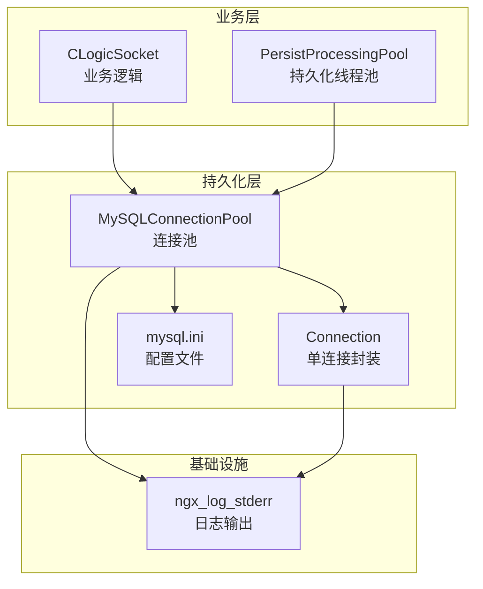
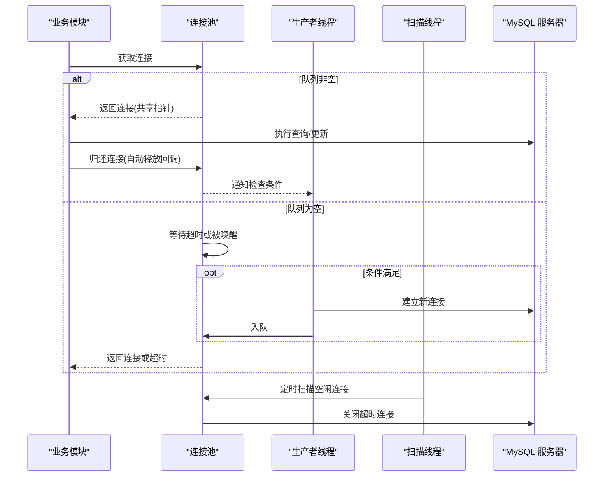
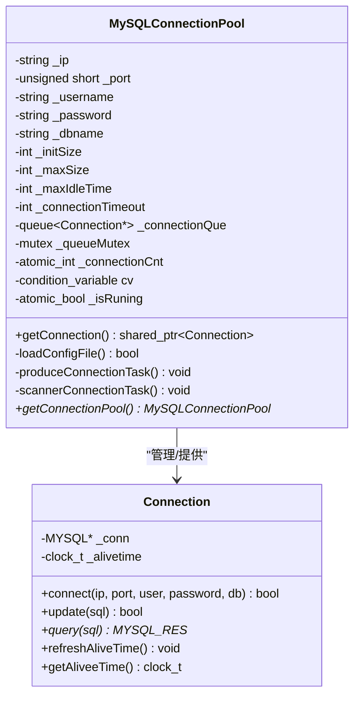
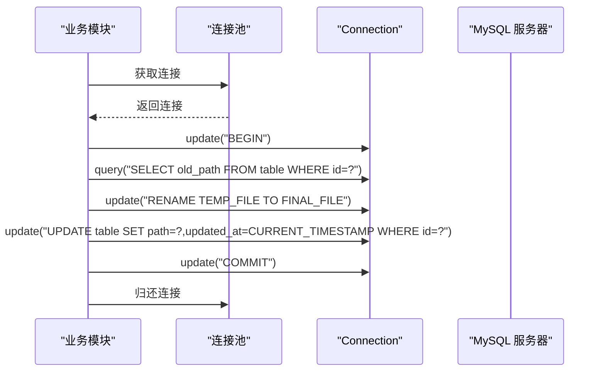
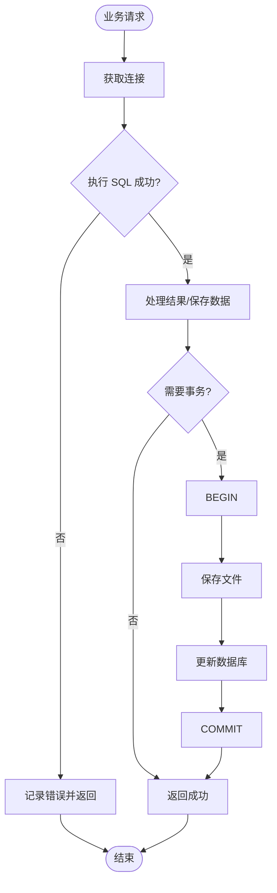
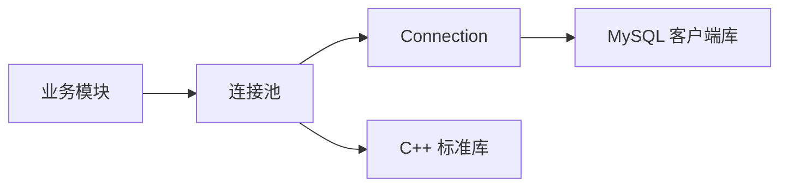

# 数据持久化模块

<cite>
**本文档引用的文件**
- [persist/ngx_mysql_connection_pool.cxx](file://persist/ngx_mysql_connection_pool.cxx)
- [persist/ngx_mysql_connection.cxx](file://persist/ngx_mysql_connection.cxx)
- [include/ngx_mysql_connection_pool.h](file://include/ngx_mysql_connection_pool.h)
- [include/ngx_mysql_connection.h](file://include/ngx_mysql_connection.h)
- [persist/mysql.ini](file://persist/mysql.ini)
- [logic/ngx_c_slogic.cxx](file://logic/ngx_c_slogic.cxx)
- [misc/ngx_lockfree_persistPool.cxx](file://misc/ngx_lockfree_persistPool.cxx)
- [include/ngx_func.h](file://include/ngx_func.h)
- [app/ngx_log.cxx](file://app/ngx_log.cxx)
</cite>

## 目录
1. [简介](#简介)
2. [项目结构](#项目结构)
3. [核心组件](#核心组件)
4. [架构概览](#架构概览)
5. [详细组件分析](#详细组件分析)
6. [依赖关系分析](#依赖关系分析)
7. [性能考量](#性能考量)
8. [故障排查指南](#故障排查指南)
9. [结论](#结论)

## 简介
本技术文档聚焦于数据持久化模块，系统性阐述 MySQL 连接池的设计与实现，涵盖连接管理策略、连接复用机制、超时与空闲回收处理；深入解析数据库操作封装（SQL 构建、参数绑定、事务处理）；给出与业务逻辑模块的接口设计及数据一致性保障；并提供配置参数、性能优化与连接池调优建议，以及错误处理与故障恢复策略。

## 项目结构
数据持久化模块位于 persist 目录，核心文件包括：
- 连接池实现：persist/ngx_mysql_connection_pool.cxx
- 单连接封装：persist/ngx_mysql_connection.cxx
- 头文件声明：include/ngx_mysql_connection_pool.h、include/ngx_mysql_connection.h
- 配置文件：persist/mysql.ini
- 业务集成示例：logic/ngx_c_slogic.cxx
- 事务处理示例：misc/ngx_lockfree_persistPool.cxx
- 日志与错误处理：include/ngx_func.h、app/ngx_log.cxx

图表来源
- [persist/ngx_mysql_connection_pool.cxx](file://persist/ngx_mysql_connection_pool.cxx#L1-L349)
- [persist/ngx_mysql_connection.cxx](file://persist/ngx_mysql_connection.cxx#L1-L56)
- [include/ngx_mysql_connection_pool.h](file://include/ngx_mysql_connection_pool.h#L1-L55)
- [include/ngx_mysql_connection.h](file://include/ngx_mysql_connection.h#L1-L35)
- [persist/mysql.ini](file://persist/mysql.ini#L1-L13)
- [logic/ngx_c_slogic.cxx](file://logic/ngx_c_slogic.cxx#L245-L274)
- [misc/ngx_lockfree_persistPool.cxx](file://misc/ngx_lockfree_persistPool.cxx#L109-L157)
- [include/ngx_func.h](file://include/ngx_func.h#L12-L18)
- [app/ngx_log.cxx](file://app/ngx_log.cxx#L33-L72)

章节来源
- [persist/ngx_mysql_connection_pool.cxx](file://persist/ngx_mysql_connection_pool.cxx#L1-L349)
- [persist/ngx_mysql_connection.cxx](file://persist/ngx_mysql_connection.cxx#L1-L56)
- [include/ngx_mysql_connection_pool.h](file://include/ngx_mysql_connection_pool.h#L1-L55)
- [include/ngx_mysql_connection.h](file://include/ngx_mysql_connection.h#L1-L35)
- [persist/mysql.ini](file://persist/mysql.ini#L1-L13)
- [logic/ngx_c_slogic.cxx](file://logic/ngx_c_slogic.cxx#L245-L274)
- [misc/ngx_lockfree_persistPool.cxx](file://misc/ngx_lockfree_persistPool.cxx#L109-L157)
- [include/ngx_func.h](file://include/ngx_func.h#L12-L18)
- [app/ngx_log.cxx](file://app/ngx_log.cxx#L33-L72)

## 核心组件
- 连接池（MySQLConnectionPool）
  - 单例懒汉模式，线程安全
  - 支持从配置文件加载参数（IP、端口、账号、库名、初始/最大连接数、最大空闲时间、连接超时）
  - 生产者-消费者模型：空队列时生产新连接；消费后通知生产者检查
  - 定时扫描空闲连接并回收至初始规模
- 单连接（Connection）
  - 封装 mysql_init/mysql_real_connect/mysql_close
  - 提供 update（insert/delete/update）与 query（select）接口
  - 维护空闲存活时间，支持空闲回收
- 业务集成
  - 业务逻辑模块通过连接池获取连接并执行查询
  - 持久化线程池在保存数据时使用事务，确保一致性

章节来源
- [include/ngx_mysql_connection_pool.h](file://include/ngx_mysql_connection_pool.h#L14-L55)
- [persist/ngx_mysql_connection_pool.cxx](file://persist/ngx_mysql_connection_pool.cxx#L5-L349)
- [include/ngx_mysql_connection.h](file://include/ngx_mysql_connection.h#L9-L35)
- [persist/ngx_mysql_connection.cxx](file://persist/ngx_mysql_connection.cxx#L6-L56)
- [logic/ngx_c_slogic.cxx](file://logic/ngx_c_slogic.cxx#L245-L274)
- [misc/ngx_lockfree_persistPool.cxx](file://misc/ngx_lockfree_persistPool.cxx#L109-L157)

## 架构概览
连接池采用“条件变量 + 互斥锁”的线程同步机制，结合独立线程进行连接生产和空闲扫描，实现高性能、低阻塞的连接复用。业务模块通过共享指针自动归还连接，避免泄漏。

图表来源
- [persist/ngx_mysql_connection_pool.cxx](file://persist/ngx_mysql_connection_pool.cxx#L173-L203)
- [persist/ngx_mysql_connection_pool.cxx](file://persist/ngx_mysql_connection_pool.cxx#L281-L311)
- [persist/ngx_mysql_connection_pool.cxx](file://persist/ngx_mysql_connection_pool.cxx#L208-L255)

## 详细组件分析

### 连接池设计与实现
- 单例与懒加载
  - 使用静态局部变量保证线程安全的单例
  - 构造时加载配置并创建初始连接数
- 配置加载
  - 逐行解析键值对，支持 ip、port、username、password、dbname、initSize、maxSize、maxIdleTime、connectionTimeOut
- 生产者线程
  - 当队列为空时创建新连接，上限受 maxSize 控制
  - 使用条件变量等待/唤醒，避免忙轮询
- 消费者接口
  - getConnection() 返回 std::shared_ptr<Connection>，利用自定义删除器在析构时自动归还连接
  - 支持超时等待，超时返回空指针
- 空闲扫描线程
  - 按 maxIdleTime 周期扫描队列，释放超出空闲时间的连接，维持至 initSize
- 销毁与清理
  - 析构时设置停止标志，唤醒等待线程并等待队列清空后回收

图表来源
- [include/ngx_mysql_connection_pool.h](file://include/ngx_mysql_connection_pool.h#L14-L55)
- [include/ngx_mysql_connection.h](file://include/ngx_mysql_connection.h#L9-L35)

章节来源
- [persist/ngx_mysql_connection_pool.cxx](file://persist/ngx_mysql_connection_pool.cxx#L5-L349)
- [include/ngx_mysql_connection_pool.h](file://include/ngx_mysql_connection_pool.h#L14-L55)
- [persist/mysql.ini](file://persist/mysql.ini#L1-L13)

### 数据库操作封装
- 连接封装
  - 初始化与关闭：封装 mysql_init/mysql_close
  - 连接建立：封装 mysql_real_connect
  - 查询与更新：封装 mysql_query/mysql_use_result/mysql_free_result
- SQL 构建与参数绑定
  - 业务侧直接拼接 SQL 字符串（示例见业务逻辑模块）
  - 建议在实际项目中引入预处理语句（prepare/execute）以提升安全性与性能
- 事务处理
  - 通过显式 SQL 控制事务：BEGIN/COMMIT/ROLLBACK
  - 示例展示了完整的事务流程：开启事务、查询旧文件、重命名文件、更新记录、提交事务、清理旧文件

图表来源
- [misc/ngx_lockfree_persistPool.cxx](file://misc/ngx_lockfree_persistPool.cxx#L109-L157)
- [persist/ngx_mysql_connection.cxx](file://persist/ngx_mysql_connection.cxx#L34-L55)

章节来源
- [persist/ngx_mysql_connection.cxx](file://persist/ngx_mysql_connection.cxx#L6-L56)
- [misc/ngx_lockfree_persistPool.cxx](file://misc/ngx_lockfree_persistPool.cxx#L109-L157)

### 与业务逻辑模块的接口设计
- 接口职责
  - 业务模块仅需调用连接池的 getConnection() 获取连接，执行 SQL 后由连接池自动归还
  - 业务模块无需关心连接生命周期与线程安全细节
- 数据一致性
  - 通过事务控制保证文件重命名与数据库更新的原子性
  - 异常时回滚事务并清理临时文件
- 示例流程
  - 查询：业务模块拼接查询 SQL，调用 Connection::query 并处理结果集
  - 保存：持久化线程池开启事务，执行文件落盘与数据库更新，最后提交

图表来源
- [logic/ngx_c_slogic.cxx](file://logic/ngx_c_slogic.cxx#L245-L274)
- [misc/ngx_lockfree_persistPool.cxx](file://misc/ngx_lockfree_persistPool.cxx#L109-L157)

章节来源
- [logic/ngx_c_slogic.cxx](file://logic/ngx_c_slogic.cxx#L245-L274)
- [misc/ngx_lockfree_persistPool.cxx](file://misc/ngx_lockfree_persistPool.cxx#L109-L157)

## 依赖关系分析
- 组件耦合
  - 业务模块仅依赖连接池接口，降低耦合度
  - 连接池内部依赖 MySQL C API 与 C++ 标准库（线程、互斥、条件变量）
- 外部依赖
  - MySQL 客户端库（mysql.h）
  - 标准 C/C++ 库（线程、互斥、条件变量、时间）

图表来源
- [include/ngx_mysql_connection_pool.h](file://include/ngx_mysql_connection_pool.h#L1-L11)
- [include/ngx_mysql_connection.h](file://include/ngx_mysql_connection.h#L1-L4)
- [persist/ngx_mysql_connection_pool.cxx](file://persist/ngx_mysql_connection_pool.cxx#L1-L2)
- [persist/ngx_mysql_connection.cxx](file://persist/ngx_mysql_connection.cxx#L1-L2)

章节来源
- [include/ngx_mysql_connection_pool.h](file://include/ngx_mysql_connection_pool.h#L1-L11)
- [include/ngx_mysql_connection.h](file://include/ngx_mysql_connection.h#L1-L4)
- [persist/ngx_mysql_connection_pool.cxx](file://persist/ngx_mysql_connection_pool.cxx#L1-L2)
- [persist/ngx_mysql_connection.cxx](file://persist/ngx_mysql_connection.cxx#L1-L2)

## 性能考量
- 连接池参数调优
  - initSize：根据启动阶段并发峰值设置，避免冷启动抖动
  - maxSize：依据数据库最大连接数与业务并发，防止过度占用资源
  - maxIdleTime：平衡内存占用与连接重建成本
  - connectionTimeOut：根据业务超时容忍度设置，避免长时间阻塞
- 线程模型
  - 生产者/扫描线程采用 detach，减少主线程负担
  - 条件变量 wait_for 实现可控超时，避免无限等待
- SQL 优化建议
  - 使用预处理语句减少解析与注入风险
  - 合理索引与查询条件，避免全表扫描
  - 批量写入与事务合并，减少往返次数
- 文件与数据库一致性
  - 事务内完成文件落盘与数据库更新，失败时回滚并清理临时文件

章节来源
- [persist/mysql.ini](file://persist/mysql.ini#L1-L13)
- [persist/ngx_mysql_connection_pool.cxx](file://persist/ngx_mysql_connection_pool.cxx#L173-L203)
- [persist/ngx_mysql_connection_pool.cxx](file://persist/ngx_mysql_connection_pool.cxx#L281-L311)
- [misc/ngx_lockfree_persistPool.cxx](file://misc/ngx_lockfree_persistPool.cxx#L109-L157)

## 故障排查指南
- 连接池相关
  - 获取连接超时：检查 connectionTimeOut 是否过小，或是否存在连接泄露
  - 连接池耗尽：增大 maxSize 或优化业务并发
  - 空闲连接未回收：确认 maxIdleTime 设置与扫描线程运行状态
- 数据库操作
  - 连接失败：检查 ip/port/username/password/dbname 配置
  - 查询/更新失败：查看日志输出，定位 SQL 语法或权限问题
- 事务与一致性
  - 事务回滚：确认异常捕获与回滚逻辑
  - 文件清理：检查临时文件与旧文件清理逻辑
- 日志与错误
  - 使用 ngx_log_stderr 输出错误信息，便于定位问题
  - 日志初始化与文件写入失败时回退到标准错误输出

章节来源
- [persist/ngx_mysql_connection_pool.cxx](file://persist/ngx_mysql_connection_pool.cxx#L14-L74)
- [persist/ngx_mysql_connection.cxx](file://persist/ngx_mysql_connection.cxx#L19-L32)
- [misc/ngx_lockfree_persistPool.cxx](file://misc/ngx_lockfree_persistPool.cxx#L136-L145)
- [include/ngx_func.h](file://include/ngx_func.h#L12-L18)
- [app/ngx_log.cxx](file://app/ngx_log.cxx#L33-L72)

## 结论
该数据持久化模块通过连接池实现了高效的连接复用与线程安全的管理，配合业务模块的事务处理与文件一致性保障，形成了稳定可靠的数据持久化方案。建议在生产环境中进一步引入预处理语句、监控指标与更精细的超时与重试策略，以提升整体稳定性与性能。