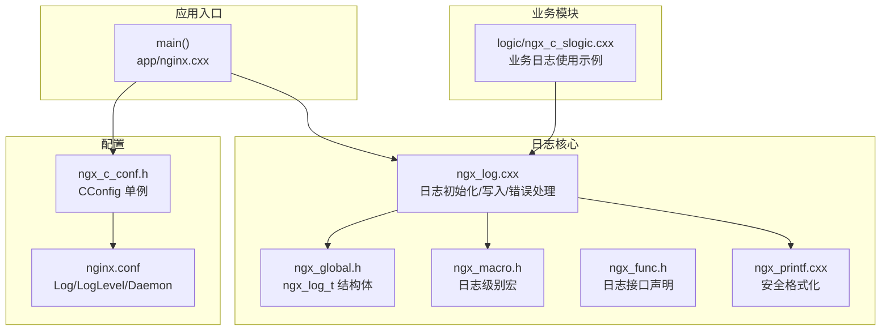
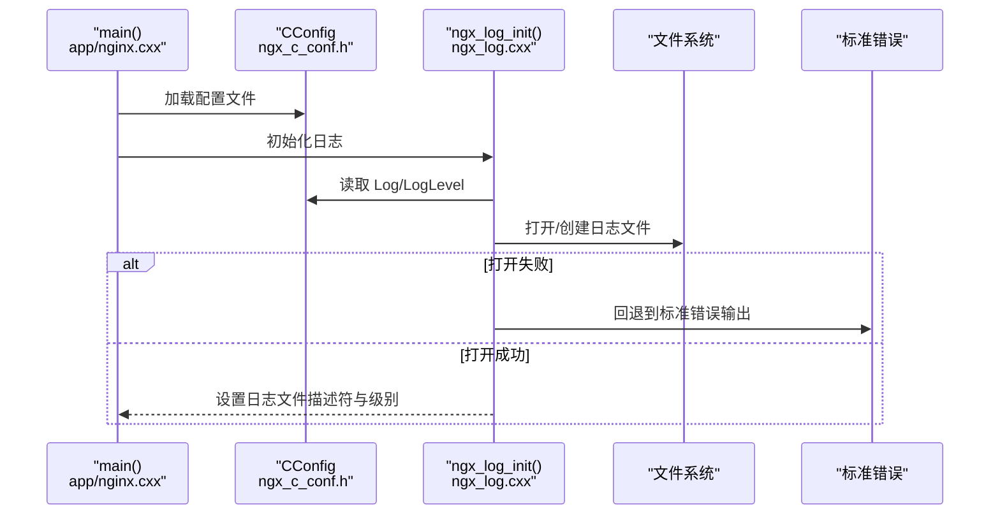
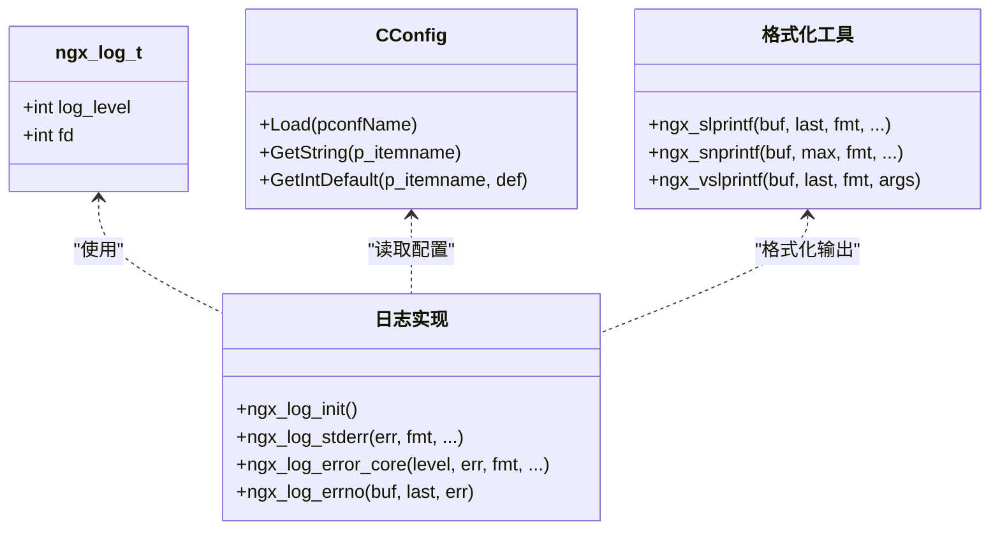
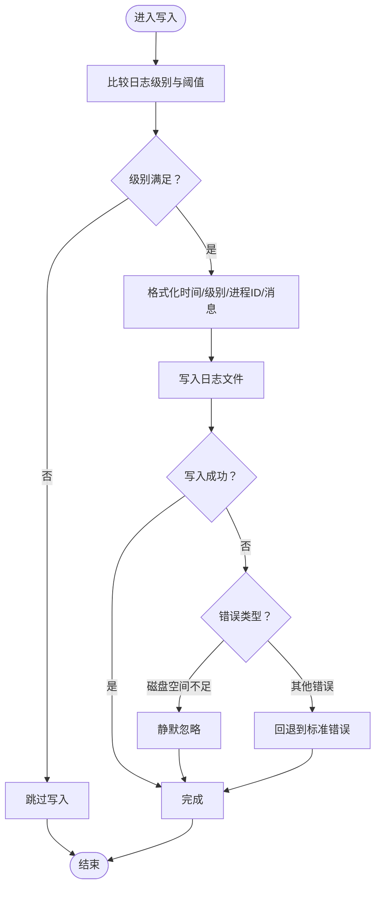

# 日志系统

<cite>
**本文引用的文件列表**
- [app/ngx_log.cxx](file://app/ngx_log.cxx)
- [include/ngx_macro.h](file://include/ngx_macro.h)
- [include/ngx_global.h](file://include/ngx_global.h)
- [include/ngx_func.h](file://include/ngx_func.h)
- [include/ngx_c_conf.h](file://include/ngx_c_conf.h)
- [app/nginx.cxx](file://app/nginx.cxx)
- [app/ngx_printf.cxx](file://app/ngx_printf.cxx)
- [nginx.conf](file://nginx.conf)
- [logic/ngx_c_slogic.cxx](file://logic/ngx_c_slogic.cxx)
</cite>

## 目录
1. [简介](#简介)
2. [项目结构](#项目结构)
3. [核心组件](#核心组件)
4. [架构总览](#架构总览)
5. [组件详解](#组件详解)
6. [依赖关系分析](#依赖关系分析)
7. [性能考量](#性能考量)
8. [故障排查指南](#故障排查指南)
9. [结论](#结论)
10. [附录](#附录)

## 简介
本技术文档围绕日志系统的设计与实现展开，重点覆盖以下方面：
- 日志级别管理：日志等级定义、过滤与输出控制
- 日志格式化：时间戳、进程ID、日志级别、错误码与消息体的格式化
- 日志文件管理：初始化、打开、写入、错误回退与磁盘空间处理
- 配置选项：日志文件路径、日志级别阈值、守护进程模式
- 使用最佳实践：在业务逻辑中正确选择日志级别与输出目标
- 调试与监控：如何利用日志进行问题定位与运行状态观测
- 性能优化：减少写放大、避免阻塞、合理选择缓冲策略
- 磁盘空间管理：磁盘空间耗尽时的容错与降级
- 安全与隐私：敏感信息脱敏与最小暴露原则

## 项目结构
日志系统由以下关键模块组成：
- 日志核心实现：负责格式化、写入、错误处理与回退
- 全局日志上下文：持有日志文件描述符与日志级别
- 配置解析：从配置文件读取日志路径与日志级别
- 应用入口：初始化配置与日志，确保日志可用
- 格式化工具：提供安全的字符串格式化函数
- 业务模块：在逻辑层使用日志记录事件与错误

图表来源
- [app/nginx.cxx](file://app/nginx.cxx#L44-L122)
- [app/ngx_log.cxx](file://app/ngx_log.cxx#L184-L209)
- [include/ngx_global.h](file://include/ngx_global.h#L18-L24)
- [include/ngx_macro.h](file://include/ngx_macro.h#L17-L30)
- [include/ngx_func.h](file://include/ngx_func.h#L12-L19)
- [include/ngx_c_conf.h](file://include/ngx_c_conf.h#L8-L53)
- [nginx.conf](file://nginx.conf#L11-L18)
- [app/ngx_printf.cxx](file://app/ngx_printf.cxx#L14-L34)
- [logic/ngx_c_slogic.cxx](file://logic/ngx_c_slogic.cxx#L77-L129)

章节来源
- [app/nginx.cxx](file://app/nginx.cxx#L44-L122)
- [app/ngx_log.cxx](file://app/ngx_log.cxx#L184-L209)
- [include/ngx_global.h](file://include/ngx_global.h#L18-L24)
- [include/ngx_macro.h](file://include/ngx_macro.h#L17-L30)
- [include/ngx_func.h](file://include/ngx_func.h#L12-L19)
- [include/ngx_c_conf.h](file://include/ngx_c_conf.h#L8-L53)
- [nginx.conf](file://nginx.conf#L11-L18)
- [app/ngx_printf.cxx](file://app/ngx_printf.cxx#L14-L34)
- [logic/ngx_c_slogic.cxx](file://logic/ngx_c_slogic.cxx#L77-L129)

## 核心组件
- 日志级别与格式化
  - 日志级别：stderr、emergency、alert、critical、error、warning、notice、info、debug（0-8）
  - 时间戳：精确到秒，格式含年/月/日 时:分:秒
  - 进程ID：使用进程ID字段
  - 错误码：当传入错误码时，附加系统错误文本
- 日志上下文
  - 持有日志文件描述符与日志级别阈值
- 初始化与写入
  - 从配置读取日志路径与级别
  - 打开日志文件，失败时回退到标准错误
  - 写入时按级别阈值过滤，遇到磁盘空间不足时进行降级处理

章节来源
- [include/ngx_macro.h](file://include/ngx_macro.h#L17-L30)
- [include/ngx_global.h](file://include/ngx_global.h#L18-L24)
- [app/ngx_log.cxx](file://app/ngx_log.cxx#L184-L209)
- [app/ngx_log.cxx](file://app/ngx_log.cxx#L100-L182)

## 架构总览
日志系统采用“配置驱动 + 核心实现 + 上下文”的分层设计：
- 配置层：CConfig 单例负责读取 nginx.conf 中的 Log 与 LogLevel
- 接口层：ngx_func.h 提供日志初始化、标准错误输出、核心写入与格式化函数声明
- 实现层：ngx_log.cxx 实现日志格式化、写入、错误码附加与磁盘空间处理
- 工具层：ngx_printf.cxx 提供安全格式化函数，避免缓冲溢出
- 应用层：app/nginx.cxx 在启动阶段初始化配置与日志；业务模块在运行期使用日志

图表来源
- [app/nginx.cxx](file://app/nginx.cxx#L74-L88)
- [include/ngx_c_conf.h](file://include/ngx_c_conf.h#L46-L48)
- [app/ngx_log.cxx](file://app/ngx_log.cxx#L184-L209)

章节来源
- [app/nginx.cxx](file://app/nginx.cxx#L74-L88)
- [include/ngx_c_conf.h](file://include/ngx_c_conf.h#L46-L48)
- [app/ngx_log.cxx](file://app/ngx_log.cxx#L184-L209)

## 组件详解

### 日志级别管理
- 级别定义：0（stderr）至8（debug），数值越小级别越高
- 过滤策略：写入前比较级别与阈值，仅当级别不大于阈值时输出
- 默认级别：未配置时使用 notice（6）

章节来源
- [include/ngx_macro.h](file://include/ngx_macro.h#L17-L30)
- [app/ngx_log.cxx](file://app/ngx_log.cxx#L154-L157)
- [app/ngx_log.cxx](file://app/ngx_log.cxx#L196-L197)

### 日志格式化
- 时间戳：年/月/日 时:分:秒
- 级别标签：以 [level] 形式输出
- 进程ID：%P 格式输出
- 可变参数：支持多种格式化占位符，安全版本避免缓冲溢出
- 错误码：当 err 非零时，附加“(错误码: 错误文本)”

章节来源
- [app/ngx_log.cxx](file://app/ngx_log.cxx#L125-L149)
- [app/ngx_printf.cxx](file://app/ngx_printf.cxx#L14-L34)
- [app/ngx_printf.cxx](file://app/ngx_printf.cxx#L42-L77)

### 日志文件管理
- 初始化：从配置读取日志路径，若未提供则使用默认路径
- 打开策略：追加写入，不存在即创建，权限 0644
- 回退机制：打开失败时回退到标准错误输出
- 写入策略：写入前按级别过滤；写入失败时区分磁盘空间不足与其他错误
- 磁盘空间处理：磁盘空间不足时静默忽略，避免阻塞；其他错误回退到标准错误

章节来源
- [app/ngx_log.cxx](file://app/ngx_log.cxx#L184-L209)
- [app/ngx_log.cxx](file://app/ngx_log.cxx#L151-L180)

### 配置选项
- 日志文件路径：Log=文件路径
- 日志级别阈值：LogLevel=0..8
- 守护进程模式：Daemon=1 启用守护进程

章节来源
- [nginx.conf](file://nginx.conf#L11-L18)
- [app/nginx.cxx](file://app/nginx.cxx#L98-L114)

### 使用最佳实践
- 选择合适级别：错误/异常使用 error/warn/crit/alert/emerg；普通事件使用 notice/info；调试细节使用 debug
- 输出必要上下文：包含时间、进程ID、消息码、关键参数
- 避免敏感信息：不要在日志中记录密码、令牌、私钥等
- 控制频率：高频事件使用 info，低频事件使用 debug；避免在热路径中频繁写日志
- 异常处理：捕获系统调用错误时，使用错误码附加输出

章节来源
- [logic/ngx_c_slogic.cxx](file://logic/ngx_c_slogic.cxx#L101-L126)
- [logic/ngx_c_slogic.cxx](file://logic/ngx_c_slogic.cxx#L190-L204)

### 调试与监控
- 调试：开启 debug 级别，结合时间戳与进程ID定位问题
- 监控：通过日志统计错误率、超时、异常断开等指标
- 分析：使用日志分析工具（如 grep/sed/awk/正则）提取关键字段进行聚合

章节来源
- [app/ngx_log.cxx](file://app/ngx_log.cxx#L125-L149)

### 安全与隐私
- 敏感信息脱敏：避免在日志中输出密码、令牌、私钥等
- 最小暴露：仅记录必要的上下文信息，避免泄露系统内部结构
- 文件权限：日志文件权限 0644，避免过度授权

章节来源
- [app/ngx_log.cxx](file://app/ngx_log.cxx#L201-L202)

## 依赖关系分析
- 日志实现依赖全局上下文与宏定义
- 初始化依赖配置解析
- 格式化依赖安全字符串函数
- 业务模块依赖日志接口

图表来源
- [include/ngx_global.h](file://include/ngx_global.h#L18-L24)
- [include/ngx_c_conf.h](file://include/ngx_c_conf.h#L8-L53)
- [app/ngx_log.cxx](file://app/ngx_log.cxx#L184-L209)
- [app/ngx_printf.cxx](file://app/ngx_printf.cxx#L14-L34)

章节来源
- [include/ngx_global.h](file://include/ngx_global.h#L18-L24)
- [include/ngx_c_conf.h](file://include/ngx_c_conf.h#L8-L53)
- [app/ngx_log.cxx](file://app/ngx_log.cxx#L184-L209)
- [app/ngx_printf.cxx](file://app/ngx_printf.cxx#L14-L34)

## 性能考量
- 写入策略
  - 追加写入：避免随机写，降低磁盘寻道开销
  - 非直通写：使用内核页缓存，提升吞吐
- 过滤与回退
  - 级别过滤：在进入写入前过滤，减少无效 IO
  - 磁盘空间不足时静默忽略，避免阻塞主线程
- 格式化成本
  - 使用安全格式化函数，避免缓冲溢出带来的重试与开销
- 建议
  - 生产环境关闭 debug 级别，或仅在特定模块启用
  - 对高频事件使用批量输出或采样
  - 将日志写入与业务处理解耦，避免在热路径中直接写盘

章节来源
- [app/ngx_log.cxx](file://app/ngx_log.cxx#L151-L180)
- [app/ngx_log.cxx](file://app/ngx_log.cxx#L201-L202)
- [app/ngx_printf.cxx](file://app/ngx_printf.cxx#L14-L34)

## 故障排查指南
- 日志文件无法打开
  - 检查路径是否存在与权限是否正确
  - 查看初始化回退到标准错误的提示
- 磁盘空间不足
  - 观察写入失败且错误码为磁盘空间不足的情况
  - 建议清理旧日志或扩容磁盘
- 日志级别过高导致输出过多
  - 调整 LogLevel，生产环境建议使用 notice 或更高
- 日志中缺少上下文
  - 确保在关键路径输出时间戳、进程ID与消息码
- 业务异常
  - 在业务模块中使用标准错误输出记录异常，便于快速定位

章节来源
- [app/ngx_log.cxx](file://app/ngx_log.cxx#L203-L207)
- [app/ngx_log.cxx](file://app/ngx_log.cxx#L164-L177)
- [logic/ngx_c_slogic.cxx](file://logic/ngx_c_slogic.cxx#L101-L126)

## 结论
该日志系统以简洁高效为核心目标，通过明确的日志级别、安全的格式化与稳健的文件管理，满足生产环境的可观测性需求。建议在生产环境中合理配置日志级别与输出目标，结合磁盘空间管理与安全策略，持续优化日志性能与可维护性。

## 附录

### 配置项参考
- Log：日志文件路径
- LogLevel：日志级别阈值（0-8）
- Daemon：守护进程开关（1 启用）

章节来源
- [nginx.conf](file://nginx.conf#L11-L18)

### 关键流程图：日志写入

图表来源
- [app/ngx_log.cxx](file://app/ngx_log.cxx#L151-L180)