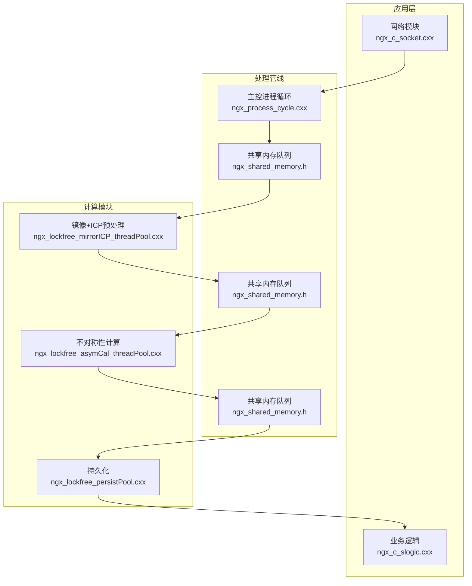
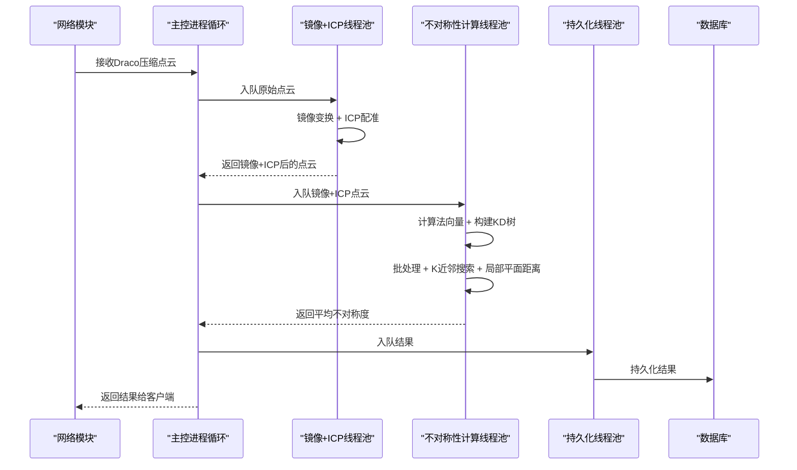
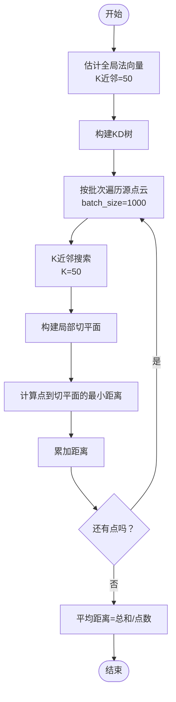
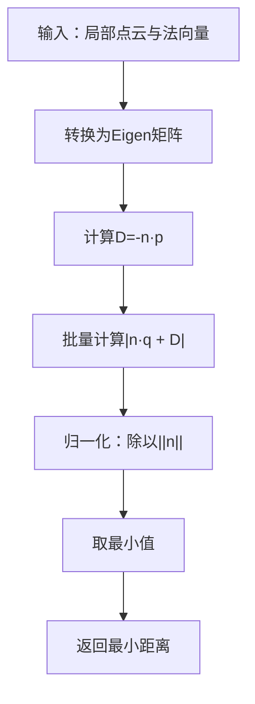
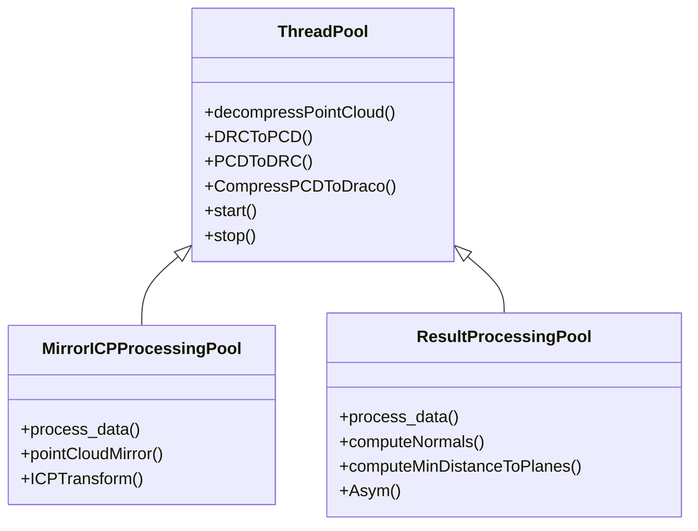

# 不对称性计算算法

<cite>
**本文档引用的文件**
- [ngx_lockfree_asymCal_threadPool.cxx](file://misc/ngx_lockfree_asymCal_threadPool.cxx)
- [ngx_lockfree_threadPool.h](file://include/ngx_lockfree_threadPool.h)
- [ngx_lockfree_threadPool.cxx](file://misc/ngx_lockfree_threadPool.cxx)
- [ngx_shared_memory.h](file://include/ngx_shared_memory.h)
- [ngx_process_cycle.cxx](file://proc/ngx_process_cycle.cxx)
- [ngx_lockfree_mirrorICP_threadPool.cxx](file://misc/ngx_lockfree_mirrorICP_threadPool.cxx)
- [ngx_c_socket.cxx](file://net/ngx_c_socket.cxx)
</cite>

## 目录
1. [简介](#简介)
2. [项目结构](#项目结构)
3. [核心组件](#核心组件)
4. [架构总览](#架构总览)
5. [详细组件分析](#详细组件分析)
6. [依赖关系分析](#依赖关系分析)
7. [性能考量](#性能考量)
8. [故障排查指南](#故障排查指南)
9. [结论](#结论)
10. [附录](#附录)

## 简介
本技术文档围绕“不对称性计算算法”展开，系统阐述其数学原理、实现细节与工程化集成。算法目标是衡量两个三维点云之间的不对称程度，核心流程包括：
- 点云法向量估计（基于PCL的OpenMP并行法向量估计）
- 局部平面距离计算（基于局部K近邻点云与其法向量构建切平面，计算查询点到切平面的最小距离）
- 整体不对称性度量（对源点云每个点计算局部最小距离，取平均作为最终度量）

文档还涵盖批处理优化、KD树搜索机制、并行计算优化、性能分析与参数调优建议，并给出实际应用注意事项。

## 项目结构
该仓库采用模块化分层设计，与不对称性计算相关的模块主要分布在以下路径：
- include：线程池抽象、共享内存队列、数据结构定义
- misc：线程池实现、镜像+ICP预处理、不对称性计算线程池、持久化线程池
- proc：主控进程循环与队列调度
- net：网络通信（序列化/反序列化、发送结果）
- logic：业务逻辑（数据库读写、结果查询）

图表来源
- [ngx_process_cycle.cxx](file://proc/ngx_process_cycle.cxx#L49-L83)
- [ngx_shared_memory.h](file://include/ngx_shared_memory.h#L65-L84)
- [ngx_lockfree_mirrorICP_threadPool.cxx](file://misc/ngx_lockfree_mirrorICP_threadPool.cxx#L35-L58)
- [ngx_lockfree_asymCal_threadPool.cxx](file://misc/ngx_lockfree_asymCal_threadPool.cxx#L47-L87)
- [ngx_c_socket.cxx](file://net/ngx_c_socket.cxx#L906-L907)

章节来源
- [ngx_process_cycle.cxx](file://proc/ngx_process_cycle.cxx#L49-L83)
- [ngx_shared_memory.h](file://include/ngx_shared_memory.h#L65-L84)

## 核心组件
- 线程池抽象与工具方法：提供Draco压缩/解压、PCL点云转换、线程池生命周期管理
- 镜像+ICP预处理：对原始点云做镜像变换与ICP配准，得到对齐后的目标点云
- 不对称性计算线程池：完成法向量估计、KD树构建、批处理、局部平面距离计算与平均值聚合
- 共享内存队列：跨进程/线程的无锁队列，支撑流水线各阶段解耦
- 网络与持久化：将结果通过网络返回客户端，并持久化到数据库

章节来源
- [ngx_lockfree_threadPool.h](file://include/ngx_lockfree_threadPool.h#L17-L77)
- [ngx_lockfree_threadPool.cxx](file://misc/ngx_lockfree_threadPool.cxx#L3-L78)
- [ngx_lockfree_mirrorICP_threadPool.cxx](file://misc/ngx_lockfree_mirrorICP_threadPool.cxx#L35-L93)
- [ngx_lockfree_asymCal_threadPool.cxx](file://misc/ngx_lockfree_asymCal_threadPool.cxx#L47-L204)
- [ngx_shared_memory.h](file://include/ngx_shared_memory.h#L24-L84)

## 架构总览
不对称性计算属于端到端流水线的一部分，数据流如下：
- 网络接收原始点云（Draco压缩）
- 镜像+ICP预处理：镜像变换 + ICP配准，得到对齐的目标点云
- 不对称性计算：对源点云每个点，通过KD树检索K近邻，构建局部切平面，计算到切平面的最小距离，取平均
- 结果持久化与网络返回

图表来源
- [ngx_process_cycle.cxx](file://proc/ngx_process_cycle.cxx#L57-L83)
- [ngx_lockfree_mirrorICP_threadPool.cxx](file://misc/ngx_lockfree_mirrorICP_threadPool.cxx#L35-L93)
- [ngx_lockfree_asymCal_threadPool.cxx](file://misc/ngx_lockfree_asymCal_threadPool.cxx#L47-L87)
- [ngx_c_socket.cxx](file://net/ngx_c_socket.cxx#L906-L907)

## 详细组件分析

### 数学原理与算法流程
- 输入
  - 源点云：pcl::PointCloud<pcl::PointXYZ>
  - 对齐后的目标点云：pcl::PointCloud<pcl::PointXYZ>
- 步骤
  1) 全局法向量估计：对目标点云估计法向量，使用PCL的OpenMP并行法向量估计，K近邻数量可配置
  2) 构建KD树：对目标点云建立KD树，用于快速最近邻搜索
  3) 批处理遍历：按固定批次大小遍历源点云，避免一次性占用过多内存
  4) 局部平面距离计算：对每个源点，通过KD树搜索K近邻，结合目标点云局部法向量构建切平面，计算查询点到切平面的最小距离
  5) 平均值聚合：将所有点的最小距离求和取平均，得到整体不对称度量

图表来源
- [ngx_lockfree_asymCal_threadPool.cxx](file://misc/ngx_lockfree_asymCal_threadPool.cxx#L147-L204)
- [ngx_lockfree_asymCal_threadPool.cxx](file://misc/ngx_lockfree_asymCal_threadPool.cxx#L107-L144)
- [ngx_lockfree_asymCal_threadPool.cxx](file://misc/ngx_lockfree_asymCal_threadPool.cxx#L89-L105)

章节来源
- [ngx_lockfree_asymCal_threadPool.cxx](file://misc/ngx_lockfree_asymCal_threadPool.cxx#L89-L204)

### 点云法向量计算
- 使用PCL的OpenMP并行法向量估计，设置线程数与K近邻数量
- 返回法向量点云，供后续局部平面距离计算使用

章节来源
- [ngx_lockfree_asymCal_threadPool.cxx](file://misc/ngx_lockfree_asymCal_threadPool.cxx#L89-L105)

### 局部平面距离计算（矩阵优化版本）
- 将局部点云与法向量转换为Eigen矩阵，批量计算所有点到对应切平面的距离
- 距离公式：|n·q + D| / ||n||，其中D = -n·p
- 返回最小距离

图表来源
- [ngx_lockfree_asymCal_threadPool.cxx](file://misc/ngx_lockfree_asymCal_threadPool.cxx#L107-L144)

章节来源
- [ngx_lockfree_asymCal_threadPool.cxx](file://misc/ngx_lockfree_asymCal_threadPool.cxx#L107-L144)

### 整体不对称性度量计算
- 预计算全局法向量，构建KD树
- 批处理遍历源点云，对每个点进行K近邻搜索与局部平面距离计算
- 最终取平均值作为整体不对称度量

章节来源
- [ngx_lockfree_asymCal_threadPool.cxx](file://misc/ngx_lockfree_asymCal_threadPool.cxx#L147-L204)

### 算法调用与参数配置
- 参数
  - K近邻数量：用于法向量估计与局部平面距离计算，默认K=50
  - 批处理大小：每批处理的点数，默认batch_size=1000
  - OpenMP线程数：法向量估计的并行线程数，默认4
- 调用链
  - 网络接收Draco压缩点云
  - 镜像+ICP预处理得到对齐目标点云
  - 不对称性计算线程池调用Asym函数
  - 结果通过共享内存队列返回并持久化

章节来源
- [ngx_lockfree_asymCal_threadPool.cxx](file://misc/ngx_lockfree_asymCal_threadPool.cxx#L89-L105)
- [ngx_lockfree_asymCal_threadPool.cxx](file://misc/ngx_lockfree_asymCal_threadPool.cxx#L147-L204)
- [ngx_lockfree_mirrorICP_threadPool.cxx](file://misc/ngx_lockfree_mirrorICP_threadPool.cxx#L35-L93)

### 批处理优化策略
- 将大点云按固定批次处理，降低峰值内存占用
- 每批内部逐点处理，避免一次性加载全部点云
- 通过日志记录批次与总点数，便于监控与调试

章节来源
- [ngx_lockfree_asymCal_threadPool.cxx](file://misc/ngx_lockfree_asymCal_threadPool.cxx#L160-L204)

### KD树搜索机制
- 对目标点云构建KD树，加速每个源点的K近邻搜索
- 每次查询返回K个最近邻的索引与距离，用于构建局部点云与法向量

章节来源
- [ngx_lockfree_asymCal_threadPool.cxx](file://misc/ngx_lockfree_asymCal_threadPool.cxx#L156-L181)

### 并行计算优化
- 法向量估计使用OpenMP并行，线程数可配置
- 线程池采用无锁队列，避免阻塞等待
- 主控进程循环中使用动态指数退避策略，缓解队列拥塞

章节来源
- [ngx_lockfree_asymCal_threadPool.cxx](file://misc/ngx_lockfree_asymCal_threadPool.cxx#L95-L96)
- [ngx_process_cycle.cxx](file://proc/ngx_process_cycle.cxx#L759-L785)

### 数据结构与序列化
- PointCloud/MirrorICPPointCloud/ResPointCloud/ResToNetwork等结构体定义于共享内存头文件
- 点云采用Draco压缩，通过线程池工具函数进行解压与PCL转换

章节来源
- [ngx_shared_memory.h](file://include/ngx_shared_memory.h#L24-L63)
- [ngx_lockfree_threadPool.cxx](file://misc/ngx_lockfree_threadPool.cxx#L3-L78)

## 依赖关系分析

图表来源
- [ngx_lockfree_threadPool.h](file://include/ngx_lockfree_threadPool.h#L17-L120)
- [ngx_lockfree_threadPool.cxx](file://misc/ngx_lockfree_threadPool.cxx#L3-L78)
- [ngx_lockfree_mirrorICP_threadPool.cxx](file://misc/ngx_lockfree_mirrorICP_threadPool.cxx#L35-L93)
- [ngx_lockfree_asymCal_threadPool.cxx](file://misc/ngx_lockfree_asymCal_threadPool.cxx#L47-L120)

章节来源
- [ngx_lockfree_threadPool.h](file://include/ngx_lockfree_threadPool.h#L17-L120)

## 性能考量
- 时间复杂度
  - 法向量估计：O(N·K)，N为点数，K为K近邻
  - KD树构建：O(N·logN)
  - 每点K近邻搜索：O(logN)（期望），整体O(N·logN）
  - 局部平面距离计算：O(K)
  - 总体复杂度：O(N·K + N·logN)
- 内存占用
  - 法向量与局部点云/法向量缓存，受K与批处理大小影响
  - 建议根据硬件内存调整K与batch_size
- 并行化
  - OpenMP并行法向量估计提升吞吐
  - 无锁队列减少上下文切换
- I/O与压缩
  - Draco压缩显著降低网络传输与存储开销
- 队列拥塞控制
  - 主控进程采用动态指数退避策略，避免系统过载

章节来源
- [ngx_lockfree_asymCal_threadPool.cxx](file://misc/ngx_lockfree_asymCal_threadPool.cxx#L89-L105)
- [ngx_process_cycle.cxx](file://proc/ngx_process_cycle.cxx#L759-L785)
- [ngx_lockfree_threadPool.cxx](file://misc/ngx_lockfree_threadPool.cxx#L62-L78)

## 故障排查指南
- 法向量计算失败
  - 现象：返回无穷大或异常值
  - 排查：确认目标点云非空且法向量尺寸匹配；检查K近邻数量是否合理
- KD树搜索异常
  - 现象：K近邻为空或结果异常
  - 排查：确认KD树已正确构建；检查输入点云密度与分布
- 批处理卡顿
  - 现象：处理缓慢或内存飙升
  - 排查：适当减小batch_size；检查K近邻数量；监控队列长度
- 队列拥塞
  - 现象：处理延迟增大
  - 排查：启用动态退避策略；增加线程池线程数；优化下游处理速度
- 网络返回异常
  - 现象：客户端未收到结果
  - 排查：确认ResToNetwork结构体字段与网络发送逻辑一致；检查fd有效性

章节来源
- [ngx_lockfree_asymCal_threadPool.cxx](file://misc/ngx_lockfree_asymCal_threadPool.cxx#L147-L204)
- [ngx_process_cycle.cxx](file://proc/ngx_process_cycle.cxx#L759-L785)
- [ngx_c_socket.cxx](file://net/ngx_c_socket.cxx#L906-L907)

## 结论
该不对称性计算算法通过法向量估计、局部切平面距离与批处理优化，实现了对大规模点云的高效不对称度量。配合Draco压缩、无锁队列与动态退避策略，系统在工程上具备良好的可扩展性与稳定性。建议在实际部署中根据硬件条件与数据规模调优K近邻、批处理大小与并行度，并持续监控队列负载与处理延迟。

## 附录
- 数据结构定义与共享内存队列
  - PointCloud/MirrorICPPointCloud/ResPointCloud/ResToNetwork
  - 共享内存队列与全局指针声明
- 算法调用路径
  - 网络接收 -> 镜像+ICP -> 不对称性计算 -> 持久化 -> 返回客户端

章节来源
- [ngx_shared_memory.h](file://include/ngx_shared_memory.h#L24-L84)
- [ngx_lockfree_mirrorICP_threadPool.cxx](file://misc/ngx_lockfree_mirrorICP_threadPool.cxx#L35-L93)
- [ngx_lockfree_asymCal_threadPool.cxx](file://misc/ngx_lockfree_asymCal_threadPool.cxx#L47-L87)
- [ngx_c_socket.cxx](file://net/ngx_c_socket.cxx#L906-L907)