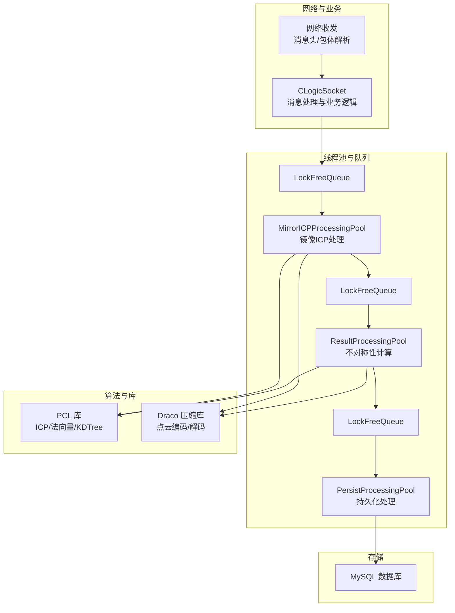
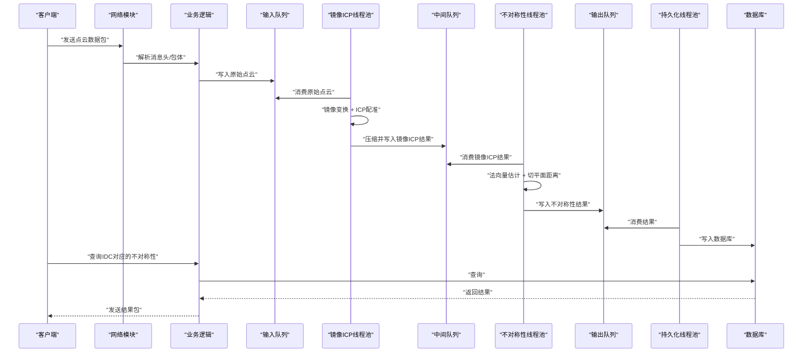
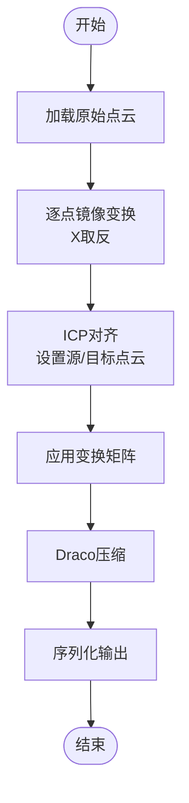
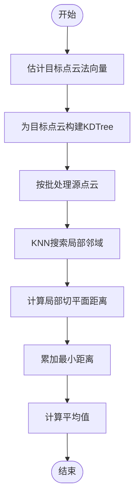
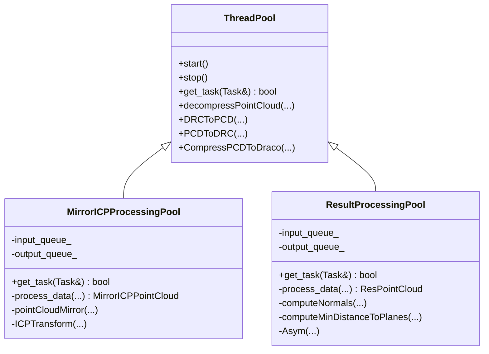
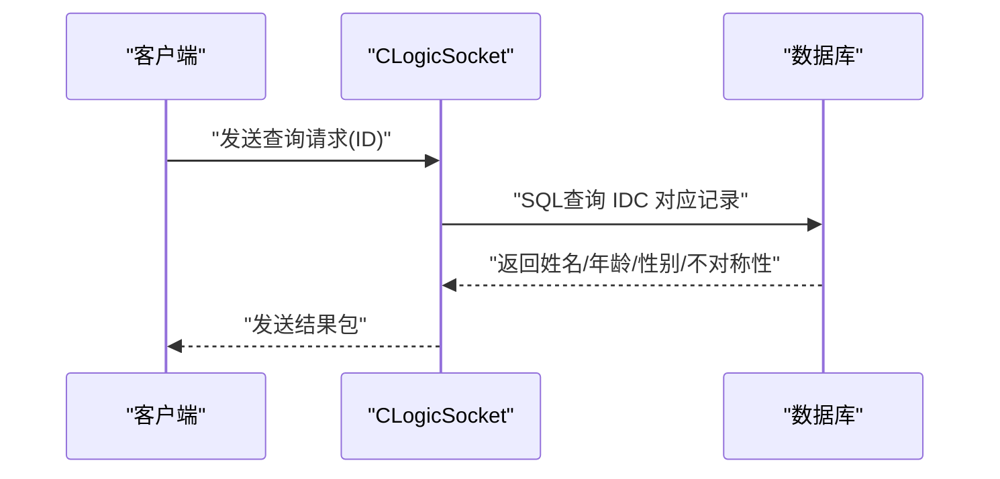
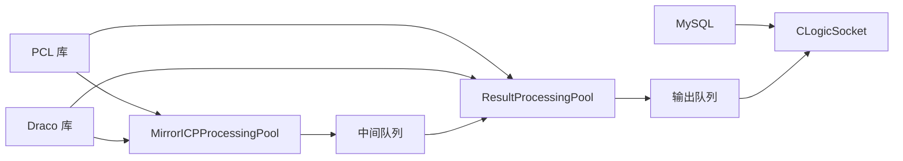

# 点云处理算法

<cite>
**本文档引用的文件**
- [CMakeLists.txt](file://CMakeLists.txt)
- [ngx_lockfree_mirrorICP_threadPool.cxx](file://misc/ngx_lockfree_mirrorICP_threadPool.cxx)
- [ngx_lockfree_asymCal_threadPool.cxx](file://misc/ngx_lockfree_asymCal_threadPool.cxx)
- [ngx_lockfree_threadPool.h](file://include/ngx_lockfree_threadPool.h)
- [ngx_lockFreeQueue.h](file://include/ngx_lockFreeQueue.h)
- [ngx_c_slogic.h](file://include/ngx_c_slogic.h)
- [ngx_c_slogic.cxx](file://logic/ngx_c_slogic.cxx)
- [ngx_logiccomm.h](file://include/ngx_logiccomm.h)
- [ngx_comm.h](file://include/ngx_comm.h)
- [ngx_global.h](file://include/ngx_global.h)
- [mysql.ini](file://persist/mysql.ini)
</cite>

## 目录
1. [简介](#简介)
2. [项目结构](#项目结构)
3. [核心组件](#核心组件)
4. [架构总览](#架构总览)
5. [详细组件分析](#详细组件分析)
6. [依赖关系分析](#依赖关系分析)
7. [性能考量](#性能考量)
8. [故障排查指南](#故障排查指南)
9. [结论](#结论)
10. [附录](#附录)

## 简介
本文件面向点云处理算法的技术文档，聚焦于项目中集成的两类核心算法：
- 不对称性计算算法：基于点云法向量与局部切平面距离的统计度量，用于评估点云的不对称程度。
- 镜像 ICP（Iterative Closest Point）算法：对源点云进行镜像变换后，使用 ICP 进行配准，得到目标点云的镜像配准结果。

文档将从数学原理、实现细节、适用场景、调用方式、参数配置、与 PCL 库的关系、性能分析、参数调优、结果验证与数据预处理/后处理等方面进行全面阐述，并提供可视化图示帮助理解。

## 项目结构
该项目采用模块化组织，围绕“网络收发-线程池-算法处理-持久化”的流水线设计：
- 网络与业务逻辑：负责消息解析、点云接收、结果查询与发送。
- 线程池与无锁队列：提供高性能的异步处理通道，支撑镜像 ICP 与不对称性计算的并行化。
- 算法模块：镜像 ICP 与不对称性计算分别封装在独立的线程池中，便于扩展与维护。
- 数据持久化：将最终结果写入数据库，支持按用户标识查询。

图表来源
- [ngx_c_slogic.cxx](file://logic/ngx_c_slogic.cxx#L190-L243)
- [ngx_lockfree_mirrorICP_threadPool.cxx](file://misc/ngx_lockfree_mirrorICP_threadPool.cxx#L35-L58)
- [ngx_lockfree_asymCal_threadPool.cxx](file://misc/ngx_lockfree_asymCal_threadPool.cxx#L47-L87)
- [ngx_lockfree_threadPool.h](file://include/ngx_lockfree_threadPool.h#L79-L136)
- [CMakeLists.txt](file://CMakeLists.txt#L40-L59)

章节来源
- [CMakeLists.txt](file://CMakeLists.txt#L1-L68)
- [ngx_c_slogic.cxx](file://logic/ngx_c_slogic.cxx#L190-L243)
- [ngx_lockfree_threadPool.h](file://include/ngx_lockfree_threadPool.h#L1-L144)

## 核心组件
- 线程池基类与专用线程池
  - ThreadPool：抽象基类，提供通用的线程池生命周期管理、任务获取与 draco/PCL 辅助函数。
  - MirrorICPProcessingPool：镜像 ICP 处理线程池，负责点云镜像、ICP 配准与压缩序列化。
  - ResultProcessingPool：不对称性计算线程池，负责法向量估计、局部切平面距离计算与平均最小距离统计。
  - PersistProcessingPool：持久化线程池，负责将结果写入数据库。
- 无锁队列 LockFreeQueue：基于 CAS 的环形缓冲队列，支持高性能的生产者-消费者模式。
- 网络与业务逻辑：CLogicSocket 负责消息解析、点云接收、结果查询与发送。

章节来源
- [ngx_lockfree_threadPool.h](file://include/ngx_lockfree_threadPool.h#L17-L77)
- [ngx_lockfree_threadPool.h](file://include/ngx_lockfree_threadPool.h#L79-L136)
- [ngx_lockFreeQueue.h](file://include/ngx_lockFreeQueue.h#L4-L150)
- [ngx_c_slogic.h](file://include/ngx_c_slogic.h#L13-L37)
- [ngx_c_slogic.cxx](file://logic/ngx_c_slogic.cxx#L190-L243)

## 架构总览
整体处理链路如下：
- 客户端发送点云数据包（含消息头与包体），服务端解析后写入输入队列。
- MirrorICPProcessingPool 从输入队列取出原始点云，执行镜像变换与 ICP 配准，将结果压缩并放入中间队列。
- ResultProcessingPool 从中间队列取出镜像 ICP 结果，计算不对称性指标，将结果放入输出队列。
- PersistProcessingPool 从输出队列取出结果，写入数据库。
- 查询接口通过 CLogicSocket 从数据库读取并返回结果。

图表来源
- [ngx_c_slogic.cxx](file://logic/ngx_c_slogic.cxx#L190-L243)
- [ngx_c_slogic.cxx](file://logic/ngx_c_slogic.cxx#L275-L340)
- [ngx_lockfree_mirrorICP_threadPool.cxx](file://misc/ngx_lockfree_mirrorICP_threadPool.cxx#L35-L58)
- [ngx_lockfree_asymCal_threadPool.cxx](file://misc/ngx_lockfree_asymCal_threadPool.cxx#L47-L87)

## 详细组件分析

### 镜像 ICP 算法
- 数学原理
  - 镜像变换：对点云的 X 坐标取反，实现沿 YZ 平面的镜像。
  - ICP：迭代最近点算法，寻找源点云到目标点云的最佳刚体变换，使对应点对的残差平方和最小。
- 实现要点
  - 输入：原始点云（pcl::PointXYZ）。
  - 镜像：逐点修改 X 坐标符号。
  - ICP：设置源点云与目标点云，执行对齐并获取变换矩阵，应用到镜像后的点云。
  - 输出：镜像 ICP 后的点云，经 Draco 压缩后序列化。
- 适用场景
  - 需要评估点云在某一方向上的对称性或镜像一致性。
  - 作为不对称性计算的前置步骤。
- 参数与配置
  - ICP 默认参数由 PCL 提供，可通过扩展接口设置收敛阈值、最大迭代次数、对应半径等。
  - 镜像变换为硬编码的 X 坐标取反，可根据需求扩展为通用变换矩阵。
- 性能与稳定性
  - ICP 的性能受点云规模与特征密度影响；可通过降采样或特征提取优化。
  - 队列容量与线程数需结合硬件资源与负载进行调优。

图表来源
- [ngx_lockfree_mirrorICP_threadPool.cxx](file://misc/ngx_lockfree_mirrorICP_threadPool.cxx#L59-L93)

章节来源
- [ngx_lockfree_mirrorICP_threadPool.cxx](file://misc/ngx_lockfree_mirrorICP_threadPool.cxx#L35-L93)
- [ngx_lockfree_threadPool.h](file://include/ngx_lockfree_threadPool.h#L80-L99)

### 不对称性计算算法
- 数学原理
  - 局部法向量：对目标点云估计法向量，作为局部切平面的法向。
  - 切平面距离：对源点云中的每个点，计算其到目标点云局部切平面的最短距离（点到平面距离）。
  - 统计度量：对所有点的最小距离求平均，作为整体不对称性指标。
- 实现要点
  - 法向量估计：使用 PCL 的法向量估计器，设置 KNN 搜索半径与线程数。
  - KDTree：为目标点云构建 KNN 搜索结构，加速局部邻域查找。
  - 批处理：按批处理源点云，减少内存压力与提高吞吐。
  - 输出：返回平均最小距离作为不对称性度量。
- 适用场景
  - 人体扫描、工业检测等需要量化形状不对称性的应用。
- 参数与配置
  - KNN 数量：影响局部拟合精度与计算复杂度。
  - 批大小：平衡内存占用与吞吐。
  - 法向量线程数：根据 CPU 核心数调整。
- 性能与稳定性
  - 法向量估计与 KDTree 搜索是主要瓶颈，建议在预处理阶段进行降采样或特征增强。
  - 批处理策略可显著降低峰值内存与提升整体吞吐。

图表来源
- [ngx_lockfree_asymCal_threadPool.cxx](file://misc/ngx_lockfree_asymCal_threadPool.cxx#L147-L204)

章节来源
- [ngx_lockfree_asymCal_threadPool.cxx](file://misc/ngx_lockfree_asymCal_threadPool.cxx#L47-L204)
- [ngx_lockfree_threadPool.h](file://include/ngx_lockfree_threadPool.h#L102-L120)

### 线程池与无锁队列
- ThreadPool
  - 提供线程池生命周期管理、优雅停止、任务获取接口。
  - 提供通用的点云解压/压缩与格式转换工具（Draco/PCL）。
- MirrorICPProcessingPool / ResultProcessingPool
  - 从输入队列消费数据，执行算法处理，将结果写入输出队列。
  - 带有重试与日志输出，确保在高负载下的稳定性。
- LockFreeQueue
  - 基于 CAS 的无锁环形缓冲队列，支持高性能的多生产者/多消费者。
  - 通过缓存行对齐与内存序优化，降低伪共享与提升并发性能。

图表来源
- [ngx_lockfree_threadPool.h](file://include/ngx_lockfree_threadPool.h#L17-L77)
- [ngx_lockfree_threadPool.h](file://include/ngx_lockfree_threadPool.h#L79-L136)

章节来源
- [ngx_lockfree_threadPool.h](file://include/ngx_lockfree_threadPool.h#L17-L144)
- [ngx_lockFreeQueue.h](file://include/ngx_lockFreeQueue.h#L4-L150)

### 网络与业务逻辑
- 消息解析
  - 解析消息头与包体，校验 CRC32，支持心跳包与点云收发。
- 点云接收
  - 将客户端发送的序列化点云写入输入队列，供后续处理。
- 结果查询
  - 根据用户 IDC 查询数据库中的不对称性结果并返回。

图表来源
- [ngx_c_slogic.cxx](file://logic/ngx_c_slogic.cxx#L275-L340)
- [ngx_logiccomm.h](file://include/ngx_logiccomm.h#L16-L24)

章节来源
- [ngx_c_slogic.cxx](file://logic/ngx_c_slogic.cxx#L190-L243)
- [ngx_c_slogic.cxx](file://logic/ngx_c_slogic.cxx#L275-L340)
- [ngx_logiccomm.h](file://include/ngx_logiccomm.h#L14-L28)

## 依赖关系分析
- 外部库
  - PCL：提供 ICP、法向量估计、KDTree、点云 IO 等能力。
  - Draco：提供点云压缩/解压，减小网络传输与存储开销。
  - MySQL：提供结果持久化与查询。
- 内部模块
  - 线程池与无锁队列：作为算法处理的基础设施。
  - 业务逻辑：负责网络消息解析与数据库交互。

图表来源
- [CMakeLists.txt](file://CMakeLists.txt#L40-L59)
- [ngx_lockfree_threadPool.h](file://include/ngx_lockfree_threadPool.h#L40-L59)

章节来源
- [CMakeLists.txt](file://CMakeLists.txt#L40-L59)

## 性能考量
- 算法复杂度
  - ICP：通常为 O(N·K·D)（N 为点数，K 为每点搜索数量，D 为收敛迭代次数）。
  - 不对称性计算：估计法向量 O(N·k) + KDTree 搜索 O(N·logN) + 局部距离计算 O(N·K)。
- 并发与吞吐
  - 通过多线程池与无锁队列实现流水线并行，建议根据 CPU 核心数与内存带宽设置线程数与队列容量。
- 内存与 I/O
  - 使用 Draco 压缩可显著降低网络与磁盘 I/O；注意压缩质量与解压开销的平衡。
- 参数调优建议
  - ICP：合理设置最大迭代次数与收敛阈值；对大规模点云先进行降采样。
  - 法向量：KNN 数量与线程数需折中；邻域过大导致噪声敏感，过小导致不稳定。
  - 批大小：根据内存峰值与延迟目标动态调整。
- 监控与观测
  - 记录各队列长度、线程池吞吐、算法耗时与错误率，以便定位瓶颈。

## 故障排查指南
- 常见问题
  - 队列满/空：检查生产/消费速率与队列容量，必要时扩容或降载。
  - ICP 失败：检查点云质量与初始对齐；增大搜索半径或调整收敛阈值。
  - 法向量异常：检查点云密度与噪声；适当降采样或滤波。
  - 数据库连接失败：检查连接池配置与网络连通性。
- 日志与诊断
  - 线程池与队列均内置日志输出，可用于定位卡顿与异常。
  - 数据库查询接口返回错误码与日志，便于快速定位 SQL 问题。

章节来源
- [ngx_lockfree_mirrorICP_threadPool.cxx](file://misc/ngx_lockfree_mirrorICP_threadPool.cxx#L14-L33)
- [ngx_lockfree_asymCal_threadPool.cxx](file://misc/ngx_lockfree_asymCal_threadPool.cxx#L22-L40)
- [ngx_c_slogic.cxx](file://logic/ngx_c_slogic.cxx#L245-L274)

## 结论
本项目通过线程池与无锁队列构建了高吞吐的点云处理流水线，集成了镜像 ICP 与不对称性计算两大核心算法。镜像 ICP 为后续不对称性计算提供稳定的配准基础，不对称性计算则以局部法向量与切平面距离为核心，给出可解释的定量指标。结合 Draco 压缩与数据库持久化，系统在性能、可扩展性与实用性方面取得良好平衡。建议在实际部署中结合业务场景进一步优化参数与资源配额。

## 附录

### 输入输出格式与数据预处理
- 输入
  - 网络包体：包含序列化点云数据、用户标识、姓名、年龄、性别等元信息。
  - 点云格式：Draco 压缩的点云，内部为 PCL 支持的点类型。
- 预处理
  - 接收端解析消息头与包体，校验 CRC32，写入输入队列。
  - 算法侧进行解压与格式转换（Draco -> PCD -> PCL）。
- 输出
  - 镜像 ICP：压缩后的镜像配准点云。
  - 不对称性：平均最小距离指标，随用户信息一起写入数据库。
  - 查询接口：按 IDC 返回姓名、年龄、性别与不对称性。

章节来源
- [ngx_c_slogic.cxx](file://logic/ngx_c_slogic.cxx#L190-L243)
- [ngx_c_slogic.cxx](file://logic/ngx_c_slogic.cxx#L275-L340)
- [ngx_lockfree_mirrorICP_threadPool.cxx](file://misc/ngx_lockfree_mirrorICP_threadPool.cxx#L35-L58)
- [ngx_lockfree_asymCal_threadPool.cxx](file://misc/ngx_lockfree_asymCal_threadPool.cxx#L47-L87)

### 与 PCL 库的关系与集成
- ICP 与法向量估计：直接使用 PCL 的 ICP 与法向量估计器，确保算法稳定与高效。
- KDTree：用于 KNN 搜索，加速局部邻域查找。
- 点云 IO：通过 PCL 的 IO 模块完成点云的读取与写入。
- 集成方式：通过 CMake 查找 PCL 并链接相应组件，确保编译与运行时可用。

章节来源
- [CMakeLists.txt](file://CMakeLists.txt#L40-L43)
- [ngx_lockfree_mirrorICP_threadPool.cxx](file://misc/ngx_lockfree_mirrorICP_threadPool.cxx#L2-L4)
- [ngx_lockfree_asymCal_threadPool.cxx](file://misc/ngx_lockfree_asymCal_threadPool.cxx#L1-L11)

### 参数调优与结果验证
- 参数调优
  - ICP：最大迭代次数、对应半径、变换收敛阈值。
  - 法向量：KNN 数量、线程数。
  - 批大小：根据内存与延迟目标调整。
- 结果验证
  - 可视化对比镜像前后点云与配准效果。
  - 对比不同参数下的不对称性指标稳定性与一致性。
  - 使用数据库查询接口验证结果写入与读取的正确性。

章节来源
- [ngx_lockfree_mirrorICP_threadPool.cxx](file://misc/ngx_lockfree_mirrorICP_threadPool.cxx#L66-L93)
- [ngx_lockfree_asymCal_threadPool.cxx](file://misc/ngx_lockfree_asymCal_threadPool.cxx#L147-L204)
- [ngx_c_slogic.cxx](file://logic/ngx_c_slogic.cxx#L245-L274)

### 数据库配置
- 连接池配置文件包含数据库地址、端口、用户名、密码、库名、初始连接数与最大连接数等参数，用于持久化与查询。

章节来源
- [mysql.ini](file://persist/mysql.ini#L1-L13)