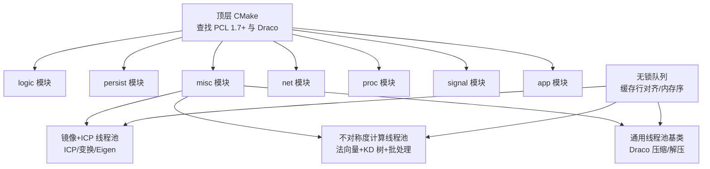
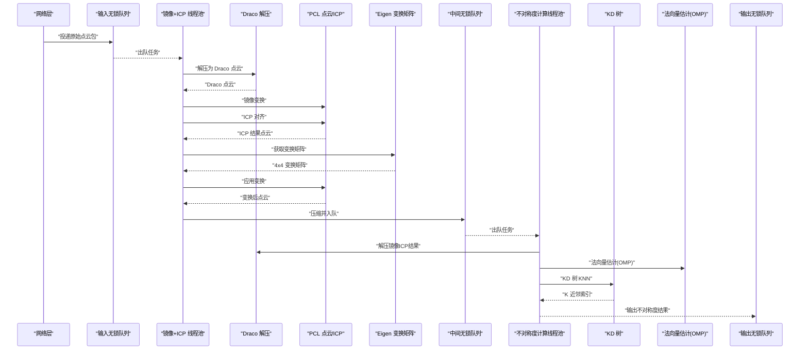
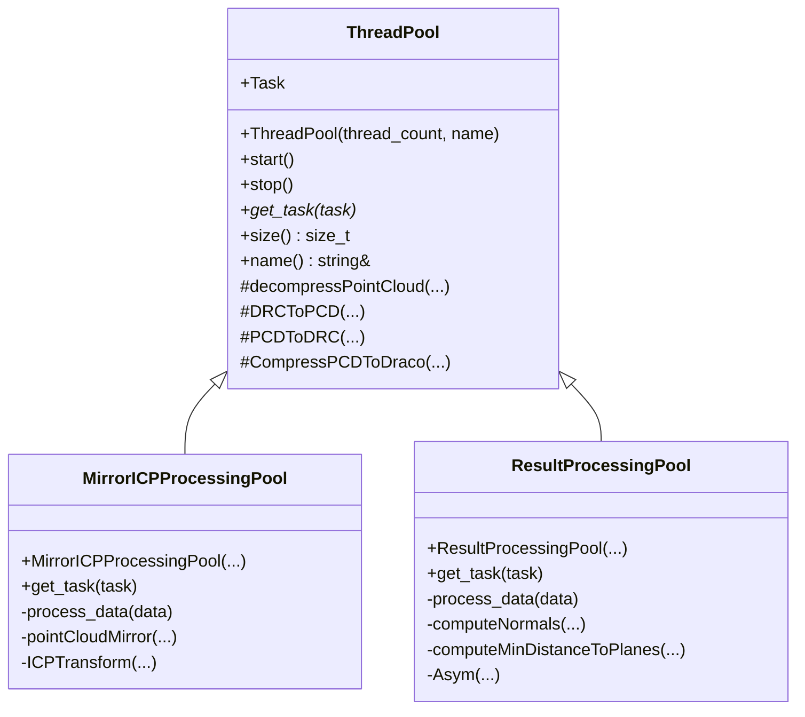
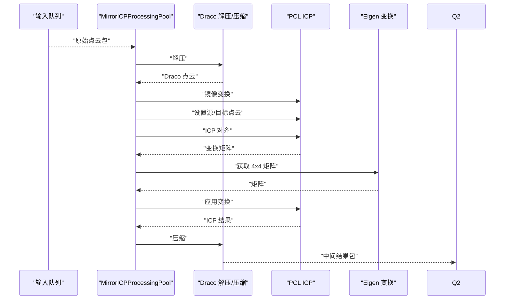
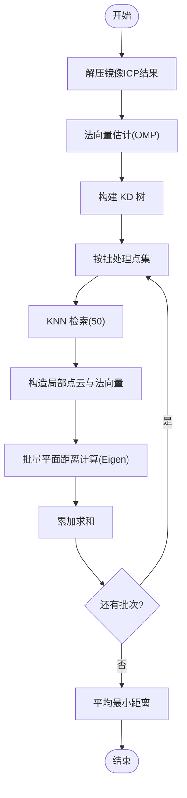
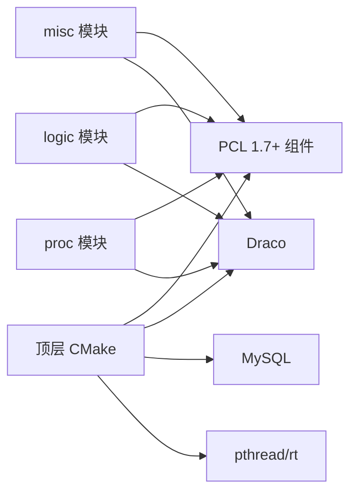

# 算法与 PCL 库集成

<cite>
**本文引用的文件**
- [CMakeLists.txt](file://CMakeLists.txt)
- [proc/CMakeLists.txt](file://proc/CMakeLists.txt)
- [misc/CMakeLists.txt](file://misc/CMakeLists.txt)
- [logic/CMakeLists.txt](file://logic/CMakeLists.txt)
- [ngx_lockfree_mirrorICP_threadPool.cxx](file://misc/ngx_lockfree_mirrorICP_threadPool.cxx)
- [ngx_lockfree_asymCal_threadPool.cxx](file://misc/ngx_lockfree_asymCal_threadPool.cxx)
- [ngx_lockfree_threadPool.cxx](file://misc/ngx_lockfree_threadPool.cxx)
- [ngx_lockfree_threadPool.h](file://include/ngx_lockfree_threadPool.h)
- [ngx_lockFreeQueue.h](file://include/ngx_lockFreeQueue.h)
- [ngx_c_threadpool.h](file://include/ngx_c_threadpool.h)
- [ngx_c_socket.h](file://include/ngx_c_socket.h)
</cite>

## 目录
1. [简介](#简介)
2. [项目结构](#项目结构)
3. [核心组件](#核心组件)
4. [架构总览](#架构总览)
5. [组件详解](#组件详解)
6. [依赖关系分析](#依赖关系分析)
7. [性能考量](#性能考量)
8. [故障排查指南](#故障排查指南)
9. [结论](#结论)
10. [附录](#附录)

## 简介
本文件面向“点云算法与 PCL 库的集成”，系统梳理项目中如何使用 PCL 的核心能力（点云数据结构、KD 树搜索、法向量估计、ICP 配准、并行计算等），并结合项目现有实现，给出版本要求、编译配置、调用方式、与 Eigen 的协作关系、OpenMP 并行优化策略、常见问题与性能优化建议。

## 项目结构
项目采用模块化 CMake 子目录组织，PCL 与 Draco 压缩库在顶层 CMake 中统一查找与链接，各模块库（logic、persist、misc、net、proc、signal、app）分别声明包含路径与链接库，确保编译期与运行期的依赖可见性。

**图表来源**
- [CMakeLists.txt](file://CMakeLists.txt#L41-L43)
- [misc/CMakeLists.txt](file://misc/CMakeLists.txt#L14-L26)
- [logic/CMakeLists.txt](file://logic/CMakeLists.txt#L9-L19)
- [proc/CMakeLists.txt](file://proc/CMakeLists.txt#L10-L21)

**章节来源**
- [CMakeLists.txt](file://CMakeLists.txt#L1-L68)
- [misc/CMakeLists.txt](file://misc/CMakeLists.txt#L1-L29)
- [logic/CMakeLists.txt](file://logic/CMakeLists.txt#L1-L23)
- [proc/CMakeLists.txt](file://proc/CMakeLists.txt#L1-L24)

## 核心组件
- 线程池与无锁队列
  - 通用线程池基类与子类（镜像/ICP、不对称度计算、持久化），配合无锁队列实现高性能数据流转。
- PCL 集成点
  - 点云数据结构与 IO：使用 PCL 点类型与 IO 接口。
  - KD 树搜索：用于 K 近邻检索。
  - 法向量估计：使用 OpenMP 版本加速。
  - ICP 配准：基于迭代最近点进行点云对齐。
  - 变换与矩阵：使用 Eigen 矩阵进行仿射变换。
- 压缩与解压
  - 使用 Draco 对点云进行压缩/解压，减少网络传输与存储开销。

**章节来源**
- [ngx_lockfree_threadPool.h](file://include/ngx_lockfree_threadPool.h#L17-L77)
- [ngx_lockfree_threadPool.h](file://include/ngx_lockfree_threadPool.h#L80-L120)
- [ngx_lockfree_mirrorICP_threadPool.cxx](file://misc/ngx_lockfree_mirrorICP_threadPool.cxx#L1-L94)
- [ngx_lockfree_asymCal_threadPool.cxx](file://misc/ngx_lockfree_asymCal_threadPool.cxx#L1-L205)
- [ngx_lockfree_threadPool.cxx](file://misc/ngx_lockfree_threadPool.cxx#L1-L78)
- [ngx_lockFreeQueue.h](file://include/ngx_lockFreeQueue.h#L1-L430)

## 架构总览
下图展示了从网络接收、到点云解压、镜像+ICP、法向量估计与 KD 树、再到结果输出的整体流程。

**图表来源**
- [ngx_lockfree_mirrorICP_threadPool.cxx](file://misc/ngx_lockfree_mirrorICP_threadPool.cxx#L35-L93)
- [ngx_lockfree_asymCal_threadPool.cxx](file://misc/ngx_lockfree_asymCal_threadPool.cxx#L47-L204)
- [ngx_lockfree_threadPool.cxx](file://misc/ngx_lockfree_threadPool.cxx#L3-L78)
- [ngx_lockFreeQueue.h](file://include/ngx_lockFreeQueue.h#L50-L127)

## 组件详解

### 1) 通用线程池与无锁队列
- 通用线程池基类提供任务拉取接口与优雅停机机制，子类通过 get_task 注入具体任务。
- 无锁队列采用缓存行对齐与 acquire/release 内存序，降低伪共享与提高并发吞吐。

**图表来源**
- [ngx_lockfree_threadPool.h](file://include/ngx_lockfree_threadPool.h#L17-L77)
- [ngx_lockfree_threadPool.h](file://include/ngx_lockfree_threadPool.h#L80-L120)

**章节来源**
- [ngx_lockfree_threadPool.h](file://include/ngx_lockfree_threadPool.h#L1-L144)
- [ngx_lockFreeQueue.h](file://include/ngx_lockFreeQueue.h#L1-L430)

### 2) 镜像+ICP 线程池
- 功能：解压 -> 镜像变换 -> ICP 对齐 -> 变换应用 -> 压缩输出。
- 关键点：
  - 使用 PCL 的 ICP 类与共享指针管理输入点云。
  - 使用 Eigen::Matrix4f 获取变换矩阵并应用到点云。

**图表来源**
- [ngx_lockfree_mirrorICP_threadPool.cxx](file://misc/ngx_lockfree_mirrorICP_threadPool.cxx#L35-L93)

**章节来源**
- [ngx_lockfree_mirrorICP_threadPool.cxx](file://misc/ngx_lockfree_mirrorICP_threadPool.cxx#L1-L94)

### 3) 不对称度计算线程池
- 功能：解压镜像ICP结果 -> 法向量估计（OpenMP）-> KD 树 KNN -> 局部平面距离计算 -> 批处理平均。
- 关键点：
  - 使用 NormalEstimationOMP 并设置线程数。
  - 使用 search::KdTree 进行 KNN 检索。
  - 使用 Eigen::MatrixXd/VectorXd 进行批量矩阵运算优化。

**图表来源**
- [ngx_lockfree_asymCal_threadPool.cxx](file://misc/ngx_lockfree_asymCal_threadPool.cxx#L89-L204)

**章节来源**
- [ngx_lockfree_asymCal_threadPool.cxx](file://misc/ngx_lockfree_asymCal_threadPool.cxx#L1-L205)

### 4) 点云数据结构与 IO
- 使用 PCL 点类型与 IO 接口进行点云读写与转换。
- 通过 Draco 进行压缩/解压，减少内存与带宽压力。

**章节来源**
- [ngx_lockfree_threadPool.cxx](file://misc/ngx_lockfree_threadPool.cxx#L1-L78)

## 依赖关系分析
- PCL 版本与组件
  - 通过 CMake 查找 PCL 1.7+，启用 common、kdtree、search、registration、io、features 等组件。
- 头文件包含与链接
  - 顶层 CMake 统一 include_directories，模块 CMake 通过 target_include_directories/public 与 target_link_libraries/public 传递依赖。
- 外部库
  - PCL、Draco、MySQL、pthread、rt 等。

**图表来源**
- [CMakeLists.txt](file://CMakeLists.txt#L41-L59)
- [misc/CMakeLists.txt](file://misc/CMakeLists.txt#L14-L26)
- [logic/CMakeLists.txt](file://logic/CMakeLists.txt#L9-L19)
- [proc/CMakeLists.txt](file://proc/CMakeLists.txt#L10-L21)

**章节来源**
- [CMakeLists.txt](file://CMakeLists.txt#L41-L59)
- [misc/CMakeLists.txt](file://misc/CMakeLists.txt#L14-L26)
- [logic/CMakeLists.txt](file://logic/CMakeLists.txt#L9-L19)
- [proc/CMakeLists.txt](file://proc/CMakeLists.txt#L10-L21)

## 性能考量
- 并行与内存
  - 无锁队列采用缓存行对齐与 release/acquire 内存序，降低伪共享与提升并发。
  - 线程池使用原子标志与 yield 降低忙等开销。
- PCL/Draco
  - 使用 NormalEstimationOMP 与 KNN 批处理，减少重复构建 KD 树的开销。
  - 通过压缩/解压减少网络与磁盘 IO。
- Eigen 矩阵运算
  - 将局部点云与法向量映射为矩阵，利用向量化与批处理降低循环开销。

**章节来源**
- [ngx_lockFreeQueue.h](file://include/ngx_lockFreeQueue.h#L1-L430)
- [ngx_lockfree_asymCal_threadPool.cxx](file://misc/ngx_lockfree_asymCal_threadPool.cxx#L107-L144)

## 故障排查指南
- PCL/Draco 找不到或链接失败
  - 检查顶层 CMake 中 find_package 的版本与组件是否满足要求。
  - 确认模块 CMake 的 include_directories 与 link_libraries 是否包含 PCL/Draco。
- ICP 配准无结果或异常
  - 确认输入点云非空且共享指针有效。
  - 检查变换矩阵是否合理，必要时打印中间结果。
- 法向量估计失败
  - 检查 KD 树是否成功构建与输入点云尺寸是否一致。
  - 调整 KNN 数量与线程数，避免过小导致估计不稳定。
- 线程池卡住或队列积压
  - 检查无锁队列容量与内存序是否正确。
  - 观察线程池日志与队列大小，必要时扩容线程数。

**章节来源**
- [CMakeLists.txt](file://CMakeLists.txt#L41-L59)
- [ngx_lockfree_mirrorICP_threadPool.cxx](file://misc/ngx_lockfree_mirrorICP_threadPool.cxx#L70-L93)
- [ngx_lockfree_asymCal_threadPool.cxx](file://misc/ngx_lockfree_asymCal_threadPool.cxx#L89-L105)
- [ngx_lockFreeQueue.h](file://include/ngx_lockFreeQueue.h#L129-L150)

## 结论
本项目通过模块化的 CMake 组织与通用线程池架构，将 PCL 的点云处理能力（KD 树、法向量、ICP、变换）与 Draco 压缩、Eigen 矩阵运算有机结合，配合无锁队列实现高吞吐的点云处理流水线。建议在生产环境中进一步完善日志与监控、参数化线程数与批处理大小，并持续评估 ICP 与法向量估计的稳定性与性能。

## 附录

### A. PCL 版本与编译配置要点
- 版本要求：PCL 1.7+
- 组件需求：common、kdtree、search、registration、io、features
- 编译标准：C++11
- 关键 CMake 片段路径：
  - [顶层 CMake 查找与包含](file://CMakeLists.txt#L41-L51)
  - [模块 CMake 包含与链接](file://misc/CMakeLists.txt#L14-L26)

**章节来源**
- [CMakeLists.txt](file://CMakeLists.txt#L41-L59)
- [misc/CMakeLists.txt](file://misc/CMakeLists.txt#L14-L26)

### B. PCL 使用示例（路径指引）
- ICP 配准与变换
  - [ICP 对齐与矩阵获取](file://misc/ngx_lockfree_mirrorICP_threadPool.cxx#L66-L93)
- 法向量估计（OpenMP）
  - [法向量估计与 KD 树](file://misc/ngx_lockfree_asymCal_threadPool.cxx#L89-L105)
- KD 树 KNN 搜索
  - [KNN 检索与局部点云构造](file://misc/ngx_lockfree_asymCal_threadPool.cxx#L170-L199)
- 点云数据结构与 IO
  - [Draco 解压/压缩与 PCL 转换](file://misc/ngx_lockfree_threadPool.cxx#L3-L78)

**章节来源**
- [ngx_lockfree_mirrorICP_threadPool.cxx](file://misc/ngx_lockfree_mirrorICP_threadPool.cxx#L66-L93)
- [ngx_lockfree_asymCal_threadPool.cxx](file://misc/ngx_lockfree_asymCal_threadPool.cxx#L89-L105)
- [ngx_lockfree_asymCal_threadPool.cxx](file://misc/ngx_lockfree_asymCal_threadPool.cxx#L170-L199)
- [ngx_lockfree_threadPool.cxx](file://misc/ngx_lockfree_threadPool.cxx#L3-L78)

### C. 与 Eigen 的协作
- ICP 变换矩阵获取与应用：
  - [获取变换矩阵与应用](file://misc/ngx_lockfree_mirrorICP_threadPool.cxx#L85-L90)
- 法向量估计与 KD 树：
  - [法向量估计与 KD 树](file://misc/ngx_lockfree_asymCal_threadPool.cxx#L89-L105)
- 批量矩阵运算（局部平面距离）：
  - [矩阵填充与距离计算](file://misc/ngx_lockfree_asymCal_threadPool.cxx#L108-L144)

**章节来源**
- [ngx_lockfree_mirrorICP_threadPool.cxx](file://misc/ngx_lockfree_mirrorICP_threadPool.cxx#L85-L90)
- [ngx_lockfree_asymCal_threadPool.cxx](file://misc/ngx_lockfree_asymCal_threadPool.cxx#L89-L105)
- [ngx_lockfree_asymCal_threadPool.cxx](file://misc/ngx_lockfree_asymCal_threadPool.cxx#L108-L144)

### D. OpenMP 并行优化
- 法向量估计并行化：
  - [设置线程数与并行估计](file://misc/ngx_lockfree_asymCal_threadPool.cxx#L95-L102)
- 批处理与局部计算：
  - [批处理大小与局部 KD 树](file://misc/ngx_lockfree_asymCal_threadPool.cxx#L160-L199)

**章节来源**
- [ngx_lockfree_asymCal_threadPool.cxx](file://misc/ngx_lockfree_asymCal_threadPool.cxx#L95-L102)
- [ngx_lockfree_asymCal_threadPool.cxx](file://misc/ngx_lockfree_asymCal_threadPool.cxx#L160-L199)