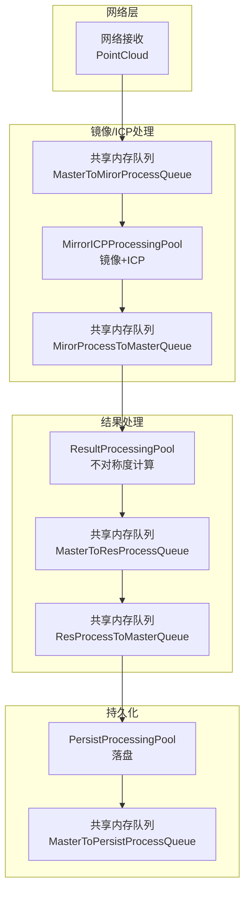
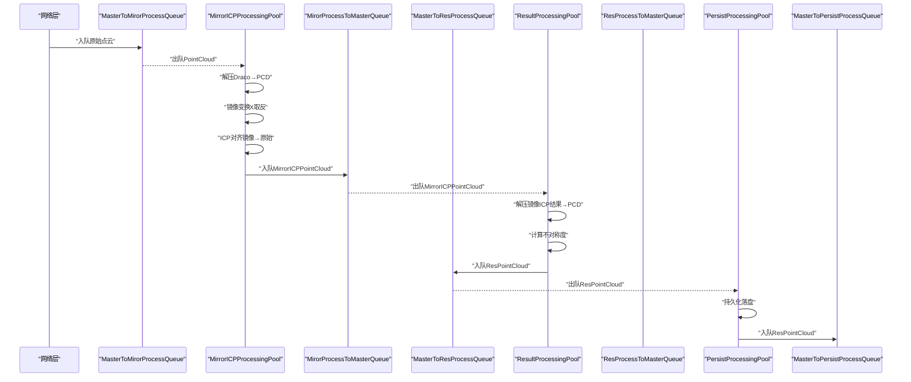
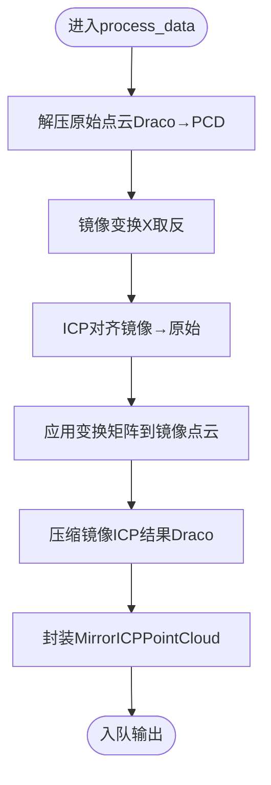
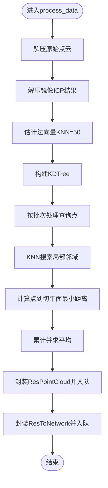
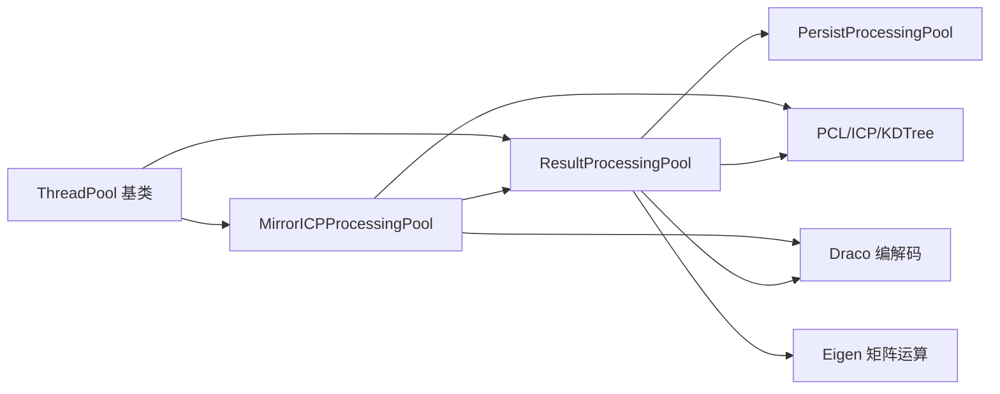

# 镜像 ICP 算法

<cite>
**本文引用的文件**
- [ngx_lockfree_mirrorICP_threadPool.cxx](file://misc/ngx_lockfree_mirrorICP_threadPool.cxx)
- [ngx_lockfree_threadPool.h](file://include/ngx_lockfree_threadPool.h)
- [ngx_lockfree_asymCal_threadPool.cxx](file://misc/ngx_lockfree_asymCal_threadPool.cxx)
- [ngx_shared_memory.h](file://include/ngx_shared_memory.h)
- [ngx_process_cycle.cxx](file://proc/ngx_process_cycle.cxx)
- [ngx_lockfree_threadPool.cxx](file://misc/ngx_lockfree_threadPool.cxx)
</cite>

## 目录
1. [简介](#简介)
2. [项目结构](#项目结构)
3. [核心组件](#核心组件)
4. [架构总览](#架构总览)
5. [详细组件分析](#详细组件分析)
6. [依赖关系分析](#依赖关系分析)
7. [性能考量](#性能考量)
8. [故障排查指南](#故障排查指南)
9. [结论](#结论)
10. [附录](#附录)

## 简介
本文件面向镜像 ICP（Iterative Closest Point，迭代最近点）算法的技术文档，聚焦以下目标：
- 解释镜像 ICP 的基本原理与“镜像处理”的特殊性：通过沿某一轴（本实现为 X 轴）取反坐标，得到镜像点云，再以镜像点云为目标与原始点云进行 ICP 对齐，从而估计点云的镜像对称性或潜在的几何形变。
- 详述实现细节：点云解压与格式转换、镜像变换、ICP 变换矩阵计算、收敛与变换应用、结果压缩与封装。
- 给出使用示例路径与参数设置建议：如何在现有线程池与共享内存队列框架中接入镜像 ICP 流水线。
- 区分镜像 ICP 与标准 ICP 的差异：输入来源不同（镜像 vs 原始）、目标与源的关系不同（镜像 vs 同一对象的不同视角）。
- 提供性能优化技巧、参数调节建议与结果质量评估方法。

## 项目结构
该仓库采用多进程+多线程+共享内存队列的流水线架构，镜像 ICP 处理位于“镜像/ICP处理”阶段，下游还有“结果处理（不对称度计算）”和“持久化”阶段。核心文件如下：
- 镜像 ICP 线程池与处理逻辑：misc/ngx_lockfree_mirrorICP_threadPool.cxx
- 线程池基类与镜像 ICP 类声明：include/ngx_lockfree_threadPool.h
- 不对称度计算线程池与结果封装：misc/ngx_lockfree_asymCal_threadPool.cxx
- 共享内存队列与数据结构定义：include/ngx_shared_memory.h
- 主循环与队列负载监控、动态批处理与退避策略：proc/ngx_process_cycle.cxx
- 点云编解码与压缩接口实现：misc/ngx_lockfree_threadPool.cxx

图表来源
- [ngx_process_cycle.cxx](file://proc/ngx_process_cycle.cxx#L467-L545)
- [ngx_lockfree_threadPool.h](file://include/ngx_lockfree_threadPool.h#L80-L120)
- [ngx_shared_memory.h](file://include/ngx_shared_memory.h#L65-L81)

章节来源
- [ngx_process_cycle.cxx](file://proc/ngx_process_cycle.cxx#L467-L545)
- [ngx_lockfree_threadPool.h](file://include/ngx_lockfree_threadPool.h#L80-L120)
- [ngx_shared_memory.h](file://include/ngx_shared_memory.h#L65-L81)

## 核心组件
- 线程池基类 ThreadPool：提供通用任务模型、工作线程生命周期管理、draco 点云编解码与 PCD 转换能力。
- MirrorICPProcessingPool：镜像 ICP 处理线程池，负责从输入队列取出原始点云，执行镜像变换与 ICP 对齐，输出带镜像 ICP 结果的数据包。
- ResultProcessingPool：接收镜像 ICP 结果，计算不对称度指标，输出最终结果与网络回传结构。
- 数据结构：
  - PointCloud：网络侧原始点云封装（含 ID、姓名、年龄、性别、fd 等元数据）。
  - MirrorICPPointCloud：镜像 ICP 处理后的结果封装（包含原始序列化数据与镜像 ICP 序列化数据）。
  - ResPointCloud：最终结果封装（包含原始序列化数据与不对称度指标）。
  - ResToNetwork：网络回传结构（包含 ID、姓名、年龄、性别、fd 与不对称度）。

章节来源
- [ngx_lockfree_threadPool.h](file://include/ngx_lockfree_threadPool.h#L17-L77)
- [ngx_lockfree_threadPool.h](file://include/ngx_lockfree_threadPool.h#L80-L120)
- [ngx_shared_memory.h](file://include/ngx_shared_memory.h#L24-L62)

## 架构总览
镜像 ICP 的端到端流程如下：
- 网络接收原始点云 → 入队 → 镜像/ICP处理线程池解出数据 → 执行镜像变换与 ICP 对齐 → 结果入队 → 结果处理线程池解出数据 → 计算不对称度 → 结果入队 → 持久化线程池落盘 → 网络回传。

图表来源
- [ngx_process_cycle.cxx](file://proc/ngx_process_cycle.cxx#L754-L822)
- [ngx_lockfree_mirrorICP_threadPool.cxx](file://misc/ngx_lockfree_mirrorICP_threadPool.cxx#L14-L33)
- [ngx_lockfree_asymCal_threadPool.cxx](file://misc/ngx_lockfree_asymCal_threadPool.cxx#L22-L40)
- [ngx_shared_memory.h](file://include/ngx_shared_memory.h#L65-L81)

## 详细组件分析

### 镜像 ICP 线程池（MirrorICPProcessingPool）
- 职责
  - 从输入队列取出原始点云，解压为 PCL 点云。
  - 对点云执行镜像变换（沿 X 轴取反坐标）。
  - 使用 PCL ICP 将镜像点云对齐到原始点云，获得最终变换矩阵并应用到镜像点云。
  - 将原始与镜像 ICP 结果分别序列化，封装为 MirrorICPPointCloud 并入队。
- 关键实现要点
  - 镜像变换：遍历点云，将每个点的 X 坐标取反，得到镜像点云。
  - ICP 对齐：设置输入源为镜像点云、目标为原始点云；执行 align 得到最终变换矩阵；应用变换到源点云。
  - 编解码：使用 Draco 解压/压缩，将 PCD 转换为 Draco 点云以降低体积。
- 参数与配置
  - ICP 压缩编码速度：在压缩镜像 ICP 结果时使用固定速度参数。
  - 队列容量与批处理：受共享内存队列容量与主循环批处理策略影响。

图表来源
- [ngx_lockfree_mirrorICP_threadPool.cxx](file://misc/ngx_lockfree_mirrorICP_threadPool.cxx#L35-L58)
- [ngx_lockfree_threadPool.cxx](file://misc/ngx_lockfree_threadPool.cxx#L3-L67)

章节来源
- [ngx_lockfree_mirrorICP_threadPool.cxx](file://misc/ngx_lockfree_mirrorICP_threadPool.cxx#L5-L12)
- [ngx_lockfree_mirrorICP_threadPool.cxx](file://misc/ngx_lockfree_mirrorICP_threadPool.cxx#L14-L33)
- [ngx_lockfree_mirrorICP_threadPool.cxx](file://misc/ngx_lockfree_mirrorICP_threadPool.cxx#L35-L58)
- [ngx_lockfree_mirrorICP_threadPool.cxx](file://misc/ngx_lockfree_mirrorICP_threadPool.cxx#L59-L65)
- [ngx_lockfree_mirrorICP_threadPool.cxx](file://misc/ngx_lockfree_mirrorICP_threadPool.cxx#L66-L93)
- [ngx_lockfree_threadPool.cxx](file://misc/ngx_lockfree_threadPool.cxx#L3-L67)

### 不对称度计算线程池（ResultProcessingPool）
- 职责
  - 从镜像 ICP 输出队列取出数据，解压镜像 ICP 结果与原始点云。
  - 计算点云法向量，构建 KDTree，对每个查询点在局部邻域内计算到切平面的最小距离，求平均得到不对称度指标。
- 关键实现要点
  - 法向量估计：使用 OpenMP 加速的法向量估计。
  - 局部邻域搜索：KNN（K=50）搜索局部点集与法向量。
  - 距离计算：基于平面方程与法向量归一化，计算点到平面的最小距离。
  - 批处理：按批次处理，控制内存与计算压力。
- 输出
  - ResPointCloud：包含原始序列化数据与不对称度。
  - ResToNetwork：包含 ID、姓名、年龄、性别、fd 与不对称度，用于网络回传。

图表来源
- [ngx_lockfree_asymCal_threadPool.cxx](file://misc/ngx_lockfree_asymCal_threadPool.cxx#L47-L87)
- [ngx_lockfree_asymCal_threadPool.cxx](file://misc/ngx_lockfree_asymCal_threadPool.cxx#L89-L105)
- [ngx_lockfree_asymCal_threadPool.cxx](file://misc/ngx_lockfree_asymCal_threadPool.cxx#L107-L144)
- [ngx_lockfree_asymCal_threadPool.cxx](file://misc/ngx_lockfree_asymCal_threadPool.cxx#L146-L204)

章节来源
- [ngx_lockfree_asymCal_threadPool.cxx](file://misc/ngx_lockfree_asymCal_threadPool.cxx#L13-L20)
- [ngx_lockfree_asymCal_threadPool.cxx](file://misc/ngx_lockfree_asymCal_threadPool.cxx#L47-L87)
- [ngx_lockfree_asymCal_threadPool.cxx](file://misc/ngx_lockfree_asymCal_threadPool.cxx#L89-L105)
- [ngx_lockfree_asymCal_threadPool.cxx](file://misc/ngx_lockfree_asymCal_threadPool.cxx#L107-L144)
- [ngx_lockfree_asymCal_threadPool.cxx](file://misc/ngx_lockfree_asymCal_threadPool.cxx#L146-L204)

### 线程池基类与编解码工具
- ThreadPool 基类
  - 提供任务模型、工作线程生命周期管理、优雅停止。
  - 提供通用的点云编解码与压缩接口：解压 Draco 到 PCD、PCD 到 Draco、压缩 PCD 到 Draco。
- MirrorICPProcessingPool 与 ResultProcessingPool 继承自 ThreadPool，复用上述能力。

章节来源
- [ngx_lockfree_threadPool.h](file://include/ngx_lockfree_threadPool.h#L17-L77)
- [ngx_lockfree_threadPool.cxx](file://misc/ngx_lockfree_threadPool.cxx#L3-L67)

### 数据结构与共享内存队列
- PointCloud：网络侧原始点云封装，包含序列化数据、长度、用户元数据与 socket fd。
- MirrorICPPointCloud：镜像 ICP 结果封装，包含原始序列化数据与镜像 ICP 序列化数据。
- ResPointCloud：最终结果封装，包含原始序列化数据与不对称度。
- ResToNetwork：网络回传结构，包含 ID、姓名、年龄、性别、fd 与不对称度。
- 共享内存队列：使用模板化的无锁队列，跨进程共享，支持批量处理与动态退避策略。

章节来源
- [ngx_shared_memory.h](file://include/ngx_shared_memory.h#L24-L62)
- [ngx_shared_memory.h](file://include/ngx_shared_memory.h#L65-L81)

## 依赖关系分析
- 组件耦合
  - MirrorICPProcessingPool 依赖 ThreadPool 的编解码与压缩能力。
  - ResultProcessingPool 依赖 MirrorICPProcessingPool 的输出作为输入。
  - 主循环根据队列负载动态调整批处理大小与退避策略，间接影响各阶段吞吐。
- 外部依赖
  - PCL：点云处理、ICP、KDTree、法向量估计。
  - Draco：点云压缩/解压。
  - Eigen：矩阵运算（ICP 变换矩阵）。
  - Boost：智能指针与 KDTree 定义。
- 潜在环依赖
  - 无直接环依赖，镜像 ICP → 结果处理 → 持久化单向流动。

图表来源
- [ngx_lockfree_threadPool.h](file://include/ngx_lockfree_threadPool.h#L17-L77)
- [ngx_lockfree_mirrorICP_threadPool.cxx](file://misc/ngx_lockfree_mirrorICP_threadPool.cxx#L1-L3)
- [ngx_lockfree_asymCal_threadPool.cxx](file://misc/ngx_lockfree_asymCal_threadPool.cxx#L1-L11)

章节来源
- [ngx_lockfree_threadPool.h](file://include/ngx_lockfree_threadPool.h#L17-L77)
- [ngx_lockfree_mirrorICP_threadPool.cxx](file://misc/ngx_lockfree_mirrorICP_threadPool.cxx#L1-L3)
- [ngx_lockfree_asymCal_threadPool.cxx](file://misc/ngx_lockfree_asymCal_threadPool.cxx#L1-L11)

## 性能考量
- 队列与批处理
  - 主循环根据队列负载动态调整批处理大小与退避策略，避免过载与饥饿。
  - 高负载模式：增大批处理、减少重试次数与基础延迟，提升吞吐。
  - 低负载模式：增大重试次数与延迟，节省 CPU。
- ICP 与 KDTree
  - ICP 的收敛与稳定性受初始对齐、点云密度与噪声影响，建议在预处理阶段进行降采样与去噪。
  - KDTree 查询与法向量估计可利用 OpenMP 并行加速。
- 压缩与序列化
  - 使用 Draco 压缩可显著降低网络与存储开销，需权衡压缩速度与解压成本。
- 内存与缓存
  - 批处理与局部邻域搜索需合理控制批次大小，避免内存峰值过高。
  - 镜像 ICP 与结果处理阶段均涉及大量点云拷贝与变换，建议关注内存带宽与缓存命中。

章节来源
- [ngx_process_cycle.cxx](file://proc/ngx_process_cycle.cxx#L400-L464)
- [ngx_process_cycle.cxx](file://proc/ngx_process_cycle.cxx#L727-L752)
- [ngx_lockfree_asymCal_threadPool.cxx](file://misc/ngx_lockfree_asymCal_threadPool.cxx#L89-L105)

## 故障排查指南
- 镜像 ICP 输出队列写入失败
  - 现象：日志提示多次尝试入队失败。
  - 排查：检查下游队列容量与负载，确认主循环的动态退避策略是否生效。
- ICP 对齐失败或结果异常
  - 现象：ICP 变换矩阵无效或结果点云严重偏移。
  - 排查：检查镜像点云与原始点云的尺度与姿态一致性；确认 ICP 输入源/目标设置正确；适当增加预处理（降采样、去噪）。
- 法向量计算失败
  - 现象：法向量为空或尺寸不匹配。
  - 排查：检查点云是否为空；KNN 数量是否过大导致邻域不足；OpenMP 线程数是否合理。
- 网络回传异常
  - 现象：ResToNetwork 无法入队或客户端未收到结果。
  - 排查：检查网络回传队列容量与负载；确认 fd 是否有效；检查日志中的 socket fd 输出。

章节来源
- [ngx_lockfree_mirrorICP_threadPool.cxx](file://misc/ngx_lockfree_mirrorICP_threadPool.cxx#L20-L28)
- [ngx_lockfree_asymCal_threadPool.cxx](file://misc/ngx_lockfree_asymCal_threadPool.cxx#L27-L35)
- [ngx_process_cycle.cxx](file://proc/ngx_process_cycle.cxx#L754-L822)

## 结论
镜像 ICP 通过“镜像点云→原始点云”的对齐，为评估点云的镜像对称性与几何形变提供了有效手段。在本项目中，其与法向量估计、KDTree 最小距离计算相结合，形成了从点云到不对称度指标的完整流水线。通过共享内存队列与动态批处理策略，系统实现了高吞吐与低延迟的平衡。建议在实际部署中结合数据特性进行参数调优与预处理增强，以获得更稳定的结果。

## 附录

### 使用示例（代码路径指引）
- 初始化镜像 ICP 线程池
  - 参考：[ngx_lockfree_mirrorICP_threadPool.cxx](file://misc/ngx_lockfree_mirrorICP_threadPool.cxx#L5-L12)
- 从输入队列获取任务并处理
  - 参考：[ngx_lockfree_mirrorICP_threadPool.cxx](file://misc/ngx_lockfree_mirrorICP_threadPool.cxx#L14-L33)
- 执行镜像变换与 ICP 对齐
  - 参考：[ngx_lockfree_mirrorICP_threadPool.cxx](file://misc/ngx_lockfree_mirrorICP_threadPool.cxx#L35-L58)
  - 参考：[ngx_lockfree_mirrorICP_threadPool.cxx](file://misc/ngx_lockfree_mirrorICP_threadPool.cxx#L59-L65)
  - 参考：[ngx_lockfree_mirrorICP_threadPool.cxx](file://misc/ngx_lockfree_mirrorICP_threadPool.cxx#L66-L93)
- 解压与压缩接口
  - 参考：[ngx_lockfree_threadPool.cxx](file://misc/ngx_lockfree_threadPool.cxx#L3-L67)
- 不对称度计算流程
  - 参考：[ngx_lockfree_asymCal_threadPool.cxx](file://misc/ngx_lockfree_asymCal_threadPool.cxx#L47-L87)
  - 参考：[ngx_lockfree_asymCal_threadPool.cxx](file://misc/ngx_lockfree_asymCal_threadPool.cxx#L89-L105)
  - 参考：[ngx_lockfree_asymCal_threadPool.cxx](file://misc/ngx_lockfree_asymCal_threadPool.cxx#L107-L144)
  - 参考：[ngx_lockfree_asymCal_threadPool.cxx](file://misc/ngx_lockfree_asymCal_threadPool.cxx#L146-L204)
- 主循环与队列负载监控
  - 参考：[ngx_process_cycle.cxx](file://proc/ngx_process_cycle.cxx#L400-L464)
  - 参考：[ngx_process_cycle.cxx](file://proc/ngx_process_cycle.cxx#L727-L752)
  - 参考：[ngx_process_cycle.cxx](file://proc/ngx_process_cycle.cxx#L754-L822)

### 参数与配置建议
- ICP 压缩编码速度
  - 在压缩镜像 ICP 结果时使用固定速度参数，建议根据网络带宽与存储需求调整。
  - 参考：[ngx_lockfree_mirrorICP_threadPool.cxx](file://misc/ngx_lockfree_mirrorICP_threadPool.cxx#L42-L46)
- 队列容量与批处理
  - 队列容量为 32（2 的幂），建议根据数据速率与处理能力动态调整。
  - 参考：[ngx_shared_memory.h](file://include/ngx_shared_memory.h#L22)
- 法向量与邻域搜索
  - KNN 建议设置为 50，可根据点云密度与噪声调整。
  - 参考：[ngx_lockfree_asymCal_threadPool.cxx](file://misc/ngx_lockfree_asymCal_threadPool.cxx#L100-L102)
- 批处理大小与退避策略
  - 高负载模式：增大批处理、减少重试次数与基础延迟。
  - 低负载模式：增大重试次数与延迟，降低 CPU 占用。
  - 参考：[ngx_process_cycle.cxx](file://proc/ngx_process_cycle.cxx#L727-L752)

### 结果质量评估方法
- 不对称度指标
  - 通过“点到切平面最小距离”的平均值衡量点云的镜像对称性，数值越小表示越接近对称。
  - 参考：[ngx_lockfree_asymCal_threadPool.cxx](file://misc/ngx_lockfree_asymCal_threadPool.cxx#L146-L204)
- ICP 收敛性
  - 观察 ICP 对齐后的残差与变换矩阵稳定性，必要时增加预处理步骤（降采样、去噪、滤波）。
  - 参考：[ngx_lockfree_mirrorICP_threadPool.cxx](file://misc/ngx_lockfree_mirrorICP_threadPool.cxx#L66-L93)