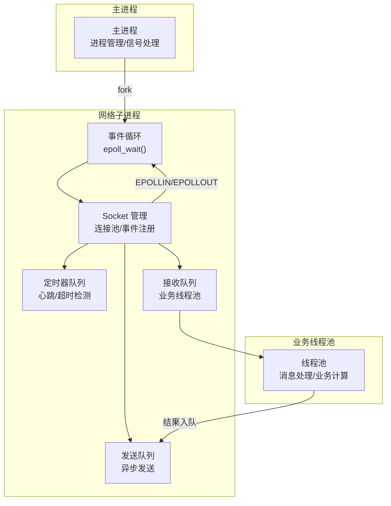
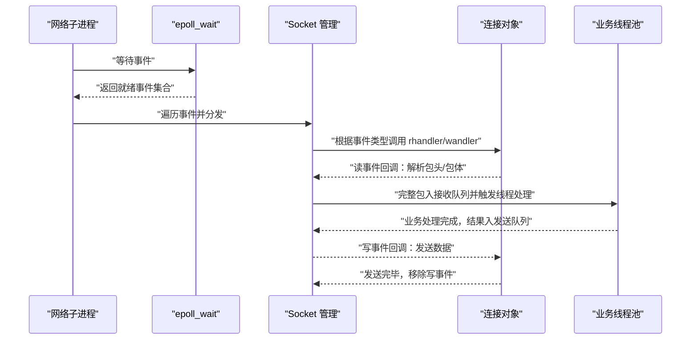
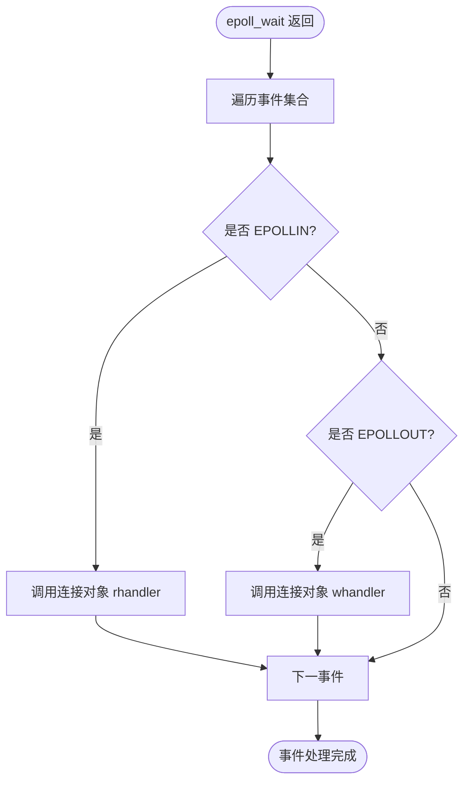
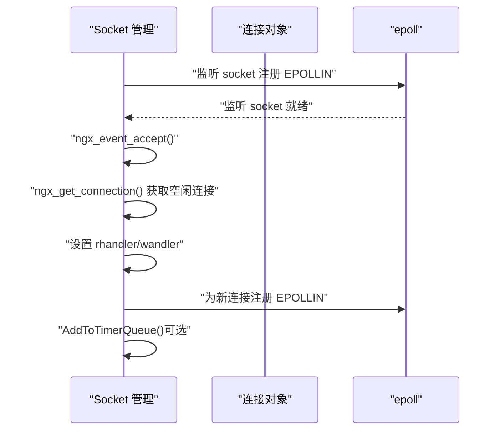
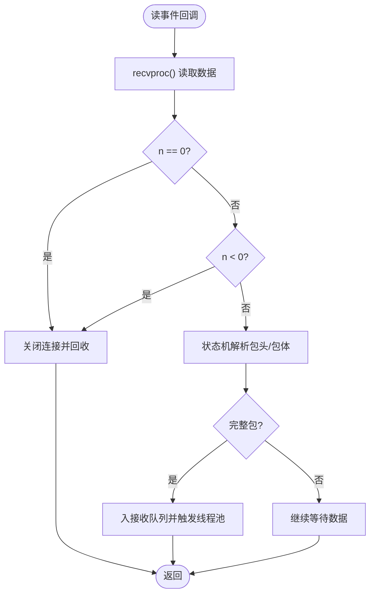
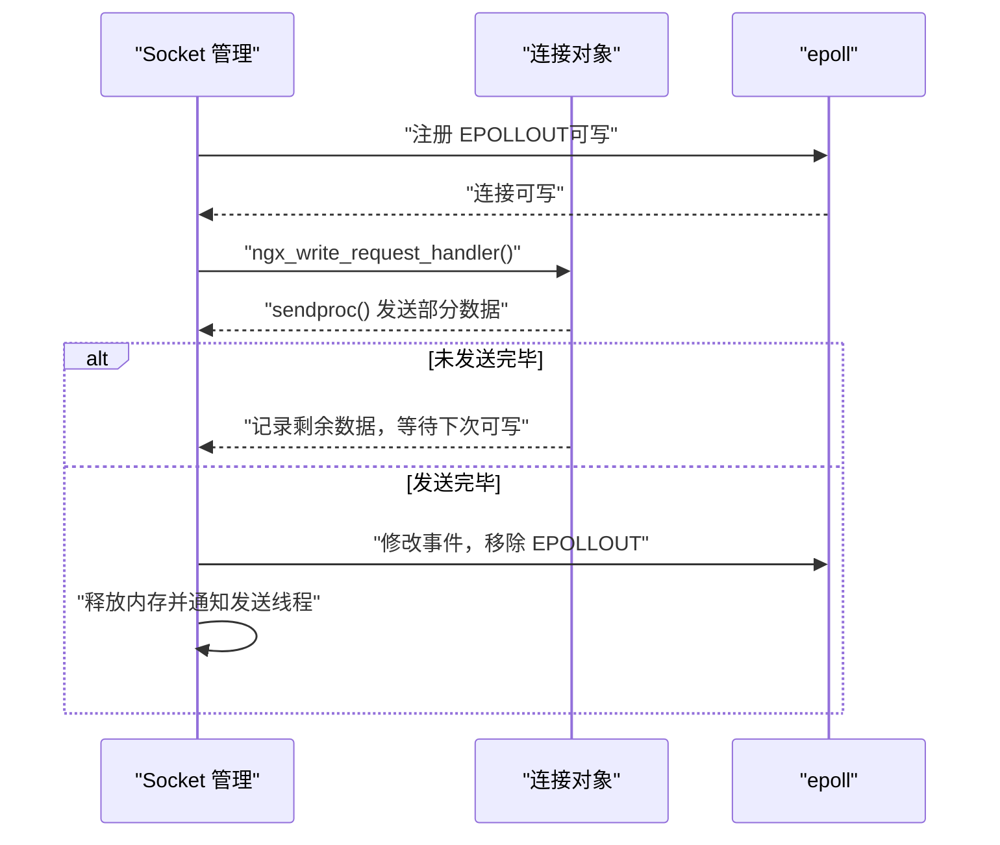
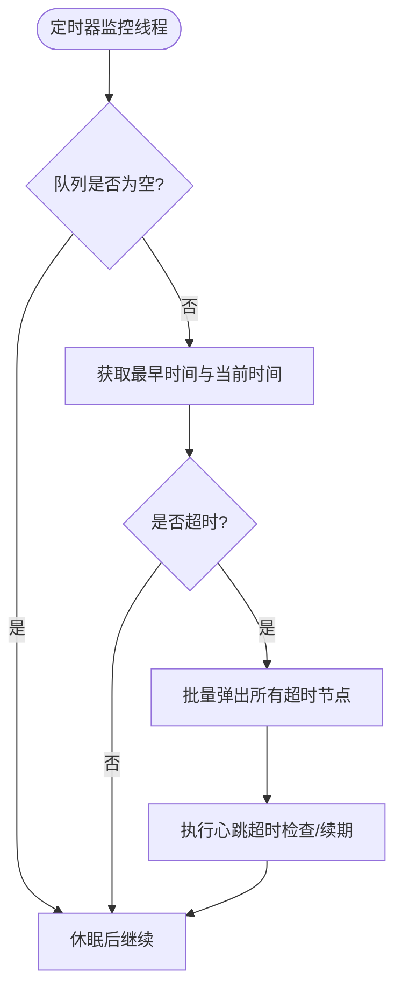
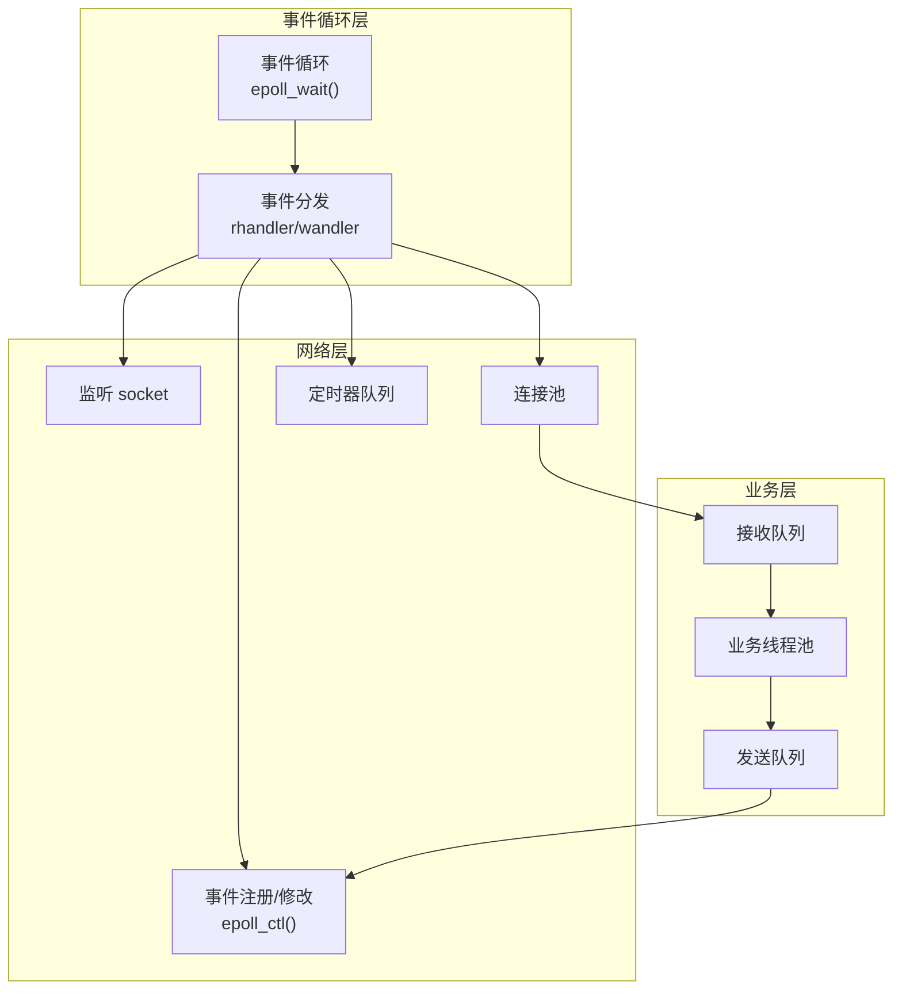
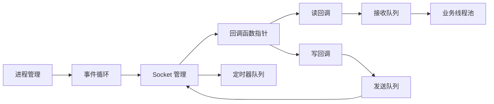

# 事件驱动架构

<cite>
**本文档引用的文件**
- [ngx_event.cxx](file://proc/ngx_event.cxx)
- [ngx_process_cycle.cxx](file://proc/ngx_process_cycle.cxx)
- [ngx_c_socket.h](file://include/ngx_c_socket.h)
- [ngx_c_socket.cxx](file://net/ngx_c_socket.cxx)
- [ngx_c_socket_accept.cxx](file://net/ngx_c_socket_accept.cxx)
- [ngx_c_socket_request.cxx](file://net/ngx_c_socket_request.cxx)
- [ngx_c_socket_time.cxx](file://net/ngx_c_socket_time.cxx)
- [ngx_global.h](file://include/ngx_global.h)
- [ngx_comm.h](file://include/ngx_comm.h)
- [ngx_macro.h](file://include/ngx_macro.h)
- [ngx_c_threadpool.h](file://include/ngx_c_threadpool.h)
- [ngx_lockfree_threadpool.cxx](file://misc/ngx_lockfree_threadpool.cxx)
</cite>

## 目录
1. [引言](#引言)
2. [项目结构](#项目结构)
3. [核心组件](#核心组件)
4. [架构总览](#架构总览)
5. [详细组件分析](#详细组件分析)
6. [依赖关系分析](#依赖关系分析)
7. [性能考量](#性能考量)
8. [故障排查指南](#故障排查指南)
9. [结论](#结论)
10. [附录](#附录)

## 引言
本文件面向 PointServer 的事件驱动架构，围绕基于 epoll 的异步 I/O 处理模型展开，系统阐述事件循环机制、事件注册、事件分发、回调处理，以及 socket 层的连接建立、数据读取、数据写入、连接关闭的异步流程。文档进一步解释事件驱动架构相较传统阻塞 I/O 的性能优势与适用场景，给出事件优先级管理、事件超时处理、事件队列管理等技术细节，并提供事件驱动架构图与数据流图，帮助读者全面理解如何通过事件驱动模型实现高并发连接处理与资源高效利用，同时提供事件丢失、事件堆积、性能瓶颈等常见问题的解决方案。

## 项目结构
PointServer 采用多进程 + 事件驱动 + 线程池的混合架构：
- 进程管理：主进程负责子进程生命周期与信号处理，网络子进程负责事件循环与 I/O 处理。
- 事件驱动：网络子进程内部通过 epoll_wait 驱动事件循环，事件回调处理连接建立、读写、超时等。
- 线程池：业务处理线程池从接收队列取任务，解包、业务计算后将结果写回发送队列，由网络层异步发送。
- 共享内存队列：跨进程数据通道，配合负载均衡与动态退避策略，保障系统整体吞吐。

图表来源
- [ngx_process_cycle.cxx](file://proc/ngx_process_cycle.cxx#L901-L963)
- [ngx_c_socket.cxx](file://net/ngx_c_socket.cxx#L541-L587)
- [ngx_c_socket_request.cxx](file://net/ngx_c_socket_request.cxx#L24-L114)
- [ngx_c_socket_time.cxx](file://net/ngx_c_socket_time.cxx#L149-L194)

章节来源
- [ngx_process_cycle.cxx](file://proc/ngx_process_cycle.cxx#L901-L963)
- [ngx_c_socket.cxx](file://net/ngx_c_socket.cxx#L541-L587)

## 核心组件
- 事件循环与定时器：网络子进程通过事件循环函数持续调用 epoll_wait，处理网络事件与定时器事件。
- Socket 管理：负责监听端口、连接池、连接生命周期管理、事件注册与回调分发。
- 接收/发送队列：接收队列承载完整包，业务线程池处理；发送队列承载待发送数据，由网络层异步发送。
- 定时器队列：基于 multimap 的时间队列，周期扫描超时连接并执行踢人或续期逻辑。
- 线程池：异步处理业务逻辑，避免阻塞事件循环。

章节来源
- [ngx_event.cxx](file://proc/ngx_event.cxx#L14-L22)
- [ngx_c_socket.h](file://include/ngx_c_socket.h#L103-L255)
- [ngx_c_socket.cxx](file://net/ngx_c_socket.cxx#L541-L587)
- [ngx_c_socket_request.cxx](file://net/ngx_c_socket_request.cxx#L24-L114)
- [ngx_c_socket_time.cxx](file://net/ngx_c_socket_time.cxx#L149-L194)
- [ngx_c_threadpool.h](file://include/ngx_c_threadpool.h#L9-L66)

## 架构总览
事件驱动架构的关键在于“事件驱动 + 非阻塞 I/O + 事件回调 + 队列解耦”。epoll_wait 作为事件循环的核心，一次性返回多个就绪事件，避免轮询带来的 CPU 开销；事件回调根据事件类型分派到连接对象的读/写处理器，实现连接建立、数据收发、连接关闭的异步处理；业务处理通过线程池异步化，避免阻塞网络事件循环；定时器队列提供心跳检测与超时踢人能力。

图表来源
- [ngx_process_cycle.cxx](file://proc/ngx_process_cycle.cxx#L912-L921)
- [ngx_c_socket.cxx](file://net/ngx_c_socket.cxx#L757-L808)
- [ngx_c_socket_accept.cxx](file://net/ngx_c_socket_accept.cxx#L22-L180)
- [ngx_c_socket_request.cxx](file://net/ngx_c_socket_request.cxx#L24-L114)
- [ngx_c_socket_request.cxx](file://net/ngx_c_socket_request.cxx#L235-L332)

## 详细组件分析

### 事件循环与定时器
- 事件循环入口：网络子进程在初始化后进入死循环，持续调用事件处理函数，内部调用 epoll_wait 等待事件。
- 事件处理：事件处理函数负责调用底层 epoll 事件处理，随后打印统计信息。
- 定时器事件：epoll_wait 返回后，系统可结合定时器队列进行超时检测与处理。

章节来源
- [ngx_process_cycle.cxx](file://proc/ngx_process_cycle.cxx#L912-L921)
- [ngx_event.cxx](file://proc/ngx_event.cxx#L14-L22)

### 事件注册与分发
- epoll 初始化：创建 epoll 实例，初始化连接池，为监听 socket 注册读事件，设置回调为连接接受处理函数。
- 事件注册：通过 epoll 控制接口增加/修改/删除事件，将连接对象与事件绑定，便于事件回调时取回上下文。
- 事件分发：epoll_wait 返回后，遍历事件集合，根据事件类型调用连接对象的读/写回调函数。

图表来源
- [ngx_c_socket.cxx](file://net/ngx_c_socket.cxx#L757-L808)

章节来源
- [ngx_c_socket.cxx](file://net/ngx_c_socket.cxx#L541-L587)
- [ngx_c_socket.cxx](file://net/ngx_c_socket.cxx#L757-L808)

### 连接建立（Accept）
- 新连接接入：监听 socket 上的读事件触发连接接受处理函数，尝试获取新连接。
- 非阻塞 accept：使用 accept4 或 accept 获取非阻塞 socket，设置为非阻塞模式。
- 连接对象绑定：从连接池获取空闲连接，设置读写回调为数据读取与发送处理函数，并注册读事件。
- 心跳/超时：根据配置将连接加入定时器队列，周期性检测心跳超时。

图表来源
- [ngx_c_socket_accept.cxx](file://net/ngx_c_socket_accept.cxx#L22-L180)
- [ngx_c_socket.cxx](file://net/ngx_c_socket.cxx#L541-L587)

章节来源
- [ngx_c_socket_accept.cxx](file://net/ngx_c_socket_accept.cxx#L22-L180)

### 数据读取（Receive）
- 读事件回调：连接可读时调用读处理函数，调用接收函数读取数据。
- 状态机解析：根据连接状态机解析包头与包体，完整包入接收队列交由线程池处理。
- 异常处理：对端关闭、错误等情况统一关闭连接并回收资源。

图表来源
- [ngx_c_socket_request.cxx](file://net/ngx_c_socket_request.cxx#L24-L114)
- [ngx_c_socket_request.cxx](file://net/ngx_c_socket_request.cxx#L116-L154)

章节来源
- [ngx_c_socket_request.cxx](file://net/ngx_c_socket_request.cxx#L24-L114)
- [ngx_c_socket_request.cxx](file://net/ngx_c_socket_request.cxx#L116-L154)

### 数据写入（Send）
- 写事件回调：连接可写时调用写处理函数，尝试发送发送队列中的数据。
- 部分发送：若未全部发送完毕，记录剩余数据，等待下次可写事件继续发送。
- 发送完成：发送完毕后移除写事件，释放内存并通知发送线程继续处理。

图表来源
- [ngx_c_socket_request.cxx](file://net/ngx_c_socket_request.cxx#L281-L332)

章节来源
- [ngx_c_socket_request.cxx](file://net/ngx_c_socket_request.cxx#L281-L332)

### 连接关闭
- 主动关闭：调用关闭处理函数，从定时器队列移除连接，关闭 socket，延迟回收到连接回收队列。
- 被动关闭：对端关闭或错误时，统一调用关闭处理函数回收连接。

章节来源
- [ngx_c_socket.cxx](file://net/ngx_c_socket.cxx#L460-L477)

### 事件优先级与事件队列管理
- 事件优先级：事件回调通过连接对象的读/写处理器函数指针分派，读事件优先处理数据接收，写事件优先处理数据发送。
- 事件队列：接收队列承载完整包，业务线程池异步处理；发送队列承载待发送数据，网络层异步发送。
- 背压控制：发送队列过大时丢弃部分数据包，避免服务器不稳定；对个别发送过慢的连接直接切断，保护系统。

章节来源
- [ngx_c_socket.cxx](file://net/ngx_c_socket.cxx#L415-L456)
- [ngx_c_socket_request.cxx](file://net/ngx_c_socket_request.cxx#L214-L233)

### 事件超时处理
- 定时器队列：基于 multimap 的时间队列，按时间升序存储，周期扫描最早时间点。
- 超时检测：定时器监控线程定期获取当前时间，取出所有超时节点，执行心跳超时检查或续期。
- 踢人策略：根据配置决定超时是否直接踢人，或仅续期后继续监控。

图表来源
- [ngx_c_socket_time.cxx](file://net/ngx_c_socket_time.cxx#L149-L194)

章节来源
- [ngx_c_socket_time.cxx](file://net/ngx_c_socket_time.cxx#L35-L101)
- [ngx_c_socket_time.cxx](file://net/ngx_c_socket_time.cxx#L149-L194)

### 事件驱动架构图

图表来源
- [ngx_c_socket.cxx](file://net/ngx_c_socket.cxx#L541-L587)
- [ngx_c_socket_request.cxx](file://net/ngx_c_socket_request.cxx#L24-L114)
- [ngx_c_socket_time.cxx](file://net/ngx_c_socket_time.cxx#L149-L194)

## 依赖关系分析
- 进程与事件循环：主进程负责子进程生命周期与信号处理，网络子进程负责事件循环与 I/O 处理。
- 事件与回调：事件分发依赖连接对象的回调函数指针，读/写事件分别调用对应处理器。
- 队列与线程池：接收队列与发送队列分别由网络层与业务线程池协作，实现异步解耦。
- 定时器与连接：定时器队列与连接对象关联，心跳超时检测与连接生命周期管理紧密耦合。

图表来源
- [ngx_process_cycle.cxx](file://proc/ngx_process_cycle.cxx#L901-L963)
- [ngx_c_socket.h](file://include/ngx_c_socket.h#L26-L27)
- [ngx_c_socket.cxx](file://net/ngx_c_socket.cxx#L541-L587)

章节来源
- [ngx_process_cycle.cxx](file://proc/ngx_process_cycle.cxx#L901-L963)
- [ngx_c_socket.h](file://include/ngx_c_socket.h#L26-L27)

## 性能考量
- epoll 优势：事件驱动避免轮询，单进程可支撑高并发连接；非阻塞 I/O 与事件回调配合，降低系统调用开销。
- 背压与限流：发送队列过大时丢弃数据包，对个别发送过慢的连接直接切断，保护系统稳定性。
- 线程池解耦：业务处理异步化，避免阻塞事件循环，提升整体吞吐。
- 超时与资源回收：定时器队列与连接回收队列协同，及时释放资源，避免内存泄漏与连接堆积。

## 故障排查指南
- 事件丢失：检查事件注册是否正确，确认回调函数指针与事件类型匹配；关注信号中断导致的 epoll_wait 返回 EINTR。
- 事件堆积：监控接收队列与发送队列长度，必要时增加业务线程数量或启用限速策略。
- 性能瓶颈：检查定时器队列扫描频率与批量处理策略，避免频繁锁竞争；评估线程池规模与任务粒度。
- 连接异常：对端关闭或错误时统一回收连接，检查关闭流程是否完整；关注 fd 泄漏与连接池枯竭。

章节来源
- [ngx_c_socket.cxx](file://net/ngx_c_socket.cxx#L757-L790)
- [ngx_c_socket.cxx](file://net/ngx_c_socket.cxx#L415-L456)
- [ngx_c_socket_time.cxx](file://net/ngx_c_socket_time.cxx#L149-L194)

## 结论
PointServer 的事件驱动架构通过 epoll_wait 驱动事件循环，结合连接池、接收/发送队列与业务线程池，实现了高并发连接的异步处理与资源高效利用。事件优先级、超时处理与队列管理共同保障系统稳定性与性能。通过合理的背压控制、定时器策略与线程池配置，可有效避免事件丢失、事件堆积与性能瓶颈，满足大规模并发场景的需求。

## 附录
- 数据结构与宏定义：包头结构、收包状态机、日志级别等定义位于公共头文件中，为事件驱动处理提供基础支撑。
- 全局变量：进程类型、全局 socket 对象、线程池对象等在全局头文件中声明，便于各模块共享。

章节来源
- [ngx_comm.h](file://include/ngx_comm.h#L6-L31)
- [ngx_macro.h](file://include/ngx_macro.h#L18-L31)
- [ngx_global.h](file://include/ngx_global.h#L27-L46)