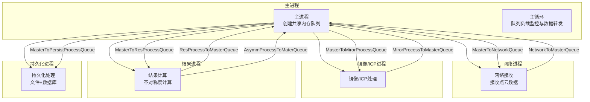
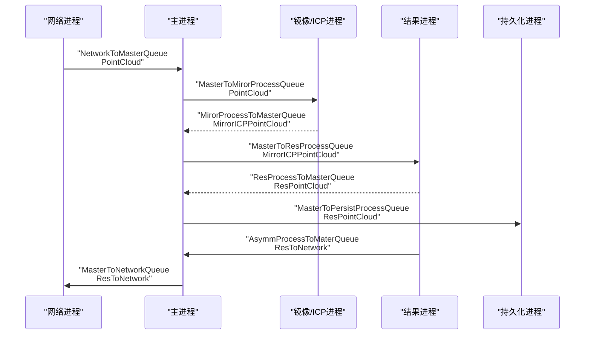
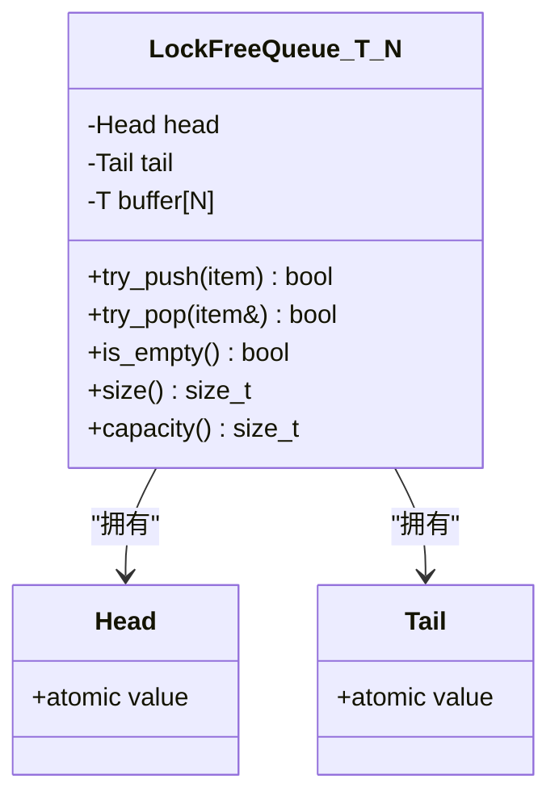
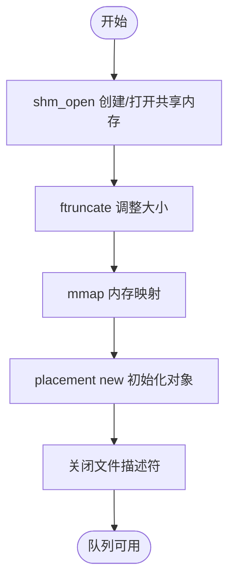
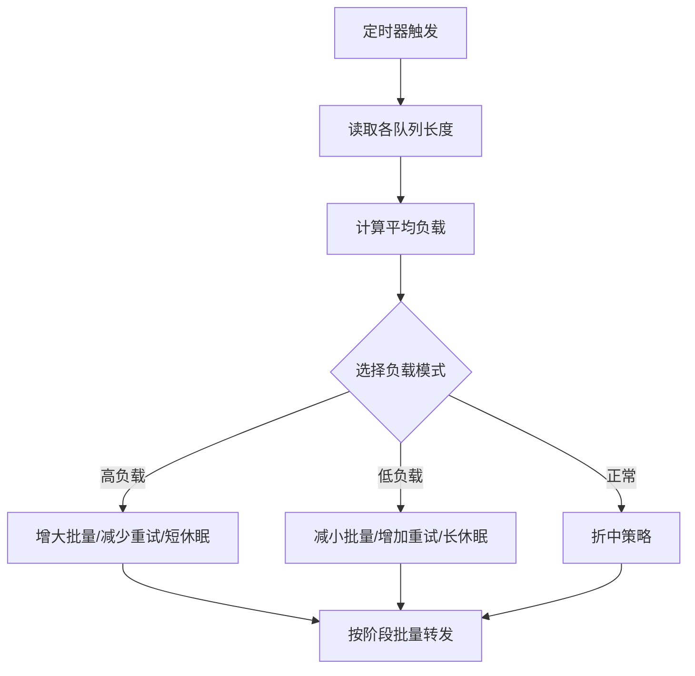
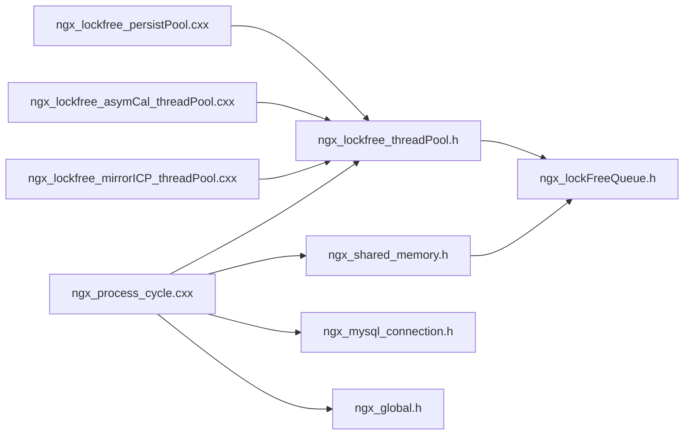

# 共享内存队列系统

<cite>
**本文引用的文件**
- [ngx_shared_memory.h](file://include/ngx_shared_memory.h)
- [ngx_lockFreeQueue.h](file://include/ngx_lockFreeQueue.h)
- [ngx_process_cycle.cxx](file://proc/ngx_process_cycle.cxx)
- [ngx_lockfree_mirrorICP_threadPool.cxx](file://misc/ngx_lockfree_mirrorICP_threadPool.cxx)
- [ngx_lockfree_asymCal_threadPool.cxx](file://misc/ngx_lockfree_asymCal_threadPool.cxx)
- [ngx_lockfree_persistPool.cxx](file://misc/ngx_lockfree_persistPool.cxx)
- [ngx_c_socket.h](file://include/ngx_c_socket.h)
- [ngx_comm.h](file://include/ngx_comm.h)
- [ngx_macro.h](file://include/ngx_macro.h)
- [ngx_global.h](file://include/ngx_global.h)
</cite>

## 目录
1. [简介](#简介)
2. [项目结构](#项目结构)
3. [核心组件](#核心组件)
4. [架构总览](#架构总览)
5. [详细组件分析](#详细组件分析)
6. [依赖关系分析](#依赖关系分析)
7. [性能考量](#性能考量)
8. [故障排查指南](#故障排查指南)
9. [结论](#结论)

## 简介
本文件面向 PointServer 的共享内存队列系统，围绕八个核心共享内存队列展开，系统性阐述其设计、实现与运行机制。重点包括：
- 八个队列的职责划分与数据流
- 共享内存创建与初始化流程
- 无锁队列 LockFreeQueue 的实现原理（缓存行对齐、内存序、CAS 循环）
- 队列容量管理、负载监控与动态调整
- 数据传输协议与进程间协作
- 性能优化、内存管理与一致性保障
- 常见问题（阻塞、数据丢失、内存泄漏）的定位与解决思路

## 项目结构
该项目采用多进程架构，主进程负责创建共享内存队列并协调子进程；子进程分别承担网络接收、镜像/ICP 处理、结果计算、持久化等任务。共享内存队列作为跨进程通信的基础设施，贯穿整个数据流水线。

图表来源
- [ngx_process_cycle.cxx](file://proc/ngx_process_cycle.cxx#L360-L399)
- [ngx_process_cycle.cxx](file://proc/ngx_process_cycle.cxx#L901-L927)
- [ngx_process_cycle.cxx](file://proc/ngx_process_cycle.cxx#L985-L1000)
- [ngx_process_cycle.cxx](file://proc/ngx_process_cycle.cxx#L1029-L1042)
- [ngx_process_cycle.cxx](file://proc/ngx_process_cycle.cxx#L1072-L1084)

章节来源
- [ngx_process_cycle.cxx](file://proc/ngx_process_cycle.cxx#L360-L399)
- [ngx_process_cycle.cxx](file://proc/ngx_process_cycle.cxx#L901-L927)
- [ngx_process_cycle.cxx](file://proc/ngx_process_cycle.cxx#L985-L1000)
- [ngx_process_cycle.cxx](file://proc/ngx_process_cycle.cxx#L1029-L1042)
- [ngx_process_cycle.cxx](file://proc/ngx_process_cycle.cxx#L1072-L1084)

## 核心组件
- 共享内存队列模板与类型别名
  - 通过模板参数指定元素类型与容量，使用全局指针在进程间共享
  - 定义八种队列类型别名，分别对应不同阶段的数据流转
- 无锁队列 LockFreeQueue
  - 环形缓冲区 + 原子 head/tail 指针
  - 缓存行对齐避免伪共享
  - acquire/release 内存序保证可见性
  - compare_exchange_weak 循环 CAS 实现无锁入队/出队
- 共享内存初始化与销毁
  - open_shm_queue：创建/打开共享内存、调整大小、mmap、placement new 初始化
  - destroy_shm_queue：析构、munmap、shm_unlink
- 主进程队列管理与数据转发
  - 主进程创建所有队列，维护负载监控与动态休眠策略
  - 数据转发按阶段批量处理，支持指数退避与队列负载检查
- 子进程队列绑定与处理
  - 各子进程在启动时绑定对应队列，线程池消费队列并产出下一阶段数据
- 网络通信与数据协议
  - 网络进程接收客户端点云数据，序列化为 PointCloud，写入 NetworkToMasterQueue
  - 通信协议定义包头结构，含长度、CRC、消息类型等字段

章节来源
- [ngx_shared_memory.h](file://include/ngx_shared_memory.h#L12-L84)
- [ngx_shared_memory.h](file://include/ngx_shared_memory.h#L87-L179)
- [ngx_lockFreeQueue.h](file://include/ngx_lockFreeQueue.h#L4-L150)
- [ngx_process_cycle.cxx](file://proc/ngx_process_cycle.cxx#L401-L464)
- [ngx_process_cycle.cxx](file://proc/ngx_process_cycle.cxx#L717-L860)
- [ngx_c_socket.h](file://include/ngx_c_socket.h#L103-L258)
- [ngx_comm.h](file://include/ngx_comm.h#L19-L31)

## 架构总览
八个共享内存队列的职责与数据流向如下：
- 网络到 master 队列：网络进程接收客户端点云数据，写入该队列
- master 到镜像/ICP 处理队列：主进程将原始点云转发至镜像/ICP处理队列
- 镜像/ICP 处理到 master 队列：镜像/ICP处理完成后写回 master 队列
- master 到结果处理队列：主进程将镜像/ICP结果转发至结果计算队列
- 结果处理到 master 队列：结果计算完成后写回 master 队列
- master 到持久化进程队列：主进程将结果转发至持久化队列
- 返回 master 队列：结果计算完成后写入该队列，供网络进程返回客户端
- 返回网络队列：主进程将结果写入该队列，网络进程负责发送

图表来源
- [ngx_shared_memory.h](file://include/ngx_shared_memory.h#L65-L84)
- [ngx_process_cycle.cxx](file://proc/ngx_process_cycle.cxx#L717-L860)
- [ngx_process_cycle.cxx](file://proc/ngx_process_cycle.cxx#L901-L927)
- [ngx_process_cycle.cxx](file://proc/ngx_process_cycle.cxx#L985-L1000)
- [ngx_process_cycle.cxx](file://proc/ngx_process_cycle.cxx#L1029-L1042)
- [ngx_process_cycle.cxx](file://proc/ngx_process_cycle.cxx#L1072-L1084)

## 详细组件分析

### 1) 共享内存队列模板与类型别名
- 模板参数
  - T：队列元素类型（PointCloud、MirrorICPPointCloud、ResPointCloud、ResToNetwork 等）
  - N：队列容量（2的幂，便于环形索引）
- 类型别名
  - 八个队列别名分别对应不同阶段的数据类型
- 全局指针
  - 各子进程通过 open_shm_queue 获取队列指针，实现跨进程共享

章节来源
- [ngx_shared_memory.h](file://include/ngx_shared_memory.h#L24-L84)

### 2) 无锁队列 LockFreeQueue 实现原理
- 环形缓冲区
  - buffer[N] 存储元素，head/value 与 tail/value 为原子 size_t
- 缓存行对齐
  - Head/Tail 结构体按 64 字节对齐，避免伪共享
- 内存序
  - try_push/try_pop 使用 relaxed/acquire/release 组合，保证可见性与顺序
  - compare_exchange_weak 循环 CAS，失败时重试
- 空满判定
  - size() 与 capacity() 基于 head/tail 值计算，容量为 N-1
- 移动语义
  - try_push 使用移动构造，避免拷贝；try_pop 使用移动赋值

图表来源
- [ngx_lockFreeQueue.h](file://include/ngx_lockFreeQueue.h#L4-L150)

章节来源
- [ngx_lockFreeQueue.h](file://include/ngx_lockFreeQueue.h#L4-L150)

### 3) 共享内存创建与初始化流程
- open_shm_queue
  - shm_open 创建/打开共享内存
  - ftruncate 调整大小
  - mmap 内存映射
  - placement new 初始化对象
  - close 文件描述符
- destroy_shm_queue
  - 显式析构、munmap、shm_unlink
- 主进程初始化
  - ngx_init_shared_memory_queues 一次性创建所有队列
  - 各子进程启动时绑定对应队列

图表来源
- [ngx_shared_memory.h](file://include/ngx_shared_memory.h#L87-L179)

章节来源
- [ngx_shared_memory.h](file://include/ngx_shared_memory.h#L87-L179)
- [ngx_process_cycle.cxx](file://proc/ngx_process_cycle.cxx#L332-L358)

### 4) 数据传输协议与网络到 master 队列
- 网络通信结构
  - 包头结构包含包总长度、CRC、消息类型
  - 接收缓冲区大小与状态机用于分包处理
- 点云数据接收
  - 网络进程将客户端发送的点云数据解析为 PointCloud
  - 写入 NetworkToMasterQueue；若队列满则丢弃
- 字节序处理
  - dataLen 从网络序转换为主机序
  - ID/name/age 等字段拷贝到本地结构

章节来源
- [ngx_comm.h](file://include/ngx_comm.h#L19-L31)
- [ngx_c_socket.h](file://include/ngx_c_socket.h#L103-L258)
- [logic ngx_c_slogic.cxx](file://logic/ngx_c_slogic.cxx#L190-L243)

### 5) 镜像/ICP 处理队列与线程池
- 队列绑定
  - 主进程将镜像/ICP处理队列与结果计算队列绑定
- 线程池
  - MirrorICPProcessingPool 从输入队列 try_pop，处理后 try_push 至输出队列
  - 处理失败时进行有限次重试与让出
- 处理内容
  - 解压、转换、镜像变换、ICP 变换、压缩、封装输出

章节来源
- [ngx_process_cycle.cxx](file://proc/ngx_process_cycle.cxx#L985-L1000)
- [ngx_lockfree_mirrorICP_threadPool.cxx](file://misc/ngx_lockfree_mirrorICP_threadPool.cxx#L5-L33)
- [ngx_lockfree_mirrorICP_threadPool.cxx](file://misc/ngx_lockfree_mirrorICP_threadPool.cxx#L35-L94)

### 6) 结果计算与返回队列
- 队列绑定
  - 主进程将结果计算队列与返回 master 队列绑定
- 线程池
  - ResultProcessingPool 计算不对称度，封装 ResPointCloud 与 ResToNetwork
  - ResToNetwork 写入 AsymmProcessToMaterQueue，供主进程转发至网络
- 网络返回
  - 主进程将 ResToNetwork 写入 MasterToNetworkQueue，网络进程负责发送

章节来源
- [ngx_process_cycle.cxx](file://proc/ngx_process_cycle.cxx#L1029-L1042)
- [ngx_lockfree_asymCal_threadPool.cxx](file://misc/ngx_lockfree_asymCal_threadPool.cxx#L13-L40)
- [ngx_lockfree_asymCal_threadPool.cxx](file://misc/ngx_lockfree_asymCal_threadPool.cxx#L47-L87)

### 7) 持久化队列与数据库事务
- 队列绑定
  - 主进程将持久化队列绑定
- 线程池
  - PersistProcessingPool 生成临时文件，重命名为最终文件
  - 数据库事务：START TRANSACTION -> 查询旧路径 -> 重命名 -> INSERT/UPDATE -> COMMIT
  - 异常时 ROLLBACK 并清理临时文件
- 文件与数据库一致性
  - 仅在事务成功后才删除旧文件，避免半成品文件

章节来源
- [ngx_process_cycle.cxx](file://proc/ngx_process_cycle.cxx#L1072-L1084)
- [ngx_lockfree_persistPool.cxx](file://misc/ngx_lockfree_persistPool.cxx#L12-L31)
- [ngx_lockfree_persistPool.cxx](file://misc/ngx_lockfree_persistPool.cxx#L52-L146)

### 8) 主进程队列负载监控与动态调整
- 负载监控
  - 定期统计各队列 size，计算平均负载，动态切换负载均衡模式
- 动态调整
  - 高负载：增大批量大小、减少重试、缩短休眠
  - 低负载：减小批量、增加重试、延长休眠
  - 正常：折中策略
- 数据转发
  - 按阶段批量处理，支持指数退避与队列负载检查，避免拥塞扩散

图表来源
- [ngx_process_cycle.cxx](file://proc/ngx_process_cycle.cxx#L401-L464)
- [ngx_process_cycle.cxx](file://proc/ngx_process_cycle.cxx#L717-L860)

章节来源
- [ngx_process_cycle.cxx](file://proc/ngx_process_cycle.cxx#L401-L464)
- [ngx_process_cycle.cxx](file://proc/ngx_process_cycle.cxx#L717-L860)

## 依赖关系分析
- 头文件依赖
  - ngx_shared_memory.h 依赖 ngx_lockFreeQueue.h、ngx_func.h
  - ngx_process_cycle.cxx 依赖 ngx_lockfree_threadPool.h、ngx_mysql_connection.h、ngx_global.h
  - 各线程池实现依赖相应队列类型与第三方库（PCL、Eigen、Draco）
- 进程间耦合
  - 主进程负责队列生命周期与数据转发
  - 子进程仅关注自身队列的消费与生产
- 潜在风险
  - 队列容量 N-1 的限制需与实际负载匹配
  - 队列过载时的回退策略（放回队列）需避免死循环

图表来源
- [ngx_shared_memory.h](file://include/ngx_shared_memory.h#L4-L10)
- [ngx_process_cycle.cxx](file://proc/ngx_process_cycle.cxx#L11-L20)
- [ngx_lockfree_mirrorICP_threadPool.cxx](file://misc/ngx_lockfree_mirrorICP_threadPool.cxx#L1)
- [ngx_lockfree_asymCal_threadPool.cxx](file://misc/ngx_lockfree_asymCal_threadPool.cxx#L11)
- [ngx_lockfree_persistPool.cxx](file://misc/ngx_lockfree_persistPool.cxx#L1)

章节来源
- [ngx_shared_memory.h](file://include/ngx_shared_memory.h#L4-L10)
- [ngx_process_cycle.cxx](file://proc/ngx_process_cycle.cxx#L11-L20)

## 性能考量
- 无锁队列优势
  - 避免线程阻塞与上下文切换，降低延迟
  - 高并发下线性可伸缩性优于传统锁
- 缓存行对齐
  - Head/Tail 独占缓存行，避免多核竞争导致的伪共享
- 内存序与 CAS
  - release/acquire 保证数据写入在指针更新前对消费者可见
  - compare_exchange_weak 循环重试，避免虚假失败
- 批量处理与指数退避
  - 主进程按负载模式调整批量大小与重试策略，提升吞吐
  - 退避策略缓解拥塞，避免 CPU 自旋浪费
- 资源管理
  - placement new + 显式析构，确保队列对象生命周期可控
  - destroy_shm_queue 保证共享内存资源释放

[本节为通用性能讨论，无需特定文件引用]

## 故障排查指南
- 队列阻塞
  - 现象：某阶段队列持续增长，下游处理滞后
  - 排查：检查负载模式、批量大小、重试次数；确认下游线程池是否正常运行
  - 处理：适当降低批量或增加下游线程数；检查队列过载回退逻辑
- 数据丢失
  - 现象：网络进程写入队列失败
  - 排查：确认 NetworkToMasterQueue 容量与负载；检查 try_push 返回值
  - 处理：增大队列容量或优化上游发送速率；记录丢弃日志
- 内存泄漏
  - 现象：进程退出后共享内存未释放
  - 排查：确认 destroy_shm_queue 是否调用；子进程是否正确关闭
  - 处理：在进程退出路径调用 destroy_shm_queue；清理残留共享内存
- 数据不一致
  - 现象：数据库与文件不一致
  - 排查：事务提交前的异常路径；临时文件清理
  - 处理：确保 ROLLBACK 与文件清理；仅在成功后删除旧文件

章节来源
- [ngx_shared_memory.h](file://include/ngx_shared_memory.h#L167-L179)
- [ngx_lockfree_persistPool.cxx](file://misc/ngx_lockfree_persistPool.cxx#L135-L146)
- [ngx_process_cycle.cxx](file://proc/ngx_process_cycle.cxx#L717-L860)

## 结论
该共享内存队列系统通过无锁队列与多进程分工，构建了高吞吐、低延迟的点云处理流水线。主进程负责队列生命周期与负载均衡，子进程专注各自阶段的计算与 I/O。通过缓存行对齐、内存序与 CAS 循环，系统在高并发下保持稳定；通过动态调整与指数退避，有效应对突发流量。建议在部署时结合实际负载调优队列容量与线程数，并完善监控与告警，确保系统长期稳定运行。