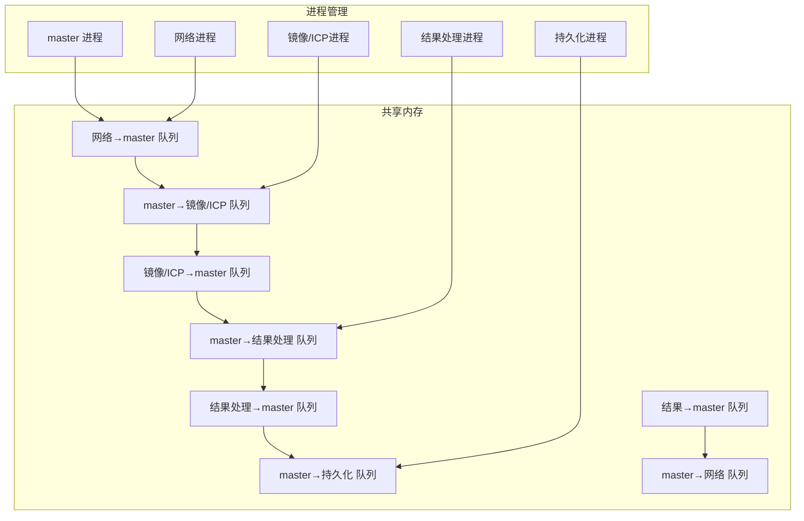
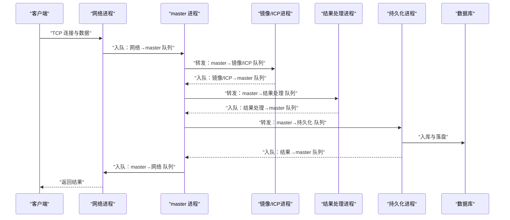
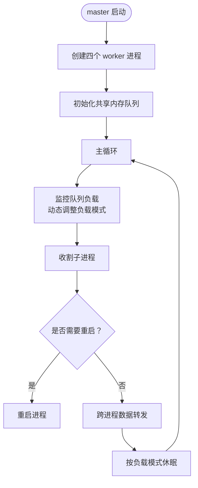
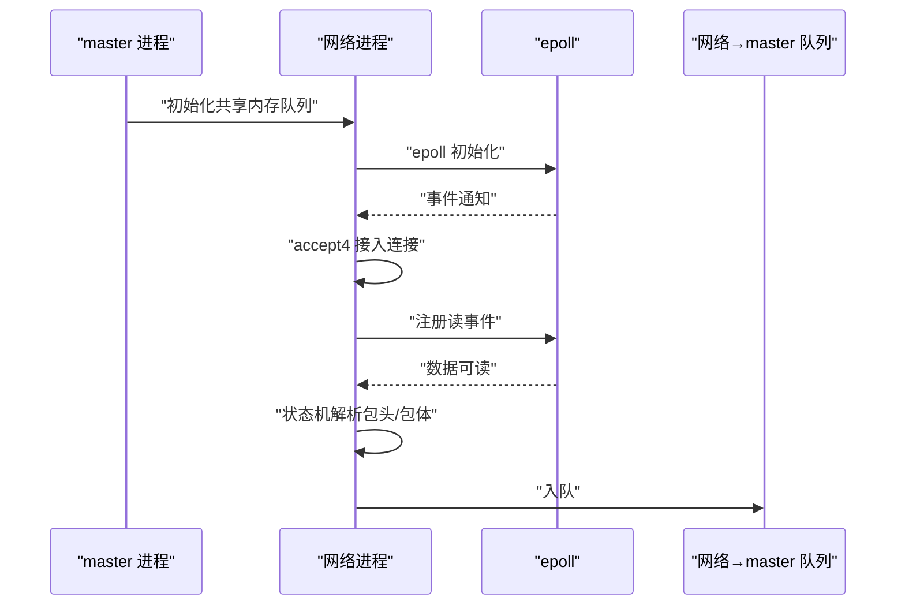
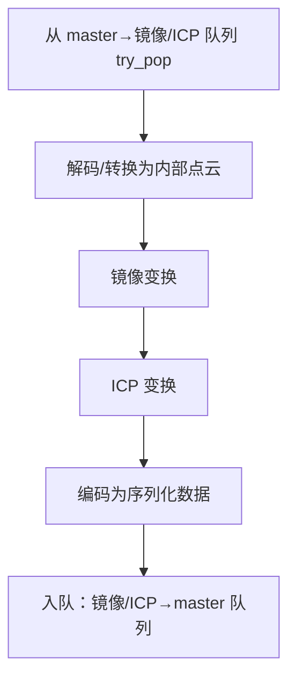
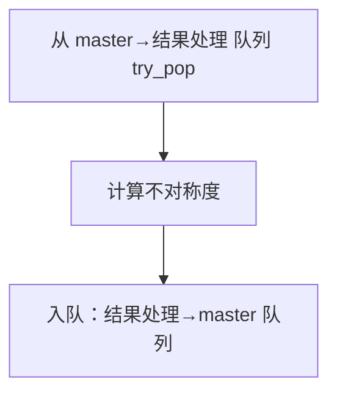
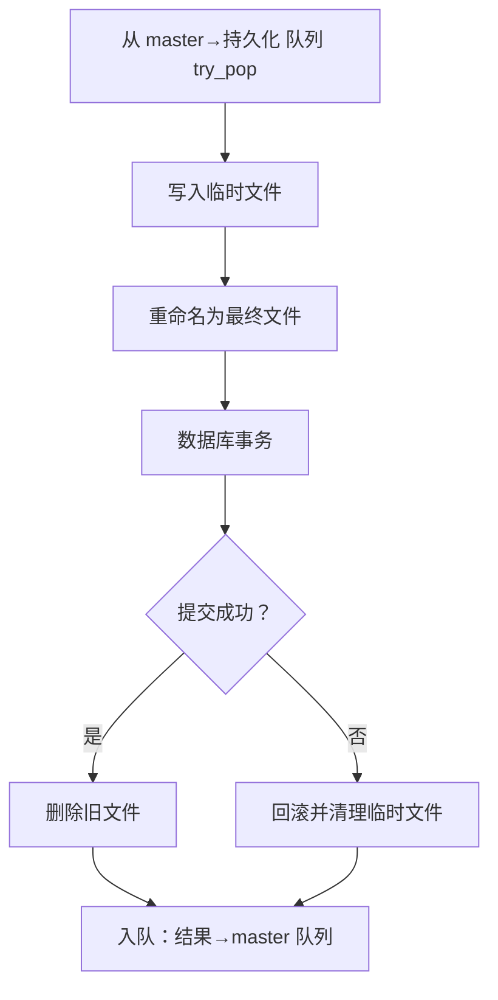
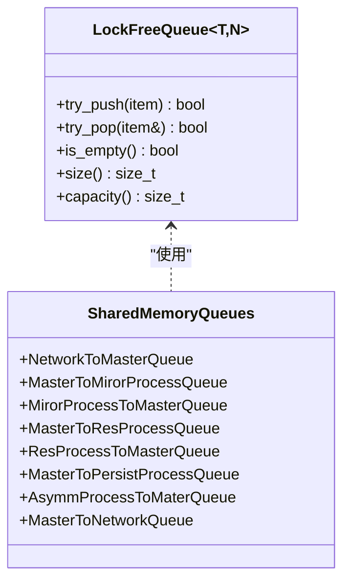
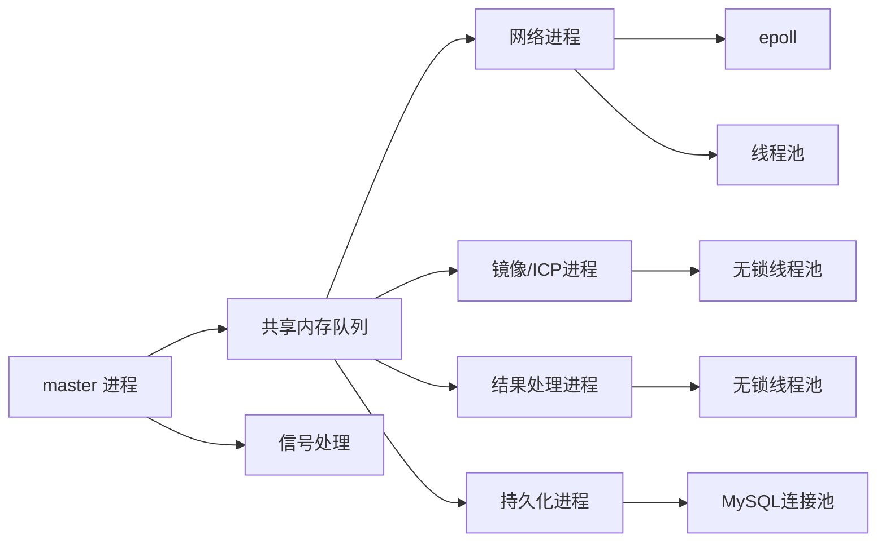

# 多进程架构设计

<cite>
**本文档引用的文件**
- [ngx_process_cycle.cxx](file://proc/ngx_process_cycle.cxx)
- [ngx_daemon.cxx](file://proc/ngx_daemon.cxx)
- [ngx_event.cxx](file://proc/ngx_event.cxx)
- [ngx_signal.cxx](file://signal/ngx_signal.cxx)
- [ngx_shared_memory.h](file://include/ngx_shared_memory.h)
- [ngx_lockFreeQueue.h](file://include/ngx_lockFreeQueue.h)
- [ngx_lockfree_threadPool.cxx](file://misc/ngx_lockfree_threadPool.cxx)
- [ngx_lockfree_mirrorICP_threadPool.cxx](file://misc/ngx_lockfree_mirrorICP_threadPool.cxx)
- [ngx_lockfree_persistPool.cxx](file://misc/ngx_lockfree_persistPool.cxx)
- [ngx_c_socket.cxx](file://net/ngx_c_socket.cxx)
- [ngx_c_socket_accept.cxx](file://net/ngx_c_socket_accept.cxx)
- [ngx_c_socket_request.cxx](file://net/ngx_c_socket_request.cxx)
- [ngx_global.h](file://include/ngx_global.h)
- [ngx_macro.h](file://include/ngx_macro.h)
</cite>

## 目录
1. [引言](#引言)
2. [项目结构](#项目结构)
3. [核心组件](#核心组件)
4. [架构总览](#架构总览)
5. [详细组件分析](#详细组件分析)
6. [依赖关系分析](#依赖关系分析)
7. [性能考量](#性能考量)
8. [故障排查指南](#故障排查指南)
9. [结论](#结论)

## 引言
本文件面向 PointServer 的多进程架构，系统性阐述 master-worker 多进程模型的设计理念与实现原理，涵盖进程创建与管理、进程间通信机制、四大核心工作进程的职责与协作、进程生命周期管理、共享内存队列的设计与实现、进程隔离与稳定性保障、故障恢复策略，以及同步、资源竞争与死锁预防等关键技术问题。

## 项目结构
项目采用“master 管理 + worker 并行”的架构，核心目录与职责如下：
- proc：进程生命周期与事件循环（master 进程、守护进程、事件循环）
- signal：信号处理与子进程收割
- include：共享内存队列、锁无队列、宏定义、全局变量等
- net：网络 I/O、epoll、连接管理、收发流程
- misc：线程池与各处理模块（镜像/ICP、结果处理、持久化）
- persist：MySQL 连接池与持久化流程
- 其他：CMake 构建脚本、Docker 配置等

图表来源
- [ngx_process_cycle.cxx](file://proc/ngx_process_cycle.cxx#L360-L399)
- [ngx_shared_memory.h](file://include/ngx_shared_memory.h#L65-L84)

章节来源
- [ngx_process_cycle.cxx](file://proc/ngx_process_cycle.cxx#L360-L399)
- [ngx_shared_memory.h](file://include/ngx_shared_memory.h#L12-L21)

## 核心组件
- master 进程：负责进程创建、监控、重启、共享内存队列初始化、跨进程数据转发与负载均衡
- 四个工作进程：
  - 网络进程：监听端口、epoll 事件驱动、接收客户端数据、入队到网络→master 队列
  - 镜像/ICP 处理进程：从 master→镜像/ICP 队列取数据，执行镜像与 ICP 变换，产出镜像/ICP 点云，入队到镜像/ICP→master 队列
  - 结果处理进程：从 master→结果处理队列取数据，计算不对称度，产出结果，入队到结果处理→master 队列
  - 持久化进程：从 master→持久化队列取数据，落盘与入库，完成后入队到 master→网络队列
- 共享内存队列：基于无锁环形队列，跨进程共享，避免锁竞争
- 信号与事件：master 通过信号处理与 waitpid 收割子进程，网络进程通过 epoll 驱动事件循环

章节来源
- [ngx_process_cycle.cxx](file://proc/ngx_process_cycle.cxx#L103-L109)
- [ngx_shared_memory.h](file://include/ngx_shared_memory.h#L65-L84)
- [ngx_lockFreeQueue.h](file://include/ngx_lockFreeQueue.h#L4-L150)

## 架构总览
master-worker 多进程架构通过共享内存队列实现松耦合的数据通道，避免进程间锁竞争，提升吞吐与可伸缩性。master 负责进程生命周期与队列负载均衡，worker 各司其职，形成“网络采集—几何处理—结果计算—持久化—反馈”的流水线。

图表来源
- [ngx_process_cycle.cxx](file://proc/ngx_process_cycle.cxx#L717-L860)
- [ngx_shared_memory.h](file://include/ngx_shared_memory.h#L65-L84)

## 详细组件分析

### master 进程与进程管理
- 进程创建：master 启动后创建四个 worker 进程（网络、镜像/ICP、结果处理、持久化），并记录进程状态
- 信号处理：注册 SIGCHLD/SIGTERM/SIGQUIT/SIGHUP 等信号，SIGCHLD 用于子进程状态变化，SIGTERM/SIGQUIT 用于优雅关闭
- 子进程收割：通过 waitpid 非阻塞收割退出的子进程，记录退出状态，若非正常退出则标记重启
- 共享内存队列初始化：在创建子进程后再初始化各队列，确保子进程可访问
- 主循环与数据转发：周期性监控队列负载，动态调整批处理大小与休眠策略，按队列长度与阈值进行跨进程数据转发

图表来源
- [ngx_process_cycle.cxx](file://proc/ngx_process_cycle.cxx#L360-L545)

章节来源
- [ngx_process_cycle.cxx](file://proc/ngx_process_cycle.cxx#L24-L84)
- [ngx_process_cycle.cxx](file://proc/ngx_process_cycle.cxx#L360-L545)
- [ngx_signal.cxx](file://signal/ngx_signal.cxx#L45-L87)

### 网络进程
- 职责：监听端口、epoll 事件驱动、连接接入、数据接收与解析、入队到网络→master 队列
- epoll 初始化：创建 epoll 实例，注册监听 socket，设置非阻塞 I/O
- 连接接入：accept4 接入新连接，设置非阻塞，注册读事件
- 数据接收：状态机解析包头/包体，合法包入线程池消息队列，最终由 master 转发到网络→master 队列

图表来源
- [ngx_process_cycle.cxx](file://proc/ngx_process_cycle.cxx#L901-L927)
- [ngx_c_socket.cxx](file://net/ngx_c_socket.cxx#L541-L587)
- [ngx_c_socket_accept.cxx](file://net/ngx_c_socket_accept.cxx#L22-L180)
- [ngx_c_socket_request.cxx](file://net/ngx_c_socket_request.cxx#L25-L114)

章节来源
- [ngx_process_cycle.cxx](file://proc/ngx_process_cycle.cxx#L901-L963)
- [ngx_c_socket.cxx](file://net/ngx_c_socket.cxx#L541-L587)
- [ngx_c_socket_accept.cxx](file://net/ngx_c_socket_accept.cxx#L22-L180)
- [ngx_c_socket_request.cxx](file://net/ngx_c_socket_request.cxx#L25-L114)

### 镜像/ICP 处理进程
- 职责：从 master→镜像/ICP 队列取原始点云，执行镜像与 ICP 变换，产出镜像/ICP 点云，入队到镜像/ICP→master 队列
- 线程池：无锁线程池，从输入队列 try_pop，处理后 try_push 到输出队列，失败时短时让出 CPU
- 数据结构：PointCloud → MirrorICPPointCloud（包含原始与变换后的序列化数据）

图表来源
- [ngx_process_cycle.cxx](file://proc/ngx_process_cycle.cxx#L985-L999)
- [ngx_lockfree_mirrorICP_threadPool.cxx](file://misc/ngx_lockfree_mirrorICP_threadPool.cxx#L14-L33)
- [ngx_lockfree_mirrorICP_threadPool.cxx](file://misc/ngx_lockfree_mirrorICP_threadPool.cxx#L35-L94)

章节来源
- [ngx_process_cycle.cxx](file://proc/ngx_process_cycle.cxx#L965-L1009)
- [ngx_lockfree_mirrorICP_threadPool.cxx](file://misc/ngx_lockfree_mirrorICP_threadPool.cxx#L14-L33)
- [ngx_lockfree_mirrorICP_threadPool.cxx](file://misc/ngx_lockfree_mirrorICP_threadPool.cxx#L35-L94)

### 结果处理进程
- 职责：从 master→结果处理队列取镜像/ICP 点云，计算不对称度，产出结果，入队到结果处理→master 队列
- 数据结构：ResPointCloud（包含原始点云与不对称度等元数据）

图表来源
- [ngx_process_cycle.cxx](file://proc/ngx_process_cycle.cxx#L1029-L1042)

章节来源
- [ngx_process_cycle.cxx](file://proc/ngx_process_cycle.cxx#L1011-L1052)

### 持久化进程
- 职责：从 master→持久化 队列取结果，落盘为 .drc 文件，入库到数据库，完成后入队到 master→网络 队列
- 流程：生成临时文件 → 重命名为最终文件 → 数据库事务（开始/提交/回滚）→ 成功后删除旧文件
- 线程池：无锁线程池，从输入队列 try_pop，处理后 try_push 到输出队列

图表来源
- [ngx_process_cycle.cxx](file://proc/ngx_process_cycle.cxx#L1072-L1084)
- [ngx_lockfree_persistPool.cxx](file://misc/ngx_lockfree_persistPool.cxx#L17-L31)
- [ngx_lockfree_persistPool.cxx](file://misc/ngx_lockfree_persistPool.cxx#L52-L146)

章节来源
- [ngx_process_cycle.cxx](file://proc/ngx_process_cycle.cxx#L1054-L1095)
- [ngx_lockfree_persistPool.cxx](file://misc/ngx_lockfree_persistPool.cxx#L17-L31)
- [ngx_lockfree_persistPool.cxx](file://misc/ngx_lockfree_persistPool.cxx#L52-L146)

### 共享内存队列与数据传输协议
- 队列类型：8 个共享内存队列，分别承载不同阶段的数据流转
- 队列实现：LockFreeQueue（环形缓冲 + 原子指针 + 缓存行对齐），支持 try_push/try_pop 与 size/capacity
- 共享内存初始化：open_shm_queue 通过 shm_open/ftruncate/mmap 创建并初始化队列对象
- 数据传输协议：各阶段数据结构（PointCloud/MirrorICPPointCloud/ResPointCloud/ResToNetwork）定义在共享头文件中，包含序列化数据与元数据

图表来源
- [ngx_lockFreeQueue.h](file://include/ngx_lockFreeQueue.h#L4-L150)
- [ngx_shared_memory.h](file://include/ngx_shared_memory.h#L65-L84)

章节来源
- [ngx_shared_memory.h](file://include/ngx_shared_memory.h#L87-L160)
- [ngx_shared_memory.h](file://include/ngx_shared_memory.h#L24-L63)
- [ngx_lockFreeQueue.h](file://include/ngx_lockFreeQueue.h#L4-L150)

### 进程隔离、稳定性与故障恢复
- 进程隔离：每个 worker 独立进程，职责单一，通过共享内存队列解耦
- 稳定性保障：master 通过信号与 waitpid 监控子进程，非正常退出标记重启；网络进程使用 epoll 驱动，避免忙轮询
- 故障恢复：队列具备容量与阈值控制，过载时暂不接收或回退；持久化采用事务与临时文件，失败回滚并清理

章节来源
- [ngx_process_cycle.cxx](file://proc/ngx_process_cycle.cxx#L548-L577)
- [ngx_process_cycle.cxx](file://proc/ngx_process_cycle.cxx#L649-L714)
- [ngx_c_socket.cxx](file://net/ngx_c_socket.cxx#L541-L587)

### 同步、资源竞争与死锁预防
- 无锁队列：通过 compare_exchange_weak 与内存序 release/acquire 实现无锁并发，避免锁竞争与死锁
- 退避策略：跨进程队列入队失败时采用指数级退避，降低竞争与忙等
- 信号处理：master 使用 sigaction 注册信号处理器，避免子进程继承信号屏蔽导致的异常行为

章节来源
- [ngx_lockFreeQueue.h](file://include/ngx_lockFreeQueue.h#L50-L127)
- [ngx_process_cycle.cxx](file://proc/ngx_process_cycle.cxx#L765-L785)
- [ngx_signal.cxx](file://signal/ngx_signal.cxx#L45-L87)

## 依赖关系分析
- master 依赖：共享内存队列、信号处理、事件循环
- 网络进程依赖：epoll、连接池、消息队列、线程池
- 处理进程依赖：无锁线程池、共享内存队列
- 持久化进程依赖：MySQL 连接池、文件系统、共享内存队列

图表来源
- [ngx_process_cycle.cxx](file://proc/ngx_process_cycle.cxx#L360-L399)
- [ngx_c_socket.cxx](file://net/ngx_c_socket.cxx#L541-L587)
- [ngx_lockfree_threadPool.cxx](file://misc/ngx_lockfree_threadPool.cxx#L3-L15)

章节来源
- [ngx_process_cycle.cxx](file://proc/ngx_process_cycle.cxx#L360-L399)
- [ngx_c_socket.cxx](file://net/ngx_c_socket.cxx#L541-L587)
- [ngx_lockfree_threadPool.cxx](file://misc/ngx_lockfree_threadPool.cxx#L3-L15)

## 性能考量
- 无锁队列：降低锁竞争，提升并发吞吐，适合高负载场景
- 动态批处理与退避：根据队列负载动态调整批处理大小与重试退避，平衡延迟与吞吐
- epoll 事件驱动：避免忙轮询，节能高效
- 资源隔离：进程边界明确，避免资源争用与级联故障

## 故障排查指南
- 子进程异常退出：检查 master 的信号处理与收割逻辑，确认退出码与状态
- 队列积压：监控队列 size，结合负载模式与批处理策略调整
- 数据库持久化失败：查看事务提交/回滚日志，确认临时文件清理与旧文件删除
- 网络连接异常：检查 epoll 初始化、accept4/accept 行为与连接回收策略

章节来源
- [ngx_process_cycle.cxx](file://proc/ngx_process_cycle.cxx#L649-L714)
- [ngx_lockfree_persistPool.cxx](file://misc/ngx_lockfree_persistPool.cxx#L136-L146)
- [ngx_c_socket_accept.cxx](file://net/ngx_c_socket_accept.cxx#L49-L102)

## 结论
PointServer 的多进程架构以 master-worker 模型为核心，通过共享内存队列与无锁队列实现高并发、低耦合的数据流转，辅以信号与事件驱动机制保障稳定性与可维护性。四大工作进程职责清晰、协作顺畅，具备良好的扩展性与故障恢复能力，适用于高吞吐的点云处理与持久化场景。