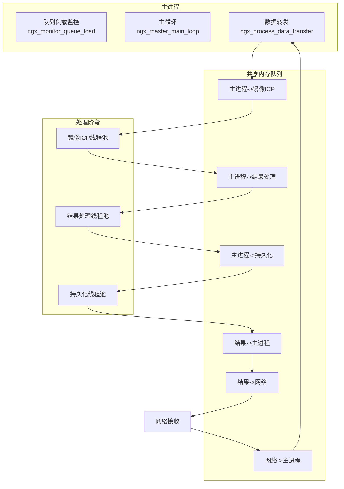
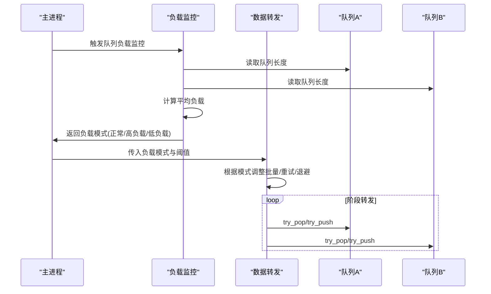
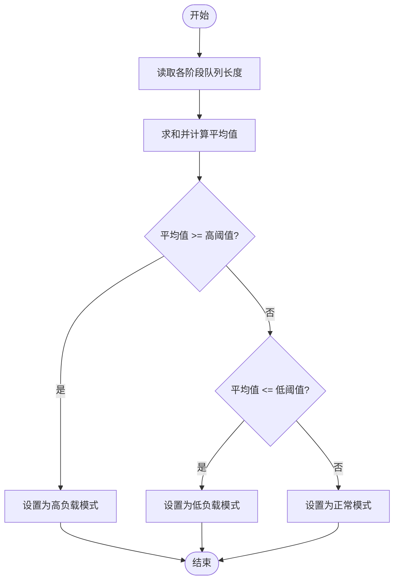
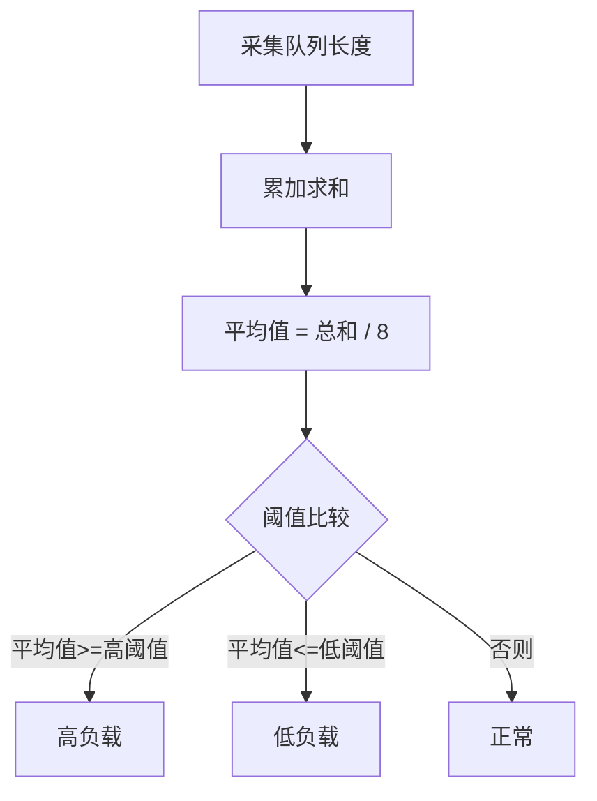
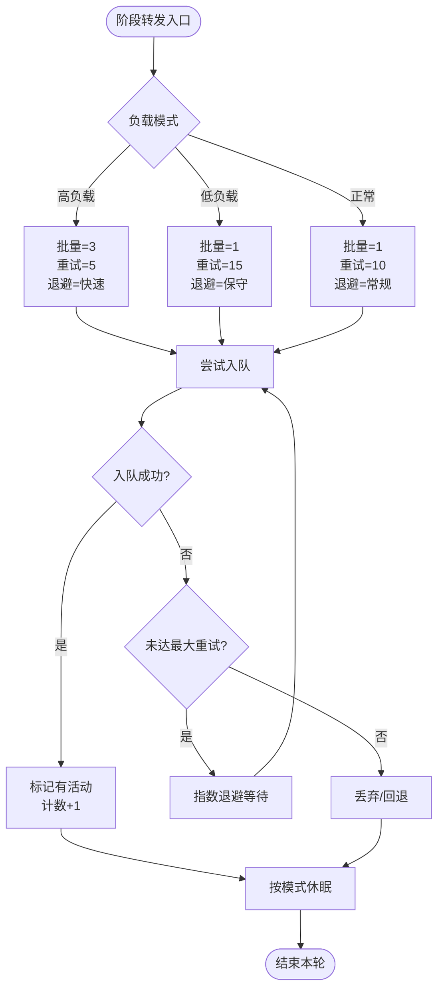
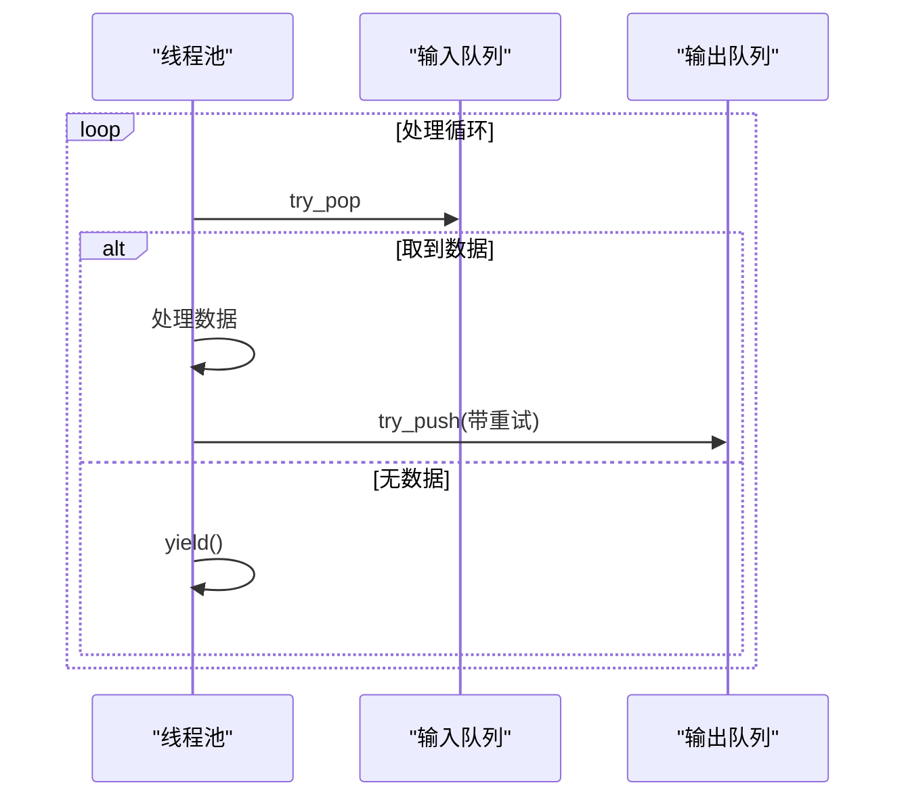
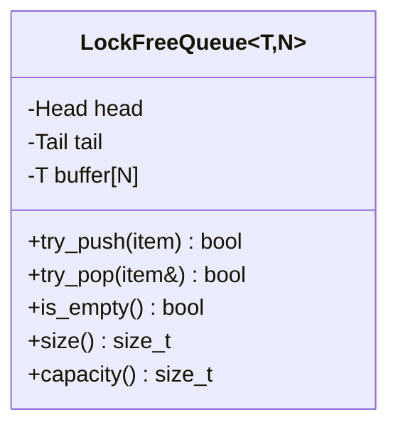

# 负载均衡机制

<cite>
**本文引用的文件**
- [ngx_process_cycle.cxx](file://proc/ngx_process_cycle.cxx)
- [ngx_shared_memory.h](file://include/ngx_shared_memory.h)
- [ngx_lockFreeQueue.h](file://include/ngx_lockFreeQueue.h)
- [ngx_lockfree_threadPool.h](file://include/ngx_lockfree_threadPool.h)
- [ngx_lockfree_mirrorICP_threadPool.cxx](file://misc/ngx_lockfree_mirrorICP_threadPool.cxx)
- [ngx_lockfree_asymCal_threadPool.cxx](file://misc/ngx_lockfree_asymCal_threadPool.cxx)
- [ngx_lockfree_persistPool.cxx](file://misc/ngx_lockfree_persistPool.cxx)
- [ngx_global.h](file://include/ngx_global.h)
</cite>

## 目录
1. [简介](#简介)
2. [项目结构](#项目结构)
3. [核心组件](#核心组件)
4. [架构总览](#架构总览)
5. [详细组件分析](#详细组件分析)
6. [依赖关系分析](#依赖关系分析)
7. [性能考量](#性能考量)
8. [故障排查指南](#故障排查指南)
9. [结论](#结论)
10. [附录](#附录)

## 简介
本文围绕 PointServer 的“基于队列负载的智能负载均衡”机制展开，系统性阐述：
- 三种负载模式（正常、高负载、低负载）的设计原理与切换条件
- 队列负载监控（队列长度统计、平均负载计算、阈值设定）
- 动态负载均衡策略（批量处理大小、重试次数、延迟退避）
- 对系统性能的影响（CPU 利用率、内存使用、响应时间）
- 负载均衡流程图与性能对比图
- 参数调优、性能监控与故障诊断实践

## 项目结构
PointServer 采用“主进程 + 多阶段流水线 + 无锁共享内存队列”的架构：
- 主进程负责队列负载监控与跨阶段数据转发
- 多个处理阶段（镜像/ICP、结果处理、持久化、网络）通过无锁队列串联
- 各阶段配套线程池执行具体计算任务

**图表来源**
- [ngx_process_cycle.cxx](file://proc/ngx_process_cycle.cxx#L401-L545)
- [ngx_shared_memory.h](file://include/ngx_shared_memory.h#L65-L84)
- [ngx_lockfree_threadPool.h](file://include/ngx_lockfree_threadPool.h#L80-L136)

**章节来源**
- [ngx_process_cycle.cxx](file://proc/ngx_process_cycle.cxx#L401-L545)
- [ngx_shared_memory.h](file://include/ngx_shared_memory.h#L22-L84)

## 核心组件
- 无锁队列：基于环形数组与原子指针，避免伪共享，提供 O(1) 入队/出队
- 共享内存队列：在多进程间共享，承载流水线各阶段数据
- 主进程负载均衡：周期性统计队列长度，计算平均负载，切换负载模式
- 动态转发策略：根据负载模式调整批量大小、重试次数与退避策略
- 线程池：各阶段独立线程池执行计算任务，与队列解耦

**章节来源**
- [ngx_lockFreeQueue.h](file://include/ngx_lockFreeQueue.h#L1-L150)
- [ngx_shared_memory.h](file://include/ngx_shared_memory.h#L22-L84)
- [ngx_process_cycle.cxx](file://proc/ngx_process_cycle.cxx#L401-L545)
- [ngx_lockfree_threadPool.h](file://include/ngx_lockfree_threadPool.h#L17-L77)

## 架构总览
主进程每 2 秒监控一次队列负载，计算总体负载与平均值，依据阈值切换负载模式；随后根据模式调整批量大小、重试次数与退避策略，驱动数据在各阶段队列间高效流转。

**图表来源**
- [ngx_process_cycle.cxx](file://proc/ngx_process_cycle.cxx#L401-L545)
- [ngx_process_cycle.cxx](file://proc/ngx_process_cycle.cxx#L716-L860)

## 详细组件分析

### 负载模式与切换条件
- 正常模式：平均队列长度在低阈值以上、高阈值以下
- 高负载模式：平均队列长度达到高阈值及以上
- 低负载模式：平均队列长度低于低阈值
- 切换条件：周期性监控（默认 2 秒），比较平均负载与阈值

**图表来源**
- [ngx_process_cycle.cxx](file://proc/ngx_process_cycle.cxx#L401-L464)

**章节来源**
- [ngx_process_cycle.cxx](file://proc/ngx_process_cycle.cxx#L401-L464)

### 队列负载监控与阈值
- 队列长度统计：遍历网络、镜像ICP、结果、持久化、返回主进程、返回网络等队列
- 平均负载：总长度除以队列数量（8 个队列）
- 阈值设定：高阈值 75% 容量，低阈值 25% 容量（QUEUE_SIZE=32）

**图表来源**
- [ngx_process_cycle.cxx](file://proc/ngx_process_cycle.cxx#L401-L464)
- [ngx_shared_memory.h](file://include/ngx_shared_memory.h#L22)

**章节来源**
- [ngx_process_cycle.cxx](file://proc/ngx_process_cycle.cxx#L401-L464)
- [ngx_shared_memory.h](file://include/ngx_shared_memory.h#L22)

### 动态负载均衡策略
- 批量处理大小：高负载 3、正常/低负载 1
- 重试次数：高负载 5、正常 10、低负载 15
- 退避策略：指数退避，延迟 = base_delay × 2^(retry_count / 3)，每三次重试翻倍
- 休眠策略：高负载（活动/空闲）500/2000μs；低负载（活动/空闲）2000/10000μs；正常（活动/空闲）1000/5000μs

**图表来源**
- [ngx_process_cycle.cxx](file://proc/ngx_process_cycle.cxx#L716-L860)
- [ngx_process_cycle.cxx](file://proc/ngx_process_cycle.cxx#L521-L542)

**章节来源**
- [ngx_process_cycle.cxx](file://proc/ngx_process_cycle.cxx#L716-L860)
- [ngx_process_cycle.cxx](file://proc/ngx_process_cycle.cxx#L521-L542)

### 阶段内线程池与批处理
- 镜像/ICP 阶段：线程池从输入队列取数据，处理后放入输出队列
- 结果处理阶段：对镜像ICP结果进行不对称度计算，采用批处理（每批 1000 点），并多次重试入队
- 持久化阶段：从结果队列取数据，写入文件并更新数据库，事务保障一致性

**图表来源**
- [ngx_lockfree_threadPool.h](file://include/ngx_lockfree_threadPool.h#L80-L136)
- [ngx_lockfree_mirrorICP_threadPool.cxx](file://misc/ngx_lockfree_mirrorICP_threadPool.cxx#L14-L33)
- [ngx_lockfree_asymCal_threadPool.cxx](file://misc/ngx_lockfree_asymCal_threadPool.cxx#L22-L40)
- [ngx_lockfree_persistPool.cxx](file://misc/ngx_lockfree_persistPool.cxx#L17-L31)

**章节来源**
- [ngx_lockfree_threadPool.h](file://include/ngx_lockfree_threadPool.h#L80-L136)
- [ngx_lockfree_mirrorICP_threadPool.cxx](file://misc/ngx_lockfree_mirrorICP_threadPool.cxx#L14-L33)
- [ngx_lockfree_asymCal_threadPool.cxx](file://misc/ngx_lockfree_asymCal_threadPool.cxx#L22-L40)
- [ngx_lockfree_persistPool.cxx](file://misc/ngx_lockfree_persistPool.cxx#L17-L31)

### 无锁队列与内存序
- 环形数组 + 原子 head/tail 指针，避免伪共享（缓存行对齐）
- 入队/出队使用 compare-and-swap（CAS）与 acquire/release 内存序保证可见性
- 队列容量为 N-1，size() 支持 O(1) 查询

**图表来源**
- [ngx_lockFreeQueue.h](file://include/ngx_lockFreeQueue.h#L4-L150)

**章节来源**
- [ngx_lockFreeQueue.h](file://include/ngx_lockFreeQueue.h#L1-L150)

## 依赖关系分析
- 主进程依赖共享内存队列类型别名与队列实例
- 各阶段线程池依赖对应的输入/输出队列模板实例
- 负载均衡策略贯穿主进程与各阶段，形成闭环反馈

**图表来源**
- [ngx_shared_memory.h](file://include/ngx_shared_memory.h#L65-L84)
- [ngx_process_cycle.cxx](file://proc/ngx_process_cycle.cxx#L716-L860)
- [ngx_lockfree_threadPool.h](file://include/ngx_lockfree_threadPool.h#L80-L136)

**章节来源**
- [ngx_shared_memory.h](file://include/ngx_shared_memory.h#L65-L84)
- [ngx_process_cycle.cxx](file://proc/ngx_process_cycle.cxx#L716-L860)
- [ngx_lockfree_threadPool.h](file://include/ngx_lockfree_threadPool.h#L80-L136)

## 性能考量
- CPU 利用率优化
  - 高负载模式降低休眠时间，提高吞吐
  - 低负载模式延长休眠，降低空转占用
- 内存使用效率
  - 无锁队列避免额外锁开销，减少上下文切换
  - 共享内存队列减少进程间拷贝
- 响应时间改善
  - 批量处理减少调度开销
  - 动态退避避免拥塞放大

[本节为通用性能讨论，无需列出具体文件来源]

## 故障排查指南
- 队列积压
  - 现象：平均负载持续高于高阈值
  - 排查：检查下游阶段处理能力（线程池规模、处理耗时）
  - 处置：增大线程数、优化算法、调整批量大小
- 队列空闲
  - 现象：平均负载持续低于低阈值
  - 排查：确认上游数据量、网络接收速率
  - 处置：适当增加批量，避免过度休眠
- 入队失败
  - 现象：多次重试后仍失败
  - 排查：目标队列是否过载、内存是否不足
  - 处置：调整阈值、扩容队列、检查持久化/网络发送端
- 退避异常
  - 现象：退避增长过快或过慢
  - 排查：base_delay 与 retry_count 指数项
  - 处置：平滑退避（当前实现已采用每三次翻倍）

**章节来源**
- [ngx_process_cycle.cxx](file://proc/ngx_process_cycle.cxx#L716-L860)
- [ngx_lockfree_asymCal_threadPool.cxx](file://misc/ngx_lockfree_asymCal_threadPool.cxx#L22-L40)

## 结论
该负载均衡机制通过“周期性监控 + 动态策略 + 无锁队列 + 线程池”的组合，实现了对 CPU 利用率、内存效率与响应时间的协同优化。高负载模式强调吞吐与时效，低负载模式强调节能与稳定性，正常模式提供平衡。建议结合实际流量与硬件资源，持续调优阈值、批量与退避参数，以获得最佳性能表现。

[本节为总结性内容，无需列出具体文件来源]

## 附录

### 参数调优建议
- 队列阈值
  - 高阈值：建议 75% 容量（QUEUE_SIZE 的 3/4）
  - 低阈值：建议 25% 容量（QUEUE_SIZE 的 1/4）
- 批量大小
  - 高负载：3
  - 正常：1
  - 低负载：1（可适度放宽，视资源而定）
- 重试次数
  - 高负载：5
  - 正常：10
  - 低负载：15
- 退避基础延迟
  - 高负载：50μs
  - 正常：100μs
  - 低负载：200μs
- 休眠策略
  - 高负载：活动 500μs，空闲 2000μs
  - 正常：活动 1000μs，空闲 5000μs
  - 低负载：活动 2000μs，空闲 10000μs

**章节来源**
- [ngx_process_cycle.cxx](file://proc/ngx_process_cycle.cxx#L716-L860)
- [ngx_process_cycle.cxx](file://proc/ngx_process_cycle.cxx#L521-L542)

### 性能监控要点
- 指标
  - 各阶段队列长度、平均负载、吞吐量、重试次数分布
- 告警
  - 平均负载长期高于高阈值或低于低阈值
  - 入队失败率异常升高
- 日志
  - 负载模式切换日志（可选）
  - 转发统计（每千次/万次）

**章节来源**
- [ngx_process_cycle.cxx](file://proc/ngx_process_cycle.cxx#L401-L464)
- [ngx_process_cycle.cxx](file://proc/ngx_process_cycle.cxx#L516-L520)