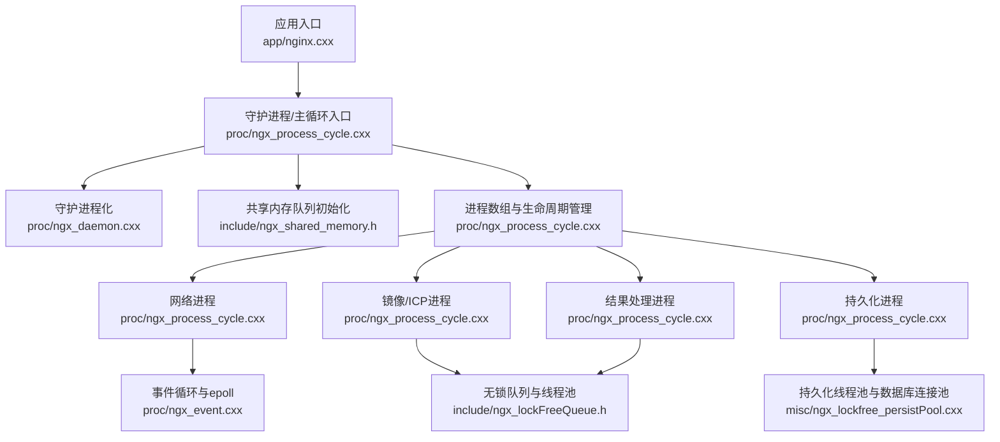
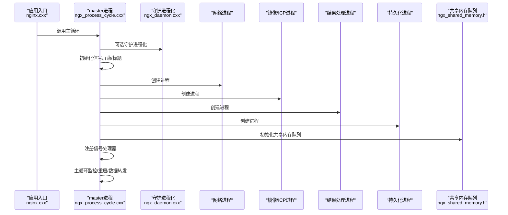
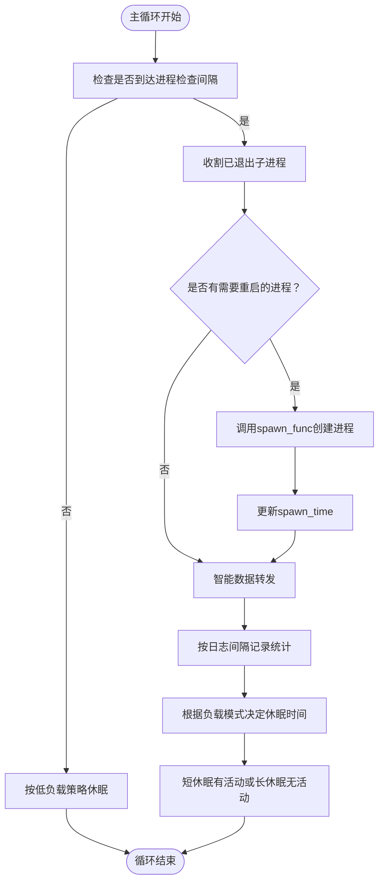
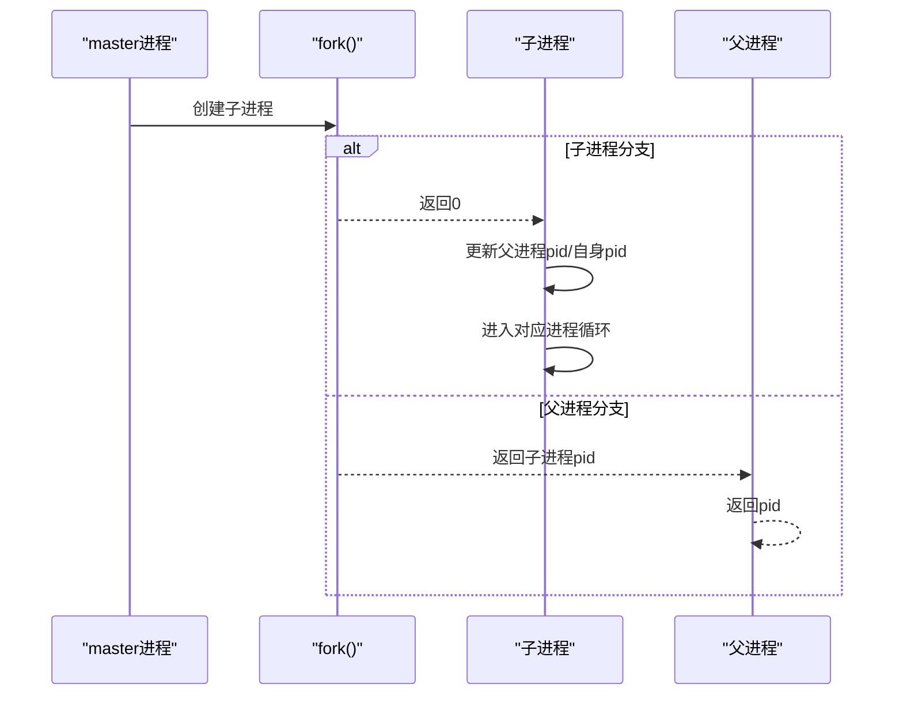
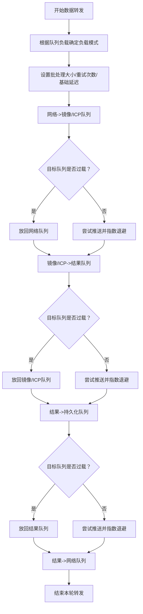
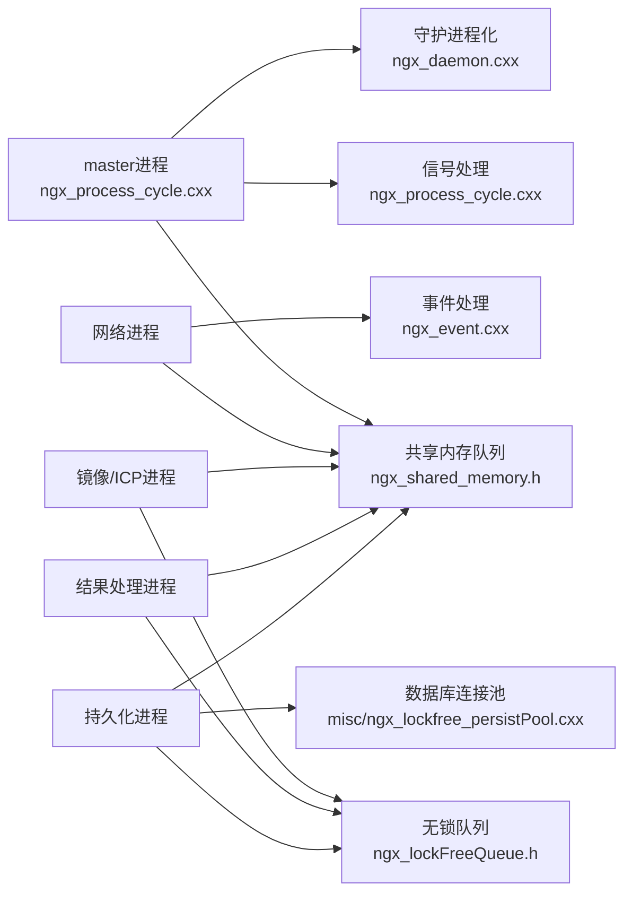

# 进程创建与管理

<cite>
**本文引用的文件列表**
- [ngx_process_cycle.cxx](file://proc/ngx_process_cycle.cxx)
- [ngx_daemon.cxx](file://proc/ngx_daemon.cxx)
- [nginx.cxx](file://app/nginx.cxx)
- [ngx_shared_memory.h](file://include/ngx_shared_memory.h)
- [ngx_lockFreeQueue.h](file://include/ngx_lockFreeQueue.h)
- [ngx_lockfree_persistPool.cxx](file://misc/ngx_lockfree_persistPool.cxx)
- [ngx_event.cxx](file://proc/ngx_event.cxx)
- [ngx_global.h](file://include/ngx_global.h)
- [ngx_macro.h](file://include/ngx_macro.h)
</cite>

## 目录
1. [简介](#简介)
2. [项目结构](#项目结构)
3. [核心组件](#核心组件)
4. [架构总览](#架构总览)
5. [详细组件分析](#详细组件分析)
6. [依赖关系分析](#依赖关系分析)
7. [性能考量](#性能考量)
8. [故障排查指南](#故障排查指南)
9. [结论](#结论)

## 简介
本文件面向 PointServer 的进程创建与管理子系统，聚焦 master 进程如何创建并管理四个核心工作进程：网络进程、镜像/ICP处理进程、结果处理进程、持久化进程。文档深入解析以下主题：
- 进程创建函数 ngx_spawn_process 的实现原理，包括进程编号分配、进程名称设置、进程创建时机控制
- 进程数组 ngx_processes 的结构设计与进程状态管理机制
- 进程生命周期管理：启动、监控、重启策略
- 进程隔离、资源分配、错误处理等技术细节
- 进程创建流程图与进程状态转换图
- 常见问题：进程创建失败、进程崩溃、进程资源泄漏的诊断与修复建议

## 项目结构
PointServer 采用 master-worker 多进程模型，核心入口在应用层，进程管理与事件循环在 proc 子系统中实现，共享内存队列在 include 子系统中定义，各工作进程内部的线程池与处理逻辑在 misc 子系统中实现。

图表来源
- [nginx.cxx](file://app/nginx.cxx#L44-L122)
- [ngx_process_cycle.cxx](file://proc/ngx_process_cycle.cxx#L360-L399)
- [ngx_daemon.cxx](file://proc/ngx_daemon.cxx#L15-L125)
- [ngx_shared_memory.h](file://include/ngx_shared_memory.h#L87-L160)
- [ngx_lockFreeQueue.h](file://include/ngx_lockFreeQueue.h#L4-L150)
- [ngx_lockfree_persistPool.cxx](file://misc/ngx_lockfree_persistPool.cxx#L12-L31)
- [ngx_event.cxx](file://proc/ngx_event.cxx#L14-L22)

章节来源
- [nginx.cxx](file://app/nginx.cxx#L44-L122)
- [ngx_process_cycle.cxx](file://proc/ngx_process_cycle.cxx#L360-L399)

## 核心组件
- master 进程：负责守护进程化、创建四个工作进程、注册信号处理器、监控子进程、管理共享内存队列、驱动主循环与数据转发
- 四个工作进程：
  - 网络进程：负责网络事件与定时器处理，基于 epoll 驱动
  - 镜像/ICP处理进程：负责点云镜像与 ICP 配准，使用无锁队列与线程池
  - 结果处理进程：负责计算不对称度等结果处理，使用无锁队列与线程池
  - 持久化进程：负责将结果持久化到文件系统与数据库，使用线程池与数据库连接池
- 共享内存队列：用于进程间解耦的数据通道，采用无锁队列实现
- 信号与进程管理：通过 SIGCHLD、SIGTERM、SIGQUIT、SIGHUP 等信号协调进程生命周期

章节来源
- [ngx_process_cycle.cxx](file://proc/ngx_process_cycle.cxx#L92-L121)
- [ngx_shared_memory.h](file://include/ngx_shared_memory.h#L87-L160)
- [ngx_lockFreeQueue.h](file://include/ngx_lockFreeQueue.h#L4-L150)
- [ngx_lockfree_persistPool.cxx](file://misc/ngx_lockfree_persistPool.cxx#L12-L31)
- [ngx_event.cxx](file://proc/ngx_event.cxx#L14-L22)

## 架构总览
master 进程在启动时：
- 初始化信号屏蔽字，设置进程标题
- 创建四个工作进程（网络、镜像/ICP、结果、持久化）
- 注册信号处理器
- 初始化共享内存队列
- 进入主循环，监控子进程状态与队列负载，进行智能数据转发与动态休眠

图表来源
- [nginx.cxx](file://app/nginx.cxx#L116-L122)
- [ngx_process_cycle.cxx](file://proc/ngx_process_cycle.cxx#L360-L399)
- [ngx_daemon.cxx](file://proc/ngx_daemon.cxx#L15-L125)
- [ngx_shared_memory.h](file://include/ngx_shared_memory.h#L87-L160)

## 详细组件分析

### 进程数组与生命周期管理
- 进程数组结构：包含 pid、status、spawn_time、respawn、name、spawn_func、proc_num 字段，用于统一管理四个工作进程
- 生命周期管理：
  - 启动：master 进程在创建子进程后记录 spawn_time
  - 监控：主循环定期收割已退出子进程，识别异常退出并标记 respawn
  - 重启：若 respawn 为真且 pid 为 -1，则调用 spawn_func 重新创建进程
  - 退出：收到终止信号后，向子进程发送 SIGTERM 并等待其优雅退出

图表来源
- [ngx_process_cycle.cxx](file://proc/ngx_process_cycle.cxx#L467-L545)
- [ngx_process_cycle.cxx](file://proc/ngx_process_cycle.cxx#L548-L577)
- [ngx_process_cycle.cxx](file://proc/ngx_process_cycle.cxx#L863-L870)

章节来源
- [ngx_process_cycle.cxx](file://proc/ngx_process_cycle.cxx#L92-L121)
- [ngx_process_cycle.cxx](file://proc/ngx_process_cycle.cxx#L467-L545)
- [ngx_process_cycle.cxx](file://proc/ngx_process_cycle.cxx#L548-L577)
- [ngx_process_cycle.cxx](file://proc/ngx_process_cycle.cxx#L863-L870)

### 进程创建函数 ngx_spawn_process
- 实现原理：
  - 使用 fork() 创建子进程
  - 子进程更新父进程 pid 与自身 pid，随后进入对应进程的循环函数
  - 父进程返回子进程 pid
- 进程编号与名称：
  - 进程编号由进程数组中的 proc_num 字段提供
  - 进程名称由进程数组中的 name 字段提供
- 创建时机：
  - 在 master 进程完成守护进程化与标题设置后，立即创建四个工作进程
  - 共享内存队列初始化在子进程创建之后进行，确保子进程可访问队列

图表来源
- [ngx_process_cycle.cxx](file://proc/ngx_process_cycle.cxx#L875-L899)

章节来源
- [ngx_process_cycle.cxx](file://proc/ngx_process_cycle.cxx#L875-L899)

### 四个工作进程的职责与实现要点
- 网络进程
  - 职责：网络事件与定时器处理，基于 epoll 驱动
  - 初始化：设置进程类型、打开共享内存队列、初始化线程池与 socket、设置进程标题
  - 循环：调用事件处理函数，阻塞等待事件
- 镜像/ICP进程
  - 职责：点云镜像与 ICP 配准
  - 初始化：设置进程类型、打开输入/输出共享内存队列、设置进程标题
  - 循环：使用线程池处理队列中的点云数据
- 结果处理进程
  - 职责：计算不对称度等结果处理
  - 初始化：设置进程类型、打开输入/输出共享内存队列、设置进程标题
  - 循环：使用线程池处理队列中的中间结果
- 持久化进程
  - 职责：将结果持久化到文件系统与数据库
  - 初始化：设置进程类型、打开输入共享内存队列、设置进程标题
  - 循环：使用线程池处理队列中的结果，结合数据库连接池执行事务

章节来源
- [ngx_process_cycle.cxx](file://proc/ngx_process_cycle.cxx#L901-L963)
- [ngx_process_cycle.cxx](file://proc/ngx_process_cycle.cxx#L985-L1009)
- [ngx_process_cycle.cxx](file://proc/ngx_process_cycle.cxx#L1029-L1042)
- [ngx_process_cycle.cxx](file://proc/ngx_process_cycle.cxx#L1072-L1095)

### 共享内存队列与数据转发
- 共享内存队列：
  - 使用 POSIX 共享内存接口创建/打开队列，映射到进程地址空间
  - 采用无锁队列实现，支持多生产者/多消费者，避免锁竞争
- 数据转发：
  - 主循环根据队列负载与负载均衡模式，进行批量处理与指数退避
  - 支持高/低/正常三种负载模式，动态调整批处理大小与休眠时间

图表来源
- [ngx_process_cycle.cxx](file://proc/ngx_process_cycle.cxx#L717-L860)
- [ngx_shared_memory.h](file://include/ngx_shared_memory.h#L87-L160)
- [ngx_lockFreeQueue.h](file://include/ngx_lockFreeQueue.h#L4-L150)

章节来源
- [ngx_process_cycle.cxx](file://proc/ngx_process_cycle.cxx#L717-L860)
- [ngx_shared_memory.h](file://include/ngx_shared_memory.h#L87-L160)
- [ngx_lockFreeQueue.h](file://include/ngx_lockFreeQueue.h#L4-L150)

### 信号处理与优雅退出
- 信号注册：在子进程创建完成后注册 SIGCHLD、SIGTERM、SIGQUIT、SIGHUP、SIGINT
- SIGCHLD：主循环中处理，收割退出的子进程并标记 respawn
- SIGTERM/SIGQUIT/SIGINT：向所有子进程发送终止信号，等待其退出，避免僵尸进程
- SIGHUP：预留配置重载逻辑

章节来源
- [ngx_process_cycle.cxx](file://proc/ngx_process_cycle.cxx#L179-L208)
- [ngx_process_cycle.cxx](file://proc/ngx_process_cycle.cxx#L649-L714)

## 依赖关系分析
- master 进程依赖：
  - 信号与进程管理：ngx_process_cycle.cxx
  - 守护进程化：ngx_daemon.cxx
  - 共享内存队列：ngx_shared_memory.h
  - 无锁队列：ngx_lockFreeQueue.h
  - 各工作进程内部线程池与处理逻辑：misc 子系统
- 工作进程依赖：
  - 网络进程：ngx_event.cxx（epoll 事件处理）
  - 镜像/ICP与结果进程：无锁队列与线程池
  - 持久化进程：数据库连接池与文件系统操作

图表来源
- [ngx_process_cycle.cxx](file://proc/ngx_process_cycle.cxx#L360-L399)
- [ngx_shared_memory.h](file://include/ngx_shared_memory.h#L87-L160)
- [ngx_lockFreeQueue.h](file://include/ngx_lockFreeQueue.h#L4-L150)
- [ngx_event.cxx](file://proc/ngx_event.cxx#L14-L22)
- [ngx_lockfree_persistPool.cxx](file://misc/ngx_lockfree_persistPool.cxx#L12-L31)

章节来源
- [ngx_process_cycle.cxx](file://proc/ngx_process_cycle.cxx#L360-L399)
- [ngx_shared_memory.h](file://include/ngx_shared_memory.h#L87-L160)
- [ngx_lockFreeQueue.h](file://include/ngx_lockFreeQueue.h#L4-L150)
- [ngx_event.cxx](file://proc/ngx_event.cxx#L14-L22)
- [ngx_lockfree_persistPool.cxx](file://misc/ngx_lockfree_persistPool.cxx#L12-L31)

## 性能考量
- 无锁队列：通过原子 CAS 与缓存行对齐避免伪共享，降低锁竞争，提升吞吐量
- 动态负载均衡：根据队列平均长度切换高/低/正常负载模式，动态调整批处理大小与休眠时间
- 指数退避：在队列过载时采用指数退避策略，避免过度竞争与资源浪费
- 事件驱动：网络进程使用 epoll 驱动，无事件时阻塞等待，节能高效

章节来源
- [ngx_lockFreeQueue.h](file://include/ngx_lockFreeQueue.h#L4-L150)
- [ngx_process_cycle.cxx](file://proc/ngx_process_cycle.cxx#L401-L464)
- [ngx_process_cycle.cxx](file://proc/ngx_process_cycle.cxx#L717-L860)
- [ngx_event.cxx](file://proc/ngx_event.cxx#L14-L22)

## 故障排查指南
- 进程创建失败
  - 症状：fork() 返回 -1，日志记录错误
  - 排查：检查系统资源限制（进程数、文件描述符）、权限与 errno
  - 修复：释放资源后返回，避免父进程继续执行
- 子进程异常退出
  - 症状：waitpid() 返回子进程 pid，记录退出状态
  - 排查：检查 WIFEXITED/WEXITSTATUS 判断是否正常退出
  - 修复：标记 respawn=1，主循环在下次检查时重启进程
- 僵尸进程
  - 症状：系统进程表被占用，无法创建新进程
  - 排查：确认父进程是否调用 waitpid() 清理子进程
  - 修复：确保主循环中定期收割子进程
- 队列过载
  - 症状：目标队列 size 达到阈值，数据回退
  - 排查：检查负载模式与批处理大小
  - 修复：降低批处理大小或增加目标进程线程数
- 资源泄漏
  - 症状：内存/文件描述符增长
  - 排查：确认共享内存队列的 destroy_shm_queue 调用与连接池释放
  - 修复：在进程退出时显式调用析构与清理

章节来源
- [ngx_process_cycle.cxx](file://proc/ngx_process_cycle.cxx#L548-L577)
- [ngx_process_cycle.cxx](file://proc/ngx_process_cycle.cxx#L875-L899)
- [ngx_shared_memory.h](file://include/ngx_shared_memory.h#L167-L179)
- [ngx_lockfree_persistPool.cxx](file://misc/ngx_lockfree_persistPool.cxx#L135-L146)

## 结论
PointServer 的进程管理以 master-worker 模型为核心，通过进程数组与信号机制实现稳定的生命周期管理，辅以共享内存队列与无锁队列实现高效的跨进程数据流转。master 进程在启动阶段完成守护进程化、进程创建与共享内存初始化，随后进入主循环，依据队列负载动态调整处理策略，实现高吞吐与低延迟的协同处理。针对常见问题，文档提供了明确的诊断思路与修复建议，有助于保障系统的稳定性与可维护性。