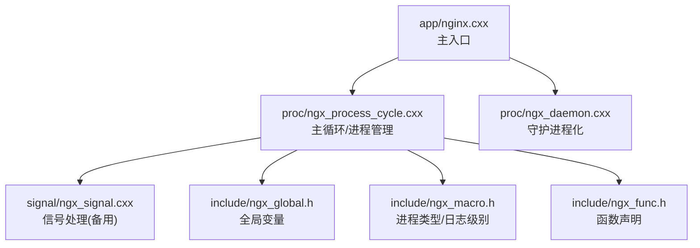
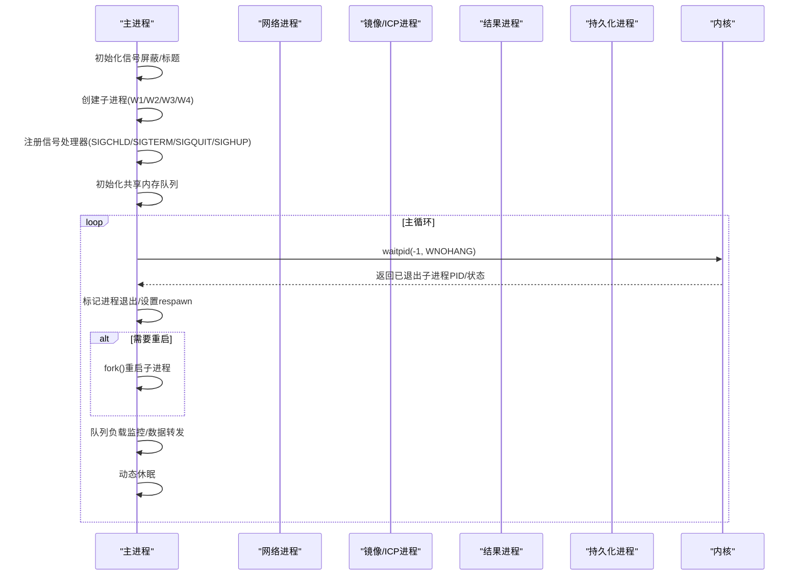
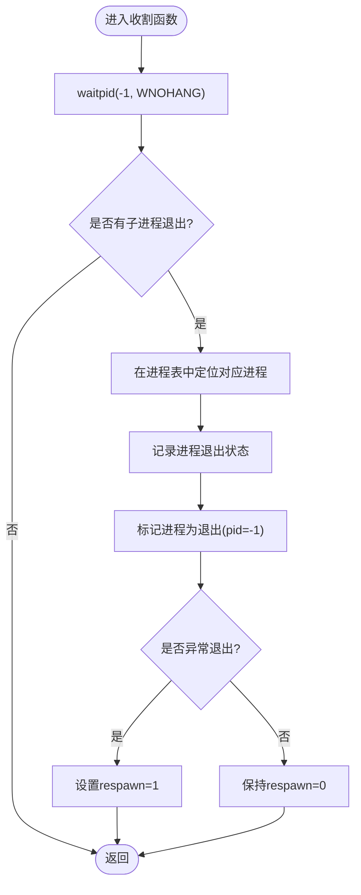
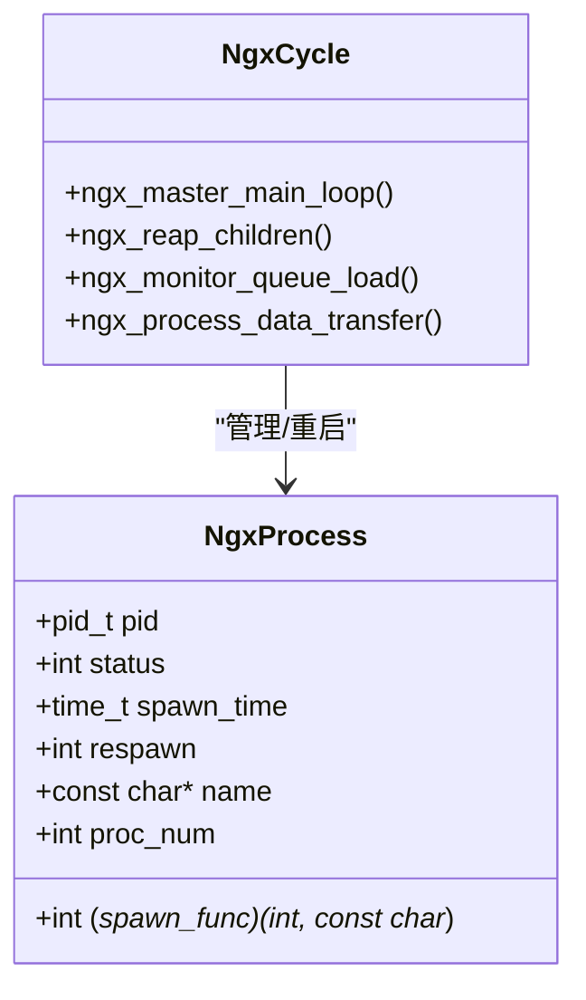
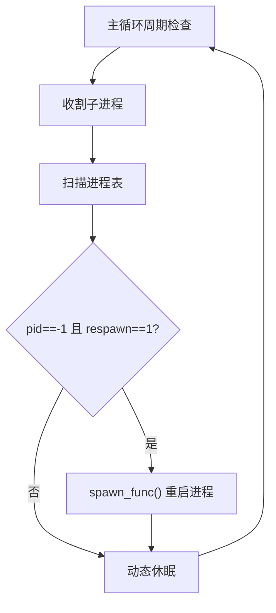
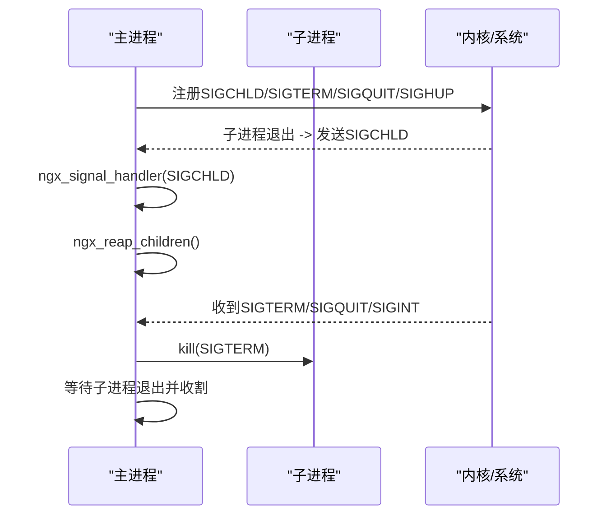
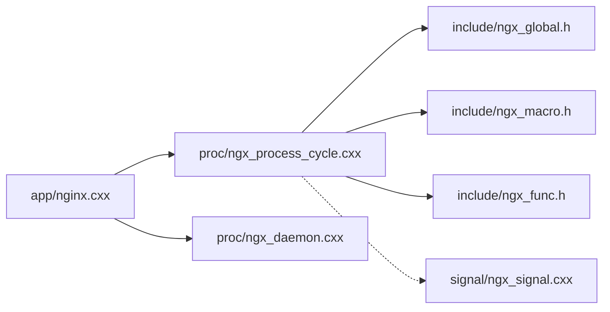

# 进程监控与恢复

<cite>
**本文档引用的文件**
- [proc/ngx_process_cycle.cxx](file://proc/ngx_process_cycle.cxx)
- [proc/ngx_daemon.cxx](file://proc/ngx_daemon.cxx)
- [signal/ngx_signal.cxx](file://signal/ngx_signal.cxx)
- [app/nginx.cxx](file://app/nginx.cxx)
- [include/ngx_global.h](file://include/ngx_global.h)
- [include/ngx_macro.h](file://include/ngx_macro.h)
- [include/ngx_func.h](file://include/ngx_func.h)
</cite>

## 目录
1. [简介](#简介)
2. [项目结构](#项目结构)
3. [核心组件](#核心组件)
4. [架构总览](#架构总览)
5. [详细组件分析](#详细组件分析)
6. [依赖关系分析](#依赖关系分析)
7. [性能考量](#性能考量)
8. [故障排查指南](#故障排查指南)
9. [结论](#结论)

## 简介
本文件面向 PointServer 的进程监控与恢复功能，系统性阐述以下主题：
- 进程状态监控机制：子进程退出检测、进程状态收集、异常情况识别
- 进程收割机制 ngx_reap_children 的实现原理：waitpid 系统调用使用、进程退出状态解析、僵尸进程清理
- 进程自动重启策略：重启条件判断、重启时机选择、重启次数限制
- 信号处理机制：SIGCHLD、SIGTERM、SIGQUIT、SIGHUP 等信号的处理逻辑
- 进程监控流程图与故障恢复流程图
- 进程监控指标、告警机制、故障诊断等运维指导
- 针对进程异常退出、重启风暴、资源泄漏等问题的解决方案

## 项目结构
PointServer 采用 Master-Worker 多进程模型，主进程负责进程生命周期管理与队列调度，各 Worker 进程负责具体业务处理。关键文件分布如下：
- 主进程与进程管理：proc/ngx_process_cycle.cxx
- 守护进程化：proc/ngx_daemon.cxx
- 信号处理（备用方案）：signal/ngx_signal.cxx
- 程序入口与全局变量：app/nginx.cxx
- 全局与宏定义：include/ngx_global.h、include/ngx_macro.h、include/ngx_func.h

图表来源
- [app/nginx.cxx](file://app/nginx.cxx#L44-L122)
- [proc/ngx_process_cycle.cxx](file://proc/ngx_process_cycle.cxx#L360-L399)
- [proc/ngx_daemon.cxx](file://proc/ngx_daemon.cxx#L15-L125)
- [signal/ngx_signal.cxx](file://signal/ngx_signal.cxx#L45-L87)
- [include/ngx_global.h](file://include/ngx_global.h#L37-L42)
- [include/ngx_macro.h](file://include/ngx_macro.h#L32-L36)
- [include/ngx_func.h](file://include/ngx_func.h#L21-L26)

章节来源
- [app/nginx.cxx](file://app/nginx.cxx#L44-L122)
- [proc/ngx_process_cycle.cxx](file://proc/ngx_process_cycle.cxx#L360-L399)

## 核心组件
- 主进程循环与进程管理：负责创建子进程、周期性收割退出子进程、按需重启、队列负载监控与数据转发
- 子进程类型：网络处理、镜像/ICP、结果处理、持久化
- 信号处理：主进程注册 SIGCHLD/SIGTERM/SIGQUIT/SIGHUP；备用信号处理模块
- 守护进程化：fork + setsid + 重定向标准 IO，脱离终端
- 全局状态：进程类型、进程 PID、是否需要收割等

章节来源
- [proc/ngx_process_cycle.cxx](file://proc/ngx_process_cycle.cxx#L88-L121)
- [proc/ngx_process_cycle.cxx](file://proc/ngx_process_cycle.cxx#L178-L208)
- [proc/ngx_daemon.cxx](file://proc/ngx_daemon.cxx#L15-L125)
- [include/ngx_global.h](file://include/ngx_global.h#L37-L42)

## 架构总览
主进程在启动后：
- 初始化信号屏蔽与标题
- 创建子进程（网络、镜像/ICP、结果、持久化）
- 注册信号处理器
- 初始化共享内存队列
- 进入主循环：周期性收割子进程、按需重启、队列负载监控、数据转发、动态休眠

图表来源
- [proc/ngx_process_cycle.cxx](file://proc/ngx_process_cycle.cxx#L360-L399)
- [proc/ngx_process_cycle.cxx](file://proc/ngx_process_cycle.cxx#L467-L545)
- [proc/ngx_process_cycle.cxx](file://proc/ngx_process_cycle.cxx#L548-L577)

## 详细组件分析

### 进程状态监控机制
- 子进程退出检测：主循环定期调用收割函数，使用非阻塞 waitpid 检测已退出子进程
- 进程状态收集：通过 waitpid 返回的 status 字段解析退出码与终止信号
- 异常情况识别：非正常退出（非 0 退出码或被信号终止）标记为需要重启

图表来源
- [proc/ngx_process_cycle.cxx](file://proc/ngx_process_cycle.cxx#L548-L577)

章节来源
- [proc/ngx_process_cycle.cxx](file://proc/ngx_process_cycle.cxx#L495-L508)
- [proc/ngx_process_cycle.cxx](file://proc/ngx_process_cycle.cxx#L548-L577)

### 进程收割机制 ngx_reap_children 实现原理
- waitpid 使用：非阻塞模式检测子进程退出，避免阻塞主循环
- 退出状态解析：区分正常退出与异常退出，异常时设置重启标志
- 僵尸进程清理：waitpid 返回后内核释放子进程资源，彻底清除僵尸进程

图表来源
- [proc/ngx_process_cycle.cxx](file://proc/ngx_process_cycle.cxx#L92-L109)
- [proc/ngx_process_cycle.cxx](file://proc/ngx_process_cycle.cxx#L467-L545)
- [proc/ngx_process_cycle.cxx](file://proc/ngx_process_cycle.cxx#L548-L577)

章节来源
- [proc/ngx_process_cycle.cxx](file://proc/ngx_process_cycle.cxx#L548-L577)

### 进程自动重启策略
- 重启条件判断：进程非正常退出（退出码非 0 或被信号终止）
- 重启时机选择：主循环固定周期检查（默认 5 秒），避免每次循环都检查
- 重启次数限制：当前实现未显式限制重启次数，建议结合外部监控系统进行限次重启

图表来源
- [proc/ngx_process_cycle.cxx](file://proc/ngx_process_cycle.cxx#L495-L508)
- [proc/ngx_process_cycle.cxx](file://proc/ngx_process_cycle.cxx#L548-L577)

章节来源
- [proc/ngx_process_cycle.cxx](file://proc/ngx_process_cycle.cxx#L495-L508)

### 信号处理机制
- SIGCHLD：子进程状态变化，主循环中处理收割
- SIGTERM/SIGQUIT/SIGINT：优雅/强制关闭，主进程向子进程发送终止信号并等待其退出
- SIGHUP：重新加载配置（预留）

图表来源
- [proc/ngx_process_cycle.cxx](file://proc/ngx_process_cycle.cxx#L178-L208)
- [proc/ngx_process_cycle.cxx](file://proc/ngx_process_cycle.cxx#L649-L714)

章节来源
- [proc/ngx_process_cycle.cxx](file://proc/ngx_process_cycle.cxx#L178-L208)
- [proc/ngx_process_cycle.cxx](file://proc/ngx_process_cycle.cxx#L649-L714)

### 守护进程化
- fork + setsid：脱离终端，避免终端断开导致进程异常退出
- umask(0) + 重定向标准 IO 到 /dev/null：避免阻塞与终端交互
- 子进程返回 0，父进程返回 1 并退出，确保守护进程形态

章节来源
- [proc/ngx_daemon.cxx](file://proc/ngx_daemon.cxx#L15-L125)

### 子进程创建与初始化
- 子进程创建：fork 后子进程设置进程类型为 worker，初始化线程池与网络/处理模块
- 信号屏蔽：子进程初始化时解除信号屏蔽，以便接收信号

章节来源
- [proc/ngx_process_cycle.cxx](file://proc/ngx_process_cycle.cxx#L875-L899)
- [proc/ngx_process_cycle.cxx](file://proc/ngx_process_cycle.cxx#L930-L963)
- [proc/ngx_process_cycle.cxx](file://proc/ngx_process_cycle.cxx#L965-L1027)
- [proc/ngx_process_cycle.cxx](file://proc/ngx_process_cycle.cxx#L1011-L1052)
- [proc/ngx_process_cycle.cxx](file://proc/ngx_process_cycle.cxx#L1054-L1095)

## 依赖关系分析
- 主进程依赖：全局变量（进程类型、PID、收割标记）、宏定义（进程类型）、函数声明（守护进程化、主循环）
- 子进程依赖：共享内存队列、线程池、网络模块
- 信号处理：主进程注册信号处理器；备用模块提供信号数组与处理函数

图表来源
- [app/nginx.cxx](file://app/nginx.cxx#L44-L122)
- [proc/ngx_process_cycle.cxx](file://proc/ngx_process_cycle.cxx#L360-L399)
- [proc/ngx_daemon.cxx](file://proc/ngx_daemon.cxx#L15-L125)
- [include/ngx_global.h](file://include/ngx_global.h#L37-L42)
- [include/ngx_macro.h](file://include/ngx_macro.h#L32-L36)
- [include/ngx_func.h](file://include/ngx_func.h#L21-L26)
- [signal/ngx_signal.cxx](file://signal/ngx_signal.cxx#L45-L87)

章节来源
- [app/nginx.cxx](file://app/nginx.cxx#L44-L122)
- [proc/ngx_process_cycle.cxx](file://proc/ngx_process_cycle.cxx#L360-L399)

## 性能考量
- 非阻塞收割：waitpid 使用 WNOHANG，避免阻塞主循环
- 周期性检查：主循环固定周期（默认 5 秒）检查进程状态，降低检查频率
- 动态休眠：根据队列负载模式调整休眠时间，高负载时缩短休眠，低负载时延长休眠
- 指数退避：数据转发时采用指数退避策略，缓解队列拥塞

章节来源
- [proc/ngx_process_cycle.cxx](file://proc/ngx_process_cycle.cxx#L495-L508)
- [proc/ngx_process_cycle.cxx](file://proc/ngx_process_cycle.cxx#L522-L542)
- [proc/ngx_process_cycle.cxx](file://proc/ngx_process_cycle.cxx#L767-L770)

## 故障排查指南
- 进程异常退出
  - 现象：日志记录子进程退出状态，若非正常退出则标记重启
  - 排查：查看退出码与终止信号，确认业务模块是否存在异常
- 重启风暴
  - 现象：子进程反复退出重启
  - 排查：检查业务模块初始化失败、共享内存队列异常、线程池创建失败等
  - 建议：在主循环中加入重启次数限制与冷却时间
- 资源泄漏
  - 现象：僵尸进程增多、进程表溢出
  - 排查：确认主进程是否正确调用收割函数，避免 waitpid 忽视
  - 建议：确保每次 SIGCHLD 到达后执行收割逻辑
- 配置重载
  - 现象：SIGHUP 信号到达
  - 排查：当前实现为预留，需补充配置重载逻辑

章节来源
- [proc/ngx_process_cycle.cxx](file://proc/ngx_process_cycle.cxx#L548-L577)
- [proc/ngx_process_cycle.cxx](file://proc/ngx_process_cycle.cxx#L649-L714)

## 结论
PointServer 的进程监控与恢复体系以主进程为核心，通过非阻塞收割、周期性检查、异常识别与自动重启，实现了对子进程的稳定管理。配合队列负载监控与动态休眠策略，系统在高负载与低负载场景下均能保持良好性能。建议在生产环境中增加重启次数限制、冷却时间与配置重载功能，进一步提升健壮性与可观测性。