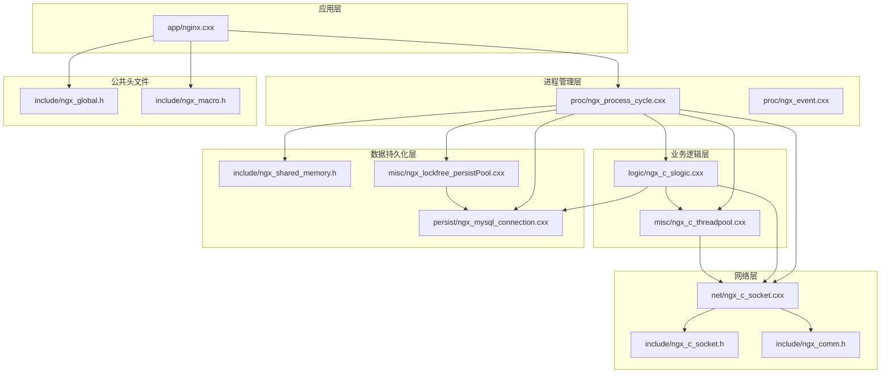
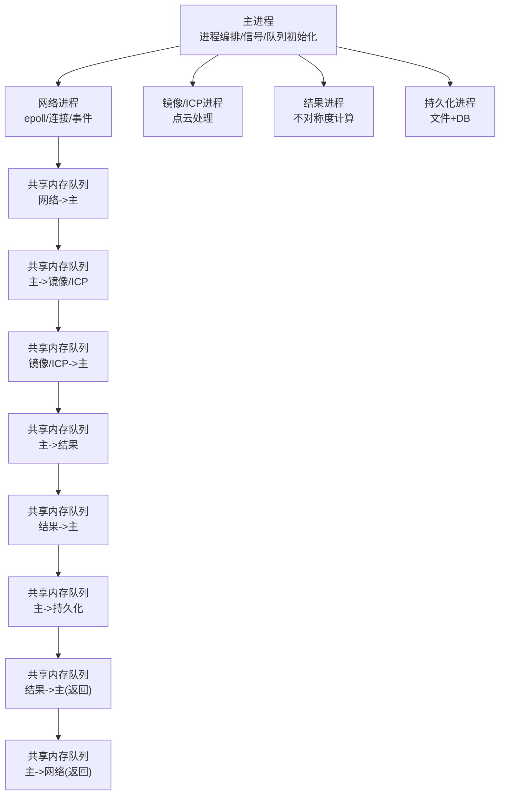
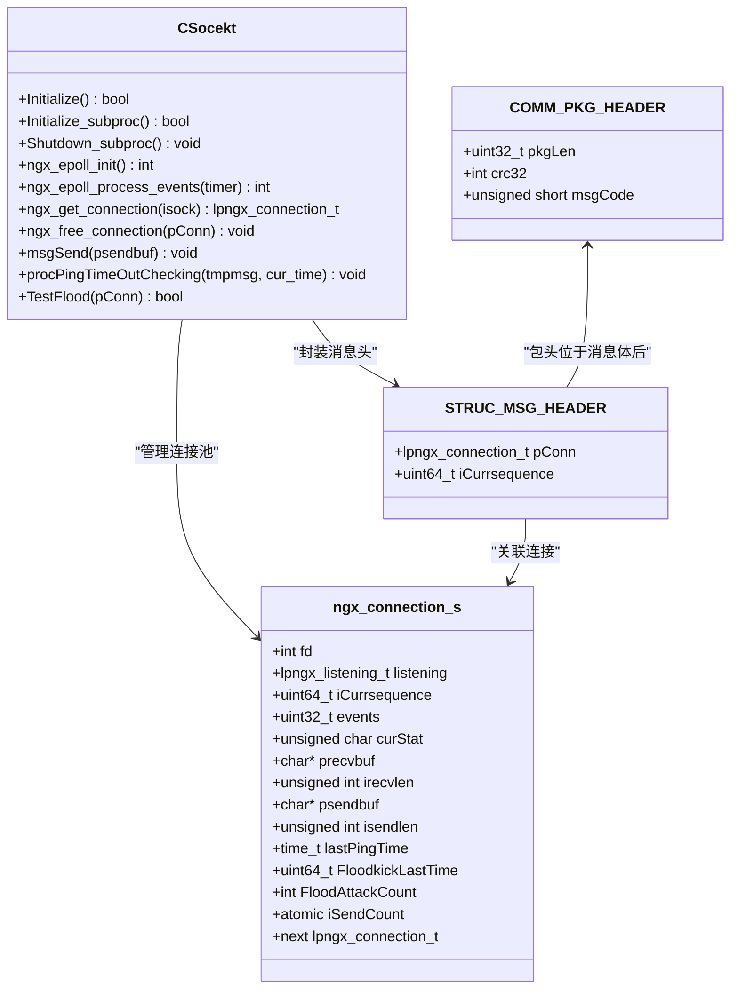
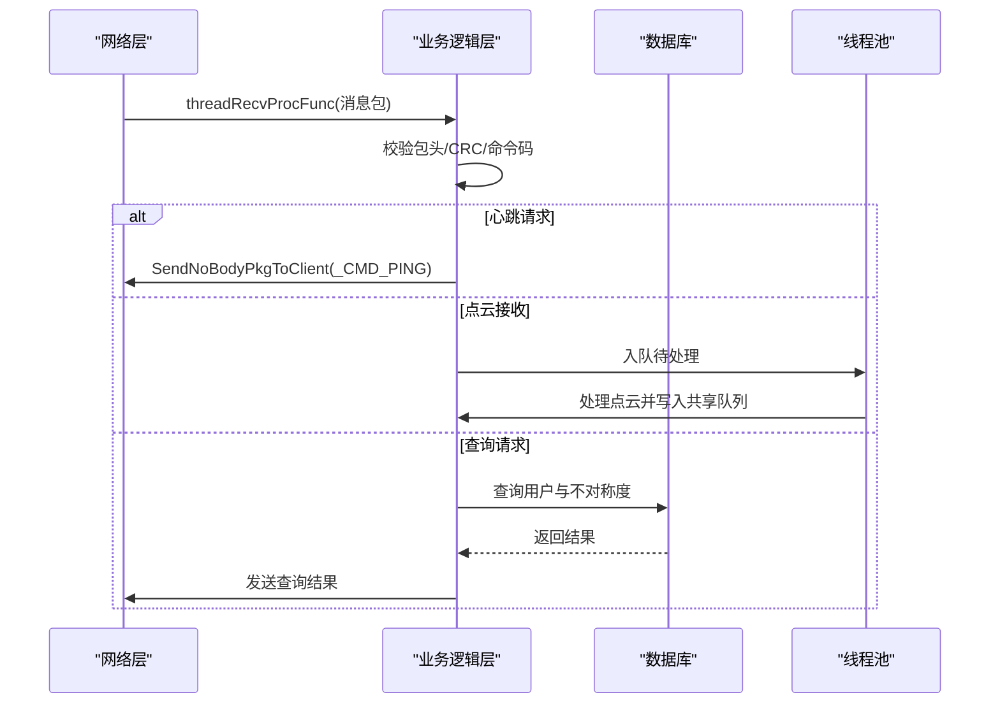
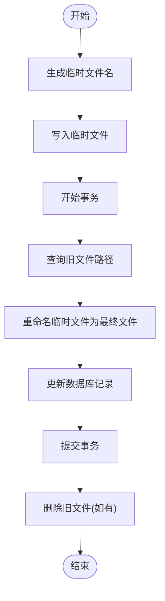
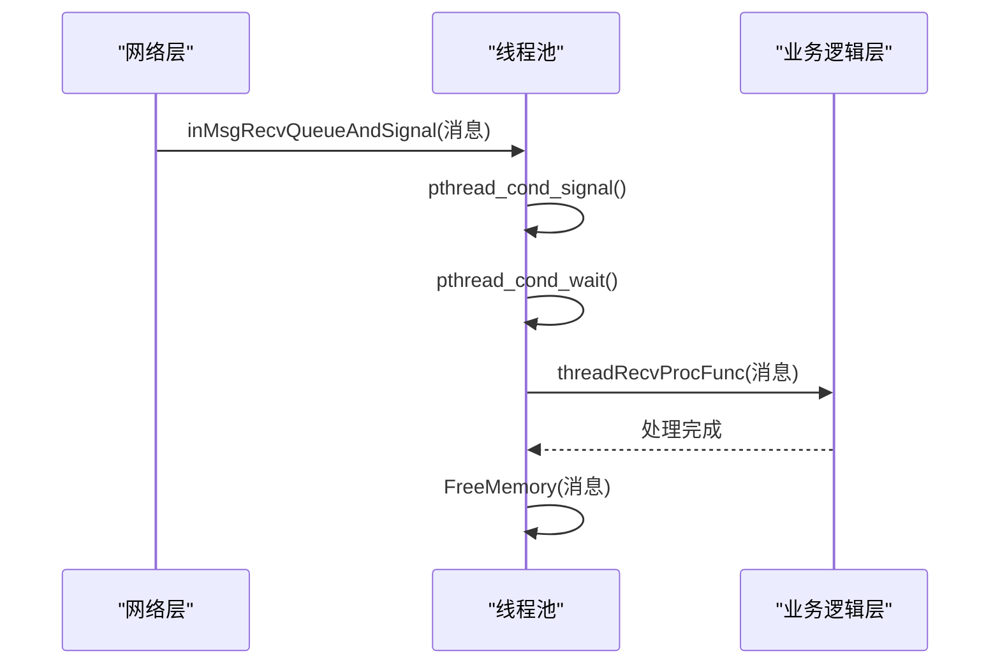
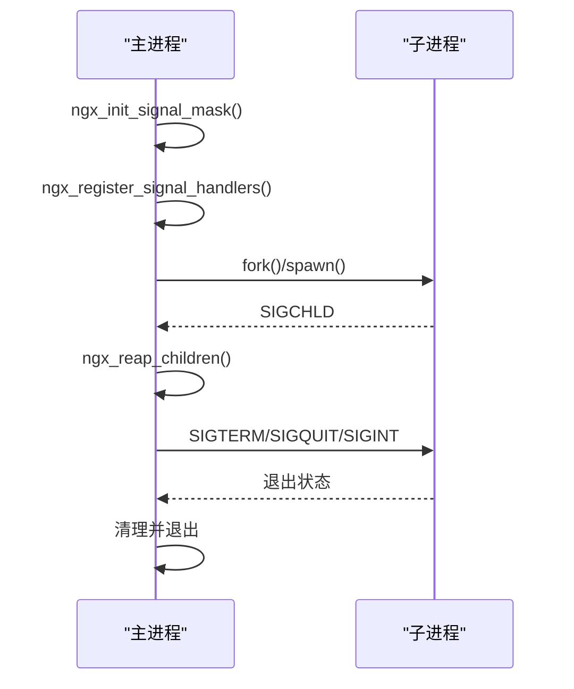
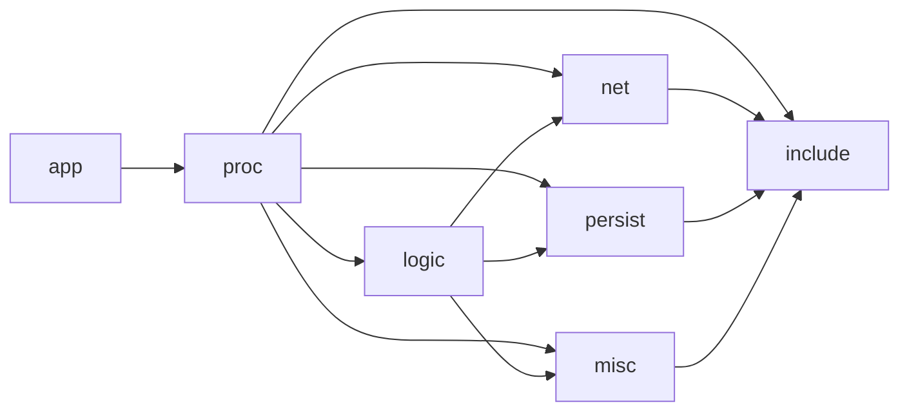

# 模块化设计架构

<cite>
**本文档引用的文件**
- [CMakeLists.txt](file://CMakeLists.txt)
- [nginx.cxx](file://app/nginx.cxx)
- [ngx_process_cycle.cxx](file://proc/ngx_process_cycle.cxx)
- [ngx_event.cxx](file://proc/ngx_event.cxx)
- [ngx_c_socket.cxx](file://net/ngx_c_socket.cxx)
- [ngx_c_socket.h](file://include/ngx_c_socket.h)
- [ngx_comm.h](file://include/ngx_comm.h)
- [ngx_global.h](file://include/ngx_global.h)
- [ngx_macro.h](file://include/ngx_macro.h)
- [ngx_c_slogic.cxx](file://logic/ngx_c_slogic.cxx)
- [ngx_c_threadpool.cxx](file://misc/ngx_c_threadpool.cxx)
- [ngx_shared_memory.h](file://include/ngx_shared_memory.h)
- [ngx_lockfree_persistPool.cxx](file://misc/ngx_lockfree_persistPool.cxx)
- [ngx_mysql_connection.cxx](file://persist/ngx_mysql_connection.cxx)
- [nginx.conf](file://nginx.conf)
</cite>

## 目录
1. [引言](#引言)
2. [项目结构](#项目结构)
3. [核心组件](#核心组件)
4. [架构总览](#架构总览)
5. [详细组件分析](#详细组件分析)
6. [依赖关系分析](#依赖关系分析)
7. [性能考量](#性能考量)
8. [故障排查指南](#故障排查指南)
9. [结论](#结论)
10. [附录](#附录)

## 引言
本文件面向 PointServer 的模块化设计，系统性阐述其分层理念与模块边界：应用层、网络层、业务逻辑层、数据持久化层。文档重点说明模块接口定义、模块通信协议、模块生命周期管理、模块热插拔支持与配置管理，并结合共享内存队列与多进程模型，给出模块依赖关系图与模块架构图，帮助读者理解如何通过模块化实现功能的灵活组合与系统的演进式发展。

## 项目结构
项目采用 CMake 子目录组织，遵循“基础模块优先、核心模块居中、应用模块靠后”的构建顺序，体现模块化依赖的拓扑方向。模块分布如下：
- app：应用入口与主进程生命周期控制
- proc：多进程管理与共享内存队列初始化
- net：网络 I/O 与事件循环
- logic：业务逻辑处理（点云接收、查询）
- misc：线程池、Draco/PCL 点云处理、持久化线程池
- persist：MySQL 连接与连接池
- include：公共头文件（通信协议、全局变量、宏）

图表来源
- [CMakeLists.txt](file://CMakeLists.txt#L62-L68)
- [nginx.cxx](file://app/nginx.cxx#L44-L122)
- [ngx_process_cycle.cxx](file://proc/ngx_process_cycle.cxx#L360-L399)
- [ngx_c_socket.cxx](file://net/ngx_c_socket.cxx#L1-L120)
- [ngx_c_socket.h](file://include/ngx_c_socket.h#L103-L258)
- [ngx_comm.h](file://include/ngx_comm.h#L19-L31)
- [ngx_c_slogic.cxx](file://logic/ngx_c_slogic.cxx#L1-L130)
- [ngx_c_threadpool.cxx](file://misc/ngx_c_threadpool.cxx#L1-L120)
- [ngx_shared_memory.h](file://include/ngx_shared_memory.h#L87-L160)
- [ngx_lockfree_persistPool.cxx](file://misc/ngx_lockfree_persistPool.cxx#L1-L50)
- [ngx_mysql_connection.cxx](file://persist/ngx_mysql_connection.cxx#L1-L56)
- [ngx_global.h](file://include/ngx_global.h#L27-L46)
- [ngx_macro.h](file://include/ngx_macro.h#L1-L40)

章节来源
- [CMakeLists.txt](file://CMakeLists.txt#L62-L68)
- [nginx.cxx](file://app/nginx.cxx#L44-L122)

## 核心组件
- 应用入口与主进程控制：负责配置加载、守护进程模式、主进程标题设置、信号注册与进程生命周期管理。
- 多进程管理与共享内存：负责创建网络、镜像/ICP、结果、持久化等子进程，初始化共享内存队列，实现跨进程数据通道与负载均衡。
- 网络 I/O 与事件循环：基于 epoll 的高性能事件驱动网络栈，支持多端口监听、非阻塞 I/O、连接池、心跳与安全防护。
- 业务逻辑处理：解析消息包头、CRC 校验、命令路由、点云接收与查询返回。
- 线程池：消息接收线程池，将网络层解包后的消息投递到线程池并发处理。
- 数据持久化：MySQL 连接池、Draco/PCL 点云编解码、文件落盘与数据库事务一致性保障。
- 公共协议与全局：统一通信协议结构、全局变量与宏定义。

章节来源
- [nginx.cxx](file://app/nginx.cxx#L44-L122)
- [ngx_process_cycle.cxx](file://proc/ngx_process_cycle.cxx#L360-L399)
- [ngx_c_socket.cxx](file://net/ngx_c_socket.cxx#L1-L120)
- [ngx_c_slogic.cxx](file://logic/ngx_c_slogic.cxx#L1-L130)
- [ngx_c_threadpool.cxx](file://misc/ngx_c_threadpool.cxx#L1-L120)
- [ngx_shared_memory.h](file://include/ngx_shared_memory.h#L87-L160)
- [ngx_mysql_connection.cxx](file://persist/ngx_mysql_connection.cxx#L1-L56)

## 架构总览
PointServer 采用“主进程 + 多工作进程 + 共享内存队列”的分布式模块化架构。主进程负责进程编排与队列初始化，各工作进程承担不同职责（网络、镜像/ICP、结果、持久化），通过共享内存队列进行解耦通信，实现高吞吐与低耦合。

图表来源
- [ngx_process_cycle.cxx](file://proc/ngx_process_cycle.cxx#L360-L399)
- [ngx_shared_memory.h](file://include/ngx_shared_memory.h#L87-L160)

## 详细组件分析

### 网络层组件分析
- 职责：多端口监听、非阻塞 I/O、epoll 事件管理、连接池、心跳与安全策略、发送队列与线程。
- 接口要点：epoll 初始化、事件处理、连接获取与回收、消息发送、心跳检测、Flood 攻击检测。
- 通信协议：消息头 + 包头 + 包体，包头包含长度、CRC、消息码；消息头包含连接指针与序列号。
- 生命周期：父进程初始化监听，子进程初始化 epoll 与线程，退出时回收资源。

图表来源
- [ngx_c_socket.h](file://include/ngx_c_socket.h#L103-L258)
- [ngx_c_socket.cxx](file://net/ngx_c_socket.cxx#L1-L120)
- [ngx_comm.h](file://include/ngx_comm.h#L19-L31)

章节来源
- [ngx_c_socket.cxx](file://net/ngx_c_socket.cxx#L1-L120)
- [ngx_c_socket.h](file://include/ngx_c_socket.h#L103-L258)
- [ngx_comm.h](file://include/ngx_comm.h#L19-L31)

### 业务逻辑层组件分析
- 职责：消息路由、CRC 校验、心跳处理、点云接收与查询返回、与数据库交互。
- 接口要点：命令码路由表、心跳超时检测、发送无包体数据包、数据库查询与返回。
- 生命周期：继承网络层，复用网络层的连接与发送机制。

图表来源
- [ngx_c_slogic.cxx](file://logic/ngx_c_slogic.cxx#L77-L129)
- [ngx_c_slogic.cxx](file://logic/ngx_c_slogic.cxx#L176-L189)
- [ngx_c_slogic.cxx](file://logic/ngx_c_slogic.cxx#L190-L243)
- [ngx_c_slogic.cxx](file://logic/ngx_c_slogic.cxx#L275-L340)

章节来源
- [ngx_c_slogic.cxx](file://logic/ngx_c_slogic.cxx#L77-L129)
- [ngx_c_slogic.cxx](file://logic/ngx_c_slogic.cxx#L176-L189)
- [ngx_c_slogic.cxx](file://logic/ngx_c_slogic.cxx#L190-L243)
- [ngx_c_slogic.cxx](file://logic/ngx_c_slogic.cxx#L275-L340)

### 数据持久化层组件分析
- 职责：Draco/PCL 点云编解码、文件落盘、MySQL 事务一致性、持久化线程池。
- 接口要点：点云压缩/解压、PCD/DRC 转换、文件重命名与事务提交、异常回滚。
- 生命周期：线程池从共享队列取任务，处理后写入返回队列。

图表来源
- [ngx_lockfree_persistPool.cxx](file://misc/ngx_lockfree_persistPool.cxx#L52-L146)

章节来源
- [ngx_lockfree_persistPool.cxx](file://misc/ngx_lockfree_persistPool.cxx#L1-L158)
- [ngx_mysql_connection.cxx](file://persist/ngx_mysql_connection.cxx#L1-L56)

### 线程池与事件循环
- 职责：消息接收线程池、网络事件循环、进程间信号与条件变量协调。
- 接口要点：创建线程、入队与唤醒、停止与回收、队列统计与告警。
- 生命周期：初始化创建线程，等待条件变量，处理消息后释放内存，优雅退出。

图表来源
- [ngx_c_threadpool.cxx](file://misc/ngx_c_threadpool.cxx#L269-L291)
- [ngx_c_threadpool.cxx](file://misc/ngx_c_threadpool.cxx#L124-L187)

章节来源
- [ngx_c_threadpool.cxx](file://misc/ngx_c_threadpool.cxx#L1-L321)
- [ngx_event.cxx](file://proc/ngx_event.cxx#L14-L22)

### 进程生命周期与信号管理
- 职责：主进程初始化信号屏蔽与标题，注册信号处理器，创建子进程，收割僵尸进程，优雅关闭。
- 接口要点：信号屏蔽、SIGCHLD/SIGTERM/SIGQUIT/SIGHUP 处理，waitpid 清理僵尸进程。

图表来源
- [ngx_process_cycle.cxx](file://proc/ngx_process_cycle.cxx#L124-L208)
- [ngx_process_cycle.cxx](file://proc/ngx_process_cycle.cxx#L548-L577)
- [ngx_process_cycle.cxx](file://proc/ngx_process_cycle.cxx#L649-L714)

章节来源
- [ngx_process_cycle.cxx](file://proc/ngx_process_cycle.cxx#L124-L208)
- [ngx_process_cycle.cxx](file://proc/ngx_process_cycle.cxx#L548-L577)
- [ngx_process_cycle.cxx](file://proc/ngx_process_cycle.cxx#L649-L714)

## 依赖关系分析
- 构建依赖：CMake 子目录顺序体现模块依赖拓扑，logic 依赖 net，persist 依赖 logic，misc/persist 依赖 logic，app 依赖所有模块。
- 运行时依赖：网络层依赖公共头文件与全局变量；业务逻辑层依赖网络层与线程池；持久化层依赖数据库与共享内存队列。
- 耦合度控制：通过共享内存队列解耦进程间通信；通过接口抽象（epoll、线程池、连接池）降低模块耦合；通过配置文件集中管理运行参数。

图表来源
- [CMakeLists.txt](file://CMakeLists.txt#L62-L68)

章节来源
- [CMakeLists.txt](file://CMakeLists.txt#L62-L68)

## 性能考量
- I/O 与事件：epoll 高效事件驱动，非阻塞 I/O 与连接池减少系统调用与上下文切换。
- 并发：线程池按需扩展，条件变量唤醒与信号量协同，避免忙等与惊群。
- 跨进程：共享内存队列采用无锁环形队列，批量处理与指数退避策略降低竞争。
- 资源：进程级隔离提升稳定性，守护进程模式与信号处理保障优雅关闭。

## 故障排查指南
- 日志级别：通过配置文件 LogLevel 控制日志输出等级，便于定位问题。
- 进程状态：关注 SIGCHLD 与 waitpid 输出，确认子进程退出码与异常信号。
- 队列负载：监控共享内存队列长度，识别瓶颈与过载，调整负载均衡模式。
- 网络安全：Flood 攻击检测与踢人策略可缓解恶意连接，必要时调整阈值。
- 数据一致性：持久化失败时检查事务回滚与临时文件清理，确保数据一致性。

章节来源
- [nginx.conf](file://nginx.conf#L11-L18)
- [ngx_process_cycle.cxx](file://proc/ngx_process_cycle.cxx#L402-L464)
- [ngx_c_socket.cxx](file://net/ngx_c_socket.cxx#L480-L509)
- [ngx_lockfree_persistPool.cxx](file://misc/ngx_lockfree_persistPool.cxx#L136-L146)

## 结论
PointServer 的模块化设计通过“主进程 + 多工作进程 + 共享内存队列”的架构，实现了网络、业务、持久化等模块的高内聚、低耦合与可演进。借助 epoll 事件驱动、线程池并发、进程隔离与配置管理，系统具备良好的可维护性、可扩展性与可测试性，能够支撑点云接收、处理与持久化的完整链路。

## 附录

### 模块接口规范
- 网络层接口：epoll 初始化、事件处理、连接管理、消息发送、心跳与安全策略。
- 业务逻辑层接口：命令码路由、心跳处理、点云接收与查询返回。
- 线程池接口：创建线程、入队与唤醒、停止与回收、队列统计。
- 持久化接口：点云编解码、文件落盘、数据库事务、异常回滚。

章节来源
- [ngx_c_socket.h](file://include/ngx_c_socket.h#L103-L258)
- [ngx_c_slogic.cxx](file://logic/ngx_c_slogic.cxx#L77-L129)
- [ngx_c_threadpool.cxx](file://misc/ngx_c_threadpool.cxx#L67-L121)
- [ngx_lockfree_persistPool.cxx](file://misc/ngx_lockfree_persistPool.cxx#L12-L31)

### 模块配置管理
- 配置文件：nginx.conf，包含日志、进程、网络、安全等配置项。
- 运行时参数：通过全局变量与宏定义集中管理，避免硬编码。

章节来源
- [nginx.conf](file://nginx.conf#L1-L63)
- [ngx_global.h](file://include/ngx_global.h#L27-L46)
- [ngx_macro.h](file://include/ngx_macro.h#L18-L31)

### 模块热插拔支持
- 进程级模块：通过主进程编排，支持按需启动/重启网络、镜像/ICP、结果、持久化等子进程。
- 队列解耦：共享内存队列实现模块间解耦，便于独立扩展与替换。

章节来源
- [ngx_process_cycle.cxx](file://proc/ngx_process_cycle.cxx#L103-L109)
- [ngx_shared_memory.h](file://include/ngx_shared_memory.h#L87-L160)