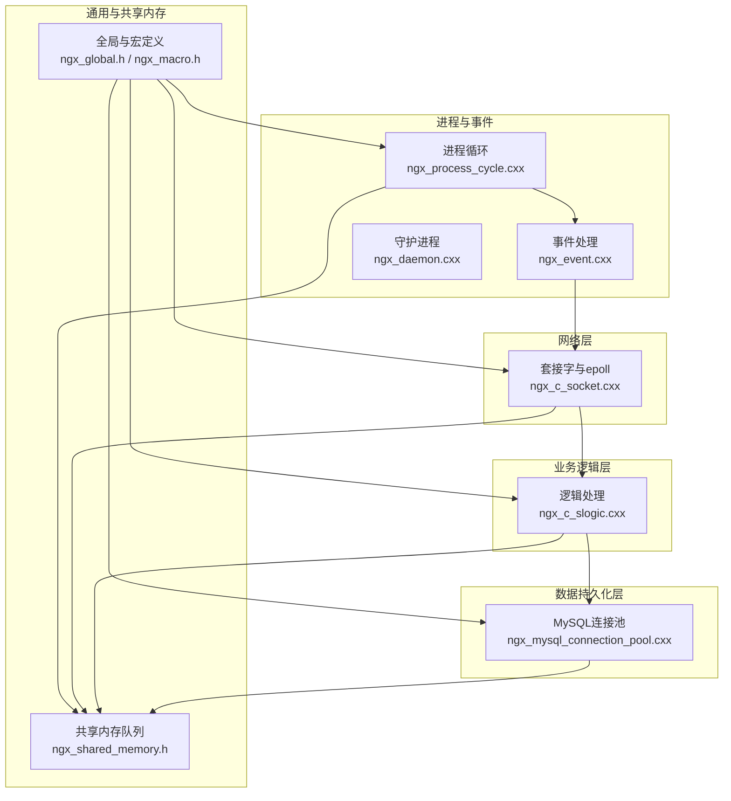
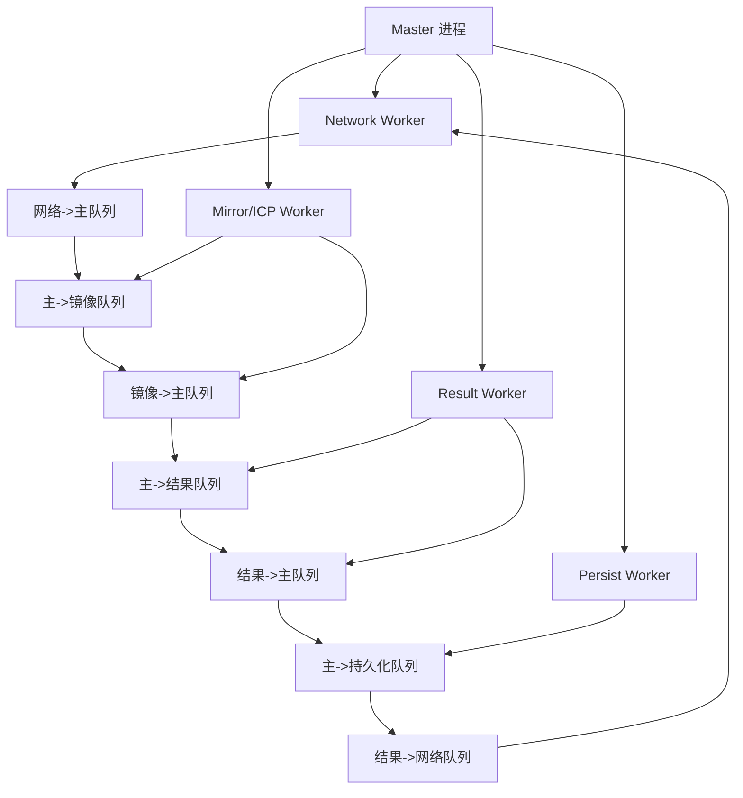
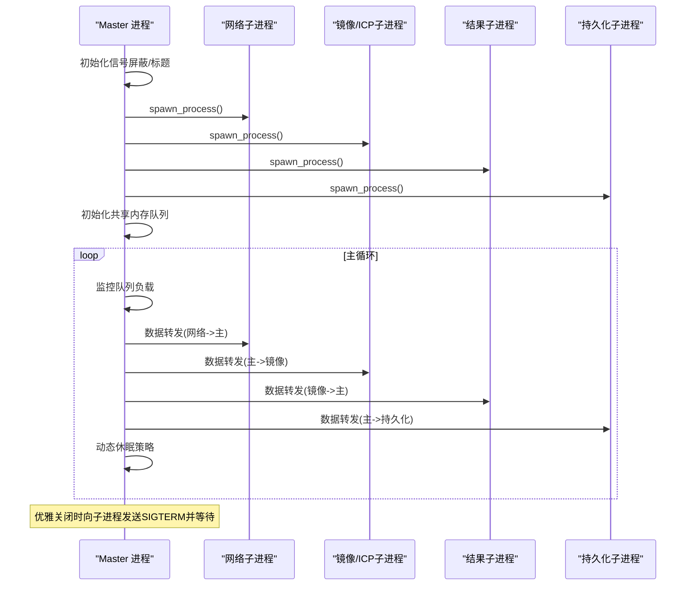
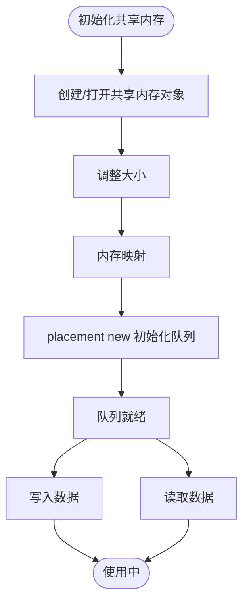
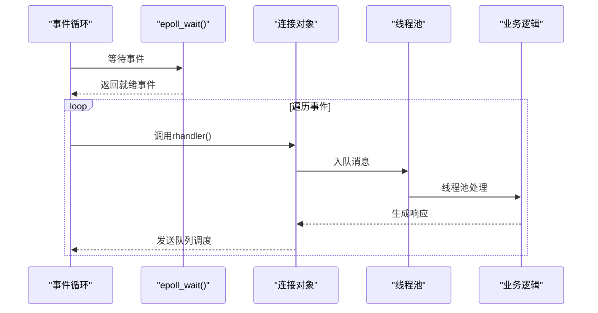
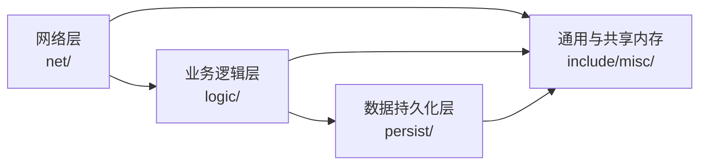
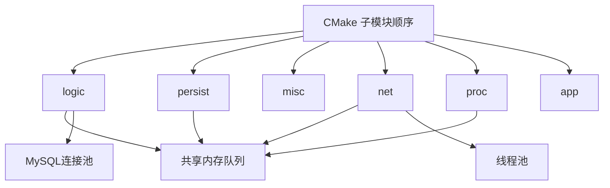

# 系统架构设计

<cite>
**本文引用的文件**
- [CMakeLists.txt](file://CMakeLists.txt)
- [Dockerfile](file://Dockerfile)
- [nginx.conf](file://nginx.conf)
- [ngx_process_cycle.cxx](file://proc/ngx_process_cycle.cxx)
- [ngx_event.cxx](file://proc/ngx_event.cxx)
- [ngx_daemon.cxx](file://proc/ngx_daemon.cxx)
- [ngx_c_socket.cxx](file://net/ngx_c_socket.cxx)
- [ngx_shared_memory.h](file://include/ngx_shared_memory.h)
- [ngx_global.h](file://include/ngx_global.h)
- [ngx_macro.h](file://include/ngx_macro.h)
- [ngx_c_threadpool.cxx](file://misc/ngx_c_threadpool.cxx)
- [ngx_mysql_connection_pool.cxx](file://persist/ngx_mysql_connection_pool.cxx)
- [ngx_c_slogic.cxx](file://logic/ngx_c_slogic.cxx)
</cite>

## 目录
1. [引言](#引言)
2. [项目结构](#项目结构)
3. [核心组件](#核心组件)
4. [架构总览](#架构总览)
5. [详细组件分析](#详细组件分析)
6. [依赖分析](#依赖分析)
7. [性能考量](#性能考量)
8. [故障排查指南](#故障排查指南)
9. [结论](#结论)
10. [附录](#附录)

## 引言
本设计文档面向 PointServer 的系统架构，聚焦于多进程 master-worker 模型、基于 epoll 的事件驱动异步 I/O、模块化分层（网络层、业务逻辑层、数据持久化层）、进程间通信与隔离、稳定性保障、可扩展性与部署拓扑，以及安全、监控与灾难恢复等横切关注点。文档旨在帮助读者快速理解系统边界、关键设计决策与实现原理。

## 项目结构
仓库采用按功能域划分的模块化组织方式，核心模块包括：
- proc：进程生命周期与事件循环（master 进程、子进程、信号、守护进程）
- net：网络 I/O 与 epoll 事件处理
- logic：业务逻辑与消息路由
- persist：数据库连接池与持久化
- misc：线程池、通用工具
- include：公共头文件与共享内存队列定义
- app/docker：应用入口与容器化

**图表来源**
- [ngx_process_cycle.cxx](file://proc/ngx_process_cycle.cxx#L360-L399)
- [ngx_event.cxx](file://proc/ngx_event.cxx#L14-L22)
- [ngx_c_socket.cxx](file://net/ngx_c_socket.cxx#L1-L200)
- [ngx_c_slogic.cxx](file://logic/ngx_c_slogic.cxx#L1-L200)
- [ngx_mysql_connection_pool.cxx](file://persist/ngx_mysql_connection_pool.cxx#L1-L200)
- [ngx_shared_memory.h](file://include/ngx_shared_memory.h#L12-L21)
- [ngx_global.h](file://include/ngx_global.h#L27-L46)
- [ngx_macro.h](file://include/ngx_macro.h#L32-L36)

**章节来源**
- [CMakeLists.txt](file://CMakeLists.txt#L61-L68)
- [Dockerfile](file://Dockerfile#L1-L65)

## 核心组件
- master 进程：负责子进程编排、共享内存队列初始化、队列负载监控与数据转发、信号处理与优雅关闭
- worker 子进程：网络子进程、镜像/ICP处理子进程、结果处理子进程、持久化子进程
- 网络层：基于 epoll 的事件驱动 I/O，支持高并发连接与事件分发
- 业务逻辑层：消息路由、心跳与点云处理、CRC 校验与序列化
- 数据持久化层：MySQL 连接池，支持动态扩缩容与空闲回收
- 通用与共享内存：全局变量、宏定义、共享内存队列模板与命名

**章节来源**
- [ngx_process_cycle.cxx](file://proc/ngx_process_cycle.cxx#L102-L121)
- [ngx_c_socket.cxx](file://net/ngx_c_socket.cxx#L58-L64)
- [ngx_c_slogic.cxx](file://logic/ngx_c_slogic.cxx#L33-L51)
- [ngx_mysql_connection_pool.cxx](file://persist/ngx_mysql_connection_pool.cxx#L5-L9)
- [ngx_shared_memory.h](file://include/ngx_shared_memory.h#L87-L160)

## 架构总览
PointServer 采用 master-worker 多进程模型，master 负责进程编排与跨进程数据总线（共享内存队列），各 worker 专注单一职责，通过队列解耦。网络层基于 epoll 实现事件驱动 I/O，业务逻辑层通过线程池处理消息，持久化层通过连接池提升数据库吞吐。

**图表来源**
- [ngx_process_cycle.cxx](file://proc/ngx_process_cycle.cxx#L333-L358)
- [ngx_shared_memory.h](file://include/ngx_shared_memory.h#L12-L21)

## 详细组件分析

### 多进程架构与 master-worker 模型
- master 进程职责
  - 初始化信号屏蔽与进程标题
  - 创建子进程并维护进程表
  - 初始化共享内存队列
  - 主循环进行队列负载监控与数据转发
  - 信号处理：优雅关闭、配置重载占位
- 子进程类型
  - 网络子进程：负责监听与连接接入
  - 镜像/ICP处理子进程：点云镜像与配准
  - 结果处理子进程：计算不对称度
  - 持久化子进程：落盘与入库
- 进程级隔离与稳定性
  - 子进程退出由 master 回收并按需重启
  - 信号屏蔽避免子进程继承不必要信号处理
  - 守护进程模式与标准 IO 重定向

**图表来源**
- [ngx_process_cycle.cxx](file://proc/ngx_process_cycle.cxx#L360-L399)
- [ngx_process_cycle.cxx](file://proc/ngx_process_cycle.cxx#L467-L545)
- [ngx_process_cycle.cxx](file://proc/ngx_process_cycle.cxx#L649-L714)

**章节来源**
- [ngx_process_cycle.cxx](file://proc/ngx_process_cycle.cxx#L123-L176)
- [ngx_process_cycle.cxx](file://proc/ngx_process_cycle.cxx#L360-L399)
- [ngx_process_cycle.cxx](file://proc/ngx_process_cycle.cxx#L467-L545)
- [ngx_process_cycle.cxx](file://proc/ngx_process_cycle.cxx#L649-L714)

### 进程间通信机制与共享内存队列
- 共享内存队列
  - 通过 POSIX 共享内存接口创建/映射
  - 模板化封装 open_shm_queue，支持不同队列类型
  - 队列容量与命名常量集中定义
- 数据流转
  - 网络子进程将点云数据写入“网络->主”队列
  - 主进程按负载均衡策略转发至各处理子进程
  - 结果子进程将结果写回“主->网络”队列供网络子进程返回客户端

**图表来源**
- [ngx_shared_memory.h](file://include/ngx_shared_memory.h#L87-L160)

**章节来源**
- [ngx_shared_memory.h](file://include/ngx_shared_memory.h#L12-L21)
- [ngx_shared_memory.h](file://include/ngx_shared_memory.h#L87-L160)

### 事件驱动架构与 epoll 异步 I/O
- 事件循环
  - 事件处理入口调用 epoll 处理函数，随后打印统计信息
- epoll 实现要点
  - 基于红黑树与就绪列表，支持大量 fd 的高效监控
  - 支持 LT/ET 触发模式，结合非阻塞 I/O 与循环读取
  - 事件回调与连接 rhandler 解耦，便于扩展
- 线程协作
  - 网络线程负责 I/O 事件与连接管理
  - 线程池处理消息队列，实现业务逻辑与 I/O 的解耦

**图表来源**
- [ngx_event.cxx](file://proc/ngx_event.cxx#L14-L22)
- [ngx_c_socket.cxx](file://net/ngx_c_socket.cxx#L797-L807)
- [ngx_c_threadpool.cxx](file://misc/ngx_c_threadpool.cxx#L124-L187)

**章节来源**
- [ngx_event.cxx](file://proc/ngx_event.cxx#L14-L22)
- [ngx_c_socket.cxx](file://net/ngx_c_socket.cxx#L598-L675)
- [ngx_c_socket.cxx](file://net/ngx_c_socket.cxx#L797-L807)
- [ngx_c_threadpool.cxx](file://misc/ngx_c_threadpool.cxx#L124-L187)

### 模块化设计与职责划分
- 网络层（net）
  - 负责监听端口、连接接入、epoll 事件处理、发送队列与回收线程
- 业务逻辑层（logic）
  - 消息路由、心跳处理、点云接收与 CRC 校验、序列化结构
- 数据持久化层（persist）
  - MySQL 连接池：懒汉单例、动态生产/扫描、条件变量协调
- 通用与共享内存（include/misc）
  - 全局变量与宏定义、线程池、共享内存队列模板

**图表来源**
- [CMakeLists.txt](file://CMakeLists.txt#L61-L68)
- [ngx_c_socket.cxx](file://net/ngx_c_socket.cxx#L58-L64)
- [ngx_c_slogic.cxx](file://logic/ngx_c_slogic.cxx#L66-L74)
- [ngx_mysql_connection_pool.cxx](file://persist/ngx_mysql_connection_pool.cxx#L76-L162)
- [ngx_shared_memory.h](file://include/ngx_shared_memory.h#L87-L160)

**章节来源**
- [CMakeLists.txt](file://CMakeLists.txt#L61-L68)
- [ngx_c_socket.cxx](file://net/ngx_c_socket.cxx#L58-L64)
- [ngx_c_slogic.cxx](file://logic/ngx_c_slogic.cxx#L66-L74)
- [ngx_mysql_connection_pool.cxx](file://persist/ngx_mysql_connection_pool.cxx#L76-L162)

### 技术决策、权衡与约束
- 多进程 + 共享内存队列
  - 决策：通过队列解耦进程，降低锁竞争与上下文切换
  - 权衡：进程间通信开销与共享内存管理复杂度
- epoll 事件驱动
  - 决策：高并发连接下的高效 I/O 处理
  - 权衡：ET 模式对非阻塞 I/O 的严格要求
- 线程池
  - 决策：将业务处理与 I/O 解耦，提升吞吐
  - 权衡：线程数与队列长度的平衡，避免过载
- MySQL 连接池
  - 决策：动态扩缩容与空闲回收，提升数据库利用率
  - 权衡：连接创建/销毁成本与池大小上限

**章节来源**
- [ngx_process_cycle.cxx](file://proc/ngx_process_cycle.cxx#L401-L464)
- [ngx_c_socket.cxx](file://net/ngx_c_socket.cxx#L598-L675)
- [ngx_c_threadpool.cxx](file://misc/ngx_c_threadpool.cxx#L67-L121)
- [ngx_mysql_connection_pool.cxx](file://persist/ngx_mysql_connection_pool.cxx#L173-L200)

### 基础设施要求、可扩展性与部署拓扑
- 基础设施
  - Linux 内核支持 epoll、POSIX 共享内存
  - MySQL 客户端库与 PCL/Draco 依赖
- 可扩展性
  - worker 数量可通过配置文件调整
  - 队列容量与负载均衡模式动态调整
  - 连接池大小与线程池规模可按资源弹性伸缩
- 部署拓扑
  - 单机多进程：master + 多个 worker
  - 容器化：Dockerfile 提供构建与运行环境，暴露端口
  - 配置：nginx.conf 提供进程数、监听端口、epoll 连接数等参数

**章节来源**
- [Dockerfile](file://Dockerfile#L1-L65)
- [nginx.conf](file://nginx.conf#L20-L61)
- [CMakeLists.txt](file://CMakeLists.txt#L15-L59)

### 安全、监控与灾难恢复
- 安全
  - flood 攻击检测开关与阈值配置
  - 心跳超时踢人与连接回收等待时间
  - CRC 校验与序列化结构校验
- 监控
  - 日志等级与文件路径配置
  - 运行时统计信息打印与队列状态监控
- 灾难恢复
  - 优雅关闭：SIGTERM 通知子进程，等待退出
  - 守护进程：setsid 脱离终端，标准 IO 重定向
  - 子进程重启：waitpid 回收僵尸进程，按需重启

**章节来源**
- [nginx.conf](file://nginx.conf#L52-L61)
- [ngx_c_slogic.cxx](file://logic/ngx_c_slogic.cxx#L99-L129)
- [ngx_process_cycle.cxx](file://proc/ngx_process_cycle.cxx#L649-L714)
- [ngx_daemon.cxx](file://proc/ngx_daemon.cxx#L15-L125)

## 依赖分析
- 构建与依赖
  - CMake 子模块顺序：logic → persist → misc → net → proc → app
  - 外部库：PCL、Draco、MySQL client、pthread
- 模块间依赖
  - master 进程依赖共享内存队列与信号处理
  - 网络层依赖线程池与全局 socket 对象
  - 业务逻辑层依赖共享内存与数据库连接池
  - 数据持久化层依赖连接池与全局日志

**图表来源**
- [CMakeLists.txt](file://CMakeLists.txt#L61-L68)
- [ngx_shared_memory.h](file://include/ngx_shared_memory.h#L87-L160)
- [ngx_c_threadpool.cxx](file://misc/ngx_c_threadpool.cxx#L67-L121)
- [ngx_mysql_connection_pool.cxx](file://persist/ngx_mysql_connection_pool.cxx#L76-L162)

**章节来源**
- [CMakeLists.txt](file://CMakeLists.txt#L61-L68)

## 性能考量
- epoll 与 LT/ET 模式选择
  - LT 模式适合稳定吞吐，ET 模式适合极致性能
  - 需配合非阻塞 I/O 与循环读取，避免 EAGAIN
- 队列负载均衡
  - 基于队列长度的动态模式切换（高/低/正常）
  - 指数退避策略与批量处理，平衡延迟与吞吐
- 线程池与连接池
  - 线程数与队列长度需与 CPU/IO 能力匹配
  - 连接池上限与空闲回收时间需结合数据库压力调优

**章节来源**
- [ngx_c_socket.cxx](file://net/ngx_c_socket.cxx#L632-L675)
- [ngx_process_cycle.cxx](file://proc/ngx_process_cycle.cxx#L401-L464)
- [ngx_process_cycle.cxx](file://proc/ngx_process_cycle.cxx#L717-L800)
- [ngx_c_threadpool.cxx](file://misc/ngx_c_threadpool.cxx#L67-L121)
- [ngx_mysql_connection_pool.cxx](file://persist/ngx_mysql_connection_pool.cxx#L173-L200)

## 故障排查指南
- 进程与信号
  - SIGTERM/SIGQUIT/SIGINT：优雅关闭流程与等待子进程退出
  - SIGCHLD：子进程状态变化，主循环中处理
- epoll 事件
  - 无事件返回或超时异常：检查 epoll_wait 返回值与日志
  - ET 模式下数据未读完：确认非阻塞 I/O 与循环读取
- 队列与转发
  - 队列过载：负载均衡模式切换与退避策略生效
  - 数据丢失：检查 CRC 校验与序列化结构长度
- 数据库
  - 连接池异常：检查配置文件与连接创建/回收线程

**章节来源**
- [ngx_process_cycle.cxx](file://proc/ngx_process_cycle.cxx#L649-L714)
- [ngx_c_socket.cxx](file://net/ngx_c_socket.cxx#L783-L790)
- [ngx_c_slogic.cxx](file://logic/ngx_c_slogic.cxx#L99-L129)
- [ngx_mysql_connection_pool.cxx](file://persist/ngx_mysql_connection_pool.cxx#L12-L74)

## 结论
PointServer 通过 master-worker 多进程模型与共享内存队列实现了高内聚、低耦合的模块化架构；基于 epoll 的事件驱动 I/O 与线程池进一步提升了并发处理能力；MySQL 连接池与配置化的进程/网络参数为可扩展性与运维提供了坚实基础。整体设计在稳定性、性能与可维护性之间取得了良好平衡。

## 附录
- 关键配置项
  - 进程数、守护进程、消息接收线程数
  - 监听端口数与每个 worker 的 epoll 连接数
  - 心跳超时、踢人开关与 flood 攻击阈值
- 全局与宏定义
  - 进程类型标识、日志等级与路径
- 容器化
  - Dockerfile 提供构建与运行环境，入口脚本负责配置修正与前台启动

**章节来源**
- [nginx.conf](file://nginx.conf#L20-L61)
- [ngx_macro.h](file://include/ngx_macro.h#L32-L36)
- [Dockerfile](file://Dockerfile#L59-L65)