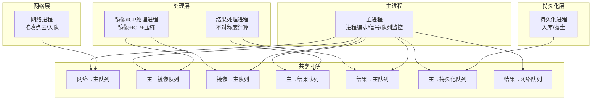
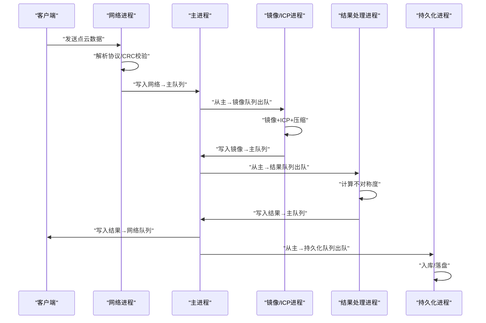
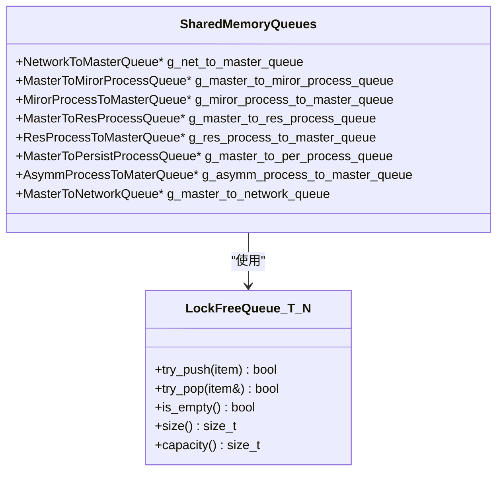
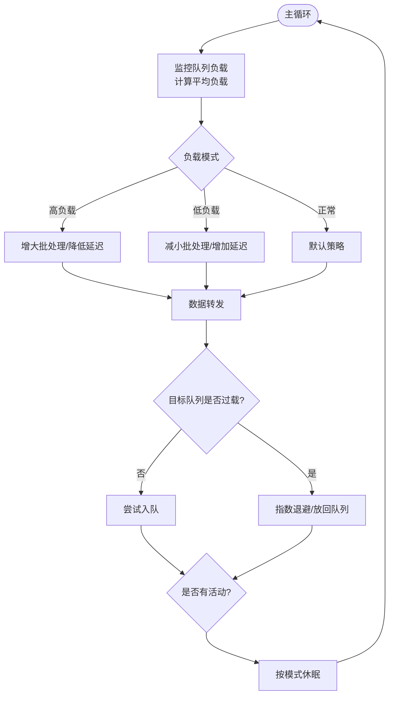
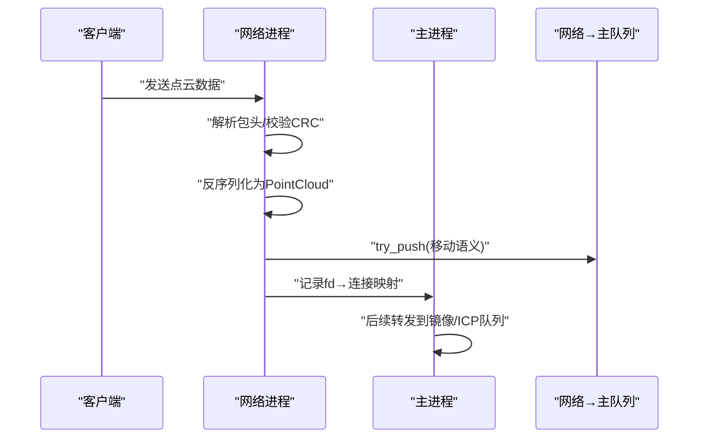
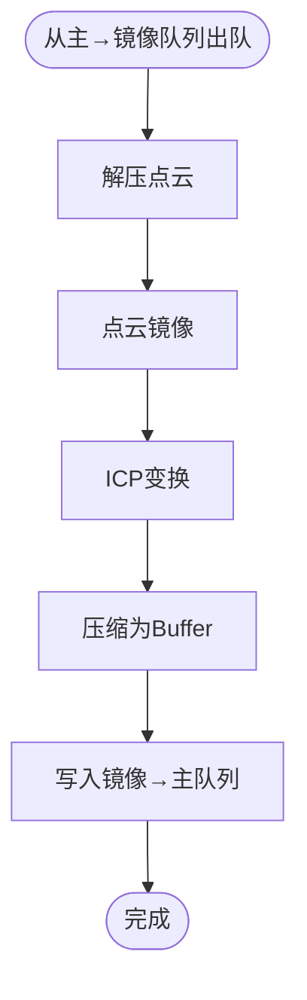
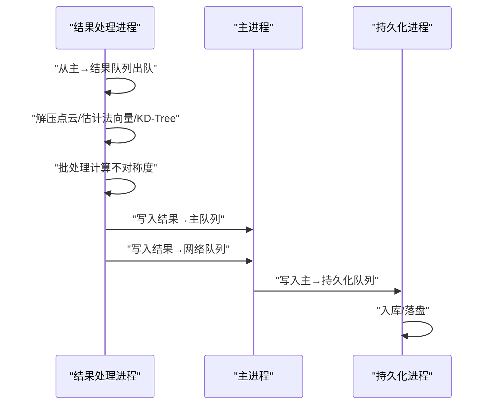
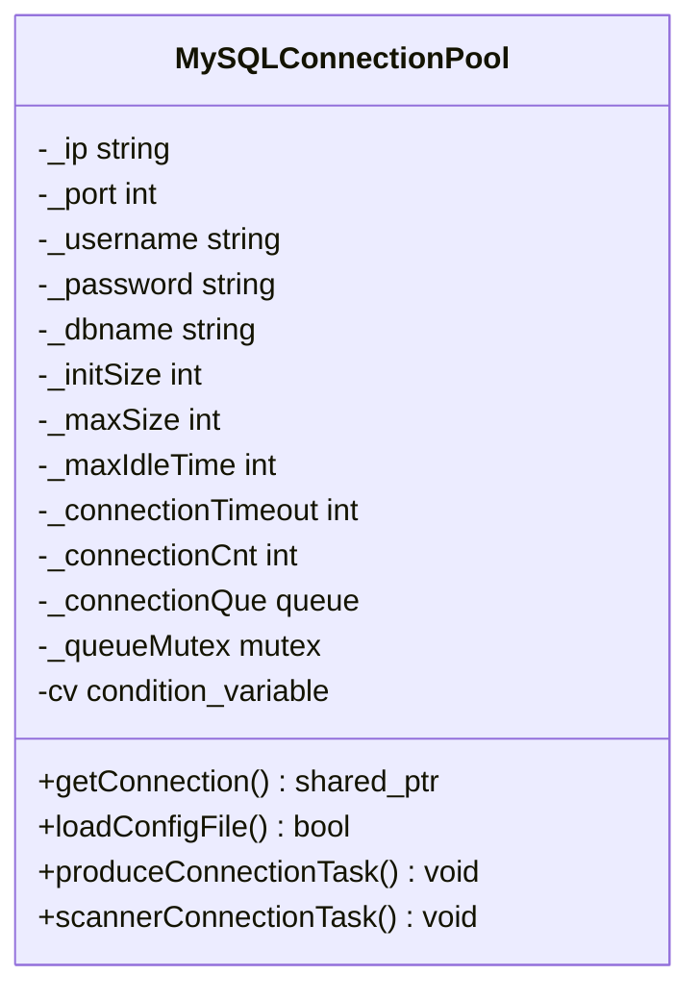
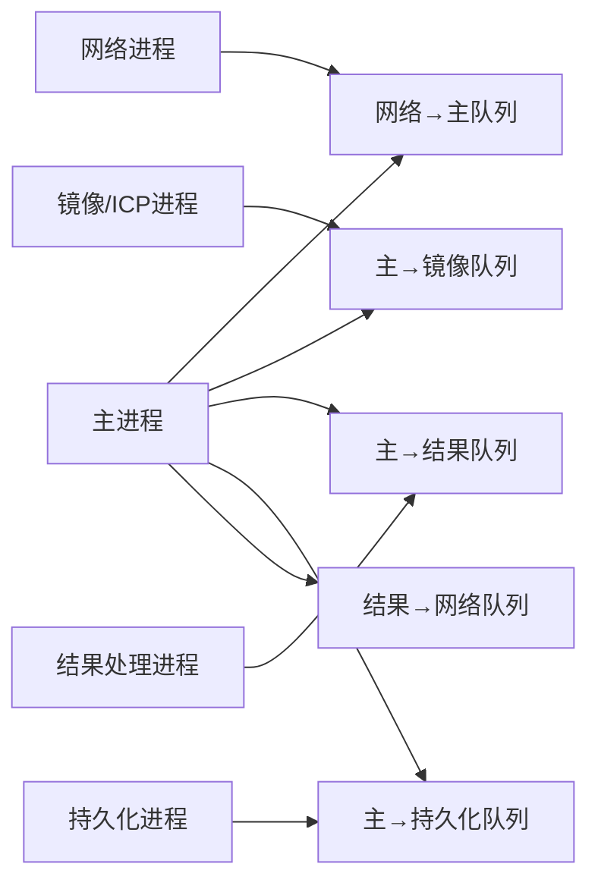

# 组件交互机制

<cite>
**本文引用的文件**
- [ngx_shared_memory.h](file://include/ngx_shared_memory.h)
- [ngx_lockFreeQueue.h](file://include/ngx_lockFreeQueue.h)
- [ngx_process_cycle.cxx](file://proc/ngx_process_cycle.cxx)
- [ngx_c_slogic.cxx](file://logic/ngx_c_slogic.cxx)
- [ngx_c_socket.cxx](file://net/ngx_c_socket.cxx)
- [ngx_lockfree_mirrorICP_threadPool.cxx](file://misc/ngx_lockfree_mirrorICP_threadPool.cxx)
- [ngx_lockfree_asymCal_threadPool.cxx](file://misc/ngx_lockfree_asymCal_threadPool.cxx)
- [ngx_mysql_connection_pool.cxx](file://persist/ngx_mysql_connection_pool.cxx)
- [ngx_comm.h](file://include/ngx_comm.h)
- [ngx_logiccomm.h](file://include/ngx_logiccomm.h)
- [ngx_macro.h](file://include/ngx_macro.h)
</cite>

## 目录
1. [简介](#简介)
2. [项目结构](#项目结构)
3. [核心组件](#核心组件)
4. [架构总览](#架构总览)
5. [详细组件分析](#详细组件分析)
6. [依赖关系分析](#依赖关系分析)
7. [性能考量](#性能考量)
8. [故障排查指南](#故障排查指南)
9. [结论](#结论)
10. [附录](#附录)

## 简介
本文件围绕 PointServer 的组件交互机制展开，重点解释以下方面：
- 共享内存队列的实现原理与生产者-消费者模式
- 组件间的消息传递协议与数据交换
- 负载均衡策略、流量控制与背压处理
- 时序控制与状态同步（异步处理、事件通知、状态查询）
- 错误处理、异常恢复与超时控制
- 如何通过组件交互实现高可用与高性能，规避死锁、竞态条件与数据一致性问题

## 项目结构
系统采用多进程 + 多队列的管道式架构，主进程负责进程生命周期与队列负载监控，网络进程负责点云接收与入队，镜像/ICP处理进程负责点云镜像与配准，结果处理进程负责不对称度计算，持久化进程负责入库与落盘。

图表来源
- [ngx_process_cycle.cxx](file://proc/ngx_process_cycle.cxx#L103-L121)
- [ngx_shared_memory.h](file://include/ngx_shared_memory.h#L65-L84)

章节来源
- [ngx_process_cycle.cxx](file://proc/ngx_process_cycle.cxx#L103-L121)
- [ngx_shared_memory.h](file://include/ngx_shared_memory.h#L12-L84)

## 核心组件
- 共享内存与无锁队列
  - 通过 POSIX 共享内存与内存映射实现跨进程队列，使用无锁循环队列保障高并发吞吐。
- 主进程编排
  - 负责创建子进程、初始化共享内存队列、监控队列负载并动态调整处理策略。
- 网络进程
  - 接收客户端点云数据，解析协议，校验 CRC，写入网络→主队列。
- 镜像/ICP处理进程
  - 从主→镜像队列出队，执行点云镜像与 ICP 变换，压缩后入镜像→主队列。
- 结果处理进程
  - 从主→结果队列出队，计算不对称度，产出结果入结果→主队列，并将结果入结果→网络队列。
- 持久化进程
  - 从主→持久化队列出队，入库与落盘。
- 数据库连接池
  - 提供线程安全的连接池，支持超时与空闲连接回收。

章节来源
- [ngx_shared_memory.h](file://include/ngx_shared_memory.h#L65-L84)
- [ngx_lockFreeQueue.h](file://include/ngx_lockFreeQueue.h#L4-L150)
- [ngx_process_cycle.cxx](file://proc/ngx_process_cycle.cxx#L333-L398)
- [ngx_c_slogic.cxx](file://logic/ngx_c_slogic.cxx#L190-L243)
- [ngx_lockfree_mirrorICP_threadPool.cxx](file://misc/ngx_lockfree_mirrorICP_threadPool.cxx#L5-L33)
- [ngx_lockfree_asymCal_threadPool.cxx](file://misc/ngx_lockfree_asymCal_threadPool.cxx#L13-L40)
- [ngx_mysql_connection_pool.cxx](file://persist/ngx_mysql_connection_pool.cxx#L5-L94)

## 架构总览
系统采用“主进程 + 多进程 + 共享内存队列”的流水线架构，主进程负责：
- 初始化共享内存队列
- 监控各队列负载，动态切换负载均衡模式
- 控制数据在各阶段队列间的流转，实施背压与退避策略
- 管理子进程生命周期与信号处理

图表来源
- [ngx_process_cycle.cxx](file://proc/ngx_process_cycle.cxx#L717-L800)
- [ngx_c_slogic.cxx](file://logic/ngx_c_slogic.cxx#L190-L243)
- [ngx_lockfree_mirrorICP_threadPool.cxx](file://misc/ngx_lockfree_mirrorICP_threadPool.cxx#L35-L58)
- [ngx_lockfree_asymCal_threadPool.cxx](file://misc/ngx_lockfree_asymCal_threadPool.cxx#L47-L87)

## 详细组件分析

### 共享内存与无锁队列
- 共享内存队列
  - 使用 POSIX 共享内存 API 创建/映射，模板化封装为多类型队列，全局指针在主进程初始化后供各子进程使用。
  - 队列容量为 32，采用环形缓冲区与原子指针，避免伪共享。
- 无锁队列
  - try_push/try_pop 基于 compare_exchange_weak 的 CAS 实现，结合 acquire-release 内存序保证可见性。
  - 提供 size/capacity 查询，便于主进程进行负载监控与背压控制。

图表来源
- [ngx_lockFreeQueue.h](file://include/ngx_lockFreeQueue.h#L4-L150)
- [ngx_shared_memory.h](file://include/ngx_shared_memory.h#L65-L84)

章节来源
- [ngx_shared_memory.h](file://include/ngx_shared_memory.h#L87-L179)
- [ngx_lockFreeQueue.h](file://include/ngx_lockFreeQueue.h#L50-L150)

### 主进程编排与负载均衡
- 初始化共享内存队列
  - 主进程在启动时创建并映射所有队列，确保子进程可直接使用。
- 队列负载监控
  - 定期统计各队列 size，计算平均负载，动态切换负载均衡模式（正常/高负载/低负载）。
- 数据转发与背压
  - 根据负载模式调整批处理大小与重试策略，采用指数退避（平滑增长）避免雪崩。
- 进程生命周期管理
  - 信号处理与收割子进程，异常退出时标记重启，保证高可用。

图表来源
- [ngx_process_cycle.cxx](file://proc/ngx_process_cycle.cxx#L401-L464)
- [ngx_process_cycle.cxx](file://proc/ngx_process_cycle.cxx#L717-L800)

章节来源
- [ngx_process_cycle.cxx](file://proc/ngx_process_cycle.cxx#L333-L398)
- [ngx_process_cycle.cxx](file://proc/ngx_process_cycle.cxx#L401-L545)

### 网络进程与消息协议
- 协议结构
  - 包头包含长度、CRC、消息类型；消息体承载点云序列化数据与元信息。
- 接收与入队
  - 解析包头、校验 CRC、反序列化为 PointCloud，写入网络→主队列；记录 fd→连接映射以便后续返回。
- 事件循环与异步处理
  - epoll 事件驱动，非阻塞 I/O，线程池处理消息，避免阻塞主事件循环。

图表来源
- [ngx_c_slogic.cxx](file://logic/ngx_c_slogic.cxx#L190-L243)
- [ngx_comm.h](file://include/ngx_comm.h#L19-L25)
- [ngx_logiccomm.h](file://include/ngx_logiccomm.h#L16-L24)

章节来源
- [ngx_c_socket.cxx](file://net/ngx_c_socket.cxx#L541-L751)
- [ngx_c_slogic.cxx](file://logic/ngx_c_slogic.cxx#L190-L243)
- [ngx_comm.h](file://include/ngx_comm.h#L19-L25)
- [ngx_logiccomm.h](file://include/ngx_logiccomm.h#L16-L24)

### 镜像/ICP处理进程
- 输入输出队列
  - 输入：主→镜像队列；输出：镜像→主队列。
- 处理流程
  - 解压点云、镜像变换、ICP 变换、压缩，封装为 MirrorICPPointCloud，入队。
- 退避与可观测性
  - 入队失败时进行有限次退避与让出，日志记录线程 ID 与处理进度。

图表来源
- [ngx_lockfree_mirrorICP_threadPool.cxx](file://misc/ngx_lockfree_mirrorICP_threadPool.cxx#L35-L58)

章节来源
- [ngx_lockfree_mirrorICP_threadPool.cxx](file://misc/ngx_lockfree_mirrorICP_threadPool.cxx#L5-L33)
- [ngx_lockfree_mirrorICP_threadPool.cxx](file://misc/ngx_lockfree_mirrorICP_threadPool.cxx#L35-L58)

### 结果处理进程（不对称度计算）
- 输入输出队列
  - 输入：主→结果队列；输出：结果→主队列；同时写入结果→网络队列。
- 计算流程
  - 解压两份点云、估计法向量、构建 KD-Tree、批处理计算平均最小距离，得到不对称度。
- 结果封装与返回
  - 封装 ResPointCloud 与 ResToNetwork，分别入持久化与网络返回队列。

图表来源
- [ngx_lockfree_asymCal_threadPool.cxx](file://misc/ngx_lockfree_asymCal_threadPool.cxx#L47-L87)

章节来源
- [ngx_lockfree_asymCal_threadPool.cxx](file://misc/ngx_lockfree_asymCal_threadPool.cxx#L13-L40)
- [ngx_lockfree_asymCal_threadPool.cxx](file://misc/ngx_lockfree_asymCal_threadPool.cxx#L47-L87)

### 持久化与数据库连接池
- 连接池设计
  - 懒汉单例，初始连接数、最大连接数、空闲回收、获取超时、条件变量协调生产与消费。
- 生命周期管理
  - 析构时通知并等待所有连接回收，确保优雅退出。

图表来源
- [ngx_mysql_connection_pool.cxx](file://persist/ngx_mysql_connection_pool.cxx#L5-L94)
- [ngx_mysql_connection_pool.cxx](file://persist/ngx_mysql_connection_pool.cxx#L208-L255)
- [ngx_mysql_connection_pool.cxx](file://persist/ngx_mysql_connection_pool.cxx#L281-L311)

章节来源
- [ngx_mysql_connection_pool.cxx](file://persist/ngx_mysql_connection_pool.cxx#L5-L94)
- [ngx_mysql_connection_pool.cxx](file://persist/ngx_mysql_connection_pool.cxx#L208-L255)
- [ngx_mysql_connection_pool.cxx](file://persist/ngx_mysql_connection_pool.cxx#L281-L311)

## 依赖关系分析
- 组件耦合
  - 主进程对各队列的读写形成强耦合，但通过无锁队列与共享内存实现跨进程解耦。
  - 各处理进程仅依赖输入/输出队列，彼此无直接通信，降低耦合度。
- 外部依赖
  - 共享内存 API、epoll、线程池、数据库驱动与第三方点云库。
- 潜在环依赖
  - 无直接环依赖；主进程负责编排，处理进程仅依赖队列。

图表来源
- [ngx_process_cycle.cxx](file://proc/ngx_process_cycle.cxx#L103-L121)
- [ngx_shared_memory.h](file://include/ngx_shared_memory.h#L65-L84)

章节来源
- [ngx_process_cycle.cxx](file://proc/ngx_process_cycle.cxx#L103-L121)
- [ngx_shared_memory.h](file://include/ngx_shared_memory.h#L65-L84)

## 性能考量
- 无锁队列与缓存行对齐
  - 降低伪共享与上下文切换开销，提升高并发吞吐。
- 批处理与动态退避
  - 根据负载模式调整批处理大小与重试策略，避免拥塞与抖动。
- 非阻塞 I/O 与事件驱动
  - epoll 驱动网络事件，避免阻塞，提升连接处理能力。
- 线程池与任务队列
  - 处理进程内部使用线程池并行化计算，结合无锁队列实现高吞吐。

## 故障排查指南
- 队列过载
  - 现象：try_push 失败、主进程记录负载状态。
  - 处理：检查下游处理进程是否滞后，调整负载模式或增加处理进程。
- 背压与退避
  - 现象：入队重试、指数退避日志。
  - 处理：确认下游队列容量与处理能力，必要时扩容或降载。
- 数据库连接超时
  - 现象：获取连接超时日志。
  - 处理：检查连接池配置、数据库性能与连接数上限。
- 信号与进程回收
  - 现象：子进程异常退出、主进程收割。
  - 处理：查看日志定位异常原因，确认重启策略生效。

章节来源
- [ngx_process_cycle.cxx](file://proc/ngx_process_cycle.cxx#L401-L464)
- [ngx_process_cycle.cxx](file://proc/ngx_process_cycle.cxx#L548-L577)
- [ngx_mysql_connection_pool.cxx](file://persist/ngx_mysql_connection_pool.cxx#L214-L235)

## 结论
通过共享内存 + 无锁队列的生产者-消费者模型，系统实现了高吞吐、低延迟的点云处理流水线。主进程以队列负载为依据进行动态调节，结合背压与退避策略，有效避免拥塞与雪崩。网络层采用事件驱动与非阻塞 I/O，处理层通过线程池并行化计算，持久化层通过连接池保障数据库访问的稳定性。整体设计在保证高可用的同时，兼顾高性能与可扩展性。

## 附录
- 关键宏与日志等级
  - 日志等级与进程类型宏定义，便于统一日志管理与进程标识。

章节来源
- [ngx_macro.h](file://include/ngx_macro.h#L18-L36)