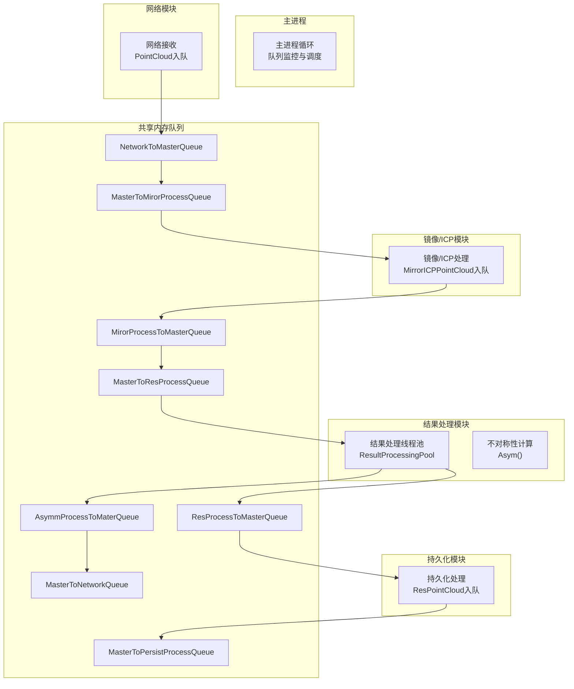
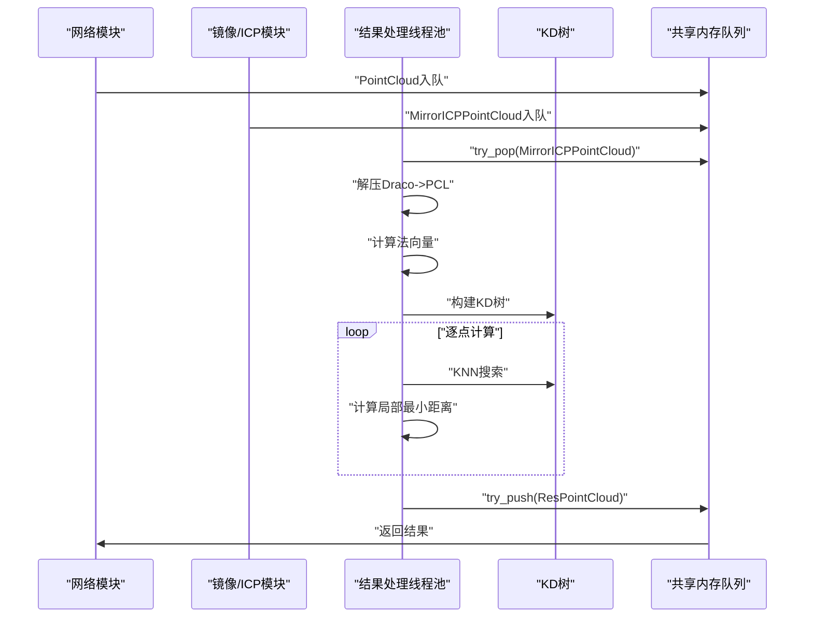
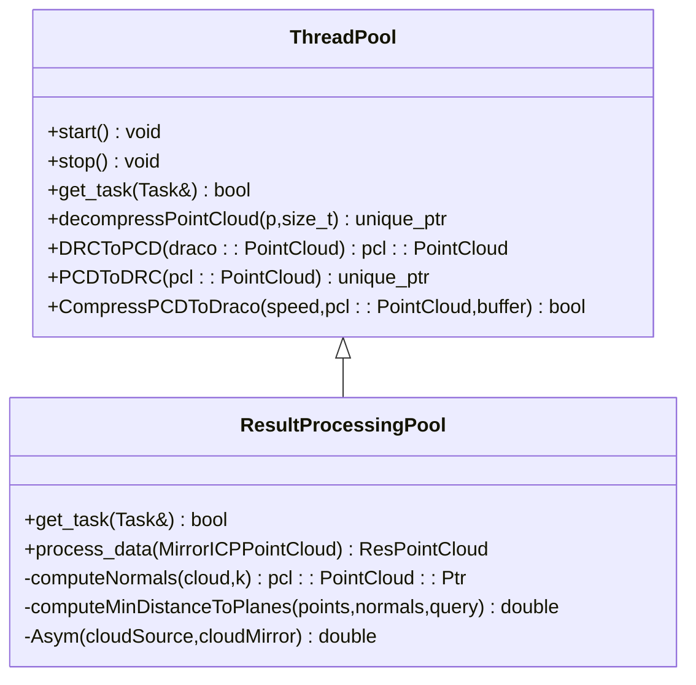
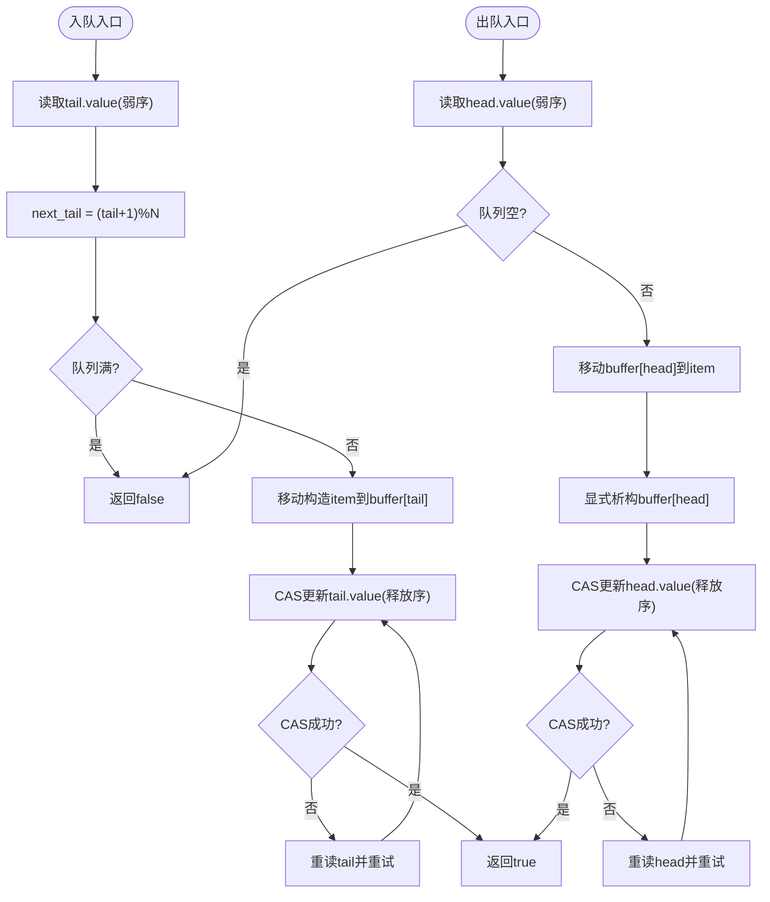
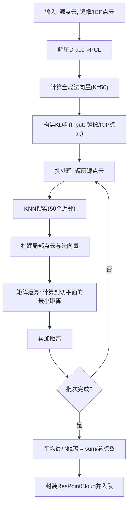
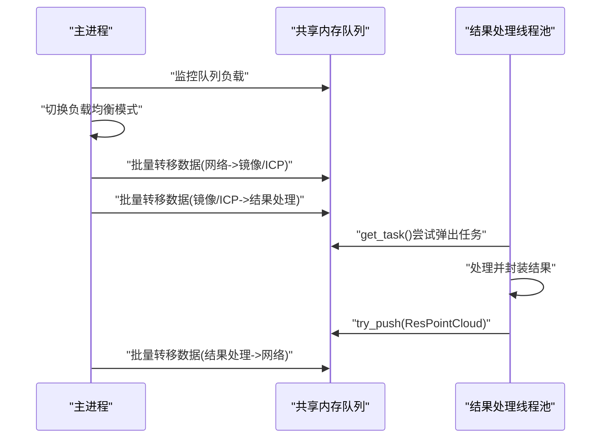
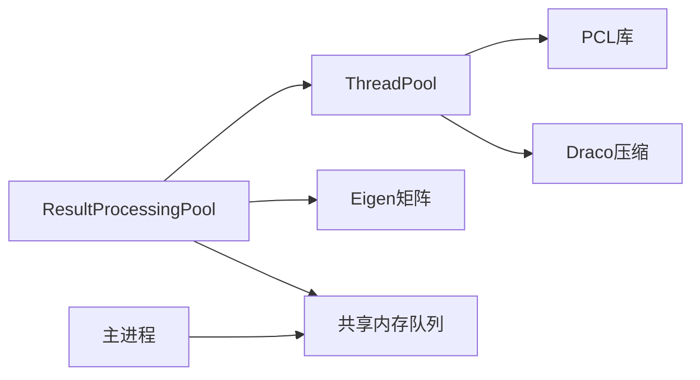

# 不对称性计算线程池

<cite>
**本文档引用的文件**
- [ngx_lockfree_threadPool.h](file://include/ngx_lockfree_threadPool.h)
- [ngx_lockfree_asymCal_threadPool.cxx](file://misc/ngx_lockfree_asymCal_threadPool.cxx)
- [ngx_lockfree_threadPool.cxx](file://misc/ngx_lockfree_threadPool.cxx)
- [ngx_lockFreeQueue.h](file://include/ngx_lockFreeQueue.h)
- [ngx_shared_memory.h](file://include/ngx_shared_memory.h)
- [ngx_process_cycle.cxx](file://proc/ngx_process_cycle.cxx)
- [ngx_global.h](file://include/ngx_global.h)
</cite>

## 目录
1. [简介](#简介)
2. [项目结构](#项目结构)
3. [核心组件](#核心组件)
4. [架构总览](#架构总览)
5. [详细组件分析](#详细组件分析)
6. [依赖关系分析](#依赖关系分析)
7. [性能考量](#性能考量)
8. [故障排查指南](#故障排查指南)
9. [结论](#结论)

## 简介
本技术文档围绕点云不对称性计算的线程池实现展开，系统基于共享内存队列的多进程/多线程流水线架构，重点阐述不对称性计算模块的线程池设计、任务分解、数据预处理、核心算法实现与结果后处理。文档还提供任务队列设计、线程调度策略、结果收集与汇总的可视化流程，以及在点云处理中的应用价值、参数调优、性能监控与精度保证方法。

## 项目结构
该项目采用多进程+共享内存+无锁队列的架构，主进程负责进程生命周期与队列调度，各功能模块通过共享内存队列进行解耦协作。不对称性计算线程池位于结果处理阶段，负责接收镜像/ICP处理后的点云，计算不对称度并输出结果。

**图表来源**
- [ngx_process_cycle.cxx](file://proc/ngx_process_cycle.cxx#L360-L545)
- [ngx_shared_memory.h](file://include/ngx_shared_memory.h#L65-L84)

**章节来源**
- [ngx_process_cycle.cxx](file://proc/ngx_process_cycle.cxx#L360-L545)
- [ngx_shared_memory.h](file://include/ngx_shared_memory.h#L65-L84)

## 核心组件
- 线程池基类与派生类
  - ThreadPool：抽象线程池基类，提供通用任务封装、优雅停止与点云编解码能力。
  - ResultProcessingPool：结果处理线程池，专门处理镜像/ICP后的点云，计算不对称度并产出结果。
- 无锁队列
  - LockFreeQueue：基于CAS的环形缓冲无锁队列，避免伪共享，提供高性能并发访问。
- 共享内存队列
  - 定义了网络到主进程、镜像/ICP、结果处理、持久化等多通道队列，通过共享内存跨进程访问。
- 主进程调度
  - 主进程循环监控队列负载，动态调整批处理大小与休眠策略，实现自适应的流量控制与负载均衡。

**章节来源**
- [ngx_lockfree_threadPool.h](file://include/ngx_lockfree_threadPool.h#L17-L77)
- [ngx_lockfree_threadPool.h](file://include/ngx_lockfree_threadPool.h#L101-L120)
- [ngx_lockFreeQueue.h](file://include/ngx_lockFreeQueue.h#L4-L150)
- [ngx_shared_memory.h](file://include/ngx_shared_memory.h#L65-L84)
- [ngx_process_cycle.cxx](file://proc/ngx_process_cycle.cxx#L401-L464)

## 架构总览
不对称性计算线程池位于结果处理阶段，其职责链如下：
- 从镜像/ICP处理队列取出数据包，解压Draco点云为PCL格式。
- 计算目标点云的法向量，构建KD树加速最近邻搜索。
- 对源点云逐点计算到局部切平面的最小距离，求平均得到不对称度。
- 将结果写入共享内存队列，供网络模块返回客户端。

**图表来源**
- [ngx_lockfree_asymCal_threadPool.cxx](file://misc/ngx_lockfree_asymCal_threadPool.cxx#L22-L87)
- [ngx_lockfree_threadPool.cxx](file://misc/ngx_lockfree_threadPool.cxx#L3-L61)
- [ngx_process_cycle.cxx](file://proc/ngx_process_cycle.cxx#L717-L860)

## 详细组件分析

### 线程池基类与派生类
- ThreadPool
  - 任务模型：使用std::function<void()>作为通用任务包装，支持lambda捕获与延时执行。
  - 生命周期：start()创建工作线程，stop()通过原子标志优雅停止，join回收资源。
  - 点云编解码：提供Draco压缩/解压、PCL转换的通用接口，便于各模块复用。
- ResultProcessingPool
  - 任务获取：get_task()从输入队列尝试弹出数据，若成功则封装为任务。
  - 处理流程：process_data()完成解压、PCL转换、法向量估计、KD树构建、逐点计算与结果封装。
  - 输出：将结果写入共享内存队列，同时构造返回网络的数据结构。

**图表来源**
- [ngx_lockfree_threadPool.h](file://include/ngx_lockfree_threadPool.h#L17-L77)
- [ngx_lockfree_threadPool.h](file://include/ngx_lockfree_threadPool.h#L101-L120)

**章节来源**
- [ngx_lockfree_threadPool.h](file://include/ngx_lockfree_threadPool.h#L17-L77)
- [ngx_lockfree_threadPool.h](file://include/ngx_lockfree_threadPool.h#L101-L120)

### 无锁队列设计
- 缓冲结构：环形数组+头尾指针，原子操作保证并发安全。
- 缓存行对齐：Head/Tail结构体按64字节对齐，避免伪共享。
- CAS循环：compare_exchange_weak实现无锁入队/出队，失败时重试。
- 内存序：写入使用release，读取使用acquire，确保可见性与顺序约束。
- 容量与大小：容量为N-1，提供size()与capacity()查询。

**图表来源**
- [ngx_lockFreeQueue.h](file://include/ngx_lockFreeQueue.h#L50-L127)

**章节来源**
- [ngx_lockFreeQueue.h](file://include/ngx_lockFreeQueue.h#L4-L150)

### 不对称性计算算法实现
- 数据预处理
  - 解压Draco压缩点云为PCL格式，构建共享指针以便多处使用。
  - 计算目标点云的法向量，设置K近邻数量，构建KD树加速查询。
- 核心算法
  - 逐点计算：对源点云的每个点，使用KD树搜索K近邻，构建局部点云与法向量。
  - 局部平面距离：将局部点云与法向量转为矩阵形式，计算到切平面的最小距离。
  - 批处理：按固定批次大小遍历源点云，降低内存压力与提升缓存命中。
- 结果后处理
  - 计算平均最小距离作为不对称度，封装ResPointCloud并写入共享内存队列。
  - 同时构造返回网络的数据结构，写入专用队列供主进程转发。

**图表来源**
- [ngx_lockfree_asymCal_threadPool.cxx](file://misc/ngx_lockfree_asymCal_threadPool.cxx#L47-L204)

**章节来源**
- [ngx_lockfree_asymCal_threadPool.cxx](file://misc/ngx_lockfree_asymCal_threadPool.cxx#L47-L204)

### 主进程调度与负载均衡
- 队列监控：每2秒统计各通道队列长度，计算平均负载并切换负载均衡模式。
- 动态批处理：根据负载模式调整批处理大小与重试次数，实现自适应吞吐。
- 退避策略：指数级退避结合平滑因子，避免过度竞争与资源浪费。
- 进程管理：定期收割退出子进程，必要时重启异常进程，保障系统稳定性。

**图表来源**
- [ngx_process_cycle.cxx](file://proc/ngx_process_cycle.cxx#L401-L464)
- [ngx_process_cycle.cxx](file://proc/ngx_process_cycle.cxx#L717-L860)

**章节来源**
- [ngx_process_cycle.cxx](file://proc/ngx_process_cycle.cxx#L401-L464)
- [ngx_process_cycle.cxx](file://proc/ngx_process_cycle.cxx#L717-L860)

## 依赖关系分析
- 组件耦合
  - ResultProcessingPool依赖ThreadPool提供的编解码与PCL工具。
  - 主进程通过共享内存队列与各模块解耦，避免直接耦合。
- 外部依赖
  - PCL库：点云处理、法向量估计、KD树搜索。
  - Draco：点云压缩/解压，减小网络传输与存储开销。
  - Eigen：矩阵运算，加速局部平面距离计算。
- 潜在风险
  - 队列满/空竞争：通过无锁队列与内存序保证正确性，但需合理设置队列容量。
  - 线程饥饿：ResultProcessingPool采用轮询模式，CPU密集型任务需注意线程数量与批处理大小。

**图表来源**
- [ngx_lockfree_threadPool.h](file://include/ngx_lockfree_threadPool.h#L17-L77)
- [ngx_lockfree_asymCal_threadPool.cxx](file://misc/ngx_lockfree_asymCal_threadPool.cxx#L1-L205)
- [ngx_shared_memory.h](file://include/ngx_shared_memory.h#L65-L84)

**章节来源**
- [ngx_lockfree_threadPool.h](file://include/ngx_lockfree_threadPool.h#L17-L77)
- [ngx_lockfree_asymCal_threadPool.cxx](file://misc/ngx_lockfree_asymCal_threadPool.cxx#L1-L205)
- [ngx_shared_memory.h](file://include/ngx_shared_memory.h#L65-L84)

## 性能考量
- 线程池策略
  - 轮询模式：适合CPU密集型计算，避免唤醒延迟，响应更快。
  - 批处理：按批次处理点云，降低内存碎片与提升缓存局部性。
- 内存与I/O
  - 使用Draco压缩减少带宽与存储压力；解压与PCL转换在内存中完成，注意峰值内存占用。
- 队列容量与内存序
  - 队列容量为32（2的幂），避免ABA问题；内存序采用release-acquire，保证可见性。
- 负载均衡
  - 根据队列长度动态调整批处理大小与休眠时间，平衡吞吐与延迟。

[本节为通用性能建议，无需特定文件引用]

## 故障排查指南
- 队列写入失败
  - 现象：日志提示“入队失败”。
  - 排查：检查目标队列容量与负载，确认主进程是否处于高负载模式导致限流。
  - 处理：适当增大队列容量或降低上游生产速率。
- 法向量计算失败
  - 现象：返回无穷大值或异常。
  - 排查：确认输入点云非空且法向量数量与点数一致。
  - 处理：检查Draco解压与PCL转换流程，确保数据完整性。
- KD树查询异常
  - 现象：KNN搜索失败或距离计算异常。
  - 排查：确认KD树构建成功且输入点云有效。
  - 处理：检查法向量估计与KD树构建步骤，必要时增大K值或调整批处理大小。
- 线程池停止异常
  - 现象：优雅停止未生效。
  - 排查：确认stop()调用路径与原子标志设置。
  - 处理：确保所有工作线程在循环中检测stop标志并及时退出。

**章节来源**
- [ngx_lockfree_asymCal_threadPool.cxx](file://misc/ngx_lockfree_asymCal_threadPool.cxx#L27-L34)
- [ngx_lockfree_asymCal_threadPool.cxx](file://misc/ngx_lockfree_asymCal_threadPool.cxx#L150-L154)
- [ngx_lockfree_asymCal_threadPool.cxx](file://misc/ngx_lockfree_asymCal_threadPool.cxx#L181-L193)

## 结论
本系统通过共享内存队列与无锁队列实现多进程/多线程解耦协作，不对称性计算线程池在结果处理阶段承担核心计算任务。通过批处理、法向量估计与KD树加速、矩阵运算优化等手段，实现了高效稳定的点云不对称度计算。主进程的动态负载均衡与自适应批处理策略进一步提升了整体吞吐与稳定性。建议在实际部署中结合业务负载调优队列容量、线程数量与批处理大小，并持续监控队列长度与计算时延以保证系统性能与精度。