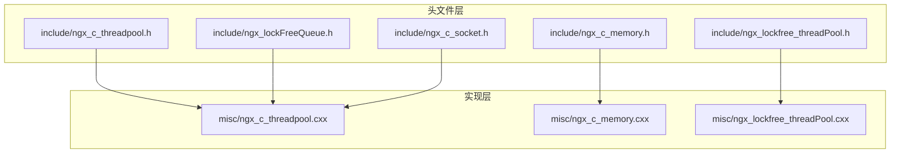
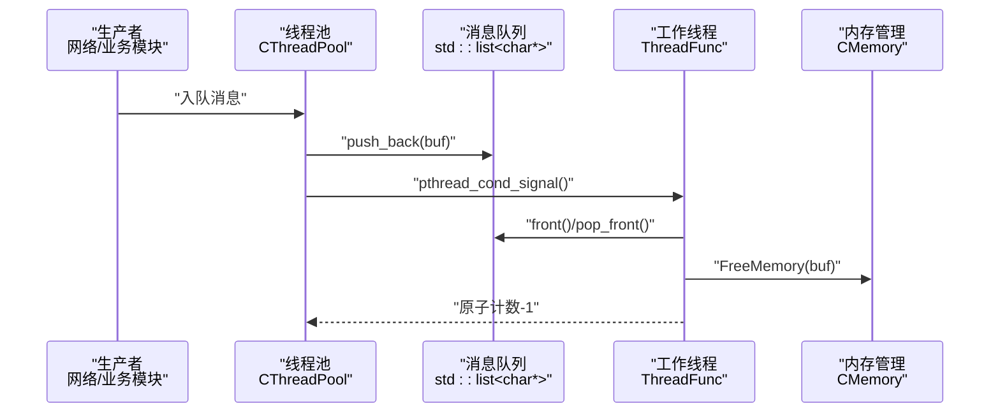
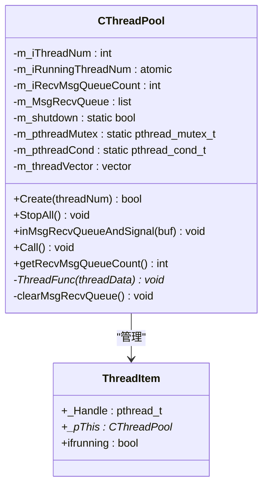
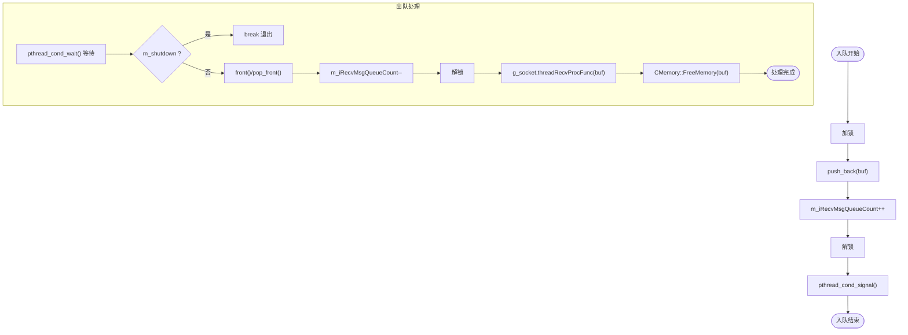
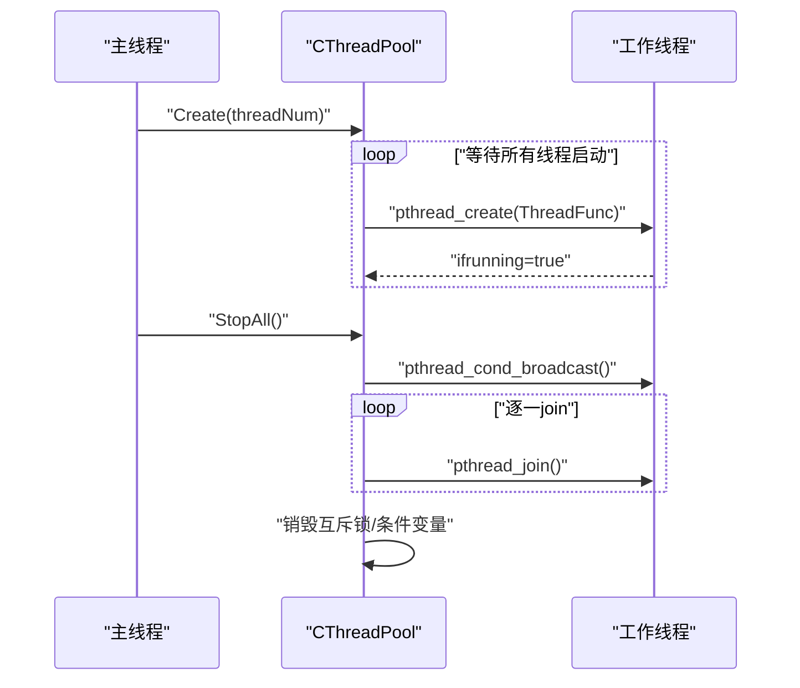
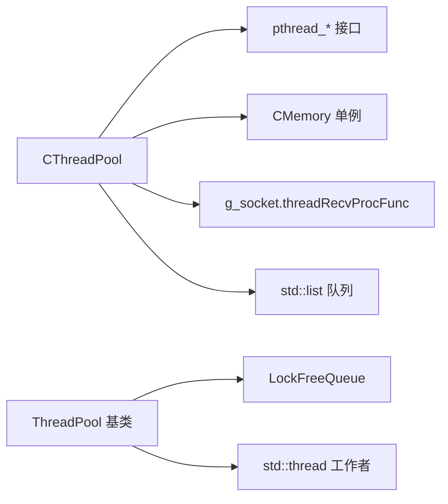

# 基础线程池

<cite>
**本文引用的文件**
- [ngx_c_threadpool.h](file://include/ngx_c_threadpool.h)
- [ngx_c_threadpool.cxx](file://misc/ngx_c_threadpool.cxx)
- [ngx_c_memory.h](file://include/ngx_c_memory.h)
- [ngx_c_memory.cxx](file://misc/ngx_c_memory.cxx)
- [ngx_c_socket.h](file://include/ngx_c_socket.h)
- [ngx_lockFreeQueue.h](file://include/ngx_lockFreeQueue.h)
- [ngx_lockfree_threadPool.h](file://include/ngx_lockfree_threadPool.h)
- [ngx_lockfree_threadPool.cxx](file://misc/ngx_lockfree_threadPool.cxx)
</cite>

## 目录
1. [简介](#简介)
2. [项目结构](#项目结构)
3. [核心组件](#核心组件)
4. [架构总览](#架构总览)
5. [组件详解](#组件详解)
6. [依赖关系分析](#依赖关系分析)
7. [性能考量](#性能考量)
8. [故障排查指南](#故障排查指南)
9. [结论](#结论)
10. [附录](#附录)

## 简介
本技术文档围绕“基础线程池”展开，系统阐述通用线程池的设计原理与实现机制，重点覆盖线程池的创建与初始化、任务队列管理、互斥锁与条件变量的协作、线程生命周期管理等。文档同时给出线程池工作流程（任务入队、线程唤醒、任务处理、内存释放）的关键步骤说明，并提供参数配置、性能优化建议与常见问题排查方法，帮助读者在不直接阅读源码的前提下也能快速掌握线程池的使用与运维要点。

## 项目结构
该项目采用“头文件声明 + 源文件实现”的分层组织方式，线程池相关代码主要集中在 include 与 misc 两个目录中：
- include：对外暴露的接口与数据结构定义，如线程池类、内存管理单例、无锁队列模板等。
- misc：线程池实现细节、内存分配与释放、无锁线程池示例等。

图表来源
- [ngx_c_threadpool.h](file://include/ngx_c_threadpool.h#L1-L66)
- [ngx_c_threadpool.cxx](file://misc/ngx_c_threadpool.cxx#L1-L321)
- [ngx_c_memory.h](file://include/ngx_c_memory.h#L1-L51)
- [ngx_c_memory.cxx](file://misc/ngx_c_memory.cxx#L1-L29)
- [ngx_lockFreeQueue.h](file://include/ngx_lockFreeQueue.h#L1-L430)
- [ngx_lockfree_threadPool.h](file://include/ngx_lockfree_threadPool.h#L1-L144)
- [ngx_lockfree_threadPool.cxx](file://misc/ngx_lockfree_threadPool.cxx#L1-L78)

章节来源
- [ngx_c_threadpool.h](file://include/ngx_c_threadpool.h#L1-L66)
- [ngx_c_threadpool.cxx](file://misc/ngx_c_threadpool.cxx#L1-L321)

## 核心组件
- 线程池类：CThreadPool，提供线程池创建、停止、消息入队与唤醒等能力。
- 线程项结构：ThreadItem，封装线程句柄、所属线程池指针与运行状态标记。
- 互斥锁与条件变量：用于线程间同步，协调任务入队与线程唤醒。
- 接收消息队列：std::list<char*>，承载待处理的消息块。
- 内存管理：CMemory 单例，提供统一的内存分配与释放接口，避免碎片化与泄漏风险。

章节来源
- [ngx_c_threadpool.h](file://include/ngx_c_threadpool.h#L32-L63)
- [ngx_c_threadpool.cxx](file://misc/ngx_c_threadpool.cxx#L32-L47)
- [ngx_c_memory.h](file://include/ngx_c_memory.h#L1-L51)
- [ngx_c_memory.cxx](file://misc/ngx_c_memory.cxx#L1-L29)

## 架构总览
基础线程池采用“生产者-消费者”模型：网络层或其他模块将完整消息入队，线程池中的工作线程从队列取出消息并处理，处理完成后释放内存。线程池内部通过互斥锁保护共享队列，通过条件变量实现线程的唤醒与等待。

图表来源
- [ngx_c_threadpool.cxx](file://misc/ngx_c_threadpool.cxx#L269-L291)
- [ngx_c_threadpool.cxx](file://misc/ngx_c_threadpool.cxx#L124-L187)
- [ngx_c_memory.cxx](file://misc/ngx_c_memory.cxx#L24-L28)

## 组件详解

### CThreadPool 类与 ThreadItem 结构
- CThreadPool 负责线程池的创建、停止、消息入队与唤醒、运行中线程数统计等。
- ThreadItem 作为线程的轻量封装，记录线程句柄、所属线程池指针及运行状态标记，便于统一管理与停止流程控制。

图表来源
- [ngx_c_threadpool.h](file://include/ngx_c_threadpool.h#L32-L63)

章节来源
- [ngx_c_threadpool.h](file://include/ngx_c_threadpool.h#L9-L63)
- [ngx_c_threadpool.cxx](file://misc/ngx_c_threadpool.cxx#L32-L47)

### 任务队列与内存管理
- 任务队列：std::list<char*>，用于存放待处理的消息块。入队时使用互斥锁保护，出队时同样受互斥锁保护。
- 内存管理：CMemory 单例提供 AllocMemory/FreeMemory，统一管理消息块的生命周期，避免内存泄漏与碎片化。

图表来源
- [ngx_c_threadpool.cxx](file://misc/ngx_c_threadpool.cxx#L269-L291)
- [ngx_c_threadpool.cxx](file://misc/ngx_c_threadpool.cxx#L124-L187)
- [ngx_c_memory.cxx](file://misc/ngx_c_memory.cxx#L24-L28)

章节来源
- [ngx_c_threadpool.cxx](file://misc/ngx_c_threadpool.cxx#L51-L63)
- [ngx_c_memory.h](file://include/ngx_c_memory.h#L1-L51)
- [ngx_c_memory.cxx](file://misc/ngx_c_memory.cxx#L1-L29)

### 线程生命周期管理
- 创建：Create(threadNum) 逐个创建工作线程，等待所有线程进入 pthread_cond_wait() 后才返回，确保线程池整体可用。
- 运行：ThreadFunc 中循环等待条件变量，有任务或停止信号时处理。
- 停止：StopAll() 设置停止标志，广播唤醒所有等待线程，逐一 join 回收资源，并销毁互斥锁与条件变量。

图表来源
- [ngx_c_threadpool.cxx](file://misc/ngx_c_threadpool.cxx#L67-L121)
- [ngx_c_threadpool.cxx](file://misc/ngx_c_threadpool.cxx#L190-L265)

章节来源
- [ngx_c_threadpool.cxx](file://misc/ngx_c_threadpool.cxx#L67-L121)
- [ngx_c_threadpool.cxx](file://misc/ngx_c_threadpool.cxx#L190-L265)

### 互斥锁与条件变量的作用
- 互斥锁：保护共享数据结构（消息队列、运行中线程数、停止标志等），确保多线程安全。
- 条件变量：实现线程间同步，生产者入队后唤醒等待的线程；停止时广播唤醒所有等待线程。

章节来源
- [ngx_c_threadpool.h](file://include/ngx_c_threadpool.h#L46-L48)
- [ngx_c_threadpool.cxx](file://misc/ngx_c_threadpool.cxx#L137-L157)

### 线程池参数配置与使用建议
- 线程数量：根据 CPU 核心数与任务类型（I/O 密集 vs CPU 密集）合理设置。过少会导致队列堆积，过多会带来上下文切换开销。
- 队列容量：消息队列大小直接影响系统背压能力，应结合业务峰值流量评估。
- 原子计数：使用原子变量统计运行中线程数，避免频繁加锁带来的竞争。
- 日志与告警：当运行中线程数等于线程总数时，按时间间隔记录“线程不够用”的告警，提示扩容。

章节来源
- [ngx_c_threadpool.h](file://include/ngx_c_threadpool.h#L53-L56)
- [ngx_c_threadpool.cxx](file://misc/ngx_c_threadpool.cxx#L307-L316)

### 代码示例路径（不直接展示代码）
- 线程池创建与初始化
  - [CThreadPool::Create](file://misc/ngx_c_threadpool.cxx#L67-L121)
- 任务提交与唤醒
  - [CThreadPool::inMsgRecvQueueAndSignal](file://misc/ngx_c_threadpool.cxx#L269-L291)
  - [CThreadPool::Call](file://misc/ngx_c_threadpool.cxx#L294-L319)
- 线程启动与停止
  - [CThreadPool::ThreadFunc](file://misc/ngx_c_threadpool.cxx#L124-L187)
  - [CThreadPool::StopAll](file://misc/ngx_c_threadpool.cxx#L190-L265)
- 内存释放
  - [CMemory::FreeMemory](file://misc/ngx_c_memory.cxx#L24-L28)

## 依赖关系分析
- CThreadPool 依赖 pthread 接口（互斥锁、条件变量、线程创建与 join）、CMemory 单例、g_socket.threadRecvProcFunc（业务处理回调）。
- 无锁队列模板 LockFreeQueue 提供高性能的无锁消息传递，适用于高并发场景；与基础线程池的有锁队列形成互补。

图表来源
- [ngx_c_threadpool.cxx](file://misc/ngx_c_threadpool.cxx#L1-L321)
- [ngx_c_memory.h](file://include/ngx_c_memory.h#L1-L51)
- [ngx_lockFreeQueue.h](file://include/ngx_lockFreeQueue.h#L1-L430)
- [ngx_lockfree_threadPool.h](file://include/ngx_lockfree_threadPool.h#L1-L144)

章节来源
- [ngx_c_threadpool.cxx](file://misc/ngx_c_threadpool.cxx#L1-L321)
- [ngx_lockFreeQueue.h](file://include/ngx_lockFreeQueue.h#L1-L430)
- [ngx_lockfree_threadPool.h](file://include/ngx_lockfree_threadPool.h#L1-L144)

## 性能考量
- 互斥锁与条件变量：基础线程池采用有锁队列与条件变量，适合中低并发场景；高并发下可考虑无锁队列（见 LockFreeQueue 模板）以降低锁竞争。
- 原子操作：使用原子变量统计运行中线程数，避免频繁加锁，提高性能。
- 缓存行对齐：无锁队列模板中对 Head/Tail 结构进行缓存行对齐，避免伪共享，提升多核并发性能。
- 内存管理：统一通过 CMemory 分配/释放，减少碎片化与泄漏风险，提升稳定性。

章节来源
- [ngx_c_threadpool.h](file://include/ngx_c_threadpool.h#L53-L56)
- [ngx_lockFreeQueue.h](file://include/ngx_lockFreeQueue.h#L7-L16)
- [ngx_c_memory.cxx](file://misc/ngx_c_memory.cxx#L1-L29)

## 故障排查指南
- 线程创建失败：检查 pthread_create 返回值与错误码，确认系统线程上限与权限。
- 条件变量唤醒异常：确认在改变条件状态后再发出信号；停止时使用广播唤醒，注意惊群效应与锁竞争。
- 死锁风险：避免在持有互斥锁期间进行阻塞操作；确保每个线程只被 join 一次。
- 内存泄漏：确保每条入队消息在处理后均调用 CMemory::FreeMemory 释放。
- 队列积压：监控 m_iRecvMsgQueueCount 与运行中线程数，适时扩容线程池。

章节来源
- [ngx_c_threadpool.cxx](file://misc/ngx_c_threadpool.cxx#L77-L84)
- [ngx_c_threadpool.cxx](file://misc/ngx_c_threadpool.cxx#L199-L205)
- [ngx_c_threadpool.cxx](file://misc/ngx_c_threadpool.cxx#L216-L223)
- [ngx_c_threadpool.cxx](file://misc/ngx_c_threadpool.cxx#L180-L181)
- [ngx_c_threadpool.cxx](file://misc/ngx_c_threadpool.cxx#L307-L316)

## 结论
基础线程池通过互斥锁与条件变量实现可靠的线程间同步，结合统一的内存管理与清晰的生命周期控制，为消息处理提供了稳定高效的执行框架。对于更高并发与更低延迟的场景，可参考无锁队列模板与基于 std::thread 的线程池实现，进一步优化吞吐与可伸缩性。

## 附录
- 无锁队列模板与内存序说明：见 [ngx_lockFreeQueue.h](file://include/ngx_lockFreeQueue.h#L1-L430)
- 无锁线程池示例：见 [ngx_lockfree_threadPool.h](file://include/ngx_lockfree_threadPool.h#L1-L144)、[ngx_lockfree_threadPool.cxx](file://misc/ngx_lockfree_threadPool.cxx#L1-L78)
- 网络与线程池集成：见 [ngx_c_socket.h](file://include/ngx_c_socket.h#L103-L200)