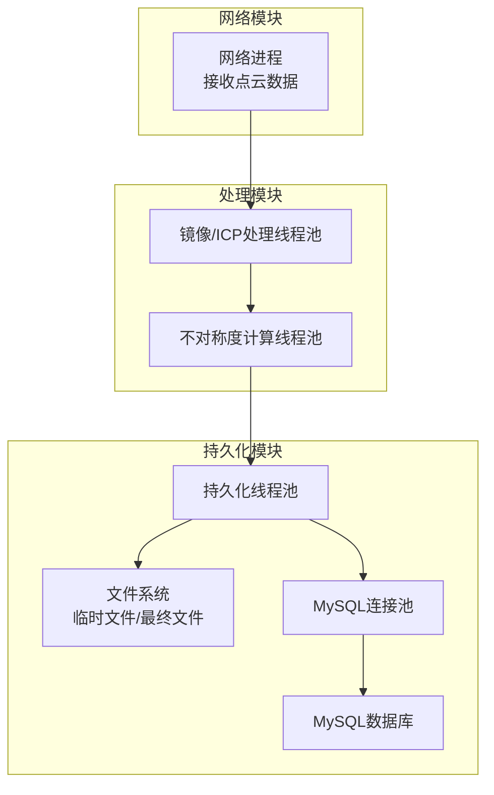
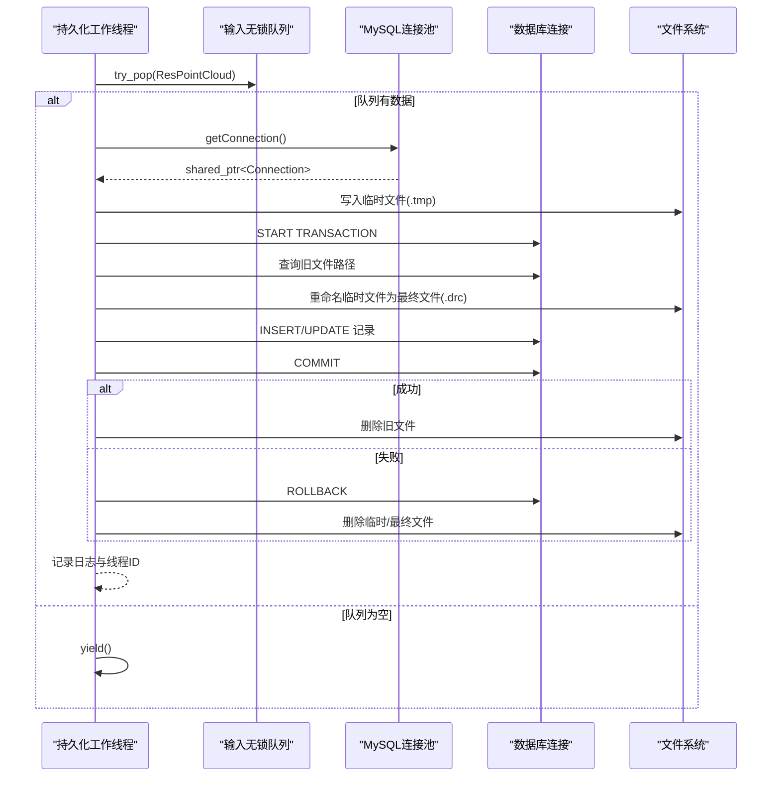
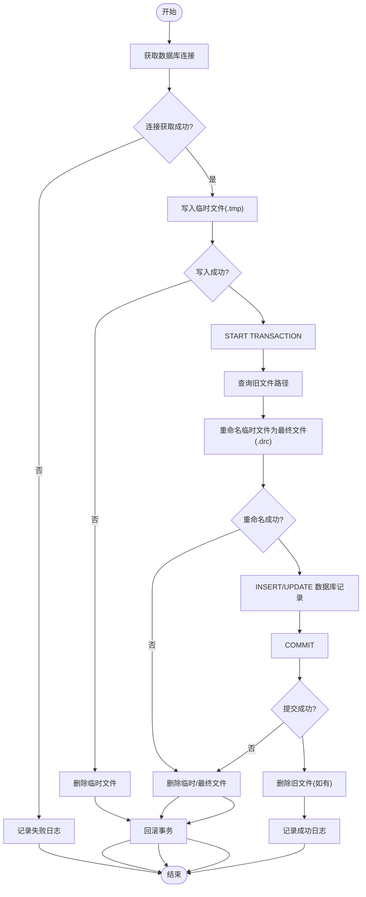
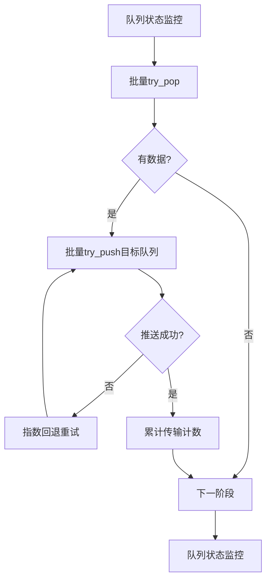
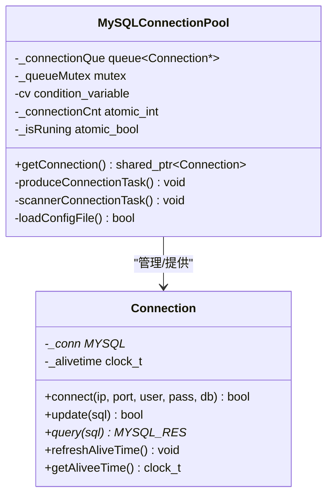
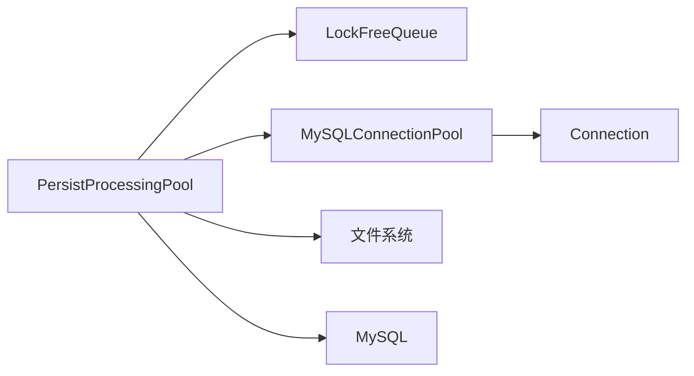

# 持久化线程池

<cite>
**本文档引用的文件**
- [ngx_lockfree_threadPool.h](file://include/ngx_lockfree_threadPool.h)
- [ngx_lockfree_persistPool.cxx](file://misc/ngx_lockfree_persistPool.cxx)
- [ngx_lockFreeQueue.h](file://include/ngx_lockFreeQueue.h)
- [ngx_mysql_connection_pool.h](file://include/ngx_mysql_connection_pool.h)
- [ngx_mysql_connection_pool.cxx](file://persist/ngx_mysql_connection_pool.cxx)
- [ngx_mysql_connection.h](file://include/ngx_mysql_connection.h)
- [ngx_mysql_connection.cxx](file://persist/ngx_mysql_connection.cxx)
- [mysql.ini](file://persist/mysql.ini)
- [ngx_process_cycle.cxx](file://proc/ngx_process_cycle.cxx)
</cite>

## 目录
1. [简介](#简介)
2. [项目结构](#项目结构)
3. [核心组件](#核心组件)
4. [架构概览](#架构概览)
5. [详细组件分析](#详细组件分析)
6. [依赖关系分析](#依赖关系分析)
5. [性能考量](#性能考量)
6. [故障排查指南](#故障排查指南)
7. [结论](#结论)

## 简介
本文件聚焦于点云数据存储中的“持久化线程池”实现，系统性阐述其在数据写入策略、批量处理机制、数据库交互优化方面的设计与实现细节。文档覆盖以下主题：
- 持久化线程池在点云数据存储中的角色：将处理完成的点云结果序列化、落盘为压缩文件，并原子性更新数据库记录。
- 数据写入策略：采用临时文件+重命名的原子性写入，结合数据库事务，确保数据一致性。
- 批量处理机制：通过无锁队列实现跨模块的高性能数据传递，配合指数回退重试策略，保障系统稳定性。
- 数据库交互优化：连接池的懒加载、空闲回收、超时控制与RAII智能指针管理，降低连接开销并提升并发能力。
- 错误恢复机制：事务回滚、文件清理、日志记录与告警，确保异常情况下系统可恢复。
- 性能监控：队列负载监控、传输计数统计与日志记录，辅助容量规划与性能调优。

## 项目结构
持久化线程池位于“持久化模块”，与镜像/ICP处理、不对称度计算、网络模块通过共享内存队列串联，形成端到端的数据处理流水线。

图示来源
- [ngx_process_cycle.cxx](file://proc/ngx_process_cycle.cxx#L1078-L1085)
- [ngx_lockfree_threadPool.h](file://include/ngx_lockfree_threadPool.h#L122-L136)
- [ngx_lockfree_persistPool.cxx](file://misc/ngx_lockfree_persistPool.cxx#L52-L146)
- [ngx_mysql_connection_pool.cxx](file://persist/ngx_mysql_connection_pool.cxx#L77-L162)

章节来源
- [ngx_process_cycle.cxx](file://proc/ngx_process_cycle.cxx#L1078-L1085)
- [ngx_lockfree_threadPool.h](file://include/ngx_lockfree_threadPool.h#L122-L136)

## 核心组件
- 持久化线程池（PersistProcessingPool）：从共享内存无锁队列中取出处理完成的点云结果，执行序列化、文件落盘、数据库事务更新与清理工作。
- 无锁队列（LockFreeQueue）：提供高性能的跨线程/进程数据传递，避免传统锁的上下文切换开销。
- MySQL连接池（MySQLConnectionPool）：提供线程安全的连接获取、空闲回收与超时控制，支持懒加载与后台维护线程。
- 数据库连接封装（Connection）：封装MySQL连接的创建、查询与更新操作，提供RAII生命周期管理。

章节来源
- [ngx_lockfree_threadPool.h](file://include/ngx_lockfree_threadPool.h#L122-L136)
- [ngx_lockFreeQueue.h](file://include/ngx_lockFreeQueue.h#L4-L150)
- [ngx_mysql_connection_pool.h](file://include/ngx_mysql_connection_pool.h#L14-L55)
- [ngx_mysql_connection.h](file://include/ngx_mysql_connection.h#L9-L35)

## 架构概览
持久化线程池在进程内以线程池形式运行，每个工作线程从输入队列弹出数据，执行以下步骤：
1. 从连接池获取数据库连接（超时控制与RAII管理）。
2. 生成临时文件名与最终文件名，将序列化数据写入临时文件。
3. 开启数据库事务，查询旧文件路径，重命名临时文件为最终文件，更新数据库记录。
4. 提交事务；若成功，删除旧文件；若失败，回滚事务并清理临时文件。
5. 记录日志与线程标识，便于监控与排障。

图示来源
- [ngx_lockfree_persistPool.cxx](file://misc/ngx_lockfree_persistPool.cxx#L17-L31)
- [ngx_lockfree_persistPool.cxx](file://misc/ngx_lockfree_persistPool.cxx#L52-L146)
- [ngx_mysql_connection_pool.cxx](file://persist/ngx_mysql_connection_pool.cxx#L208-L255)

## 详细组件分析

### 持久化线程池实现
- 线程池启动与生命周期：构造时启动工作线程，析构时优雅停止。
- 任务获取策略：从输入无锁队列尝试弹出数据，若无数据则让出CPU。
- 数据处理流程：序列化写盘、事务更新、原子重命名、旧文件清理与异常回滚。
- 错误处理：连接获取失败、文件写入失败、数据库操作失败、重命名失败均触发回滚与清理，并记录错误日志。

图示来源
- [ngx_lockfree_persistPool.cxx](file://misc/ngx_lockfree_persistPool.cxx#L52-L146)

章节来源
- [ngx_lockfree_threadPool.h](file://include/ngx_lockfree_threadPool.h#L122-L136)
- [ngx_lockfree_persistPool.cxx](file://misc/ngx_lockfree_persistPool.cxx#L12-L158)

### 无锁队列与批量处理
- 无锁队列设计：环形缓冲区 + 缓存行对齐，使用compare-and-swap实现无锁push/pop，避免传统锁的上下文切换。
- 批量处理：在主循环中对多个阶段（网络→镜像/ICP→结果→持久化→网络）采用批量传输，减少队列操作次数。
- 负载均衡：根据队列大小阈值决定是否回退数据，避免过载。

图示来源
- [ngx_process_cycle.cxx](file://proc/ngx_process_cycle.cxx#L408-L860)
- [ngx_lockFreeQueue.h](file://include/ngx_lockFreeQueue.h#L50-L127)

章节来源
- [ngx_process_cycle.cxx](file://proc/ngx_process_cycle.cxx#L408-L860)
- [ngx_lockFreeQueue.h](file://include/ngx_lockFreeQueue.h#L4-L150)

### 数据库连接池与事务处理
- 连接池初始化：从配置文件加载参数，创建初始连接并启动后台线程负责生产与扫描。
- 连接获取：支持超时等待与条件变量协调，获取的连接通过RAII智能指针自动归还或销毁。
- 事务管理：持久化线程池内开启事务，数据库操作失败时回滚并清理文件，确保一致性。
- 空闲回收：定期扫描空闲连接，超过最大空闲时间的连接被回收，降低资源占用。

图示来源
- [ngx_mysql_connection_pool.h](file://include/ngx_mysql_connection_pool.h#L14-L55)
- [ngx_mysql_connection_pool.cxx](file://persist/ngx_mysql_connection_pool.cxx#L77-L162)
- [ngx_mysql_connection_pool.cxx](file://persist/ngx_mysql_connection_pool.cxx#L208-L255)
- [ngx_mysql_connection.h](file://include/ngx_mysql_connection.h#L9-L35)

章节来源
- [ngx_mysql_connection_pool.h](file://include/ngx_mysql_connection_pool.h#L14-L55)
- [ngx_mysql_connection_pool.cxx](file://persist/ngx_mysql_connection_pool.cxx#L11-L74)
- [ngx_mysql_connection_pool.cxx](file://persist/ngx_mysql_connection_pool.cxx#L173-L203)
- [ngx_mysql_connection_pool.cxx](file://persist/ngx_mysql_connection_pool.cxx#L281-L311)
- [ngx_mysql_connection.h](file://include/ngx_mysql_connection.h#L9-L35)
- [ngx_mysql_connection.cxx](file://persist/ngx_mysql_connection.cxx#L19-L55)

### 配置与初始化
- 连接池配置：通过配置文件设置IP、端口、账号、密码、库名、初始连接数、最大连接数、最大空闲时间、连接超时等。
- 进程初始化：持久化进程启动时打开共享内存队列，创建持久化线程池实例并进入循环。

章节来源
- [mysql.ini](file://persist/mysql.ini#L1-L13)
- [ngx_process_cycle.cxx](file://proc/ngx_process_cycle.cxx#L1078-L1085)

## 依赖关系分析
- 持久化线程池依赖无锁队列进行数据传递，依赖连接池进行数据库访问。
- 连接池依赖配置文件与MySQL客户端库，内部使用条件变量与互斥锁保证线程安全。
- 文件系统与数据库共同构成持久化目标，事务与文件重命名确保原子性。

图示来源
- [ngx_lockfree_threadPool.h](file://include/ngx_lockfree_threadPool.h#L122-L136)
- [ngx_lockfree_persistPool.cxx](file://misc/ngx_lockfree_persistPool.cxx#L52-L146)
- [ngx_mysql_connection_pool.cxx](file://persist/ngx_mysql_connection_pool.cxx#L77-L162)

章节来源
- [ngx_lockfree_threadPool.h](file://include/ngx_lockfree_threadPool.h#L122-L136)
- [ngx_lockfree_persistPool.cxx](file://misc/ngx_lockfree_persistPool.cxx#L52-L146)
- [ngx_mysql_connection_pool.cxx](file://persist/ngx_mysql_connection_pool.cxx#L77-L162)

## 性能考量
- 无锁队列：通过缓存行对齐与compare-and-swap避免锁竞争，适合高并发数据传递。
- 批量处理：主循环中对多阶段采用批量传输，减少队列操作次数与上下文切换。
- 连接池优化：懒加载初始连接、后台生产与扫描线程、超时控制与空闲回收，降低连接开销。
- 事务与文件原子性：事务+重命名确保写入原子性，避免部分写入导致的数据不一致。
- 指数回退重试：在队列拥塞时采用指数回退，避免忙等与资源浪费。

## 故障排查指南
- 连接池获取超时：检查配置文件参数与数据库状态，确认连接池后台线程是否正常运行。
- 文件写入失败：检查磁盘空间与权限，确认临时目录与最终目录存在且可写。
- 事务回滚：查看数据库错误日志与持久化线程日志，定位具体SQL失败原因。
- 旧文件清理失败：关注警告日志，确认文件是否存在且权限允许删除。
- 队列拥塞：通过队列监控与日志统计，调整线程池大小与批量大小，缓解瓶颈。

章节来源
- [ngx_mysql_connection_pool.cxx](file://persist/ngx_mysql_connection_pool.cxx#L214-L234)
- [ngx_lockfree_persistPool.cxx](file://misc/ngx_lockfree_persistPool.cxx#L136-L145)
- [ngx_process_cycle.cxx](file://proc/ngx_process_cycle.cxx#L408-L460)

## 结论
持久化线程池通过无锁队列、连接池与事务机制的协同，实现了点云数据从序列化到文件落盘再到数据库更新的高可靠、高性能流水线。其设计在保证数据一致性的同时，兼顾了并发性能与资源复用，为大规模点云数据的稳定存储提供了坚实基础。