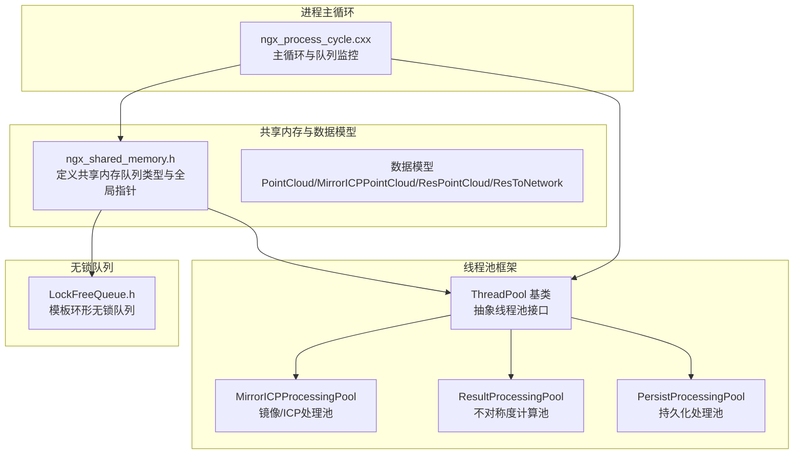
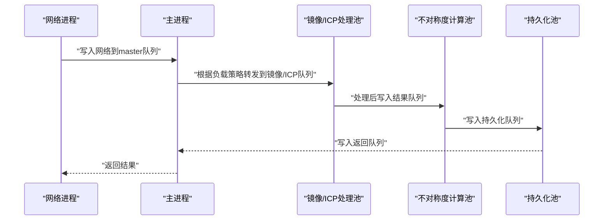
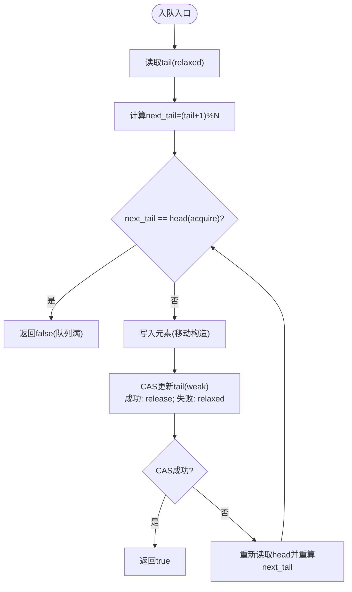
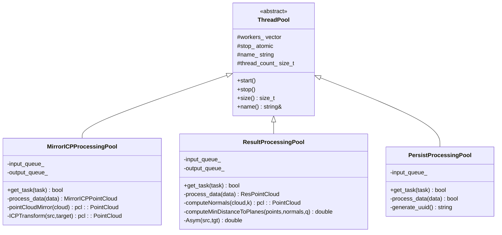
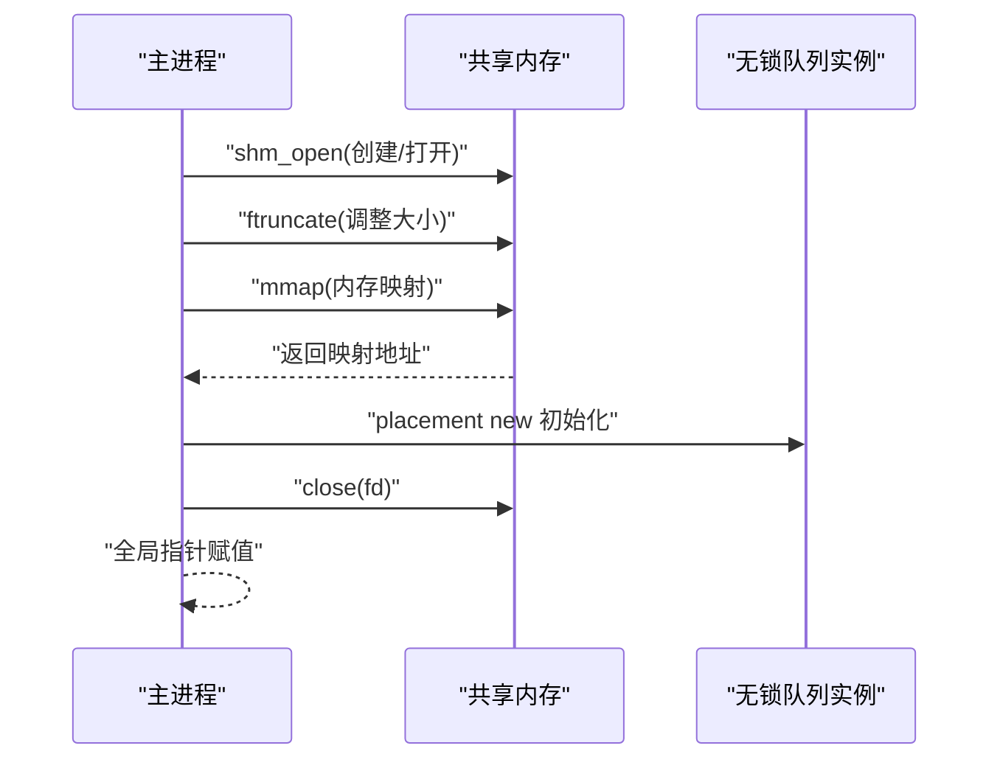
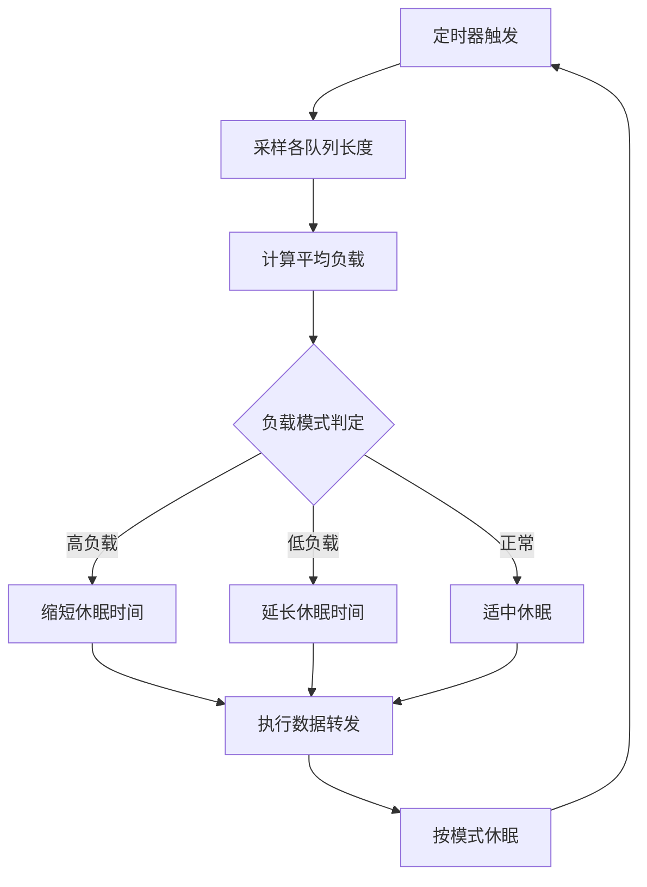
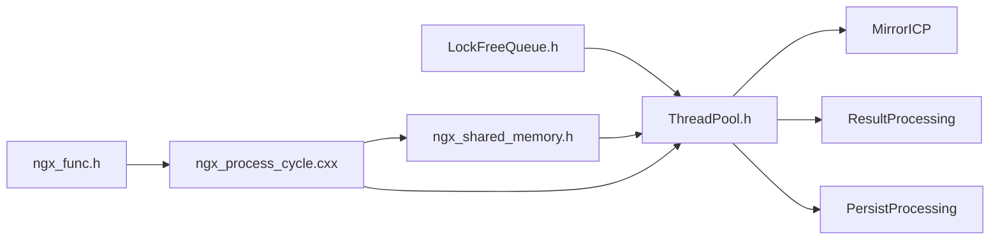

# 无锁线程池

<cite>
**本文档引用的文件**
- [ngx_lockFreeQueue.h](file://include/ngx_lockFreeQueue.h)
- [ngx_lockfree_threadPool.h](file://include/ngx_lockfree_threadPool.h)
- [ngx_lockfree_threadPool.cxx](file://misc/ngx_lockfree_threadPool.cxx)
- [ngx_lockfree_mirrorICP_threadPool.cxx](file://misc/ngx_lockfree_mirrorICP_threadPool.cxx)
- [ngx_lockfree_asymCal_threadPool.cxx](file://misc/ngx_lockfree_asymCal_threadPool.cxx)
- [ngx_lockfree_persistPool.cxx](file://misc/ngx_lockfree_persistPool.cxx)
- [ngx_shared_memory.h](file://include/ngx_shared_memory.h)
- [ngx_process_cycle.cxx](file://proc/ngx_process_cycle.cxx)
- [ngx_func.h](file://include/ngx_func.h)
</cite>

## 目录
1. [简介](#简介)
2. [项目结构](#项目结构)
3. [核心组件](#核心组件)
4. [架构总览](#架构总览)
5. [详细组件分析](#详细组件分析)
6. [依赖关系分析](#依赖关系分析)
7. [性能考量](#性能考量)
8. [故障排查指南](#故障排查指南)
9. [结论](#结论)
10. [附录](#附录)

## 简介
本项目实现了一个基于共享内存的无锁线程池系统，采用环形无锁队列作为跨进程通信通道，结合多级流水线处理（镜像/ICP配准 → 不对称度计算 → 持久化），在高并发场景下显著降低锁竞争与上下文切换开销，提升整体吞吐量与可伸缩性。本文档深入解析无锁数据结构设计、原子操作与内存序、ABA问题规避策略，并对比传统线程池的优势，提供最佳实践与风险分析。

## 项目结构
项目采用模块化组织，核心围绕无锁队列、线程池抽象类与具体处理池展开，并通过共享内存实现跨进程通信。

**图表来源**
- [ngx_shared_memory.h](file://include/ngx_shared_memory.h#L22-L84)
- [ngx_lockFreeQueue.h](file://include/ngx_lockFreeQueue.h#L4-L150)
- [ngx_lockfree_threadPool.h](file://include/ngx_lockfree_threadPool.h#L17-L136)
- [ngx_process_cycle.cxx](file://proc/ngx_process_cycle.cxx#L380-L398)

**章节来源**
- [ngx_shared_memory.h](file://include/ngx_shared_memory.h#L22-L84)
- [ngx_lockFreeQueue.h](file://include/ngx_lockFreeQueue.h#L4-L150)
- [ngx_lockfree_threadPool.h](file://include/ngx_lockfree_threadPool.h#L17-L136)
- [ngx_process_cycle.cxx](file://proc/ngx_process_cycle.cxx#L380-L398)

## 核心组件
- 环形无锁队列：基于原子变量与缓存行对齐，支持无锁入队/出队，避免伪共享；通过环形数组天然规避ABA问题。
- 线程池抽象：定义统一的任务获取接口与优雅停机机制，子类实现具体处理逻辑。
- 多级流水线：网络接收 → 镜像/ICP → 不对称度计算 → 持久化，通过共享内存队列串联。
- 共享内存队列：在进程间共享无锁队列实例，支持跨进程高效数据传递。

**章节来源**
- [ngx_lockFreeQueue.h](file://include/ngx_lockFreeQueue.h#L4-L150)
- [ngx_lockfree_threadPool.h](file://include/ngx_lockfree_threadPool.h#L17-L136)
- [ngx_shared_memory.h](file://include/ngx_shared_memory.h#L22-L84)

## 架构总览
系统采用“主进程 + 多工作进程”的模式，主进程负责队列监控与负载均衡，工作进程分别承担镜像/ICP、不对称度计算、持久化等任务。所有进程通过共享内存中的无锁队列进行数据交换，避免传统锁竞争。

**图表来源**
- [ngx_process_cycle.cxx](file://proc/ngx_process_cycle.cxx#L467-L544)
- [ngx_shared_memory.h](file://include/ngx_shared_memory.h#L65-L84)

**章节来源**
- [ngx_process_cycle.cxx](file://proc/ngx_process_cycle.cxx#L467-L544)
- [ngx_shared_memory.h](file://include/ngx_shared_memory.h#L65-L84)

## 详细组件分析

### 无锁队列设计与实现
- 环形缓冲区：固定容量N，使用头尾指针定位读写位置，通过取模运算实现环形滚动。
- 缓存行对齐：头尾指针对齐到64字节边界，避免多核CPU下的伪共享，提升并发性能。
- 原子操作与内存序：
  - 入队：先读取tail，计算next_tail，检查是否满；若未满，使用compare_exchange_weak进行CAS更新；成功时使用release语义确保数据写入在指针更新前对其他线程可见。
  - 出队：先读取head，检查是否空；若非空，移动取出元素并显式析构原对象；CAS更新head，成功时使用release语义。
  - 空/满判断：使用acquire语义读取head/tail，确保可见性。
- ABA问题规避：采用环形数组，通过“next_tail == head”判断满，天然避免ABA；若使用链表节点，需引入版本号或带删除标记的指针。

**图表来源**
- [ngx_lockFreeQueue.h](file://include/ngx_lockFreeQueue.h#L50-L99)

**章节来源**
- [ngx_lockFreeQueue.h](file://include/ngx_lockFreeQueue.h#L50-L150)

### 线程池抽象与具体实现
- ThreadPool基类：
  - 统一的线程生命周期管理：start()创建工作线程，stop()通过原子标志优雅停机。
  - get_task()虚接口：子类实现从队列取任务并封装为可调用对象。
  - 原子标志stop_使用acquire/release语义，确保线程安全退出。
- 具体线程池：
  - MirrorICPProcessingPool：从输入队列取原始点云，执行镜像与ICP变换，压缩后放入输出队列。
  - ResultProcessingPool：计算不对称度，将结果写入持久化队列，并向网络返回结果。
  - PersistProcessingPool：将点云序列化并持久化到文件系统与数据库。

**图表来源**
- [ngx_lockfree_threadPool.h](file://include/ngx_lockfree_threadPool.h#L17-L136)

**章节来源**
- [ngx_lockfree_threadPool.h](file://include/ngx_lockfree_threadPool.h#L17-L136)
- [ngx_lockfree_threadPool.cxx](file://misc/ngx_lockfree_threadPool.cxx#L1-L78)
- [ngx_lockfree_mirrorICP_threadPool.cxx](file://misc/ngx_lockfree_mirrorICP_threadPool.cxx#L1-L94)
- [ngx_lockfree_asymCal_threadPool.cxx](file://misc/ngx_lockfree_asymCal_threadPool.cxx#L1-L205)
- [ngx_lockfree_persistPool.cxx](file://misc/ngx_lockfree_persistPool.cxx#L1-L158)

### 共享内存与队列初始化
- 全局队列指针：主进程在共享内存中创建并初始化各队列，子进程通过全局指针访问。
- 共享内存队列类型别名：NetworkToMasterQueue、MasterToMirorProcessQueue、MirorProcessToMasterQueue、MasterToResProcessQueue、ResProcessToMasterQueue、MasterToPersistProcessQueue、AsymmProcessToMaterQueue、MasterToNetworkQueue。
- open_shm_queue模板：创建/打开共享内存、调整大小、内存映射、placement new初始化对象，最后关闭文件描述符。

**图表来源**
- [ngx_shared_memory.h](file://include/ngx_shared_memory.h#L87-L160)

**章节来源**
- [ngx_shared_memory.h](file://include/ngx_shared_memory.h#L87-L160)

### 主进程循环与负载均衡
- 队列监控：每2秒统计各队列长度，计算平均负载，动态切换负载均衡模式（正常/高负载/低负载）。
- 数据转发：根据负载模式决定转发策略与休眠时间，高负载时减少休眠，低负载时延长休眠。
- 进程管理：定期收割退出子进程，必要时重启异常退出的进程。

**图表来源**
- [ngx_process_cycle.cxx](file://proc/ngx_process_cycle.cxx#L401-L464)
- [ngx_process_cycle.cxx](file://proc/ngx_process_cycle.cxx#L466-L544)

**章节来源**
- [ngx_process_cycle.cxx](file://proc/ngx_process_cycle.cxx#L401-L464)
- [ngx_process_cycle.cxx](file://proc/ngx_process_cycle.cxx#L466-L544)

## 依赖关系分析
- 无锁队列依赖标准库原子操作与内存序，实现无锁入队/出队。
- 线程池依赖共享内存队列类型别名，通过全局指针在进程间共享。
- 主进程循环依赖线程池与共享内存队列，协调数据流转与进程生命周期。
- 日志与信号处理辅助主进程稳定运行。

**图表来源**
- [ngx_lockFreeQueue.h](file://include/ngx_lockFreeQueue.h#L1-L2)
- [ngx_lockfree_threadPool.h](file://include/ngx_lockfree_threadPool.h#L3-L15)
- [ngx_shared_memory.h](file://include/ngx_shared_memory.h#L4-L10)
- [ngx_process_cycle.cxx](file://proc/ngx_process_cycle.cxx#L11-L20)
- [ngx_func.h](file://include/ngx_func.h#L1-L28)

**章节来源**
- [ngx_lockFreeQueue.h](file://include/ngx_lockFreeQueue.h#L1-L2)
- [ngx_lockfree_threadPool.h](file://include/ngx_lockfree_threadPool.h#L3-L15)
- [ngx_shared_memory.h](file://include/ngx_shared_memory.h#L4-L10)
- [ngx_process_cycle.cxx](file://proc/ngx_process_cycle.cxx#L11-L20)
- [ngx_func.h](file://include/ngx_func.h#L1-L28)

## 性能考量
- 无锁优势：
  - 消除锁竞争：多个线程可并行访问，仅在关键点竞争原子变量。
  - 降低上下文切换：CAS失败不阻塞线程，减少用户态/内核态切换开销。
  - 线性可伸缩：随着CPU核心增加，性能接近线性提升。
- 无锁队列优化：
  - 缓存行对齐：避免伪共享，提升多核并发性能。
  - 内存序选择：release-acquire配对确保数据可见性与顺序约束。
  - 环形数组：天然规避ABA问题，简化无锁栈等复杂场景。
- 流水线与负载均衡：
  - 多级处理池并行化，减少瓶颈环节。
  - 基于队列长度的动态休眠策略，平衡吞吐与CPU占用。
- 注意事项：
  - 队列容量需合理设置，避免频繁满/空状态导致重试。
  - 处理函数应尽量无阻塞，避免在队列上等待外部资源。

[本节为通用性能讨论，无需特定文件来源]

## 故障排查指南
- 队列满/空检测：
  - 确认入队/出队使用正确的内存序（acquire用于读取head/tail，release用于更新）。
  - 检查环形数组边界条件，确保满/空判断逻辑正确。
- 原子操作与重试：
  - compare_exchange_weak可能虚假失败，需循环重试；注意在重试前重新检查条件。
- 共享内存初始化：
  - 检查open_shm_queue返回值，确认shm_open/ftruncate/mmap成功。
  - 确保placement new正确初始化对象，避免未初始化访问。
- 线程池优雅停机：
  - stop()使用release写入，工作线程使用acquire读取，确保停机信号及时可见。
- 日志与信号：
  - 使用ngx_log_stderr输出关键状态，便于定位问题。
  - 主进程信号处理需确保子进程正确重启与资源清理。

**章节来源**
- [ngx_lockFreeQueue.h](file://include/ngx_lockFreeQueue.h#L50-L150)
- [ngx_shared_memory.h](file://include/ngx_shared_memory.h#L87-L160)
- [ngx_lockfree_threadPool.h](file://include/ngx_lockfree_threadPool.h#L24-L58)
- [ngx_process_cycle.cxx](file://proc/ngx_process_cycle.cxx#L648-L699)

## 结论
本项目通过无锁队列与共享内存实现高并发、低延迟的多级流水线处理系统。无锁队列的原子操作与内存序选择、缓存行对齐与环形数组设计，有效规避ABA问题并提升多核性能；主进程的队列监控与动态休眠策略进一步优化了系统吞吐与资源利用率。该架构适合高吞吐、低延迟的实时处理场景，如点云处理、图像识别等。

[本节为总结性内容，无需特定文件来源]

## 附录

### 无锁编程最佳实践
- 选择合适的内存序：仅在必要处使用release-acquire配对，避免过度使用seq_cst。
- 控制重试次数：为防止忙等，设置最大重试次数并在失败时让出CPU。
- 避免长临界区：尽量将无锁逻辑保持在原子变量层面，减少对共享状态的依赖。
- 数据对齐：关键共享数据按缓存行对齐，避免伪共享。
- ABA问题：使用环形数组或版本号/删除标记规避链表ABA问题。

[本节为通用最佳实践，无需特定文件来源]

### 潜在风险与对策
- ABA问题：若使用链表节点，引入版本号或删除标记；本项目采用环形数组天然规避。
- 死循环重试：为compare_exchange_weak设置上限，必要时调用yield或sleep。
- 共享内存泄漏：确保destroy_shm_queue正确调用析构、解除映射与删除共享内存对象。
- 线程池停机：stop()使用release，工作线程使用acquire，避免竞态条件。

**章节来源**
- [ngx_lockFreeQueue.h](file://include/ngx_lockFreeQueue.h#L151-L430)
- [ngx_shared_memory.h](file://include/ngx_shared_memory.h#L167-L179)