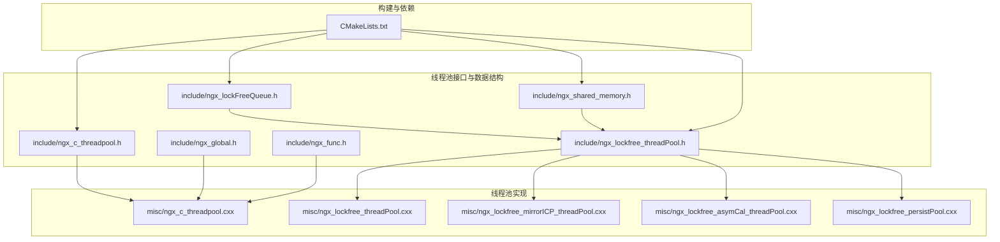
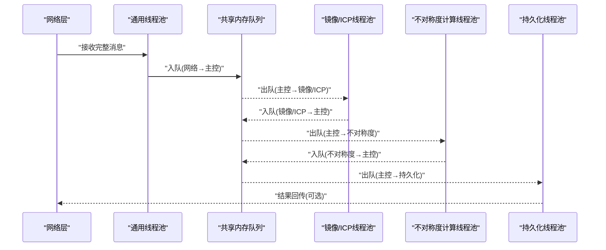
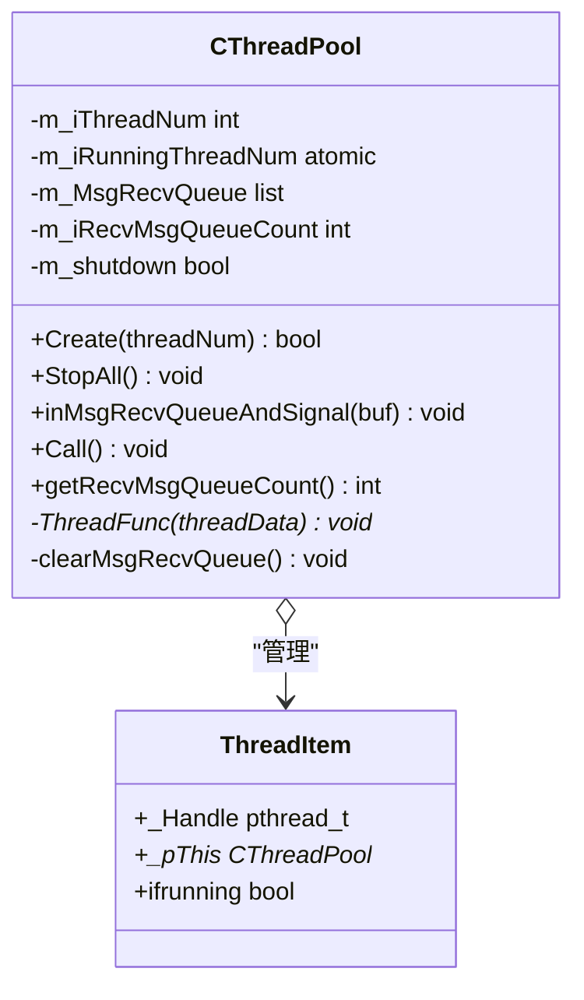
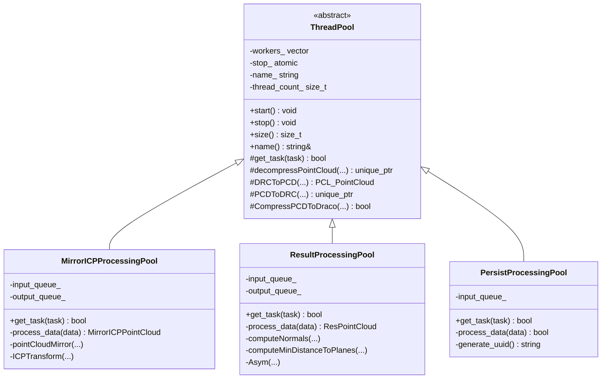
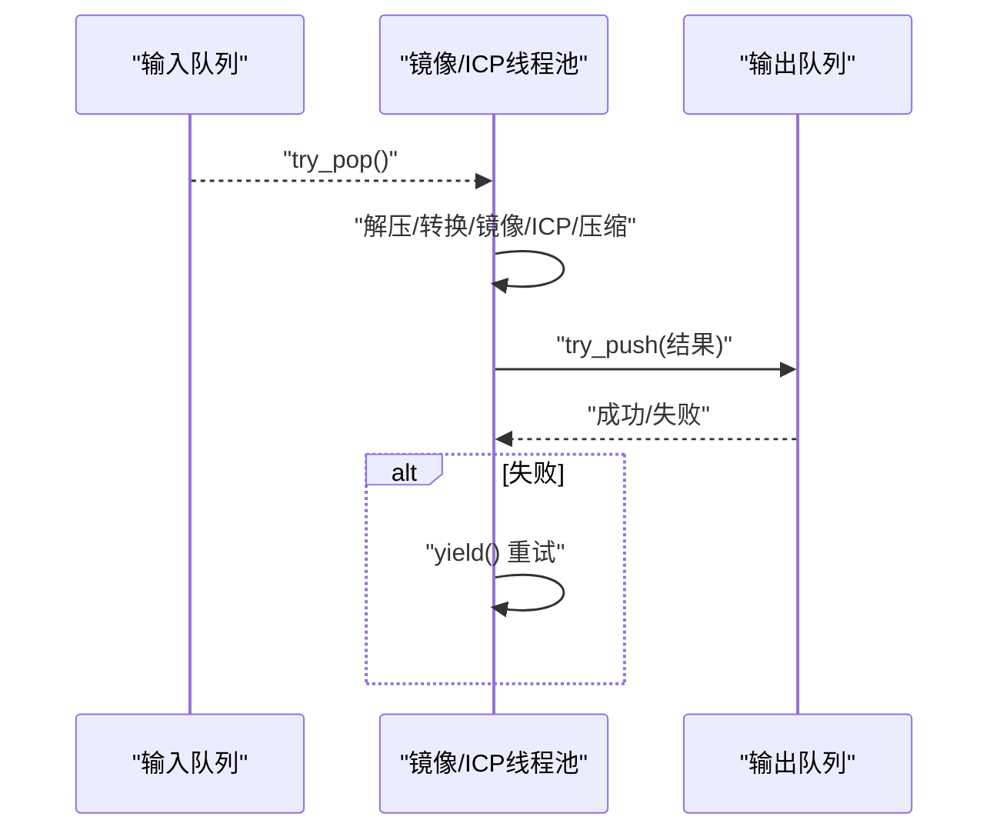
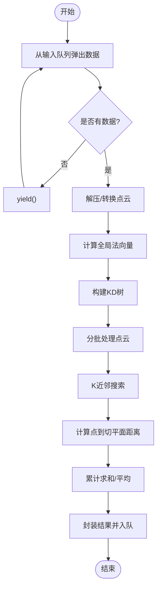
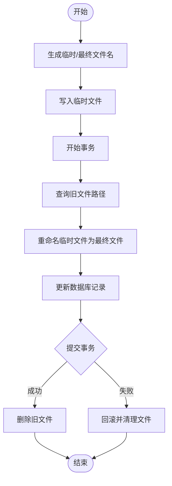
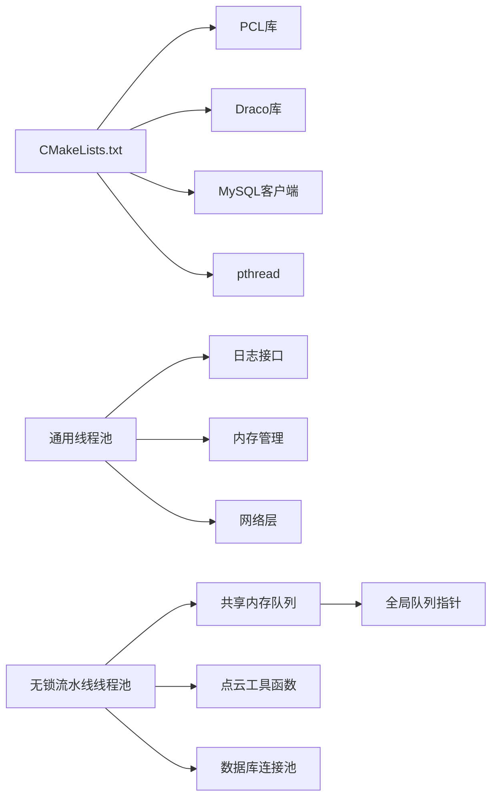

# 线程池系统

<cite>
**本文引用的文件**
- [include/ngx_c_threadpool.h](file://include/ngx_c_threadpool.h)
- [misc/ngx_c_threadpool.cxx](file://misc/ngx_c_threadpool.cxx)
- [include/ngx_lockfree_threadPool.h](file://include/ngx_lockfree_threadPool.h)
- [misc/ngx_lockfree_threadPool.cxx](file://misc/ngx_lockfree_threadPool.cxx)
- [misc/ngx_lockfree_mirrorICP_threadPool.cxx](file://misc/ngx_lockfree_mirrorICP_threadPool.cxx)
- [misc/ngx_lockfree_asymCal_threadPool.cxx](file://misc/ngx_lockfree_asymCal_threadPool.cxx)
- [misc/ngx_lockfree_persistPool.cxx](file://misc/ngx_lockfree_persistPool.cxx)
- [include/ngx_lockFreeQueue.h](file://include/ngx_lockFreeQueue.h)
- [include/ngx_shared_memory.h](file://include/ngx_shared_memory.h)
- [include/ngx_global.h](file://include/ngx_global.h)
- [include/ngx_func.h](file://include/ngx_func.h)
- [CMakeLists.txt](file://CMakeLists.txt)
</cite>

## 目录
1. [简介](#简介)
2. [项目结构](#项目结构)
3. [核心组件](#核心组件)
4. [架构总览](#架构总览)
5. [组件详解](#组件详解)
6. [依赖关系分析](#依赖关系分析)
7. [性能考量](#性能考量)
8. [故障排查指南](#故障排查指南)
9. [结论](#结论)
10. [附录](#附录)

## 简介
本技术文档围绕线程池系统展开，系统包含两类线程池实现：
- 通用阻塞式线程池：基于互斥锁与条件变量，适用于消息接收与处理的同步场景。
- 无锁流水线线程池：基于无锁环形队列与多阶段流水线，适用于点云镜像/ICP、不对称度计算、持久化等高吞吐计算与I/O密集型任务。

文档将深入解析任务队列管理、资源控制、负载均衡策略、锁机制与并发控制、参数调优、性能监控与故障恢复，并给出典型使用模式与配置建议。

## 项目结构
项目采用模块化组织，线程池相关代码主要分布在 include 与 misc 目录：
- include：线程池接口、无锁队列、共享内存队列与全局声明
- misc：线程池实现与各功能线程池的具体处理逻辑
- 其他目录：网络、进程、信号、持久化等支撑模块

图表来源
- [include/ngx_c_threadpool.h](file://include/ngx_c_threadpool.h#L1-L66)
- [misc/ngx_c_threadpool.cxx](file://misc/ngx_c_threadpool.cxx#L1-L321)
- [include/ngx_lockfree_threadPool.h](file://include/ngx_lockfree_threadPool.h#L1-L144)
- [misc/ngx_lockfree_threadPool.cxx](file://misc/ngx_lockfree_threadPool.cxx#L1-L78)
- [misc/ngx_lockfree_mirrorICP_threadPool.cxx](file://misc/ngx_lockfree_mirrorICP_threadPool.cxx#L1-L94)
- [misc/ngx_lockfree_asymCal_threadPool.cxx](file://misc/ngx_lockfree_asymCal_threadPool.cxx#L1-L205)
- [misc/ngx_lockfree_persistPool.cxx](file://misc/ngx_lockfree_persistPool.cxx#L1-L158)
- [include/ngx_lockFreeQueue.h](file://include/ngx_lockFreeQueue.h#L1-L430)
- [include/ngx_shared_memory.h](file://include/ngx_shared_memory.h#L1-L193)
- [include/ngx_global.h](file://include/ngx_global.h#L1-L47)
- [include/ngx_func.h](file://include/ngx_func.h#L1-L28)
- [CMakeLists.txt](file://CMakeLists.txt#L1-L68)

章节来源
- [CMakeLists.txt](file://CMakeLists.txt#L1-L68)

## 核心组件
- 通用阻塞式线程池：提供消息入队、唤醒与线程生命周期管理，适合同步处理与消息驱动场景。
- 无锁流水线线程池：抽象基类定义任务获取与优雅停机，子类分别实现镜像/ICP、不对称度计算、持久化三阶段流水线。
- 无锁环形队列：基于原子CAS实现高性能无锁队列，避免伪共享，支持固定容量与容量查询。
- 共享内存队列：通过共享内存暴露全局队列指针，便于跨模块/进程通信。

章节来源
- [include/ngx_c_threadpool.h](file://include/ngx_c_threadpool.h#L9-L63)
- [misc/ngx_c_threadpool.cxx](file://misc/ngx_c_threadpool.cxx#L67-L321)
- [include/ngx_lockfree_threadPool.h](file://include/ngx_lockfree_threadPool.h#L17-L77)
- [include/ngx_lockFreeQueue.h](file://include/ngx_lockFreeQueue.h#L4-L150)
- [include/ngx_shared_memory.h](file://include/ngx_shared_memory.h#L65-L84)

## 架构总览
系统采用“网络接收 → 通用线程池/共享内存队列 → 无锁流水线 → 持久化”的处理链路。通用线程池负责将网络层接收的消息放入共享内存队列，随后由镜像/ICP线程池消费并产出中间结果，再由不对称度计算线程池进一步处理，最终由持久化线程池落盘并更新数据库。

图表来源
- [misc/ngx_c_threadpool.cxx](file://misc/ngx_c_threadpool.cxx#L269-L321)
- [include/ngx_shared_memory.h](file://include/ngx_shared_memory.h#L75-L84)
- [misc/ngx_lockfree_mirrorICP_threadPool.cxx](file://misc/ngx_lockfree_mirrorICP_threadPool.cxx#L14-L33)
- [misc/ngx_lockfree_asymCal_threadPool.cxx](file://misc/ngx_lockfree_asymCal_threadPool.cxx#L22-L40)
- [misc/ngx_lockfree_persistPool.cxx](file://misc/ngx_lockfree_persistPool.cxx#L17-L31)

## 组件详解

### 通用阻塞式线程池（消息接收）
- 设计要点
  - 线程池内部维护消息队列与互斥锁/条件变量，线程在空闲时阻塞等待任务。
  - 提供入队并唤醒单个线程的接口，当线程池饱和时记录紧急告警。
  - 原子计数记录运行中线程数，避免频繁加锁。
- 关键流程
  - 入队：加锁、入队、解锁、唤醒一个等待线程。
  - 工作线程：加锁等待条件变量，取出任务、处理、释放内存、原子计数减一。
  - 停止：广播唤醒所有线程，逐一join并销毁同步原语。

图表来源
- [include/ngx_c_threadpool.h](file://include/ngx_c_threadpool.h#L9-L63)
- [misc/ngx_c_threadpool.cxx](file://misc/ngx_c_threadpool.cxx#L32-L121)

章节来源
- [include/ngx_c_threadpool.h](file://include/ngx_c_threadpool.h#L9-L63)
- [misc/ngx_c_threadpool.cxx](file://misc/ngx_c_threadpool.cxx#L67-L321)

### 无锁流水线线程池（抽象基类）
- 设计要点
  - 抽象基类ThreadPool定义任务类型、工作线程循环、优雅停机与线程数统计。
  - 子类通过虚函数get_task实现从共享内存队列拉取任务并封装为std::function。
  - 提供点云解压/压缩、格式转换等通用工具函数。
- 关键流程
  - start：创建工作线程，循环尝试取任务并执行。
  - stop：设置停止标志并join所有线程。
  - get_task：由子类实现，返回true表示有任务，false表示队列空。

图表来源
- [include/ngx_lockfree_threadPool.h](file://include/ngx_lockfree_threadPool.h#L17-L77)
- [include/ngx_lockfree_threadPool.h](file://include/ngx_lockfree_threadPool.h#L80-L99)
- [include/ngx_lockfree_threadPool.h](file://include/ngx_lockfree_threadPool.h#L102-L120)
- [include/ngx_lockfree_threadPool.h](file://include/ngx_lockfree_threadPool.h#L123-L136)

章节来源
- [include/ngx_lockfree_threadPool.h](file://include/ngx_lockfree_threadPool.h#L17-L144)
- [misc/ngx_lockfree_threadPool.cxx](file://misc/ngx_lockfree_threadPool.cxx#L1-L78)

### 镜像/ICP线程池
- 功能概述：从原始点云镜像变换后与目标点云做ICP配准，再压缩编码并产出中间结果。
- 关键流程：从输入队列尝试弹出数据，封装任务，处理完成后尝试推送到输出队列，失败时自旋重试。

图表来源
- [misc/ngx_lockfree_mirrorICP_threadPool.cxx](file://misc/ngx_lockfree_mirrorICP_threadPool.cxx#L14-L33)
- [misc/ngx_lockfree_mirrorICP_threadPool.cxx](file://misc/ngx_lockfree_mirrorICP_threadPool.cxx#L35-L94)

章节来源
- [misc/ngx_lockfree_mirrorICP_threadPool.cxx](file://misc/ngx_lockfree_mirrorICP_threadPool.cxx#L1-L94)

### 不对称度计算线程池
- 功能概述：基于预计算法向量与KD树，批量计算点到切平面的最小距离，得到不对称度指标。
- 关键流程：从中间结果队列取数据，解压点云，计算法向量，构建KD树，批处理计算平均最小距离，产出最终结果并回传。

图表来源
- [misc/ngx_lockfree_asymCal_threadPool.cxx](file://misc/ngx_lockfree_asymCal_threadPool.cxx#L22-L40)
- [misc/ngx_lockfree_asymCal_threadPool.cxx](file://misc/ngx_lockfree_asymCal_threadPool.cxx#L47-L205)

章节来源
- [misc/ngx_lockfree_asymCal_threadPool.cxx](file://misc/ngx_lockfree_asymCal_threadPool.cxx#L1-L205)

### 持久化线程池
- 功能概述：将最终结果写入临时文件，重命名为最终文件，数据库事务更新记录，必要时回滚并清理。
- 关键流程：生成临时/最终文件名，写入临时文件，开启事务，查询旧文件路径，重命名，更新数据库，提交事务，删除旧文件。

图表来源
- [misc/ngx_lockfree_persistPool.cxx](file://misc/ngx_lockfree_persistPool.cxx#L52-L146)

章节来源
- [misc/ngx_lockfree_persistPool.cxx](file://misc/ngx_lockfree_persistPool.cxx#L1-L158)

### 无锁环形队列与共享内存队列
- 无锁环形队列
  - 使用原子头尾指针与缓存行对齐，避免伪共享。
  - try_push/try_pop基于compare_exchange_weak循环重试，支持固定容量与容量查询。
  - 内存序采用release/relaxed组合，保证可见性与性能平衡。
- 共享内存队列
  - 定义多组全局队列类型别名，通过共享内存映射暴露指针。
  - 提供open_shm_queue/destroy_shm_queue模板函数，支持跨进程安全初始化与销毁。

章节来源
- [include/ngx_lockFreeQueue.h](file://include/ngx_lockFreeQueue.h#L4-L150)
- [include/ngx_shared_memory.h](file://include/ngx_shared_memory.h#L65-L181)

## 依赖关系分析
- 构建与第三方库
  - PCL、Draco、MySQL客户端通过CMake查找并链接。
  - 编译选项包含C++11标准、调试符号与基础告警。
- 模块耦合
  - 通用线程池与网络层通过全局队列交互。
  - 无锁流水线线程池依赖共享内存队列与全局队列指针。
  - 各线程池均依赖通用日志接口与内存管理。

图表来源
- [CMakeLists.txt](file://CMakeLists.txt#L40-L60)
- [include/ngx_func.h](file://include/ngx_func.h#L12-L26)
- [include/ngx_global.h](file://include/ngx_global.h#L27-L46)

章节来源
- [CMakeLists.txt](file://CMakeLists.txt#L1-L68)
- [include/ngx_func.h](file://include/ngx_func.h#L1-L28)
- [include/ngx_global.h](file://include/ngx_global.h#L1-L47)

## 性能考量
- 无锁队列优势
  - 消除线程阻塞与上下文切换开销，降低锁竞争，具备更好的线性可伸缩性。
  - 通过缓存行对齐避免伪共享，提高多核并发性能。
- 线程池选择
  - 通用阻塞式线程池适合同步处理与消息驱动，简单可靠。
  - 无锁流水线适合CPU密集型与I/O混合场景，吞吐更高但实现复杂度更高。
- 参数调优建议
  - 线程数：根据CPU核心数与任务类型设定，避免过度并发导致上下文切换开销。
  - 队列容量：QUEUE_SIZE应为2的幂次，结合生产/消费速率调整，避免频繁满/空。
  - 重试策略：子线程池在队列入队失败时采用yield()短让，平衡CPU占用与延迟。
- 监控与观测
  - 通用线程池在饱和时记录紧急告警，可用于动态扩缩容决策。
  - 无锁队列提供size/capacity查询，便于观察背压情况。

[本节为通用性能指导，不直接分析具体文件]

## 故障排查指南
- 通用线程池
  - 线程创建失败：检查系统线程上限与权限，关注pthread_create错误码。
  - 停止异常：确认广播唤醒与join顺序，避免重复join与分离线程问题。
  - 紧急告警：线程池饱和时记录告警，建议评估扩容或降载。
- 无锁流水线
  - 队列入队失败：检查队列容量与消费者速度，必要时增大线程数或队列大小。
  - 数据库事务失败：捕获异常并回滚，清理临时文件，确保幂等性。
- 共享内存
  - 映射失败：检查共享内存名称与权限，确认ftruncate/mmap返回值。
  - 析构顺序：先显式析构对象，再munmap与shm_unlink。

章节来源
- [misc/ngx_c_threadpool.cxx](file://misc/ngx_c_threadpool.cxx#L77-L106)
- [misc/ngx_c_threadpool.cxx](file://misc/ngx_c_threadpool.cxx#L199-L264)
- [misc/ngx_lockfree_persistPool.cxx](file://misc/ngx_lockfree_persistPool.cxx#L136-L146)
- [include/ngx_shared_memory.h](file://include/ngx_shared_memory.h#L87-L181)

## 结论
本线程池系统通过“通用阻塞式线程池 + 无锁流水线”的组合，兼顾可靠性与高性能。通用线程池承担消息接收与同步处理，无锁流水线实现高吞吐的点云处理链路。配合无锁队列与共享内存，系统在多核环境下具备良好的可伸缩性与可观测性。建议在生产环境中结合监控指标动态调整线程数与队列容量，并完善异常处理与资源回收策略。

[本节为总结性内容，不直接分析具体文件]

## 附录

### 使用模式与配置方法
- 通用阻塞式线程池
  - 创建线程池并设置线程数量，接收消息后入队并唤醒工作线程。
  - 停止时广播唤醒并join所有线程，确保资源释放。
- 无锁流水线线程池
  - 构造时指定线程数与输入/输出队列，start后自动运行。
  - get_task中实现从共享内存队列取任务并封装为任务函数。
- 共享内存队列
  - 通过open_shm_queue创建并映射，使用placement new初始化，destroy_shm_queue负责析构与清理。

章节来源
- [misc/ngx_c_threadpool.cxx](file://misc/ngx_c_threadpool.cxx#L67-L121)
- [include/ngx_lockfree_threadPool.h](file://include/ngx_lockfree_threadPool.h#L22-L58)
- [include/ngx_shared_memory.h](file://include/ngx_shared_memory.h#L87-L181)