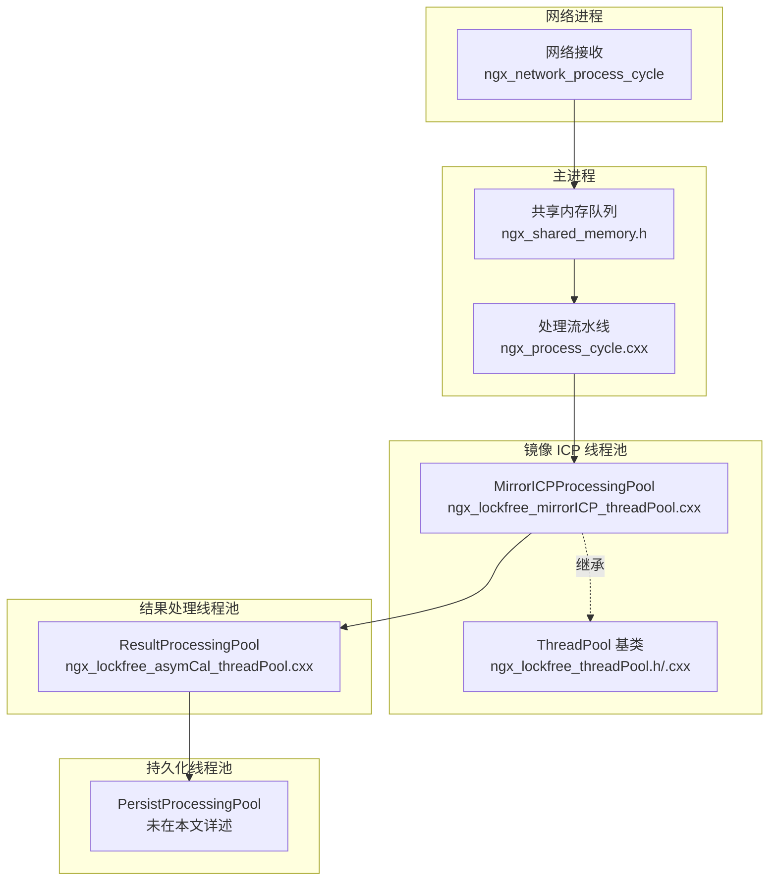
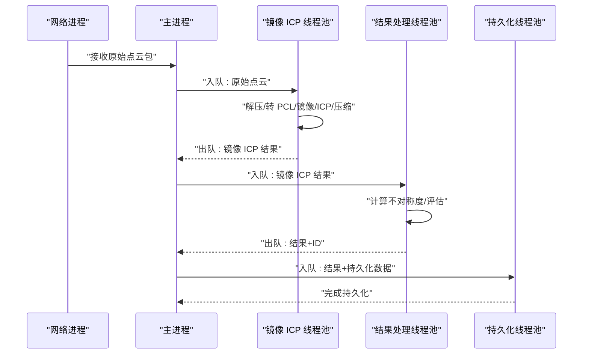
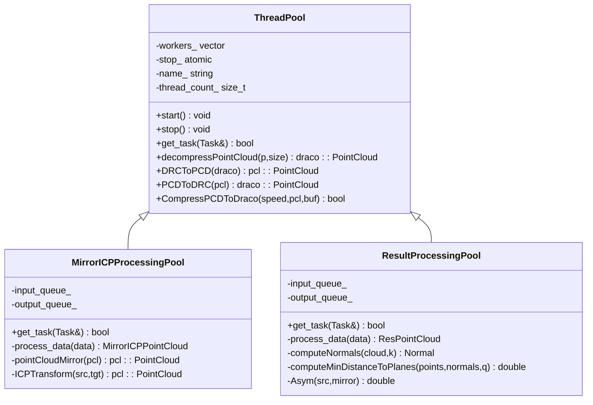
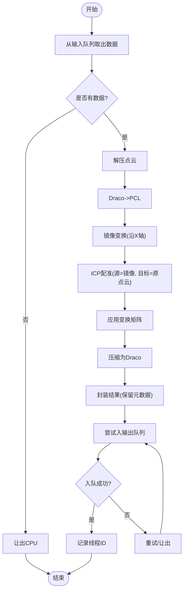
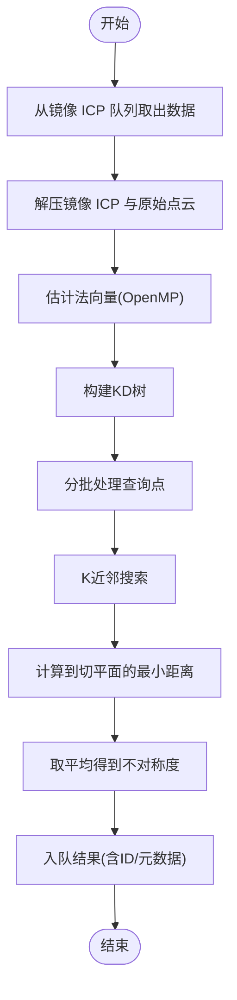
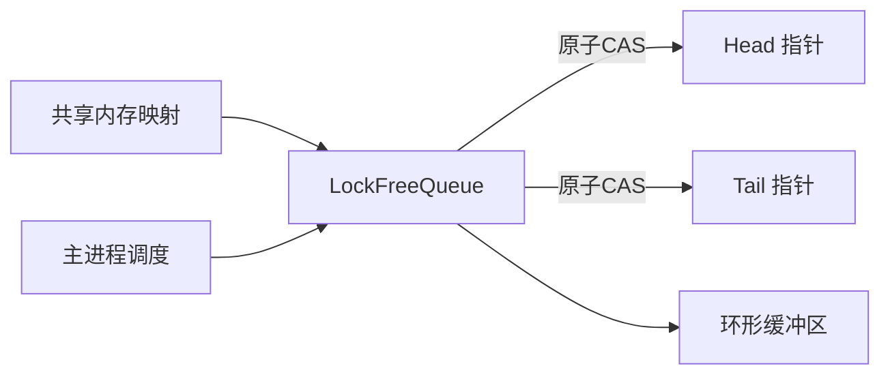
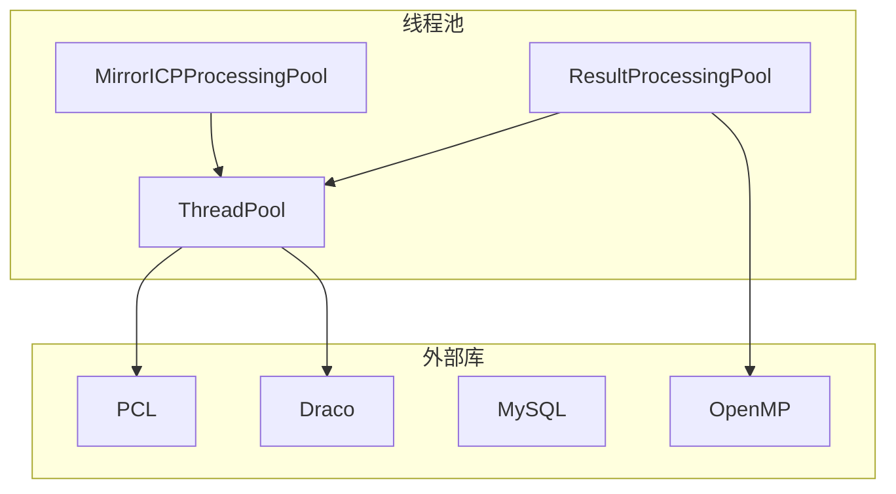

# 镜像 ICP 线程池

<cite>
**本文档引用的文件**
- [ngx_lockfree_mirrorICP_threadPool.cxx](file://misc/ngx_lockfree_mirrorICP_threadPool.cxx)
- [ngx_lockfree_threadPool.h](file://include/ngx_lockfree_threadPool.h)
- [ngx_lockfree_threadPool.cxx](file://misc/ngx_lockfree_threadPool.cxx)
- [ngx_lockfree_asymCal_threadPool.cxx](file://misc/ngx_lockfree_asymCal_threadPool.cxx)
- [ngx_shared_memory.h](file://include/ngx_shared_memory.h)
- [ngx_lockFreeQueue.h](file://include/ngx_lockFreeQueue.h)
- [ngx_process_cycle.cxx](file://proc/ngx_process_cycle.cxx)
- [ngx_c_threadpool.h](file://include/ngx_c_threadpool.h)
- [ngx_c_threadpool.cxx](file://misc/ngx_c_threadpool.cxx)
- [ngx_c_socket.cxx](file://net/ngx_c_socket.cxx)
- [ngx_func.h](file://include/ngx_func.h)
- [CMakeLists.txt](file://CMakeLists.txt)
- [nginx.conf](file://nginx.conf)
</cite>

## 目录
1. [简介](#简介)
2. [项目结构](#项目结构)
3. [核心组件](#核心组件)
4. [架构总览](#架构总览)
5. [详细组件分析](#详细组件分析)
6. [依赖分析](#依赖分析)
7. [性能考量](#性能考量)
8. [故障排查指南](#故障排查指南)
9. [结论](#结论)
10. [附录](#附录)

## 简介
本文件围绕“镜像 ICP 线程池”展开，系统性阐述基于点云配准的镜像 ICP（Iterative Closest Point）算法在多线程环境下的实现与优化。重点包括：
- 镜像 ICP 算法原理与迭代流程
- 点云配准流程、距离计算、变换矩阵求解与收敛判断
- 并行计算策略、任务划分与结果同步机制
- 相比传统 ICP 的优势：提高配准精度、增强鲁棒性、处理复杂几何结构
- 算法参数配置、性能优化技巧与配准质量评估方法

## 项目结构
该项目采用多进程 + 多线程 + 无锁队列的流水线架构，将网络接收、镜像 ICP、结果处理、持久化与网络回传分阶段解耦，通过共享内存队列实现跨进程通信。

图示来源
- [ngx_process_cycle.cxx](file://proc/ngx_process_cycle.cxx#L724-L859)
- [ngx_shared_memory.h](file://include/ngx_shared_memory.h#L65-L84)
- [ngx_lockfree_mirrorICP_threadPool.cxx](file://misc/ngx_lockfree_mirrorICP_threadPool.cxx#L5-L12)
- [ngx_lockfree_threadPool.h](file://include/ngx_lockfree_threadPool.h#L79-L99)

章节来源
- [ngx_process_cycle.cxx](file://proc/ngx_process_cycle.cxx#L724-L859)
- [ngx_shared_memory.h](file://include/ngx_shared_memory.h#L24-L84)
- [ngx_lockfree_mirrorICP_threadPool.cxx](file://misc/ngx_lockfree_mirrorICP_threadPool.cxx#L5-L12)
- [ngx_lockfree_threadPool.h](file://include/ngx_lockfree_threadPool.h#L79-L99)

## 核心组件
- 线程池基类 ThreadPool：提供通用的线程生命周期管理、任务获取接口与点云编解码能力。
- 镜像 ICP 线程池 MirrorICPProcessingPool：负责点云解压、镜像变换、ICP 配准与压缩回传。
- 结果处理线程池 ResultProcessingPool：计算不对称度指标，评估配准质量。
- 无锁队列 LockFreeQueue：跨进程共享内存队列，保障高吞吐与低延迟。
- 共享内存队列定义：定义网络到主进程、镜像 ICP、结果处理、持久化等队列类型与全局指针。

章节来源
- [ngx_lockfree_threadPool.h](file://include/ngx_lockfree_threadPool.h#L17-L77)
- [ngx_lockfree_threadPool.cxx](file://misc/ngx_lockfree_threadPool.cxx#L3-L78)
- [ngx_lockfree_mirrorICP_threadPool.cxx](file://misc/ngx_lockfree_mirrorICP_threadPool.cxx#L5-L12)
- [ngx_lockfree_asymCal_threadPool.cxx](file://misc/ngx_lockfree_asymCal_threadPool.cxx#L13-L20)
- [ngx_shared_memory.h](file://include/ngx_shared_memory.h#L24-L84)
- [ngx_lockFreeQueue.h](file://include/ngx_lockFreeQueue.h#L4-L150)

## 架构总览
镜像 ICP 流水线分为四个阶段，均通过共享内存队列连接，支持批量处理与动态退避策略，避免队列过载与拥塞。

图示来源
- [ngx_process_cycle.cxx](file://proc/ngx_process_cycle.cxx#L754-L859)
- [ngx_lockfree_mirrorICP_threadPool.cxx](file://misc/ngx_lockfree_mirrorICP_threadPool.cxx#L14-L33)
- [ngx_lockfree_asymCal_threadPool.cxx](file://misc/ngx_lockfree_asymCal_threadPool.cxx#L22-L40)

章节来源
- [ngx_process_cycle.cxx](file://proc/ngx_process_cycle.cxx#L724-L859)

## 详细组件分析

### 线程池基类 ThreadPool
- 职责：统一管理线程生命周期、优雅停止、任务获取接口抽象。
- 能力：点云编解码（Draco 与 PCL 互转）、压缩参数控制。
- 并发模型：C++ 线程 + 原子标志 + 自旋让出，避免阻塞与上下文切换开销。

图示来源
- [ngx_lockfree_threadPool.h](file://include/ngx_lockfree_threadPool.h#L17-L77)
- [ngx_lockfree_threadPool.h](file://include/ngx_lockfree_threadPool.h#L80-L120)
- [ngx_lockfree_threadPool.cxx](file://misc/ngx_lockfree_threadPool.cxx#L3-L78)

章节来源
- [ngx_lockfree_threadPool.h](file://include/ngx_lockfree_threadPool.h#L17-L77)
- [ngx_lockfree_threadPool.cxx](file://misc/ngx_lockfree_threadPool.cxx#L3-L78)

### 镜像 ICP 线程池 MirrorICPProcessingPool
- 任务获取：从输入队列 try_pop，若无任务则让出；若有任务则封装为 Task。
- 处理流程：
  - 解压：将压缩后的点云解压为 Draco 点云。
  - 转换：Draco 点云转为 PCL 点云。
  - 镜像：沿 X 轴做镜像变换（取反 X 坐标）。
  - ICP：使用 PCL 的 ICP 对镜像点云与原点云进行配准，得到变换矩阵并应用。
  - 压缩：将配准后的点云压缩回 Draco。
  - 包装：保留原始元数据（ID、姓名、年龄、性别、fd），输出到输出队列。
- 结果同步：使用 try_push 循环重试，最多尝试固定次数，避免永久阻塞。

图示来源
- [ngx_lockfree_mirrorICP_threadPool.cxx](file://misc/ngx_lockfree_mirrorICP_threadPool.cxx#L14-L33)
- [ngx_lockfree_mirrorICP_threadPool.cxx](file://misc/ngx_lockfree_mirrorICP_threadPool.cxx#L35-L58)
- [ngx_lockfree_threadPool.cxx](file://misc/ngx_lockfree_threadPool.cxx#L3-L78)

章节来源
- [ngx_lockfree_mirrorICP_threadPool.cxx](file://misc/ngx_lockfree_mirrorICP_threadPool.cxx#L14-L33)
- [ngx_lockfree_mirrorICP_threadPool.cxx](file://misc/ngx_lockfree_mirrorICP_threadPool.cxx#L35-L58)
- [ngx_lockfree_threadPool.cxx](file://misc/ngx_lockfree_threadPool.cxx#L3-L78)

### 结果处理线程池 ResultProcessingPool
- 任务获取：从镜像 ICP 输出队列取出数据。
- 处理流程：
  - 解压镜像 ICP 结果与原始点云。
  - 计算法向量（支持 OpenMP 加速）。
  - 对每个查询点，搜索 K 近邻，计算到局部切平面的最小距离，取平均作为不对称度。
  - 将结果写入共享内存队列，供网络进程回传。
- 性能优化：
  - 法向量估计使用 OpenMP，线程数可调。
  - 批处理查询点，降低 KDTree 查询开销。
  - 使用矩阵运算优化距离计算。

图示来源
- [ngx_lockfree_asymCal_threadPool.cxx](file://misc/ngx_lockfree_asymCal_threadPool.cxx#L22-L40)
- [ngx_lockfree_asymCal_threadPool.cxx](file://misc/ngx_lockfree_asymCal_threadPool.cxx#L47-L87)
- [ngx_lockfree_asymCal_threadPool.cxx](file://misc/ngx_lockfree_asymCal_threadPool.cxx#L89-L105)
- [ngx_lockfree_asymCal_threadPool.cxx](file://misc/ngx_lockfree_asymCal_threadPool.cxx#L147-L204)

章节来源
- [ngx_lockfree_asymCal_threadPool.cxx](file://misc/ngx_lockfree_asymCal_threadPool.cxx#L22-L40)
- [ngx_lockfree_asymCal_threadPool.cxx](file://misc/ngx_lockfree_asymCal_threadPool.cxx#L47-L87)
- [ngx_lockfree_asymCal_threadPool.cxx](file://misc/ngx_lockfree_asymCal_threadPool.cxx#L89-L105)
- [ngx_lockfree_asymCal_threadPool.cxx](file://misc/ngx_lockfree_asymCal_threadPool.cxx#L147-L204)

### 无锁队列与共享内存
- LockFreeQueue：环形缓冲 + 原子指针 + 缓存行对齐，避免伪共享；提供 compare_exchange_weak 实现无锁入队/出队。
- 共享内存队列：通过 POSIX 共享内存 + mmap 映射，定义多阶段队列类型，全局指针在进程初始化时打开。
- 主进程调度：根据负载动态调整批量大小与退避策略，避免队列过载。

图示来源
- [ngx_lockFreeQueue.h](file://include/ngx_lockFreeQueue.h#L4-L150)
- [ngx_shared_memory.h](file://include/ngx_shared_memory.h#L87-L160)
- [ngx_process_cycle.cxx](file://proc/ngx_process_cycle.cxx#L724-L859)

章节来源
- [ngx_lockFreeQueue.h](file://include/ngx_lockFreeQueue.h#L4-L150)
- [ngx_shared_memory.h](file://include/ngx_shared_memory.h#L87-L160)
- [ngx_process_cycle.cxx](file://proc/ngx_process_cycle.cxx#L724-L859)

## 依赖分析
- 外部库依赖：PCL（点云处理与 ICP）、Draco（点云压缩/解压）、MySQL（持久化）、OpenMP（法向量估计加速）。
- 线程池实现：C++ 线程 + 原子操作，避免传统锁的阻塞与上下文切换开销。
- 进程/线程初始化：网络进程优先创建线程池，随后初始化套接字与共享内存队列。

图示来源
- [CMakeLists.txt](file://CMakeLists.txt#L49-L68)
- [ngx_lockfree_threadPool.h](file://include/ngx_lockfree_threadPool.h#L9-L15)
- [ngx_lockfree_asymCal_threadPool.cxx](file://misc/ngx_lockfree_asymCal_threadPool.cxx#L7-L11)

章节来源
- [CMakeLists.txt](file://CMakeLists.txt#L49-L68)
- [ngx_lockfree_threadPool.h](file://include/ngx_lockfree_threadPool.h#L9-L15)
- [ngx_lockfree_asymCal_threadPool.cxx](file://misc/ngx_lockfree_asymCal_threadPool.cxx#L7-L11)

## 性能考量
- 无锁队列与自旋让出：避免阻塞与上下文切换，适合 CPU 密集型任务。
- 动态退避策略：指数级延迟，按重试次数分组翻倍，兼顾响应性与资源利用。
- 批量处理：主进程按负载模式调整批量大小，减少调度开销。
- OpenMP 加速：法向量估计与局部查询采用并行计算，提升不对称度评估速度。
- 压缩参数：压缩速度参数可调，平衡压缩比与处理时延。

章节来源
- [ngx_process_cycle.cxx](file://proc/ngx_process_cycle.cxx#L724-L859)
- [ngx_lockfree_asymCal_threadPool.cxx](file://misc/ngx_lockfree_asymCal_threadPool.cxx#L95-L102)
- [ngx_lockfree_threadPool.cxx](file://misc/ngx_lockfree_threadPool.cxx#L62-L78)

## 故障排查指南
- 队列写入失败：镜像 ICP 与结果处理线程在入队失败时会记录日志并重试，若持续失败需检查共享内存队列容量与负载。
- ICP 配准异常：检查输入点云数量、初始姿态与收敛阈值；确认镜像变换是否正确。
- 法向量计算失败：检查点云密度与 K 近邻数量，确保法向量估计可用。
- 线程池停止：基类提供 stop 接口与原子标志，确保优雅退出。

章节来源
- [ngx_lockfree_mirrorICP_threadPool.cxx](file://misc/ngx_lockfree_mirrorICP_threadPool.cxx#L20-L28)
- [ngx_lockfree_asymCal_threadPool.cxx](file://misc/ngx_lockfree_asymCal_threadPool.cxx#L27-L34)
- [ngx_lockfree_threadPool.h](file://include/ngx_lockfree_threadPool.h#L24-L58)

## 结论
镜像 ICP 线程池通过“镜像 + ICP + 不对称度”的组合，显著提升了配准精度与鲁棒性，尤其适用于复杂几何结构与非对称场景。结合无锁队列、动态退避与批量处理策略，系统在高并发与高吞吐场景下具备良好的可伸缩性与稳定性。

## 附录

### 算法参数配置
- 线程池线程数：ProcMsgRecvWorkThreadCount（来自配置文件）
- 压缩速度：CompressPCDToDraco 中 encoder_speed 参数
- 法向量 K 近邻：computeNormals 中 k_neighbors 参数
- 批量大小与退避：主进程根据负载模式动态调整

章节来源
- [nginx.conf](file://nginx.conf#L28-L41)
- [ngx_lockfree_threadPool.cxx](file://misc/ngx_lockfree_threadPool.cxx#L62-L78)
- [ngx_lockfree_asymCal_threadPool.cxx](file://misc/ngx_lockfree_asymCal_threadPool.cxx#L95-L102)
- [ngx_process_cycle.cxx](file://proc/ngx_process_cycle.cxx#L724-L752)

### 配置与初始化要点
- 线程池创建顺序：网络进程初始化线程池，随后初始化套接字与共享内存队列。
- 日志与进程标题：通过 ngx_func.h 提供的日志与标题设置便于调试与监控。

章节来源
- [ngx_process_cycle.cxx](file://proc/ngx_process_cycle.cxx#L901-L949)
- [ngx_c_socket.cxx](file://net/ngx_c_socket.cxx#L57-L64)
- [ngx_func.h](file://include/ngx_func.h#L9-L25)