# Socket 基础框架

<cite>
**本文档引用的文件**
- [ngx_c_socket.h](file://include/ngx_c_socket.h)
- [ngx_c_socket.cxx](file://net/ngx_c_socket.cxx)
- [ngx_c_conf.h](file://include/ngx_c_conf.h)
- [ngx_c_conf.cxx](file://app/ngx_c_conf.cxx)
- [ngx_c_slogic.h](file://include/ngx_c_slogic.h)
- [nginx.cxx](file://app/nginx.cxx)
- [nginx.conf](file://nginx.conf)
- [ngx_macro.h](file://include/ngx_macro.h)
- [ngx_func.h](file://include/ngx_func.h)
- [ngx_global.h](file://include/ngx_global.h)
</cite>

## 目录
1. [简介](#简介)
2. [项目结构](#项目结构)
3. [核心组件](#核心组件)
4. [架构概览](#架构概览)
5. [详细组件分析](#详细组件分析)
6. [依赖关系分析](#依赖关系分析)
7. [性能考量](#性能考量)
8. [故障排除指南](#故障排除指南)
9. [结论](#结论)
10. [附录](#附录)

## 简介

Socket 基础框架是一个高性能的网络通信框架，采用 Reactor 模式和多线程架构设计，支持高并发的 TCP 连接处理。该框架基于 epoll 事件驱动机制，提供了完整的连接管理、数据收发、心跳检测和网络安全防护功能。

框架的核心特点包括：
- 基于 epoll 的异步事件驱动模型
- 多线程架构，包含发送队列线程、连接回收线程、定时器监控线程等
- 完整的连接池管理和生命周期控制
- 网络安全防护机制，包括 Flood 攻击检测
- 灵活的配置管理系统

## 项目结构

该项目采用模块化设计，按照功能层次组织代码结构：

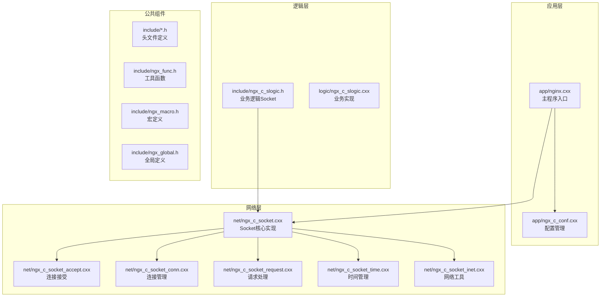

**图表来源**
- [nginx.cxx](file://app/nginx.cxx#L1-L197)
- [ngx_c_socket.cxx](file://net/ngx_c_socket.cxx#L1-L1106)

**章节来源**
- [nginx.cxx](file://app/nginx.cxx#L1-L197)
- [nginx.conf](file://nginx.conf#L1-L63)

## 核心组件

### CSocekt 类设计

CSocekt 是整个 Socket 框架的核心类，采用面向对象设计，提供了完整的网络通信功能。

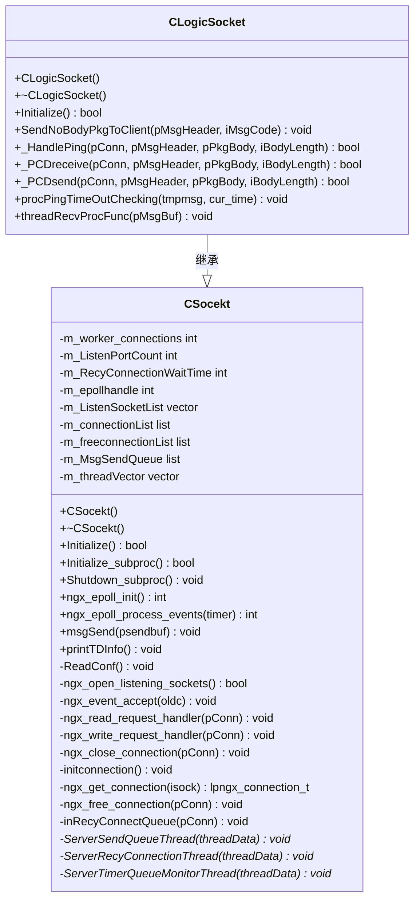

**图表来源**
- [ngx_c_socket.h](file://include/ngx_c_socket.h#L103-L255)
- [ngx_c_slogic.h](file://include/ngx_c_slogic.h#L13-L37)

### 数据结构设计

框架定义了多个关键数据结构来管理网络连接和数据流：

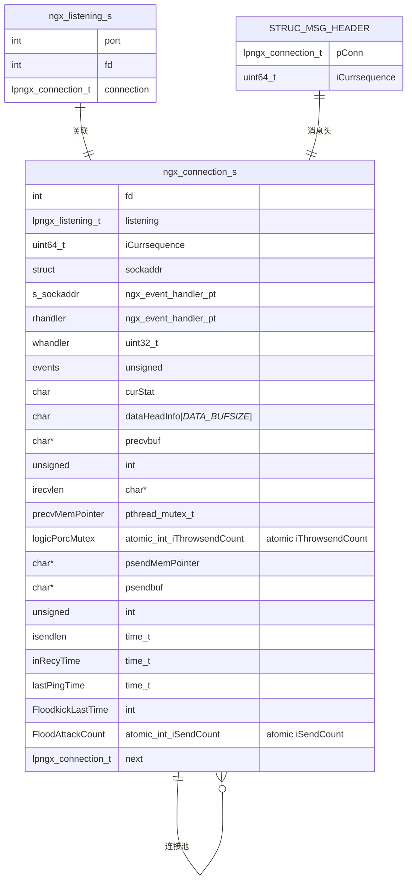

**图表来源**
- [ngx_c_socket.h](file://include/ngx_c_socket.h#L22-L91)

**章节来源**
- [ngx_c_socket.h](file://include/ngx_c_socket.h#L1-L258)

## 架构概览

### 整体架构设计

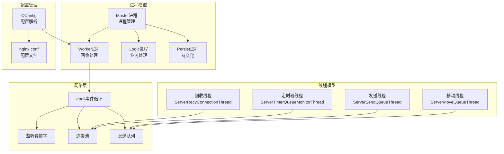

**图表来源**
- [nginx.cxx](file://app/nginx.cxx#L139-L172)
- [ngx_c_socket.cxx](file://net/ngx_c_socket.cxx#L115-L158)

### 生命周期管理流程

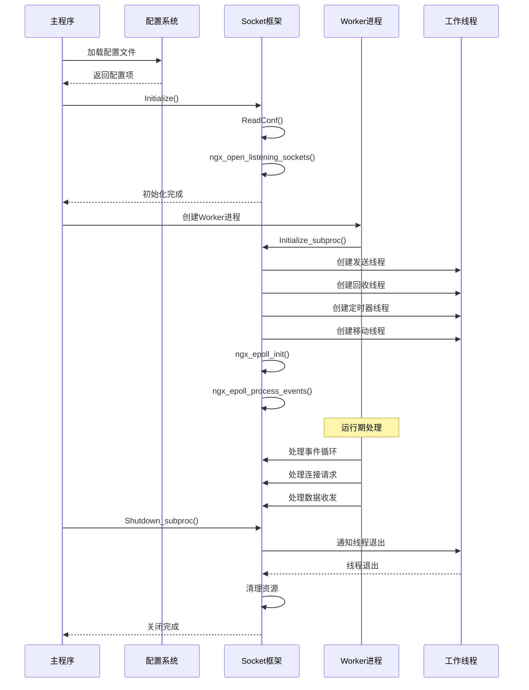

**图表来源**
- [ngx_c_socket.cxx](file://net/ngx_c_socket.cxx#L58-L64)
- [ngx_c_socket.cxx](file://net/ngx_c_socket.cxx#L67-L159)
- [ngx_c_socket.cxx](file://net/ngx_c_socket.cxx#L177-L210)

## 详细组件分析

### 配置管理系统

配置系统采用单例模式设计，提供了灵活的配置读取机制：

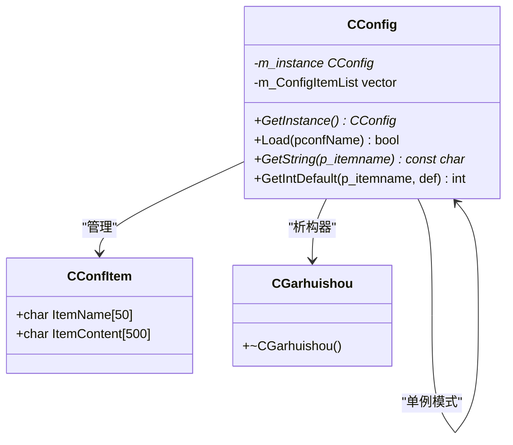

**图表来源**
- [ngx_c_conf.h](file://include/ngx_c_conf.h#L8-L53)
- [ngx_c_conf.cxx](file://app/ngx_c_conf.cxx#L12-L27)

配置参数详解：

| 参数名称 | 默认值 | 作用描述 |
|---------|--------|----------|
| worker_connections | 1 | 每个worker进程允许的最大连接数 |
| ListenPortCount | 1 | 监听的端口数量 |
| Sock_RecyConnectionWaitTime | 60 | 连接回收等待时间（秒） |
| Sock_WaitTimeEnable | 0 | 是否启用心跳检测 |
| Sock_MaxWaitTime | 0 | 心跳检测间隔（秒） |
| Sock_TimeOutKick | 0 | 是否超时踢出 |
| Sock_FloodAttackKickEnable | 0 | 是否启用Flood攻击检测 |
| Sock_FloodTimeInterval | 100 | Flood检测时间间隔（毫秒） |
| Sock_FloodKickCounter | 10 | Flood踢出阈值 |

**章节来源**
- [ngx_c_socket.cxx](file://net/ngx_c_socket.cxx#L227-L244)
- [nginx.conf](file://nginx.conf#L32-L61)

### 连接池管理

连接池是框架的核心组件之一，提供了高效的连接复用机制：

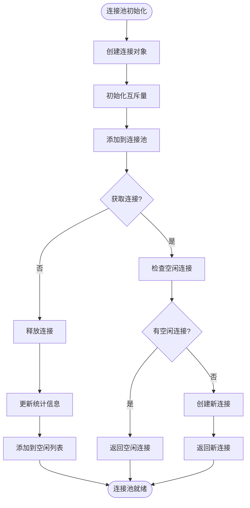

**图表来源**
- [ngx_c_socket.cxx](file://net/ngx_c_socket.cxx#L555-L586)
- [ngx_c_socket.cxx](file://net/ngx_c_socket.cxx#L157-L161)

连接池的关键特性：
- 原子操作保护连接分配和回收
- 空闲连接列表管理
- 连接生命周期跟踪
- 内存池优化

**章节来源**
- [ngx_c_socket.h](file://include/ngx_c_socket.h#L210-L218)
- [ngx_c_socket.cxx](file://net/ngx_c_socket.cxx#L555-L586)

### epoll 事件处理

epoll 事件处理是框架的异步事件驱动核心：

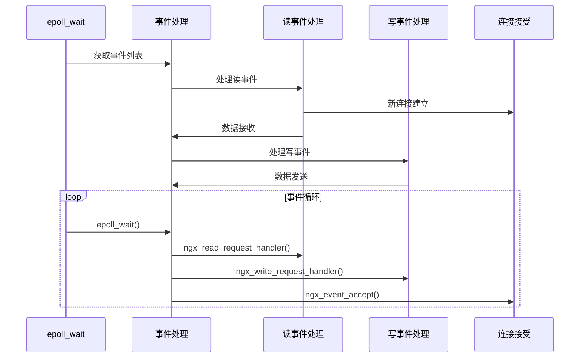

**图表来源**
- [ngx_c_socket.cxx](file://net/ngx_c_socket.cxx#L757-L821)
- [ngx_c_socket.cxx](file://net/ngx_c_socket.cxx#L803-L818)

事件处理流程：
1. epoll_wait 等待事件
2. 根据事件类型调用相应处理函数
3. 读事件：处理新连接或数据接收
4. 写事件：处理数据发送
5. 循环处理直到进程退出

**章节来源**
- [ngx_c_socket.cxx](file://net/ngx_c_socket.cxx#L757-L821)

### 多线程架构

框架采用多线程设计，每个线程负责特定的功能：

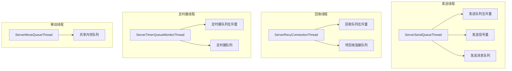

**图表来源**
- [ngx_c_socket.cxx](file://net/ngx_c_socket.cxx#L115-L158)
- [ngx_c_socket.cxx](file://net/ngx_c_socket.cxx#L876-L927)

**章节来源**
- [ngx_c_socket.cxx](file://net/ngx_c_socket.cxx#L115-L158)

## 依赖关系分析

### 外部依赖关系

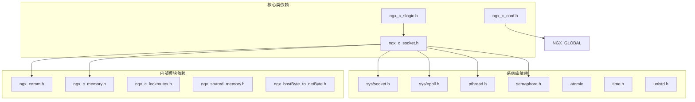

**图表来源**
- [ngx_c_socket.h](file://include/ngx_c_socket.h#L1-L17)
- [ngx_c_socket.cxx](file://net/ngx_c_socket.cxx#L14-L24)

### 内部模块耦合

框架采用松耦合设计，通过接口和抽象类实现模块间的解耦：

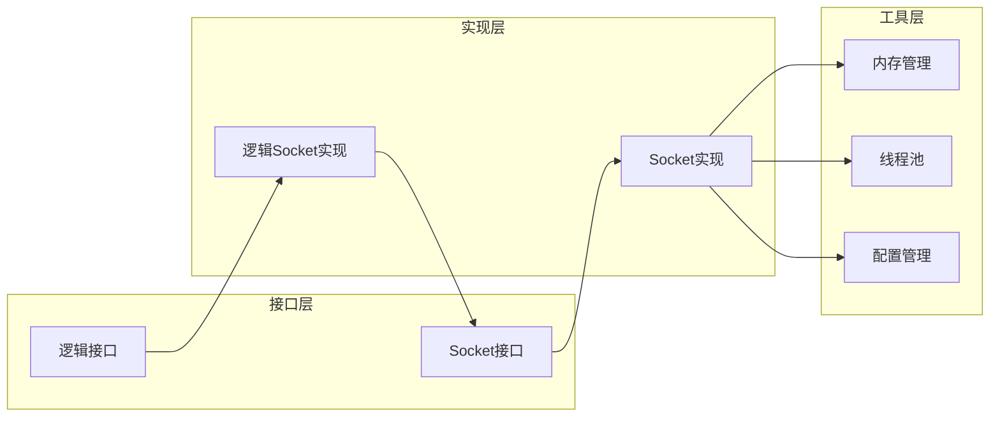

**图表来源**
- [ngx_c_socket.h](file://include/ngx_c_socket.h#L103-L107)
- [ngx_c_slogic.h](file://include/ngx_c_slogic.h#L13-L18)

**章节来源**
- [ngx_c_socket.h](file://include/ngx_c_socket.h#L1-L258)

## 性能考量

### 性能优化策略

1. **epoll 事件驱动**：采用边缘触发模式，减少系统调用次数
2. **连接池复用**：避免频繁的内存分配和释放
3. **多线程分离**：将不同类型的任务分配到不同线程处理
4. **原子操作**：使用原子操作减少锁竞争
5. **非阻塞 I/O**：所有 socket 都设置为非阻塞模式

### 性能监控指标

| 指标名称 | 描述 | 目标值 |
|---------|------|--------|
| 连接池利用率 | 已使用连接/总连接数 | >80% |
| 发送队列长度 | 待发送消息数量 | <50000 |
| 在线用户数 | 当前活跃连接数 | <worker_connections |
| 心跳检测频率 | 每10秒检测一次 | 10秒 |
| 网络安全阈值 | Flood攻击检测 | 10次/100ms |

### 资源管理

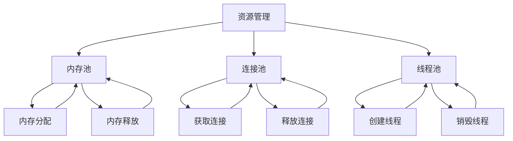

**图表来源**
- [ngx_c_socket.cxx](file://net/ngx_c_socket.cxx#L213-L224)
- [ngx_c_socket.cxx](file://net/ngx_c_socket.cxx#L157-L161)

## 故障排除指南

### 常见错误及解决方案

#### 1. 端口绑定失败

**错误表现**：
- `socket() failed`
- `bind() failed`
- `listen() failed`

**可能原因**：
- 端口已被占用
- 权限不足
- 网络配置错误

**解决方案**：
1. 检查端口占用情况
2. 确认进程权限
3. 验证网络配置

#### 2. epoll 创建失败

**错误表现**：
- `epoll_create() failed`

**可能原因**：
- 系统资源不足
- 文件描述符限制

**解决方案**：
1. 检查系统限制
2. 调整 ulimit 设置
3. 优化资源配置

#### 3. 连接池耗尽

**错误表现**：
- 连接分配失败
- 性能急剧下降

**可能原因**：
- 连接泄漏
- 配置过小

**解决方案**：
1. 检查连接释放逻辑
2. 调整 worker_connections 配置
3. 实施连接超时机制

### 日志记录策略

框架采用分级日志系统：

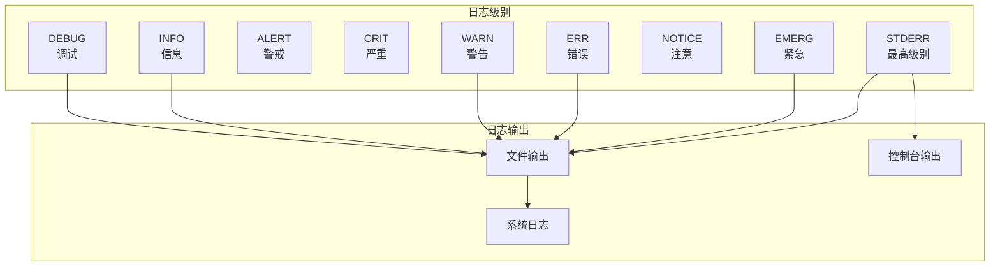

**图表来源**
- [ngx_macro.h](file://include/ngx_macro.h#L18-L27)

**章节来源**
- [ngx_c_socket.cxx](file://net/ngx_c_socket.cxx#L761-L778)
- [ngx_func.h](file://include/ngx_func.h#L12-L20)

## 结论

Socket 基础框架是一个设计精良的高性能网络通信框架，具有以下特点：

1. **架构清晰**：采用模块化设计，职责分离明确
2. **性能优异**：基于 epoll 的异步事件驱动，支持高并发
3. **可靠性强**：完善的错误处理和资源管理机制
4. **可扩展性好**：支持继承和扩展，便于业务定制
5. **配置灵活**：支持多种配置参数，适应不同场景

框架适用于构建高性能的网络服务，如游戏服务器、实时通信系统、数据采集平台等应用场景。

## 附录

### 配置文件示例

nginx.conf 配置文件包含以下关键配置项：

```ini
[Net]
ListenPortCount = 1
ListenPort0 = 8080
worker_connections = 2048
Sock_RecyConnectionWaitTime = 150
Sock_WaitTimeEnable = 1
Sock_MaxWaitTime = 20
Sock_TimeOutKick = 0

[NetSecurity]
Sock_FloodAttackKickEnable = 1
Sock_FloodTimeInterval = 100
Sock_FloodKickCounter = 10
```

### 使用示例

#### 基本使用模式

```cpp
// 1. 创建配置实例
CConfig* config = CConfig::GetInstance();
config->Load("nginx.conf");

// 2. 初始化 Socket 框架
CLogicSocket socket;
if (!socket.Initialize()) {
    // 处理初始化失败
}

// 3. 初始化子进程
if (!socket.Initialize_subproc()) {
    // 处理初始化失败
}

// 4. 运行事件循环
while (!g_stopEvent) {
    socket.ngx_epoll_process_events(-1);
}

// 5. 清理资源
socket.Shutdown_subproc();
```

#### 最佳实践

1. **合理配置连接数**：根据硬件资源和业务需求设置 worker_connections
2. **监控关键指标**：定期检查连接池利用率、发送队列长度等指标
3. **实施安全防护**：启用 Flood 攻击检测和心跳超时机制
4. **优化线程配置**：根据 CPU 核心数合理配置线程数量
5. **错误处理**：实现完善的错误处理和日志记录机制