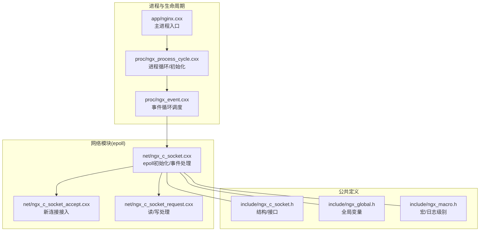
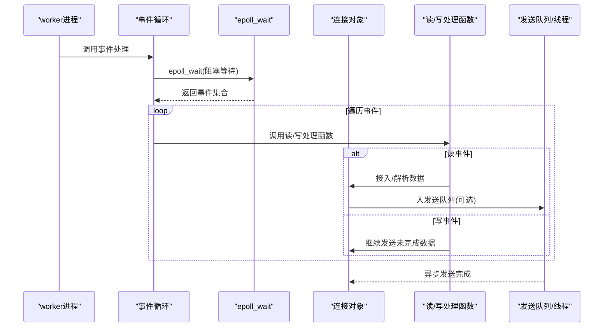
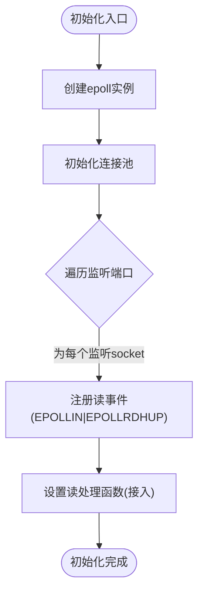
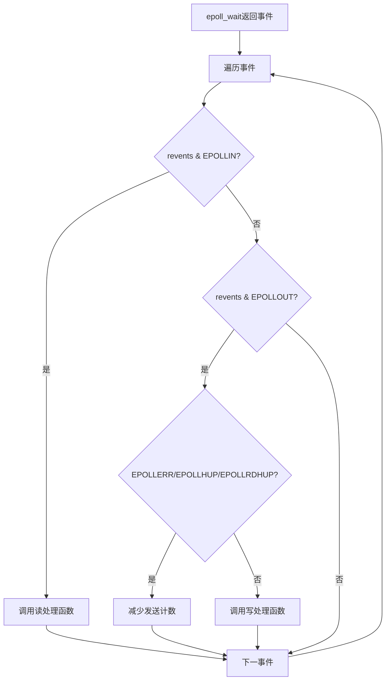
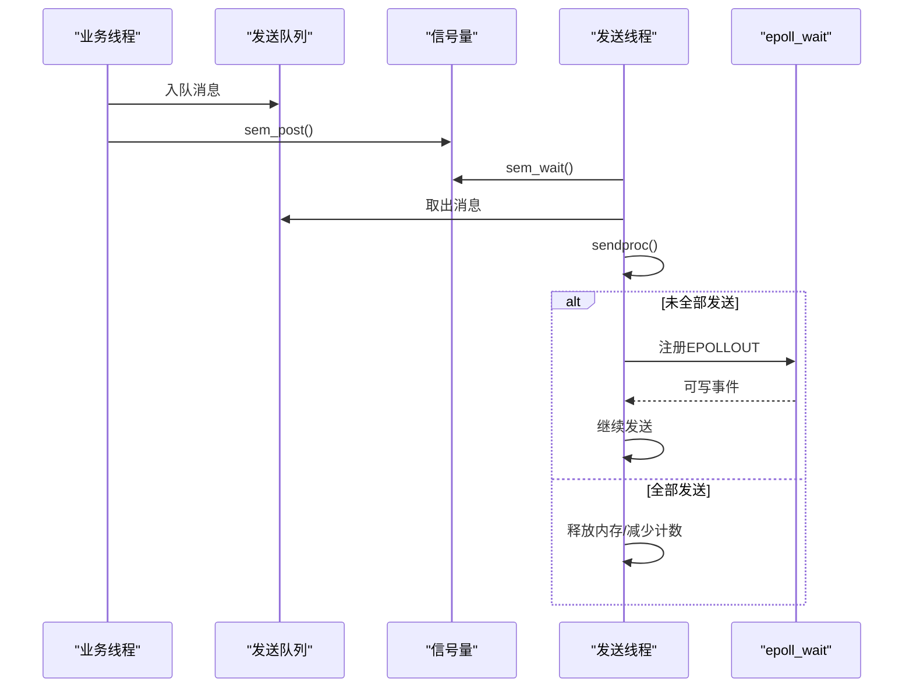
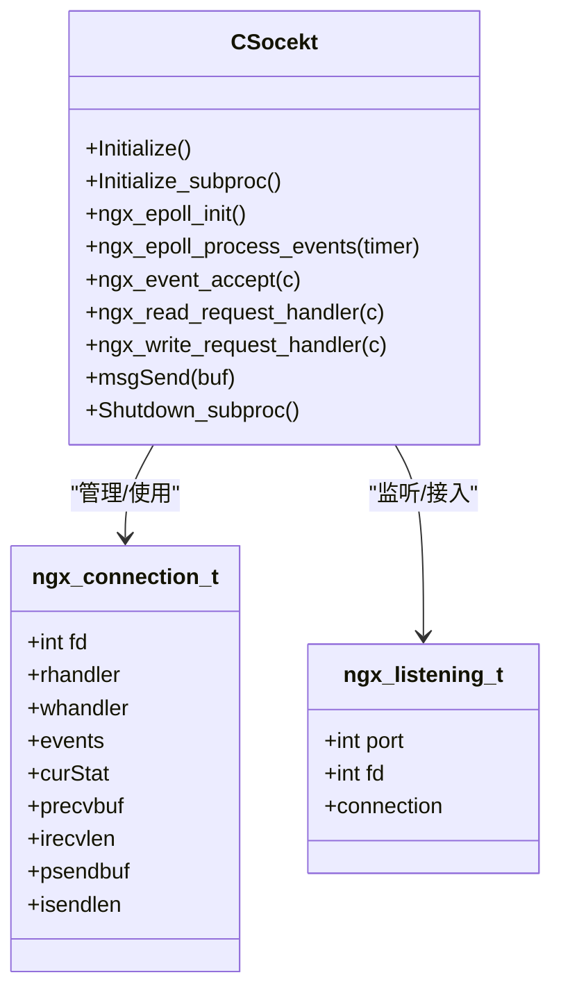

# epoll 事件系统

<cite>
**本文档引用的文件**
- [ngx_event.cxx](file://proc/ngx_event.cxx)
- [ngx_process_cycle.cxx](file://proc/ngx_process_cycle.cxx)
- [ngx_c_socket.cxx](file://net/ngx_c_socket.cxx)
- [ngx_c_socket_accept.cxx](file://net/ngx_c_socket_accept.cxx)
- [ngx_c_socket_request.cxx](file://net/ngx_c_socket_request.cxx)
- [ngx_c_socket.h](file://include/ngx_c_socket.h)
- [ngx_global.h](file://include/ngx_global.h)
- [nginx.cxx](file://app/nginx.cxx)
- [ngx_macro.h](file://include/ngx_macro.h)
</cite>

## 目录
1. [简介](#简介)
2. [项目结构](#项目结构)
3. [核心组件](#核心组件)
4. [架构总览](#架构总览)
5. [详细组件分析](#详细组件分析)
6. [依赖关系分析](#依赖关系分析)
7. [性能考量](#性能考量)
8. [故障排查指南](#故障排查指南)
9. [结论](#结论)

## 简介
本文件面向 epoll 事件系统，系统性阐述基于 epoll 的事件驱动架构设计与实现，涵盖 epoll 实例创建、事件注册、事件处理、事件循环、错误处理与性能优化策略。文档以仓库现有代码为依据，结合架构图与流程图，帮助读者快速理解并掌握 epoll 事件系统的实现要点与最佳实践。

## 项目结构
该项目采用多进程架构，网络模块为独立 worker 进程，通过 epoll 驱动事件循环，配合线程池处理业务逻辑。epoll 事件系统位于网络模块中，核心文件包括：
- 事件循环与进程生命周期：proc/ngx_event.cxx、proc/ngx_process_cycle.cxx
- epoll 核心实现与事件处理：net/ngx_c_socket.cxx、net/ngx_c_socket_accept.cxx、net/ngx_c_socket_request.cxx
- 类型与接口定义：include/ngx_c_socket.h、include/ngx_global.h、include/ngx_macro.h
- 程序入口与进程初始化：app/nginx.cxx



图表来源
- [ngx_process_cycle.cxx](file://proc/ngx_process_cycle.cxx#L901-L963)
- [ngx_event.cxx](file://proc/ngx_event.cxx#L14-L22)
- [ngx_c_socket.cxx](file://net/ngx_c_socket.cxx#L541-L587)
- [ngx_c_socket_accept.cxx](file://net/ngx_c_socket_accept.cxx#L22-L180)
- [ngx_c_socket_request.cxx](file://net/ngx_c_socket_request.cxx#L25-L114)
- [ngx_c_socket.h](file://include/ngx_c_socket.h#L103-L255)
- [ngx_global.h](file://include/ngx_global.h#L27-L46)
- [ngx_macro.h](file://include/ngx_macro.h#L18-L31)

章节来源
- [ngx_process_cycle.cxx](file://proc/ngx_process_cycle.cxx#L901-L963)
- [ngx_event.cxx](file://proc/ngx_event.cxx#L14-L22)
- [ngx_c_socket.cxx](file://net/ngx_c_socket.cxx#L541-L587)

## 核心组件
- CSocekt：网络事件核心类，负责 epoll 初始化、事件注册、事件分发与处理、连接池管理、发送队列与线程协作。
- ngx_connection_t：连接对象，封装 socket、读写回调、事件掩码、收发缓冲与状态机等。
- ngx_listening_t：监听对象，记录监听端口与对应的连接对象。
- 事件循环：worker 进程在循环中调用事件处理函数，内部通过 epoll_wait 阻塞等待事件。
- 线程池：接收事件处理结果，异步发送数据，避免阻塞事件循环。

章节来源
- [ngx_c_socket.h](file://include/ngx_c_socket.h#L37-L91)
- [ngx_c_socket.h](file://include/ngx_c_socket.h#L103-L255)
- [ngx_c_socket.cxx](file://net/ngx_c_socket.cxx#L541-L587)

## 架构总览
epoll 事件系统采用“事件驱动 + 线程池”的架构：
- epoll_wait 阻塞等待事件，事件到达后回调对应连接的读/写处理函数。
- 读事件：新连接接入或已有连接数据到达，分别触发接入处理或数据处理。
- 写事件：发送缓冲区可写，驱动继续发送未完成的数据。
- 线程池：从共享内存或队列取出处理结果，组装包头包体，入发送队列，由发送线程异步发送。



图表来源
- [ngx_process_cycle.cxx](file://proc/ngx_process_cycle.cxx#L912-L921)
- [ngx_event.cxx](file://proc/ngx_event.cxx#L14-L22)
- [ngx_c_socket.cxx](file://net/ngx_c_socket.cxx#L757-L821)
- [ngx_c_socket_request.cxx](file://net/ngx_c_socket_request.cxx#L25-L114)

## 详细组件分析

### epoll 实例创建与初始化
- epoll 实例创建：在子进程初始化阶段调用 epoll_create，传入最大连接数，返回 epoll 文件描述符。
- 监听端口注册：遍历监听套接字，为每个监听 socket 注册读事件（EPOLLIN | EPOLLRDHUP），设置读处理函数为接入处理。
- 连接池初始化：创建连接池，将监听 socket 与连接对象关联，便于后续事件回调时定位连接。



图表来源
- [ngx_c_socket.cxx](file://net/ngx_c_socket.cxx#L541-L587)

章节来源
- [ngx_c_socket.cxx](file://net/ngx_c_socket.cxx#L541-L587)

### 事件注册与事件类型
- 事件类型与掩码：
  - EPOLLIN：可读事件，监听 socket 用于接入新连接，客户端 socket 用于接收数据。
  - EPOLLOUT：可写事件，用于驱动发送未完成的数据。
  - EPOLLRDHUP：对端关闭连接或半关闭，用于及时清理资源。
- 事件注册方式：
  - EPOLL_CTL_ADD：新增事件。
  - EPOLL_CTL_MOD：修改事件掩码（增加/去除/覆盖）。
- 事件数据绑定：通过 epoll_event.data.ptr 将连接对象指针绑定到事件，epoll_wait 返回时可直接取出连接对象。

章节来源
- [ngx_c_socket.cxx](file://net/ngx_c_socket.cxx#L679-L735)
- [ngx_c_socket.cxx](file://net/ngx_c_socket.cxx#L737-L751)

### 事件处理与回调执行
- epoll_wait 返回事件后，遍历事件数组：
  - 读事件：调用连接对象的读处理函数（新连接接入或数据到达）。
  - 写事件：若为错误/挂起/对端关闭，减少发送计数；否则调用写处理函数继续发送。
- 读处理函数：
  - 新连接接入：accept 新连接，设置非阻塞，注册读事件，加入定时队列（可选）。
  - 数据到达：按状态机解析包头/包体，合法包入消息队列交由线程池处理。
- 写处理函数：
  - 继续发送未完成数据，若发送缓冲区满，注册 EPOLLOUT 事件等待可写通知。



图表来源
- [ngx_c_socket.cxx](file://net/ngx_c_socket.cxx#L757-L821)

章节来源
- [ngx_c_socket.cxx](file://net/ngx_c_socket.cxx#L757-L821)
- [ngx_c_socket_accept.cxx](file://net/ngx_c_socket_accept.cxx#L22-L180)
- [ngx_c_socket_request.cxx](file://net/ngx_c_socket_request.cxx#L25-L114)

### 事件循环与调度
- 事件循环：worker 进程在循环中调用事件处理函数，内部通过 epoll_wait 阻塞等待事件。
- 调度入口：proc/ngx_event.cxx 中的事件处理函数调用 epoll 处理函数，随后打印统计信息。
- 生命周期：进程启动后进入网络进程循环，循环中不断调用事件处理函数。

```mermaid
sequenceDiagram
participant Main as "主进程"
participant Proc as "网络进程"
participant Loop as "事件循环"
participant Ep as "epoll_wait"
Main->>Proc : fork()创建worker
Proc->>Loop : 进入循环
loop 每次循环
Loop->>Ep : epoll_wait(-1)
Ep-->>Loop : 返回事件
Loop-->>Proc : 处理事件
end
```

图表来源
- [ngx_process_cycle.cxx](file://proc/ngx_process_cycle.cxx#L901-L921)
- [ngx_event.cxx](file://proc/ngx_event.cxx#L14-L22)

章节来源
- [ngx_process_cycle.cxx](file://proc/ngx_process_cycle.cxx#L901-L921)
- [ngx_event.cxx](file://proc/ngx_event.cxx#L14-L22)

### 发送队列与异步发送
- 发送队列：业务线程将处理结果入发送队列，发送线程通过信号量唤醒。
- 发送流程：发送线程从队列取出消息，调用发送函数；若未全部发送，注册 EPOLLOUT 事件等待可写通知，继续发送。
- 资源回收：发送完成后释放内存，减少发送计数，必要时通知发送线程继续处理。



图表来源
- [ngx_c_socket_request.cxx](file://net/ngx_c_socket_request.cxx#L235-L332)
- [ngx_c_socket.cxx](file://net/ngx_c_socket.cxx#L929-L1097)

章节来源
- [ngx_c_socket_request.cxx](file://net/ngx_c_socket_request.cxx#L235-L332)
- [ngx_c_socket.cxx](file://net/ngx_c_socket.cxx#L929-L1097)

### 错误处理与断连检测
- epoll_wait 错误：EINTR（信号中断）视为正常，其他错误记录告警。
- 读错误：recv 返回 0 表示对端关闭，触发关闭流程；EAGAIN/EWOULDBLOCK 不当作错误，LT 模式下不应出现。
- 写错误：EPOLLERR/EPOLLHUP/EPOLLRDHUP 表示对端关闭，减少发送计数。
- 断连检测：EPOLLRDHUP 用于及时检测对端关闭；应用层心跳包用于异常断开场景。

章节来源
- [ngx_c_socket.cxx](file://net/ngx_c_socket.cxx#L757-L821)
- [ngx_c_socket_request.cxx](file://net/ngx_c_socket_request.cxx#L116-L154)

## 依赖关系分析
- CSocekt 依赖：
  - epoll 接口：epoll_create、epoll_ctl、epoll_wait。
  - 线程与信号量：pthread、sem_t。
  - 日志与宏：日志级别、错误码。
- 事件回调：
  - 读回调：ngx_event_accept（新连接）、ngx_read_request_handler（数据到达）。
  - 写回调：ngx_write_request_handler（继续发送）。
- 全局与共享：
  - 全局连接映射：fdToConn，用于共享内存结果到连接对象的映射。
  - 全局线程池：g_threadpool，负责消息队列与业务处理。



图表来源
- [ngx_c_socket.h](file://include/ngx_c_socket.h#L103-L255)
- [ngx_c_socket.cxx](file://net/ngx_c_socket.cxx#L541-L587)

章节来源
- [ngx_c_socket.h](file://include/ngx_c_socket.h#L103-L255)
- [ngx_global.h](file://include/ngx_global.h#L44-L46)

## 性能考量
- epoll_wait 批量处理：一次返回多个事件，避免逐个处理的开销。
- LT 模式与非阻塞：所有 socket 设为非阻塞，提升 epoll 效率；LT 模式下事件持续触发，需谨慎处理。
- 发送缓冲区策略：仅在缓冲区满时注册 EPOLLOUT，避免频繁写通知。
- 连接池与资源回收：延迟回收连接，降低频繁分配/释放成本。
- 线程池解耦：事件循环与业务处理分离，避免阻塞事件等待。
- 负载监控与动态休眠：主进程根据队列负载调整休眠时间，降低 CPU 占用。

章节来源
- [ngx_c_socket.cxx](file://net/ngx_c_socket.cxx#L1099-L1105)
- [ngx_process_cycle.cxx](file://proc/ngx_process_cycle.cxx#L467-L545)

## 故障排查指南
- epoll_wait 返回 -1：
  - EINTR：信号中断，视为正常；检查信号处理与阻塞调用。
  - 其他错误：记录告警，检查 epoll 实例与事件注册。
- 读事件异常：
  - EAGAIN/EWOULDBLOCK：LT 模式下不应出现，检查事件类型与处理逻辑。
  - 对端关闭：recv 返回 0，触发关闭流程，确认资源回收。
- 写事件异常：
  - EPOLLERR/EPOLLHUP/EPOLLRDHUP：对端关闭，减少发送计数。
  - 发送缓冲区满：注册 EPOLLOUT 等待可写通知。
- 连接数与队列：
  - 在线用户数超过上限或连接池异常膨胀，检查接入处理与回收逻辑。
  - 发送队列过大：触发丢弃策略或断开恶意用户连接。

章节来源
- [ngx_c_socket.cxx](file://net/ngx_c_socket.cxx#L757-L821)
- [ngx_c_socket_request.cxx](file://net/ngx_c_socket_request.cxx#L116-L154)
- [ngx_c_socket_accept.cxx](file://net/ngx_c_socket_accept.cxx#L105-L122)

## 结论
本项目基于 epoll 的事件驱动架构清晰、职责分明：事件循环负责等待与分发，CSocekt 负责事件注册与处理，线程池负责异步发送与业务处理。通过连接池、发送队列与信号量机制，系统在高并发场景下具备良好的吞吐与稳定性。建议在生产环境中关注以下要点：
- 明确事件类型与掩码，避免不必要的事件通知。
- 严格区分 LT/ET 模式下的处理差异，确保非阻塞 I/O。
- 监控发送队列与连接池，及时触发丢弃与断开策略。
- 结合业务需求，合理设置心跳与保活策略，提升断连检测的及时性。