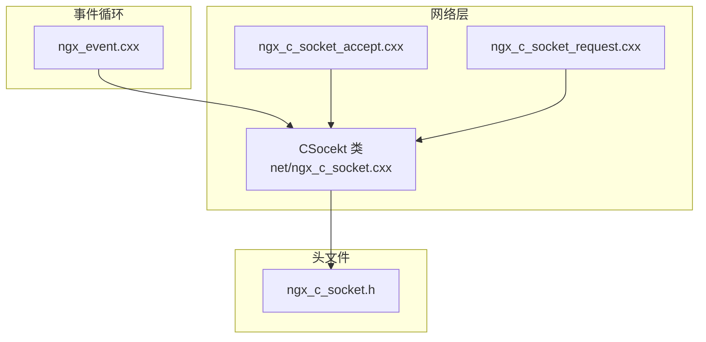
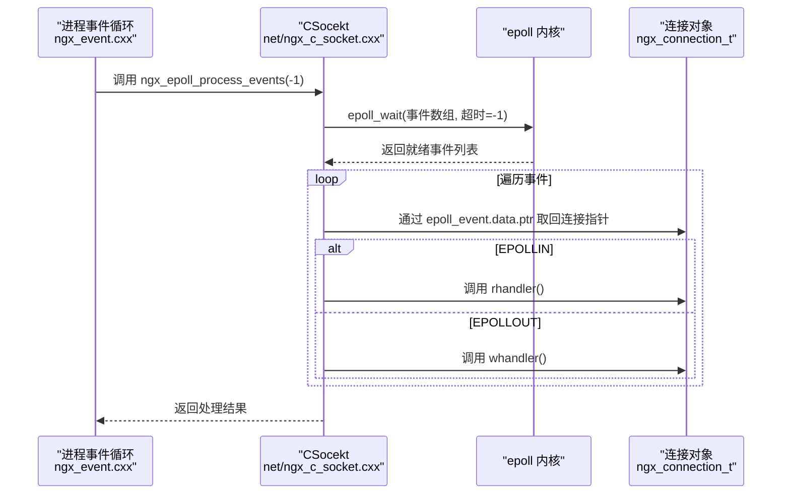
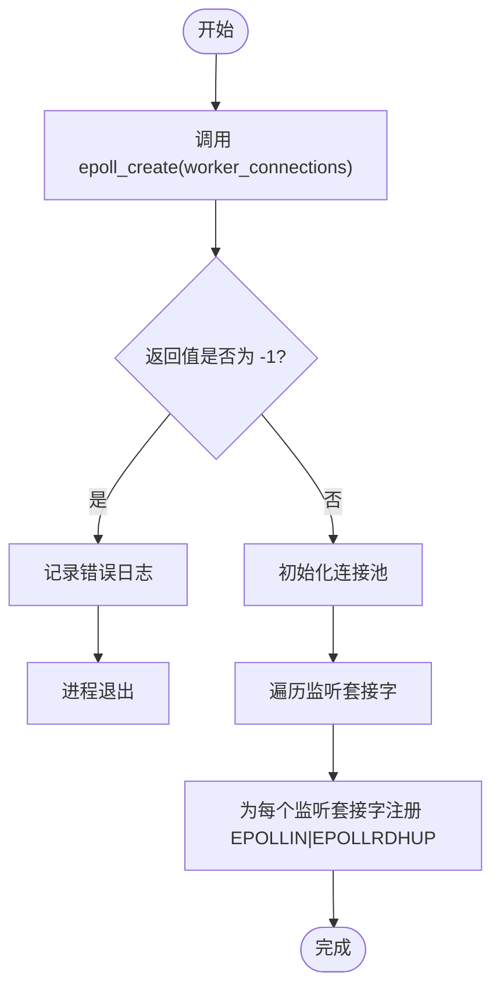
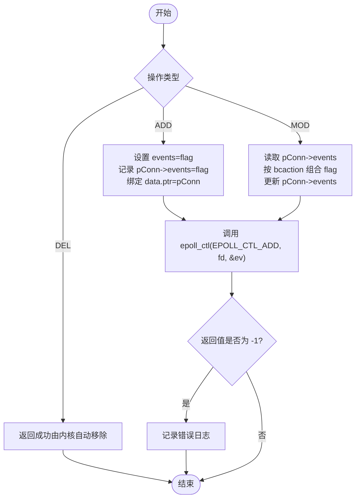
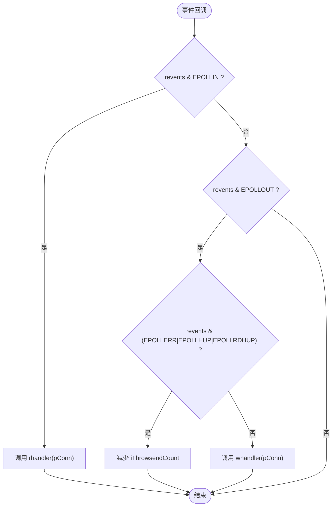
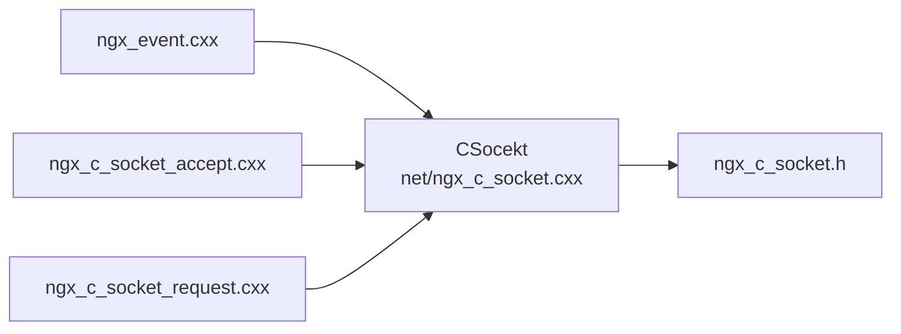

# epoll 初始化和配置

<cite>
**本文档引用的文件**
- [net/ngx_c_socket.cxx](file://net/ngx_c_socket.cxx)
- [include/ngx_c_socket.h](file://include/ngx_c_socket.h)
- [proc/ngx_event.cxx](file://proc/ngx_event.cxx)
- [net/ngx_c_socket_accept.cxx](file://net/ngx_c_socket_accept.cxx)
- [net/ngx_c_socket_request.cxx](file://net/ngx_c_socket_request.cxx)
</cite>

## 目录
1. [简介](#简介)
2. [项目结构](#项目结构)
3. [核心组件](#核心组件)
4. [架构概览](#架构概览)
5. [详细组件分析](#详细组件分析)
6. [依赖关系分析](#依赖关系分析)
7. [性能考量](#性能考量)
8. [故障排查指南](#故障排查指南)
9. [结论](#结论)

## 简介
本文件围绕 epoll 的初始化与配置展开，系统性阐述以下主题：
- epoll_create 的调用过程与参数配置
- epoll_ctl 的使用方法（EPOLL_CTL_ADD、EPOLL_CTL_MOD、EPOLL_CTL_DEL）
- 事件标志位的设置与管理（EPOLLIN、EPOLLOUT、EPOLLRDHUP 等）
- epoll_wait 的事件处理流程
- 错误处理机制、性能调优与最佳实践

## 项目结构
该项目采用模块化设计，网络层以 CSocekt 类为核心，负责监听套接字的创建、epoll 实例的初始化、事件注册与处理、连接管理等。epoll 相关逻辑集中在 net/ngx_c_socket.cxx 中，事件循环在 proc/ngx_event.cxx 中驱动。

图表来源
- [net/ngx_c_socket.cxx](file://net/ngx_c_socket.cxx#L541-L587)
- [proc/ngx_event.cxx](file://proc/ngx_event.cxx#L14-L22)
- [include/ngx_c_socket.h](file://include/ngx_c_socket.h#L103-L258)

章节来源
- [net/ngx_c_socket.cxx](file://net/ngx_c_socket.cxx#L541-L587)
- [proc/ngx_event.cxx](file://proc/ngx_event.cxx#L14-L22)
- [include/ngx_c_socket.h](file://include/ngx_c_socket.h#L103-L258)

## 核心组件
- epoll 实例管理：维护 epoll 句柄、事件数组、连接池与监听套接字集合。
- 事件注册与修改：封装 epoll_ctl 的 ADD/MOD/DEL 操作，统一事件标志位管理。
- 事件处理循环：epoll_wait 阻塞等待事件，回调连接对象的读/写处理器。
- 连接生命周期：接受新连接、注册读事件、发送缓冲区满时注册写事件、断开连接时清理。

章节来源
- [include/ngx_c_socket.h](file://include/ngx_c_socket.h#L205-L227)
- [net/ngx_c_socket.cxx](file://net/ngx_c_socket.cxx#L541-L587)
- [net/ngx_c_socket.cxx](file://net/ngx_c_socket.cxx#L679-L735)
- [net/ngx_c_socket.cxx](file://net/ngx_c_socket.cxx#L757-L821)

## 架构概览
epoll 初始化与事件处理的整体流程如下：

图表来源
- [proc/ngx_event.cxx](file://proc/ngx_event.cxx#L14-L22)
- [net/ngx_c_socket.cxx](file://net/ngx_c_socket.cxx#L757-L821)

## 详细组件分析

### epoll_create 初始化
- 调用时机：子进程初始化阶段，完成监听套接字创建后调用。
- 参数配置：以 worker_connections 作为容量提示，创建 epoll 实例并返回文件描述符。
- 错误处理：失败时记录日志并退出进程，确保系统安全。

图表来源
- [net/ngx_c_socket.cxx](file://net/ngx_c_socket.cxx#L541-L587)

章节来源
- [net/ngx_c_socket.cxx](file://net/ngx_c_socket.cxx#L541-L587)

### epoll_ctl 使用详解
- EPOLL_CTL_ADD：为监听套接字注册读事件（EPOLLIN|EPOLLRDHUP），并将连接对象指针绑定到 epoll_event.data.ptr，以便事件回调时快速定位连接。
- EPOLL_CTL_MOD：在发送缓冲区满时，将 EPOLLOUT 加入事件掩码；在发送完毕后，从事件掩码中移除 EPOLLOUT，避免不必要的写通知。
- EPOLL_CTL_DEL：当前未使用，socket 关闭时由内核自动从红黑树移除。

图表来源
- [net/ngx_c_socket.cxx](file://net/ngx_c_socket.cxx#L679-L735)

章节来源
- [net/ngx_c_socket.cxx](file://net/ngx_c_socket.cxx#L679-L735)

### 事件标志位设置与管理
- EPOLLIN：监听可读事件，用于新连接接入或数据到达。
- EPOLLOUT：监听可写事件，用于发送缓冲区可写时继续发送数据。
- EPOLLRDHUP：监听对端关闭或半关闭，便于及时清理资源。
- 其他标志位：EPOLLERR、EPOLLHUP 等在事件处理中用于判断异常与断开。

图表来源
- [net/ngx_c_socket.cxx](file://net/ngx_c_socket.cxx#L797-L821)

章节来源
- [net/ngx_c_socket.cxx](file://net/ngx_c_socket.cxx#L797-L821)

### epoll_wait 事件处理流程
- 阻塞等待：传入 -1 表示无限等待，直到有事件发生。
- 错误处理：EINTR 视为信号中断，记录日志并继续；其他错误视为异常，记录告警。
- 超时处理：events==0 且超时设置为 -1 时，应视为异常并记录日志。
- 事件遍历：从 epoll_event 数组中取出连接指针，调用对应处理器。

章节来源
- [net/ngx_c_socket.cxx](file://net/ngx_c_socket.cxx#L757-L821)

### 接受新连接与注册事件
- 接受连接：使用 accept4 或 accept 获取新连接，确保非阻塞。
- 注册事件：为新连接注册 EPOLLIN|EPOLLRDHUP，设置读处理器为 ngx_read_request_handler。
- 连接池管理：从连接池中获取空闲连接，绑定地址信息与处理器。

章节来源
- [net/ngx_c_socket_accept.cxx](file://net/ngx_c_socket_accept.cxx#L22-L180)

### 发送流程与写事件管理
- 发送策略：sendproc 循环发送，遇到 EAGAIN 表示发送缓冲区满。
- 注册写事件：发送缓冲区满时，通过 EPOLL_CTL_MOD 添加 EPOLLOUT。
- 清理写事件：发送完毕后，通过 EPOLL_CTL_MOD 移除 EPOLLOUT，避免频繁通知。
- 信号量驱动：发送线程通过信号量触发写事件处理。

章节来源
- [net/ngx_c_socket_request.cxx](file://net/ngx_c_socket_request.cxx#L281-L332)
- [net/ngx_c_socket.cxx](file://net/ngx_c_socket.cxx#L1031-L1076)

## 依赖关系分析
- CSocekt 类依赖 epoll、socket、线程与信号量等系统接口。
- 事件循环通过 ngx_event.cxx 调用 CSocekt 的事件处理函数。
- 接受与请求处理分别在 ngx_c_socket_accept.cxx 与 ngx_c_socket_request.cxx 中实现。

图表来源
- [proc/ngx_event.cxx](file://proc/ngx_event.cxx#L14-L22)
- [net/ngx_c_socket.cxx](file://net/ngx_c_socket.cxx#L541-L587)
- [include/ngx_c_socket.h](file://include/ngx_c_socket.h#L103-L258)

章节来源
- [proc/ngx_event.cxx](file://proc/ngx_event.cxx#L14-L22)
- [net/ngx_c_socket.cxx](file://net/ngx_c_socket.cxx#L541-L587)
- [include/ngx_c_socket.h](file://include/ngx_c_socket.h#L103-L258)

## 性能考量
- 事件数组大小：NGX_MAX_EVENTS 固定为 512，避免过大导致内存浪费与拷贝开销。
- LT vs ET：代码注释中讨论了 LT/ET 的差异，当前实现以 LT 为主，避免边缘触发带来的复杂性。
- 非阻塞 I/O：所有注册到 epoll 的 socket 均设置为非阻塞，提升 epoll 效率。
- 写事件最小化：仅在发送缓冲区满时注册 EPOLLOUT，避免频繁写通知。
- 连接池与延迟回收：通过连接池与延迟回收机制降低频繁分配/释放的开销。

章节来源
- [include/ngx_c_socket.h](file://include/ngx_c_socket.h#L19-L20)
- [net/ngx_c_socket.cxx](file://net/ngx_c_socket.cxx#L632-L675)
- [net/ngx_c_socket.cxx](file://net/ngx_c_socket.cxx#L1031-L1076)

## 故障排查指南
- epoll_create 失败：检查 worker_connections 参数与系统资源限制，确认日志输出并退出进程。
- epoll_wait 返回 -1：区分 EINTR（信号中断）与其它错误，前者记录信息继续，后者记录告警。
- 事件处理异常：检查连接对象的处理器指针是否有效，确保 data.ptr 绑定正确。
- 发送缓冲区满：确认 EPOLLOUT 是否正确注册，发送线程是否被信号量正确唤醒。
- 连接断开识别：关注 EPOLLRDHUP、EPOLLERR、EPOLLHUP 的组合，结合业务逻辑及时清理。

章节来源
- [net/ngx_c_socket.cxx](file://net/ngx_c_socket.cxx#L548-L552)
- [net/ngx_c_socket.cxx](file://net/ngx_c_socket.cxx#L761-L777)
- [net/ngx_c_socket.cxx](file://net/ngx_c_socket.cxx#L808-L818)
- [net/ngx_c_socket_request.cxx](file://net/ngx_c_socket_request.cxx#L281-L332)

## 结论
本项目通过 CSocekt 类将 epoll 的初始化、事件注册与处理进行了高度封装，形成清晰的事件驱动模型。epoll_create 以 worker_connections 为容量提示，epoll_ctl 支持 ADD/MOD/DEL，事件标志位合理组合（EPOLLIN、EPOLLOUT、EPOLLRDHUP），配合 epoll_wait 的事件循环，实现了高效的网络 I/O 处理。在性能方面，通过非阻塞 I/O、写事件最小化与连接池管理，有效降低了系统开销。建议在生产环境中：
- 明确 LT/ET 的适用场景，根据业务复杂度选择合适的触发模式。
- 监控 epoll_wait 的返回值与错误码，完善日志与告警机制。
- 优化发送流程，避免不必要的写事件注册与唤醒。