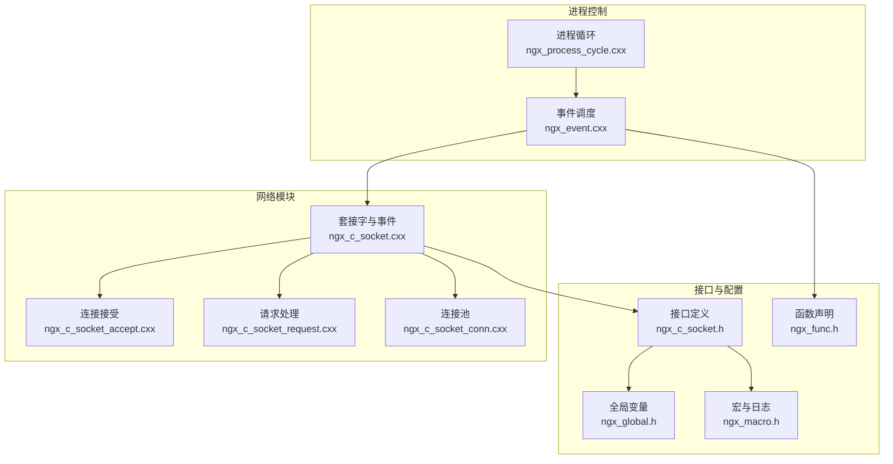
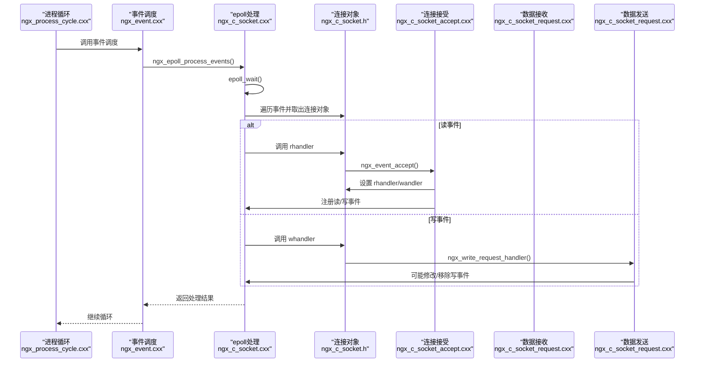
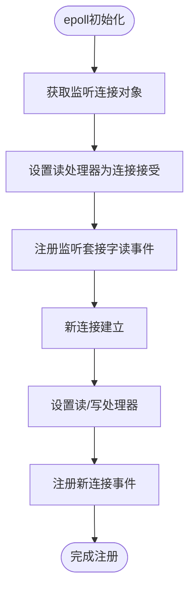
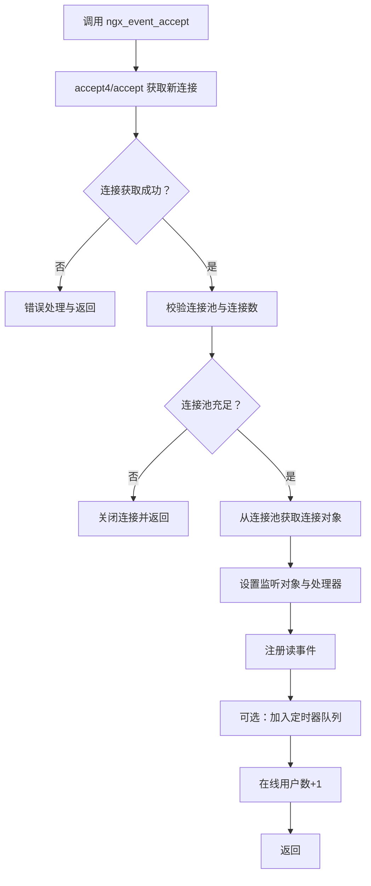
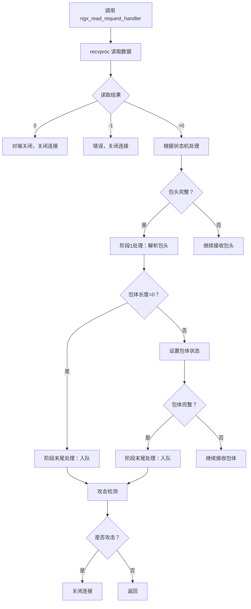
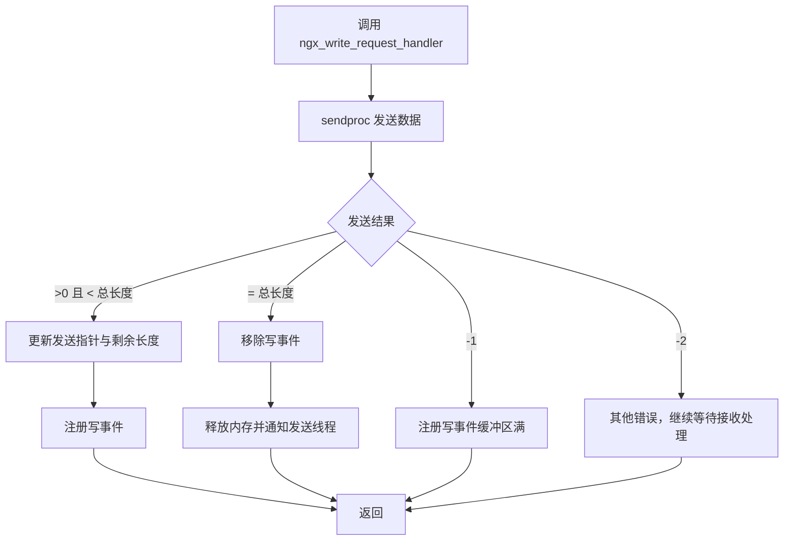
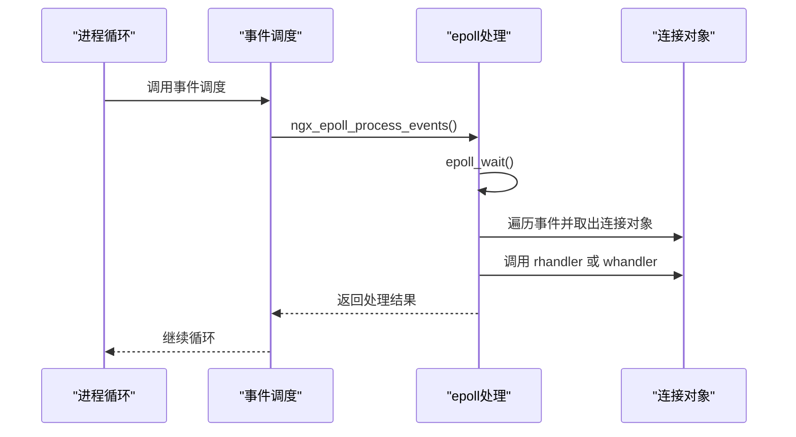
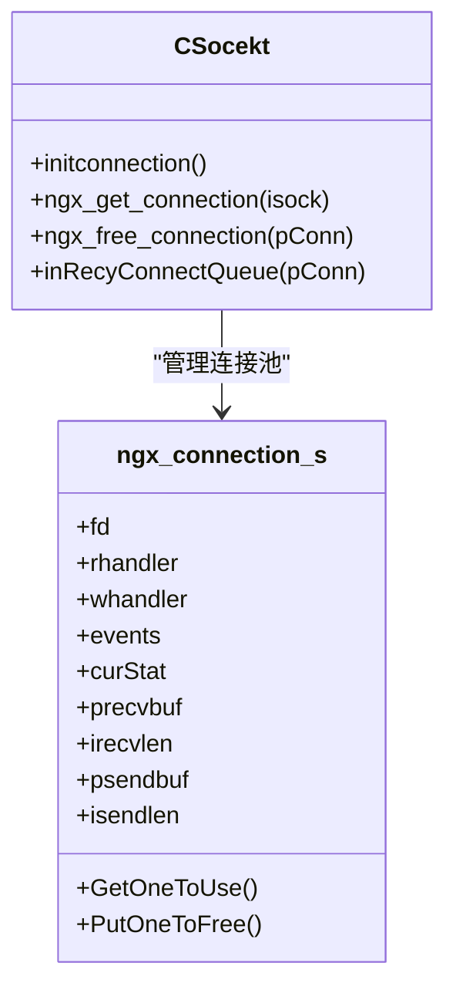
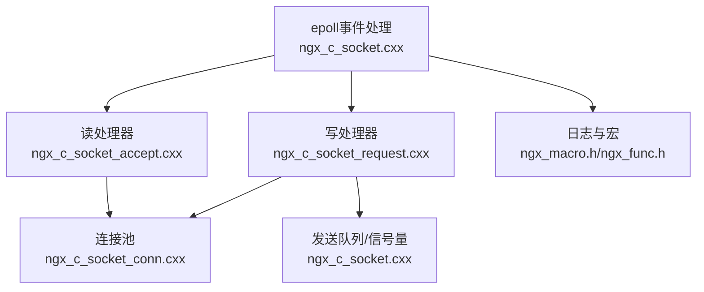

# 事件处理器

<cite>
**本文档引用的文件**
- [proc/ngx_event.cxx](file://proc/ngx_event.cxx)
- [net/ngx_c_socket_accept.cxx](file://net/ngx_c_socket_accept.cxx)
- [net/ngx_c_socket_request.cxx](file://net/ngx_c_socket_request.cxx)
- [net/ngx_c_socket.cxx](file://net/ngx_c_socket.cxx)
- [net/ngx_c_socket_conn.cxx](file://net/ngx_c_socket_conn.cxx)
- [include/ngx_c_socket.h](file://include/ngx_c_socket.h)
- [include/ngx_global.h](file://include/ngx_global.h)
- [include/ngx_macro.h](file://include/ngx_macro.h)
- [include/ngx_func.h](file://include/ngx_func.h)
- [proc/ngx_process_cycle.cxx](file://proc/ngx_process_cycle.cxx)
</cite>

## 目录
1. [简介](#简介)
2. [项目结构](#项目结构)
3. [核心组件](#核心组件)
4. [架构概览](#架构概览)
5. [详细组件分析](#详细组件分析)
6. [依赖关系分析](#依赖关系分析)
7. [性能考量](#性能考量)
8. [故障排查指南](#故障排查指南)
9. [结论](#结论)

## 简介
本文件面向事件处理器的实现与扩展，系统性阐述以下主题：
- 不同类型事件的处理机制：连接接受事件（ngx_event_accept）、数据接收事件（ngx_read_request_handler）、数据发送事件（ngx_write_request_handler）等核心处理器的实现与协作。
- 事件处理器的注册机制：如何将处理器函数与特定事件类型关联，以及事件上下文在连接对象中的传递。
- 事件处理的上下文传递：连接对象、事件标志位、处理状态的管理与一致性保障。
- 具体实现模式与扩展方法：基于现有代码的模式总结与最佳实践。
- 错误处理、性能优化与调试技巧：结合代码中的错误处理策略与性能优化点，给出实用建议。

## 项目结构
该项目采用模块化组织，事件处理相关的核心代码集中在网络模块与进程控制模块：
- 网络模块（net/）：包含套接字操作、事件循环、连接池、收发处理等。
- 进程控制模块（proc/）：包含事件循环调度、进程生命周期管理等。
- 头文件（include/）：定义事件处理器类型、连接结构、宏与全局变量等。

图表来源
- [proc/ngx_process_cycle.cxx](file://proc/ngx_process_cycle.cxx#L360-L399)
- [proc/ngx_event.cxx](file://proc/ngx_event.cxx#L14-L22)
- [net/ngx_c_socket.cxx](file://net/ngx_c_socket.cxx#L541-L587)
- [net/ngx_c_socket_accept.cxx](file://net/ngx_c_socket_accept.cxx#L22-L180)
- [net/ngx_c_socket_request.cxx](file://net/ngx_c_socket_request.cxx#L25-L114)
- [net/ngx_c_socket_conn.cxx](file://net/ngx_c_socket_conn.cxx#L77-L156)
- [include/ngx_c_socket.h](file://include/ngx_c_socket.h#L26-L91)
- [include/ngx_global.h](file://include/ngx_global.h#L28-L46)
- [include/ngx_macro.h](file://include/ngx_macro.h#L18-L27)
- [include/ngx_func.h](file://include/ngx_func.h#L21-L26)

章节来源
- [proc/ngx_process_cycle.cxx](file://proc/ngx_process_cycle.cxx#L360-L399)
- [proc/ngx_event.cxx](file://proc/ngx_event.cxx#L14-L22)
- [net/ngx_c_socket.cxx](file://net/ngx_c_socket.cxx#L541-L587)

## 核心组件
- 事件处理器类型与连接结构
  - 事件处理器类型：通过成员函数指针类型定义，用于将具体处理函数与连接对象绑定。
  - 连接结构：包含文件描述符、读写处理器指针、事件标志、收发缓冲区、状态机等字段，作为事件上下文的载体。
- 事件循环与调度
  - 事件循环：通过 epoll_wait 获取事件，遍历事件并调用连接对象的处理器函数。
  - 调度入口：进程循环中调用事件调度函数，后者再调用 epoll 事件处理函数。
- 事件处理器注册
  - 监听端口：为监听套接字设置读处理器为连接接受处理器。
  - 新连接：为新连接设置读处理器为数据接收处理器、写处理器为数据发送处理器。
- 事件上下文传递
  - epoll_event.data.ptr：将连接对象指针与事件绑定，事件回调时可直接取出连接对象。
  - 连接对象字段：events、rhandler、whandler、收发缓冲区、状态机等，承载事件处理所需的上下文。

章节来源
- [include/ngx_c_socket.h](file://include/ngx_c_socket.h#L26-L91)
- [net/ngx_c_socket.cxx](file://net/ngx_c_socket.cxx#L541-L587)
- [net/ngx_c_socket.cxx](file://net/ngx_c_socket.cxx#L757-L821)
- [proc/ngx_event.cxx](file://proc/ngx_event.cxx#L14-L22)

## 架构概览
事件处理的整体流程如下：
- 进程循环启动事件调度，事件调度调用 epoll 事件处理。
- epoll_wait 返回事件后，根据事件类型调用连接对象的读/写处理器。
- 读处理器处理连接接受或数据接收，写处理器处理数据发送。
- 处理器内部根据状态机与缓冲区信息决定是否注册写事件、是否释放连接等。

图表来源
- [proc/ngx_process_cycle.cxx](file://proc/ngx_process_cycle.cxx#L360-L399)
- [proc/ngx_event.cxx](file://proc/ngx_event.cxx#L14-L22)
- [net/ngx_c_socket.cxx](file://net/ngx_c_socket.cxx#L757-L821)
- [net/ngx_c_socket_accept.cxx](file://net/ngx_c_socket_accept.cxx#L22-L180)
- [net/ngx_c_socket_request.cxx](file://net/ngx_c_socket_request.cxx#L281-L332)

## 详细组件分析

### 事件处理器注册机制
- 监听端口注册
  - 在 epoll 初始化阶段，为每个监听套接字获取连接对象并设置读处理器为连接接受处理器，然后将监听套接字的读事件注册到 epoll。
- 新连接注册
  - 连接接受处理器在成功建立连接后，为新连接设置读处理器为数据接收处理器、写处理器为数据发送处理器，并注册相应的读/写事件。
- 事件标志位管理
  - 通过 epoll 操作函数维护连接对象的事件标志位，支持增加、移除或完全覆盖事件标志。

图表来源
- [net/ngx_c_socket.cxx](file://net/ngx_c_socket.cxx#L541-L587)
- [net/ngx_c_socket_accept.cxx](file://net/ngx_c_socket_accept.cxx#L154-L169)

章节来源
- [net/ngx_c_socket.cxx](file://net/ngx_c_socket.cxx#L541-L587)
- [net/ngx_c_socket_accept.cxx](file://net/ngx_c_socket_accept.cxx#L154-L169)

### 连接接受事件（ngx_event_accept）
- 功能概述
  - 接受新连接，设置非阻塞、校验连接池与连接数量、设置读写处理器、注册事件、更新在线用户数。
- 关键流程
  - 使用 accept4 或 accept 获取新连接，设置非阻塞（若使用 accept4 则无需再次设置）。
  - 校验连接池与连接数量，防止过载。
  - 从连接池获取连接对象，设置监听对象、读写处理器、事件标志。
  - 注册读事件，将连接加入定时器队列（可选）。
- 错误处理
  - 对 EAGAIN、ECONNABORTED、EMFILE、ENFILE 等错误进行分类处理，必要时关闭连接或延迟处理。

图表来源
- [net/ngx_c_socket_accept.cxx](file://net/ngx_c_socket_accept.cxx#L22-L180)

章节来源
- [net/ngx_c_socket_accept.cxx](file://net/ngx_c_socket_accept.cxx#L22-L180)

### 数据接收事件（ngx_read_request_handler）
- 功能概述
  - 从连接中接收数据，根据状态机处理包头与包体，将完整包入队交由业务线程处理。
- 关键流程
  - 调用接收函数读取数据，处理对端关闭与错误。
  - 根据当前状态（包头初始、包头接收中、包体初始、包体接收中）推进状态机。
  - 包头完整时调用阶段1处理函数，包体完整时调用阶段末尾处理函数。
  - 攻击检测：若启用，检测到攻击则关闭连接。
- 错误处理
  - 对 EAGAIN、EINTR 等进行区分处理，非预期错误则关闭连接并回收资源。

图表来源
- [net/ngx_c_socket_request.cxx](file://net/ngx_c_socket_request.cxx#L25-L114)
- [net/ngx_c_socket_request.cxx](file://net/ngx_c_socket_request.cxx#L116-L154)
- [net/ngx_c_socket_request.cxx](file://net/ngx_c_socket_request.cxx#L160-L233)

章节来源
- [net/ngx_c_socket_request.cxx](file://net/ngx_c_socket_request.cxx#L25-L114)
- [net/ngx_c_socket_request.cxx](file://net/ngx_c_socket_request.cxx#L116-L154)
- [net/ngx_c_socket_request.cxx](file://net/ngx_c_socket_request.cxx#L160-L233)

### 数据发送事件（ngx_write_request_handler）
- 功能概述
  - 处理写事件，发送剩余数据，必要时注册写事件等待内核可写通知。
- 关键流程
  - 调用发送函数尝试发送数据，根据返回值更新发送指针与剩余长度。
  - 若发送未完成，注册写事件；若发送完成，移除写事件并释放内存。
  - 通过信号量通知发送线程继续处理。
- 错误处理
  - 对 EAGAIN、EINTR 等进行区分处理，发送缓冲区满时注册写事件等待内核通知。

图表来源
- [net/ngx_c_socket_request.cxx](file://net/ngx_c_socket_request.cxx#L281-L332)
- [net/ngx_c_socket_request.cxx](file://net/ngx_c_socket_request.cxx#L240-L277)

章节来源
- [net/ngx_c_socket_request.cxx](file://net/ngx_c_socket_request.cxx#L281-L332)
- [net/ngx_c_socket_request.cxx](file://net/ngx_c_socket_request.cxx#L240-L277)

### 事件循环与调度
- 事件循环
  - 事件循环函数调用 epoll 事件处理函数，遍历事件并调用连接对象的处理器函数。
  - 对读事件调用读处理器，对写事件调用写处理器。
- 调度入口
  - 进程循环中调用事件调度函数，事件调度函数再调用 epoll 事件处理函数。

图表来源
- [proc/ngx_process_cycle.cxx](file://proc/ngx_process_cycle.cxx#L360-L399)
- [proc/ngx_event.cxx](file://proc/ngx_event.cxx#L14-L22)
- [net/ngx_c_socket.cxx](file://net/ngx_c_socket.cxx#L757-L821)

章节来源
- [proc/ngx_process_cycle.cxx](file://proc/ngx_process_cycle.cxx#L360-L399)
- [proc/ngx_event.cxx](file://proc/ngx_event.cxx#L14-L22)
- [net/ngx_c_socket.cxx](file://net/ngx_c_socket.cxx#L757-L821)

### 连接池与内存管理
- 连接池初始化
  - 在 epoll 初始化时创建固定数量的连接对象，分别加入“所有连接”和“空闲连接”列表。
- 连接获取与释放
  - 获取连接时从空闲列表摘取，必要时动态创建；释放连接时回收到空闲列表。
- 延迟回收
  - 断开连接后将连接放入回收队列，由专门线程在设定时间后统一回收，避免立即释放导致竞态。

图表来源
- [net/ngx_c_socket_conn.cxx](file://net/ngx_c_socket_conn.cxx#L77-L156)
- [net/ngx_c_socket_conn.cxx](file://net/ngx_c_socket_conn.cxx#L193-L278)
- [include/ngx_c_socket.h](file://include/ngx_c_socket.h#L38-L91)

章节来源
- [net/ngx_c_socket_conn.cxx](file://net/ngx_c_socket_conn.cxx#L77-L156)
- [net/ngx_c_socket_conn.cxx](file://net/ngx_c_socket_conn.cxx#L193-L278)
- [include/ngx_c_socket.h](file://include/ngx_c_socket.h#L38-L91)

## 依赖关系分析
- 组件耦合
  - 事件循环与处理器：epoll 事件处理函数依赖连接对象的处理器指针，形成松耦合。
  - 处理器与连接池：处理器通过连接池获取/释放连接，避免重复创建。
  - 处理器与发送线程：通过信号量与发送队列协作，实现异步发送。
- 外部依赖
  - epoll：事件驱动核心，事件类型与标志位直接影响处理逻辑。
  - 线程与信号量：用于发送队列的异步处理与线程间同步。
  - 日志与宏：日志级别与错误处理策略由宏与日志函数统一管理。

图表来源
- [net/ngx_c_socket.cxx](file://net/ngx_c_socket.cxx#L757-L821)
- [net/ngx_c_socket_accept.cxx](file://net/ngx_c_socket_accept.cxx#L22-L180)
- [net/ngx_c_socket_request.cxx](file://net/ngx_c_socket_request.cxx#L281-L332)
- [net/ngx_c_socket_conn.cxx](file://net/ngx_c_socket_conn.cxx#L77-L156)
- [include/ngx_macro.h](file://include/ngx_macro.h#L18-L27)
- [include/ngx_func.h](file://include/ngx_func.h#L13-L26)

章节来源
- [net/ngx_c_socket.cxx](file://net/ngx_c_socket.cxx#L757-L821)
- [net/ngx_c_socket_accept.cxx](file://net/ngx_c_socket_accept.cxx#L22-L180)
- [net/ngx_c_socket_request.cxx](file://net/ngx_c_socket_request.cxx#L281-L332)
- [net/ngx_c_socket_conn.cxx](file://net/ngx_c_socket_conn.cxx#L77-L156)
- [include/ngx_macro.h](file://include/ngx_macro.h#L18-L27)
- [include/ngx_func.h](file://include/ngx_func.h#L13-L26)

## 性能考量
- epoll 触发模式
  - 代码注释指出支持水平触发与边缘触发，边缘触发需要非阻塞 I/O 与循环读取，以避免丢失事件。
- 发送缓冲区管理
  - 发送未完成时注册写事件，避免 LT 模式下频繁写通知；发送完成时移除写事件，降低内核通知开销。
- 连接池与内存
  - 连接池在高负载下可能动态创建连接，存在资源耗尽风险；建议设置最大连接限额并配合延迟回收线程。
- 线程与队列
  - 发送队列通过信号量与互斥量保护，避免竞争；队列过长时进行丢弃与限流，保护服务器稳定性。

章节来源
- [net/ngx_c_socket.cxx](file://net/ngx_c_socket.cxx#L632-L675)
- [net/ngx_c_socket_request.cxx](file://net/ngx_c_socket_request.cxx#L1099-L1105)
- [net/ngx_c_socket_conn.cxx](file://net/ngx_c_socket_conn.cxx#L1-L2)
- [net/ngx_c_socket.cxx](file://net/ngx_c_socket.cxx#L422-L429)

## 故障排查指南
- epoll_wait 返回异常
  - EINTR：由信号导致的中断，属于正常情况，记录日志后继续运行。
  - 其他错误：记录告警日志，检查 epoll 句柄与事件注册。
- 接收错误处理
  - EAGAIN/EWOULDBLOCK：LT 模式下不应出现，记录日志；ET 模式下表示缓冲区无数据，继续等待。
  - EINTR：记录日志，继续处理。
  - 其他错误：关闭连接并回收资源。
- 发送错误处理
  - EAGAIN：发送缓冲区满，注册写事件等待内核通知。
  - EINTR：记录日志，等待下次循环。
  - 其他错误：返回 -2，等待接收处理统一断开。
- 连接池与回收
  - 连接池不足：检查最大连接数配置与动态创建逻辑。
  - 延迟回收：确认回收线程运行状态与回收时间设置。

章节来源
- [net/ngx_c_socket.cxx](file://net/ngx_c_socket.cxx#L757-L790)
- [net/ngx_c_socket_request.cxx](file://net/ngx_c_socket_request.cxx#L130-L150)
- [net/ngx_c_socket_request.cxx](file://net/ngx_c_socket_request.cxx#L258-L276)
- [net/ngx_c_socket_conn.cxx](file://net/ngx_c_socket_conn.cxx#L193-L278)

## 结论
本事件处理器体系通过 epoll 驱动、连接池管理与处理器注册机制，实现了高效的网络事件处理。核心优势在于：
- 明确的事件类型与处理器绑定，便于扩展与维护。
- 状态机与缓冲区管理确保数据收发的正确性。
- 异步发送与延迟回收提升系统稳定性与性能。
建议在高并发场景下进一步完善连接池上限控制、优化边缘触发模式下的读取循环，并加强监控与日志以辅助故障排查。