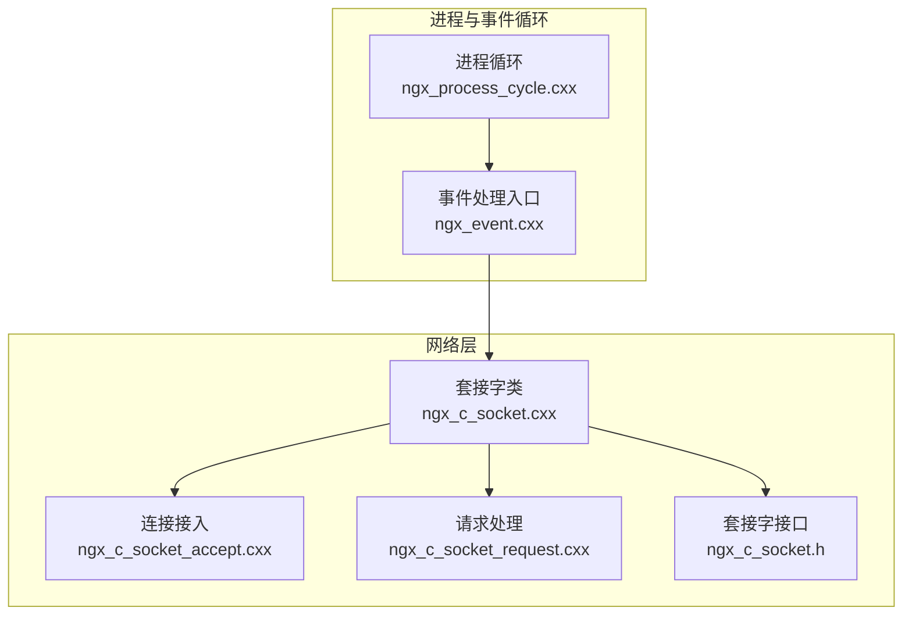
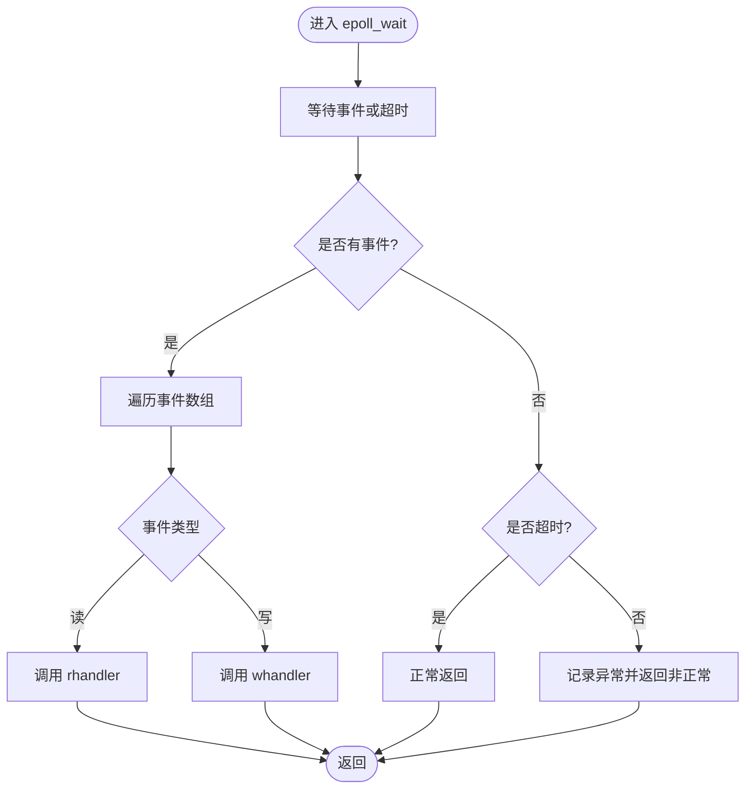
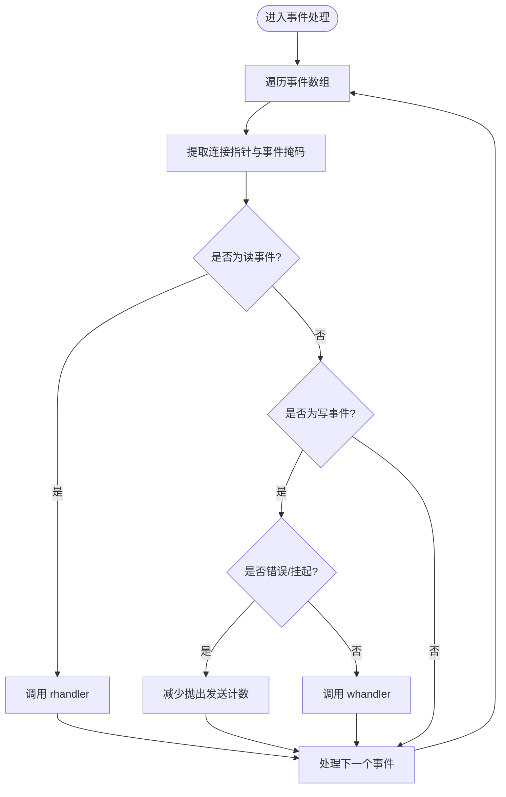
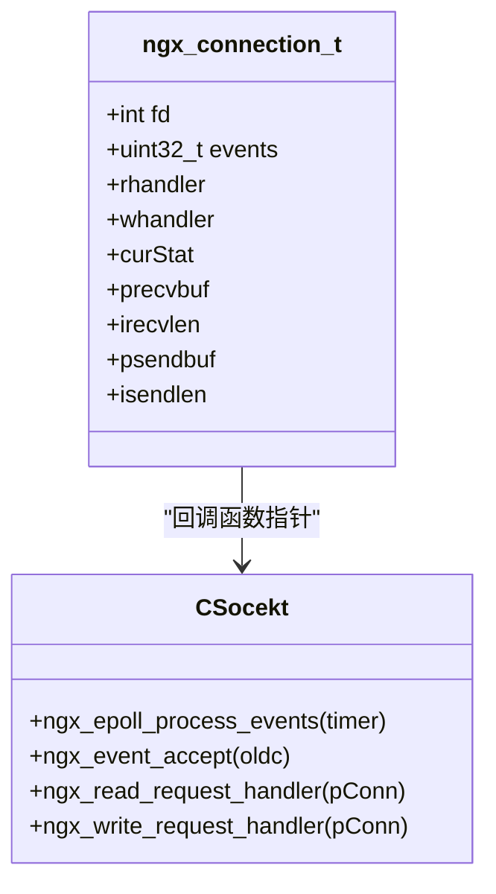
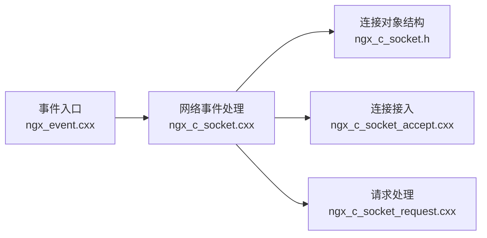

# 事件处理循环

<cite>
**本文档引用的文件**
- [ngx_event.cxx](file://proc/ngx_event.cxx)
- [ngx_process_cycle.cxx](file://proc/ngx_process_cycle.cxx)
- [ngx_c_socket.cxx](file://net/ngx_c_socket.cxx)
- [ngx_c_socket.h](file://include/ngx_c_socket.h)
- [ngx_c_socket_accept.cxx](file://net/ngx_c_socket_accept.cxx)
- [ngx_c_socket_request.cxx](file://net/ngx_c_socket_request.cxx)
</cite>

## 目录
1. [简介](#简介)
2. [项目结构](#项目结构)
3. [核心组件](#核心组件)
4. [架构概览](#架构概览)
5. [详细组件分析](#详细组件分析)
6. [依赖关系分析](#依赖关系分析)
7. [性能考量](#性能考量)
8. [故障排查指南](#故障排查指南)
9. [结论](#结论)

## 简介
本文件围绕事件处理循环展开，重点阐述 epoll_wait 的工作机制与调用时机，包括阻塞等待、超时处理与事件分发的完整流程；详细说明事件循环的实现细节，涵盖事件遍历、事件类型判断、回调函数调用等核心逻辑；解释事件处理器的设计模式，包括 rhandler、whandler 等回调函数的注册与执行机制；提供事件处理的并发控制、错误恢复与调试方法。

## 项目结构
事件处理循环主要分布在以下模块：
- 事件循环入口与调度：proc/ngx_event.cxx、proc/ngx_process_cycle.cxx
- 网络事件与回调：net/ngx_c_socket.cxx、net/ngx_c_socket_accept.cxx、net/ngx_c_socket_request.cxx
- 数据结构与接口：include/ngx_c_socket.h



图表来源
- [ngx_process_cycle.cxx](file://proc/ngx_process_cycle.cxx#L915-L927)
- [ngx_event.cxx](file://proc/ngx_event.cxx#L14-L22)
- [ngx_c_socket.cxx](file://net/ngx_c_socket.cxx#L757-L821)
- [ngx_c_socket_accept.cxx](file://net/ngx_c_socket_accept.cxx#L22-L180)
- [ngx_c_socket_request.cxx](file://net/ngx_c_socket_request.cxx#L25-L114)
- [ngx_c_socket.h](file://include/ngx_c_socket.h#L38-L91)

章节来源
- [ngx_process_cycle.cxx](file://proc/ngx_process_cycle.cxx#L915-L927)
- [ngx_event.cxx](file://proc/ngx_event.cxx#L14-L22)

## 核心组件
- 事件循环入口：在子进程死循环中调用事件处理函数，实现阻塞等待与事件分发。
- epoll_wait 封装：对 epoll_wait 的调用、错误处理与超时处理进行统一封装。
- 事件回调模型：通过连接对象中的 rhandler、whandler 成员函数指针实现事件回调。
- 事件类型判断与分发：根据 revents 掩码区分读/写事件并调用对应回调。
- 连接对象与事件注册：连接对象包含事件掩码与回调指针，epoll_ctl 将 fd 与连接对象绑定。

章节来源
- [ngx_event.cxx](file://proc/ngx_event.cxx#L14-L22)
- [ngx_c_socket.cxx](file://net/ngx_c_socket.cxx#L757-L821)
- [ngx_c_socket.h](file://include/ngx_c_socket.h#L38-L91)

## 架构概览
事件处理循环采用“事件驱动 + 回调”的设计模式：
- 子进程在循环中调用事件处理函数，传入阻塞等待参数。
- epoll_wait 在无事件时阻塞，有事件或超时时返回。
- 遍历返回的事件数组，根据 revents 类型调用 rhandler 或 whandler。
- 读事件通常触发数据接收与解析，写事件触发数据发送与缓冲区管理。

```mermaid
sequenceDiagram
participant Worker as "工作进程"
participant Loop as "事件循环"
participant Epoll as "epoll_wait"
participant Conn as "连接对象"
participant RCB as "rhandler"
participant WCB as "whandler"
Worker->>Loop : 进入循环
Loop->>Epoll : epoll_wait(-1)
Epoll-->>Loop : 返回事件数量
Loop->>Loop : 遍历事件数组
alt 事件为读
Loop->>Conn : 取出连接指针
Loop->>RCB : 调用 rhandler(pConn)
else 事件为写
Loop->>Conn : 取出连接指针
Loop->>WCB : 调用 whandler(pConn)
end
Loop-->>Worker : 循环继续
```

图表来源
- [ngx_process_cycle.cxx](file://proc/ngx_process_cycle.cxx#L915-L927)
- [ngx_c_socket.cxx](file://net/ngx_c_socket.cxx#L757-L821)

## 详细组件分析

### epoll_wait 机制与调用时机
- 调用时机：在子进程的事件循环中，通过事件处理入口函数调用，传入阻塞等待参数。
- 阻塞等待：传入 -1 表示无限等待，直至有事件发生或被信号中断。
- 超时处理：当传入非负超时值时，epoll_wait 在指定时间后返回；若返回 0 且非超时场景，视为异常。
- 错误处理：对 EINTR（信号中断）视为正常，其余错误记录日志并返回非正常状态。



图表来源
- [ngx_c_socket.cxx](file://net/ngx_c_socket.cxx#L757-L821)

章节来源
- [ngx_c_socket.cxx](file://net/ngx_c_socket.cxx#L757-L821)

### 事件遍历与事件类型判断
- 事件遍历：遍历 epoll_wait 返回的事件数量，逐个取出连接指针与事件掩码。
- 事件类型判断：根据 revents 掩码判断是否为读事件或写事件；写事件中进一步区分错误/挂起等特殊情况。
- 回调调用：通过连接对象的 rhandler/whandler 成员函数指针调用对应处理函数。



图表来源
- [ngx_c_socket.cxx](file://net/ngx_c_socket.cxx#L797-L820)

章节来源
- [ngx_c_socket.cxx](file://net/ngx_c_socket.cxx#L797-L820)

### 回调函数注册与执行机制（rhandler、whandler）
- 注册时机：新连接建立时，设置连接对象的 rhandler 与 whandler 指针。
- 回调类型：rhandler 用于读事件处理（如数据接收与解析），whandler 用于写事件处理（如发送缓冲区管理与发送完成后的清理）。
- 执行路径：事件循环中根据 revents 类型调用对应回调，形成“事件 -> 连接对象 -> 回调函数”的链路。



图表来源
- [ngx_c_socket.h](file://include/ngx_c_socket.h#L38-L91)
- [ngx_c_socket_accept.cxx](file://net/ngx_c_socket_accept.cxx#L154-L155)
- [ngx_c_socket_request.cxx](file://net/ngx_c_socket_request.cxx#L25-L114)
- [ngx_c_socket.cxx](file://net/ngx_c_socket.cxx#L757-L821)

章节来源
- [ngx_c_socket_accept.cxx](file://net/ngx_c_socket_accept.cxx#L154-L155)
- [ngx_c_socket_request.cxx](file://net/ngx_c_socket_request.cxx#L25-L114)
- [ngx_c_socket.h](file://include/ngx_c_socket.h#L38-L91)

### 事件处理循环实现模式
- 子进程循环：在子进程初始化后进入死循环，每轮循环调用事件处理入口函数。
- 事件处理入口：调用网络层的事件处理函数，传入阻塞等待参数。
- 统计与打印：事件处理后打印统计信息，便于监控与调试。

```mermaid
sequenceDiagram
participant Init as "子进程初始化"
participant Loop as "事件循环"
participant Entry as "事件处理入口"
participant Net as "网络层事件处理"
Init->>Loop : 进入循环
loop 每轮循环
Loop->>Entry : 调用事件处理入口
Entry->>Net : 调用 ngx_epoll_process_events(-1)
Net-->>Entry : 返回
Entry->>Entry : 打印统计信息
end
```

图表来源
- [ngx_process_cycle.cxx](file://proc/ngx_process_cycle.cxx#L915-L927)
- [ngx_event.cxx](file://proc/ngx_event.cxx#L14-L22)
- [ngx_c_socket.cxx](file://net/ngx_c_socket.cxx#L757-L760)

章节来源
- [ngx_process_cycle.cxx](file://proc/ngx_process_cycle.cxx#L915-L927)
- [ngx_event.cxx](file://proc/ngx_event.cxx#L14-L22)

### 性能优化技巧
- 批量处理：在事件处理中对事件数组进行遍历，一次性处理多个事件，减少系统调用次数。
- 阻塞等待：使用 -1 作为超时参数，实现无事件时的高效休眠，降低 CPU 占用。
- 事件类型分流：通过 revents 掩码快速判断事件类型，避免不必要的分支判断。
- 回调解耦：通过连接对象的回调指针实现事件与处理逻辑的解耦，提升可维护性与扩展性。

章节来源
- [ngx_c_socket.cxx](file://net/ngx_c_socket.cxx#L757-L821)

## 依赖关系分析
事件处理循环涉及的依赖关系如下：
- 事件循环入口依赖网络层事件处理函数。
- 网络层事件处理函数依赖连接对象结构与 epoll 接口。
- 连接对象结构定义了回调函数指针与事件掩码，支撑事件分发。



图表来源
- [ngx_event.cxx](file://proc/ngx_event.cxx#L14-L22)
- [ngx_c_socket.cxx](file://net/ngx_c_socket.cxx#L757-L821)
- [ngx_c_socket.h](file://include/ngx_c_socket.h#L38-L91)
- [ngx_c_socket_accept.cxx](file://net/ngx_c_socket_accept.cxx#L22-L180)
- [ngx_c_socket_request.cxx](file://net/ngx_c_socket_request.cxx#L25-L114)

章节来源
- [ngx_c_socket.h](file://include/ngx_c_socket.h#L38-L91)

## 性能考量
- epoll_wait 的阻塞等待与事件批量处理显著降低 CPU 占用。
- 通过连接对象的回调指针实现事件与处理逻辑的解耦，提升扩展性。
- 在写事件中对错误/挂起情况进行特殊处理，避免无效操作。
- 事件类型判断与回调调用路径简洁明确，减少分支判断开销。

## 故障排查指南
- epoll_wait 返回 0 且非超时：记录异常日志，检查系统状态与资源限制。
- EINTR 错误：视为信号中断，记录日志并继续运行。
- 写事件中的错误/挂起：减少抛出发送计数，避免重复处理。
- 连接对象状态异常：检查连接池与回收机制，确保连接正确释放。

章节来源
- [ngx_c_socket.cxx](file://net/ngx_c_socket.cxx#L761-L790)
- [ngx_c_socket_request.cxx](file://net/ngx_c_socket_request.cxx#L288-L300)

## 结论
事件处理循环通过 epoll_wait 的阻塞等待与事件批量处理，结合 rhandler/whandler 回调机制，实现了高效的事件驱动模型。该设计在保证低 CPU 占用的同时，提供了良好的扩展性与可维护性。通过对事件类型判断与回调调用路径的优化，进一步提升了整体性能与稳定性。